# 1. ArmPi Ultra User Manual

## 1.1 ArmPi Ultra Version Overview

The ArmPi Ultra is a desktop-class AI vision robotic arm developed by Hiwonder, designed specifically for ROS-based educational applications. Powered by a Raspberry Pi controller, it is equipped with a 3D depth camera that integrates 3D vision with robotic arm control. This enables not only 3D motion control, but also object detection, tracking, and grasping in three-dimensional space.

With onboard computing, you can train machine learning models directly on the controller. The ArmPi Ultra supports image recognition and, through Python programming, can be extended to a wide range of AI-powered creative projects such as gesture control and voice interaction.

(1) ArmPi Ultra Starter Packing list

| **No.** | **Components**                                        | **Quantity** |                         **Picture**                          |
| :------ | :---------------------------------------------------- | :----------- | :----------------------------------------------------------: |
| 1       | ArmPi Ultra                                           | 1            |  |
| 2       | Monocular camera                                      | 1            |  |
| 3       | Monocular camera cable(650mm)                         | 1            |  |
| 4       | Raspberry Pi 5 + Power supply cable                   | 1            |  |
| 5       | Cooling fan                                           | 1            |  |
| 6       | Raspberry Pi mini adapter board                       | 1            |  |
| 7       | Upper + Back controller cover                         | 1            |  |
| 8       | Suction cups                                          | 4            |  |
| 9       | 7.5V 6A power adapter(DC 5.5*2.5 Male connector)      | 1            |  |
| 10      | Power supply cable(DC 5.5*2.5 female connector;200mm) | 1            |  |
| 11      | Wireless controller                                   | 1            |  |
| 12      | 64G TF Card                                           | 1            |  |
| 13      | Card Reader                                           | 1            |  |
| 14      | Type-C cable(100mm)                                   | 1            |  |
| 15      | Tags(30*30mm)                                         | 3            |  |
| 16      | Waste cards(40mm)                                     | 1            |  |
| 17      | Map(640*430mm)                                        | 1            |  |
| 18      | Colored blocks(30*30mm)                               | 3            |  |
| 19      | Wooden blocks(40*40mm)                                | 4            |  |
| 20      | Cuboid(30*45mm)                                       | 1            |  |
| 21      | Cylinder(30*45mm)                                     | 1            |  |
| 22      | Tape(5mm*8m)                                          | 1            | 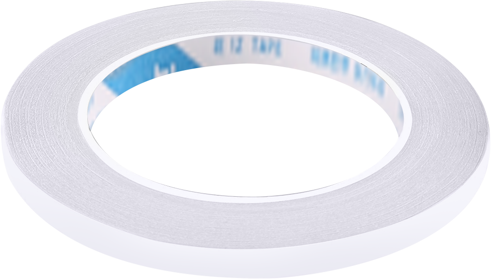 |
| 23      | Accesorry bag                                         | 1            |  |
| 24      | User manual                                           | 1            |  |

(2) ArmPi Ultra Standard Packing list

| **No.** | **Components**                                        | **Quantity** |                         **Picture**                          |
| :------ | :---------------------------------------------------- | :----------- | :----------------------------------------------------------: |
| 1       | ArmPi Ultra                                           | 1            |  |
| 2       | Depth camera + cable                                  | 2            | 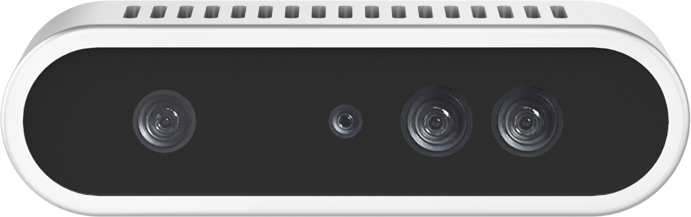 |
| 3       | camera mounting bracket                               | 1            |  |
| 4       | Raspberry Pi 5 + Power supply cable                   | 1            |  |
| 5       | Cooling fan                                           | 1            |  |
| 6       | Raspberry Pi mini adapter board                       | 1            |  |
| 7       | Upper + Back controller cover                         | 1            |  |
| 8       | Suction cups                                          | 4            |  |
| 9       | 7.5V 6A power adapter(DC 5.5*2.5 Male connector)      | 1            |  |
| 10      | Power supply cable(DC 5.5*2.5 female connector;200mm) | 1            |  |
| 11      | Wireless controller                                   | 1            |  |
| 12      | 64G TF Card                                           | 1            |  |
| 13      | Card Reader                                           | 1            |  |
| 14      | Type-C cable(100mm)                                   | 1            |  |
| 15      | Tags(30*30mm)                                         | 3            |  |
| 16      | Waste cards(40mm)                                     | 1            |  |
| 17      | Map(640*430mm)                                        | 1            |  |
| 18      | Colored blocks(30*30mm)                               | 3            |  |
| 19      | Wooden blocks(40*40mm)                                | 4            |  |
| 20      | Cuboid(30*45mm)                                       | 1            |  |
| 21      | Cylinder(30*45mm)                                     | 1            |  |
| 22      | Tape(5mm*8m)                                          | 1            |  |
| 23      | Accesorry bag                                         | 1            |  |
| 24      | User manual                                           | 1            |  |

(3) ArmPi Ultra Advanced Packing list

| **No.** | **Components**                                              | **Quantity** |                         **Picture**                          |
| :------ | :---------------------------------------------------------- | :----------- | :----------------------------------------------------------: |
| 1       | ArmPi Ultra                                                 | 1            |  |
| 2       | Depth camera + cable                                        | 2            |  |
| 3       | camera mounting bracket                                     | 1            |  |
| 4       | Raspberry Pi 5 + Power supply cable                         | 1            |  |
| 5       | Cooling fan                                                 | 1            |  |
| 6       | Raspberry Pi mini adapter board                             | 1            |  |
| 7       | Upper + Back controller cover                               | 1            |  |
| 8       | Suction cups                                                | 4            |  |
| 9       | 7.5V 6A power adapter(DC 5.5*2.5 Male connector)            | 1            |  |
| 10      | Power supply cable(DC 5.5*2.5 female connector;200mm)       | 1            |  |
| 11      | Wireless controller                                         | 1            |  |
| 12      | 64G TF Card                                                 | 1            |  |
| 13      | Card Reader                                                 | 1            |  |
| 14      | Type-C cable(100mm)                                         | 1            |  |
| 15      | Tags(30*30mm)                                               | 3            |  |
| 16      | Waste cards(40mm)                                           | 1            |  |
| 17      | Map(640*430mm)                                              | 1            |  |
| 18      | Colored blocks(30*30mm)                                     | 3            |  |
| 19      | Wooden blocks(40*40mm)                                      | 4            |  |
| 20      | Cuboid(30*45mm)                                             | 1            |  |
| 21      | Cylinder(30*45mm)                                           | 1            |  |
| 22      | Tape(5mm*8m)                                                | 1            |  |
| 23      | WonderEcho Pro AI voice interaction box+Type C cable(100mm) | 2            |  |
| 24      | Accesorry bag                                               | 1            |  |
| 25      | User manual                                                 | 1            |  |

## 1.2 Accessories Installation and Notes

### 1.2.1 Assembly

(1) Install the cooling fan onto the Raspberry Pi controller, then insert the microSD card into the Raspberry Pi.


(2) Use M2.5×16 double-pass nylon standoffs to secure the Raspberry Pi controller onto the baseplate. Next, mount the Raspberry Pi adapter board onto the controller.


(3) Connect the open-source controller to the Raspberry Pi using the Raspberry Pi power cable. Attach the STM32 communication cable to Port 2 on the Raspberry Pi, and connect the power cable to the open-source controller.


(4) Take out the suction cup and nut, secure the suction cup to the baseplate, and then use M3×6 screws to fasten the controller's rear cover to the baseplate.


(5) Mount the depth camera onto its bracket with M3×6 screws, then use M4×6 screws to secure the bracket. Connect the data cable to Port 1 on the Raspberry Pi. Ensure the camera remains parallel to the bracket. The installation position may affect the robotic arm's gripping performance. Refer to the "8. Position Adjustment for Object Gripping and Placing" in this document for details.


(6) Install the AI voice module onto the frame using M4×12 screws and M4 nuts. Secure the controller's top cover with M3×6 screws, then connect the data cable to Port 3.


### 1.2.2 Wiring Instruction

The diagram below shows the port numbers on the Raspberry Pi controller for the Advanced kit. Please follow the table for wiring. If your kit does not include certain modules, you may skip the corresponding ports.


| **Raspberry Pi Controller** |                              |
|:---------------------------:|:----------------------------:|
|              1              |   Depth / Monocular Camera   |
|              2              |       STM32 Controller       |
|              3              | AI Voice Interaction Module  |
|              4              | Wireless Controller Receiver |

<p id="anchor_1_3"></p>

## 1.3 Power-On Description

In this section, you will learn about the startup sequence of the robotic arm and verify the functionality of each module. After completing this step, you can proceed to the following chapters to explore app control and wireless controller control.

If you need to connect to the robot using remote development tools, or wish to further explore advanced functions and review sample programs, please refer to the section "**[6. Development Environment Setup and Configuration](#anchor_1_6)**" in this document.

### 1.3.1 Precautions Before Power-On

(1) Connect the 7.5V/6A power adapter to the STM32 controller. Following this sequence ensures that all robotic arm hardware operates properly.


(2) Do not place the robot near the edge of a table to avoid accidental falls and damage.

(3) Always operate the robot on a flat, stable surface.

(4) Do not stack robotic arms, as this may cause stalling on startup, potentially damaging the servos.

(5) Avoid running the robotic arm under high-load conditions for extended periods. Prolonged overload can shorten servo lifespan or cause permanent damage.

(6) Maintain a safe distance from the robot before powering on to prevent accidental contact with moving parts.

(7) Before performing functionality tests, ensure that all wiring is connected correctly, the wireless controller receiver is properly plugged in, and system sound on the top-right corner of the desktop is enabled.

### 1.3.2 Power-On Status Description

(1) Slide the power switch on the driver board to the "**ON**" position.

(2) Wait for about 1 minute. The expansion board's blue LED (LED1) will turn on and start blinking. The robotic arm will return to its initial position, and the **buzzer** will beep once, indicating that the device has successfully powered on.

(3) By default, the device is configured in AP direct-connect mode. After startup, a Wi-Fi hotspot beginning with "**HW**" will appear. To connect via mobile app or remote desktop, enter the default password: hiwonder.


> [!NOTE]
>
> **Important Reminder:**
>
> If the hotspot does not appear after startup, troubleshoot as follows:
>
> * Follow the steps outlined in the [1.3 Power-On Status Description](#anchor_1_3) tutorial.
>
> * If LED1 stays solid blue instead of blinking, the system may be in LAN mode. Long-press the KEY1 button on the expansion board for 5–10 seconds. If LED1 starts blinking, the HW Wi-Fi hotspot has been re-enabled.
>
> * If LED1 does not blink after pressing KEY1, the system may not detect the SD card. Remove and reinsert the SD card.
>
> * If the LED remains solid after reinserting, the SD card may be corrupted, or the system image has not been flashed for kits without a main controller. You may replace or reflash image to the SD card.
>
> * If the issue persists, the Raspberry Pi controller may be faulty. Please contact customer support for assistance.

(4) For Advanced kit, the robot will also play a "**I'm ready**" voice prompt after startup.


After powering on, each module should behave as follows:

<table class="docutils-nobg" border="1">
<colgroup>
<col style="width: 30%" />
<col style="width: 38%" />
<col style="width: 31%" />
</colgroup>
<tbody>
<tr>
<td style="text-align: center;"><strong>Module</strong></td>
<td style="text-align: center;"><strong>Test Procedure</strong></td>
<td style="text-align: center;"><strong>Expected Behavior</strong></td>
</tr>
<tr>
<td style="text-align: center;">Expansion Board LED</td>
<td style="text-align: left;">Observe LED1 after startup</td>
<td style="text-align: left;">Blue LED blinking → AP mode active, network configured</td>
</tr>
<tr>
<td style="text-align: center;">Buzzer</td>
<td style="text-align: left;">Listen for short beep</td>
<td style="text-align: left;">Single short beep → onboard hardware is normal</td>
</tr>
<tr>
<td style="text-align: center;">KEY1 Button</td>
<td style="text-align: left;">Switch network mode</td>
<td style="text-align: left;">After connecting to the STA (LAN) mode via the mobile app, press and hold the KEY1 button. Check whether the LED1 indicator starts blinking.</td>
</tr>
<tr>
<td style="text-align: center;">AI Voice Interaction Module</td>
<td style="text-align: left;">Voice prompts after power-on</td>
<td style="text-align: left;">Robot announces "I'm ready"</td>
</tr>
<tr>
<td style="text-align: center;">Depth Camera + Robotic Arm</td>
<td style="text-align: center;"> 
<p>Launch the mobile app to connect the robot</p>
<p>Open the "Robot Control" function to view the live feed from the depth camera.</p>
<p>Bring up the robotic arm control panel and drag each joint servo one by one.</p>
</td>
<td style="text-align: left;">The live video feed is displayed, and the joints move accordingly.</td>
</tr>
<tr>
<td style="text-align: center;">STM32 Controller</td>
<td style="text-align: left;">Control via wireless controller or Robot Control in the app</td>
<td style="text-align: left;">The robot responds and moves normally</td>
</tr>
</tbody>
</table>

<p id="anchor_1_4"></p>

## 1.4 App Control

You can control the robot via the **WonderPi** mobile app and explore its AI vision features. This section explains the operation of each function within the app. For demonstration, the instructions are shown using Android. The process is the same for iOS devices.

> [!NOTE]
>
> If you purchased a kit without controller or Starter Kit, please first complete the sections [[1.6 Development Environment Setup and Configuration](#anchor_1_6) and [1.6.5 Robot Version Configuration Tool](#anchor_1_6_5) in this document before proceeding with mobile app control.

### 1.4.1 APP Installation

> [!NOTE]
>
> * Please grant all permissions requested during installation to ensure the app functions properly.
>
> * Turn on your phone's GPS and Wi-Fi before opening the app.

Scan the QR code below to download and install the WonderPi app.


### 1.4.2 Connection Modes Overview

The robot supports two network modes:

(1) AP Mode (Direct Connection): The controller creates a hotspot that your phone can connect to directly, but no Internet access in this mode.

(2) STA Mode (LAN Connection): The controller connects to a specified Wi-Fi network, and Internet access is available in this mode.

By default, the robot starts in AP direct connection mode. Regardless of whether the user chooses AP direct connection or STA LAN mode, the robot's features and functions remain the same.

**Tip:** We recommend starting with the AP direct connection mode to quickly explore and experience the robot's functions. You can switch to LAN mode later based on your specific needs.

* **Connecting in AP Mode (Must Read)**

To use this mode, iOS devices must be running iOS 11.0 or above, and Android devices must be running Android 5.0 or above.

Important for **Android** users: Make sure to enable all required permissions for the app in your phone settings to ensure proper functionality.

This section uses ArmPi Ultra connecting to the Android app as an example. The same steps apply for iOS devices.

(1) Open the **WonderPi** app and select "**Advanced**" \> "**ArmPi Ultra**".


(2) Tap the "**+**" button in the bottom-right corner and choose "**Direct Connection Mode**".


(3) Tap "**Go to connect device hotspots**", which will take you to the Wi-Fi settings page to connect the hotspot generated by the robot.


(4) The hotspot starts with "**HW**" and connect to it by entering the password: **hiwonder**.


> [!NOTE]
>
> For iOS users: Make sure the Wi-Fi icon  appears in the status bar before switching back to the app, or the device might not be detected. If the app doesn't detect the device right away, tap the refresh icon  in the upper-right corner.

(5) Go back to the WonderAi app, tap the corresponding robot icon, and enter the mode selection screen.


> [!NOTE]
>
> If a message pops up saying "**Network is unavailable, continue?**", tap "**Keep Connection**" to proceed.

(6) If a message appears saying "**Switch to detected product version?**", it means the wrong product was selected in Step 1. Tap **"Confirm"** to automatically switch to the correct version's mode selection screen.

(7) After tapping the robot icon, the mode selection screen will appear as shown below:


* **LAN Mode Connection (Optional)**

(1) First, connect your phone to a 5G Wi-Fi network. For example, connect to "**Hiwonder_5G**." If you are using a dual-band router with separate SSIDs, the 2.4G and 5G networks will have different names, for example, "**Hiwonder**" for 2.4G and "**Hiwonder_5G**" for 5G.


(2) Open the **WonderPi** app and select "**Advanced**" \> "**ArmPi Ultra**".


(3) Tap the "**+**" button in the bottom-right corner and choose "**LAN Mode**".


(4) The app will prompt you to enter the Wi-Fi password for the network you're connected to. Make sure you enter the correct password, a wrong password will prevent the connection. After entering the password, tap "**OK**".

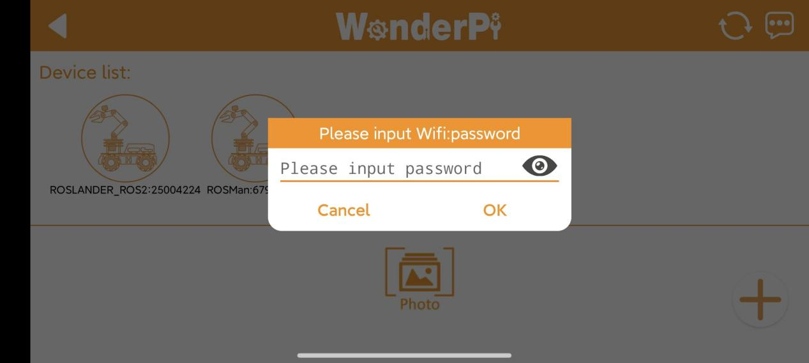

(5) Tap "**Go to connect device hotspots**" to switch to the Wi-Fi settings.


(6) In the Wi-Fi list, find the hotspot starting with "**HW**", and connect to it using the password: **hiwonder**. After connecting, tap the "**Back**" button to return to the app.


(7) You will see that the app has started connecting to the robot.


> [!NOTE]
>
>When LAN mode is enabled, the robot will **no longer broadcast a Wi-Fi hotspot beginning with "HW."** At this point, make sure your phone is connected to the same Wi-Fi network that the robot is configured to use. This ensures the WonderPi app can display the robot's corresponding icon and name.

(8) After a few seconds, the robot's icon and name will appear on the main screen. The LED1 indicator on the expansion board will stay on.


(9) Long-press the corresponding icon of your robot in the app to view its assigned IP address and Device ID.


(10) You can use this IP address in a remote desktop tool to establish a connection with the robot. For detailed steps, please refer to the section [1.6 Development Environment Setup and Configuration](#anchor_1_6) in this document.

(11) To switch from LAN mode back to direct connection mode, press and hold the KEY1 button on the expansion board until the blue indicator light starts blinking. This indicates the mode has been switched successfully.

### 1.4.3 Overview of App Modes

The mobile app provides seven modes, including Robot Control, Object Sorting, Gesture Control, Target Tracking, Waste Sorting, Intelligent Stacking, and Depth Object Sorting.


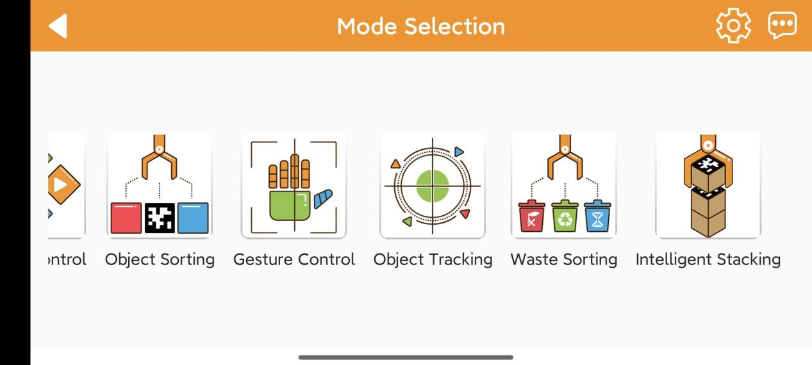

The table below offers a detailed overview of each mode.

| **Icon** | **Mode** | **Project Outcome** |
|:--:|:--:|:--:|
|  | Position Calibration | Acquire the distance between the block and the end effector of the robot arm. |
|  | Robot Control | Control the robot movement in real time |
|  | Object Sorting | Select the color ID or tag ID in the app. The robotic arm will pick up the block with the specified color and tag ID and place it in the corresponding sorting area. |
| 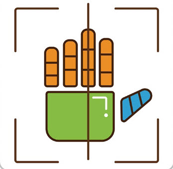 | Gesture Control | Once the feature is activated, the camera will tilt upward and execute the corresponding action when a gesture is detected. Specific feedback can be viewed by clicking 'Instruction' button on the control area. |
|  | Target Tracking | Select the color or face to track, and the robotic arm will move accordingly to follow the target |
|  | Waste Sorting | Garbage blocks within the detection area will be picked up and placed into the corresponding waste category. |
|  | Intelligent Stacking | Labeled wooden blocks in the detection area will be stacked in the designated position. |
|  | Depth Object Sorting | Small balls, rectangular blocks, and cylinders in the detection area will be placed in their corresponding locations. |

### 1.4.4 Map Introduction and Device Placement

For a better experience, you need to have a basic understanding of the map. This section will introduce the placement of device and the distribution of map.

Firstly, lay the map flat on the table, and then position the robotic arm within the area as shown in the left illustration below. The front end of the base should align with the front boundary of the robotic arm placement area, and the suction cups should be firmly against the table, as depicted in the illustration on the right below.


The map is composed of four sections: ① Robotic arm placement area ② Waste sorting area ③ Vision recognition area ④ Color and tag sorting area ⑤ X-axis and Y-axis coordinates of the robotic arm


The following sections describe the functions of each component:

(1) Robotic Arm Placement Area


(2) Waste Sorting Area

The robotic arm will transport the blocks or cards from the recognition area to their respective placement area.

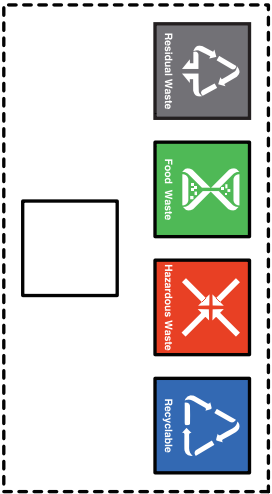

The functions of above areas are as follow.

| **Icon** | **Function** |
|:--:|:--:|
|  | Stacking area |
|  | Residual waste cards placing area |
|  | Food waste cards placing area |
|  | Hazardous waste cards placing area |
|  | Recyclable waste cards placing area |

3.  **Vision Recognition Area**

In robotic arm vision recognition area, the central label serves as a reference point during the position calibration of robot arm, placing the blocks with garbage card or color blocks to be recognized within this area. For details on position calibration, please refer to the section "**[1.4.5 Position Calibration](#anchor_1_4_5)**" in this document.


> [!NOTE]
>
> **When placing the blocks, do not locate them at the edges of the vision recognition area to prevent recognition failure.**

4.  **Color and Tag Sorting Area**

The robotic arm will transport the blocks from the recognition area to their respective placement area.


5.  **X-axis and Y-axis Coordinates of the Robotic Arm**

After the robotic arm is placed on the map, you can refer to this coordinate axis to confirm the positive directions of X-axis and Y-axis of the robotic arm.


<p id="anchor_1_4_5"></p>

### 1.4.5 Position Calibration


(1) When using the app for the first time, it may take a few seconds for the camera feed to appear on the right side. If no image appears for an extended period, return to the mode selection page and enter again. Once the live camera feed appears, tap "**Start Position Calibration**".


(2) The calibration process may take a while. Kindly wait until it is complete. When two yellow boxes appear on the screen and '**Calibration finished**' is shown in the lower-left corner, the process is complete.


### 1.4.6 Robot Control

All servos on robotic arm can be controlled through this mode.

> [!NOTE]
>
> * Keep your body away from the robotic arm to prevent injury.
>
> * If the robotic arm reaches its limit position, rotate it back in the opposite direction.

(1) Click  to enter the mode's interface, then the robotic arm returns to an straight posture.

(2) This interface is divided into three sections:

① The left side of the interface is the live camera feed.

② While the right side is the robotic arm control area.

(3) Tap-on  to enable the robotic arm to restore its initial position.


### 1.4.7 Object Sorting

> [!NOTE]
>
> * Please start this mode in a well-lit environment.
>
> * Keep a proper distance between the wooden blocks, and do not place them too close together.
>
> * Maintain the integrity of the tag as the missing corners or stains may effect the recognition result.

In this mode, you can sort blocks by color or label. Click  to enter the mode's interface. This interface is divided into three sections:

(1) On the left side, you can start the feature and select the target color and tag.

(2) The right side of the interface is the live camera feed.


| **Icon** | **Function** |
|:--:|:--:|
|  | Enabling and disabling the feature |
|  | Select the color and tag for sorting |

### 1.4.8 Gesture Control

This mode allows you to control the robot using different gestures.

> [!NOTE]
>
> * The robot can only recognize one hand at a time.
>
> * The time interval for each gesture recognition is 5 seconds.

(1) Click  to enter the mode's interface. This interface is divided into three sections:

① On the left side, you can start the feature.

② The right side of the interface is the live camera feed.

③ Click the button  on the left to view instructions for this mode.


(2) After activating the feature, the robotic arm will be in a forward-facing horizontal position. When a hand gesture is detected, the arm will perform the corresponding feedback action.

- **Static Gesture Recognition**

Recognizable static gestures and its corresponding actions are as follow.

| **Static Gestureb** | **Example** | **Action** |
|:--:|:--:|:--:|
| Heart |  | The pan-tilt rotates left or right, and the gripper rotates clockwise or counterclockwise accordingly. |
| OK |  | The gripper will open and close twice. |
| Fist |  | The gripper will close and the robotic arm stretches forward. |
| Gun |  | The gripper will open and close twice, then turn right and open and close twice again. |
| 1 |  | Pick up the block and place it to the tag 1 position. |
| 2 |  | Pick up the block and place it to the tag 2 position. |
| 3 |  | Pick up the block and place it to the tag 3 position. |
| 4 |  | Pick up block and place it at the upper-left position relative to the arm. |
| 5 |  | Gripper opens, and pan-tilt rotates left and right. |
| 6 |  | The robotic arm raises, and gripper opens and closes twice. |

### 1.4.9 Target Tracking

This mode allows tracking of the selected target object.

> [!NOTE]
>
> * Please start this feature in a well-lit environment. After the feature starts, please remove other objects in target color from the field of view of the camera, otherwise the feature will be influenced.
>
> * The target must always locate within camera's view, and move it in an appropriate speed.

Click  to enter the mode's interface. This interface is divided into three sections:

① On the left side, you can start the feature and select the target color.

② The right side of the interface is the live camera feed.

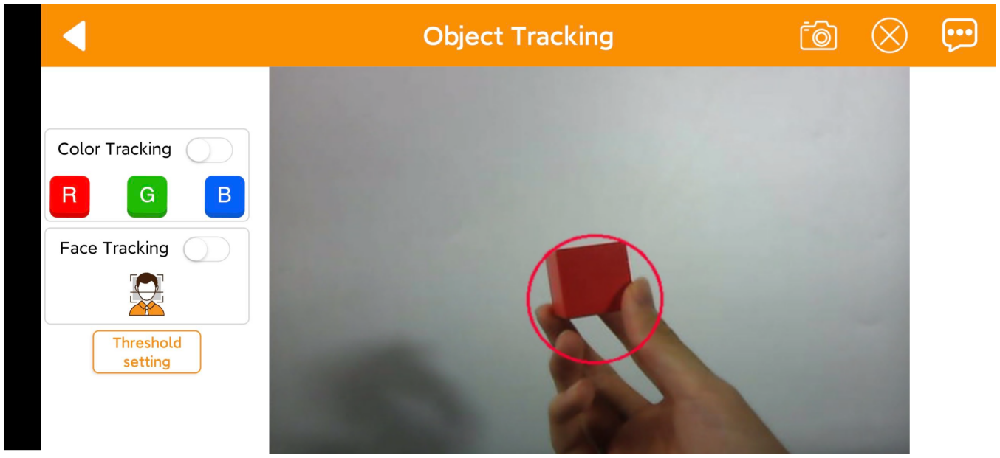

### 1.4.10 Waste Sorting

This mode allows sorting of waste blocks into their respective categories.

> [!NOTE]
>
> * Please start this mode in a well-lit environment.
>
> *  For accurate grasping, align the waste blocks so that they are parallel to the lines of the picking area.
>
> * If grasping is not precise, click the Position Calibration button to perform calibration.

* **Interface Overview** 

Click  to enter the mode's interface. This interface is divided into three sections:

① On the left side, you can start the feature.

② The right side of the interface is the live camera feed.

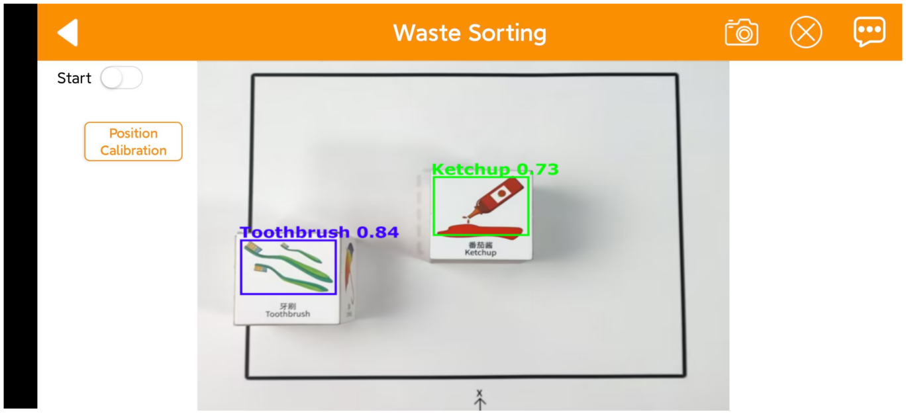

### 1.4.11 Intelligent Stacking

This mode allows stacking of labeled blocks into designated positions.

> [!NOTE]
>
> * Please start this mode in a well-lit environment.
>
> * Keep a proper distance between the wooden blocks, and do not place them too close together.
>
> * If grasping is not precise, click the Position Calibration button to perform calibration.

* **Interface Overview**

Click  to enter the mode's interface. This interface is divided into three sections:

(1) On the left side, you can start the feature.

(2) The right side of the interface is the live camera feed.

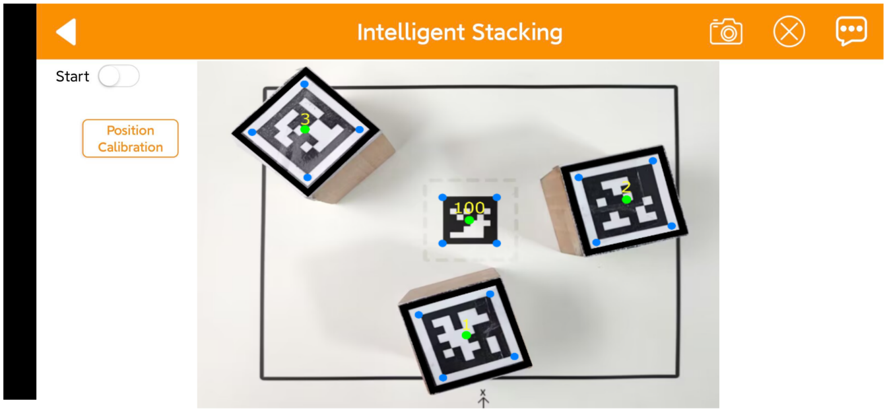

###  1.4.12 Depth Object Sorting

This mode allows stacking of labeled blocks into designated positions, but **not available with the monocular camera**.

> [!NOTE]
>
> * Please start this mode in a well-lit environment.
>
> * Place the object at the center position for more accurate grasping.
>
> * If grasping is not precise, click the Position Calibration button to perform calibration.

* **Interface Overview**

Click  to enter the mode's interface. This interface is divided into three sections:

(1) On the left side, you can start the feature.

(2) The right side of the interface is the live camera feed.


## 1.5 Color Threshold Setting

Various light sources can affect colors differently, leading to discrepancies in recognition.

### 1.5.1 Color Threshold Adjustment via Mobile App

In this section, you will learn how to adjust color thresholds in the app. The following instructions use an Android device as an example, and the process is the same for iOS.

(1) Power on the robotic arm and connect it to the **WonderPi** app. For details, please refer to previous sections [1.3 Power-On Description](#anchor_1_3) and [1.4 App Control](#anchor_1_4) in this document for startup instructions.


(2) In the Mode Selection screen, tap the icon  at the top right corner to enter the color threshold setting interface.

(3) Take adjusting red color for example. Place the red block within the recognition area on the map, then select the red icon.

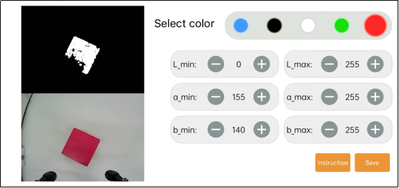

(4) Click "**Instruction**" button to check the color adjustment instruction.


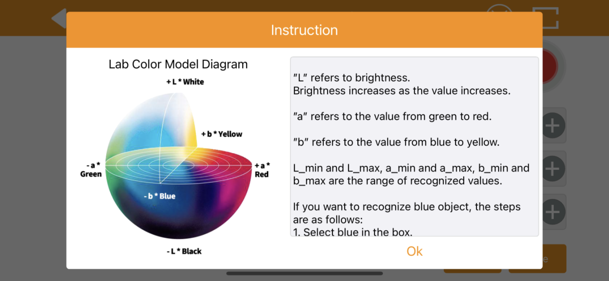

(5) Modify all "**min**" values of L, A and B as 0, and "**max**" values as 255.


(6) According to the "LAB color space", adjust L, A and B components to approach the zone of the target color.


Red color is around "**+a**" zone, so you need to adjust the color threshold to "**+a**" zone. Keep the values of "**L_max**" unchanged, while increase the values of "**L_min**" until the block image in the screen turns white and other area turns black.


(7) Based on the environment, modify the value of "**L**" and "**B**". If the red appears too light, increase the **L_min** value; if too dark, decrease the **L_max** value. If the red appears too warm, increase the **b_min** value; if too cool, decrease the **b_max** value.


(8) After finishing the adjustments, tap the "**Save**" button at the bottom right to save the updated color thresholds.


<p id="anchor_1_5_2"></p>

### 1.5.2 Adjusting Color Threshold

(1) Remotely connect to the robotic arm via VNC. For a specific instruction, please refer to [1.6 Development Environment Setup and Configuration](#anchor_1_6) in this document.

(2) Click on the button , then click **Execute**.


(3) For the instructions and use of the interface buttons, you can refer to the subsequent content of this document. To close it, click  and select "**Yes**" in the pop-up prompt.


* **LAB TOOL Interface Introduction**

LABTOOL is divided into two parts, including image display area and recognition adjustment area.


(1) Image display area: at left is the processed image, and at right is the raw image.

> [!NOTE]
>
>If the camera returned image doesn't occur, it is possible that the camera fails to connect. And you need to check the camera wiring.

(2) Recognition adjustment area: you can adjust the color threshold in this area. The functions of the buttons are listed below.

| **Icon** | **Function** |
|:--:|:--:|
|  | Slider L, A and B are respectively used to adjust L, A and B components of the camera returned image. The sliders at left represent "min" value, and the sliders at right represent "max" value. |
|  | Select the color to be adjusted |
|  | Delete the selected color |
|  | Add new colors |
|  | Save the adjusted value |
|  | Switch the camera between depth camera and monocular camera |
|  | Exit from the LAB TOOL |

* **Adjusting Color Threshold**

(1) Open LABTOOL, and select the color in the drop down menu. Take adjusting red color for example.


(2) Modify all "**min**" values of L, A and B as 0, and "**max**" values as 255.


(3) Put the red block within the camera frame. According to the "LAB color space", adjust L, A and B components to approach the zone of the target color.


Red is around "**+a**" zone, hence you need to increase A component that is remain "**max**" value of A component the same and increase "**min**" value till the red block at left turns white and other area turns black.


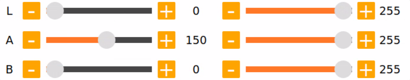

(4) Based on the environment, modify the value of "L" and "B". If the red appears too light, increase the "**min**" value of the L component; if it appears too dark, decrease the "**max**" value of the L component. If the red looks too warm, increase the "**min**" value of the B component; if it looks too cool, decrease the "**max**" value of the B component.


LAB Threshold Adjustment Parameter:

| **Color Component** | **Range** | **Corresponding Color Zone** |
|:-------------------:|:---------:|:----------------------------:|
|          L          |   0~255   |    Black-White（-L ~ +L）    |
|          A          |   0~255   |     Green-Red（-a ~ +a）     |
|          B          |   0~255   |    Blue-Yellow（-b ~ +b）    |

(5) Click "**Save**" to save the adjusted color threshold parameter.


* **Add a New Recognition Color**

Besides the built-in recognition colors, you can add new colors. For example, yellow.

(1) Open LAB TOOL and click "**Add**" button.


(2) Then fill in "**yellow**", and click click "**OK**".

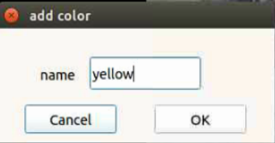

(3) Select the color you just added in the drop-down menu.


(4) Face the camera to the yellow block. And then drag the slider of L, A and B to adjust the color threshold till the object at left turns white and other area turns black.

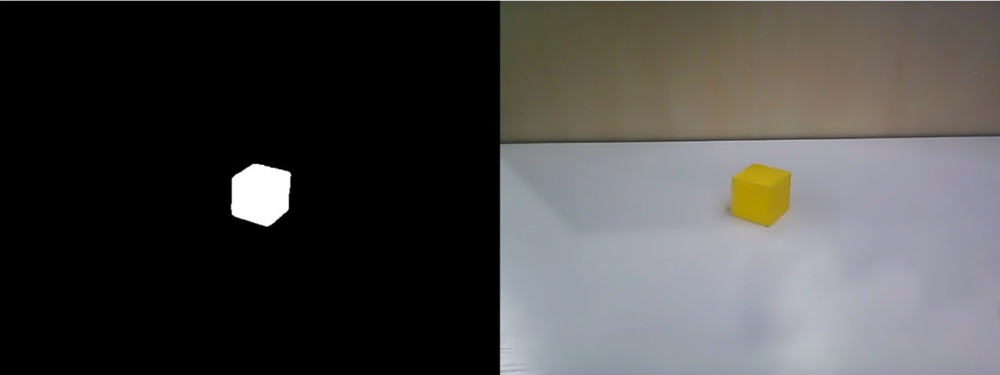


> [!NOTE]
>
> for how to adjust the color threshold, please scroll up to "**[1.5.2 Adjusting Color Threshold](#anchor_1_5_2)**" in this document.

(5) Click "**Save**" to save the adjusted color threshold parameter.


Once the adjustment is completed, press "**Ctrl+C**" to disable the camera service, then click "**Close**" to exit the interface.

<p id="anchor_1_6"></p>

## 1.6 Development Environment Setup and Configuration

### 1.6.1 Remote Control Tool Introduction and Installation

There are two ways to remotely control the robot: graphical control and command-line control.

VNC is a graphical remote-control software. After installation, you can connect to the robot's hotspot and directly control the robot from your computer. When connected via VNC, you can clearly see the robot's system desktop, making it convenient for intuitive operation.

In contrast, MobaXterm connects via SSH and focuses on command-line control. It does not display the robot's full system desktop—only the command-line interface. For users who are familiar with terminal commands, this method allows faster robot control while reducing computational load and memory usage.

MobaXterm also comes with a lightweight X11 server, which enables graphical applications to be displayed directly when needed. Regardless of which controller you are using, MobaXterm's SSH connection method is always supported.

In a word, VNC is best for scenarios requiring intuitive, visual operation, while MobaXterm is better suited for fast command execution. Choose the remote-control software according to your specific needs.

* **VNC Installation**

(1) Go to the folder: [Appendix->Remote Connection Tools](https://drive.google.com/drive/folders/1yhO_HNfeYMl-x0IzKAsoJRPkXB4GJ0f-?usp=sharing), and double-click the file [VNC-Viewer-6.17.731-Windows](https://drive.google.com/drive/folders/1dPgIGiUxTtj6h-OdCe4ySZHW-jbbLlya?usp=sharing). In the pop-up dialog box, choose the installation language as "**English**", then click "**OK**".


(2) On the next screen, click "**Next**."


(3) Agree to the license agreement, then click "**Next**." Keep the default installation path, and click "**Next**."


(4) Click "**Install**" to begin installation.


(5) Wait for the installation to complete. Once the installation complete screen appears, click **Finish** to complete the setup.


(6) After installation, launch VNC Viewer by clicking its desktop icon .

* **MobaXterm Installation**

(1) Go to the folder: [Appendix-> Remote Connection Tools->MobaXterm](https://drive.google.com/drive/folders/1yAqKwZSHZQALICVkaL6zCUF0jycrdyPK?usp=sharing), and find the installation package.

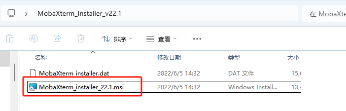

(2) Click "**Next**".


(3) Accept the license agreement by checking the box, then click **Next**.


(4) Keep the default installation path and click **Next** again.


(5) Click "**Install**".


(6) Wait for a moment, the setup completion screen will appear. Click **Finish** to exit the installer.


### 1.6.2 Connecting in AP Mode

AP Mode (Direct Connection): The controller creates a hotspot that your phone can connect to directly, but cannot access external networks.

* **Connection Through VNC**

(1) On your computer, search for and connect to the hotspot beginning with HW, see image below. The password is: hiwonder.


(2) Launch the VNC Viewer application that you installed earlier. In VNC Viewer, enter the Raspberry Pi IP address, for example: **192.168.149.1** in AP mode, and press **Enter**. If a warning about an unsecure connection appears, click **Continue**.


(3) Wait for the login window to appear, then follow the steps in order: enter the username → enter the password → check "Remember password" → click "OK."

**Username：pi**

**Password：raspberrypi**

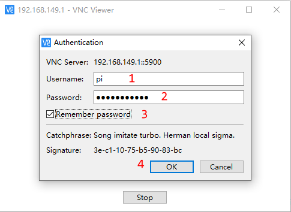

(4) Once connected, the Raspberry Pi remote desktop will be displayed as shown below.


* **Connection Through MobaXterm**

Taking the AP mode as an example, the same steps also apply to LAN mode, but you need to replace the IP address accordingly.

(1) On the main interface, click "**Session**" in the upper-right corner to create a new session. In the session window, enter the robot's recorded IP address (**192.168.149.1**) and then click "**OK**."


(2) Select **SSH**.


(3) Enter the fixed IP address for AP mode: **192.168.149.1**.


(4) If a window like the one below appears, click the third option.


(5) The system will then prompt you to enter your username (login as) and password:

**Username：pi**

**Password：raspberrypi**


> [!NOTE]
>
> * The username must be entered in lowercase. Even if the account was originally created with uppercase letters, you must type it in lowercase when logging in.
>
> * After entering the username, press Enter to proceed to the password field.
>
> * When typing the password, no characters will be displayed. After finishing, press Enter again to log in.

(6) If the password is correct, you will successfully access the system, and the interface will appear as shown below.


### 1.6.3 LAN Mode Connection

STA Mode (LAN Connection): The controller connects to a specified Wi-Fi network, and Internet access is available in this mode.

> [!NOTE]
>
> * If you want to configure the robot to use LAN Mode via your smartphone, make sure to enable the location service on your phone beforehand.
>
> * You cannot switch to LAN mode through the system's default network settings, as shown in the figure below. Since the Wi-Fi has been specially configured, you will need to follow the network setup instructions provided later in this document.
>
> * In this tutorial, **"Hiwonder_5G"** Wi-Fi is taken as an example. When setting up the LAN connection, please use your own Wi-Fi network instead.

* **Connection Through VNC**

(1) Use the VNC remote connection tool to access the Raspberry Pi desktop.

(2) Click the terminal icon 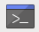 in the system desktop to open a command-line window.

(3) Enter the following command and press Enter to go to the configuration directory.\

```
cd ~/hiwonder-toolbox
```

(4) Then enter the following command and press Enter to open the configuration file:

```
gedit wifi_conf.py
```

(5) In the editor, set the value of **"WIFI_MODE"** to 2. 1 means AP mode, where the robot creates its own Wi-Fi hotspot. 2 means LAN Mode, where the robot connects to your local network.


(6) Next, modify **"WIFI_STA_SSID"** and **"WIFI_STA_PASSWORD"** with your router's Wi-Fi name and password. Make sure the values are enclosed in single quotes ''.

> [!NOTE]
>
>The robot also supports 5G Wi-Fi networks.
>

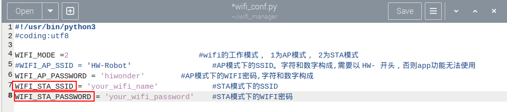

(7) Once finished, press **Ctrl + S** to save, then click the close button in the top-right corner.

(8) Back in the terminal, restart the Wi-Fi service with the following command:

```
sudo systemctl restart wifi.service
```

(9) Now, reconnect to the robot through your router's Wi-Fi network.

(10) To switch back to AP mode, edit the same configuration file again, set WIFI_MODE = 1, and restart the Wi-Fi service as shown above.

* **Connection Through MobaXterm**

(1) On the main interface, click "**Session**" in the upper-right corner to create a new session. In the session window, enter the robot's recorded IP address (**192.168.11.244**) and then click "**OK**."


(2) Select **SSH**.


(3) Enter the IP address obtained in LAN mode: **192.168.11.244**.

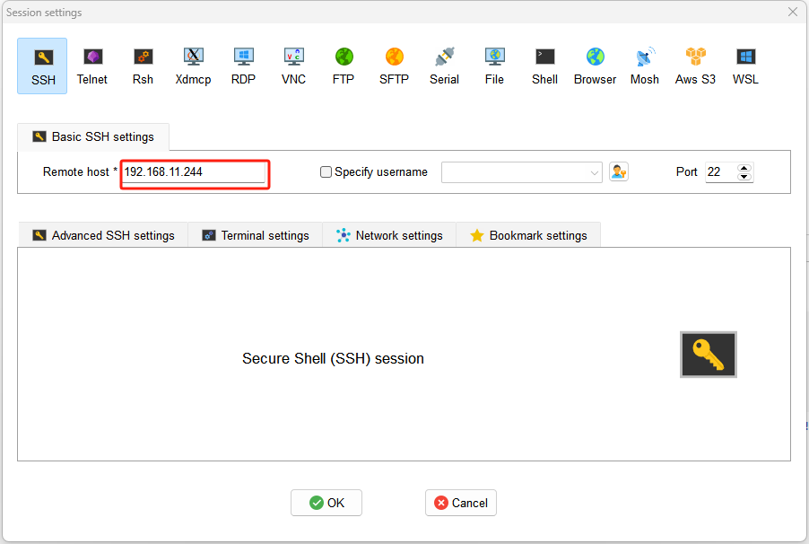

(4) If a window like the one below appears, click the third option.


The system will then prompt you to enter your username (login as) and password:

**Username：pi**

**Password：raspberrypi**


> [!NOTE]
>
> * The username must be entered in lowercase. Even if the account was originally created with uppercase letters, you must type it in lowercase when logging in.
>
> * After entering the username, press Enter to proceed to the password field.
>
> * When typing the password, no characters will be displayed. After finishing, press Enter again to log in.

(5) If the password is correct, you will successfully access the system, and the interface will appear as shown below.


### 1.6.4 System Command-Line Terminals

There are two types of command-line terminals in the system:

ROS2 Environment Terminal: This terminal provides access to robot-related features and functions. It will be frequently used in the following lessons. 

System Terminal: This is the default terminal of the operating system, containing system-level files of the robot. It can be found on the taskbar at the top of the system interface, which is rarely used. See the red box in the image.


> [!NOTE]
>
> In the upcoming lessons, carefully follow the instructions regarding which terminal to use for each step. Using the wrong terminal may prevent certain robot functions from starting properly.

<p id="anchor_1_6_5"></p>

### 1.6.5 Robot Version Configuration Tool

In this section, we will introduce the built-in Version Configuration Tool in the robot system. This tool allows you to switch settings according to different camera models, chassis types, and languages (Chinese/English).

* **Tool Overview & Usage**

(1) Use the VNC remote desktop connection to access the robot.

(2) Double-click the "**Tool**" icon  to launch the robot system configuration tool, then click "**Execute**".

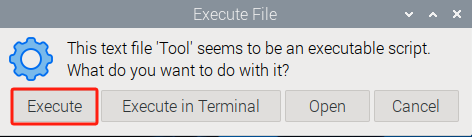

(3) As shown in the figure below, the camera type **usb_cam** is selected for the Starter kit, while the camera type **aurora** is selected for the Standard and Advanced kits.


Choose the desired language option: Chinese or English.


(4) Check your order information to confirm the correct hardware version. Generally, you only need to configure the following three areas in the tool: Camera Type, Chassis Type, and ASR Language. **Keep all other settings at their default values. Do not change options, as this may cause system issues.**

<table class="docutils-nobg" border="1">
<colgroup>
<col style="width: 50%" />
<col style="width: 50%" />
</colgroup>
<tbody>
<tr>
<td style="text-align: center;"><strong>Option</strong></td>
<td style="text-align: center;"><strong>Configuration Options</strong></td>
</tr>
<tr>
<td style="text-align: center;"><strong>Camera Type</strong></td>
<td style="text-align: center;"><strong>usb_cam<br />
aurora</strong></td>
</tr>
<tr>
<td style="text-align: center;"><strong>ASR Language</strong></td>
<td style="text-align: center;"><strong>Chinese<br />
English</strong></td>
</tr>
<tr>
<td style="text-align: center;"><strong>Chassis Type</strong></td>
<td style="text-align: center;"><p><strong>None<br />
Mecanum</strong></p>
<p><strong>Slide_Rsils</strong></p>
<p><strong>Conveyor_Belt</strong></p></td>
</tr>
</tbody>
</table>
(5) After selection, click **Save** \> **Apply** \> **Exit** to activate the new configuration.


(6) Open the terminal again  to view the ROS2 environment.


## 1.7 Wireless Controller Control

### 1.7.1 Note

(1) Before powering on the device, make sure the wireless controller receiver is properly inserted. This can be ignored if the receiver was pre-inserted at the factory.

(2) Pay attention to battery polarity when placing the batteries.


(3) Each time the robot is powered on, the APP auto-start service will launch which includes the wireless controller control service. If this service has not been closed, no additional actions are needed—simply connect and control.

(4) Since signals from wireless controller can interfere with each other, it is recommended not to use this function when multiple robots are in the same area, to avoid misconnection or unintended control.

(5) After turning on the wireless controller, if it does not connect to the robot within 30 seconds, or remains unused for 5 minutes after connection, it will enter sleep mode automatically. To wake up the wireless controller and exit sleep mode, press the "START" button.

### 1.7.2 Device Connection

(1) After the robot powers on, slide the wireless controller switch to the "ON" position. At this point, the red and green LED indicators on the wireless controller will start flashing simultaneously.

(2) Wait a few seconds for the robot and wireless controller to pair automatically. Once pairing is successful, the green LED will remain solid while the red LED turns off.

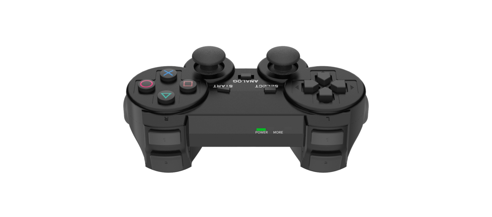

### 1.7.3 Control Modes

The wireless controller supports two control modes: **Coordinate Mode** and **Single Servo Mode**. After a successful connection, the default mode is Coordinate Mode.

Single Servo Mode: In this mode, the wireless controller buttons can be used to control the forward and reverse rotation of individual servos on the robotic arm.

Coordinate Mode: In Coordinate Mode, the robotic arm moves as a whole along the X, Y, and Z axes and can also adjust its tilt angle based on button inputs.

Switching Between Modes: To switch between modes, press both **SELECT** and **START** buttons. A sound prompt indicates the switch was successful. Switching from Single Servo Mode to Coordinate Mode: two beeps. Switching from Coordinate Mode to Single Servo Mode: one beep.

### 1.7.4 Wireless Controller Button Instruction

* **Button Functions in Single Servo Mode**

Table of button functions in Single Servo Mode:

| **Button** | **Function (from the robotic arm's first-person perspective)** |
|:--:|:--:|
| START | Reset the robotic arm |
| SELECT+START | Switch control mode (Single Servo / Coordinate) |
| UP / ↑ | Raise Servo 5 |
| DOWN / ↓ | Lower Servo 5 |
| LEFT / ← | Rotate Servo 6 to the left |
| RIGHT / → | Rotate Servo 6 to the right |
| Y | Lower Servo 4 |
| A | Raise Servo 4 |
| B | Rotate Servo 2 to the right (Gripper turns right) |
| X | Rotate Servo 2 to the left (Gripper turns left) |
| L1 | Open the gripper (Servo 1) |
| L2 | Close the gripper (Servo 1) |
| R1 | Raise Servo 3 |
| R2 | Lower Servo 3 |

* **Button Functions in Coordinate Mode**

Table of button functions in Coordinate Mode:

| **Button** | **Function (from the robotic arm's first-person perspective)** |
|:--:|:--:|
| START | Reset the robotic arm |
| SELECT+START | Switch control mode (Single Servo / Coordinate) |
| UP / ↑ | Move arm in the positive X direction (forward) |
| DOWN / ↓ | Move arm in the negative X direction (backward) |
| LEFT / ← | Move arm in the positive Y direction (left) |
| RIGHT / → | Move arm in the negative Y direction (right) |
| Y | Close the gripper (Servo 1) |
| A | Open the gripper (Servo 1) |
| B | Rotate Servo 5 to the right (Gripper turns right) |
| X | Rotate Servo 5 to the left (Gripper turns left) |
| L1 | Move arm upward along Z axis |
| L2 | Move arm downward along Z axis |
| R1 | Increase the deflection angle (relative to the horizontal line) |
| R2 | Decrease the deflection angle (relative to the horizontal line) |

## 1.8 Position Adjustment for Object Gripping and Placing

> [!NOTE]
>
> * Once the parameters adjusted take effect, they will simultaneously modify the pick-and-place behavior in the following modes: color sorting, tag sorting, intelligent stacking (app-exclusive), and waste sorting, whether launched via the mobile app or the command-line interface.
>
> * Prior to shipment, the robotic arm has undergone calibration. However, discrepancies between the calibration environment and the actual usage environment, coupled with potential vibrations during transport, may result in suboptimal execution of sorting, stacking, and other features, causing the gripper to inaccurately pick up and place blocks.
>
> * In the event of the aforementioned issues, refer to the following instructions to adjust the gripping and placing positions of the robotic arm.

### 1.8.1 Hand-Eye Calibration

When installing the camera, it is fixed at the most suitable physical position. Since this mounting method is not precise to the micron level every time, there exists a unique offset between the camera's actual viewing angle and the robot's coordinate system. This offset is exactly what hand-eye calibration aims to determine. To ensure accuracy and stability—so that the camera's view can be correctly converted into robot motion commands—we need to perform hand-eye calibration.

(1) Follow the instructions in [1.6 Development Environment Setup and Configuration](#anchor_1_6) of this document to remotely connect the device to the system desktop.

(2) On the system desktop, double-click the icon, then click **Execute**.


(3) The hand-eye calibration interface will appear, see image below.


(4) Click Open and navigate to: **/home/ubuntu/software/hand2cam_tf_matrix_software/calibration/config**. Select **test.npz**, then click **Open** to load the file.


(5) Click number "**1**". The robotic arm will adjust its position so that the camera can see the QR code on the map, then click **Update**.


(6) Repeat the process in order for each numbered step. The arm will move to positions allowing the camera to view the QR code, and you click **Update** each time.


(7) If the arm blocks the QR code, manually adjust the arm so the camera can see it clearly.


(8) Once all steps are complete, click **Calibration** to save the parameters.


(9) To exit, click the button  in the top-right corner of the software and select **Yes**.


### 1.8.2 Position Adjustment Tool

(1) Follow the instructions in [1.6 Development Environment Setup and Configuration](#anchor_1_6) of this document to remotely connect the device to the system desktop.

(2) Click on 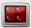to open a new command line terminal. 

(3) Enter the following command to open the localization calibration tool.

```bash
~/software/calibration/tool.sh
```

(4) The tool includes four functions: camera calibration, kinematics, pixel-based positioning, and depth-based positioning. These functions are used to adjust the grabbing performance in subsequent operations.

(5) Press "Ctrl+C" in the terminal to close the tool.

### 1.8.3 Camera Calibration

Select "**Calibration**" from the feature selection drop-down menu, then click the "**Calibrate**" button. Two yellow boxes will appear as shown.


### 1.8.4 Kinematics

(1) The color block must be placed in the center where the QR code is located, then click "**Center**."


In the meantime, the robotic arm will move towards the center position to perform the grasping action. Only the grasping action will be performed.


(2) After clicking "**Center**", adjust the X,Y and Z offsets based on the robotic arm's grasping performance in the previous step.

> [!NOTE]
>
>  You must click "**Save**" button after each modification for the changes to take effect.

As shown in the image above, adjusting the X-axis moves the robot arm forward or backward. For example, setting a positive X value moves it forward.

Adjusting the Y-axis moves the robotic arm left or right. For example, setting a positive Y value moves it to the left.

Adjusting the Z-axis moves the robotic arm up or down. For example, setting a positive Z value moves it upward.


(3) After adjusting the values, it is necessary to click "**Save**" to apply the settings to the robotic arm's grasping program. Then click "**Reset**" to return the arm to its recognition and grasping state, followed by clicking "**Center**" to have the robot arm move to the center position and grasp the block.


(4) After setting the center position, place the block at each of the four corners of the map's frame. Click the corresponding button for each corner and adjust the Y-axis scale based on the robotic arm's grasping performance. This scaling fine-tunes the grasping position along the Y-axis. Once the offset for the center block is set, you won't need to adjust it again—only the scaling needs to be modified. Make sure all four corners can be successfully grasped.


(5) If you notice that the gripper shifts slightly to the right when the block is placed near the left edge of the grasping area, and shifts to the left when the block is near the right edge, you'll need to adjust the Y-axis scale value. Increase the Y-axis scale to 1.10. With a scale of 1.10, a position originally at 0.1 becomes 0.1 × 1.10 = 0.11, causing the gripper to move about 1 cm closer to the edge. Adjust the scale value up or down by 0.01 or 0.1 depending on the actual results. Click "**Save**," then click the corresponding button to let the robotic arm perform the grasping and continue adjust based on the gripper's performance.

### 1.8.5 Pixel Positioning

(1) Select "**Pixel Positioning**" and place the block at the center position, where the QR code is located.


(2) Click on the block, and the robotic arm will automatically detect the color, recognize the block, and perform the grasping action. Only the grasping action will be executed. Adjust the X, Y, and Z offsets based on the grasping result. 

> [!NOTE]
>
> You must click the "**Save**" button after each modification for the changes to take effect.


As shown in the image above, adjusting the X-axis moves the robot arm forward or backward. For example, setting a positive X value moves it forward.

Adjusting the Y-axis moves the robotic arm left or right. For example, setting a positive Y value moves it to the left.

Adjusting the Z-axis moves the robotic arm up or down. For example, setting a positive Z value moves it upward.


(3) After adjusting the values, it is necessary to click "**Save**" to apply the settings to the robotic arm's grasping program. Then click "**Reset**" to return the arm to its recognition and grasping state. Finally, click on the color block again— the robotic arm will automatically detect the color, recognize the block's position, and perform the grasping action.


(4) When the colored block can be successfully grasped at the center position, place the blocks at the four corners of the map frame. Click on the block with the mouse, and adjust the Y-axis scaling value of positioning based on the gripper's grasping performance. This scaling adjustment is used to fine-tune the gripper's positioning along the Y-axis. Once the offset has been calibrated at the center block, you don't need to adjust the offset again later—only the scaling value needs to be adjusted. Make sure all four corners can be successfully grasped.


### 1.8.6 Depth Positioning

(1) Select "**Depth Positioning**" and place the block at the center position, where the QR code is located.


(2) Click on the colored block in the **depth point cloud image**, and the robotic arm will automatically detect the depth value, then identify and grasp the block. Only executing the grasping action. Based on the grasping result, adjust the positioning offsets for X, Y, and Z. **Each time you modify the values, you need to click the "Save" button to apply the changes.**


As shown in the image below, adjusting the X-axis moves the robot arm forward or backward. For example, setting a positive X value moves it forward.

Adjusting the Y-axis moves the robotic arm left or right. For example, setting a positive Y value moves it to the left.

Adjusting the Z-axis moves the robotic arm up or down. For example, setting a positive Z value moves it upward.


(3) After adjusting the values, it is necessary to click "**Save**" to apply the settings to the robotic arm's grasping program. Then click "**Reset**" to return the arm to its recognition and grasping state. Finally, click on the color block in the depth point cloud image again— the robotic arm will automatically detect the depth value, recognize the block's position, and perform the grasping action.


(4) When the color block can be successfully grasped at the center position, place the color blocks at the four corners of the depth point cloud image. Click on the block with the mouse, and adjust the Y-axis scaling value of positioning based on the gripper's grasping performance. This scaling adjustment is used to fine-tune the gripper's positioning along the Y-axis. Once the offset has been calibrated at the center block, you don't need to adjust the offset again later—only the scaling value needs to be adjusted. Make sure all four corners can be successfully grasped.


## 1.9 Hardware Introduction

This chapter will mainly introduce the hardware components of ROS robots, including the electrical control system and vision module, and more.

### 1.9.1 Electrical Control System 

* **STM32 Core Board**


The main control chip is STM32F103RBT6. The board features a Type-C interface for program downloading and serial communication. On the left side, the BOOT button is connected to the Boot0 pin of the chip. When burning the program, pressing this button allows users to select the download mode. On the right side, the RST button provides a hardware reset function.

* **STM32 Carrier Board**

STM32 carrier board is responsible for supplying power to the robotic arm hardware, connecting the bus servos, and linking the STM32 core board to control servo movements.

For more details about the expansion board and STM32 controller, please refer to [STM32 Controller Resources](https://drive.google.com/drive/folders/1gX_tCodhgxWkjv1wh9gL__sSveWVziCD?usp=sharing).

The front-side resource layout of the carrier board is shown in the figure below:


* **Power Supply**

The system uses a **7.5V 6A power adapter**. The 7.5V input is supplied to the STM32 controller.

### 1.9.2 Bus Servos

The ArmPi Ultra is a 6 DOF robotic arm composed of intelligent bus servos and metal sheet components.


The ArmPi Ultra's 6-DOF robotic arm is powered by six intelligent bus servos: **LX-15D ×1 (gripper), HX-06L ×1 (wrist joint), HTS-16L ×2 (body), LX-225 ×1 (body), and HTS-25L ×1 (pan-tilt)**.

For more detailed information, please refer to "[1.9 Hardware Resources\1.9.2 Bus Servo Resources]()."

### 1.9.3 Vision Module

* **Depth Camera**


The camera, one of the most important components of the robot, functions much like human eyes.

The Aurora930, part of the Deptrum® Aurora 930 series, uses 3D structured light technology to capture the three-dimensional structure of objects and spaces. By fusing RGB images from the color camera with depth data, it provides efficient and convenient 3D perception capabilities.

Within the robot, it is primarily used to support functions related to OpenCV and can also be applied in vision-based tasks such as deep learning and KCF object tracking. For basic tutorials on the depth camera, please refer to the document "Camera Documentation."

* **Monocular Camera**

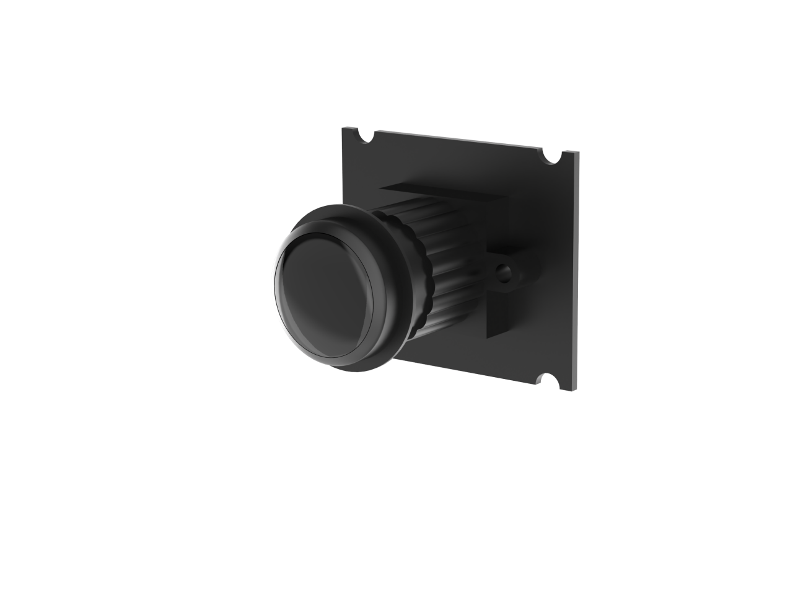

The key difference between the monocular camera and the depth camera is that the monocular version cannot capture depth information. Therefore, applications based on depth perception—such as point cloud visualization, 3D vision-based recognition and tracking, and 3D spatial object grasping—cannot be directly achieved using a monocular camera. Apart from this limitation, all other functionalities are the same as with the depth camera.

### 1.9.4 Others

* **Microphone Module**

This is an optional hardware module that enables voice wake-up and voice control functions on the robot. For related tutorials, please refer to the document [10. Voice Control Basic Lesson](https://wiki.hiwonder.com/projects/ArmPi-Ultra/en/latest/docs/10.Voice_Control_Course.html)

* **PS2 Wireless Controller**

A USB gamepad receiver is connected to the hub, allowing the robotic arm to be controlled via a PS2 wireless controller.

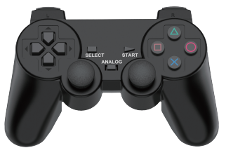

## 1.10 System Software Architecture Overview

Before starting this section, you need to connect to the robot using VNC remote desktop software. For detailed instructions, please refer to [1.6 Development Environment Setup and Configuration](#anchor_1_6) in this document.

> [!NOTE]
>
>The following describes the ROS2 software framework inside Docker.

(1) Click  to open the command terminal, enter the following command, and press Enter to list the files in the home directory:

```
ls
```

The main directories are described as follows:

| **Directory Name** |                 **Description**                  |
|:------------------:|:------------------------------------------------:|
|      software      |         Directory storing software tools         |
|      ros2_ws       | Workspace containing all feature functionalities |
|       shared       | Shared space between Docker and the robot system |
|  large_models_sdk  |  Directory for example scripts of large models   |
|  third_party_ros2  |             Directory storing images             |

(2) Enter the following commands sequentially, pressing **Enter** after each one, to navigate to the robot's package directory and list its contents:

```
cd ~/ros2_ws && ls
```

(3) Folder descriptions:

| **Directory/File Name** | **Description** |
|:--:|:--:|
| build | Build space, stores cache files generated during compilation |
| install | Contains compiled target files and executables |
| log | Folder for storing log files |
| src | Source code folder for function packages |

(4) Next, enter the following commands sequentially, pressing **Enter** after each, to navigate into the robot's package directory and list the contents of the src folder:

```
cd src && ls
```

(5) Folder descriptions:

|   **File Name**   |          **Description**          |
|:-----------------:|:---------------------------------:|
|        app        |       App feature programs        |
|    interfaces     |         Custom interfaces         |
|    simulations    |      Robotic arm simulations      |
|      bringup      |  Launch scripts for APP feature   |
|      driver       |   Low-level robotic arm control   |
|      example      |   Robotic arm example programs    |
|    peripherals    | External device setup for the arm |
|   large_models    | Example scripts for large models  |
| large_models_msgs | Custom messages for large models  |
|   yolov8_detect   |   Object detection model usage    |

- **Function File Structure:**

Using **/ros2_ws/src/example** as an example:

① Enter the following command to navigate into the directory containing the feature files, where you will see multiple folders for different features:

```
cd ~/ros2_ws/src && ls
```

② Using the example package as an example, enter the following command to view the feature files:

```
cd ~/ros2_ws/src/example/example/opencv && ls
```

In this directory, files with the .py extension are the Python scripts corresponding to each feature, while files with the .launch.py extension are the launch files used to start the respective feature.

③ Before launching a feature, make sure to disable the app's auto-start service.

```
~/.stop_ros.sh
```

④ Then, navigate to the feature file directory and enter the following command to launch it:

```
ros2 launch camera_topic_invoke.launch.py
```

⑤ Alternatively, from any directory, you can launch a feature by entering:

```
ros2 launch example camera_topic_invoke.launch.py
```

## 1.11 Image Flashing

### 1.11.1 Preparation

* **Hardware:**

A Raspberry Pi 5, one SD card whose capacity depends on the image size, for example 64GB as shown in the example below, a card reader, and a computer with Windows 10 recommended.


**Software:** A disk initialization tool called DiskGenius.exe and an image burning tool called Win32DiskImager. This tutorial uses these two tools as examples.

> [!NOTE]
>
> Before burning the image, you can use the disk initialization tool provided in [Appendix-> Image Burning Tools->Disk Formatting Tool](https://drive.google.com/drive/folders/1SdWGF4E1teJYu8OfZLUWdEvVGkByHUgE?usp=sharing)  to delete all extra partitions on the SD card.

After the image is written, the system may prompt you with multiple partitions appearing as separate drives. Do not format them, simply cancel the prompts.

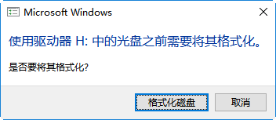

### 1.11.2 SD Card Formatting

> [!NOTE]
>
> If the SD card is blank, formatting is not required.

(1) Remove the SD card from the Raspberry Pi 5.

**Raspberry Pi 5**


(2) In the provided materials, locate the compressed package under [Appendix->Image Burning Tools->Disk Formatting Tool](https://drive.google.com/drive/folders/1SdWGF4E1teJYu8OfZLUWdEvVGkByHUgE?usp=sharing), extract it, and open **DiskGenius.exe** to format the SD card. Make sure you select the correct drive. Choosing the wrong drive may result in formatting your computer's hard disk.

(3) After inserting the SD card into the computer, you will see an additional drive letter appear besides those of your computer's own drives.


(4) Right-click the SD card drive and select **Delete All Partitions**.


(5) As shown in the figure below:


(6) Once deleted, create a new partition so the computer can recognize the SD card. Confirm any pop-up prompts.


(7) Then click **Save All**.


(8) When complete, the SD card is formatted successfully.


### 1.11.3 Image Flashing

(1) Open Win32DiskImager and click the icon  to select the image file. Download and extract it beforehand, and the image shown in examples is for reference only. In the **Device** field, select the SD card drive letter, then click **Write** to start burning the image.


> [!NOTE]
>
>The image file path must not contain Chinese characters.

(2) If prompted the figure below, click **Yes** to continue.


(3) Once you see **Write Successful**, the image has been written successfully. If errors occur, disable antivirus or firewall software, reinsert the card reader, and repeat the steps.


> [!NOTE]
>
> If you are asked to format partitions after burning, ignore the prompt.

(4) After the burning is complete, reinsert the SD card into the Raspberry Pi 5. Power it on, wait a few moments, and the system will boot successfully.