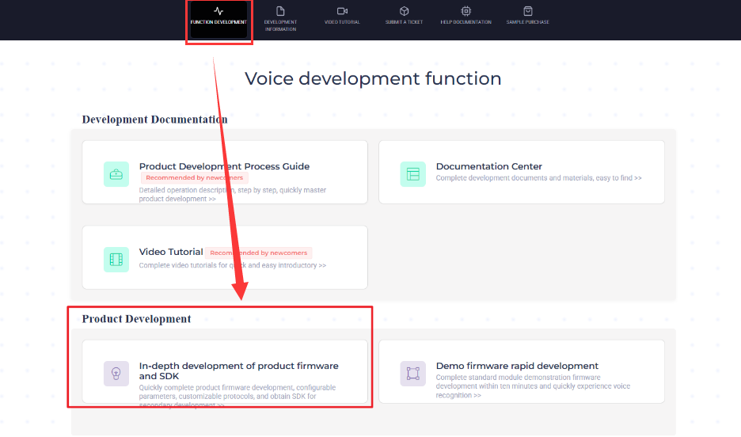
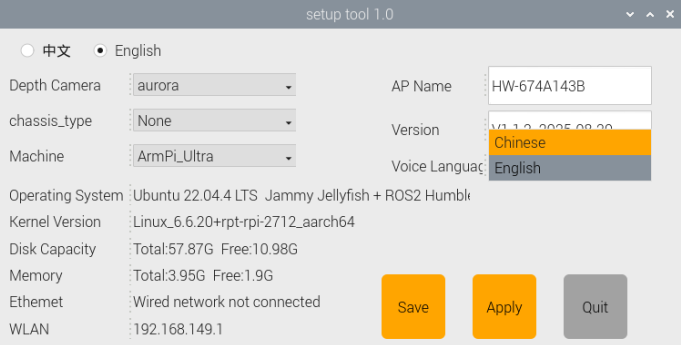

# 10. Voice Control Course

## 10.1 Introduction to WonderEcho Pro

### 10.1.1 Overview

WonderEcho Pro, also known as the AI Voice Interaction Box, is equipped with a high-performance noise-canceling microphone and a high-fidelity speaker. It uses a USB-to-audio module that is plug-and-play and requires no driver installation, and supports both playback and recording across multiple operating systems.

By integrating various voice processing modules, the voice recognition module uses advanced noise suppression algorithms to effectively filter background noise. It supports the entire voice interaction process—from wake word detection to speech recognition and response. Thanks to its modular design, each component can be independently developed and tested, such as wake word detection, voice activity detection, speech recognition, and synthesis.

### 10.1.2 Key Features & Specifications

1.  Built-in microphone and speaker interface, supporting both audio input and output

2.  Plug-and-play functionality with driver-free operation. Compatible with multiple operating systems: Windows, macOS, Linux, Android

3.  USB 2.0 standard interface

4.  Control interface: USB

5.  Voice processing chip: CL1302

6.  Speaker output: 3.0W per channel (4Ω BTL)

7.  Power supply: 5V DC

### 10.1.3 Recording and Playback Test

Taking Raspberry Pi 5 controller to demonstrate the test:

* **Connection Setup & Detection**


Use a remote desktop tool to access the Raspberry Pi desktop, such as VNC, please refer to [1.6 Development Environment Setup and Configuration -> 1.6.1 Remote Control Tool Introduction](https://wiki.hiwonder.com/projects/ArmPi-Ultra/en/latest/docs/1.ArmPi_Ultra_User_Manual.html#development-environment-setup-and-configuration) and Installation for detailed. Check the top-right corner of the screen for microphone and speaker icons. If these icons are present, the device has been successfully connected.


### 10.1.4 Recording and Playback Test

* **Recording Test**

1. Open a terminal window. Run the following command to list available recording devices and find the card number 2.

    > [!NOTE]
    >
    > -l is a lowercase "**L**". And you may find that the card number is 2. This number may vary by device, please use the actual number listed.

```
arecord -l
```


2)  Start recording with the following command, replacing 0 in red with the correct card number:

```
arecord -D hw:2,0 -f S16_LE -r 16000 -c 2 test.wav
```

3)  This will create a **test.wav** file in the current directory.

4)  You can try to speak into the microphone for around 5 seconds, then press **Ctrl + C** to stop recording.

* **Playback Test**

1)  In the same terminal, run the command below to check if the test.wav file exists:

```
ls
```


2)  If you see **test.wav** in the list, the recording was successful. Play the audio using the command:

```
aplay test.wav
```


<p id="anchor_10_2"></p>

## 10.2 Firmware Flashing

In this lesson, we will learn how to flash firmware for WonderEcho Pro.

### 10.2.1 Firmware Flashing

1)  Connect the WonderEcho Pro to your computer using a Type-C data cable.


2)  Open the file under the same folder of this document: [Appendix->PACK_UPDATE_TOOL.exe](https://drive.google.com/drive/folders/1kCVBvkbdpONx_nY2VhXiznhH-pEhlFQj?usp=sharing),  select the "**CI1302**" chip, and then click "**Firmware Upgrade**."


As an example, we will flash the **Englis firmware (wake word: hello hiwonder).bin**. The same steps apply for flashing other wake word versions in Chinese.

3)  Click the button to select firmware, then locate and choose the firmware file: [Appendix->English firmware (wake word: hello hiwonder).bin](https://drive.google.com/drive/folders/1TZgnW5D_cl95-3p6yvgmbv-ULhc0AZYB?usp=sharing).


4)  Locate and select the appropriate serial port.


5)  Press the **RST button** on the voice interaction module to enter flashing mode. Then, wait for the flashing process to complete successfully.


### 10.2.2 Wake Word Test

After flashing the firmware, refer to **Appendix->Serial Port Debugging Tool** to install the serial debugging software. Then follow the steps below to test whether the microphone is working properly:

1)  Connect the WonderEcho Pro to your computer’s USB port using a Type-C to USB cable.


2)  Open Serial Port Utility, select the detected COM port, usually labeled with CH340, and set the baud rate to 115200, as shown in the figure.


3)  Say the configured wake word "Hello Hiwonder". If the system recognizes it successfully, the right-hand display area will show the returned flag information in hexadecimal format, indicating that the wake word has been correctly detected.


## 10.3 Firmware Creation

In this lesson, we will learn how to create firmware for WonderEcho Pro.

### 10.3.1 Wake Word Firmware Creation 

We will use the wake word "HELLO-HIWONDER" as an example to demonstrate firmware creation. The process is also applicable for creating firmware with Chinese wake words. 

> [!NOTE]
>
> For English wake words to be effective, they must be in uppercase.

1. First, open the following link to access the firmware creation website: ChipIntelli Voice AI Platform (chipintelli.com)  

   Website: https://aiplatform.chipintelli.com/home/index.html

2. Click the "**Platform Features**" tab in the menu bar, then navigate to "**In-depth development of Product Firmware & SDK**" under the Product Development section.


3)  The system will prompt you to log in. If you do not have an account yet, please complete the registration first. For international users, we provide a shared account:  
    Username: 18033085495Password: hiwonder)

Once logged in, click "**In-depth development of Product Firmware & SDK**" again.



4)  When the page redirects, click the option  on the left panel to create a new product as shown in the image below. Product name and description can be customized. Other fields must be selected according to the red boxes in the example. Product type needs to select Select General  Smart Control Hub, then click "Create" to complete.


5)  Now fill in the basic project information. Since we’re recognizing English in this example, set **Language Type** to **English**. If you're recognizing Chinese, just select Chinese as the Speech Type and set the Acoustic Model to Chinese. Configure the rest of the parameters as shown in the illustration, then click "**Continue**."


6)  Once you've entered the firmware configuration interface, we will focus on the steps for modifying key parameters. First, in the Algorithm Parameters section, enable the **Echo Cancellation** feature.


7)  In the Hardware Parameters section, set the **Crystal Oscillator Source** to Internal RC and disable Baud Rate Calibration.


8)  In the UART Print Settings, configure UART1 to Open-Drain Mode, supporting external 5V pull-up.


9)  For Communication UART Settings, set the Baud Rate to 115200 and configure UART0 to Open-Drain Mode, also supporting external 5V pull-up. After adjusting these settings, click **Continue** to move forward.


10) The next step involves configuring the command words. You will need to choose a voice output for the wake-up command. For this example, select "**Dane – English Male Voice**" as the output voice. If you're using Chinese as the language, you may choose the voice option "**Chengcheng – Standard Boy Ver.1**". The selection between Chinese and English voices is determined by the language settings configured in Step 5.


11) Then, upload the command word file named **Command Word Broadcast Protocol English Template** by dragging the corresponding spreadsheet into the webpage.

> [!NOTE]
>
> **Note:** If you wish to change the wake word, open the spreadsheet and replace the default wake word HELLO-HIWONDER with your preferred word. Keep in mind that the English version of the firmware only supports English wake words, and mixed-language wake words are not allowed. Additionally, English wake words must be written in uppercase letters to function properly.


12) After uploading the file, you will see the command data populated in the table below.


13) Click "**Submit**" and wait a few minutes for the firmware generation process to complete. Once finished, click "**Download File**" to obtain your customized firmware.


10.4 WonderEcho Pro Installation
---

1)  Install the AI voice module onto the frame using M4×12 screws and M4 nuts. Secure the controller’s top cover with M3×6 screws, then connect the data cable to Port 3.


2)  Connect the AI voice interaction module to Port 3 of the controller.


## 10.5 Voice Interaction Application

### 10.5.1 Preparation

* **WonderEcho Pro Setup**

Before use, make sure to flash the corresponding firmware. For detailed steps, refer to the tutorial [10. Voice Control Course ->10.2 Firmware Flashing](#anchor_10_2) to flash the appropriate firmware.

### 10.5.2 Voice-Controlled Color Sorting

In this activity, the robot sorts colored blocks based on voice commands. After detecting a specified block, it places the block at the corresponding location.

* **Preparation**

1)  Before beginning, ensure that the AI voice interaction module WonderEcho Pro is properly installed on the robot, and connected to the USB ports of the USB hub.

2)  If the robotic arm or the workspace map has been moved before starting this activity, please recalibrate the positions. Please first refer to [1. ArmPi Ultra User Manual  -\> 1.8 Position Adjustment for Object Gripping and Placing](https://wiki.hiwonder.com/projects/ArmPi-Ultra/en/latest/docs/1.ArmPi_Ultra_User_Manual.html#position-adjustment-for-object-gripping-and-placing) to perform position calibration.

* **Overview**

1)  First, the system subscribes to the voice recognition service published by the microphone node. It processes the incoming voice data through localization, noise reduction, and recognition, and then retrieves the recognized sentence and the angle of the sound source.

2)  After successfully waking up the robot and issuing a command, the robot responds with a voice confirmation.

3)  Then give a command to the robot, it will execute the corresponding action, enabling or disabling the color sorting task.

4)  In the Color Sorting mode of the app, the process consists of two main parts: color recognition and sorting.

5)  In the recognition process, Gaussian filtering is first applied to reduce noise in the image. Then, the image is converted to the Lab color space to better distinguish colors. For details on Lab color space, refer to [6. OpenCV Vision Course->6.1 Positioning & Gripping](https://wiki.hiwonder.com/projects/ArmPi-Ultra/en/latest/docs/5.OpenCV_Vision_Course.html#positioning-gripping).

6)  Based on this, color thresholds are used to identify the color of the object within the bounding box. A mask is then applied to the image, which involves selecting parts of the image, graphics, or objects to globally or locally block out areas in the image for processing.

7)  Then, morphological operations including opening and closing are performed on the object image to refine the results. Finally, identify the largest contour and outline the detected object.

8)  Once the specified color is recognized, the robotic arm lowers to the designated position, grips the block, and places it in the corresponding area.

* **Operations**

> [!NOTE]
>
> * The input command should be case sensitive, and the keywords can be complemented by "Tab" key.
>
> * Ensure that no objects with similar or identical colors to the target block appear in the background, as this may cause interference during recognition.
>
> * If the color recognition is inaccurate, refer to [1. ArmPi Ultra User Manual → 1.5 Color Threshold Setting](https://wiki.hiwonder.com/projects/ArmPi-Ultra/en/latest/docs/1.ArmPi_Ultra_User_Manual.html#color-threshold-setting) to fine-tune the color threshold settings.

1)  Power on the robot and connect it to a remote control tool like VNC. To connect the robot to it, you may refer to the tutorials locating in [1. ArmPi Ultra User Manual ->1.6 Development Environment Setup and Configuration](https://wiki.hiwonder.com/projects/ArmPi-Ultra/en/latest/docs/1.ArmPi_Ultra_User_Manual.html#development-environment-setup-and-configuration).

2)  Before use, make sure to flash the corresponding firmware to the WonderEcho Pro. For detailed steps, refer to the tutorial [10. Voice Control Course ->10.2 Firmware Flashing](#anchor_10_2) to flash the appropriate firmware.

3)  The system is configured by default to use the English wake word "**Hello Hiwonder**". If you need to switch to a wake word in another language, refer to [10.6 Switching Between Chinese and English Wake Words](#anchor_10_6) in the same directory.

4)  Click the terminal icon  in the system desktop to open a command-line window.

5)  Enter the command to disable the auto-start service.

```
~/.stop_ros.sh
```

6)  When using the voice control feature for the first time, or after modifying the wake word, you must run the microphone initialization file to activate the wake word. Otherwise, the microphone will not function properly.

Open the terminal and enter the following commands:

```
ros2 launch example wonderechopro_init.launch.py
```


Once executed, the terminal will display prompt messages. At this point, you can speak the wake word to activate the microphone.


After activation, press **Ctrl + C** to stop the process.

7)  Enter the following command to start the feature.

```
ros2 launch example voice_control_color_sorting.launch.py
```

8)  Say the wake word, default by "**Hello Hiwonder**", and then issue the sorting command.

9)  To exit the feature, press **Ctrl + C** in the terminal. If the program does not close successfully, try pressing **Ctrl + C** again.

10. After completing the feature, you need to initiate the app service.  **Otherwise, future APP features may not function properly.** In the terminal, enter the following command and press **Enter** to start the app service. Wait a few seconds for it to initialize.

```
ros2 launch bringup bringup.launch.py
```

11) Once the APP service is successfully started, the robotic arm will return to its initial pose, and the buzzer will beep once.

* **Project Outcome**

Once the feature is activated, simply say the wake word followed by a command phrase to control the color-sorting task.

For example, say the wake word "**Hello Hiwonder**", then say the command "**sorting red object**". The terminal will display the target color, and the system will begin identifying blocks of that color within the workspace. Once the color block is detected, the robotic arm will pick it up and place it in the designated area.

Wake Word and Command Phrases:

<table border="1" cellpadding="6" cellspacing="0" style="border-collapse: collapse; width: 100%;">
  <thead>
    <tr>
      <th style="text-align: center;">Wake Word</th>
      <th style="text-align: center;">Command Phrase</th>
      <th style="text-align: center;">Project Outcome</th>
    </tr>
  </thead>
  <tbody>
    <tr>
      <td style="text-align: center;" rowspan="4">Hello Hiwonder</td>
      <td style="text-align: center;">Sorting red object</td>
      <td style="text-align: center;">Pick up red block</td>
    </tr>
    <tr>
      <td style="text-align: center;">Sorting green object</td>
      <td style="text-align: center;">Pick up green block</td>
    </tr>
    <tr>
      <td style="text-align: center;">Sorting blue object</td>
      <td style="text-align: center;">Pick up blue block</td>
    </tr>
    <tr>
      <td style="text-align: center;">Stop color sorting</td>
      <td style="text-align: center;">Stop the color sorting task</td>
    </tr>
  </tbody>
</table>

* **Program Brief Analysis**

(1) launch File Analysis

This section focuses on voice wake-up and voice control features. For details on the color-sorting functionality, please refer to the dedicated tutorials.

The voice control node communicates with the camera node, robotic arm control node, and color sorting node. Through spoken commands, you can start or stop the color-tracking activity, allowing the robot to execute or terminate the task based on voice input.

(2) launch_setup Function

{lineno-start=10}

```
def launch_setup(context):
    compiled = os.environ['need_compile']
    start = LaunchConfiguration('start', default='true')
    start_arg = DeclareLaunchArgument('start', default_value=start)
    display = LaunchConfiguration('display', default='true')
    display_arg = DeclareLaunchArgument('display', default_value=display)

    if compiled == 'True':      
        example_package_path = get_package_share_directory('example')
    else:
        example_package_path = '/home/ubuntu/ros2_ws/src/example'

    mic_launch = IncludeLaunchDescription(
        PythonLaunchDescriptionSource(
            os.path.join(example_package_path, 'example/voice_control/wonderechopro_init.launch.py')),
    )
    color_sorting_node_launch = IncludeLaunchDescription(
        PythonLaunchDescriptionSource(
            os.path.join(example_package_path, 'example/opencv/color_sorting_node.launch.py')),
        launch_arguments={
            'broadcast': 'true',
        }.items(),
    )

    voice_control_color_sorting_node = Node(
        package='example',
        executable='voice_control_color_sorting',
        output='screen',
    )

    return [ 
            color_sorting_node_launch,
            mic_launch,
            voice_control_color_sorting_node,
            ]
```

Includes the launch file **example/voice_control/wonderechopro_init.launch.py** from the example package, which starts the microphone-related nodes. Includes the launch file **example/opencv/color_sorting_node.launch.py** from the example package, which starts the color-sorting node with its configuration. The parameter broadcast is set to true. Defines the node voice_control_color_sorting_node, which runs the executable voice_control_color_sorting from the example package.

(3) generate_launch_description Function

{lineno-start=46}

```
def generate_launch_description():
    return LaunchDescription([
        OpaqueFunction(function = launch_setup)
    ])
```

Creates and returns a LaunchDescription object, calling launch_setup via OpaqueFunction as the standard entry point for the ROS 2 launch file.

(4) Main Function

{lineno-start=51}

```
if __name__ == '__main__':
    # 创建一个LaunchDescription对象
    ld = generate_launch_description()

    ls = LaunchService()
    ls.include_launch_description(ld)
    ls.run()
```

Creates a LaunchDescription object and a LaunchService service. The launch description is added to the service and executed, enabling the startup of the entire system.

(2) Python File Analysis

This section focuses on voice wake-up and voice control features. For details on the color sorting functionality, please refer to the dedicated tutorials.

① Import the Necessary Libraries

{lineno-start=4}

```
import os
import json
import rclpy
from . import voice_play
from rclpy.node import Node
from std_msgs.msg import String
from interfaces.srv import SetStringBool
from std_srvs.srv import Trigger, SetBool
from rclpy.executors import MultiThreadedExecutor
from ros_robot_controller_msgs.msg import BuzzerState
from rclpy.callback_groups import ReentrantCallbackGroup
```

**from std_srvs.srv import Trigger**: Imports the Trigger service type from std_srvs.srv, used for providing and calling simple trigger-based services.

**from rclpy.executors import MultiThreadedExecutor**: Imports the MultiThreadedExecutor from rclpy.executors, which manages multiple nodes concurrently using multithreading.

**from ros_robot_controller_msgs.msg import BuzzerState**: Imports the BuzzerState message type from ros_robot_controller_msgs.msg, used to control and monitor the buzzer state.

**from rclpy.callback_groups import ReentrantCallbackGroup**: Imports the ReentrantCallbackGroup from rclpy.callback_groups, allowing callback functions to be reentered safely.

② Node Initialization

{lineno-start=17}

```
    def __init__(self, name):
        rclpy.init()
        super().__init__(name, allow_undeclared_parameters=True, automatically_declare_parameters_from_overrides=True)
        
        self.running = True
        self.language = os.environ['ASR_LANGUAGE']
        timer_cb_group = ReentrantCallbackGroup()
        self.buzzer_pub = self.create_publisher(BuzzerState, 'ros_robot_controller/set_buzzer', 1)
        self.create_subscription(String, 'asr_node/voice_words', self.words_callback, 1, callback_group=timer_cb_group)

        self.client = self.create_client(Trigger, 'asr_node/init_finish')
        self.client.wait_for_service()
        self.client = self.create_client(Trigger, 'object_sorting/init_finish')
        self.client.wait_for_service()   
        self.set_target_client = self.create_client(SetStringBool, 'object_sorting/set_target', callback_group=timer_cb_group)
        self.set_target_client.wait_for_service()

        self.timer = self.create_timer(0.0, self.init_process, callback_group=timer_cb_group)

```

Initializes the ROS node with undeclared parameters allowed, while automatically incorporating externally provided parameters into the node’s parameter management, such as those passed from the command line or launch files. Sets the runtime flag and retrieves the voice recognition language from environment variables. Creates a callback group and a publisher for the buzzer state. Subscribes to the asr_node/voice_words topic to receive voice recognition results. Waits for the initialization services of the voice recognition and object sorting nodes to become available. Creates a client for the target-setting service. Starts a timer to handle the initialization process.

③ init_process Function 

{lineno-start=36}

```
    def init_process(self):
        self.timer.cancel()
        self.play('running')
        self.get_logger().info('\033[1;32m%s\033[0m' %'唤醒口令: 小幻小幻(Wake up word: hello hiwonder)')
        self.get_logger().info('\033[1;32m%s\033[0m' %'唤醒后15秒内可以不用再唤醒(No need to wake up within 15 seconds after waking up)')
        self.get_logger().info('\033[1;32m%s\033[0m' %'控制指令: 分拣红色 分拣绿色 分拣蓝色 关闭颜色分拣(Voice command: sorting red/green/blue object stop color sorting)')

        self.create_service(Trigger, '~/init_finish', self.get_node_state)
        self.get_logger().info('\033[1;32m%s\033[0m' % 'start')
```

Cancels the initialization timer, plays a startup audio message, and prints the supported wake words and control commands. Creates the initialization-complete service and outputs startup logs.

④ get_node_state Function 

{lineno-start=47}

```
    def get_node_state(self, request, response):
        response.success = True
        return response
```

Responds to the initialization completion service and returns a success response.

⑤ play Function 

{lineno-start=51}

```
    def play(self, name):
        voice_play.play(name, language=self.language)
```

Calls the audio playback module to play a specific audio file according to the language setting.

⑥ send_request Function 

{lineno-start=54}

```
    def send_request(self, client, msg):
        future = client.call_async(msg)
        while rclpy.ok():
            if future.done() and future.result():
                return future.result()
```

Sends an asynchronous request to the service client and waits in a loop until the response is complete. If successful, returns the result.

⑦ words_callback Function 

{lineno-start=60}

```
    def words_callback(self, msg):
        words = json.dumps(msg.data, ensure_ascii=False)[1:-1]
        if self.language == 'Chinese':
            words = words.replace(' ', '')

        if words is not None and words not in ['唤醒成功(wake-up-success)', '休眠(Sleep)', '失败5次(Fail-5-times)',
                                               '失败10次(Fail-10-times)']:
            if words == '分拣红色' or words == 'sorting red object':
                self.play('start_sort_red')
                req = SetStringBool.Request()
                req.data_bool = True
                req.data_str = 'red'
                res = self.send_request(self.set_target_client, req)

            elif words == '分拣绿色' or words == 'sorting green object':
                self.play('start_sort_green')
                req = SetStringBool.Request()
                req.data_bool = True
                req.data_str = 'green'
                res = self.send_request(self.set_target_client, req)

            elif words == '分拣蓝色' or words == 'sorting blue object':
                self.play('start_sort_blue')
                req = SetStringBool.Request()
                req.data_bool = True
                req.data_str = 'blue'
                res = self.send_request(self.set_target_client, req)

            elif words == '关闭颜色分拣' or words == 'stop color sorting':
                target_list = ["red", "green", "blue"]
                req = SetStringBool.Request()
                req.data_bool = False
                for i in target_list:
                    req.data_str = i
                    res = SetBool.Response()
                    res = self.send_request(self.set_target_client, req)
                self.play('stop_sort')

        elif words == '唤醒成功(wake-up-success)':
            self.play('awake')
        elif words == '休眠(Sleep)':
            msg = BuzzerState()
            msg.freq = 1900
            msg.on_time = 0.05
            msg.off_time = 0.01
            msg.repeat = 1
            self.buzzer_pub.publish(msg)
```

Voice command callback that processes recognized voice text. For commands: "Sorting red/green/blue object" triggers sorting of red, green, or blue blocks, "Stop color sorting" disables all color-sorting tasks, "Wakeup success" plays a wakeup sound, and "Sleep" controls the buzzer to emit a sound.

⑧ main Function 

{lineno-start=108}

```
def main():
    node = VoiceControlColorSortingNode('voice_control_color_sorting')
    executor = MultiThreadedExecutor()
    executor.add_node(node)
    executor.spin()
    node.destroy_node()
```

Creates a VoiceControlColorSortingNode instance named "voice_control_color_sorting". Adds the node to a MultiThreadedExecutor and spins it. Cleans up and destroys the node when the program exits.

### 10.5.3 Voice-Controlled Color Tracking

In this lesson, the robotic arm is controlled through voice commands to track a specific color. Once the target color is detected, the arm will follow the movement of that color.

* **Preparation**

1)  Before beginning, ensure that the AI voice interaction module WonderEcho Pro is properly installed on the robot, and connected to the USB ports of the USB hub.

2)  If the robotic arm or the workspace map has been moved before starting this activity, please recalibrate the positions. Please first refer to [1. ArmPi Ultra User Manual-\> 1.8 Position Adjustment for Object Gripping and Placing](https://wiki.hiwonder.com/projects/ArmPi-Ultra/en/latest/docs/1.ArmPi_Ultra_User_Manual.html#position-adjustment-for-object-gripping-and-placing) to perform position calibration.

* **Overview**

First, the system subscribes to the voice recognition service published by the microphone node. It processes the incoming voice data through localization, noise reduction, and recognition, and then retrieves the recognized sentence and the angle of the sound source.

Next, the robot is activated using a specific wake word. Once the wake word is recognized, the robot provides voice feedback to confirm activation.

Finally, when a valid command is issued, the robot begins tracking the specified color.

The implementation of target tracking is divided into two parts: color recognition and tracking.

In the recognition process, Gaussian filtering is first applied to reduce noise in the image. Then, the image is converted to the Lab color space to better distinguish colors. For details on Lab color space, refer to [5. OpenCV Vision Course->5.1 Positioning & Gripping](https://wiki.hiwonder.com/projects/ArmPi-Ultra/en/latest/docs/5.OpenCV_Vision_Course.html#positioning-gripping).

Based on this, color thresholds are used to identify the color of the object within the bounding box. A mask is then applied to the image, which involves selecting parts of the image, graphics, or objects to globally or locally block out areas in the image for processing.

Then, morphological operations including opening and closing are performed on the object image to refine the results. Finally, identify the largest contour and outline the detected object.

The tracking part uses a PID algorithm, which compares the target’s pixel coordinates in the frame with the frame’s center coordinates, reducing the distance between the two to achieve target tracking.

For more details on PID algorithm, refer to [5. OpenCV Vision Course->5.2 Target Tracking](https://wiki.hiwonder.com/projects/ArmPi-Ultra/en/latest/docs/5.OpenCV_Vision_Course.html#target-tracking).

* **Operations**

> [!NOTE]
>
> * The input command should be case sensitive, and the keywords can be complemented by "Tab" key.
>
> * Ensure that no objects with similar or identical colors to the target block appear in the background, as this may cause interference during recognition.
>
> * Avoid moving the color block too quickly, as excessive speed may cause the target to be lost and tracking to fail.
>
> * If the color recognition is inaccurate, refer to [1. ArmPi Ultra User Manual  → 1.5 Color Threshold Setting](https://wiki.hiwonder.com/projects/ArmPi-Ultra/en/latest/docs/1.ArmPi_Ultra_User_Manual.html#color-threshold-setting) to fine-tune the color threshold settings.

1)  Power on the robot, and access the robot system desktop using VNC. To get detailed instructions on remote control software connection, please refer to the tutorials saved in [1. ArmPi Ultra User Manual ->1.6 Development Environment Setup and Configuration](https://wiki.hiwonder.com/projects/ArmPi-Ultra/en/latest/docs/1.ArmPi_Ultra_User_Manual.html#development-environment-setup-and-configuration).

2)  Before use, make sure to flash the corresponding firmware to the WonderEcho Pro. For detailed steps, refer to the tutorial [10. Voice Control Course ->10.2 Firmware Flashing](#anchor_10_2) to flash the appropriate firmware.

3)  The system is configured by default to use the English wake word "**Hello Hiwonder**". If you need to switch to a wake word in another language, refer to [10.6 Switching Between Chinese and English Wake Words](#anchor_10_6) in the same directory.

4)  Click the terminal icon  in the system desktop to open a command-line window.

5)  Execute the following command to disable the auto-start service.

```
~/.stop_ros.sh
```

6)  When using the voice control feature for the first time, or after modifying the wake word, you must run the microphone initialization file to activate it. Otherwise, the microphone will not function properly.

Open the terminal and enter the following commands:

```    
ros2 launch example wonderechopro_init.launch.py
```

Once executed, the terminal will display prompt messages. At this point, you can speak the wake word to activate the microphone.


7)  Enter the following command and press **Enter** to start the feature.

```
ros2 launch example voice_control_color_track.launch.py
```

8)  To exit the feature, press **Ctrl + C** in the terminal. If the program does not close successfully, try pressing **Ctrl + C** again.

9)  After completing the feature, you need to initiate the app service.  **Otherwise, future APP features may not function properly.** In the terminal, enter the following command and press Enter to start the app service. Wait a few seconds for it to initialize.

```
ros2 launch bringup bringup.launch.py
```

10) Once the APP service is successfully started, the robotic arm will return to its initial pose, and the buzzer will beep once.

* **Project Outcome**

After starting this mode, say the wake word "**Hello Hiwonder**" followed by a tracking command to make the robot track a specific color.

This feature supports tracking red, green, and blue. For example, to track the red color, position a red block within the camera’s view. First, say the wake word "**Hello Hiwonder**," then give the tracking command "**track red object**."

Once the red block is detected, the robotic arm will adjust its servos so that the depth camera faces the red block. As you move the block, the robotic arm will follow its movement both horizontally and vertically.

To stop color tracking, say the wake word "**Hello Hiwonder**" followed by the command "**stop tracking**."

Wake Word and Command Phrases:

<table class="docutils-nobg" border="1">
    <tr>
        <th>Wake Word</th>
        <th>Command Phrase</th>
        <th>Project Outcome</th>
    </tr>
    <tr>
        <td rowspan="4">Hello Hiwonder</td>
        <td>Sorting red object</td>
        <td>Pick up red block</td>
    </tr>
    <tr>
        <td>Sorting green object</td>
        <td>Pick up green block</td>
    </tr>
    <tr>
        <td>Sorting blue object</td>
        <td>Pick up blue block</td>
    </tr>
    <tr>
        <td>Stop color sorting</td>
        <td>Stop the color sorting task</td>
    </tr>
</table>

* **Program Brief Analysis**

(1) launch File Analysis

This section focuses on voice wake-up and voice control features.  

For details on the color tracking functionality, please refer to the dedicated tutorials.

Voice-controlled color tracking enables the voice control node to communicate with the camera node, robotic arm control node, and color tracking node. Through spoken commands, it allows the robotic arm to recognize and track colored blocks.

① launch_setup Function 

{lineno-start=9}

```
def launch_setup(context):
    compiled = os.environ['need_compile']

    if compiled == 'True':      
        example_package_path = get_package_share_directory('example')
    else:
        example_package_path = '/home/ubuntu/ros2_ws/src/example'

    color_track_node_launch = IncludeLaunchDescription(
        PythonLaunchDescriptionSource(
            os.path.join(example_package_path, 'example/opencv/color_track_node.launch.py')),
        launch_arguments={
            'broadcast': 'true',
        }.items(),
    )

    mic_launch = IncludeLaunchDescription(
        PythonLaunchDescriptionSource(
            os.path.join(example_package_path, 'example/voice_control/wonderechopro_init.launch.py')),
        )

    voice_control_color_track_node = Node(
        package='example',
        executable='voice_control_color_track',
        output='screen',
    )

    return [
            color_track_node_launch,
            mic_launch,
            voice_control_color_track_node,
            ]
```

Includes the launch file **example/opencv/color_track_node.launch.py** from the example package, which starts the color-tracking node with its configuration. The parameter broadcast is set to true. Includes the launch file **example/voice_control/wonderechopro_init.launch.py** from the example package, which starts the microphone-related nodes. Defines the node voice_control_color_track_node, which launches the executable voice_control_color_track from the example package.

② generate_launch_description Function 

{lineno-start=41}

```
def generate_launch_description():
    return LaunchDescription([
        OpaqueFunction(function = launch_setup)
    ])
```

Creates and returns a LaunchDescription object, calling launch_setup via OpaqueFunction as the standard entry point for the ROS 2 launch file.

③ Main Function 

{lineno-start=47}

```
if __name__ == '__main__':
    # 创建一个LaunchDescription对象
    ld = generate_launch_description()

    ls = LaunchService()
    ls.include_launch_description(ld)
    ls.run()

```

Creates a LaunchDescription object and a LaunchService service. The launch description is added to the service and executed, enabling the startup of the entire system.

(2) Python File Analysis

This section focuses on voice wake-up and voice control features. For details on the color tracking functionality, please refer to the dedicated tutorials.

① mport the Necessary Libraries 

{lineno-start=5}

```
import os
import json
import rclpy
from . import voice_play
from rclpy.node import Node
from std_msgs.msg import String
from interfaces.srv import SetFloat64
from std_srvs.srv import Trigger, SetBool
from rclpy.executors import MultiThreadedExecutor
from ros_robot_controller_msgs.msg import BuzzerState
from rclpy.callback_groups import ReentrantCallbackGroup
```

**from interfaces.srv import SetString**: Imports the SetString service type from the custom interfaces package.

**from ros_robot_controller_msgs.msg import BuzzerState**: Imports the BuzzerState message type from the ros_robot_controller_msgs package, which is used to control the buzzer state.

② Node Initialization

{lineno-start=18}

```
    def __init__(self, name):
        rclpy.init()
        super().__init__(name, allow_undeclared_parameters=True, automatically_declare_parameters_from_overrides=True)

        self.language = os.environ['ASR_LANGUAGE']
        timer_cb_group = ReentrantCallbackGroup()
        self.buzzer_pub = self.create_publisher(BuzzerState, 'ros_robot_controller/set_buzzer', 1)
        self.create_subscription(String, 'asr_node/voice_words', self.words_callback, 1, callback_group=timer_cb_group)
        self.client = self.create_client(Trigger, 'asr_node/init_finish')
        self.client.wait_for_service()
        self.client = self.create_client(Trigger, 'object_tracking/init_finish')
        self.client.wait_for_service()
        self.start_client = self.create_client(SetBool, 'object_tracking/enable_color_tracking')
        self.start_client.wait_for_service()
        self.set_color_client = self.create_client(SetFloat64, 'object_tracking/set_target_color', callback_group=timer_cb_group)
        self.set_color_client.wait_for_service()

        self.timer = self.create_timer(0.0, self.init_process, callback_group=timer_cb_group)
```

Initializes the ROS node, allowing undeclared parameters and automatically declaring parameters from overrides. Retrieves the speech recognition language from environment variables. Creates a callback group, a publisher for the buzzer state, and subscribes to the speech recognition result topic asr_node/voice_words. Waits for the initialization services of the speech recognition node and the object tracking node to start. Creates service clients for enabling tracking and setting the target color. Starts the initialization processing timer.

③ init_process Function 

{lineno-start=37}

```
    def init_process(self):
        self.timer.cancel()
        self.play('running')
        self.get_logger().info('\033[1;32m%s\033[0m' % '唤醒口令: 小幻小幻(Wake up word: hello hiwonder)')
        self.get_logger().info('\033[1;32m%s\033[0m' % '唤醒后15秒内可以不用再唤醒(No need to wake up within 15 seconds after waking up)')
        self.get_logger().info('\033[1;32m%s\033[0m' % '控制指令: 追踪红色 追踪绿色 追踪蓝色 停止追踪(Voice command: track red/green/blue object)')

        self.create_service(Trigger, '~/init_finish', self.get_node_state)
        self.get_logger().info('\033[1;32m%s\033[0m' % 'start')
```

Cancels the initialization timer, plays a startup audio message, and prints the supported wake words and control commands. Creates the initialization-complete service and outputs startup logs.

④ get_node_state Function 

{lineno-start=47}

```
    def get_node_state(self, request, response):
        response.success = True
        return response
```

Responds to the initialization completion service and returns a success response.

⑤ play Function 

{lineno-start=51}

```
    def play(self, name):
        voice_play.play(name, language=self.language)
```

Calls the audio playback module to play a specific audio file according to the language setting.

⑥ send_request Function 

{lineno-start=54}

```
    def send_request(self, client, msg):
        future = client.call_async(msg)
        while rclpy.ok():
            if future.done() and future.result():
                return future.result()
```

Sends an asynchronous request to the service client and waits in a loop until the response is complete. If successful, returns the result.

⑦ words_callback Function 

{lineno-start=60}

```
    def words_callback(self, msg):
        words = json.dumps(msg.data, ensure_ascii=False)[1:-1]
        if self.language == 'Chinese':
            words = words.replace(' ', '')
        if words is not None and words not in ['唤醒成功(wake-up-success)', '休眠(Sleep)', '失败5次(Fail-5-times)',
                                               '失败10次(Fail-10-times']:
            if words == '追踪红色' or words == 'track red object':
                req = SetFloat64.Request()
                req.data = 1.0 #追踪的颜色 0.0为不追踪， 1.0为红色， 2.0为绿色，3.0为蓝色
                res = self.send_request(self.set_color_client, req)
                if res.success:
                    self.play('start_track_red')
                else:
                    self.play('track_fail')
            elif words == '追踪绿色' or words == 'track green object':
                req = SetFloat64.Request()
                req.data = 2.0 #追踪的颜色 0.0为不追踪， 1.0为红色， 2.0为绿色，3.0为蓝色
                res = self.send_request(self.set_color_client, req)
                if res.success:
                    self.play('start_track_green')
                else:
                    self.play('track_fail')
            elif words == '追踪蓝色' or words == 'track blue object':
                req = SetFloat64.Request()
                req.data = 3.0 #追踪的颜色 0.0为不追踪， 1.0为红色， 2.0为绿色，3.0为蓝色
                res = self.send_request(self.set_color_client, req)
                if res.success:
                    self.play('start_track_blue')
                else:
                    self.play('track_fail')
            elif words == '停止追踪' or words == 'stop tracking':
                req = SetBool.Request()
                req.data = False
                res = self.send_request(self.start_client, req)
                if res.success:
                    self.play('stop_track')
                else:
                    self.play('stop_fail')
        elif words == '唤醒成功(wake-up-success)':
            self.play('awake')
        elif words == '休眠(Sleep)':
            msg = BuzzerState()
            msg.freq = 1900
            msg.on_time = 0.05
            msg.off_time = 0.01
            msg.repeat = 1
            self.buzzer_pub.publish(msg)
```

The voice command callback function parses the recognized speech text and executes the corresponding action. For English commands such as "track red/green/blue object," it calls the target color setting service, passing the corresponding identifier value (1.0/2.0/3.0), and plays a success or failure tone based on the service response. For commands like "stop tracking," it calls the tracking enable service with a value of false to stop tracking, and then plays a tone according to the response. For the commands "Wakeup success" and "Sleep," it plays a wake-up notification sound and controls the buzzer to emit a sound, respectively.

⑦ main Function 

{lineno-start=108}

```
def main():
    node = VoiceControlColorTrackNode('voice_control_color_track')
    executor = MultiThreadedExecutor()
    executor.add_node(node)
    executor.spin()
    node.destroy_node()
```

Creates a VoiceControlColorTrackNode instance named "voice_control_color_track". Adds the node to a MultiThreadedExecutor and spins it. Cleans up and destroys the node when the program exits.

<p id="anchor_10_6"></p>

## 10.6 Switching Wake Words Between Chinese and English

By default, the system uses the English wake word **"Hello Hiwonder"**. If you want to switch to Chinese wake words or commands, follow the steps below.

1)  The robot currently uses the AI voice module WonderEcho Pro, which requires flashing the appropriate language firmware before use. For detailed instructions, please refer to [10.2 Firmware Flashing](#anchor_10_2).


<p style="text-align:center">WonderEcho Pro</p>

2)  The robot currently uses the AI voice module WonderEchoPro, which requires setting the recognition language. On the desktop, double-click the Tool icon  to open the configuration tool. Select the target language.



3)  Click **Save**.


4)  Click **Apply**.


5)  Click **Quit**.

