# 11. Large AI Model Course

## 11.1 Large Models Basic Courses

### 11.1.1 Large Language Model Courses

* **Overview of Large Language Model**

A Large Language Model (LLM) is an advanced artificial intelligence model developed to comprehend and generate human language.


(1) Basic Concept

A Large Language Model (LLM) is a deep learning model trained on extensive text data, designed to either generate natural language text or comprehend the meaning of language. LLM is capable of performing various natural language tasks, such as text classification, question answering, and dialogue, making them a crucial step toward achieving advanced artificial intelligence. Unlike smaller models, LLM leverages a similar Transformer architecture and pretraining objectives (like Language Modeling), but are distinguished by their larger model size, greater training data, and enhanced computational resources.

(2) Features

**Massive Scale:** LLM are characterized by their vast parameter sizes, often reaching billions or even trillions of parameters. This immense scale allows them to capture a wealth of linguistic knowledge and complex syntactic structures.

**Pretraining and Fine-tuning:** LLM utilize a two-stage learning process: pretraining and fine-tuning. Initially, they are pretrained on large-scale, unlabeled text data, learning general language representations and knowledge. Subsequently, they are fine-tuned using labeled data to specialize in specific tasks, allowing them to excel across a wide range of NLP applications.

**Contextual Awareness:** LLM demonstrate exceptional contextual awareness, with their ability to understand and generate language deeply dependent on preceding text. This enables them to perform exceptionally well in tasks like dialogue, article generation, and contextual comprehension.

**Multilingual Capabilities:** LLM support multiple languages, extending beyond just English. This multilingual proficiency enables them to power cross-lingual and cross-cultural applications, enhancing their versatility and global reach.

**Multimodal Support:** Some LLMs have expanded to handle multimodal data, including text, images, and speech. This capability allows them to understand and generate content across various media types, opening up more diverse application possibilities.

**Emergent Properties:** LLM exhibit remarkable emergent properties, where performance improvements become apparent in large models but are absent in smaller ones. This makes them adept at handling more complex tasks and challenges.

**Cross-domain Applications:** LLM have been widely adopted across numerous fields, including text generation, machine translation, information retrieval, summarization, chatbots, and virtual assistants. Their influence is profound, impacting both daily life and work in significant ways.

**Ethical and Risk Considerations:** While LLM showcase impressive capabilities, they also raise important ethical and risk-related concerns, such as the potential generation of harmful content, privacy violations, and cognitive biases. As such, the development and deployment of LLM must be approached with careful consideration and caution.

(3) Working Principle

Large Language Model (LLM) are built on deep learning principles and are trained using massive datasets and substantial computational resources to develop neural networks with billions of parameters. Through iterative training and parameter optimization, these models learn to perform a wide range of tasks with high accuracy. The "**large**" in LLM reflects their immense scale—encompassing a vast number of parameters, extensive training data, and significant computational demands. This scale enables advanced models to achieve superior generalization capabilities and deliver increasingly accurate results, even in highly specialized domains.

Today, some of the most popular applications revolve around generative AI, such as language generation tools (e.g., ChatGPT) and image generation platforms (e.g., Midjourney). At the core of these applications is the concept of generation—the model's ability to predict and produce coherent content based on a given input.

(4) Application Scenarios

① Text Generation

Large Language Models are capable of generating diverse types of text, including news articles, stories, poems, and more. These capabilities make them well-suited for applications in content creation, creative writing, and automated storytelling.

② Text Classification

Large Language Models can classify text into various categories, such as sentiment analysis and topic identification. These capabilities are especially valuable in scenarios like public opinion analysis, information retrieval, and content moderation.

③  Machine Translation

Large Language Models excel at machine translation, enabling the conversion of text from one language to another. These capabilities are essential for cross-language communication, localization, and global collaboration.

④ Question-Answering Systems

Large Language Models can be used to build question-answering systems that respond to user queries. These applications are particularly valuable in areas such as intelligent customer support, knowledge retrieval, and information lookup.

<p id="anchor_11_1_1_2"></p>

* **Large Language Model Deployment**

> [!NOTE]
>
> This section outlines the steps to register on the official OpenAI website and obtain the API key for the Large Language Model.

(1) OpenAI Account Registration and Setup

① Copy the following URL: <https://platform.openai.com/docs/overvie>

Open the OpenAI website and click on the "**Sign Up**" button in the top right corner.


② Follow the prompts to register and log in using your Google, Microsoft, or Apple account.


③ Click on the settings icon, then select Billing, followed by Payment Methods, to link your payment method. Recharge your account to purchase tokens.


④ After completing the setup, click on API Keys, then select Create New Secret Key. Follow the prompts to fill in the required information. Once the key is created, make sure to save it for future use.


⑤ With these steps, the large model has been successfully created and deployed. You can now use the API in the upcoming lessons.

(2) OpenRouter Account Registration and Setup

① Copy the following URL: [https://openrouter.ai/](https://openrouter.ai/)

Open the webpage in your browser and click "**Sign In**". Register using your Google account or another available login option.


② After logging in, click the icon in the top-right corner and select **"Credits"** to link your payment method.


③ To create an API key, go to **"API Keys"**, then click **"Create Key"**. Follow the prompts to complete the process. Once the key is generated, make sure to save it for future use.

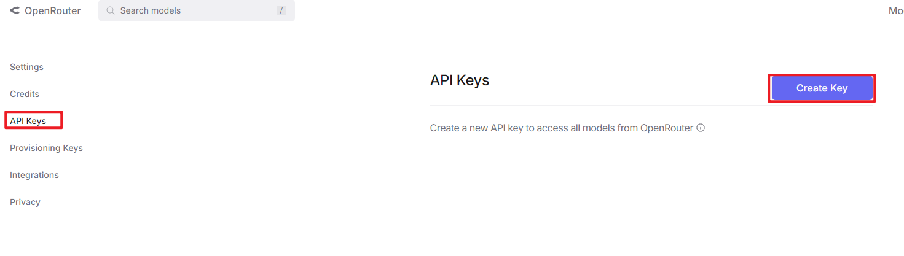


④ At this point, the large model is successfully created and deployed. You can now use the API in the upcoming lessons.

<p id="anchor_11_1_1_3"></p>

* **Large Language Model Accessing**

> [!NOTE]
>
> To proceed with this section, you will need to register on the appropriate website and obtain the API key for the large model (please refer to the file ["**11.1.1 Large Language Model Courses -> Large Language Model Deployment**"](#anchor_11_1_1_2)).

It is important to ensure a stable network connection for the development board. For optimal performance, we also recommend connecting the main controller to a wired network for enhanced stability.


(1) Environment Configuration

> [!NOTE]
>
> If you have purchased a robot from our company with built-in large model functionality, the environment is already pre-configured in the robot's image. You can directly proceed to Section 3 of this document to configure the API key.

Install Vim and Gedit by running the corresponding commands. Install the necessary software packages and audio libraries required for PyAudio.

```
sudo apt update
```

```
sudo apt install vim
```

```
sudo apt install gedit
```

```
sudo apt install python3 python3-pip python3-all-dev python3-pyaudio portaudio11-dev libsndfile1
```

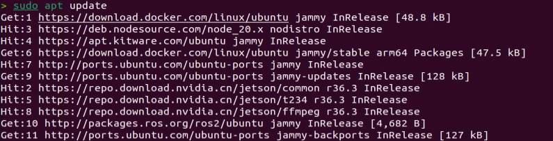

(2) Importing the Large Model Program Directory

① In this section, locate the '[Appendix -> Source Code](https://docs.hiwonder.com/projects/JetArm/en/latest/docs/resources_download.html)' folder within the same directory as this tutorial document.


② Using the MobaXterm remote connection tool (as outlined in the '5.5 Remote Access and File Transfer' tutorial), drag the folder into the root directory of the main controller. The software installation package can be found in the '[Appendix -\> Remote Access and File Transfer](https://docs.hiwonder.com/projects/JetArm/en/latest/docs/resources_download.html)' directory.


③ Next, execute the command to navigate to the **'speech_pkg' directory**.

```
cd ~/large_models/speech_pkg/
```

④ Execute the following commands to install the necessary third-party libraries.

```
pip3 install -r requirements.txt --break-system-packages
```

```
pip3 install dashscope --break-system-packages
```

```
pip3 install opencv-python --break-system-packages
```

```
pip3 install sympy==1.13.1 --break-system-packages
```

```
pip3 install torch --break-system-packages
```

⑤ Then, use the command in the terminal to navigate to the **'speech'** directory.

```
cd ~/large_models/speech_pkg/speech
```

⑥ Run the command to list the files in the **'speech'** directory.

```
ls
```


⑦ Depending on the type of main controller and Python version you're using, switch to the appropriate folder for packaging and distribution. This tutorial uses the Jetson Orin controller as an example.

| **Type of main controller** | **Python version** |
| --------------------------- | ------------------ |
| jetson_nano                 | 3.6                |
| jetson_orin                 | 3.10               |
| rpi5                        | 3.11               |
| rpi5_docker                 | 3.8                |

⑧ Execute the following command to navigate to the Jetson Orin folder.

```
cd jetson_orin/
```

⑨ Enter the command to copy the 'speech.so' file to the parent directory.

```
cp -r speech.so ..
```

⑩ Enter the command to navigate to the parent directory.

```
cd ../..
```

⑪ Execute the command to package the speech file for the Python environment.

```
pip3 install .
```

⑫ Enter the command to install and update the OpenAI Python library.

```
pip3 install openai -U
```

(3) Key Configuration

① Open the terminal and enter the following command to navigate to the directory for configuring the large model keys:

```
cd ~/large_models
```

② Then, open the configuration file by running:

```
vim config.py
```

③ Once the file is open, configure the OpenAI and OpenRouter keys by filling in the llm_api_key and vllm_api_key parameters, respectively (you can obtain these keys from the '[11.1.1 Large Language Model Courses -> Large Language Model Deployment](#anchor_11_1_1_2)' course).


For instance, copy the key created in Section 1.2 of this chapter and paste it into the appropriate field. To paste the key, place the cursor between the quotation marks, hold the **"Shift"** key, right-click, and select **"Paste"** .

> [!NOTE]
>
> Do not mix keys from different models, as this may cause the functionality to malfunction


④  After pasting, press the **'Esc'** key, then type the following command and press Enter to save the file:

```
:wq
```

(4) Running the Demo Program

Once the keys are configured, you can run the demo program (openai_llm_demo.py) to experience the text generation capabilities of the large model. For example, the program's prompt might be: 'Write a 50-word article about how technology is changing life.'


① To run the demo, enter the following command in the terminal:

```
python3 openai_llm_demo.py
```

② After running the program, the output will appear as shown in the image below.


* **Semantic Understanding with Large Language Model**

Before starting this section, make sure you have completed the API key configuration outlined in the file [11.1.1 Large Language Model Courses -\> Large Language Model Accessing](#anchor_11_1_1_3).

In this lesson, we'll use a large language model to analyze and summarize short passages of text.

(1) Start by opening a new terminal window, then navigate to the large model project directory:

```
cd large_models/
```

(2) Next, run the demo program with the following command:

```
python3 openai_llm_nlu_demo.py
```

(3) As shown in the output, the model demonstrates strong summarization abilities.


(4) The result matches the prompt defined in the program — where a passage of text is provided to the model, and it generates a concise summary.


* **Emotional Perception with Large Language Model**

To proceed with this section, ensure that you have completed the API key configuration as described in the file [11.1.1 Language Model Courses -> Large Language Model Accessing](#anchor_11_1_1_3).

In this lesson, we will use a large language model to assess its ability to perceive emotions based on descriptive words. We'll provide the model with emotional expressions and evaluate its response.

(1) Start by opening a new terminal window, then navigate to the large model project directory:

```
cd large_models/
```

(2) Next, run the demo program with the following command:

```
python3 openai_llm_er_demo.py
```

(3) From the output, you will see that the model successfully identifies and understands the emotions conveyed, providing a text-based response accordingly.


(4) In this program, we send two emotional expressions to the model: the first is an expression of sadness, **"So Sad"**. After the model responds, we then send an expression of happiness, "**Ha Ha**", and observe how the model reacts.


### 11.1.2 Large Speech Model Courses

* **Overview of Large Speech Model**

(1) What is a Large Speech Model?

A Speech Large Model (LSM) refers to a machine learning model that uses deep learning techniques to process and understand speech data. These models can be applied in a variety of tasks, such as speech recognition, speech synthesis, speech translation, and emotional analysis of speech. The design and training of these models typically require large amounts of speech data and substantial computational resources, which is why they are referred to as "**large models**".

(2) Why Do We Need Large Speech Model?

With the advancement of artificial intelligence and deep learning, traditional speech processing methods face many limitations. Large models leverage vast amounts of data and deep neural networks to learn and understand the complex features within speech, thereby improving the accuracy and naturalness of speech recognition and generation.

Their advantages include:

① High Accuracy: They maintain a high recognition rate even in noisy environments and with various accents.

② Naturalness: Speech generated by synthesis models is more natural, closely resembling human speech.

③ Versatility: These models support a wide range of languages and tasks, such as multilingual speech recognition, speech-to-text (STT), text-to-speech (TTS), and emotion recognition.

(3) Development of Speech Recognition Technology

Word-Level Speech Recognition: At this stage, speech recognition systems could only recognize individual words

Phrase-Level Speech Recognition: With the expansion of data and advancements in algorithms, speech recognition systems gradually gained the ability to recognize longer phrases, such as "**Please turn on my computer**".

Sentence-Level Speech Recognition: In recent years, with the emergence of AI large models, speech recognition systems have become capable of recognizing entire sentences and understanding their underlying meaning.

(4) Differences Between Large Speech Model and Traditional Speech Processing Technologies

① Processing Methods

Traditional Speech Processing Technologies: These typically rely on manual feature extraction and shallow models, such as Gaussian Mixture Models (GMM) and Hidden Markov Models (HMM), to process speech signals.

Large Speech Model: These use end-to-end learning, directly mapping raw speech waveforms to target outputs (such as text or another speech signal), reducing the reliance on manual feature extraction. They are typically based on deep learning architectures, such as Convolutional Neural Networks (CNN), Recurrent Neural Networks (RNN), and Transformers.

② Model Complexity

Traditional Speech Processing Technologies: These models are relatively simple, with fewer parameters.

Large Speech Model: These models have complex structures and a large number of parameters, enabling them to capture more subtle speech features and contextual information.

③ Recognition Capability

Traditional Speech Processing Technologies: These are highly adaptable to specific scenarios and conditions, but their recognition capability is limited when encountering new, unseen data.

Large Speech Model: Due to their large number of parameters and powerful learning ability, they offer superior recognition capabilities and can adapt to a wider variety of speech data and environments.

④Training Data Requirements

Traditional Speech Processing Technologies: These typically require less data for training, but the data must be highly annotated and of high quality.

Large Speech Model: These require vast amounts of training data to fully learn the complexities of speech, often necessitating large quantities of annotated data or the use of unsupervised/self-supervised learning methods.

(5) Core Technologies of Speech Large Model

① Automatic Speech Recognition (ASR)

ASR is the technology that converts human speech into text. The core steps of a speech recognition system include feature extraction, acoustic modeling, and language modeling.

② Text-to-Speech (TTS)

TTS is the technology that converts text into speech. Common speech synthesis models include the Tacotron series, FastSpeech, and VITS.

③ Speech Enhancement and Noise Reduction

Speech enhancement techniques are used to improve the quality of speech signals, typically for eliminating background noise and echoes. This is crucial for speech recognition applications in noisy environments.

(6) Applications of Speech Large Model

Intelligent Voice Assistants: For instance, Amazon Alexa and Google Home, which engage with users through voice interactions.

Customer Service Chatbots: In the customer service sector, speech large models assist businesses in enhancing service efficiency by swiftly processing customer inquiries through speech recognition technology, enabling 24/7 support.

Healthcare: Helping doctors with medical record-keeping, thus improving work efficiency.

Speech-to-Text: Speech large models excel in converting speech to text, offering accurate recognition and transcription in a variety of contexts. They are widely used in applications such as meeting transcription and subtitle generation.

* **Voice Device Introduction and Testing**

(1) Device Overview

① 6-Microphone Circular Array

Introduction：

The 6-Microphone Circular Array is a high-sensitivity, high signal-to-noise ratio microphone board. It features six analog silicon microphones arranged in a circular pattern. When paired with a main control board, it supports high-performance Acoustic Echo Cancellation (AEC), environmental noise reduction, and factory-level voice pickup from up to 10 meters.

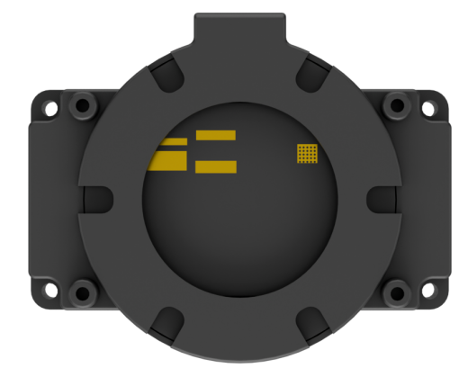

Features and Specifications：

**Operating Voltage:** 3.3V (typical)

**Operating Current:** 0.8mA (typical)

**Operating Temperature:** -20°C (min), 25°C (typical), 70°C (max)

**Operating Humidity:** Up to 95% relative humidity (max)

(1) Recording and Playback Test

The following demonstration uses the Raspberry Pi 5 as an example. The connection and testing steps are also applicable to other compatible devices such as the Jetson series:

① Connection Illustration and Detection


If the main controller is a Raspberry Pi, you can use VNC remote desktop access (refer to the appendix: Remote Access and File Transfer) to log into the Raspberry Pi system. Once connected, check the upper right corner of the desktop for microphone and speaker icons. As shown in the image below, the presence of these icons indicates a successful connection.


If you're using a NVIDIA Jetson device, you can connect via the NoMachine remote access tool. After logging in, check the upper right corner of the system interface for the speaker icon to confirm successful detection.


② Recording Test

Next, open a new terminal window and enter the following command to check the available recording devices. Note that the -l option is a lowercase "**L**". You should see the card number (card) listed—for example, card 0. This is just an example; please refer to your actual query result.

```
arecord -l
```


Then, use the following command to start recording. Replace the red-marked card number (hw:0,0) with the actual number you found in the previous step:

```
arecord -D hw:0,0 -f S16_LE -r 16000 -c 2 test.wav
```

This will create a test.wav audio file in the current directory.

You can record a short 5-second sample, then press Ctrl + C to stop the recording.

③ Playback Test

After the recording is complete, you can check whether the audio file was successfully created by listing the contents of the current directory:

```
ls
```


If test.wav appears in the list, the recording was successful. To play back the recording, use the following command:

```
aplay test.wav
```

* **Voice Wake-Up**

In this lesson, we'll learn how to use a large speech model to activate the voice device by speaking a predefined wake word through a program.

(1) WonderEcho Pro Wake-Up

Device Check：

To proceed, we need to identify the USB device name assigned to the connected WonderEcho Pro or Circular Microphone Array (hereafter referred to as the voice device). Please follow the steps below carefully. 

> [!NOTE]
>
> Do not connect any other USB devices during this process to avoid confusion.

① First, disconnect the voice device, then open a terminal and run the following command:

```
ll /dev | grep USB
```

② Next, reconnect the voice device to the USB port on your main board and run the same command again:

```
ll /dev | grep USB
```

③ You should now see a newly listed USB port, such as ttyCH341USB1.  

Please take note of this device name—it may vary depending on the main controller being used.


Wake-Up Test：

① To begin, update the port number used in the program by editing the script. You'll also need to uncomment the line for the port you're using and comment out any unused ports.

```
vim wakeup_demo.py
```

Press i to enter edit mode and make the necessary changes as shown below (update the port number accordingly and adjust comments as needed).


Once the changes are complete, press ESC, then type :wq and press Enter to save and exit the editor.

② Next, return to the system interface and run the wake-up demo using the command below. Speak the wake word **"HELLO HIWONDER"** clearly toward the WonderEcho Pro voice device.  

If the output includes **"keyword detect"**, it indicates that the firmware has been successfully flashed and the wake word is functioning correctly.

```
python3 ~/large_models/wakeup_demo.py
```


(2) 6-Microphone Circular Array

As with the WonderEcho Pro, you can connect the 6-Microphone Circular Array to your main board (Raspberry Pi or NVIDIA Jetson) using a Type-C to USB cable.

Device Check:

For Jetson users, connect to the Jetson system using the NoMachine remote access tool. Once connected, check the desktop interface.  

If the 6-Microphone Circular Array icon appears on the left side of the desktop, it indicates the device has been successfully recognized.

Wake-Up Test:

① Open a new terminal window and run the following command to edit the wakeup_demo.py script:

```
vim ~/large_models/wakeup_demo.py
```

② Press i to enter edit mode.

③ Update the port to match the device port number you previously identified. Comment out the WonderEcho Pro configuration (add \# at the beginning of the corresponding line), and uncomment the line using the circular microphone array on line 11 as the input device (see red box in the referenced image).


④ Press ESC to return to command mode, then type :wq and press Enter to save and exit.


⑤ In the terminal, run the wake-up program with the following command:

```
python3 ~/large_models/wakeup_demo.py
```

⑥ After about 30 seconds of initialization, speak the wake word **"hello hiwonder"** to test the device.


(3) Brief Program Overview

This is a Python-based wake word detection script that utilizes the speech module to process audio input and detect a specific wake word (e.g., "**HELLO_HIWONDER**").

Importing Required Modules

{lineno-start=5}

```
import os
import time
from speech import awake
```

`os`: Used for handling file paths and executing system-level commands.

`time`: Provides delay functions to prevent overly frequent detection attempts.

`speech`: The core module responsible for processing audio input and detecting the wake word.

Initializing the wonderecho Class

{lineno-start=9}

```
port = '/dev/ttyUSB0'
kws = awake.WonderEchoPro(port)
```

Attempts to Turn Off the Cooling Fan on Raspberry Pi 5

{lineno-start=13}

```
try:  # If a fan is present, it's recommended to turn it off before detection to reduce interference(如果有风扇，检测前推荐关掉减少干扰)
    os.system('pinctrl FAN_PWM op dh')
except:
    pass
```

Purpose: Attempts to turn off the cooling fan by executing the system command `pinctrl FAN_PWM op dh`. This helps minimize background noise from the fan that could interfere with wake word detection.

Error Handling: If the command fails (e.g., due to unsupported hardware), the program catches the exception and continues running without interruption.

Main Wake Word Detection Loop

{lineno-start=18}

```
kws.start() # Start detection(开始检测)
print('start...')
```

The program starts the wake word detection thread using kws.start().

It prints start... to indicate that detection has been successfully initiated.

Main Program Logic

{lineno-start=20}

```
while True:
    try:
        if kws.wakeup(): # Wake-up detected(检测到唤醒)
            print('hello hiwonder')
        time.sleep(0.02)
    except KeyboardInterrupt:
        kws.exit() # Cancel processing (关闭处理)
        try:
            os.system('pinctrl FAN_PWM a0')
        except:
            pass
        break
```

During each iteration, the program checks whether the wake word has been detected. If the wake word is detected, it prints keyword detected.

The detection frequency is controlled using time.sleep(0.02) to prevent excessive CPU usage.

Pressing Ctrl+C triggers a KeyboardInterrupt, which gracefully exits the detection loop.

Upon exit, the program calls kws.exit() to stop the wake word detection process.

The fan is then restored to its original state (if applicable).

(4) Extended Functionality

Modifying the Wake-Up Response Text

In this section, you'll learn how to change the message that appears after a successful wake word detection.

① For example, if the wake word "**HELLO_HIWONDER**" is detected, and you'd like the program to print "**hello**" instead of the default message, follow the steps below. Navigate to the large_models directory and open the script with:

```
vim wakeup_demo.py
```

② Press i to enter INSERT mode (you'll see -- INSERT -- at the bottom of the screen). Locate the line '**print('hello hiwonder')**', and modify it to 'print('hello')'

```
i
```

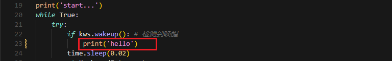

③ Press ESC, then type **:wq** and press Enter to save and exit.

```
:wq
```

④ Finally, run the program with:

```
python3 wakeup_demo.py
```

(5) Creating Custom Firmware for WonderEchoPro

If you'd like to create more advanced or customized wake words and voice commands, please refer to the document titled:  

"[**Appendix →  Firmware Flashing Tool → Creating Firmware for WonderEchoPro**](https://drive.google.com/drive/folders/1UrXfeeZ4wk-Gyj1EvDi_IjqkF1Lhv2pI?usp=sharing)".

* **Speech Recognition**

(1) What is Speech Recognition?

Speech Recognition (Speech-to-Text, STT) is a technology that converts human speech signals into text or executable commands. In this course, we will implement speech recognition functionality using Alibaba OpenAI's Speech Recognition API.

(2) How It Works

The wave library is used to extract audio data. The extracted audio is then sent to OpenAI's ASR (Automatic Speech Recognition) model. The recognized text returned by the ASR model is stored in speech_result for use in subsequent processes.

(3) Preparation Before the Experiment

Before proceeding, refer to the course "[**11.1.2 Large Speech Model Courses -> Large Language Models Deployment**](#anchor_11_1_1_2)" to obtain your API key, and make sure to add it into the configuration file (config).

(4) Experiment Steps

① Power on the device and connect to it using MobaXterm.  

(For detailed instructions, please refer to [Appendix ->Remote Connection Tools and Instructions](https://drive.google.com/drive/folders/1yhO_HNfeYMl-x0IzKAsoJRPkXB4GJ0f-?usp=sharing).)

② Navigate to the program directory by entering the following command:

```
cd large_models/
```

③ Open the configuration file to input your API Key by entering the command below. Press i to enter INSERT mode and enter your API Key. Once finished, press Esc, type :wq, and hit Enter to save and exit.

```
vim config.py
```


④ Run the speech recognition program with:

```
python3 openai_asr_demo.py
```

(5) Function Realization

After the program starts, the microphone will recognize the recorded audio content from the user and print the converted text output.


(6) Brief Program Analysis

This program implements a speech recognition system by calling OpenAI's Speech-to-Text API to convert audio files into text.

① Module Import

{lineno-start=6}

```
from speech import speech
```

The speech module encapsulates ASR (Automatic Speech Recognition) functionalities, such as connecting to an external ASR service.

② Define ASR Class

{lineno-start=11}

```
asr = speech.RealTimeOpenAIASR()
```

asr = speech.RealTimeOpenAIASR()

This line creates a real-time speech recognition object named asr. The RealTimeOpenAIASR class is used to interact with the speech recognition service.

③ Speech Recognition Functionality

{lineno-start=13}

```
asr.update_session(model='whisper-1', language='en', threshold=0.2, prefix_padding_ms=300, silence_duration_ms=800) 
```

An ASR client object is created to prepare for invoking the speech recognition service.

The asr.asr() method is called to send the audio file (wav) to the ASR service for recognition.

The recognized result (typically text) is printed to the console.

(7) Function Extension

You can modify the model name to enable speech recognition in various languages, such as Chinese, English, Japanese, and Korean.

① Enter the following command to edit the script:

```
vim openai_asr_demo.py
```

② Press the i key to enter INSERT mode, and update the model setting. For example, modify it to use the gpt-4o-transcribe model.

```
i
```


③ Then, run the program with the command:

```
python3 openai_asr_demo.py
```

④ Record a sample sentence such as "**Hello, can you hear me clearly?**", and the recognized text will be printed on the console.


* **Speech Synthesis**

(1) What is Speech Synthesis?

Speech synthesis (SS) is a technology that converts written text into intelligible spoken audio. It enables computers to generate natural, human-like speech for communication or information delivery.

In this course, we will run a program that processes text using a large language model and generates corresponding audio.

(2) How It Works

The program first sends the text to the OpenAI TTS (Text-to-Speech) model. The model returns the generated audio data, which is saved as a file named tts_audio.wav for playback or storage.

(3) Preparation Before the Experiment

Refer to the course "[**11.1 Large Models Basic Courses ->11.1.1Large Language Models Courses -> Large Language Models Deployment**](#anchor_11_1_1_2)" to obtain your API key, and update the configuration file accordingly.

(4) Experiment Steps

① Power on the device and connect to it using MobaXterm "(**refer to the [appendix -> Remote Connection Tools and Instructions](https://drive.google.com/drive/folders/1yhO_HNfeYMl-x0IzKAsoJRPkXB4GJ0f-?usp=sharing) for detailed guidance**)".

② Navigate to the program directory by entering the following command:

```
cd large_models/
```

③ Open the configuration file to enter your API Key. After editing, press Esc, type `:wq`, and hit Enter to save and exit:

```
vim config.py
```

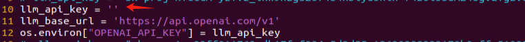

④ Finally, run the program with the following command:

```
python3 openai_tts_demo.py
```

(5) Function Realization

Upon running the program, it will play an audio message saying "**Hello, Can I Help You**", and simultaneously save the audio file with the same content to the following directory:


(6) Brief Program Analysis

This program is a speech synthesis system based on OpenAI's Text-to-Speech (TTS) API, capable of converting text into audio files. It supports input text and outputs audio in formats like PCM, WAV, FLAC, AAC, Opus, and MP3. By specifying the desired text, the program sends the request to the API and returns the synthesized audio, which can be played or saved locally.

① Module Import

{lineno-start=5}

```
from config import *
from speech import speech  
```

speech: This module encapsulates the TTS functionalities.

② Definition for TTS Class

{lineno-start=8}

```
tts = speech.RealTimeOpenAITTS()
tts.tts("Hello, Can I help you?") # https://platform.openai.com/docs/guides/text-to-speech
tts.tts("Hello, Can I help you?", model="tts-1", voice="onyx", speed=1.0, instructions='Speak in a cheerful and positive tone.')
tts.save_audio("Hello, Can I help you?", model="gpt-4o-mini-tts", voice="onyx", speed=1.0, instructions='Speak in a cheerful and positive tone.', audio_format='wav', save_path="./resources/audio/tts_audio.wav")
```

`speed`: Specifies the playback speed; the default value is 1.

For intelligent real-time applications, it is recommended to use the gpt-4o-mini-tts model. 

Other available models include tts-1 and tts-1-hd. tts-1 offers lower latency but with slightly reduced quality compared to tts-1-hd.

Voice Options: nova, shimmer, echo, onyx, fable, alloy, ash, sage, coral.

For more details, you can refer to the OpenAI documentation:

[https://platform.openai.com/docs/guides/text-to-speech](https://platform.openai.com/docs/guides/text-to-speech)

③ Function Extension

To change the voice, follow these steps:

Step1 : Open the program by entering the command:

```
vim openai_tts_demo.py
```

Step2 : Press i on your keyboard to enter INSERT mode. Locate the line voice="**onyx**" and modify it to voice="**nova**".

```
i
```


Step3 : Press Esc, then type :wq and hit Enter to save and exit.

```
:wq
```


Step4 : Execute the program with the following command:

```
python3 openai_tts_demo.py
```


Once the program starts, the speaker will play the synthesized audio using the newly selected voice style.

* **Voice Interaction**

(1) What is Voice Interaction?

Voice Interaction (VI) refers to a method of communication between humans and computers or devices through spoken language. It integrates speech recognition and speech synthesis, enabling devices to both understand user commands and respond naturally, creating true two-way voice communication. To achieve natural voice interaction, factors such as semantic understanding and sentiment analysis must also be considered, allowing the system to accurately interpret user intent and provide appropriate responses.

This approach can be used as the foundation for developing our own AI assistant features.

(2) How It Works

First, the wake word detection module listens for a specific wake-up word. Once detected, it initiates audio recording. After recording, Automatic Speech Recognition (ASR) converts the audio into text, which is then sent to a Large Language Model (LLM) to generate an appropriate response. The generated text is subsequently converted into speech through a Text-to-Speech (TTS) module and played back to the user. This entire process enables seamless and natural interaction between the user and the voice assistant.

(3) Experiment Steps

① Power on the device and connect to it via MobaXterm (refer to Appendix "**[5.1 Remote Connection Tools and Instructions](https://drive.google.com/drive/folders/1yhO_HNfeYMl-x0IzKAsoJRPkXB4GJ0f-?usp=sharing)**" for connection guidance).

② To check the microphone's port number, first disconnect the microphone and run the command. Then reconnect the microphone and run the command again to determine the port number.

> [!NOTE]
>
> Note: do not connect any other USB devices during this process

```
ll /dev | grep USB
```

After disconnecting the microphone, no USB device should appear.


Upon reconnecting the microphone, a USB port (e.g., ttyCH341USB1) will be listed (make sure to note this device name). The device name may vary depending on the main controller.

③ Navigate to the program directory:

```
cd large_models/
```

④ Open the configuration file to enter your API Key. After editing, press Esc, then type :wq and hit Enter to save and exit:

```
vim config.py
```


⑤ Enter the port number you obtained and modify the corresponding microphone port settings for either WonderEcho Pro or the six-microphone setup. Uncomment the configuration for the port you intend to use and comment out the settings for any unused ports.

```
vim openai_interaciton_demo.py
```

If you are using the WonderEcho Pro, modify the corresponding section:

If you are using the 6-Microphone Array, modify the relevant section:


⑥ Run the program:

```
python3 openai_interaciton_demo.py
```

⑦ To stop the program at any time, simply press Ctrl+C.

(4) Function Realization

After successful execution, the voice device will announce 'I'm ready.' Then, upon hearing the wake-up word 'HELLO_HIWONDER,' the device will respond with 'I'm here,' indicating that the assistant has been successfully awakened. You can now ask the AI assistant any questions:

For example: 'What are some fun places to visit in New York?'


(5) Brief Program Analysis

The program integrates voice recognition, speech synthesis, and intelligent response functionalities to create a voice assistant. Interaction is initiated through the wake-up word (HELLO_HIWONDER). Users can converse with the assistant via voice commands, and the assistant will respond using text-to-speech technology. The overall structure is clear, with distinct modules that are easy to expand and maintain.

(1) Module Import

{lineno-start=5}

```
import os
import time
from config import *
from speech import awake
from speech import speech
```

time: Used to control the interval between program executions.

speech: The core module, integrating wake-up word detection, speech activity detection, speech recognition, TTS, and LLM.

(2) Definition of Audio File Paths

{lineno-start=11}

```
wakeup_audio_path = './resources/audio/en/wakeup.wav'
start_audio_path = './resources/audio/en/start_audio.wav'
no_voice_audio_path = './resources/audio/en/no_voice.wav'
```

This section configures the audio file paths used by various functional modules, such as wake-up sounds, recording storage paths, and prompt sounds.

The text-to-speech (TTS) module is initialized to convert LLM responses into speech.

(3) Main Functional Logic

{lineno-start=33}

```
def main():
    kws.start()
    while True:
        try:
            if kws.wakeup(): # Wake word detected(检测到唤醒词)
                speech.play_audio(wakeup_audio_path)  # Play wake-up sound(唤醒播放)
                asr_result = asr.asr() # Start voice recognition(开启录音识别)
                print('asr_result:', asr_result)
                if asr_result:
                    # Send the recognition result to the agent for a response(将识别结果传给智能体让他来回答)
                    response = client.llm(asr_result, model='gpt-4o-mini')
                    print('llm response:', response)
                    tts.tts(response)
                else:
                    speech.play_audio(no_voice_audio_path)
            time.sleep(0.02)
        except KeyboardInterrupt:
            kws.exit() 
            try:
                os.system('pinctrl FAN_PWM a0')
            except:
                pass
            break
        except BaseException as e:
            print(e)
```

Wake-up Detection: Continuously monitors for the wake-up word. Once detected, it stops the wake-up detection and plays the wake-up prompt sound.

Voice Processing: Records and recognizes the user's speech, uses the language model to generate a response, and then converts the response into speech for playback.

Error Handling: Catches exit signals and runtime errors to ensure the program exits safely and releases resources.

### 11.1.3 Vision Language Model Courses

* **Overview of Vision Language Model**

Vision Language Model (VLM) integrate visual recognition capabilities into traditional Language Model (LLM), enabling more powerful interactions between vision and language through multimodal inputs.

(1) Basic Concept

Vision Language Model (VLM) are a type of artificial intelligence model that leverages deep learning techniques to learn from and process large-scale visual data. These models often adopt convolutional neural network (CNN) architectures, enabling them to extract rich visual features from images or video streams and perform various tasks such as image classification, object detection, and facial recognition. In theory, VLM possess powerful capabilities in feature extraction and pattern recognition, making them widely applicable in fields like autonomous driving, facial recognition, and medical imaging analysis.

(2) Features

**Multimodal Input and Output**: VLM can process both images and text as input and generate various forms of output, including text, images, charts, and more.

**Powerful Visual-Semantic Understanding**: With extensive knowledge accumulated from large-scale visual datasets, VLMsexcel at tasks such as object detection, classification, and image captioning.

**Visual Question Answering (VQA):** VLM can engage in natural language conversations based on the content of input images, accurately answering vision-related questions.

**Image Generation:** Some advanced VLM are capable of generating simple image content based on given conditions.

**Deep Visual Understanding:** These models can recognize intricate details within images and explain underlying logical and causal relationships.

**Cross-Modal Reasoning:** VLM can leverage visual and linguistic information together, enabling reasoning across modalities, such as inferring from language to vision and vice versa.

**Unified Visual and Language Representation Space:** By applying attention mechanisms, VLM establish deep connections between visual and semantic information, achieving unified multimodal representations.

**Open Knowledge Integration:** VLM can integrate both structured and unstructured knowledge, enhancing their understanding of image content.

(3) How It Works

The working principle of Vision Language Model is primarily based on deep learning techniques, particularly Convolutional Neural Networks (CNNs) and Transformer architectures. Through multiple layers of neurons, these models perform feature extraction and information processing, enabling them to automatically recognize and understand complex patterns within images.

In a VLM, the input image first passes through several convolutional layers, where local features such as edges, textures, and shapes are extracted. Each convolutional layer is typically followed by an activation function (e.g., ReLU) to introduce non-linearity, allowing the model to learn more complex representations. Pooling layers are often used to reduce the dimensionality of the data while preserving important information, helping to optimize computational efficiency.

As the network deepens, it gradually transitions from extracting low-level features (like edges and corners) to higher-level features (such as objects and scenes). For classification tasks, the final feature vector is passed through fully connected layers to predict the probability of different target categories. For tasks like object detection and segmentation, the model outputs bounding boxes or masks to indicate the location and shape of objects within the image.

Transformer-based VLM divide images into small patches, treating them as sequential data, and apply self-attention mechanisms to capture global relationships within the image. This approach is particularly effective at modeling long-range dependencies, enabling VLM to excel at understanding complex visual scenes.

Training VLM typically requires large-scale labeled datasets. Through backpropagation, the model optimizes its parameters to minimize the loss between predictions and ground-truth labels. Pretraining on massive datasets allows the model to acquire general-purpose visual features, while fine-tuning on specific tasks further improves performance for specialized applications.

Thanks to this design, Visual Language Models are able to process and understand visual data effectively, and are widely used in applications like image classification, object detection, and image segmentation, driving rapid progress in the field of computer vision.

(4) Application Scenarios

① Image Captioning

VLM can automatically generate textual descriptions based on input images. This capability is particularly valuable for social media platforms, e-commerce websites, and accessibility technologies, such as providing visual content descriptions for visually impaired users.

② Visual Question Answering

Users can ask questions related to an image, such as "**What is in this picture?**" or "**What color is the car?**" The model analyzes the image content and provides accurate, natural-language responses, making it highly applicable in fields such as education, customer support, and information services.

③ Image Retrieval

In image search engines, users can perform searches using text descriptions, and Vision Language Model (VLM) can understand the descriptions and return relevant images. This capability is especially important on e-commerce platforms, where it allows users to find desired products more intuitively.

④ Augmented Reality (AR)

Vision Language Model (VLM) can provide real-time visual feedback and language-based explanations in augmented reality applications. When users view real-world scenes through a device's camera, the system can overlay relevant information or guidance, enhancing the overall user experience.

⑤ Content Creation and Editing

In design and creative tools, Vision Language Model (VLM) can generate relevant text content or suggestions based on a user's visual input (such as sketches or images), helping users complete creative work more efficiently.

⑥ Social Media Interaction

On social media platforms, VLM can generate appropriate comments or tags based on user-uploaded images, enhancing engagement and interaction.

⑦ Medical Imaging Analysis

In the healthcare field, VLM can be used to analyze medical images (such as X-rays and CT scans) and generate diagnostic reports or recommendations, assisting doctors in making more accurate decisions.

* **Vision Language Model Accessing**

> [!NOTE]
>
> * This section requires the configuration of the API key in "[**11.1.3 Vision Language Model Accessing -> Vision Language Model Accessing**](#anchor_11_1_1_3)" before proceeding. Additionally, ensure that the images to be used in this section are imported.
>
> * This experiment requires either an Ethernet cable or Wi-Fi connection to ensure the main control device can access the network properly.

(1) Experiment Steps

Execute the following command to navigate to the directory of Large Model.

```
cd large_models/
```

Run the program:

```
python3 openai_vllm_understand.py
```

(2) Function Realization

After running the program, the output printed matches our request of "**Describe the image**".


* **Vision Language Model: Object Detection**

> [!NOTE]
>
> * This section requires the configuration of the API key in "[**11.1.3 Vision Language Module Courses -> Vision Language Model Accessing**](#anchor_11_1_1_3)" before proceeding. Additionally, ensure that the images to be used in this section are imported.
>
> * This experiment requires either an Ethernet cable or Wi-Fi connection to ensure the main control device can access the network properly.
>
> * In this course, we will use a program to transmit an image to the large model for recognition, which will then identify and locate the objects within the image by drawing bounding boxes around them.

(1) Experiment Steps

① Execute the following command to navigate to the directory of Large Model.

```
cd large_models/
```

② Run the program:

```
python3 qwen_vllm_detect_demo.py
```

(2) Function Realization

After running the program, the positions of the fruits in the image will be circled.


(3) Function Expansion

We can switch the image and change the large model to experience different functionalities of various models.

Change Pictures:

① Click on the path box to navigate to the following directory: `/home/ubuntu/large_models/resources/pictures/`

Here, you can drag in other images, for example, in the apples.png format.


② Then, input the command:

```
vim large_models/qwen_vllm_detect_demo.py
```

③ Press the "**i**" key on your keyboard, which will display **"INSERT"** at the bottom.

```
i
```


④ Change the image recognition path from: `./resources/pictures/test_image_understand.jpeg`

To: image = cv2.imread('./resources/pictures/apples.png')


⑤ Next, input the following command and execute the program again to see the results

```
python3 qwen_vllm_detect_demo.py
```


* **Vision Language Model: Scene Understanding**

> [!NOTE]
>
> * This section requires the configuration of the API key in "[**Vision Language Model Accessing**](#anchor_11_1_1_3)" before proceeding. Additionally, ensure that the images to be used in this section are imported.
>
> * This experiment requires either an Ethernet cable or Wi-Fi connection to ensure the main control device can access the network properly.
>
> * In this course, we will use a program to send an image to the large model for recognition and generate a description of the content within the image.

(1) Experiment Steps

① Execute the following command to navigate to the directory of Large Model.

```
cd large_models/
```

② Run the program:

```
python3 openai_vllm_understand.py
```

(2) Function Realization

After running the program, the output printed matches our request of "**Describe the image**".


(3) Function Expansion

If you need to recognize your own image, you should place the image in the corresponding path and modify the image path in the program.

① First, drag your image directly into the ~/large_models/resources/pictures/ path using MobaXterm, and rename the image to test.png.


② Then, open the scene understanding script by entering the following command in the terminal:

```
vim ~/large_models/vllm_understand.py
```

③ Change the image path in the code to reflect the name of your image (e.g., test.png).


④ Run the program:

```
python3 ~/large_models/openai_vllm_understand.py
```

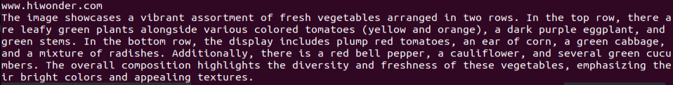


* **Vision Language Model: Optical Character Recognition** 

> [!NOTE]
>
> * This section requires the configuration of the API key in "**1.3.2 Vision Language Model Accessing**" before proceeding. Additionally, ensure that the images to be used in this section are imported.
>
> * This experiment requires either an Ethernet cable or Wi-Fi connection to ensure the main control device can access the network properly.
>
> * In this course, we use a program to transmit an image to the large model for recognition, extracting and identifying the text within the image.

(1) Experiment Steps

① Execute the following command to navigate to the directory of Large Model.

```
cd large_models/
```

② Run the program:

```
python3 openai_vllm_ocr.py
```

(2) Function Realization

After running the program, the output printed will be consistent with the content of the image sent.


(3) Function Expansion

We can switch the image and change the large model to experience different functionalities of various models.

Change Pictures：

① Drag the image directly into the `~/large_models/resources/pictures/` path using MobaXterm. Here, we can drag in the image named 'ocr1.png' as an example, and let the program recognize the text 'COME ON'.


② Then, input the command:

```
vim ~/large_models/openai_vllm_ocr.py
```

③ Press the **"i"** key on your keyboard, which will display **"INSERT"** at the bottom.

```
i
```


④ Change the image recognition path from: ./resources/pictures/ocr.jpeg

To: image = cv2.imread('./resources/pictures/ocr1.png')

```
image = cv2.imread('./resources/pictures/ocr1.png)
```

⑤ Run the program:

```
python3 ~/large_models/openai_vllm_ocr.py
```


### 11.1.4 Multimodal Model Basic Courses

* **Overview of Multimodal Model**

The emergence of Multimodal Model is built upon continuous advancements in the fields of Large Language Model (LLM) and Vision Language Model (VLM).

(1) Basic Concept

As LLM continue to improve in language understanding and reasoning capabilities, techniques such as instruction tuning, in-context learning, and chain-of-thought prompting have become increasingly widespread. However, despite their strong performance on language tasks, LLM still exhibit notable limitations in perceiving and understanding visual information such as images. At the same time, VLM have made significant strides in visual tasks such as image segmentation and object detection, and can now be guided by language instructions to perform these tasks, though their reasoning abilities still require further enhancement.

(2) Features

The core strength of Multimodal Model lies in their ability to understand and manipulate visual content through language instructions. Through pretraining and fine-tuning, these models learn the associations between different modalities—such as how to generate descriptions from images or how to identify and classify objects in visual data. Leveraging self-attention mechanisms from deep learning, Multimodal Model can effectively capture relationships across modalities, allowing them to synthesize information from multiple sources during reasoning and decision-making processes.

**Multimodal Fusion Capability:** Multimodal Model can process and understand multiple types of data simultaneously, including text, images, and audio. This fusion ability enables the models to build connections across modalities, leading to a more comprehensive understanding of information. For instance, a model can generate natural language descriptions based on an image or identify specific objects within an image based on a text query.

**Enhanced Contextual Understanding:** By integrating information from different modalities, Multimodal Model excel at contextual understanding. They can not only recognize content within a single modality but also combine clues from multiple sources to make more accurate judgments and decisions in complex tasks.

**Flexible Interaction Methods:** Users can interact with Multimodal Model through natural language instructions, making communication with the models more intuitive without requiring knowledge of complex programming or operations. For example, users can simply ask about details in an image, and the model can provide relevant answers.

**Scalability:** The architecture and training methods of Multimodal Model allow them to adapt to new modalities and tasks. As technology evolves, additional types of data—such as videos or sensor readings—can be incorporated, expanding their range of applications and capabilities.

**Strong Generative Capabilities:** Similar to large language models, Multimodal Model perform exceptionally well in generating both textual and visual content. They can produce natural language descriptions, summaries, and even create novel visual outputs, meeting a wide variety of application needs.

**Improved Reasoning Abilities:** Although challenges remain, Multimodal Model demonstrate significantly enhanced reasoning capabilities compared to traditional single-modality models. By integrating multimodal information, they can reason effectively in more complex scenarios, supporting advanced tasks such as logical reasoning and sentiment analysis.

**Adaptability and Personalization:** Multimodal Model can be fine-tuned to meet user-specific needs and preferences, enabling highly personalized services. This adaptability offers great potential for applications in fields such as education, entertainment, and customer service.

(3) How It Works

The working principle of Multimodal Model is built upon advanced deep learning and neural network technologies, with a core focus on fusing data from different modalities to understand and tackle complex tasks. At the foundation, Multimodal Model often adopt architectures similar to Transformers, which are highly effective at capturing relationships between different parts of input data. During training, these models are exposed to massive amounts of multimodal data—such as images, text, and audio—and leverage large-scale unsupervised learning for pretraining. Through this process, the models learn the commonalities and differences across modalities, enabling them to grasp the intrinsic connections between various types of information.

In practice, incoming text and visual data are first embedded into a shared representation space. Text inputs are transformed into vectors using word embedding techniques, while images are processed through methods like Convolutional Neural Networks (CNNs) to extract visual features. These vectors are then fed into the model's encoder, where self-attention mechanisms analyze the relationships across modalities, identifying and focusing on the most relevant information.

After encoding, the model generates a multimodal contextual representation that blends both the semantic information of the text and the visual features of the image. When a user provides a natural language instruction, the MLLM parses the input and interprets the intent by leveraging the contextual representation. This process involves reasoning and generation capabilities, allowing the model to produce appropriate responses based on its learned knowledge, or to perform specific actions in visual tasks.

Finally, the Multimodal Model's decoder translates the processed information into outputs that users can easily understand—such as generating textual descriptions or executing targeted visual operations. Throughout this process, the emphasis is on the fusion and interaction of information across different modalities, enabling Multimodal Model to excel at handling complex combinations of natural language and visual content. This integrated working mechanism empowers Multimodal Model with powerful functionality and flexibility across a wide range of application scenarios.

(4) Application Scenarios

① Education

Multimodal Model can be used to create personalized learning experiences. By combining text and visual content, the model can provide students with rich learning materials—for example, explaining scientific concepts through a mix of images and text to enhance understanding. Additionally, in online courses, the model can dynamically adjust content based on the learner's performance, offering customized learning suggestions in real time.

② Healthcare

Multimodal Model can assist doctors in diagnosis and treatment decisions. By analyzing medical images (such as X-rays or MRIs) alongside relevant medical literature, the model helps doctors access information more quickly and provides evidence-based recommendations. This application improves diagnostic accuracy and efficiency.

③ Entertainment

Multimodal Model can be used for content generation, such as automatically creating stories, scripts, or in-game dialogues. By incorporating visual elements, the model can provide rich scene descriptions for game developers, enhancing immersion. Additionally, on social media platforms, Multimodal Model can analyze user-generated images and text to help recommend suitable content.

④ Advertising and Marketing

Multimodal Model can analyze consumer behavior and preferences to generate personalized advertising content. By combining text and images, ads can better capture the attention of target audiences and improve conversion rates.

Finally, Multimodal Model also play a role in scientific research. By processing large volumes of literature and image data, the model can help researchers identify trends, generate hypotheses, or summarize findings, accelerating scientific discovery.

* **Agent Behavior Orchestration**

> [!NOTE]
>
> * This section requires the configuration of the API key in "[**Vision Language Model Accessing**](#anchor_11_1_1_3)" before proceeding. Additionally, ensure that the images to be used in this section are imported.
>
> * This experiment requires either an Ethernet cable or Wi-Fi connection to ensure the main control device can access the network properly.
>
> * The purpose of this course experiment is to obtain data in a specified format returned by the large model based on the prompt words set in the model. During development, you can use the returned data for further tasks.

(1) Experiment Steps

① To check the microphone's port number, first disconnect the microphone and run the command. Then reconnect the microphone and run the command again to determine the port number.

> [!NOTE]
>
> Note: do not connect any other USB devices during this process.

```
ll /dev | grep USB
```

After disconnecting the microphone, no USB device should appear.


Upon reconnecting the microphone, a USB port (e.g., ttyCH341USB1) will be listed (make sure to note this device name). The device name may vary depending on the main controller.

② Execute the following command to navigate to the directory of Large Model.

```
cd large_models/
```

③ Open the configuration file to enter your API Key. After editing, press Esc, then type :wq and hit Enter to save and exit:

```
vim config.py
```


④ Fill in the detected port number and update the corresponding microphone port settings for either the WonderEcho Pro or the Six-channel Microphone.  

Uncomment the port you wish to use and comment out the settings for any unused ports.

```
vim openai_agent_demo.py
```

Modify the settings as follows. For WonderEcho Pro, update the corresponding configuration


For 6-channel Microphone, update the respective settings:


⑤ Run the program:

```
python3 openai_agent_demo.py
```

⑥ The program will print the prompts configured for the large model. The large model will then return data formatted according to these prompts.


(2) Function Realization

① After running the program, the voice device will announce, **"I'm ready".** At this point, say **"HELLO_HIWONDER"** to the device to activate the agent.  

When the device responds with "**I'm here**", it indicates that the agent has been successfully awakened. To modify the wake word. For the Six-channel Microphone, refer to Section 2.3 Voice Wake-Up – 2. 6-Microphone Circular Array for instructions on customizing the wake word. For WonderEcho Pro, refer to Section "[**Firmware Flashing Tool->WonderEchoPro Firmware Generation**](https://drive.google.com/drive/folders/1UrXfeeZ4wk-Gyj1EvDi_IjqkF1Lhv2pI?usp=sharing)".

② After updating the wake word, you can say: "**Take two steps forward, turn left and take one step back**". The agent will respond according to the format we have defined.


## 11.2 Multimodal Large Model Applications

<p id="anchor_11_2_1"></p>

### 11.2.1 Obtain and Configure the Large Model API Key

> [!NOTE]
>
> This section requires registering on the official OpenAI website and obtaining an API key for accessing large language models.

* **Register and Deploy OpenAI Account** 

1)  Copy and open the following URL:


2)  Register and log in using a Google, Microsoft, or Apple account, as prompted.


3)  After logging in, click the Settings button, then go to **Billing**, and click **Payment methods** to add a payment method. Recharge your account to purchase tokens as needed.


4)  Once your account is set up, go to the **API Keys** section and click **Create new key**. Follow the instructions to generate a new API key and save it securely for later use.


5)  The creation and deployment of the large model have been completed, and this API will be used in the following lessons.

* **Register and Deploy OpenRouter Account** 

1)  Copy and open the following URL: <https://openrouter.ai/> and click "**Sign in**", and register or sign in using Google or another available account.


2)  After logging in, click the icon in the top-right corner, then select "**Credits**" to add a payment method.


3)  Create an API key. Go to "**API Keys**", then click "**Create Key**". Follow the prompts to generate a key. Save the API key securely for later use.


4)  The creation and deployment of the large model have been completed, and this API will be used in the following lessons.

* **API Configuration**

1)  In the command-line terminal, enter the following command to navigate to the directory where the large model keys are configured.

```
cd ~/ros2_ws/src/large_models/large_models
```

2)  Next, open the configuration file with the following command.

```
vim config.py
```

3)  Once the file is open, you need to configure the OpenAI and OpenRouter keys by filling them into the parameters llm_api_key and vllm_api_key, respectively. 


For example, copy the keys you created in this chapter and paste them into the corresponding fields. Place the cursor between the quotation marks, right-click, and select **Paste**. 

> [!NOTE]
>
> **Note:** keys from different large models cannot be mixed, otherwise the functions may fail to work properly.

4)  After pasting, enter the following command and press **Enter** to save the file:


``` 
:wq
```

### 11.2.2 Voice Control

The large model used in this lesson operates online, requiring a stable network connection for the main controller in use. For better stability, it is recommended to use a wired network connection.

* **Overview**

When the program starts, the AI voice box will announce "**I'm ready**."

Then, you can say the designated wake word "**Hello Hiwonder**" to activate the AI Voice Box, and it will respond with "**I'm here**." After activation, you can control the ArmPi Ultra by voice. For example, if you say "**Servo No. 1 move to 90 degrees**," the terminal will display the recognized speech, the AI Voice Box will announce the generated response after processing, and the robot will execute the corresponding action.

* **Preparation**

(1) Confirm WonderEcho Pro Firmware

The default wake word for WonderEcho Pro is "**Hello Hiwonder**." If you wish to change the wake-up word to "**Xiaohuan Xiaohuan**," please refer to the directory: [10. Voice Control Course ->10.2 Firmware Flashing](https://wiki.hiwonder.com/projects/ArmPi-Ultra/en/latest/docs/10.Voice_Control_Course.html#firmware-flashing).

If you have previously flashed a different firmware, such as the one using the wake word "Xiaohuan Xiaohuan," you must use the corresponding wake word.

The examples in this course will assume the default factory wake word: "**Hello Hiwonder**."

(2) Configuring the Large Model API-KEY

By default, the program does not include the configuration of the Large Model-related API keys. Before activating features related to the Large AI Model, please refer to the section [11.2.1 Obtain and Configure the Large Model API Key](#anchor_11_2_1) in this document to configure the necessary keys. This step is mandatory and **cannot be skipped**, as it is crucial for the proper functioning and experience of the large model features.

* **Network Configuration**

> [!NOTE]
>
> The large model used in this lesson is an online model, so network access is required before getting started. Please prepare an Ethernet cable to connect the robot to the network, or switch the robot to LAN mode.

The robot must be connected to the Internet during this feature, either in STA (LAN) mode or AP (direct connection) mode via Ethernet. There are two methods available for configuring the network:

- To configure the network using the mobile app, you may refer to the tutorial under the directory:[1.ArmPi Ultra User Manual->1.4 App Control->1.4.2 Connection Modes Overview](https://wiki.hiwonder.com/projects/ArmPi-Ultra/en/latest/docs/1.ArmPi_Ultra_User_Manual.html#connection-modes-overview).

- Connect to the robot via VNC and modify the network configuration files as described in:[1.ArmPi Ultra User Manual ->1.6 Development Environment Setup and Configuration >1.6.3 LAN Mode Connection](https://wiki.hiwonder.com/projects/ArmPi-Ultra/en/latest/docs/1.ArmPi_Ultra_User_Manual.html#lan-mode-connection).

* **Operations**

> [!NOTE]
>
> * Command input is case-sensitive and space-sensitive.
>
> * The robot must be connected to the Internet, either in STA (LAN) mode or AP (direct connection) mode via Ethernet.

1)  Click on  to launch the command bar, enter the command, and press Enter to disable the auto-start service.

2)  Enter the command to disable the auto-start service of the mobile app.

```
~/.stop_ros.sh
```

3)  Enter the following command and press **Enter** to launch the voice control feature.

```
ros2 launch large_models llm_control_servo.launch.py
```

4)  When the terminal displays output shown in the figure and the AI voice box announces "**I'm ready**", the voice device has completed initialization. Then, you can say the wake words: "**Hello Hiwonder**".


5)  When the terminal displays the corresponding output shown in the figure and the device responds with "**I'm here**", it indicates successful activation. The system will begin recording your voice command.


6)  You can give commands by following the input prompts shown in the program's task examples.


7)  Upon successful recognition by the speech recognition service of cloud-based large speech model, the parsed command will be displayed under the publish_asr_result output in the terminal.


8. Upon receiving user input shown in the figure, the terminal will display output indicating that the cloud-based large language model has been successfully invoked. The model will interpret the command, generate a language response, and execute a corresponding action based on the meaning of the command.

> [!NOTE]
>
> The response is automatically generated by the model. While the semantic content is accurate, the wording and structure may vary due to randomness in language generation.


9)  When the terminal shows the output shown in the figure indicating the end of one interaction cycle, the system is ready for the next round. To initiate another interaction, repeat step 4 by speaking the wake words again.


10) To exit the feature, press **Ctrl + C** in the terminal. If the feature does not exit immediately, press **Ctrl + C** multiple times.

* **Project Outcome**

Once the feature is activated, you can phrase your own commands. For example: "**Servo No. 1 move to 90 degrees**" will control Servo 1 of the ArmPi Ultra to rotate to the 90° position.

* **Program Brief Analysis**

(1) launch File Analysis

① launch_setup Function 

{lineno-start=10}

```
def launch_setup(context):
    mode = LaunchConfiguration('mode', default=1)
    mode_arg = DeclareLaunchArgument('mode', default_value=mode)

    sdk_package_path = get_package_share_directory('sdk')
    large_models_package_path = get_package_share_directory('large_models')

    sdk_launch = IncludeLaunchDescription(
        PythonLaunchDescriptionSource(
            os.path.join(sdk_package_path, 'launch/armpi_ultra.launch.py')),
    )

    large_models_launch = IncludeLaunchDescription(
        PythonLaunchDescriptionSource(
            os.path.join(large_models_package_path, 'launch/start.launch.py')),
        launch_arguments={'mode': mode}.items(),
    )


    llm_control_servo_node = Node(
        package='large_models',
        executable='llm_control_servo',
        output='screen',
    )

    return [mode_arg,
            sdk_launch,
            large_models_launch,
            llm_control_servo_node,
            ]
```

Loads the **launch/armpi_ultra.launch.py** file from the SDK package to start the underlying control services of the robotic arm, such as servo drivers and kinematics computation, providing the necessary hardware support for subsequent control operations. Loads the **launch/start.launch.py** file from the large_models package to start the services related to the large model. Uses launch_arguments to pass in the mode parameter, which controls the running mode of the large model, such as different interaction logic or feature toggles. Declare the llm_control_servo_node to launch the llm_control_servo executable from the large_models package. Its core function is to convert the outputs of the large model into commands for the robotic arm, completing the closed loop of "**Large Model Decision to Arm Action**", with logs displayed on the screen.

② generate_launch_description Function 

{lineno-start=41}

```
def generate_launch_description():
    return LaunchDescription([
        OpaqueFunction(function = launch_setup)
    ])
```

Creates and returns a LaunchDescription object, calling launch_setup via OpaqueFunction as the standard entry point for the ROS 2 launch file.

③ Main Function 

{lineno-start=46}

```
if __name__ == '__main__':
    # Create a LaunchDescription object (创建一个LaunchDescription对象)
    ld = generate_launch_description()

    ls = LaunchService()
    ls.include_launch_description(ld)
    ls.run()
```

Creates a LaunchDescription object and a LaunchService service. The launch description is added to the service and executed, enabling the startup of the entire system manually.

(2) Python File Analysis

① Prompt Template Definition 

{lineno-start=65}

```
    PROMPT = '''
#Role
You are an intelligent robot arm, and you need to generate corresponding instructions based on the input content.

##Requirements and Restrictions
1. According to the input action content, find the corresponding instructions in the action function library and output the corresponding instructions.
2. Weave a concise (10 to 30 words), humorous and continuous feedback information for each action sequence to make the communication process interesting.
3. The top is the positive z-axis, the left is the negative y-axis, and the front is the positive x-axis, in meters
4. The servo numbers are 1, 2, 3, 4, 5, 10, and the rotation range is [-120, 120] degrees. If the range is exceeded, the action returns []
5. The initial position is [0, 48, -72, -96, 0, -30]
6. Output the json result directly, do not analyze, and do not output redundant content.
7. Format: {"action": ["xx", "xx"], "response": "xx"}

##Structural requirements:
- The "action" key stores an array of function names in order. When the corresponding action function cannot be found, action outputs [].
- The "response" key is accompanied by a brief response, which perfectly meets the above word count and style requirements, the language type of the user is consistent.
- **Special processing**: If the servo running time is not specified, it is fixed to 1 second. If there is no delay or stop between two actions, they are combined

##Action function library
- Control the servo to move to the specified position at the specified time: set_position(1, ((1, -120), (2, 90)))
- Control the robot to move the specified distance in the specified direction: move(x, y, z)
- Delay for a specified time: time.sleep(1)

##Example
Input: Servo No. 1 and Servo No. 2 move to -90 degrees and 90 degrees respectively within 2 seconds
Output: {"action": ["set_position(2, [[1, -90], [2, 90]])"], "response": "Received, execute immediately"}
Input: Servo No. 1 rotates 45 degrees within 1 second
Output: {"action": ["set_position(1, [[1, 45]])"], "response": "OK"}
Input: Servo No. 6 turns 15 degrees
Output: {"action": ["set_position(1, [[6, 15]])"], "response": "OK, Servo No. 6 turns to 15 degrees"}
Input: Servo No. 3 turns to 11 degrees, Servo No. 4 turns to 0 degrees, stop for 2 seconds
Output: {"action": ["set_position(1, [[3, 11], [4, 0]])", "time.sleep(2)"], "response": "OK"}
Input: Servo No. 1 turns 20 degrees, Servo No. 3 turns 45 degrees, stop for 1 second, Servo No. 1 turns 50 degrees, Servo No. 2 turns 0 degrees
Output: {"action":["set_position(1, [[1, 20], [3, 45]])", "time.sleep(1)", "set_position(1, [[2, 0]])"], "response": "OK"}
Input: Move down 2cm, stop for 1s, Servo 4 turns to 30 degrees, stop for 1s, move forward 3cm
Output: {"action":["move(0, 0, -0.02)", "time.sleep(1)", "set_position(1, [[4, 30]])", "time.sleep(1)", "move(0.03, 0, 0)"], "response": "No problem"}
    '''

```

② Variable Initialization 

{lineno-start=104}

```
class LLMControlServo(Node):
    def __init__(self, name):
        rclpy.init()
        super().__init__(name)
        
        self.action = []
        self.interrupt = False
        self.llm_result = ''
        self.action_finish = False
        self.play_audio_finish = False
        # self.llm_result = '{\'action\':[\'set_position(1, [[10, -20]])\'], \'response\':\'好嘞\'}'
        # self.llm_result = '{\"action\": [\"move(0, 0, -0.05)\"], \"response\": \"坐稳了，准备下移5cm！\"}'
        self.running = True
        self.id_dict = {'1': 5, "2": 4, "3": 3, "4": 2, "5": 1, "6": 0}
        self.current_pulse =  [500, 600, 825, 110, 500, 210]

       
        self.current_position = [0.1, 0, 0.226]

        timer_cb_group = ReentrantCallbackGroup()
        self.tts_text_pub = self.create_publisher(String, 'tts_node/tts_text', 1)
        self.create_subscription(String, 'agent_process/result', self.llm_result_callback, 1)
        self.create_subscription(Bool, 'tts_node/play_finish', self.play_audio_finish_callback, 1, callback_group=timer_cb_group)
        self.awake_client = self.create_client(SetBool, 'vocal_detect/enable_wakeup')
        self.awake_client.wait_for_service()
        self.create_subscription(Bool, 'vocal_detect/wakeup', self.wakeup_callback, 1)

        self.set_model_client = self.create_client(SetModel, 'agent_process/set_model')
        self.set_model_client.wait_for_service()
        self.set_prompt_client = self.create_client(SetString, 'agent_process/set_prompt')
        self.set_prompt_client.wait_for_service()
        self.set_pose_target_client = self.create_client(SetRobotPose, 'kinematics/set_pose_target')
        self.set_pose_target_client.wait_for_service()
        self.set_joint_value_target_client = self.create_client(SetJointValue, 'kinematics/set_joint_value_target')
        self.set_joint_value_target_client.wait_for_service()
        self.joints_pub = self.create_publisher(ServosPosition, 'servo_controller', 1) # Servo control 舵机控制

        self.timer = self.create_timer(0.0, self.init_process, callback_group=timer_cb_group)

```

Initialize state variables such as the action list action and interrupt flag interrupt, and record the current servo positions and robotic arm pose. Create publishers, such as publisher for TTS text output, and subscribers, such as subscribers for large model results, TTS playback completion signals, and wake-up signals. Create service clients, such as clients for configuring the large model, controlling servos, and managing robotic arm poses to handle communication and control.

③ get_node_state Method 

{lineno-start=143}

```
    def get_node_state(self, request, response):
        return response
```

A service callback that returns an empty response, used to query the node's status, like confirming initialization completion.

④ init_process Method 

{lineno-start=146}

```
    def init_process(self):
        self.timer.cancel()

        msg = SetModel.Request()
        msg.model = llm_model
        msg.model_type = 'llm'
        msg.api_key = api_key 
        msg.base_url = base_url
        self.send_request(self.set_model_client, msg)

        msg = SetString.Request()
        msg.data = PROMPT
        self.send_request(self.set_prompt_client, msg)
        # -92 
        #self.set_position(1.5, [[6, 0], [5, 3], [4, 78], [3, -115], [2, 0], [1, -30]])
        #self.set_position(1.5, [[6, 0], [5, 48], [4, -72], [3, -96], [2, 0], [1, -30]])
        msg = set_joint_value_target(self.current_pulse)        
        endpoint = self.send_request(self.set_joint_value_target_client, msg)
        pose_t, pose_r = endpoint.pose.position, endpoint.pose.orientation
        mat = common.xyz_quat_to_mat([pose_t.x, pose_t.y, pose_t.z], [pose_r.w, pose_r.x, pose_r.y, pose_r.z])
        position, rpy = common.mat_to_xyz_euler(mat)

        self.current_position = [position, rpy]

        speech.play_audio(start_audio_path) 
        threading.Thread(target=self.process, daemon=True).start()
        self.create_service(Empty, '~/init_finish', self.get_node_state)
        self.get_logger().info('\033[1;32m%s\033[0m' % 'start')
        self.get_logger().info('\033[1;32m%s\033[0m' % PROMPT)
```

⑤ send_request Method 

{lineno-start=176}

```
    def send_request(self, client, msg):
        future = client.call_async(msg)
        while rclpy.ok():
            if future.done() and future.result():
                return future.result()
```

A general-purpose service call utility that sends a request and blocks until a response is received, ensuring reliable service communication such as configuring the large model or controlling robotic arm poses.

⑥ wakeup_callback Method 

{lineno-start=182}

```
    def wakeup_callback(self, msg):
        if self.llm_result:
            self.get_logger().info('wakeup interrupt')
            self.interrupt = msg.data
```

Subscriber callback for wake-up signals. When a wake-up signal is received such as via voice command, the interrupt flag is set to interrupt the current action.

⑦ llm_result_callbackMethod 

{lineno-start=187}

```
    def llm_result_callback(self, msg):
        self.llm_result = msg.data
```

Subscriber callback for large model results. Receives instructions generated by the large model including action and response and saves them in the llm_result variable for subsequent processing.

⑧ set_position Method 

{lineno-start=190}

```
    def set_position(self, duration, positions):
        msg = ServosPosition()
        msg.duration = float(duration)
        position_list = []
        for i in positions:
            position = ServoPosition()
            position.id = i[0]
            position.position = float(i[1])
            position_list.append(position)
            if i[0] != 1: 
                self.current_pulse[self.id_dict[str(i[0])]] = 500 + float(i[1])/240*1000
            else:
                self.current_pulse[self.id_dict[str(i[0])]] = 700 + float(i[1])/240*1000
        msg.position = position_list
        msg.position_unit = "deg"
        self.joints_pub.publish(msg)
        # self.get_logger().info(f'{self.current_pulse}')
```

Publishes servo control messages ServosPosition based on the input time and target position, updates the current servo positions, and synchronizes the robotic arm's joint states.

⑨ move Method 

{lineno-start=214}

```
    def move(self, x, y, z):
        self.current_position[0][0] += x
        self.current_position[0][1] += y
        self.current_position[0][2] += z
        self.get_logger().info(f'{self.current_position}')
        msg = set_pose_target(self.current_position[0], self.current_position[1][1], [-180.0, 180.0], 1.0)
        res = self.send_request(self.set_pose_target_client, msg)
        if res.pulse:
            servo_data = res.pulse
            self.get_logger().info(f'{servo_data}')
            #set_servo_position(self.joints_pub, 1, ((4, servo_data[3]), (3, servo_data[2]), (2, servo_data[1]), (1, servo_data[0])))
            set_servo_position(self.joints_pub, 1, ((3, servo_data[3]), (4, servo_data[2]), (5, servo_data[1]), (6, servo_data[0])))
            self.current_pulse[:-1] = servo_data
```

⑩ play_audio_finish_callback Method

{lineno-start=228}

```
    def play_audio_finish_callback(self, msg):
        self.play_audio_finish = msg.data
```

Callback function triggered after voice playback finishes. Re-enables voice wakeup functionality.

⑪ process Method 

{lineno-start=231}

```
    def process(self):
        while self.running:
            if self.llm_result:
                msg = String()
                if 'action' in self.llm_result:  # If a corresponding action is returned, extract it and proceed with processing. 如果有对应的行为返回那么就提取处理
                    result = eval(self.llm_result[self.llm_result.find('{'):self.llm_result.find('}') + 1])
                    # self.get_logger().info(str(result))
                    action_list = []
                    if 'action' in result:
                        action_list = result['action']
                    if 'response' in result:
                        response = result['response']
                    msg.data = response
                    self.tts_text_pub.publish(msg)
                    for i in action_list:
                        if self.interrupt:
                            self.get_logger().info('interrupt')
                            break
                        if 'set_position' in i:
                            eval('self.' + i)
                        elif 'move' in i:
                            eval('self.' + i)
                        else:
                            eval(i)
                else:  # No corresponding action, just respond. 没有对应的行为，只回答
                    response = self.llm_result
                    msg.data = response
                    self.tts_text_pub.publish(msg)
                self.action_finish = True 
                self.llm_result = ''
            else:
                time.sleep(0.01)
            if self.play_audio_finish and self.action_finish:
                    self.play_audio_finish = False
                    self.action_finish = False
                    msg = SetBool.Request()
                    msg.data = True
                    self.send_request(self.awake_client, msg)
        rclpy.shutdown()
```

Continuously checks llm_result the output from the large model, parses the action list action and the response text response. It publishes the response text to the TTS node for speech playback and sequentially executes the actions, such as set_position to control the servos, move to move the robotic arm, and time.sleep for delays. After completing the actions and speech, the wake-up functionality is re-enabled to await the next command.

⑫ main Function 

{lineno-start=271}

```
def main():
    node = LLMControlServo('llm_control_servo')
    executor = MultiThreadedExecutor()
    executor.add_node(node)
    executor.spin()
    node.destroy_node()
```

Creates an instance of the LLMControlServo node, starts a multi-threaded executor to handle callbacks, runs the node, and manages interrupts such as keyboard termination, ensuring proper resource cleanup.

### 11.2.3 Color Sorting

The large model used in this lesson operates online, requiring a stable network connection for the main controller in use. For better stability, it is recommended to use a wired network connection.

* **Overview**

When the program starts, the AI voice box will announce "**I'm ready**." Then, you can say the designated wake word "**Hello Hiwonder**" to activate the AI voice box, and it will respond with "**I'm here**." After activation, you can control the ArmPi Ultra by voice. For example, if you say "**Take away the red block**," the terminal will display the recognized speech, the AI voice box will announce the generated response after processing, and the robot will execute the corresponding action.

* **Preparation**

(1) Confirm WonderEcho Pro Firmware

The default wake word for WonderEcho Pro is "**Hello Hiwonder**." If you wish to change the wake-up word to "**Xiaohuan Xiaohuan**," please refer to the directory: [10. Voice Control Course ->10.2 Firmware Flashing](https://wiki.hiwonder.com/projects/ArmPi-Ultra/en/latest/docs/10.Voice_Control_Course.html#firmware-flashing).

If you have previously flashed a different firmware, such as the one using the wake word "**Xiaohuan Xiaohuan**," you must use the corresponding wake word.

The examples in this course will assume the default factory wake word: "**Hello Hiwonder**."

(2) Configuring the Large Model API-KEY

By default, the program does not include the configuration of the Large Model-related API keys. Before activating features related to the Large AI Model, please refer to the section [11.2.1 Obtain and Configure the Large Model API Key](#anchor_11_2_1)" in this document to configure the necessary keys. This step is mandatory and **cannot be skipped**, as it is crucial for the proper functioning and experience of the large model features.

(3) Network Configuration

> [!NOTE]
>
> The large model used in this lesson is an online model, so network access is required before getting started. Please prepare an Ethernet cable to connect the robot to the network, or switch the robot to LAN mode.

The robot must be connected to the Internet during this feature, either in STA (LAN) mode or AP (direct connection) mode via Ethernet. There are two methods available for configuring the network:

- To configure the network using the mobile app, you may refer to the tutorial under the directory:[1.ArmPi Ultra User Manual->1.4. App Control ->1.4.2 Connection Modes Overview](https://wiki.hiwonder.com/projects/ArmPi-Ultra/en/latest/docs/1.ArmPi_Ultra_User_Manual.html#connection-modes-overview).

- Connect to the robot via VNC and modify the network configuration files as described in:[1. ArmPi Ultra User Manual->1.6 Development Environment Setup and Configuration->1.6.3 LAN Mode Connection](https://wiki.hiwonder.com/projects/ArmPi-Ultra/en/latest/docs/1.ArmPi_Ultra_User_Manual.html#lan-mode-connection).

* **Operations**

> [!NOTE]
>
> * Command input is case-sensitive and space-sensitive.
> * The robot must be connected to the Internet, either in STA (LAN) mode or AP (direct connection) mode via Ethernet.

1)  Click on  to launch the command bar, enter the command, and press Enter to disable the auto-start service.

2)  Enter the command to disable the auto-start service of the mobile app.

```
~/.stop_ros.sh
```

3)  Enter the following command and press **Enter** to launch the color bolck sorting feature.
```
ros2 launch large_models llm_object_sorting.launch.py
```
4)  When the terminal displays output shown in the figure and the AI voice box announces "**I'm ready**", the voice device has completed initialization. Then, you can say the wake words: "**Hello Hiwonder**".


5)  When the terminal displays the corresponding output shown in the figure and the device responds with "**I'm here**", it indicates successful activation. The system will begin recording your voice command.


6)  You can give commands by following the input prompts shown in the program's task examples.


7)  For instance, when placing a colored block in front of the camera, we can say the command "**Take away the red block**."


8)  Upon successful recognition by the speech recognition service of cloud-based large speech model, the parsed command will be displayed under the publish_asr_result output in the terminal.


9. Upon receiving user input, the terminal will display output indicating that the cloud-based large language model has been successfully invoked. The model will interpret the command, generate a language response, and execute a corresponding action based on the meaning of the command.

> [!NOTE]
>
> The response is automatically generated by the model. While the semantic content is accurate, the wording and structure may vary due to randomness in language generation.

10) When the terminal shows the output shown in the figure indicating the end of one interaction cycle, the system is ready for the next round. To initiate another interaction, repeat step 4 by speaking the wake words again.


11) To exit the feature, press **Ctrl + C** in the terminal. If the feature does not exit immediately, press **Ctrl + C** multiple times.

* **Project Outcome**

Once the feature is activated, you can phrase your own commands. For example, saying "**Take away the red block**" will make the ArmPi Ultra automatically pick up the green block in its field of view and place it on the left side of the robotic arm.


* **Program Brief Analysis**

(1) launch File Analysis

① launch_setup Function

{lineno-start=1}

```
def launch_setup(context):
    mode = LaunchConfiguration('mode', default=1)
    mode_arg = DeclareLaunchArgument('mode', default_value=mode)

    large_models_package_path = get_package_share_directory('large_models')

    # Immediately start object_sorting_launch (立即启动 object_sorting_launch)
    object_sorting_launch = IncludeLaunchDescription(
        PythonLaunchDescriptionSource(
            os.path.join(large_models_package_path, 'launch/object_sorting_node.launch.py')),
    )

    # Start large_models_launch and llm_object_sorting_node after 5 seconds (在5秒后启动 large_models_launch 和 llm_object_sorting_node)
    delayed_launch = TimerAction(
        period=5.0,  # # Delay time of 5 seconds (延迟时间为5秒)
        actions=[
            IncludeLaunchDescription(
                PythonLaunchDescriptionSource(
                    os.path.join(large_models_package_path, 'launch/start.launch.py')),
                launch_arguments={'mode': mode}.items(),
            ),
            Node(
                package='large_models',
                executable='llm_object_sorting',
                output='screen',
            ),
        ]
    )

    return [mode_arg,
            object_sorting_launch,  # Immediate launch (立即启动)
            delayed_launch,          # Launch after 5 seconds (5秒后启动)
            ]
```

First loads the large_models package's file **launch/object_sorting_node.launch.py**, which starts the basic nodes for object sorting, such as object recognition, classification logic, and other essential functions, and serves as the foundation of the system. Using TimerAction, it sets a 5-second delay to ensure that the basic nodes are fully initialized before launching dependent components. After the delay, it loads the large_models package's file **launch/start.launch.py** to start the large-model service, passing in the mode parameter to control its operating mode. Finally, it starts the llm_object_sorting executable from the large_models package, which acts as a bridge between the large model and the object sorting logic, converting the model's decisions into sorting action commands, with logs output to the screen.

② generate_launch_description Function 

{lineno-start=44}

```
def generate_launch_description():
    return LaunchDescription([
        OpaqueFunction(function=launch_setup)
    ])
```

Creates and returns a LaunchDescription object, calling launch_setup via OpaqueFunction as the standard entry point for the ROS 2 launch file.

③ Main Function 

{lineno-start=49}

```
if __name__ == '__main__':
    # Create a LaunchDescription object (创建一个LaunchDescription对象)
    ld = generate_launch_description()

    ls = LaunchService()
    ls.include_launch_description(ld)
    ls.run()
```

Creates a LaunchDescription object and a LaunchService service. The launch description is added to the service and executed, enabling the startup of the entire system manually.

(2) Python File Analysis

① Prompt Template Definition

{lineno-start=55}

```
    PROMPT = '''
#Role
You are an intelligent robot arm that needs to generate corresponding instructions based on the input content.

##Requirements and Restrictions
1. According to the input action content, find the corresponding instructions in the action function library and output the corresponding instructions.
2. Weave a concise (10 to 30 words), humorous and ever-changing feedback information for the action sequence to make the communication process interesting.
3. Directly output the json result, do not analyze, and do not output redundant content.
4. You can sort three colors of objects: red, green and blue
4. Format: {"action": "xx", "response": "xx"}

##Structural Requirements:
- The "action" key carries a function name string array. When the corresponding action function cannot be found, action outputs "".
- The "response" key is accompanied by a carefully conceived short reply, which perfectly meets the above word count and style requirements.

##Implementation principles 
- Before the final output, implement comprehensive verification to ensure that the response is not only formatted and interesting, but also has no omissions from the above specifications.

##Action function library
- Pick up objects of different colors: color_sorting('red')

##Example
Input: Take away the green block
Output: {"action": "color_sorting('green')", "response": "Okay, start sorting green"}
Input: Take away the blue block
Output: {"action": "color_sorting('blue')", "response": "The blue block goes with you"}
Input: Only keep the red, take the others
Output: {"action": "color_sorting('blue'，'green')", "response": "Okay, execute now"}
Input: Sorting color blocks
Output: {"action": "color_sorting('red', 'blue'，'green')", "response": "No problem"}
    '''

```

② Variable Initialization 

{lineno-start=87}

```
class LLMColorSorting(Node):
    def __init__(self, name):
        rclpy.init()
        super().__init__(name)
        
        self.action = []
        self.llm_result = ''
        self.action_finish = False
        self.play_audio_finish = False
        # self.llm_result = '{"action": "color_sorting(\'blue\', \'red\', \'green\', \'tag_1\')", "response": "ok！"}'
        self.running = True
        
        timer_cb_group = ReentrantCallbackGroup()
        self.tts_text_pub = self.create_publisher(String, 'tts_node/tts_text', 1)
        self.create_subscription(String, 'agent_process/result', self.llm_result_callback, 1)
        self.create_subscription(Bool, 'tts_node/play_finish', self.play_audio_finish_callback, 1, callback_group=timer_cb_group)
        self.create_subscription(Bool, 'vocal_detect/wakeup', self.wakeup_callback, 1)
        self.awake_client = self.create_client(SetBool, 'vocal_detect/enable_wakeup')
        self.awake_client.wait_for_service()

        self.set_model_client = self.create_client(SetModel, 'agent_process/set_model')
        self.set_model_client.wait_for_service()
        self.set_prompt_client = self.create_client(SetString, 'agent_process/set_prompt')
        self.set_prompt_client.wait_for_service()
        self.enter_client = self.create_client(Trigger, 'object_sorting/enter')
        self.enter_client.wait_for_service()
        self.start_client = self.create_client(SetBool, 'object_sorting/enable_sorting')
        self.start_client.wait_for_service()

        self.set_target_client = self.create_client(SetStringBool, 'object_sorting/set_target')
        self.set_target_client.wait_for_service()
        self.timer = self.create_timer(0.0, self.init_process, callback_group=timer_cb_group)

```

Sets up the node and configures state variables such as the action list and large-model results. Creates publishers for TTS text, subscribers for large-model results, TTS completion signals, and wake-up signals, as well as service clients for large-model configuration and sorting control. Finally, starts the initialization timer.

③ get_node_state Method 

{lineno-start=120}

```
    def get_node_state(self, request, response):
        return response
```

A service callback that returns an empty response, used to query the node's status, like confirming initialization completion.

④ init_process Method 

{lineno-start=123}

```
    def init_process(self):
        self.timer.cancel()
        
        msg = SetModel.Request()
        msg.model = llm_model
        msg.model_type = 'llm'
        msg.api_key = api_key 
        msg.base_url = base_url
        self.send_request(self.set_model_client, msg)

        msg = SetString.Request()
        msg.data = PROMPT
        self.send_request(self.set_prompt_client, msg)
       
        self.send_request(self.enter_client, Trigger.Request())
        speech.play_audio(start_audio_path)
        threading.Thread(target=self.process, daemon=True).start()
        self.create_service(Empty, '~/init_finish', self.get_node_state)
        self.get_logger().info('\033[1;32m%s\033[0m' % 'start')
        self.get_logger().info('\033[1;32m%s\033[0m' % PROMPT)
```

Handles the node initialization process by canceling the timer, configuring large-model parameters such as model type and API keys, sending a request to enter the sorting service, starting the processing thread, and publishing a log to confirm that initialization is complete.

⑤ send_request Method 

{lineno-start=144}

```
    def send_request(self, client, msg):
        future = client.call_async(msg)
        while rclpy.ok():
            if future.done() and future.result():
                return future.result()
```

A general-purpose service call utility that sends a request and blocks until a response is received, ensuring reliable service communication such as large-model configuration and sorting control.

⑥ wakeup_callback Method 

{lineno-start=150}

```
    def wakeup_callback(self, msg):
        if msg.data and self.llm_result:
            self.send_request(self.enter_client, Trigger.Request())
```

A subscription callback for the wakeup signal. When a wakeup signal is received, it resends the request to enter the sorting service and resets the sorting state.

⑦ llm_result_callback Method 

{lineno-start=154}

```
    def llm_result_callback(self, msg):
        self.llm_result = msg.data
```

Subscriber callback for large model results. Receives instructions generated by the large model including action and response and saves them in the llm_result variable for subsequent processing.

⑧ play_audio_finish_callback Method 

{lineno-start=157}

```
    def play_audio_finish_callback(self, msg):
        self.play_audio_finish = msg.data
```

A subscription callback for the TTS completion signal. It sets the play_audio_finish flag to synchronize action execution with speech playback.

⑨ process Method 

{lineno-start=160}

```
    def process(self):
        while self.running:
            if self.llm_result:
                msg = String()
                if 'action' in self.llm_result: # If a corresponding action is returned, extract it and proceed with processing. 如果有对应的行为返回那么就提取处理
                    result = eval(self.llm_result[self.llm_result.find('{'):self.llm_result.find('}') + 1])
                    # result = json.loads(self.llm_result)
                    if 'action' in result:
                        text = result['action']
                        # Use regular expressions to extract all strings inside. 使用正则表达式提取括号中的所有字符串
                        pattern = r"color_sorting\((['\"][^'\"]+['\"](?:\s*,\s*['\"][^'\"]+['\"])*)\)" 
                        #  Use re.search to find the matching result. 使用re.search找到匹配的结果
                        match = re.search(pattern, text)
                        # Extract the result. 提取结果
                        if match:
                            # Retrieve all argument parts (the content inside the parentheses). 获取所有的参数部分(括号内的内容) 
                            params = match.group(1)
                            # Use regular expressions to split the string arguments. 使用正则拆分出各个字符串参数
                            colors = re.findall(r"['\"]([^'\"]+)['\"]", params)
                            self.get_logger().info(str(colors))
                            color_msg = SetStringBool.Request()
                            for i in ['red', 'green', 'blue', 'tag_1', 'tag_2', 'tag_3']:
                                color_msg.data_str = i
                                if i in colors:
                                    color_msg.data_bool = True
                                else:
                                    color_msg.data_bool = False
                                self.send_request(self.set_target_client, color_msg)
                            # Enable sorting. 开启分拣
                            start_msg = SetBool.Request()
                            start_msg.data = True 
                            self.send_request(self.start_client, start_msg)
                    if 'response' in result:
                        msg.data = result['response']
                else: # No corresponding action, just respond. 没有对应的行为，只回答
                    msg.data = self.llm_result
                self.tts_text_pub.publish(msg)
                self.action_finish = True
                self.llm_result = ''
            else:
                time.sleep(0.01)
            if self.play_audio_finish and self.action_finish:
                self.play_audio_finish = False
                self.action_finish = False
                msg = SetBool.Request()
                msg.data = True
                self.send_request(self.awake_client, msg)
        rclpy.shutdown()
```

The main processing loop. It parses the large-model result, extracts color sorting actions such as color_sorting 'red', uses regex to determine the target color, sets the sorting goal, and starts the sorting process. It also publishes the TTS response, and once playback is complete, re-enables the wakeup function.

⑩ main Function 

{lineno-start=209}

```
def main():
    node = LLMColorSorting('llm_color_sorting')
    executor = MultiThreadedExecutor()
    executor.add_node(node)
    executor.spin()
    node.destroy_node()
```

The program entry point. It creates an LLMColorSorting instance, starts a multithreaded executor to handle callbacks, runs the node, and cleans up resources.

### 11.2.4 Waste Sorting

The large model used in this lesson operates online, requiring a stable network connection for the main controller in use. For better stability, it is recommended to use a wired network connection.

* **Overview**

When the program starts, the AI voice box will announce "**I'm ready**." Then, you can say the designated wake word "**Hello Hiwonder**" to activate the AI voice box, and it will respond with "**I'm here**." After activation, you can control the ArmPi Ultra by voice. For example, if you say "**Take away the banana peel**," the terminal will display the recognized speech, the AI voice box will announce the generated response after processing, and the robot will execute the corresponding action.

* **Preparation**

(1) Confirm WonderEcho Pro Firmware

The default wake word for WonderEcho Pro is "**Hello Hiwonder**." If you wish to change the wake-up word to "**Xiaohuan Xiaohuan**," please refer to the directory: [10.Voice Control Course ->10.2 Firmware Flashing](https://wiki.hiwonder.com/projects/ArmPi-Ultra/en/latest/docs/10.Voice_Control_Course.html#firmware-flashing).

If you have previously flashed a different firmware, such as the one using the wake word "**Xiaohuan Xiaohuan**," you must use the corresponding wake word.

The examples in this course will assume the default factory wake word: "**Hello Hiwonder**."

(2) Configuring the Large Model API-KEY

By default, the program does not include the configuration of the Large Model-related API keys. Before activating features related to the Large AI Model, please refer to the section "**[11.2.1 Obtain and Configure the Large Model API Key](#anchor_11_2_1)**" in this document to configure the necessary keys. This step is mandatory and cannot be skipped, as it is crucial for the proper functioning and experience of the large model features.

(3) Network Configuration

> [!NOTE]
>
> The large model used in this lesson is an online model, so network access is required before getting started. Please prepare an Ethernet cable to connect the robot to the network, or switch the robot to LAN mode.

The robot must be connected to the Internet during this feature, either in STA (LAN) mode or AP (direct connection) mode via Ethernet. There are two methods available for configuring the network:

- To configure the network using the mobile app, you may refer to the tutorial under the directory:[ArmPi Ultra User Manual->1.4 App Control ->1.4.2 Connection Modes Overview](https://wiki.hiwonder.com/projects/ArmPi-Ultra/en/latest/docs/1.ArmPi_Ultra_User_Manual.html#connection-modes-overview).

- Connect to the robot via VNC and modify the network configuration files as described in:[1.ArmPi Ultra User Manual->1.6 Development Environment Setup and Configuration->1.6.3 LAN Mode Connection](https://wiki.hiwonder.com/projects/ArmPi-Ultra/en/latest/docs/1.ArmPi_Ultra_User_Manual.html#lan-mode-connection).

* **Operations**

> [!NOTE]
>
>* Command input is case-sensitive and space-sensitive.
>
>* The robot must be connected to the Internet, either in STA (LAN) mode or AP (direct connection) mode via Ethernet.

1)  Click on  to launch the command bar, enter the command, and press Enter to disable the auto-start service.

2)  Enter the command to disable the auto-start service of the mobile app.

```
~/.stop_ros.sh
```

3)  Enter the following command and press **Enter** to launch the waste classification feature.

```
ros2 launch large_models llm_waste_classification.launch.py
```

4)  When the terminal displays output shown in the figure and the AI voice box announces "**I'm ready**", the voice device has completed initialization. Then, you can say the wake words: "**Hello Hiwonder**".


5)  When the terminal displays the corresponding output shown in the figure and the device responds with "**I'm here**", it indicates successful activation. The system will begin recording your voice command.


6)  You can give commands by following the input prompts shown in the program's task examples.


7)  For instance, place the corresponding waste tag in front of the camera and say the command "**Take away the banana peel**."


8)  Upon successful recognition by the speech recognition service of cloud-based large speech model, the parsed command will be displayed under the publish_asr_result output in the terminal.


9. Upon receiving user input, the terminal will display output indicating that the cloud-based large language model has been successfully invoked. The model will interpret the command, generate a language response, and execute a corresponding action based on the meaning of the command.

> [!NOTE]
>
> The response is automatically generated by the model. While the semantic content is accurate, the wording and structure may vary due to randomness in language generation.

10) When the terminal shows the output shown in the figure indicating the end of one interaction cycle, the system is ready for the next round. To initiate another interaction, repeat step 4 by speaking the wake words again.


* **Project Outcome**

Once the feature is activated, you can phrase your own commands. For example, saying "**Take away the banana peel**" will instruct the ArmPi Ultra to automatically pick up the banana-peel trash block within its field of view and place it on the right side of the robotic arm.


* **Program Brief Analysis**

(1) launch File Analysis

① launch_setup Function

{lineno-start=10}

```
def launch_setup(context):
    mode = LaunchConfiguration('mode', default=1)
    mode_arg = DeclareLaunchArgument('mode', default_value=mode)

    large_models_package_path = get_package_share_directory('large_models')

    # Immediately start waste_classification_launch (立即启动 waste_classification_launch)
    waste_classification_launch = IncludeLaunchDescription(
        PythonLaunchDescriptionSource(
            os.path.join(large_models_package_path, 'launch/waste_classification.launch.py')),
    )

    # Start large_models_launch and llm_waste_classification_node after 5 seconds (在5秒后启动 large_models_launch 和 llm_waste_classification_node)
    delayed_launch = TimerAction(
        period=5.0,  # Delay time of 5 seconds (延迟时间为5秒)
        actions=[
            IncludeLaunchDescription(
                PythonLaunchDescriptionSource(
                    os.path.join(large_models_package_path, 'launch/start.launch.py')),
                launch_arguments={'mode': mode}.items(),
            ),
            Node(
                package='large_models',
                executable='llm_waste_classification',
                output='screen',
            ),
        ]
    )

    return [mode_arg,
            waste_classification_launch,  # Immediate launch (立即启动)
            delayed_launch,                # Launch after 5 seconds (5秒后启动)
            ]
```

It first loads the **waste_classification.launch.py** file from the large_models package to start the waste classification basic nodes, such as waste recognition and category determination, which serve as the foundational components of the system. Next, it delays the startup of the large model and control nodes using TimerAction with a 5-second delay. This ensures the basic nodes are fully initialized before dependent components are launched. After the delay, it loads the **start.launch.py** file from the large_models package to start the large model service, passing the mode argument to control its operating mode, such as different classification logic or interaction modes. Finally, it launches the llm_waste_classification executable from the large_models package, which acts as the bridge between the large model and the waste classification logic. It converts the model's decisions such as waste category determination into specific sorting action commands and outputs logs to the screen.

② generate_launch_description Function

{lineno-start=44}

```
def generate_launch_description():
    return LaunchDescription([
        OpaqueFunction(function=launch_setup)
    ])
```

Creates and returns a LaunchDescription object, calling launch_setup via OpaqueFunction as the standard entry point for the ROS 2 launch file.

③ Main Function 

{lineno-start=49}

```
if __name__ == '__main__':
    # Create a LaunchDescription object (创建一个LaunchDescription对象)
    ld = generate_launch_description()

    ls = LaunchService()
    ls.include_launch_description(ld)
    ls.run()
```

Creates a LaunchDescription object and a LaunchService service. The launch description is added to the service and executed, enabling the startup of the entire system manually.

(2) Python File Analysis

① Prompt Template Definition 

{lineno-start=62}

```
    PROMPT = '''
#Role
You are an intelligent robot arm that needs to generate corresponding instructions based on the input content.

##Requirements and Restrictions
1. According to the input action content, find the corresponding instructions in the action function library and output the corresponding instructions.
2. Weave a concise (10 to 30 words), humorous and ever-changing feedback information for the action sequence to make the communication process interesting.
3. Garbage is divided into four categories: food waste (food_waste), hazardous waste (hazardous_waste), recyclable waste (recyclable_waste), and other waste (residual_waste).
4. Directly output the json result, do not analyze it, and do not output redundant content.
5. Format: {"action": "xx", "response": "xx"}

##Structural Requirements:
- The "action" key carries a function name string array. When the corresponding action function cannot be found, action outputs "".
- The "response" key is accompanied by a carefully conceived short reply, which perfectly meets the above word count and style requirements.

##Implementation Principles 
- Before final output, implement comprehensive verification to ensure that the response is not only formatted in compliance, but also interesting and without missing any of the above specifications.

##Action function library
- Sort different garbage: garbage_classification('food_waste')
- Stop: garbage_classification('')

##Example
Input: Take away the food waste
Output: {"action": "garbage_classification('food_waste')", "response": "Got it, I'll clean it up right away"}
Input: Take away the banana peel
Output: {"action": "garbage_classification('food_waste')", "response": "Okay, banana peels belong to food waste"}
Input: Clean up hazardous waste
Output: {"action": "garbage_classification('hazardous_waste')", "response": "Hazardous waste must be removed"}
Input: Find recyclable waste
Output: {"action": "garbage_classification('recyclable_waste')", "response": "This is not a problem for me"}
Input: Sort other garbage
Output: {"action": "garbage_classification('residual_waste')", "response": "Received, received"}
Input: Take away the food waste first, then clean up the hazardous waste
Output: {"action": "garbage_classification('food_waste'，'hazardous_waste')", "response": "Garbage cleanup, execute immediately"}
Input: Only recyclable garbage is left, take away everything else
Output: {"action": "garbage_classification('food_waste‘，'hazardous_waste'，"residual_waste')", "response": "No problem"}
    '''
```

② Initialization 

{lineno-start=101}

```
class LLMWasteClassification(Node):
    def __init__(self, name):
        rclpy.init()
        super().__init__(name)
        
        self.action = []
        self.llm_result = ''
        self.action_finish = False
        self.play_audio_finish = False
        # self.llm_result = '{"action": "garbage_classification(\'food_waste\', \'hazardous_waste\', \'residual_waste\', \'recyclable_waste\')", "response": "收到，我马上收拾"}'
        self.running = True
        
        timer_cb_group = ReentrantCallbackGroup()
        self.tts_text_pub = self.create_publisher(String, 'tts_node/tts_text', 1)
        self.create_subscription(String, 'agent_process/result', self.llm_result_callback, 1)
        self.create_subscription(Bool, 'tts_node/play_finish', self.play_audio_finish_callback, 1, callback_group=timer_cb_group)
        self.create_subscription(Bool, 'vocal_detect/wakeup', self.wakeup_callback, 1)
        self.awake_client = self.create_client(SetBool, 'vocal_detect/enable_wakeup')
        self.awake_client.wait_for_service()

        self.set_model_client = self.create_client(SetModel, 'agent_process/set_model')
        self.set_model_client.wait_for_service()

        self.set_prompt_client = self.create_client(SetString, 'agent_process/set_prompt')
        self.set_prompt_client.wait_for_service()

        self.enter_client = self.create_client(Trigger, 'waste_classification/enter')
        self.enter_client.wait_for_service()

        self.start_client = self.create_client(SetBool, 'waste_classification/enable_transport')
        self.start_client.wait_for_service()

        self.set_target_client = self.create_client(SetStringList, 'waste_classification/set_target')
        self.set_target_client.wait_for_service()

        self.timer = self.create_timer(0.0, self.init_process, callback_group=timer_cb_group)

```

Sets up the node and configures state variables such as the action list and large-model results. Creates publishers for TTS text, subscribers for large-model results, TTS completion signals, and wake-up signals, as well as service clients for large-model configuration and waste classification control. Finally, starts the initialization timer.

③ get_node_state Method 

{lineno-start=138}

```
    def get_node_state(self, request, response):
        return response
```

Service callback function that returns an empty response, used to confirm that the node has completed initialization.

④ init_process Method

{lineno-start=141}

```
    def init_process(self):
        self.timer.cancel()
        
        msg = SetModel.Request()
        msg.model = llm_model
        msg.model_type = 'llm'
        msg.api_key = api_key 
        msg.base_url = base_url
        self.send_request(self.set_model_client, msg)

        msg = SetString.Request()
        msg.data = PROMPT
        self.send_request(self.set_prompt_client, msg)
        
        self.send_request(self.enter_client, Trigger.Request())

        speech.play_audio(start_audio_path) 
        threading.Thread(target=self.process, daemon=True).start()
        self.create_service(Empty, '~/init_finish', self.get_node_state)
        self.get_logger().info('\033[1;32m%s\033[0m' % 'start')
        self.get_logger().info('\033[1;32m%s\033[0m' % PROMPT)
```

Handles the node initialization process by canceling the timer, configuring large-model parameters such as model type and API keys, sending a request to enter the waste classification service, starting the processing thread, and publishing a log to confirm that initialization is complete.

⑤ send_request Method 

{lineno-start=163}

```
    def send_request(self, client, msg):
        future = client.call_async(msg)
        while rclpy.ok():
            if future.done() and future.result():
                return future.result()
```

A general-purpose service call utility that sends a request and blocks until a response is received, ensuring reliable service communication such as large-model configuration and sorting control.

⑥ wakeup_callback Method 

{lineno-start=169}

```
    def wakeup_callback(self, msg):
        if msg.data and self.llm_result:
            self.send_request(self.enter_client, Trigger.Request())
```

A subscription callback for the wakeup signal. When a wakeup signal is received, it resends the request to enter the waste classification service and resets the sorting state.

⑦ llm_result_callback Method 

{lineno-start=173}

```
    def llm_result_callback(self, msg):
        self.llm_result = msg.data
```

Subscriber callback for large model results. Receives instructions generated by the large model including action and response and saves them in the llm_result variable for subsequent processing.

⑧ play_audio_finish_callback Method 

{lineno-start=176}

```
    def play_audio_finish_callback(self, msg):
        self.play_audio_finish = msg.data
```

A subscription callback for the TTS completion signal. It sets the play_audio_finish flag to synchronize action execution with speech playback.

⑨  process Method 

{lineno-start=179}

```
    def process(self):
        while self.running:
            if self.llm_result:
                msg = String()
                if 'action' in self.llm_result: # If there is a corresponding action returned, extract and process it (如果有对应的行为返回那么就提取处理)
                    self.get_logger().info(self.llm_result)
                    result = eval(self.llm_result[self.llm_result.find('{'):self.llm_result.find('}') + 1])
                    if 'action' in result:
                        self.get_logger().info(result['action'])
                        text = result['action']
                        # Use regex to extract all strings within parentheses (使用正则表达式提取括号中的所有字符串)
                        pattern = r"garbage_classification\((['\"][^'\"]+['\"](?:\s*,\s*['\"][^'\"]+['\"])*)\)" 
                        # Use re.search to find the match (使用re.search找到匹配的结果)
                        match = re.search(pattern, text)
                        # Extract the result (提取结果)
                        if match:
                            # Get all parameters inside the parentheses (获取所有的参数部分（括号内的内容）)
                            params = match.group(1)
                            # Use regex to split individual string parameters (使用正则拆分出各个字符串参数)
                            objects = re.findall(r"['\"]([^'\"]+)['\"]", params)
                            # self.get_logger().info(str(objects))
                            # Start recognition (开启识别)
                            msgs = SetStringList.Request()
                            msgs.data = objects
                            res = self.send_request(self.set_target_client, msgs)
                            if res.success:
                                self.get_logger().info('\033[1;32m%s\033[0m' % 'set object success')
                            else:
                                self.get_logger().info('\033[1;32m%s\033[0m' % 'set object fail')
                            start_msg = SetBool.Request()
                            start_msg.data = True
                            # Start sorting (开启分拣)
                            self.send_request(self.start_client, start_msg)
                    if 'response' in result:
                        msg.data = result['response']
                else: # If no corresponding action, only respond (没有对应的行为，只回答)
                    msg.data = self.llm_result
                self.tts_text_pub.publish(msg)
                self.action_finish = True
                self.llm_result = ''
            else:
                time.sleep(0.01)
            if self.play_audio_finish and self.action_finish:
                self.play_audio_finish = False
                self.action_finish = False
                msg = SetBool.Request()
                msg.data = True
                self.send_request(self.awake_client, msg)
        rclpy.shutdown()
```

Main processing loop that parses the large model results, extracts the waste classification action such as garbage_classification('food_waste'), uses regular expressions to identify the target waste type, sets the sorting target and starts the sorting process. It then publishes the TTS response and re-enables the wake-up function once execution is complete.

⑩ main Function 

{lineno-start=229}

```
def main():
    node = LLMWasteClassification('llm_waste_classification')
    executor = MultiThreadedExecutor()
    executor.add_node(node)
    executor.spin()
    node.destroy_node()
```

The program entry point. It creates an LLMWasteClassification instance, starts a multithreaded executor to handle callbacks, runs the node, and cleans up resources.

### 11.2.5 3D Object Sorting

The large model used in this lesson operates online, requiring a stable network connection for the main controller in use. For better stability, it is recommended to use a wired network connection.

* **Overview**

When the program starts, the AI voice box will announce "**I'm ready**."

Then, you can say the designated wake word "**Hello Hiwonder**" to activate the AI voice box, and it will respond with "**I'm here**." After activation, you can control the ArmPi Ultra by voice. For example, if you say "**Take the cylinder away**," the terminal will display the recognized speech, the AI voice box will announce the generated response after processing, and the robot will execute the corresponding action.

* **Preparation**

(1) Confirm WonderEcho Pro Firmware

The default wake word for WonderEcho Pro is "**Hello Hiwonder**." If you wish to change the wake-up word to "**Xiaohuan Xiaohuan**," please refer to the directory: [10. Voice Control Course ->10.2 Firmware Flashing](https://wiki.hiwonder.com/projects/ArmPi-Ultra/en/latest/docs/10.Voice_Control_Course.html#firmware-flashing).

If you have previously flashed a different firmware, such as the one using the wake word "**Xiaohuan Xiaohuan**," you must use the corresponding wake word.

The examples in this course will assume the default factory wake word: "**Hello Hiwonder**."

(2) Configuring the Large Model API-KEY

By default, the program does not include the configuration of the Large Model-related API keys. Before activating features related to the Large AI Model, please refer to the section [11.2.1 Obtain and Configure the Large Model API Key](#anchor_11_2_1) in this document to configure the necessary keys. This step is mandatory and cannot be skipped, as it is crucial for the proper functioning and experience of the large model features.

(3) Network Configuration

> [!NOTE]
>
> The large model used in this lesson is an online model, so network access is required before getting started. Please prepare an Ethernet cable to connect the robot to the network, or switch the robot to LAN mode.

The robot must be connected to the Internet during this feature, either in STA (LAN) mode or AP (direct connection) mode via Ethernet. There are two methods available for configuring the network:

- To configure the network using the mobile app, you may refer to the tutorial under the directory:[1. ArmPi Ultra User Manual->1. 4 App Control->1.4.2 Connection Modes Overview](https://wiki.hiwonder.com/projects/ArmPi-Ultra/en/latest/docs/1.ArmPi_Ultra_User_Manual.html#connection-modes-overview).

- Connect to the robot via VNC and modify the network configuration files as described in:[1. ArmPi Ultra User Manual->1.6 Development Environment Setup and Configuration->1.6.3 LAN Mode Connection](https://wiki.hiwonder.com/projects/ArmPi-Ultra/en/latest/docs/1.ArmPi_Ultra_User_Manual.html#lan-mode-connection).

* **Operations**

> [!NOTE]
>
> * Command input is case-sensitive and space-sensitive.
> * The robot must be connected to the Internet, either in STA (LAN) mode or AP (direct connection) mode via Ethernet.

1)  Click on  to launch the command bar, enter the command, and press Enter to disable the auto-start service.

2)  Enter the command to disable the auto-start service of the mobile app.

```
~/.stop_ros.sh
```

3)  Enter the following command and press **Enter** to launch the 3D object sorting feature.

```
ros2 launch large_models llm_3d_object_sorting.launch.py
```

4)  When the terminal displays output shown in the figure and the AI voice box announces "**I'm ready**", the voice device has completed initialization. Then, you can say the wake words: "**Hello Hiwonder**".


5)  When the terminal displays the corresponding output shown in the figure and the device responds with "**I'm here**", it indicates successful activation. The system will begin recording your voice command.


6)  You can give commands by following the input prompts shown in the program's task examples.


7)  For example, place the object in front of the camera and say the command "**Take the cylinder away**."


8)  Upon successful recognition by the speech recognition service of cloud-based large speech model, the parsed command will be displayed under the publish_asr_result output in the terminal.


9. Upon receiving user input shown in the figure, the terminal will display output indicating that the cloud-based large language model has been successfully invoked. The model will interpret the command, generate a language response, and execute a corresponding action based on the meaning of the command.

> [!NOTE]
>
> The response is automatically generated by the model. While the semantic content is accurate, the wording and structure may vary due to randomness in language generation.


10) When the terminal shows the output shown in the figure indicating the end of one interaction cycle, the system is ready for the next round. To initiate another interaction, repeat step 4 by speaking the wake words again.

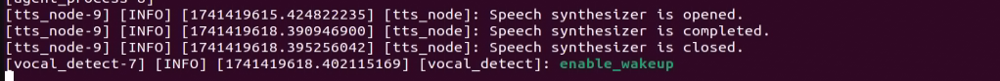

To exit the feature, press **Ctrl + C** in the terminal. If the feature does not exit immediately, press **Ctrl + C** multiple times.

* **Project Outcome**

Once the feature is activated, you can phrase your own commands. For example, saying "**Take the cylinder away**" will make the ArmPi Ultra automatically pick up the cylinder block in its field of view and place it on the left side of the robotic arm.


* **Program Brief Analysis**

(1) launch File Analysis

① launch_setup Function 

{lineno-start=10}

```
def launch_setup(context):
    mode = LaunchConfiguration('mode', default=1)
    mode_arg = DeclareLaunchArgument('mode', default_value=mode)

    # Get package path (获取包路径)
    large_models_package_path = get_package_share_directory('large_models')

    object_sorting_launch = IncludeLaunchDescription(
        PythonLaunchDescriptionSource(
            os.path.join(large_models_package_path, 'launch/3d_object_sorting.launch.py')),
    )

    # Start large_models_launch and llm_3d_object_sorting_node after 5 seconds (在5秒后启动 large_models_launch 和 llm_3d_object_sorting_node)
    delayed_launch = TimerAction(
        period=5.0,  # Delay time of 5 seconds (延迟时间为5秒)
        actions=[
            IncludeLaunchDescription(
                PythonLaunchDescriptionSource(
                    os.path.join(large_models_package_path, 'launch/start.launch.py')),
                launch_arguments={'mode': mode}.items(),
            ),
            Node(
                package='large_models',
                executable='llm_3d_object_sorting',
                output='screen',
            ),
        ]
    )

    return [mode_arg,
            object_sorting_launch,  # Immediate launch (立即启动 object_sorting_launch)
            delayed_launch,          # Delayed launch (启动后延迟的部分)
            ]
```

It first loads the **launch/3d_object_sorting.launch.py** file from the large_models package to start the core nodes for 3D object sorting, such as 3D object recognition, spatial localization, and category determination, which serve as the system's foundation and provide object information in three-dimensional space. Delayed startup of the large model and control nodes is achieved by setting a 5-second delay with TimerAction. This ensures that the basic nodes such as the 3D recognition module have completed initialization and are stably outputting data before launching the dependent upper-level components. After that, the system loads the **launch/start.launch.py** file from the large_models package to start the large model service, passing in the mode parameter to control its operating mode, such as different 3D sorting strategies or interaction methods. Finally, the llm_3d_object_sorting executable from the large_models package is launched. This node acts as the bridge between the large model and the 3D object sorting logic, converting the model's decisions, such as 3D-based grasping strategies, into specific robotic arm commands, with logs output to the terminal.

② generate_launch_description Function 

{lineno-start=44}

```
def generate_launch_description():
    return LaunchDescription([
        OpaqueFunction(function=launch_setup)
    ])
```

Creates and returns a LaunchDescription object, calling launch_setup via OpaqueFunction as the standard entry point for the ROS 2 launch file.

③ Main Function 

{lineno-start=49}

```
if __name__ == '__main__':
    # Create a LaunchDescription object (创建一个LaunchDescription对象)
    ld = generate_launch_description()

    ls = LaunchService()
    ls.include_launch_description(ld)
    ls.run()
```

Creates a LaunchDescription object and a LaunchService service. The launch description is added to the service and executed, enabling the startup of the entire system manually.

(2) Python File Analysis

① Prompt Template Definition

{lineno-start=54}

```
    PROMPT = '''
#Role
You are an intelligent robot arm that needs to generate corresponding instructions based on the input content.

##Requirements and Restrictions
1. According to the input action content, find the corresponding instructions in the action function library and output the corresponding instructions.
2. Weave a concise (10 to 30 words), humorous and ever-changing feedback information for the action sequence to make the communication process interesting.
3. Objects are divided into three categories: cylinder, sphere, and cuboid.
4. Directly output the json result, do not analyze it, and do not output redundant content.
5. Format: {"action": "xx", "response": "xx"}

##Structural Requirements:
- The "action" key carries a function name string array. When the corresponding action function cannot be found, action outputs "".
- The "response" key is accompanied by a carefully conceived short reply, which perfectly meets the above word count and style requirements.

##Implementation Principles 
- Before final output, implement comprehensive verification to ensure that the response is not only formatted in compliance, but also interesting and without missing any of the above specifications.

##Action function library
- Sorting objects: object_sorting('cylinder')

##Example
Input: Sorting cylinders
Output: {"action": "object_sorting('cylinder')", "response": "OK, start sorting cylinders"}
Input: Take the cuboid away
Output: {"action": "object_sorting('cuboid')", "response": "The cuboid is gone"}
Input: Only keep the sphere and take the others away
Output: {"action": "object_sorting('cylinder'，'cuboid')", "response": "OK, execute now"}
Input: Sorting objects
Output: {"action": "object_sorting('cylinder', 'cuboid'，'sphere')", "response": "No problem"}
    '''

```

② Initialization

{lineno-start=86}

```
class LLMObjectSorting(Node):
    def __init__(self, name):
        rclpy.init()
        super().__init__(name)

        self.action = []
        self.llm_result = ''
        self.action_finish = False
        self.play_audio_finish = False
        # self.llm_result = '{"action": "object_sorting(\'cylinder\', \'cuboid\', \'sphere\')", "response": "收到，我马上收拾"}'
        self.running = True

        timer_cb_group = ReentrantCallbackGroup()
        self.tts_text_pub = self.create_publisher(String, 'tts_node/tts_text', 1)
        self.create_subscription(Bool, 'tts_node/play_finish', self.play_audio_finish_callback, 1, callback_group=timer_cb_group)
        self.create_subscription(String, 'agent_process/result', self.llm_result_callback, 1)
        self.create_subscription(Bool, 'vocal_detect/wakeup', self.wakeup_callback, 1)

        self.awake_client = self.create_client(SetBool, 'vocal_detect/enable_wakeup')
        self.awake_client.wait_for_service()

        self.set_model_client = self.create_client(SetModel, 'agent_process/set_model')
        self.set_model_client.wait_for_service()

        self.set_prompt_client = self.create_client(SetString, 'agent_process/set_prompt')
        self.set_prompt_client.wait_for_service()

        self.enter_client = self.create_client(Trigger, 'shape_recognition/enter')
        self.enter_client.wait_for_service()

        self.start_client = self.create_client(SetBool, 'shape_recognition/set_running')
        self.start_client.wait_for_service()

        self.set_target_client = self.create_client(SetStringList, 'shape_recognition/set_shape')
        self.set_target_client.wait_for_service()

        self.timer = self.create_timer(0.0, self.init_process, callback_group=timer_cb_group)

```

Sets up the node and configures state variables such as the action list and large-model results. Creates publishers for TTS text, subscribers for large-model results, TTS completion signals, and wake-up signals, as well as service clients for large-model configuration and object sorting control. Finally, starts the initialization timer.

③ get_node_state Method

{lineno-start=124}

```
    def get_node_state(self, request, response):
        return response
```

Service callback function that returns an empty response, used to confirm that the node has completed initialization.

④ init_process Method 

{lineno-start=127}

```
    def init_process(self):
        self.timer.cancel()
        
        msg = SetModel.Request()
        msg.model = llm_model
        msg.model_type = 'llm'
        msg.api_key = api_key 
        msg.base_url = base_url
        self.send_request(self.set_model_client, msg)

        msg = SetString.Request()
        msg.data = PROMPT
        self.send_request(self.set_prompt_client, msg)

        self.send_request(self.enter_client, Trigger.Request())       
        

        speech.play_audio(start_audio_path)
        threading.Thread(target=self.process, daemon=True).start()
        self.create_service(Empty, '~/init_finish', self.get_node_state)
        self.get_logger().info('\033[1;32m%s\033[0m' % 'start')
        self.get_logger().info('\033[1;32m%s\033[0m' % PROMPT)
```

Handles the node initialization process by canceling the timer, configuring large-model parameters such as model type and API keys, sending a request to enter the object sorting service, starting the processing thread, and publishing a log to confirm that initialization is complete.

⑤ send_request Method

{lineno-start=150}

```
    def send_request(self, client, msg):
        future = client.call_async(msg)
        while rclpy.ok():
            if future.done() and future.result():
                return future.result()
```

A general-purpose service call utility that sends a request and blocks until a response is received, ensuring reliable service communication such as large-model configuration and sorting control.

⑥ wakeup_callback Method 

{lineno-start=156}

```
    def wakeup_callback(self, msg):
        if msg.data and self.llm_result:
            self.send_request(self.enter_client, Trigger.Request())
```

A subscription callback for the wakeup signal. When a wakeup signal is received, it resends the request to enter the object sorting service and resets the sorting state.

⑦ llm_result_callback Method 

{lineno-start=160}

```
    def llm_result_callback(self, msg):
        self.llm_result = msg.data
```

Subscriber callback for large model results. Receives instructions generated by the large model including action and response and saves them in the llm_result variable for subsequent processing.

⑧ Play_audio_finish_callback Method 

{lineno-start=163}

```
    def play_audio_finish_callback(self, msg):
        self.play_audio_finish = msg.data
```

A subscription callback for the TTS completion signal. It sets the play_audio_finish flag to synchronize action execution with speech playback.

⑨ process Method 

{lineno-start=166}

```
    def process(self):
        while self.running:
            if self.llm_result:
                msg = String()
                if 'action' in self.llm_result:  # If there is a corresponding action returned, extract and handle it. 如果有对应的行为返回那么就提取处理
                    result = eval(self.llm_result[self.llm_result.find('{'):self.llm_result.find('}') + 1])
                    if 'action' in result:
                        text = result['action']
                        # Use regular expressions to extract all strings inside. 使用正则表达式提取括号中的所有字符串
                        pattern = r"object_sorting\((['\"][^'\"]+['\"](?:\s*,\s*['\"][^'\"]+['\"])*)\)"
                        # Use re.search to find the matching result. 使用re.search找到匹配的结果
                        match = re.search(pattern, text)
                        # Extract the result. 提取结果
                        if match:
                            # Retrieve all argument parts (the content inside the parentheses). 获取所有的参数部分(括号内的内容) 
                            params = match.group(1)
                            # Use regular expressions to split the string arguments. 使用正则拆分出各个字符串参数
                            objects = re.findall(r"['\"]([^'\"]+)['\"]", params)
                            # self.get_logger().info(str(objects))
                            # Enable recognition. 开启识别
                            msgs = SetStringList.Request()
                            msgs.data = objects                            
                            res = self.send_request(self.set_target_client, msgs)
                            if res.success:
                                self.get_logger().info('\033[1;32m%s\033[0m' % 'set object success')
                            else:
                                self.get_logger().info('\033[1;32m%s\033[0m' % 'set object fail')
                            start_msg = SetBool.Request()
                            start_msg.data = True
                            # Enable sorting. 开启分拣
                            self.send_request(self.start_client, start_msg)
                    if 'response' in result:
                        msg.data = result['response']
                else:  # No corresponding action, just respond. 没有对应的行为，只回答
                    msg.data = self.llm_result
                self.tts_text_pub.publish(msg)
                self.action_finish = True
                self.llm_result = ''
            else:
                time.sleep(0.01)
            if self.play_audio_finish and self.action_finish:
                self.play_audio_finish = False
                self.action_finish = False
                msg = SetBool.Request()
                msg.data = True
                self.send_request(self.awake_client, msg)
        rclpy.shutdown()
```

Main processing loop that parses the large model output, extracts object sorting actions such as object_sorting('cylinder'), uses regular expressions to identify the target object type, sets the sorting target and starts the sorting process. It then publishes the TTS response and re-enables the wake-up function once execution is complete.

⑩ main Function 

{lineno-start=214}

```
def main():
    node = LLMObjectSorting('llm_object_sorting')
    executor = MultiThreadedExecutor()
    executor.add_node(node)
    executor.spin()
    node.destroy_node()
```

The program entry point. It creates an LLMObjectSorting instance, starts a multithreaded executor to handle callbacks, runs the node, and cleans up resources.

## 11.3  Embodied AI Applications

### 11.3.1 Overview of Embodied Intelligence

* **Overview of Embodied Intelligence**

Embodied Intelligence represents a key branch of artificial intelligence that emphasizes learning and decision-making through the interaction between a physical entity and its environment. At its core lies the principle that intelligence emerges from the dynamic interplay between an agent's physical embodiment and its environment. This approach moves beyond the limitations of traditional AI, which often relies solely on static data. Embodied intelligence has found broad applications across industries such as manufacturing, healthcare, service, education, and military.


* **Multimodal Information Fusion**

An important branch of embodied intelligence is multimodal information fusion, which refers to the effective integration of data from different modalities—such as text, images, and speech—to produce a more comprehensive and accurate representation of information. This process is especially critical in artificial intelligence, as real-world data is inherently multimodal. Relying on a single modality often fails to provide sufficient context or detail. Multimodal fusion aims to enhance model performance and robustness by leveraging the complementary strengths of multiple data sources.

Several common approaches to multimodal information fusion include the following:

**Early Fusion**: Combines data from different modalities at an early stage of processing. This typically occurs at the input level, where raw data is aligned and transformed into a shared space to create a richer, more expressive representation. For example, image and speech data can be concatenated directly and fed into a neural network.

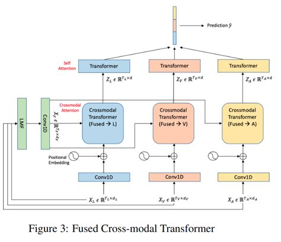

**Late Fusion**: Integrates data from multiple modalities at intermediate or output stages of the model. This approach allows each modality to be processed independently using specialized algorithms, making it easier to add or replace modalities in the future. For instance, results from image recognition and text analysis can be combined to support final decision-making.

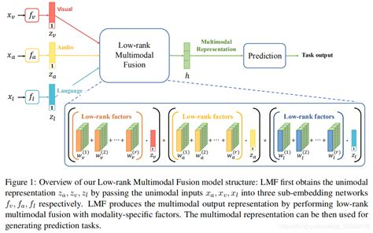

**Hybrid Fusion**: Leverages both early and late fusion techniques by performing integration at multiple stages. This method takes advantage of modality complementarity and can improve both performance and model robustness.

**Feature-Level Fusion**: Involves extracting features from each modality and mapping them into a unified feature vector, which is then passed to a classifier for decision-making. Fusion occurs during the feature extraction phase, enabling the model to learn correlations across modalities.

**Decision-Level Fusion**: Merges outputs from individual modality-specific decisions to produce the final outcome. This technique offers strong noise resistance and places fewer demands on sensor types or quality, though it may result in some loss of information.

**Deep Fusion**: Takes place during feature extraction, where multimodal data is blended in the feature space to generate fused features that can compensate for missing or weak signals from any single modality. These fused features are then used for classification or regression tasks during prediction.

Multimodal information fusion holds not only theoretical significance but also substantial practical value. It has been widely applied in fields such as autonomous driving, medical image analysis, and human-computer interaction, where it has significantly improved system performance and reliability.

### 11.3.2 Obtain and Configure the Large Model API Key

> [!NOTE]
>
> This section requires registering on the official OpenAI website and obtaining an API key for accessing large language models.

* **Register and Deploy OpenAI Account** 

1)  Copy and open the following URL: [https://platform.openai.com/docs/overview](https://platform.openai.com/docs/overview)


2)  Register and log in using a Google, Microsoft, or Apple account, as prompted.


3)  After logging in, click the **Settings** button, then go to **Billing**, and click **Payment methods** to add a payment method. Recharge your account to purchase tokens as needed.


4)  Once your account is set up, go to the API Keys section and click Create new key. Follow the instructions to generate a new API key and save it securely for later use.


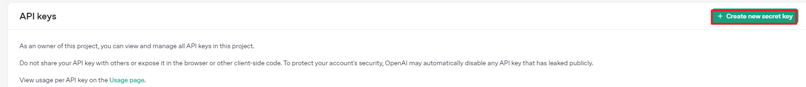


5)  The creation and deployment of the large model have been completed, and this API will be used in the following lessons.

* **Register and Deploy OpenRouter Account** 

1)  Copy and open the following URL: [https://openrouter.ai/](https://openrouter.ai/) and click "**Sign in**", and register or sign in using Google or another available account.


2)  After logging in, click the icon in the top-right corner, then select "**Credits**" to add a payment method.


3)  Create an API key. Go to "**API Keys**", then click "**Create Key**". Follow the prompts to generate a key. Save the API key securely for later use.


4)  The creation and deployment of the large model have been completed, and this API will be used in the following lessons.

* **API Configuration**

1)  In the command-line terminal, enter the following command to navigate to the directory where the large model keys are configured.

```
cd ~/ros2_ws/src/large_models/large_models
```
2)  Next, open the configuration file with the following command.

```
vim config.py
```
3)  Once the file is open, you need to configure the OpenAI and OpenRouter keys by filling them into the parameters llm_api_key and vllm_api_key, respectively.


For example, copy the keys you created in this chapter and paste them into the corresponding fields. Place the cursor between the quotation marks, right-click, and select **Paste**. 

> [!NOTE]
>
> **Note:** keys from different large models cannot be mixed, otherwise the functions may fail to work properly.

4)  After pasting, press **Esc**, then enter the following command and press Enter to save the file:
```
:wq
```
### 11.3.3 Real-time Detection

The large model used in this lesson operates online, requiring a stable network connection for the main controller in use. For better stability, it is recommended to use a wired network connection.

* **Overview**

When the program starts, the AI voice box announces "**I'm ready.**"

Then, you can say the wake word "**Hello Hiwonder**" to activate the AI voice box, which will respond with "**I'm here**." Once activated, you can control the ArmPi Ultra using voice commands. For example, you can say "**What do you see**." After receiving the command, the terminal will print the recognized image content, and the AI voice box will speak out the generated response.

* **Preparation**

(1) Confirm WonderEcho Pro Firmware

The default wake word for WonderEcho Pro is "**Hello Hiwonder**." If you wish to change the wake-up word to "**Xiaohuan Xiaohuan**," please refer to the directory: [10. Voice Control Course->10.2 Firmware Flashing](https://wiki.hiwonder.com/projects/ArmPi-Ultra/en/latest/docs/10.Voice_Control_Course.html#firmware-flashing).

If you have previously flashed a different firmware, such as the one using the wake word "**Xiaohuan Xiaohuan**," you must use the corresponding wake word.

The examples in this course will assume the default factory wake word: "**Hello Hiwonder**."

(2) Configuring the Large Model API-KEY 

By default, the program does not include the configuration of the Large Model-related API keys. Before activating features related to the Large AI Model, please refer to the section "[11.2.1 Obtain and Configure the Large Model API Key](#anchor_11_2_1)" in this document to configure the necessary keys. This step is mandatory and cannot be skipped, as it is crucial for the proper functioning and experience of the large model features.

(3) Network Configuration

> [!NOTE]
>
> The large model used in this lesson is an online model, so network access is required before getting started. Please prepare an Ethernet cable to connect the robot to the network, or switch the robot to LAN mode.

The robot must be connected to the Internet during this feature, either in STA (LAN) mode or AP (direct connection) mode via Ethernet. There are two methods available for configuring the network:

- To configure the network using the mobile app, you may refer to the tutorial under the directory:[1. ArmPi Ultra User Manual->1.4 App Control->1.4.2 Connection Modes Overview](https://wiki.hiwonder.com/projects/ArmPi-Ultra/en/latest/docs/1.ArmPi_Ultra_User_Manual.html#connection-modes-overview).

- Connect to the robot via VNC and modify the network configuration files as described in:[1. ArmPi Ultra User Manual ->1.6 Development Environment Setup and Configuration ->1.6.3 LAN Mode Connection](https://wiki.hiwonder.com/projects/ArmPi-Ultra/en/latest/docs/1.ArmPi_Ultra_User_Manual.html#lan-mode-connection).

* **Operations**

1)  Double-click on  to launch the command bar, enter the command, and press **Enter** to disable the auto-start service.

2)  Enter the command to disable the auto-start service of the mobile app.

```
~/.stop_ros.sh
```

3)  Enter the following command and press **Enter** to launch the real-time detection feature.

```
ros2 launch large_models vllm_with_camera.launch.py
```

4)  When the terminal displays output shown in the figure and the AI voice box announces "**I'm ready**", the voice device has completed initialization. Then, you can say the wake words: "**Hello Hiwonder**".


5)  For example, place the object you want to identify in front of the camera and say the command "**What do you see**."


> [!NOTE]
>
> The response is automatically generated by the model. While the semantic content is accurate, the wording and structure may vary due to randomness in language generation.

6)  When the terminal shows the output shown in the figure indicating the end of one interaction cycle, the system is ready for the next round. To initiate another interaction, repeat step 4 by speaking the wake words again.


7)  To exit the feature, press **Ctrl + C** in the terminal. If the feature does not exit immediately, press **Ctrl + C** multiple times.

* **Project Outcome**

Once the feature is activated, you can phrase your own commands. For example, when you say "**What do you see**" to ArmPi Ultra, it will automatically analyze the scene within its field of view, think about what it sees, and describe the scene content in detail.


* **Program Brief Analysis**

(1) launch File Analysis

① Defining the launch_setup Function 

{lineno-start=9}

```
def launch_setup(context):
    mode = LaunchConfiguration('mode', default=1)
    mode_arg = DeclareLaunchArgument('mode', default_value=mode)

    peripherals_package_path = get_package_share_directory('peripherals')
    sdk_package_path = get_package_share_directory('sdk')
    large_models_package_path = get_package_share_directory('large_models')

    # Launch depth_camera_launch (启动 depth_camera_launch)
    depth_camera_launch = IncludeLaunchDescription(
        PythonLaunchDescriptionSource(
            os.path.join(peripherals_package_path, 'launch/depth_camera.launch.py')),
    )

    # Start sdk_launch and large_models_launch after 5 seconds (在5秒后启动 sdk_launch 和 large_models_launch)
    delayed_launch = TimerAction(
        period=5.0,  # Delay time of 5 seconds (延迟时间为5秒)
        actions=[
            IncludeLaunchDescription(
                PythonLaunchDescriptionSource(
                    os.path.join(sdk_package_path, 'launch/armpi_ultra.launch.py')),
            ),
            IncludeLaunchDescription(
                PythonLaunchDescriptionSource(
                    os.path.join(large_models_package_path, 'launch/start.launch.py')),
                launch_arguments={'mode': mode}.items(),
            ),
        ]
    )

    vllm_with_camera_node = Node(
        package='large_models',
        executable='vllm_with_camera',
        output='screen',
    )

    return [depth_camera_launch,  # Immediate launch (立即启动 depth_camera_launch)
            delayed_launch,       # Delayed launch for sdk_launch and large_models_launch (启动延迟后的 sdk_launch 和 large_models_launch)
            vllm_with_camera_node,
            ]
```

First, loads the peripherals package's **launch/depth_camera.launch.py** file to start the depth camera node, which provides RGB images and depth data as the foundation for visual input. Next, delays the startup of core services by 5 seconds using TimerAction. This ensures the depth camera has fully initialized and is stably outputting data before dependent components are launched. Then, loads the sdk package's **launch/armpi_ultra.launch.py** file to start the ArmPi Ultra's low-level control services such as servo drivers and kinematics, providing hardware support for subsequent motion execution. After that, loads the large_models package's **launch/start.launch.py** file to start the large model service, passing the mode parameter to control its operation, such as different reasoning logic and interaction modes. Finally, starts the Vision-Language Large Model node by declaring vllm_with_camera_node and launching the vllm_with_camera executable from the large_models package. Its core function is to combine depth camera data with large model capabilities, such as visual question answering and scene understanding, to realize the closed loop of "visual input to large model decision to robotic arm interaction." Logs will be output to the terminal.

② generate_launch_description Function

{lineno-start=50}

```
def generate_launch_description():
    return LaunchDescription([
        OpaqueFunction(function=launch_setup)
    ])
```

Creates and returns a LaunchDescription object, calling launch_setup via OpaqueFunction as the standard entry point for the ROS 2 launch file.

③ Main Function

{lineno-start=55}

```
if __name__ == '__main__':
    # Create a LaunchDescription object (创建一个LaunchDescription对象)
    ld = generate_launch_description()

    ls = LaunchService()
    ls.include_launch_description(ld)
    ls.run()
```

Creates a LaunchDescription object and a LaunchService service. The launch description is added to the service and executed, enabling the startup of the entire system manually.

* **Python File Analysis**

① Import the Necessary Libraries

{lineno-start=4}

```
import cv2
import time
import queue
import rclpy
import threading
import numpy as np
import os

from rclpy.node import Node
from sensor_msgs.msg import Image
from std_msgs.msg import String, Bool
from std_srvs.srv import Trigger, SetBool, Empty
from rclpy.executors import MultiThreadedExecutor
from rclpy.callback_groups import ReentrantCallbackGroup

from speech import speech
from large_models.config import *
from large_models_msgs.srv import SetString, SetModel
from servo_controller.bus_servo_control import set_servo_position
from servo_controller_msgs.msg import ServosPosition

from cv_bridge import CvBridge
```

servo_controller_msgs.msg.ServosPosition: custom message type for controlling servo motors.

servo_controller.bus_servo_control.set_servo_position**:** function used to set the servo angle.

speech: module related to large model voice interaction.

large_models_msgs.srv: custom service types for large models.

large_models.config: configuration file for large models.

② VLLMWithCamera Class

{lineno-start=32}

```
class VLLMWithCamera(Node):
    def __init__(self, name):
        rclpy.init()
        super().__init__(name)
        self.image_queue = queue.Queue(maxsize=2)
        self.vllm_result = ''
        self.running = True
        self.bridge = CvBridge()
        timer_cb_group = ReentrantCallbackGroup()
        self.joints_pub = self.create_publisher(ServosPosition, 'servo_controller', 1)
        self.tts_text_pub = self.create_publisher(String, 'tts_node/tts_text', 1)
        self.create_subscription(Image, 'depth_cam/rgb/image_raw', self.image_callback, 1)
        self.create_subscription(String, 'agent_process/result', self.vllm_result_callback, 1)
        self.create_subscription(Bool, 'tts_node/play_finish', self.play_audio_callback, 1, callback_group=timer_cb_group)
        self.awake_client = self.create_client(SetBool, 'vocal_detect/enable_wakeup')
        self.awake_client.wait_for_service()
        self.set_model_client = self.create_client(SetModel, 'agent_process/set_model')
        self.set_model_client.wait_for_service()
        self.set_prompt_client = self.create_client(SetString, 'agent_process/set_prompt')
        self.set_prompt_client.wait_for_service()
        self.timer = self.create_timer(0.0, self.init_process, callback_group=timer_cb_group)

```

Initializes the node and sets up core components, creating an image queue image_queue to cache camera frames and defining state variables such as vllm_result to store outputs from the large model. Initializes ROS communication, including publishers for servo control and TTS text, subscribers for RGB images, large model results, and TTS playback completion signals, and service clients for configuring the large model, wake-up control, etc. Starts the initialization timer, which triggers init_process to complete the remaining setup.

③ get_node_state Method

{lineno-start=54}

```
    def get_node_state(self, request, response):
        return response
```

Service callback function that returns an empty response, used to confirm that the node has completed initialization.

④ init_process Method

{lineno-start=57}

```
    def init_process(self):
        self.timer.cancel()
        msg = SetModel.Request()
        msg.model_type = 'vllm'
        if os.environ['ASR_LANGUAGE'] == 'Chinese':
            msg.model = stepfun_vllm_model
            msg.api_key = stepfun_api_key
            msg.base_url = stepfun_base_url
        else:
            msg.model = vllm_model
            msg.api_key = vllm_api_key
            msg.base_url = vllm_base_url
        self.send_request(self.set_model_client, msg)
        msg = SetString.Request()
        msg.data = PROMPT
        self.send_request(self.set_prompt_client, msg)
        set_servo_position(self.joints_pub, 1.0, ((6, 500), (5, 600), (4, 825), (3, 233), (2, 500), (1, 300)))
        speech.play_audio(start_audio_path)
        threading.Thread(target=self.process, daemon=True).start()
        self.create_service(Empty, '~/init_finish', self.get_node_state)
        self.get_logger().info('\033[1;32m%s\033[0m' % 'start')
```

Node initialization workflow that cancels the initialization timer, configures large model parameters by selecting the model and API keys based on language settings, and sets up prompts. Resets the robotic arm servos to their default positions, plays the startup audio, and starts the main processing thread process. Creates the initialization-complete service and outputs a startup log.

⑤ send_request Method 

{lineno-start=79}

```
    def send_request(self, client, msg):
        future = client.call_async(msg)
        while rclpy.ok():
            if future.done() and future.result():
                return future.result()
```

A general service call utility that sends a request and blocks until the result is returned, ensuring service communication is complete, such as configuring the large model, enabling wake-up.

⑥ vllm_result_callback Method 

{lineno-start=85}

```
    def vllm_result_callback(self, msg):
        self.vllm_result = msg.data
```

Subscriber callback for large model results, receives model outputs and saves them to vllm_result for subsequent processing.

⑦ process Method 

{lineno-start=88}

```
    def process(self):
        while self.running:
            image = self.image_queue.get(block=True)
            if self.vllm_result:
                msg = String()
                msg.data = self.vllm_result
                self.tts_text_pub.publish(msg)
                self.vllm_result = ''
            cv2.imshow('image', image)
            cv2.waitKey(1)
        cv2.destroyAllWindows()
```

The main processing loop that fetches camera frames from the queue and displays them, while monitoring large model results in real time. When a model result is received, it is published to the TTS node for voice playback, and the result cache is cleared. The loop runs until the node stops, and finally closes the image window.

⑧ play_audio_callback Method 

{lineno-start=100}

```
    def play_audio_callback(self, msg):
        if msg.data:
            msg = SetBool.Request()
            msg.data = True
            self.send_request(self.awake_client, msg)
```

TTS playback completion callback that re-enables the wake-up functionality and waits for the next command input.

⑨ image_callback Method 

{lineno-start=106}

```
    def image_callback(self, ros_image):
        try:
            cv_image = self.bridge.imgmsg_to_cv2(ros_image, desired_encoding='bgr8')
        except Exception as e:
            self.get_logger().error(f"图像转换出错：{e}")
            return
        if self.image_queue.full():
            self.image_queue.get()
        self.image_queue.put(cv_image)

```

RGB image subscriber callback that converts ROS image messages into OpenCV format and stores them in the image queue. The oldest frame is discarded if the queue is full.

⑩ main Function 

{lineno-start=116}

```
def main():
    node = VLLMWithCamera('vllm_with_camera')
    executor = MultiThreadedExecutor()
    executor.add_node(node)
    executor.spin()
    node.destroy_node()
```

The program entry point. It creates an VLLMWithCamera instance, starts a multithreaded executor to handle callbacks, runs the node, and cleans up resources.

### 11.3.4 Vision Tracking

The large model used in this lesson operates online, requiring a stable network connection for the main controller in use. For better stability, it is recommended to use a wired network connection.

* **Overview**

When the program starts, the AI voice box will announce "**I'm ready**."

Then, you can say the designated wake word "**Hello Hiwonder**" to activate the AI voice box, and it will respond with "**I'm here**." After activation, you can control the ArmPi Ultra by voice. For example, if you say "**Follow the purple ball**," the terminal will display the recognized speech, the AI voice box will announce the generated response after processing, and the robot will execute the corresponding action.

* **Preparation**

(1) Confirm WonderEcho Pro Firmware

The default wake word for WonderEcho Pro is "**Hello Hiwonder**." If you wish to change the wake-up word to "**Xiaohuan Xiaohuan**," please refer to the directory: [10. Voice Control Course ->10.2 Firmware Flashing](https://wiki.hiwonder.com/projects/ArmPi-Ultra/en/latest/docs/10.Voice_Control_Course.html#firmware-flashing).

If you have previously flashed a different firmware, such as the one using the wake word "**Xiaohuan Xiaohuan**," you must use the corresponding wake word.

The examples in this course will assume the default factory wake word: "**Hello Hiwonder**."

(2) Configuring the Large Model API-KEY

By default, the program does not include the configuration of the Large Model-related API keys. Before activating features related to the Large AI Model, please refer to the section "**[11.3.2 Obtain and Configure the Large Model API Key](https://wiki.hiwonder.com/projects/ArmPi-Ultra/en/latest/docs/11.Large_AI_Model_Course.html#obtain-and-configure-the-large-model-api-key)**" in this document to configure the necessary keys. This step is mandatory and cannot be skipped, as it is crucial for the proper functioning and experience of the large model features.

(3) Network Configuration

> [!NOTE]
>
> **Note:** The large model used in this lesson is an online model, so network access is required before getting started. Please prepare an Ethernet cable to connect the robot to the network, or switch the robot to LAN mode.

The robot must be connected to the Internet during this feature, either in STA (LAN) mode or AP (direct connection) mode via Ethernet. There are two methods available for configuring the network:

- To configure the network using the mobile app, you may refer to the tutorial under the directory:[1. ArmPi Ultra User Manual->1.4 App Control->1.4.2 Connection Modes Overview](https://wiki.hiwonder.com/projects/ArmPi-Ultra/en/latest/docs/1.ArmPi_Ultra_User_Manual.html#connection-modes-overview).

- Connect to the robot via VNC and modify the network configuration files as described in:[1. ArmPi Ultra User Manual \6. Development Environment Setup and Configuration \6.3 LAN Mode Connection](https://wiki.hiwonder.com/projects/ArmPi-Ultra/en/latest/docs/1.ArmPi_Ultra_User_Manual.html#lan-mode-connection).

* **Operations**

> [!NOTE]
>
> * Command input is case-sensitive and space-sensitive.
>
> * The robot must be connected to the Internet, either in STA (LAN) mode or AP (direct connection) mode via Ethernet.

1)  Double-click on  to launch the command bar, enter the command, and press **Enter** to disable the auto-start service.

2)  Enter the command to disable the auto-start service of the mobile app.

```
~/.stop_ros.sh
```

3)  Enter the following command and press **Enter** to launch the vision tracking feature.

```
ros2 launch large_models vllm_track.launch.py
```

4)  When the terminal displays output shown in the figure and the AI voice box announces "**I'm ready**", the voice device has completed initialization. Then, you can say the wake words: "**Hello Hiwonder**".


5)  When the terminal displays the corresponding output shown in the figure and the device responds with "**I'm here**", it indicates successful activation. The system will begin recording your voice command.


6)  Upon successful recognition by the speech recognition service of cloud-based large speech model, the parsed command will be displayed under the publish_asr_result output in the terminal.


7. Upon receiving user input shown in the figure, the terminal will display output indicating that the cloud-based large language model has been successfully invoked. The model will interpret the command, generate a language response, and execute a corresponding action based on the meaning of the command.

   > [!NOTE]
   >
   > The response is automatically generated by the model. While the semantic content is accurate, the wording and structure may vary due to randomness in language generation.


8)  When the terminal shows the output shown in the figure indicating the end of one interaction cycle, the system is ready for the next round. To initiate another interaction, repeat step 4 by speaking the wake words again.


9)  To exit the feature, press **Ctrl + C** in the terminal. If the feature does not exit immediately, press **Ctrl + C** multiple times.

* **Project Outcome**

Once the feature is activated, you can phrase your own commands. For example, saying "**Follow the purple ball**" will make the ArmPi Ultra's robotic arm automatically track the purple ball within its field of view. The ball will be highlighted on the screen, and tracking will stop once it is positioned at the center of the frame.

* **Program Brief Analysis**

(1) launch File Analysis

① Defining the launch_setup Function

{lineno-start=10}

```
def launch_setup(context):
    mode = LaunchConfiguration('mode', default=1)
    mode_arg = DeclareLaunchArgument('mode', default_value=mode)

    peripherals_package_path = get_package_share_directory('peripherals')
    sdk_package_path = get_package_share_directory('sdk')
    large_models_package_path = get_package_share_directory('large_models')

    # Immediately launch depth_camera_launch (立即启动 depth_camera_launch)
    depth_camera_launch = IncludeLaunchDescription(
        PythonLaunchDescriptionSource(
            os.path.join(peripherals_package_path, 'launch/depth_camera.launch.py')),
    )

    # Launch sdk_launch, large_models_launch, vllm_track_node, and calibrate_rqt_reconfigure_node after 5 seconds (在5秒后启动 sdk_launch、large_models_launch、vllm_track_node 和 calibrate_rqt_reconfigure_node)
    delayed_launch = TimerAction(
        period=5.0,  # Delay time of 5 seconds (延迟时间为5秒)
        actions=[
            IncludeLaunchDescription(
                PythonLaunchDescriptionSource(
                    os.path.join(sdk_package_path, 'launch/armpi_ultra.launch.py')),
            ),
            IncludeLaunchDescription(
                PythonLaunchDescriptionSource(
                    os.path.join(large_models_package_path, 'launch/start.launch.py')),
                launch_arguments={'mode': mode}.items(),
            ),
            Node(
                package='large_models',
                executable='vllm_track',
                output='screen',
            ),            
        ]
    )

    return [mode_arg,
            depth_camera_launch,   # Immediate launch (立即启动)
            delayed_launch,        # Launch other components after 5 seconds (5秒后启动其他部分)
            ]
```

Starts the depth camera by loading the peripherals package's **launch/depth_camera.launch.py** file. This launches the depth camera node, providing RGB images and depth data as the foundational input for visual tracking. Delays the startup of the core services and tracking node by setting a 5-second TimerAction. This ensures that the depth camera has completed initialization and is outputting stable data before launching the dependent core components. Then loads the sdk package's **launch/armpi_ultra.launch.py** file to start the ArmPi Ultra's low-level control services, such as servo drivers and kinematics computation, providing hardware support for target tracking and manipulation. After that, loads the large_models package's **launch/start.launch.py** file to start the large model service, passing the mode parameter to control its operating mode, such as different target recognition logic or tracking strategies. Launches the vllm_track executable from the large_models package as the core visual tracking node. It combines depth camera data with the large model's capabilities to perform target tracking, including real-time localization and dynamic following, with logs displayed on the screen.

② generate_launch_description Function 

{lineno-start=50}

```
def generate_launch_description():
    return LaunchDescription([
        OpaqueFunction(function=launch_setup)
    ])
```

Creates and returns a LaunchDescription object, calling launch_setup via OpaqueFunction as the standard entry point for the ROS 2 launch file.

③ Main Function 

{lineno-start=55}

```
if __name__ == '__main__':
    # Create a LaunchDescription object (创建一个LaunchDescription对象)
    ld = generate_launch_description()

    ls = LaunchService()
    ls.include_launch_description(ld)
    ls.run()
```

Creates a LaunchDescription object and a LaunchService service. The launch description is added to the service and executed, enabling the startup of the entire system manually.

(2) Python File Analysis

① Import the Necessary Libraries

{lineno-start=5}

```
import cv2
import json
import time
import queue
import rclpy
import threading
import PIL.Image
import numpy as np
import sdk.fps as fps
from sdk import common
from cv_bridge import CvBridge
from rclpy.node import Node
from sensor_msgs.msg import Image
from std_msgs.msg import String, Float32, Bool
from std_srvs.srv import Trigger, SetBool, Empty
from rcl_interfaces.msg import SetParametersResult
from rclpy.executors import MultiThreadedExecutor
from rclpy.callback_groups import ReentrantCallbackGroup

from speech import speech
from large_models.config import *
from large_models_msgs.srv import SetString, SetModel
from large_models.track_anything import ObjectTracker
from kinematics_msgs.srv import SetRobotPose, SetJointValue
from kinematics.kinematics_control import set_pose_target, set_joint_value_target
from servo_controller.bus_servo_control import set_servo_position
from servo_controller_msgs.msg import ServosPosition, ServoPosition
```

**PIL.Image**: Part of the **Pillow** library, used for handling image files.

**sdk.fps as fps**: Used to calculate and display the frame rate (FPS).

**from kinematics_msgs.srv import SetRobotPose**: Imports the service type for setting the robot's pose.

**from kinematics.kinematics_control import set_pose_target**: Imports the function to set the target pose.

**servo_controller_msgs.msg.ServosPosition**: custom message type for controlling servo motors.

**speech**: module related to large model voice interaction.

**large_models_msgs.srv**: custom service types for large models.

**large_models.config**: configuration file for large models.

**large_models.track_anything**: A class used for object tracking.

② PROMPT String

{lineno-start=48}

```
    PROMPT = '''
**Role:
You are an expert in image recognition who precisely detects and locates objects in images.

**Task:
1.Instruction Parsing:
You will receive a sentence from the user.
Extract only the relevant "object name" mentioned in the sentence.
The object name must be in English.
Note: Do not output any object that is not mentioned.

2.Image Analysis:
You will be provided with an image.
Locate the object corresponding to the extracted "object name" in the image.
Determine its bounding box by finding the pixel coordinates of the object's top-left and bottom-right corners.
Note: Only output the bounding box for the mentioned object.

3.Orientation Awareness:
Ensure you fully understand the spatial orientation of the object in the image.

**Output Format(Your final output must be a single JSON object with the following structure. The coordinates (xmin, ymin, xmax, ymax) must be normalized to the range [0, 1]):
{
  "object": "object_name_in_English",
  "xyxy": [xmin, ymin, xmax, ymax]
}

**Output Example:
{
  "object": "red",
  "xyxy": [0.1, 0.3, 0.4, 0.6]
}

**Important Instructions:
Do not include any additional text, explanations, or thought processes.
Output only the final JSON result as specified above.
Do not output any extra keys or comments.
    '''
```

Defines a prompt string (PROMPT) used to guide how user commands and image data are processed. It specifies the recognition task logic and expected output format.

③ VLLMTrack Class

{lineno-start=87}

```
class VLLMTrack(Node):
    def __init__(self, name):
        rclpy.init()
        super().__init__(name)
        self.fps = fps.FPS() # Frame rate counter (帧率统计器)
        self.image_queue = queue.Queue(maxsize=2)
        self.vllm_result = ''
        # self.vllm_result = '''json{"object":"红色方块", "xyxy":[521, 508, 637, 683]}'''
        self.running = True
        self.bridge = CvBridge()

        self.data = []
        self.start_track = False
        self.action_finish = False
        self.play_audio_finish = False
        self.language = os.environ["ASR_LANGUAGE"]
        self.track = ObjectTracker()
        timer_cb_group = ReentrantCallbackGroup()
        self.client = speech.OpenAIAPI(api_key, base_url)
        self.joints_pub = self.create_publisher(ServosPosition, 'servo_controller', 1)
        self.tts_text_pub = self.create_publisher(String, 'tts_node/tts_text', 1)
        self.create_subscription(Image, 'depth_cam/rgb/image_raw', self.image_callback, 1)
        self.create_subscription(Bool, 'tts_node/play_finish', self.play_audio_finish_callback, 1, callback_group=timer_cb_group)
        self.create_subscription(String, 'agent_process/result', self.vllm_result_callback, 1)

        self.awake_client = self.create_client(SetBool, 'vocal_detect/enable_wakeup')
        self.awake_client.wait_for_service()
        self.set_model_client = self.create_client(SetModel, 'agent_process/set_model')
        self.set_model_client.wait_for_service()
        self.set_prompt_client = self.create_client(SetString, 'agent_process/set_prompt')
        self.set_prompt_client.wait_for_service()
        self.ik_client = self.create_client(SetRobotPose, 'kinematics/set_pose_target')
        self.ik_client.wait_for_service()
        self.fk_client = self.create_client(SetJointValue, 'kinematics/set_joint_value_target')
        self.fk_client.wait_for_service()

        # Define PID parameters (定义 PID 参数)
        # 0.07, 0, 0.001
        self.pid_params = {
            'kp1': 0.065, 'ki1': 0.0, 'kd1': 0.001,
            'kp2': 0.00004, 'ki2': 0.0, 'kd2': 0.0,
            'kp3': 0.05, 'ki3': 0.0, 'kd3': 0.0
        }

        # Dynamically declare parameters (动态声明参数)
        for param_name, default_value in self.pid_params.items():
            self.declare_parameter(param_name, default_value)
            self.pid_params[param_name] = self.get_parameter(param_name).value

        self.track.update_pid([self.pid_params['kp1'], self.pid_params['ki1'], self.pid_params['kd1']],
                      [self.pid_params['kp2'], self.pid_params['ki2'], self.pid_params['kd2']],
                      [self.pid_params['kp3'], self.pid_params['ki3'], self.pid_params['kd3']])

        # Callback function for dynamic parameter updates (动态更新时的回调函数)
        self.add_on_set_parameters_callback(self.on_parameter_update)

        self.timer = self.create_timer(0.0, self.init_process, callback_group=timer_cb_group)

```

Initializes the node, sets up state variables such as the image queue and tracking status, configures ROS communication components, including publishers, subscribers, and service clients, initializes PID parameters and the object tracker, and starts the initialization timer.

④ on_parameter_update Method 

{lineno-start=144}

```
    def on_parameter_update(self, params):
        """参数更新回调"""
        for param in params:
            if param.name in self.pid_params.keys():
                self.pid_params[param.name] = param.value
        self.get_logger().info(f'PID parameters updated: {self.pid_params}')
        # Update PID parameters (更新 PID 参数)
        self.track.update_pid([self.pid_params['kp1'], self.pid_params['ki1'], self.pid_params['kd1']],
                      [self.pid_params['kp2'], self.pid_params['ki2'], self.pid_params['kd2']],
                      [self.pid_params['kp3'], self.pid_params['ki3'], self.pid_params['kd3']])

        return SetParametersResult(successful=True)
```

Callback for parameter updates. Dynamically updates PID parameters and synchronizes them to the tracker when they are modified.

⑤ create_update_callback Method

{lineno-start=157}

```
    def create_update_callback(self, param_name):
        """Generate dynamic update callback (生成动态更新回调)"""
        def update_param(msg):
            new_value = msg.data
            self.pid_params[param_name] = new_value
            self.set_parameters([Parameter(param_name, Parameter.Type.DOUBLE, new_value)])
            self.get_logger().info(f'Updated {param_name}: {new_value}')
            # Update PID parameters (更新 PID 参数)

        return update_param
```

Generates a dynamic update callback for specific PID parameters to allow real-time tuning.

⑥ get_node_state Method 

{lineno-start=168}

```
    def get_node_state(self, request, response):
        return response
```

Service callback that returns the node status, used for confirming initialization completion.

⑦ init_process Method 

{lineno-start=171}

```
    def init_process(self):
        self.timer.cancel()
        
        msg = SetModel.Request()
        msg.model_type = 'vllm'
        if self.language == 'Chinese':
            msg.model = stepfun_vllm_model
            msg.api_key = stepfun_api_key
            msg.base_url = stepfun_base_url
        else:
            msg.api_key = vllm_api_key
            msg.base_url = vllm_base_url
            msg.model = vllm_model
        self.send_request(self.set_model_client, msg)

        msg = SetString.Request()
        msg.data = PROMPT
        self.send_request(self.set_prompt_client, msg)
        
        z = 0.15
        msg = set_pose_target([0.137, 0.0, z], 30, [-90.0, 90.0], 1.0)
        res = self.send_request(self.ik_client, msg)
        if res.pulse:
            servo_data = res.pulse
            # self.get_logger().info(str(servo_data))
            set_servo_position(self.joints_pub, 1.5, ((1, 300), (2, 500), (3, servo_data[3]), (4, servo_data[2]), (5, servo_data[1]), (6, servo_data[0])))
            time.sleep(1.8)
            self.track.set_init_param(servo_data[3], servo_data[0], z)
        speech.play_audio(start_audio_path)
        threading.Thread(target=self.process, daemon=True).start()
        threading.Thread(target=self.track_thread, daemon=True).start()
        self.create_service(Empty, '~/init_finish', self.get_node_state)
        self.get_logger().info('\033[1;32m%s\033[0m' % 'start')
```

Node initialization procedure that configures large model parameters, moves the robotic arm to its initial pose, plays the startup audio, starts the main processing and tracking threads, and creates the initialization complete service.

⑧ send_request Method 

{lineno-start=205}

```
    def send_request(self, client, msg):
        future = client.call_async(msg)
        while rclpy.ok():
            if future.done() and future.result():
                return future.result()
```

A general service call utility that sends a request and blocks until the result is returned.

⑨ wakeup_callback Method

{lineno-start=211}

```
    def wakeup_callback(self, msg):
        if msg.data and self.vllm_result:
            self.get_logger().info('wakeup interrupt')
            self.track.stop()
            self.stop = True
        elif msg.data and not self.stop:
            self.get_logger().info('wakeup interrupt')
            self.track.stop()
            self.stop = True
```

Subscriber callback for wakeup signals, handles interrupt signals, and stops object tracking.

⑩ vllm_result_callback Method 

{lineno-start=221}

```
    def vllm_result_callback(self, msg):
        self.vllm_result = msg.data
```

Subscriber callback for large model outputs, receiving object coordinate information.

⑪ play_audio_finish_callback Method 

{lineno-start=224}

```
    def play_audio_finish_callback(self, msg):
        self.play_audio_finish = msg.data
```

Callback for TTS playback completion signals, updating the audio playback status.

⑫ process Method 

{lineno-start=227}

```
    def process(self):
        box = ''
        while self.running:
            image = self.image_queue.get(block=True)
            if self.vllm_result:
                try:
                    self.vllm_result = json.loads(self.vllm_result)
                    box = self.vllm_result['xyxy']
                    box = self.client.data_process(box, 640, 400)
                    box = [box[0], box[1], box[2] - box[0], box[3] - box[1]]
                    self.get_logger().info('box: %s' % str(box))
                    self.track.set_track_target(box, image)
                    self.start_track = True
                    speech.play_audio(start_track_audio_path, block=False)
                except (ValueError, TypeError) as e:
                    self.start_track = False
                    msg = String()
                    msg.data = self.vllm_result
                    self.tts_text_pub.publish(msg)
                    # speech.play_audio(track_fail_audio_path, block=False)
                    # self.get_logger().info(e)
                self.vllm_result = ''
                msg = SetBool.Request()
                msg.data = True
                self.send_request(self.awake_client, msg)
            if self.start_track:
                self.data = self.track.track(image)
            self.fps.update()
            self.fps.show_fps(image)
            cv2.imshow('image', image)
            cv2.waitKey(1)

        cv2.destroyAllWindows()
```

The main processing loop that retrieves camera images from the queue, parses large model results to obtain object bounding boxes, initiates object tracking, and displays images in real time.

⑬ track_thread Method 

{lineno-start=261}

```
    def track_thread(self):
        while self.running:
            if self.data:
                y, z, joint4 = self.data[0], self.data[1], self.data[2]
                if z > 0.23 or joint4 >= 391:
                    msg = set_pose_target([0.167, 0.0, z], 0.0, [-180.0, 180.0], 1.0)
                    res = self.send_request(self.ik_client, msg)
                    if res.pulse:
                        servo_data = res.pulse
                        set_servo_position(self.joints_pub, 0.0, (
                        (1, 500), (2, 500), (3, servo_data[3]), (4, servo_data[2]), (5, servo_data[1]),
                        (6, int(y))))
                    else:
                        set_servo_position(self.joints_pub, 0.02, ((6, int(y)),))
                else:
                    set_servo_position(self.joints_pub, 0.0, ((6, y), (3, joint4)))
                self.data = []
            else:
                time.sleep(0.01)
```

Tracking control thread that uses target tracking data such as position and orientation to control the robotic arm servos, achieving object following.

⑭ image_callback Method 

{lineno-start=281}

```
    def image_callback(self, ros_image):
        try:
            cv_image = self.bridge.imgmsg_to_cv2(ros_image, desired_encoding='bgr8')
        except Exception as e:
            self.get_logger().error(f"图像转换出错：{e}")
            return

        if self.image_queue.full():
            self.image_queue.get()
        self.image_queue.put(cv_image)
```

RGB image subscriber callback that converts ROS image messages into OpenCV format and stores them in the image queue. The oldest frame is discarded if the queue is full.

⑮ main Function 

{lineno-start=292}

```
def main():
    node = VLLMTrack('vllm_track')
    executor = MultiThreadedExecutor()
    executor.add_node(node)
    executor.spin()
    node.destroy_node()
```

Node entry point that creates an instance of VLLMTrack, starts a multithreaded executor to handle callbacks, runs the node, and cleans up resources.

### 11.3.5 Intelligent Transport

The large model used in this lesson operates online, requiring a stable network connection for the main controller in use. For better stability, it is recommended to use a wired network connection.

* **Overview**

When the program starts, the AI voice box announces "**I'm ready**."

Then, you can say the wake word "**Hello Hiwonder**" to activate the AI voice box, which will respond with "**I'm here**." Once activated, you can control the ArmPi Ultra using voice commands. For example, you can say "**Please put the blue square on the right side of the red square**." Upon receiving a command, the terminal displays the recognized speech content. The voice device then verbally responds with a generated answer and the robot simultaneously executes the corresponding action.

* **Preparation**

(1) Confirm WonderEcho Pro Firmware

The default wake word for WonderEcho Pro is "**Hello Hiwonder**." If you wish to change the wake-up word to "**Xiaohuan Xiaohuan**," please refer to the directory: **[11. Voice Control Course \1. Basic Voice Lesson \02 Firmware Flashing](https://wiki.hiwonder.com/projects/ArmPi-Ultra/en/latest/docs/10.Voice_Control_Course.html#firmware-flashing)**.

If you have previously flashed a different firmware, such as the one using the wake word "**Xiaohuan Xiaohuan**," you must use the corresponding wake word.

The examples in this course will assume the default factory wake word: "**Hello Hiwonder**."

(2) Configuring the Large Model API-KEY

By default, the program does not include the configuration of the Large Model-related API keys. Before activating features related to the Large AI Model, please refer to the section "**[11.3.2 Obtain and Configure the Large Model API Key](https://wiki.hiwonder.com/projects/ArmPi-Ultra/en/latest/docs/11.Large_AI_Model_Course.html#obtain-and-configure-the-large-model-api-key)**" in this document to configure the necessary keys. This step is mandatory and cannot be skipped, as it is crucial for the proper functioning and experience of the large model features.

(3) Network Configuration

> [!NOTE]
>
> The large model used in this lesson is an online model, so network access is required before getting started. Please prepare an Ethernet cable to connect the robot to the network, or switch the robot to LAN mode.

The robot must be connected to the Internet during this feature, either in STA (LAN) mode or AP (direct connection) mode via Ethernet. There are two methods available for configuring the network:

- To configure the network using the mobile app, you may refer to the tutorial under the directory:[1. ArmPi Ultra User Manual->1.4 App Control->1.4.2 Connection Modes Overview](https://wiki.hiwonder.com/projects/ArmPi-Ultra/en/latest/docs/1.ArmPi_Ultra_User_Manual.html#connection-modes-overview).

- Connect to the robot via VNC and modify the network configuration files as described in:[1. ArmPi Ultra User Manual->1.6 Development Environment Setup and Configuration ->1.6.3 LAN Mode Connection](https://wiki.hiwonder.com/projects/ArmPi-Ultra/en/latest/docs/1.ArmPi_Ultra_User_Manual.html#lan-mode-connection).

* **Operations**

> [!NOTE]
>
> * Command input is case-sensitive and space-sensitive.
>
> * The robot must be connected to the Internet, either in STA (LAN) mode or AP (direct connection) mode via Ethernet.

1)  Double-click on  to launch the command bar, enter the command, and press **Enter** to disable the auto-start service.

2)  Enter the command to disable the auto-start service of the mobile app.

```
~/.stop_ros.sh
```

3)  Enter the following command and press **Enter** to launch the intelligent transport feature.

```
ros2 launch large_models vllm_object_transport.launch.py
```

4)  When the command line shows the output as illustrated below and the AI voice box announces "**I'm ready**," it indicates that the box has completed initialization. At the same time, the YOLOv8 model is also initialized. You can now say the wake word "**Hello Hiwonder**."


5)  When the terminal displays the corresponding output shown in the figure and the device responds with "**I'm here**", it indicates successful activation. The system will begin recording your voice command.


6)  You can give commands by following the input prompts shown in the program's task examples.


7)  For example, place the object in front of the camera and say the command "**Place the red block to the right of the green ball**."


8)  Upon successful recognition by the speech recognition service of cloud-based large speech model, the parsed command will be displayed under the publish_asr_result output in the terminal.


9. Upon receiving user input shown in the figure, the terminal will display output indicating that the cloud-based large language model has been successfully invoked. The model will interpret the command, generate a language response, and execute a corresponding action based on the meaning of the command.

> [!NOTE]
>
> The response is automatically generated by the model. While the semantic content is accurate, the wording and structure may vary due to randomness in language generation.


10) When the terminal shows the output shown in the figure indicating the end of one interaction cycle, the system is ready for the next round. To initiate another interaction, repeat step 4 by speaking the wake words again.


11) To exit the feature, press **Ctrl + C** in the terminal. If the feature does not exit immediately, press **Ctrl + C** multiple times.

* **Project Outcome**

Once the feature starts, you can phrase your own commands. For example, "**Place the red block to the right of the green ball**." The ArmPi Ultra robotic arm will automatically recognize the colored blocks within its field of view, highlight them on the screen, and place them in the specified positions according to our instructions.


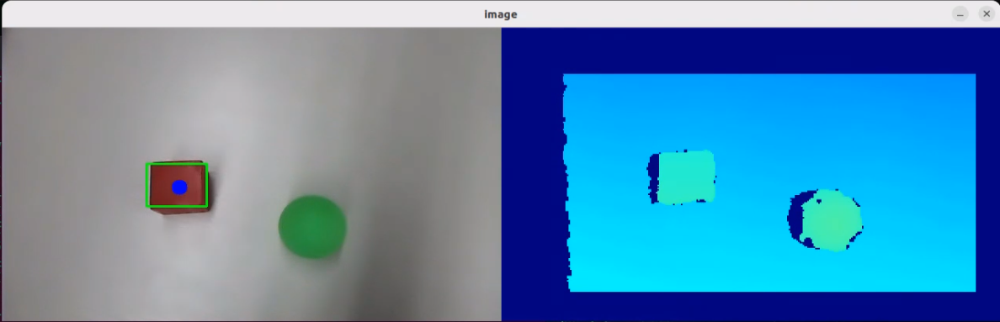

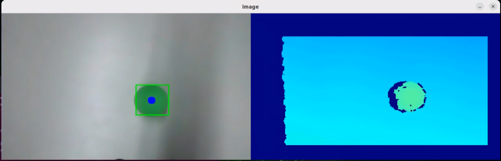

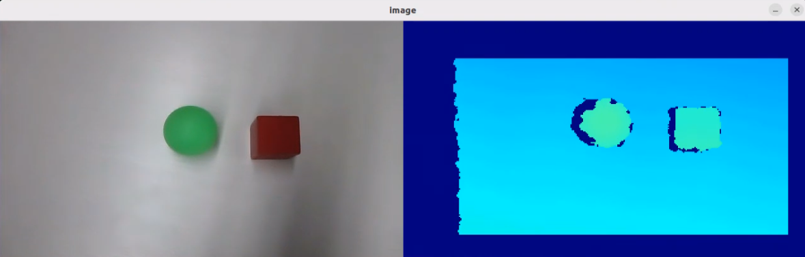

* **Program Brief Analysis**

(1) launch File Analysis

① Defining the launch_setup Function

{lineno-start=10}

```
def launch_setup(context):
    mode = LaunchConfiguration('mode', default=1)
    mode_arg = DeclareLaunchArgument('mode', default_value=mode)

    peripherals_package_path = get_package_share_directory('peripherals')
    sdk_package_path = get_package_share_directory('sdk')
    large_models_package_path = get_package_share_directory('large_models')

    # Immediately launch depth_camera_launch (立即启动 depth_camera_launch)
    depth_camera_launch = IncludeLaunchDescription(
        PythonLaunchDescriptionSource(
            os.path.join(peripherals_package_path, 'launch/depth_camera.launch.py')),
    )

    # Launch sdk_launch, large_models_launch, object_transport_node, and vllm_object_transport_node after 5 seconds (在5秒后启动 sdk_launch、large_models_launch、object_transport_node 和 vllm_object_transport_node)
    delayed_launch = TimerAction(
        period=5.0,  # Delay time of 5 seconds (延迟时间为5秒)
        actions=[
            IncludeLaunchDescription(
                PythonLaunchDescriptionSource(
                    os.path.join(sdk_package_path, 'launch/armpi_ultra.launch.py')),
            ),
            IncludeLaunchDescription(
                PythonLaunchDescriptionSource(
                    os.path.join(large_models_package_path, 'launch/start.launch.py')),
                launch_arguments={'mode': mode}.items(),
            ),
            Node(
                package='large_models',
                executable='object_transport',
                output='screen',
            ),
            Node(
                package='large_models',
                executable='vllm_object_transport',
                output='screen',
            ),
        ]
    )

    return [mode_arg,
            depth_camera_launch,  # Immediate launch (立即启动)
            delayed_launch,        # Launch other components after 5 seconds (5秒后启动其他部分)
            ]
```

Starts the depth camera by loading the peripherals package's **launch/depth_camera.launch.py** file. This launches the depth camera node, providing RGB images and depth data as the foundational visual input for object recognition and localization. Delays the startup of the core services and transporting node by setting a 5-second TimerAction. This ensures that the depth camera has completed initialization and is outputting stable data before launching the dependent core components. Then loads the sdk package's **launch/armpi_ultra.launch.py** file to start the ArmPi Ultra's low-level control services, such as servo drivers and kinematics computation, providing hardware support for object grasping and manipulation tasks. After that, loads the large_models package's **launch/start.launch.py** file to start the large model service, passing the mode parameter to control its operating mode, such as different object recognition logic or transport decision strategies. Launches the object_transport executable in the large_models package as the core node for object transportation, responsible for executing the specific transport logic, such as path planning and grasp control. Launches the vllm_object_transport executable in the large_models package, serving as the bridge between the large model and the transport logic. It leverages visual data and large model capabilities to enable intelligent decision-making, such as identifying target objects and determining transport destinations, with logs output to the screen.

② generate_launch_description Function 

{lineno-start=55}

```
def generate_launch_description():
    return LaunchDescription([
        OpaqueFunction(function=launch_setup)
    ])
```

Creates and returns a LaunchDescription object, calling launch_setup via OpaqueFunction as the standard entry point for the ROS 2 launch file.

③ Main Function 

{lineno-start=60}

```
if __name__ == '__main__':
    # Create a LaunchDescription object (创建一个LaunchDescription对象)
    ld = generate_launch_description()

    ls = LaunchService()
    ls.include_launch_description(ld)
    ls.run()
```

Creates a LaunchDescription object and a LaunchService service. The launch description is added to the service and executed, enabling the startup of the entire system manually.

(2) Python File Analysis

① Import the Necessary Libraries

{lineno-start=5}

```
import cv2
import math
import json
import time
import queue
import rclpy
import threading
import numpy as np
from rclpy.node import Node
from std_msgs.msg import String, Float32, Bool
from std_srvs.srv import Trigger, SetBool, Empty
from rclpy.executors import MultiThreadedExecutor
from rclpy.callback_groups import ReentrantCallbackGroup

from speech import speech
from large_models.config import *
from large_models_msgs.srv import SetString, SetModel, SetBox, SetContent
```

**speech**: module related to large model voice interaction.

**large_models_msgs.srv**: custom service types for large models.

**large_models.config**: configuration file for large models.

② PROMPT String

{lineno-start=118}

```
##Requirements and Restrictions
1. According to the input content, find the corresponding instructions in the function library and output the corresponding instructions.
2. Multiple actions need to be put in a list
3. Transportation is divided into two stages: picking up and putting down
4. Directly output data in json format, do not analyze, and do not output redundant content.
5. When restoring, if there is a move action in the instruction, then the move instruction needs to be returned, otherwise it returns ""
6. Format: {"action": "xx"}
```

Defines prompt string (PROMPT) used to guide how user commands and image data are processed. It specifies the recognition task logic and expected output format.

③ VLLMObjectTransport Class 

{lineno-start=210}

```
class VLLMObjectTransport(Node):
    def __init__(self, name):
        rclpy.init()
        super().__init__(name)
        self.llm_result = ''
        # self.vllm_result = '''json{"object":"香蕉","xyxy":[243, 441, 842, 552], "response": "香蕉"}'''
        self.running = True
        self.transport_finished = True
        self.lock = threading.RLock()
        self.client = speech.OpenAIAPI(api_key, base_url)
        self.language = os.environ["ASR_LANGUAGE"]
        self.tts_text_pub = self.create_publisher(String, 'tts_node/tts_text', 1)
        self.asr_pub = self.create_publisher(String, '/vocal_detect/asr_result', 1)
        self.create_subscription(String, 'agent_process/result', self.llm_result_callback, 1)
        self.create_subscription(Bool, 'object_transport/transport_finished', self.transport_finished_callback, 1)

        self.awake_client = self.create_client(SetBool, 'vocal_detect/enable_wakeup')
        self.awake_client.wait_for_service()
        self.set_model_client = self.create_client(SetModel, 'agent_process/set_model')
        self.set_model_client.wait_for_service()
        self.set_prompt_client = self.create_client(SetString, 'agent_process/set_prompt')
        self.set_prompt_client.wait_for_service()
        self.set_vllm_content_client = self.create_client(SetContent, 'agent_process/set_vllm_content')
        self.set_vllm_content_client.wait_for_service()
       
        self.record_chat_client = self.create_client(SetBool, 'agent_process/record_chat')
        self.record_chat_client.wait_for_service()
        self.get_chat_client = self.create_client(Trigger, 'agent_process/get_chat')
        self.get_chat_client.wait_for_service()
        self.clear_chat_client = self.create_client(Empty, 'agent_process/clear_chat')
        self.clear_chat_client.wait_for_service()

        self.enter_client = self.create_client(Trigger, 'object_transport/enter')
        self.enter_client.wait_for_service()

        self.start_client = self.create_client(SetBool, 'object_transport/enable_transport')
        self.start_client.wait_for_service()

        self.set_pick_client = self.create_client(SetBox, 'object_transport/set_pick_position')
        self.set_pick_client.wait_for_service()
        self.set_place_client = self.create_client(SetBox, 'object_transport/set_place_position')
        self.set_place_client.wait_for_service()
        self.record_position_client = self.create_client(SetBox, 'object_transport/record_position')
        self.record_position_client.wait_for_service()

        timer_cb_group = ReentrantCallbackGroup()
        self.timer = self.create_timer(0.0, self.init_process, callback_group=timer_cb_group)

```

Initializes the node, sets up state variables such as the action list and transporting status, configures ROS communication components, including publishers, subscribers, and service clients, and starts the initialization timer.

④ get_node_state Method 

{lineno-start=258}

```
    def get_node_state(self, request, response):
        return response
```

Service callback that returns the node status, used for confirming initialization completion.

⑤ init_process Method 

{lineno-start=261}

```
    def init_process(self):
        self.timer.cancel()

        msg = SetModel.Request()
        msg.model_type = 'llm'
        msg.model = llm_model
        msg.api_key = api_key
        msg.base_url = base_url
        self.send_request(self.set_model_client, msg)

        msg = SetString.Request()
        msg.data = LLM_PROMPT
        self.send_request(self.set_prompt_client, msg)
        
        msg = Empty.Request()
        self.send_request(self.clear_chat_client, msg)

        init_finish = self.create_client(Empty, 'object_transport/init_finish')
        init_finish.wait_for_service()
        self.send_request(self.enter_client, Trigger.Request())
        speech.play_audio(start_audio_path)
        threading.Thread(target=self.process, daemon=True).start()
        self.create_service(Empty, '~/init_finish', self.get_node_state)
        self.get_logger().info('\033[1;32m%s\033[0m' % 'start')
        self.get_logger().info('\033[1;32m%s\033[0m' % LLM_PROMPT)
```

Handles the node initialization workflow, configures LLM parameters and prompts, clears chat history, starts the processing thread, plays the startup audio, and outputs the initialization log.

⑥ send_request Method 

{lineno-start=287}

```
    def send_request(self, client, msg):
        future = client.call_async(msg)
        while rclpy.ok():
            if future.done() and future.result():
                return future.result()
```

A general-purpose service call utility that sends a service request and blocks until a response is received, ensuring service communication is completed.

⑦ llm_result_callback Method 

{lineno-start=293}

```
    def llm_result_callback(self, msg):
        self.llm_result = msg.data
```

Subscribes to the LLM output results and saves them to the llm_result variable for subsequent processing.

⑧ remember_position Method 

{lineno-start=296}

```
    def remember_position(self):
        msg = SetContent.Request()
        if self.language == 'Chinese':
            msg.api_key = stepfun_api_key
            msg.base_url = stepfun_base_url
            msg.model = stepfun_vllm_model
        else:
            msg.api_key = vllm_api_key
            msg.base_url = vllm_base_url
            msg.model = vllm_model
        msg.prompt = VLLM_PROMPT2 
        vllm_result = self.send_request(self.set_vllm_content_client, msg)
        self.get_logger().info(f'vllm_result: {vllm_result}')
        message = vllm_result.message
        if message.startswith("```") and message.endswith("```"):
            message = message.strip("```").replace("json\n", "").strip()
        initial_position = json.loads(message)
        
        # self.get_logger().info(f'initial_position: {initial_position}')
        for i in initial_position:
            msg = SetBox.Request()
            msg.label = i
            xyxy = initial_position[i]
            msg.box = self.client.data_process(xyxy, 640, 400)
            self.send_request(self.record_position_client, msg)
        msg = SetBool.Request()
        msg.data = True
        self.send_request(self.start_client, msg)

        msg = SetBool.Request()
        msg.data = True
        self.send_request(self.record_chat_client, msg)
```

Uses the visual LLM with VLLM_PROMPT2 to identify the initial positions of objects in the image, parses the results, records them in the object transport node, and initiates the position recording process.

⑨ recovery Method 

{lineno-start=329}

```
    def recovery(self, text):
        if not text:
            msg = Trigger.Request()
            res = self.send_request(self.get_chat_client, msg)
            # self.get_logger().info(str(res.message)) 
            text = res.message.rsplit(",", 1)[0] if "," in res.message else res.message
            msg = SetBool.Request()
            msg.data = False
            self.send_request(self.record_chat_client, msg)
            msg = Empty.Request()
            self.send_request(self.clear_chat_client, msg)
        msg = String()
        if self.language == 'Chinese':
            msg.data = '{}, 只需要放回去的步骤'.format(text)
        else:
            msg.data = '{}, only the steps for putting it back'.format(text)
        self.get_logger().info('\033[1;32m%s\033[0m' % msg.data)
        self.asr_pub.publish(msg)
```

Handles the "**restore**" command by querying the LLM for the necessary recovery action steps, publishes the instructions to the ASR results topic, and triggers the subsequent recovery workflow.

⑩ object_restore Method

{lineno-start=348}

```
    def object_restore(self, query): 
        msg = SetContent.Request()
        if self.language == 'Chinese':
            msg.api_key = stepfun_api_key
            msg.base_url = stepfun_base_url
            msg.model = stepfun_vllm_model
        else:
            msg.api_key = vllm_api_key
            msg.base_url = vllm_base_url
            msg.model = vllm_model
        msg.prompt = VLLM_PROMPT1
        msg.query = query
        vllm_result = self.send_request(self.set_vllm_content_client, msg)
        self.get_logger().info(f'vllm_result: {vllm_result}')
        message = vllm_result.message
        if message.startswith("```") and message.endswith("```"):
            message = message.strip("```").replace("json\n", "").strip()
        position = json.loads(message)
        
        msg = SetBox.Request()
        msg.label = position['pick']['object']
        xyxy = position['pick']['xyxy']
        if self.language == 'Chinese':
            msg.box = self.client.data_process(xyxy, 640, 400)
        else:
            msg.box = [int(xyxy[0] * 640), int(xyxy[1] * 400), int(xyxy[2] * 640), int(xyxy[3] * 400)]
        self.send_request(self.set_pick_client, msg)
        msg = SetBox.Request()
        msg.label = position['pick']['object']
        self.send_request(self.set_place_client, msg)
        # self.get_logger().info(f'msg: {msg}')

        # Enable sorting. 开启分拣
        msg = SetBool.Request()
        msg.data = True
        self.send_request(self.start_client, msg)
        self.transport_finished = False
       
        msg = Empty.Request()
        self.send_request(self.clear_chat_client, msg)

        msg = String()
        msg.data = position['response']
        self.tts_text_pub.publish(msg)
```

Handles the "**Return to initial position**" command by using the visual LLM with VLLM_PROMPT1 to determine the target object positions, sets the pick-and-place parameters, and initiates object transport.

⑪ get_object_position Method 

{lineno-start=393}

```
    def get_object_position(self, query, offset=None):
        msg = SetContent.Request()
        if self.language == 'Chinese':
            msg.api_key = stepfun_api_key
            msg.base_url = stepfun_base_url
            msg.model = stepfun_vllm_model
        else:
            msg.api_key = vllm_api_key
            msg.base_url = vllm_base_url
            msg.model = vllm_model
        msg.prompt = VLLM_PROMPT1
        msg.query = query
        vllm_result = self.send_request(self.set_vllm_content_client, msg)
        self.get_logger().info(f'vllm_result: {vllm_result}')
        message = vllm_result.message
        if message.startswith("```") and message.endswith("```"):
            message = message.strip("```").replace("json\n", "").strip()
        position = json.loads(message)
        # self.get_logger().info(f'position: {position}') 

        # msg.label = label
        xyxy = position['pick']['xyxy']
        # self.get_logger().info(f'pick xyxy: {xyxy}')
        if xyxy:
            msg = SetBox.Request()
            msg.box = self.client.data_process(xyxy, 640, 400)
            # msg.box = position['pick']['xyxy']
            self.send_request(self.set_pick_client, msg)
        xyxy = position['place']['xyxy']
        # self.get_logger().info(f'place xyxy: {xyxy}')
        if xyxy:
            msg = SetBox.Request()
            # msg.label = label
            if self.language == 'Chinese':
                msg.box = self.client.data_process(xyxy, 640, 400)
            else:
                msg.box = [int(xyxy[0] * 640), int(xyxy[1] * 400), int(xyxy[2] * 640), int(xyxy[3] * 400)]
            msg.offset = offset
            self.send_request(self.set_place_client, msg)

        # Enable sorting. 开启分拣
        msg = SetBool.Request()
        msg.data = True
        self.send_request(self.start_client, msg)
        self.transport_finished = False

        msg = String()
        msg.data = position['response']
        self.tts_text_pub.publish(msg)
```

Based on user queries and offsets, calls the visual LLM with VLLM_PROMPT1 to obtain the object's pick-and-place positions, sets them in the transport node, and starts the transport workflow.

⑫ transport_finished_callback Method

{lineno-start=443}

```
    def transport_finished_callback(self, msg):
        self.transport_finished = msg.data
```

Subscribes to the object transport completion signal and updates the transport_finished status to synchronize action execution.

⑬ process Method 

{lineno-start=446}

```
    def process(self):
        action_list = []
        action_finish = False
        while self.running:
            if self.llm_result:
                try:
                    self.get_logger().info(f'llm_result: {self.llm_result}')
                    if 'action' in self.llm_result: # If a corresponding action is returned, extract and process it (如果有对应的行为返回那么就提取处理)
                        if self.llm_result.startswith("```") and self.llm_result.endswith("```"):
                            self.llm_result = self.llm_result.strip("```").replace("json\n", "").strip()
                        action_list = json.loads(self.llm_result)['action']
                        action_finish = False
                    else:
                        action_finish = True
                except BaseException as e:
                    print(e)
                self.llm_result = ''
            else:
                if action_list:
                    # self.get_logger().info(f'{self.transport_finished}')
                    if self.transport_finished:
                        action = action_list[0]
                        if 'remember' in action:     # Remember (记住)
                            self.remember_position()
                        elif 'recovery' in action:   #  Recovery (恢复)
                            self.recovery(action[0])
                        elif 'pick' in action:       # Pick (抓取)
                            self.get_object_position(action[0])
                        elif 'place' in action:      # Place (放置)
                            self.get_object_position(action[0], action[-1])
                        elif 'pick_and_place' in action:   # Place on a target (放置在某个上面)
                            self.get_object_position(action[0], action[-1])
                        elif 'restore' in action:        # Restore (还原某一个)
                            self.object_restore(action[0])
                        del action_list[0]
                        if not action_list:
                            action_finish = True
                    else:
                        time.sleep(0.1)
                else:
                    time.sleep(0.02)
            if action_finish:
                action_finish = False
                msg = SetBool.Request()
                msg.data = True
                self.send_request(self.awake_client, msg)
        rclpy.shutdown()
```

The main processing loop parses the action list returned by the LLM such as remembering positions, recovery, picking, placing, etc., sequentially calls the corresponding functions such as remember_position and recovery, and re-enables the wake-up feature after completion.

⑭ main Function 

{lineno-start=494}

```
def main():
    node = VLLMObjectTransport('vllm_object_transport')
    executor = MultiThreadedExecutor()
    executor.add_node(node)
    executor.spin()
    node.destroy_node()
```

The entry point of the node. It creates an VLLMObjectTransport instance, starts a multithreaded executor to handle callbacks, runs the node, and cleans up resources.

### 11.3.5 Smart Home Assistant

The large model used in this lesson operates online, requiring a stable network connection for the main controller in use. For better stability, it is recommended to use a wired network connection.

* **Overview**

When the program starts, the AI voice box announces "**I'm ready**."

Then, you can say the wake word "**Hello Hiwonder**" to activate the AI voice box, which will respond with "**I'm here**." Once activated, you can control the ArmPi Ultra using voice commands. For example, you can say "**Please bring me the ketchup**." Upon receiving a command, the terminal displays the recognized speech content. The voice device then verbally responds with a generated answer and the robot simultaneously executes the corresponding action.

* **Preparation**

(1) Confirm WonderEcho Pro Firmware

The default wake word for WonderEcho Pro is "**Hello Hiwonder**." If you wish to change the wake-up word to "**Xiaohuan Xiaohuan**," please refer to the directory: [10. Voice Control Course ->10.2 Firmware Flashing](https://wiki.hiwonder.com/projects/ArmPi-Ultra/en/latest/docs/10.Voice_Control_Course.html#firmware-flashing)

If you have previously flashed a different firmware, such as the one using the wake word "**Xiaohuan Xiaohuan**," you must use the corresponding wake word.

The examples in this course will assume the default factory wake word: "**Hello Hiwonder**."

(2) Configuring the Large Model API-KEY

By default, the program does not include the configuration of the Large Model-related API keys. Before activating features related to the Large AI Model, please refer to the section [11.2.1 Obtain and Configure the Large Model API Key](https://wiki.hiwonder.com/projects/ArmPi-Ultra/en/latest/docs/11.Large_AI_Model_Course.html#obtain-and-configure-the-large-model-api-key) in this document to configure the necessary keys. This step is mandatory and cannot be skipped, as it is crucial for the proper functioning and experience of the large model features.

* **Network Configuration**

> [!NOTE]
>
> The large model used in this lesson is an online model, so network access is required before getting started. Please prepare an Ethernet cable to connect the robot to the network, or switch the robot to LAN mode.

The robot must be connected to the Internet during this feature, either in STA (LAN) mode or AP (direct connection) mode via Ethernet. There are two methods available for configuring the network:

- To configure the network using the mobile app, you may refer to the tutorial under the directory:[1. ArmPi Ultra User Manual->1.4 App Control->1.4.2 Connection Modes Overview](https://wiki.hiwonder.com/projects/ArmPi-Ultra/en/latest/docs/1.ArmPi_Ultra_User_Manual.html#connection-modes-overview).

- Connect to the robot via VNC and modify the network configuration files as described in:[1. ArmPi Ultra User Manual->1.6 Development Environment Setup and Configuration->1.6.3 LAN Mode Connection](https://wiki.hiwonder.com/projects/ArmPi-Ultra/en/latest/docs/1.ArmPi_Ultra_User_Manual.html#lan-mode-connection).

* **Operations**

> [!NOTE]
>
> * Command input is case-sensitive and space-sensitive.
>
> * The robot must be connected to the Internet, either in STA (LAN) mode or AP (direct connection) mode via Ethernet.

1)  Double-click on  to launch the command bar, enter the command, and press **Enter** to disable the auto-start service.

2)  Enter the command to disable the auto-start service of the mobile app.

```
~/.stop_ros.sh
```

3)  Enter the following command and press **Enter** to launch the smart home assistant feature.

```
ros2 launch large_models vllm_dietitianl.launch.py
```

4)  When the command line shows the output as illustrated below and the AI voice box announces "**I'm ready**," it indicates that the box has completed initialization. At the same time, the YOLOv8 model is also initialized. You can now say the wake word "**Hello Hiwonder**."


5)  When the terminal displays the corresponding output shown in the figure and the device responds with "**I'm here**", it indicates successful activation. The system will begin recording your voice command.


6)  You can speak the command according to the prompts displayed by the program, for example, "**Give me the ketchup**".

7)  Upon successful recognition by the speech recognition service of cloud-based large speech model, the parsed command will be displayed under the publish_asr_result output in the terminal.


8)  Upon receiving user input, the terminal will display output indicating that the cloud-based large language model has been successfully invoked. The model will interpret the command, generate a language response, and execute a corresponding action based on the meaning of the command.

The response is automatically generated by the model. While the semantic content is accurate, the wording and structure may vary due to randomness in language generation.

9)  When the terminal shows the output shown in the figure indicating the end of one interaction cycle, the system is ready for the next round. To initiate another interaction, repeat step 4 by speaking the wake words again.


10) To exit the feature, press **Ctrl + C** in the terminal. If the feature does not exit immediately, press **Ctrl + C** multiple times.

* **Project Outcome**

Once the feature is started, you can phrase your own commands. For example, saying "**Please bring me the ketchup**" will prompt the ArmPi Ultra robotic arm to automatically identify objects within its field of view, highlight the ketchup in the camera feed, and place it in the designated location according to your instructions.


* **Program Brief Analysis**

(1) launch File Analysis

① Defining the launch_setup Function

{lineno-start=10}

```
def launch_setup(context):
    mode = LaunchConfiguration('mode', default=1)
    mode_arg = DeclareLaunchArgument('mode', default_value=mode)

    peripherals_package_path = get_package_share_directory('peripherals')
    sdk_package_path = get_package_share_directory('sdk')
    large_models_package_path = get_package_share_directory('large_models')

    # Immediately start depth_camera_launch (立即启动 depth_camera_launch)
    depth_camera_launch = IncludeLaunchDescription(
        PythonLaunchDescriptionSource(
            os.path.join(peripherals_package_path, 'launch/depth_camera.launch.py')),
    )

    control_launch = IncludeLaunchDescription(
        PythonLaunchDescriptionSource(
            os.path.join(sdk_package_path, 'launch/armpi_ultra.launch.py')),
    )

    # Launch sdk_launch, large_models_launch, intelligent_grasp_node, and vllm_dietitianl_node after 5 seconds (在5秒后启动 sdk_launch、large_models_launch、intelligent_grasp_node 和 vllm_dietitianl_node)
    delayed_launch = TimerAction(
        period=5.0,  # Delay time of 5 seconds (延迟时间为5秒)
        actions=[            
            IncludeLaunchDescription(
                PythonLaunchDescriptionSource(
                    os.path.join(large_models_package_path, 'launch/start.launch.py')),
                launch_arguments={'mode': mode}.items(),
            ),
            Node(
                package='large_models',
                executable='intelligent_grasp',
                output='screen',
            ),
            Node(
                package='large_models',
                executable='vllm_dietitianl',
                output='screen',
            ),
        ]
    )

    return [mode_arg,
            depth_camera_launch,  # Immediately start (立即启动)
            control_launch,
            delayed_launch,        # Launch other parts after 5 seconds (5秒后启动其他部分)
            ]
```

Starts the depth camera by loading the peripherals package's **launch/depth_camera.launch.py** file. This launches the depth camera node, providing RGB images and depth data as the foundational visual input for object recognition, positioning, and nutritional analysis. Delays the startup of the core services and the feature's node by setting a 5-second TimerAction. This ensures that the depth camera has completed initialization and is outputting stable data before launching the dependent core components. Then loads the sdk package's **launch/armpi_ultra.launch.py** file to start the ArmPi Ultra's low-level control services, such as servo drivers and kinematics computation, providing hardware support for intelligent grasping actions. After that, loads the large_models package's **launch/start.launch.py** file to start the large model service, passing the mode parameter to control its operation, such as different grasping decision logic or nutrition analysis precision. Launches the intelligent_grasp executable in the large_models package as the core node for intelligent grasping, responsible for executing vision-based precise grasping logic such as target localization and grasp pose planning. Launches the vllm_dietitian executable in the large_models package, which integrates visual data with large model capabilities to perform nutrition analysis of objects, such as identifying food items and analyzing calories or components, with logs output to the screen.

② generate_launch_description Function 

{lineno-start=57}

```
def generate_launch_description():
    return LaunchDescription([
        OpaqueFunction(function=launch_setup)
    ])
```

Creates and returns a LaunchDescription object, calling launch_setup via OpaqueFunction as the standard entry point for the ROS 2 launch file.

③ Main Function

{lineno-start=62}

```
if __name__ == '__main__':
    # Create a LaunchDescription object (创建一个LaunchDescription对象)
    ld = generate_launch_description()

    ls = LaunchService()
    ls.include_launch_description(ld)
    ls.run()
```

Creates a LaunchDescription object and a LaunchService service. The launch description is added to the service and executed, enabling the startup of the entire system manually.

(2) Python File Analysis

① Import the Necessary Libraries

{lineno-start=5}

```
import os
import cv2
import math
import json
import time
import queue
import rclpy
import threading
import numpy as np
from rclpy.node import Node
from std_msgs.msg import String, Float32, Bool
from std_srvs.srv import Trigger, SetBool, Empty
from rclpy.executors import MultiThreadedExecutor
from rclpy.callback_groups import ReentrantCallbackGroup

from speech import speech
from large_models.config import *
from large_models_msgs.srv import SetString, SetModel, SetBox
```

**speech:** module related to large model voice interaction.

**large_models_msgs.srv**: custom service types for large models.

**large_models.config**: configuration file for large models.

② PROMPT String

{lineno-start=44}

```
**Task:
1. Instruction Understanding
You will receive a sentence from the user.
→ Extract the object name based on the user's intent.
→ The object name must be in English.
→ You can only handle one object at a time.
→ Do not include any unmentioned objects.

2. Image Analysis
You will receive an image.
→ Find the bounding box (top-left and bottom-right pixel coordinates) for the object mentioned.
→ Coordinates should be normalized to [0, 1].
→ Focus on accurate detection and orientation.
```

③ VLLMDietitianl Class 

{lineno-start=73}

```
class VLLMDietitianl(Node):
    def __init__(self, name):
        rclpy.init()
        super().__init__(name)
        self.vllm_result = ''
        # self.vllm_result = '''json{"object":"香蕉","xyxy":[243, 441, 842, 552], "response": "香蕉"}'''
        self.running = True
        self.action_finish = False
        self.play_audio_finish = False
        self.lock = threading.RLock()
        self.language = os.environ["ASR_LANGUAGE"]
        self.client = speech.OpenAIAPI(api_key, base_url)
        
        timer_cb_group = ReentrantCallbackGroup()
        self.tts_text_pub = self.create_publisher(String, 'tts_node/tts_text', 1)
        self.create_subscription(String, 'agent_process/result', self.llm_result_callback, 1)
        self.create_subscription(Bool, 'tts_node/play_finish', self.play_audio_finish_callback, 1, callback_group=timer_cb_group)
        
        self.awake_client = self.create_client(SetBool, 'vocal_detect/enable_wakeup')
        self.awake_client.wait_for_service()
        self.set_model_client = self.create_client(SetModel, 'agent_process/set_model')
        self.set_model_client.wait_for_service()
        self.set_prompt_client = self.create_client(SetString, 'agent_process/set_prompt')
        self.set_prompt_client.wait_for_service()
        
        self.enter_client = self.create_client(Trigger, 'intelligent_grasp/enter')
        self.enter_client.wait_for_service()

        self.start_client = self.create_client(SetBool, 'intelligent_grasp/enable_transport')
        self.start_client.wait_for_service()

        self.set_target_client = self.create_client(SetBox, 'intelligent_grasp/set_target')
        self.set_target_client.wait_for_service()

        self.timer = self.create_timer(0.0, self.init_process, callback_group=timer_cb_group)
```

Initializes the node, configures state variables such as large model results and action completion flags, sets up ROS communication components including publishers, subscribers, and service clients, and starts the initialization timer.

④ get_node_state Method 

{lineno-start=109}

```
    def get_node_state(self, request, response):
        return response
```

Service callback that returns the node status, used for confirming initialization completion.

⑤ init_process Method 

{lineno-start=112}

```
    def init_process(self):
        self.timer.cancel()

        msg = SetModel.Request()
        msg.model_type = 'vllm'
        if self.language == 'Chinese':
            msg.model = stepfun_vllm_model
            msg.api_key = stepfun_api_key
            msg.base_url = stepfun_base_url
        else:
            msg.model = vllm_model
            msg.api_key = vllm_api_key
            msg.base_url = vllm_base_url
        self.send_request(self.set_model_client, msg)

        msg = SetString.Request()
        msg.data = PROMPT
        self.send_request(self.set_prompt_client, msg)        
        
        # init_finish = self.create_client(Empty, 'intelligent_grasp/init_finish')
        # init_finish.wait_for_service()        
        self.send_request(self.enter_client, Trigger.Request())
        speech.play_audio(start_audio_path)
        threading.Thread(target=self.process, daemon=True).start()
        self.create_service(Empty, '~/init_finish', self.get_node_state)
        self.get_logger().info('\033[1;32m%s\033[0m' % 'start')
        self.get_logger().info('\033[1;32m%s\033[0m' % PROMPT)
```

Node initialization process that configures large model parameters by selecting models and API keys according to the language environment, sets prompts, sends a request to enter the intelligent grasping service, plays startup audio, launches the main processing thread, and outputs initialization logs.

⑥ send_request Method 

{lineno-start=140}

```
    def send_request(self, client, msg):
        future = client.call_async(msg)
        while rclpy.ok():
            if future.done() and future.result():
                return future.result()
```

General service call utility that sends a service request and blocks until a response is received, ensuring service communication is complete, such as configuring the large model or controlling grasping.

⑦ llm_result_callback Method 

{lineno-start=146}

```
    def llm_result_callback(self, msg):
        self.vllm_result = msg.data
```

Subscriber callback for large model results, receiving object information including name, coordinates, and responses, and saving it to vllm_result for processing.

⑧ play_audio_finish_callback Method 

{lineno-start=149}

```
    def play_audio_finish_callback(self, msg):
        self.play_audio_finish = msg.data
```

Subscriber callback for TTS playback completion signals, updating audio playback status to synchronize action execution with voice feedback.

⑨ process Method 

{lineno-start=152}

```
    def process(self):
        while self.running:
            if self.vllm_result:
                try:
                    if self.vllm_result.startswith("```") and self.vllm_result.endswith("```"):
                        self.vllm_result = self.vllm_result.strip("```").replace("json\n", "").strip()
                    self.vllm_result = json.loads(self.vllm_result)
                    box = self.vllm_result['xyxy']
                    box = self.client.data_process(box, 640, 400)
                    label = self.vllm_result['object']
                    response = self.vllm_result['response']
                    self.get_logger().info(f'label: {label} box: {box}')

                    msg = SetBox.Request()
                    msg.label = label
                    msg.box = box
                    self.send_request(self.set_target_client, msg)
                    # Enable sorting. 开启分拣
                    msg = SetBool.Request()
                    msg.data = True
                    self.send_request(self.start_client, msg)
                    time.sleep(2)
                    msg = String()
                    msg.data = response
                    self.tts_text_pub.publish(msg)
                except BaseException as e:
                    msg = String()
                    msg.data = self.vllm_result
                    self.tts_text_pub.publish(msg)
                    self.get_logger().info(f'error: {e}')
                self.action_finish = True
                self.vllm_result = ''
            else:
                time.sleep(0.01)
            if self.play_audio_finish and self.action_finish:
                self.play_audio_finish = False
                self.action_finish = False
                msg = SetBool.Request()
                msg.data = True
                self.send_request(self.awake_client, msg)
        rclpy.shutdown()
```

Main processing loop that parses large model results, extracts object names and coordinates, sets grasp targets, and initiates intelligent grasping. Publishes TTS responses and, upon completion, re-enables the wake-up function to await the next command.

⑩ main Function 

{lineno-start=}

```
def main():
    node = VLLMDietitianl('vllm_dietitianl')
    executor = MultiThreadedExecutor()
    executor.add_node(node)
    executor.spin()
    node.destroy_node()
```

Node entry point that creates an instance of VLLMDietitianl, starts a multithreaded executor to handle callbacks, runs the node, and cleans up resources.