# 12. ArmPi Ultra with Conveyor Belt

## 12.1 Conveyor Belt Installation

1)  Remove the plastic part near the motor end.


2)  Use M4\*10 pan head screws and M4 nuts to secure the acrylic plate onto the conveyor belt, then reattach the plastic part.

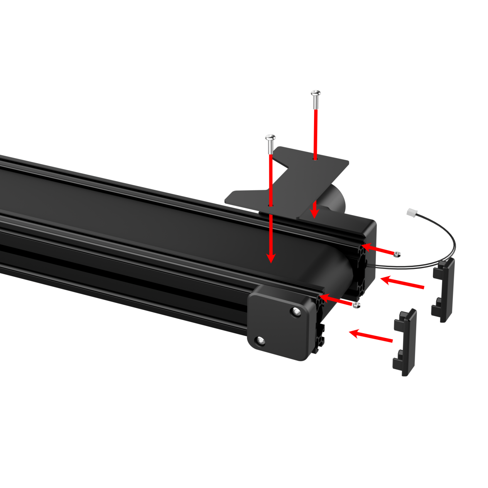

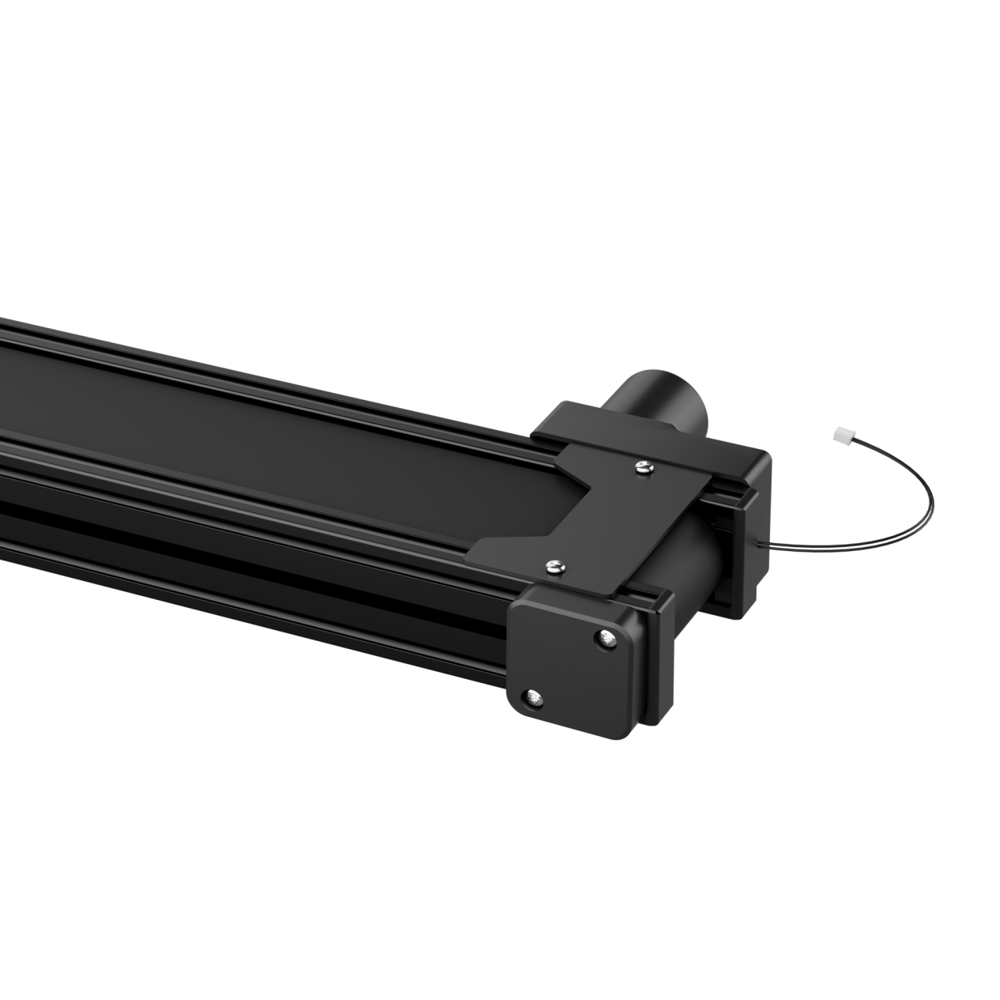

3)  Place the conveyor belt on the left side of the robot arm, connect the motor cable to Motor Port 1 on the STM32 controller, and connect the I2C communication cable to Port 2.

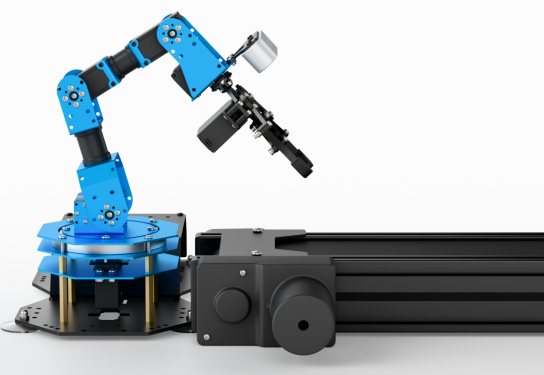


## 12.2 electing the Robot Type

ArmPi Ultra’s expansion accessories come in three types: Mecanum chassis, sliding rail, and conveyor belt. After installation, you must switch the device version according to the installed accessory for proper operation.

> [!NOTE]
>
> **Note:** If you don’t switch or select the wrong version, the motor may run unpredictably, causing malfunctions or even damaging the device.

Step-by-step instructions:

1)  Start the robotic arm, and access the robot system desktop using VNC. To get detailed instructions on remote control software connection, please refer to the tutorials saved in the section **[1.ArmPi Ultra User Manual-> 1.6 Development Environment Setup and Configuration]()** in the ArmPi Ultra User Manual.

2)  Double-click the model configuration tool on the desktop. 

3)  Select the appropriate options based on the camera version and accessory type:


**Mecanum** refers to the Mecanum chassis. **Slide_Rails** refers to the sliding rail. **Conveyor_Belt** refers to the conveyor belt.

4.  After making your selection, click **Save** to save the configuration.


5.  Click **Apply** to reload the configuration.


Wait for the buzzer to beep once, which indicates the restart is complete and the new configuration is now active.

## 12.3 Wireless Controller

### 12.3.1 Preparation

1.  Before powering on the device, make sure the wireless controller receiver is properly inserted. This can be ignored if the receiver was pre-inserted at the factory.

2.  Pay attention to battery polarity when placing the batteries.


3.  Each time the robot is powered on, the APP auto-start service will launch which includes the wireless handle control service. If this service has not been closed, no additional actions are needed—simply connect and control.

4.  Since signals from wireless controller can interfere with each other, it is recommended not to use this function when multiple robots are in the same area, to avoid misconnection or unintended control.

5.  After turning on the wireless controller, if it does not connect to the robot within 30 seconds, or remains unused for 5 minutes after connection, it will enter sleep mode automatically. To wake up the wireless handle and exit sleep mode, press the “**START**” button.

### 12.3.2 Device Connection

1)  After the robot powers on, slide the wireless controller switch to the "**ON**" position. At this point, the red and green LED indicators on the wireless controller will start flashing simultaneously.

2)  Wait a few seconds for the robot and wireless controller to pair automatically. Once pairing is successful, the green LED will remain solid while the red LED turns off.


### 12.3.3 Control Modes

The wireless handle supports two control modes: Coordinate Mode and Single Servo Mode. After a successful connection, the default mode is Coordinate Mode.

- **Single Servo Mode:** In this mode, the wireless controller buttons can be used to control the forward and reverse rotation of individual servos on the robotic arm.

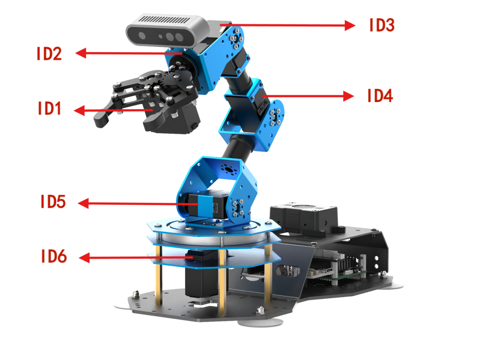

Button Functions in Single Servo Mode:

| **Button** | **Function (from the robotic arm’s first-person perspective)** |
|:--:|:--:|
| START | Reset the robotic arm |
| SELECT+START | Switch control mode (Single Servo / Coordinate) |
| UP / ↑ | Raise Servo 5 |
| DOWN / ↓ | Lower Servo 5 |
| LEFT / ← | Rotate Servo 6 to the left |
| RIGHT / → | Rotate Servo 6 to the right |
| Y | Lower Servo 4 |
| A | Raise Servo 4 |
| B | Rotate Servo 2 to the right (Gripper turns right) |
| X | Rotate Servo 2 to the left (Gripper turns left) |
| L1 | Open the gripper (Servo 1) |
| L2 | Close the gripper (Servo 1) |
| R1 | Raise Servo 3 |
| R2 | Lower Servo 3 |
| Left joystick left | Conveyor belt moves left |
| Left joystick right | Conveyor belt moves right |

- **Coordinate Mode:** In Coordinate Mode, the robotic arm moves as a whole along the X, Y, and Z axes and can also adjust its tilt angle based on button inputs.


Button Functions in Coordinate Mode:

| **Button** | **Function (from the robotic arm’s first-person perspective)** |
|:--:|:--:|
| START | Reset the robotic arm |
| SELECT+START | Switch control mode (Single Servo / Coordinate) |
| UP / ↑ | Move arm in the positive X direction (forward) |
| DOWN / ↓ | Move arm in the negative X direction (backward) |
| LEFT / ← | Move arm in the positive Y direction (left) |
| RIGHT / → | Move arm in the negative Y direction (right) |
| Y | Close the gripper (Servo 1) |
| A | Open the gripper (Servo 1) |
| B | Rotate Servo 2 to the right (Gripper turns right) |
| X | Rotate Servo 2 to the left (Gripper turns left) |
| L1 | Move arm upward along Z axis |
| L2 | Move arm downward along Z axis |
| R1 | Increase gripper pitch angle |
| R2 | Decrease gripper pitch angle |
| Left joystick left | Conveyor belt moves left |
| Left joystick right | Conveyor belt moves right |

Switching Between Modes: To switch between modes, press both SELECT and START buttons. A sound prompt indicates the switch was successful.

1.  Two beeps: Switched from Single Servo Mode to Coordinate Mode.

2.  One beep: Switched from Coordinate Mode to Single Servo Mode.

## 12.4 Color Sorting

### 12.4.1 Program Introduction

First, subscribe to the topic published by the color recognition node to obtain detected color information.

Then choose the target color. Once the target color is detected, obtain the center position of the target object in the image.

Use the object’s center position to guide the robotic arm for gripping and placing the color block into the corresponding area.

### 12.4.2 Operation Steps

1)  Start the robotic arm, and access the robot system desktop using VNC. To get detailed instructions on remote control software connection, please refer to the tutorials saved in the section **[1.ArmPi Ultra User Manual-> 1.6 Development Environment Setup and Configuration]()** in the ArmPi Ultra User Manual.

2)  Click the icon  to open the command-line terminal.

3)  Enter the following command and press **Enter** to stop the auto-start service:

    ```py
    ~/.stop_ros.sh
    ```

4)  Entering the following command to start the feature.

    ```py
    ros2 launch example color_sorting_motor.launch.py
    ```

5)  After the program starts successfully, click on the camera display window and press **A** to start sorting, then press **S** to stop sorting.

6)  To exit the feature, press **Ctrl+C** in the terminal. If the program does not close successfully, try pressing **Ctrl + C** again.

7)  If you want to experience the mobile app features again later, enter the command and press **Enter** to start the app service. Wait for the robotic arm to return to its initial position — a beep from the buzzer will indicate it's ready.

    ```py
    ros2 launch bringup bringup.launch.py
    ```

### 12.4.3 Project Outcome

After starting the program, place the color blocks within the robotic arm’s camera view. The returned image will highlight the recognized target color, and the robotic arm will sort the corresponding color blocks into their designated areas.

### 12.4.4 Program Brief Analysis

* **Launch File Analysis**

The launch file is located at:

**/home/ubuntu/ros2_ws/src/example/example/motor/color_sorting_motor.launch.py**

**1. launch_setup Function**

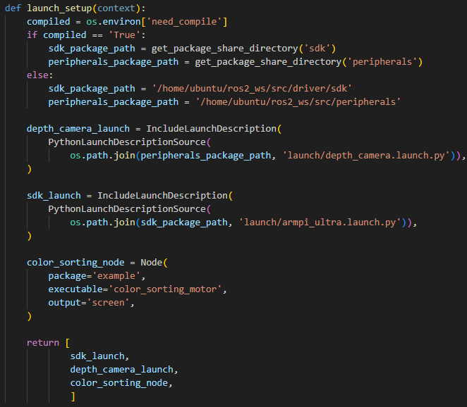

Loads the **launch/depth_camera.launch.py** file from the **peripherals** package to start the depth camera node, which provides RGB image and depth data, which is the visual input for color recognition. Loads the **launch/armpi_ultra.launch.py** file from the **SDK** package to start the underlying control services of the robotic arm, such as such as servo control and motion control, providing hardware support for the sorting operation. Launches the `color_sorting_motor` executable from the **example** package as the core logic node for color sorting. It uses visual data to control the robotic arm to perform color recognition and sorting actions, with logs output to the screen.

**2. generate_launch_description Function**


Creates and returns a `LaunchDescription` object, calling launch_setup via `OpaqueFunction` as the standard entry point for the ROS 2 launch file.

**3. Main Function**

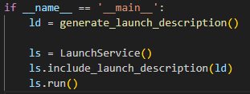

Creates a LaunchDescription object and a LaunchService service. The launch description is added to the service and executed, enabling the startup of the entire system manually.

* **Python File Analysis**

The Python file is located at:

**/home/ubuntu/ros2_ws/src/example/example/motor/color_sorting_motor.py**

**1. Import the Necessary Libraries**

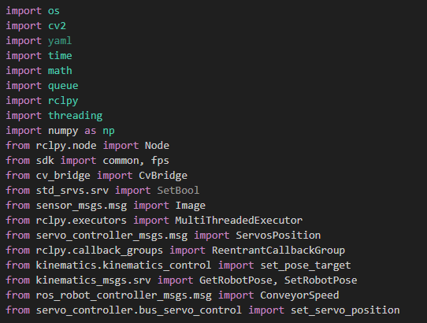

1.  **sdk**: A custom SDK that provides interfaces to specific hardware components or functional modules.

2.  **kinematics.kinematics_control.set_pose_target**: A custom function module used to set the robot's target pose.

3.  **kinematics_msgs.srv.GetRobotPose**: A service interface for retrieving the current pose of the robot.

4.  **kinematics_msgs.srv.SetRobotPose**: A service interface for setting the desired target pose of the robot.

5.  **servo_controller.bus_servo_control.set_servo_position**: A custom function used to control the position of servo motors.

**2. Initialization**

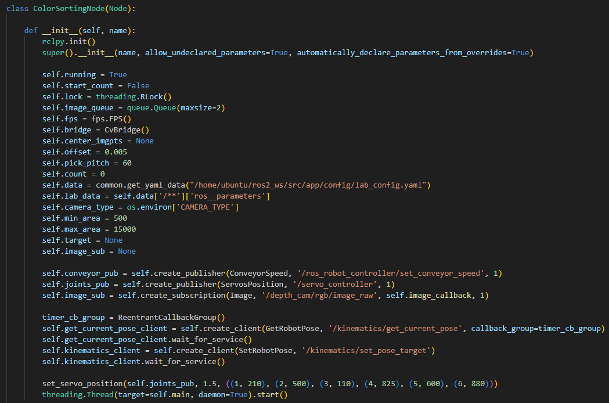

Initializes the color sorting node, configures runtime parameters such as queues and status flags, sets up ROS communication components including subscribers, publishers, and service clients, loads the color configuration file, sets the initial servo positions, and starts the main loop thread.

**3. send_request Method**

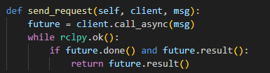

A general service call utility that sends service requests and blocks until the result is returned, ensuring the completion of services such as the robotic arm's kinematics and other communications.

**4. adaptive_threshold Method**

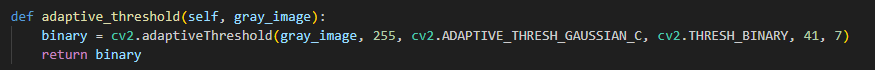

**5. canny_proc Method**

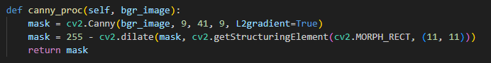

Uses the Canny edge detection algorithm to process the image, generating an edge mask. The mask is optimized through dilation to enhance the edges and extract the object contours.

**6. get_top_surface Method**

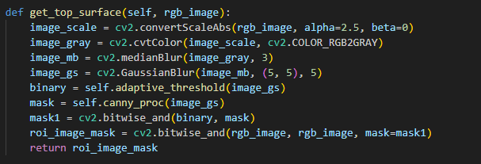

Preprocesses the RGB image through scaling, grayscale conversion, and blurring, and combines adaptive thresholding with edge detection to extract the top surface area of the object, enhancing target recognition.

**7. image_callback Method**

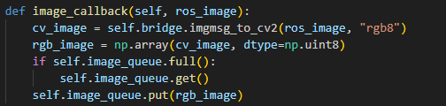

Image subscription callback function that converts ROS image message into an OpenCV formatted RGB image and stores it in the image queue, discarding the oldest image if the queue is full.

**8. image_processing Method**

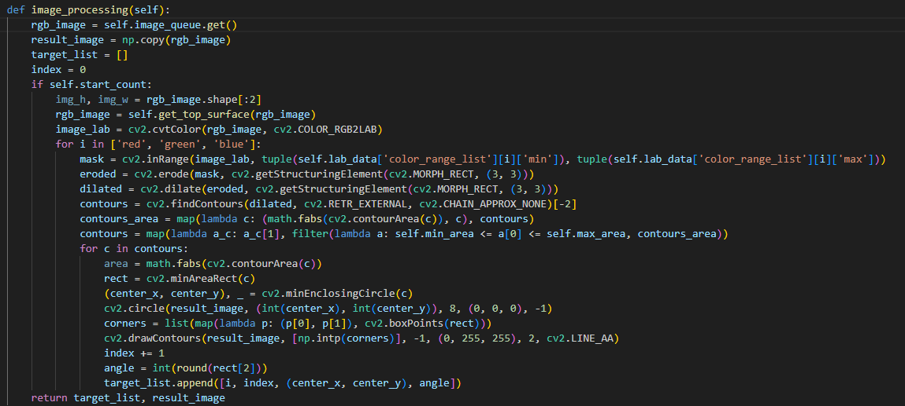

Fetches an image from the image queue and detects red, green, and blue objects in the LAB color space. It extracts contours, calculates the center coordinates and angles, and returns a list of target objects along with the processed image.

**9. move Method**

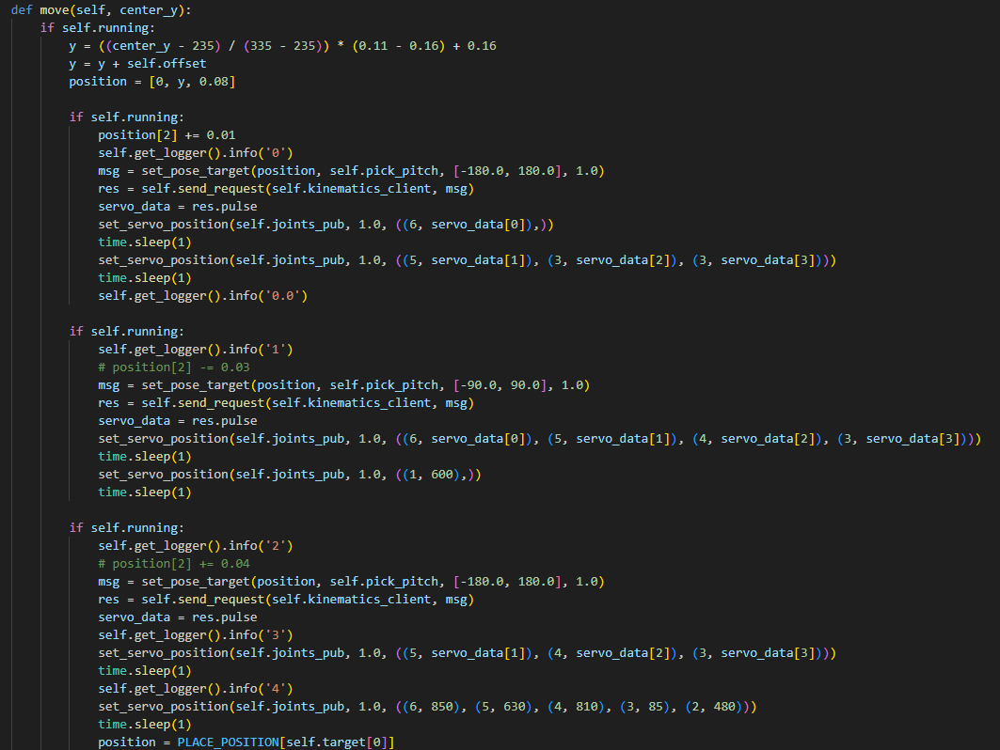

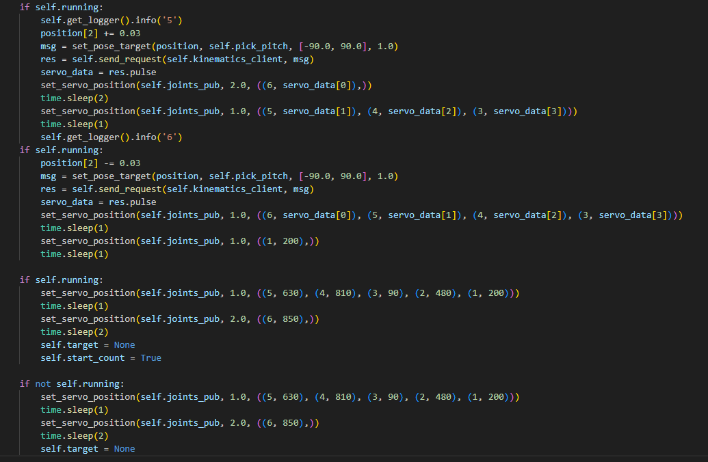

The robotic arm's grab and place logic. Based on the target object’s center coordinates, it calculates the grab position and controls the servos to execute the grab, move, and place actions. After completion, the arm is reset.

**10. main Method**

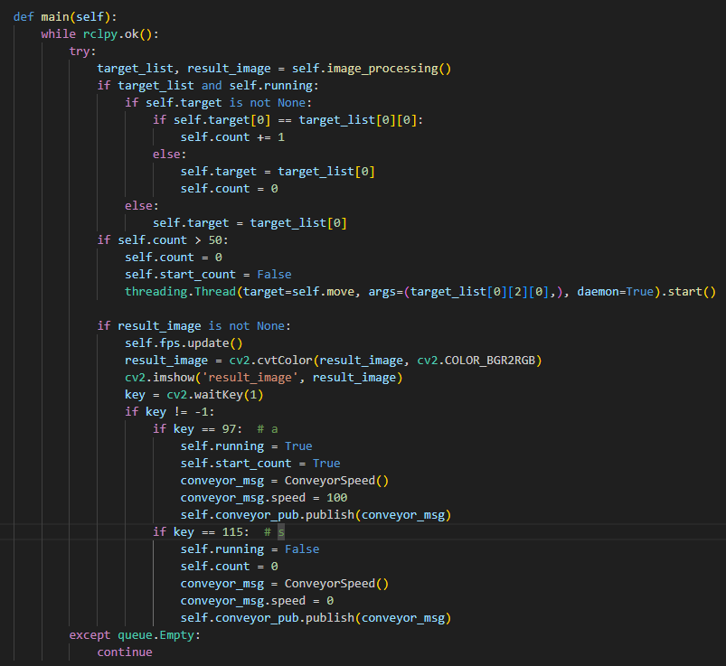

The main loop function continuously processes image recognition results. When the same object is detected enough times, it starts the grabbing thread. It also supports keyboard input to control the operational state, pressing **A** to start the conveyor belt, while pressing **S** to stop.

**11. Main Function**

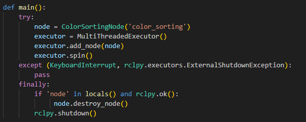

Node entry point that creates an instance of the color sorting node, starts a multi-threaded executor to handle callbacks, and captures interrupt signals to clean up resources by destroying the node and shutting down ROS.

### 12.4.5 Adjusting the Gripping Offset

Due to slight variations between different ArmPi Ultra robotic arms, the gripping position may be inaccurate. If there is a deviation in the gripping position, you can correct it by modifying the offset value in the source code file. The location of the Python file can be found in the program analysis section of the corresponding tutorial.

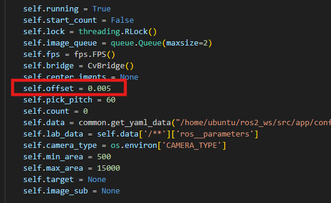

Increasing the offset value allows the arm to grip farther. Decreasing the value brings the grip position closer.
