# 13. ArmPi Ultra with Mecanum Chassis

## 13.1 Preparation

### 13.1.1 Wiring Instruction

Connect the four motors of the mecanum wheel chassis in the following order: M1: Front left wheel.

M2: Rear left wheel.

M3: Front right wheel.

M4: Rear right wheel.

Use a 4-pin cable to connect the 4-channel motor encoder driver module to the IIC port (port 2) on the expansion board. Use a 3-pin cable to connect the 4-channel motor encoder driver module to the 3-pin port (port 1) on the STM32 expansion board.

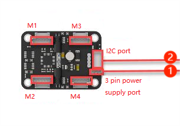

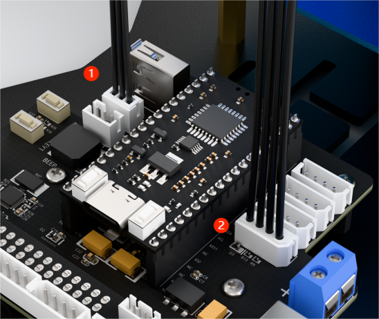

### 13.1.2 Chassis Installation

1)  Secure the 10 M4×6 round-head screws to fix the 10 M4×8 double-pass copper pillars.

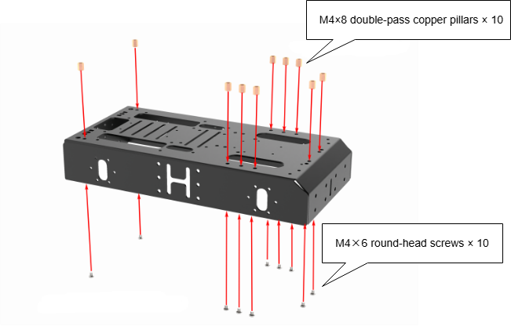

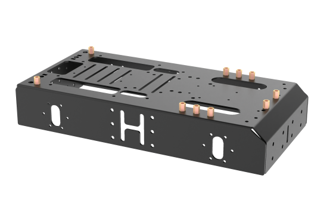

2)  Attach four M4×5+6 nylon standoffs to the Mecanum chassis, then mount the 4-channel encoder motor driver module onto the standoffs using four M4×6 round-head screws. Make sure the end with the I2C port is facing the right side of the chassis.

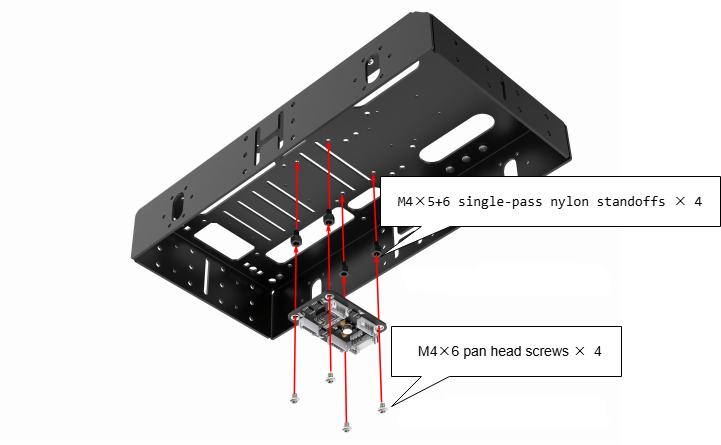

3)  Use M3×6 round-head mechanical screws to attach the four motors to the Mecanum chassis.

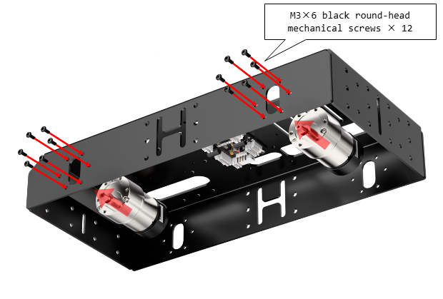

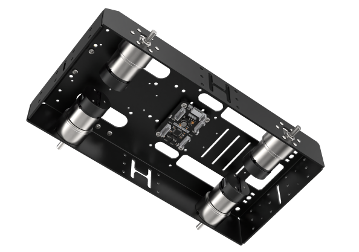

4)  Fix the four M4 hexagonal coupling to the motor using M4×6 hex socket screws.

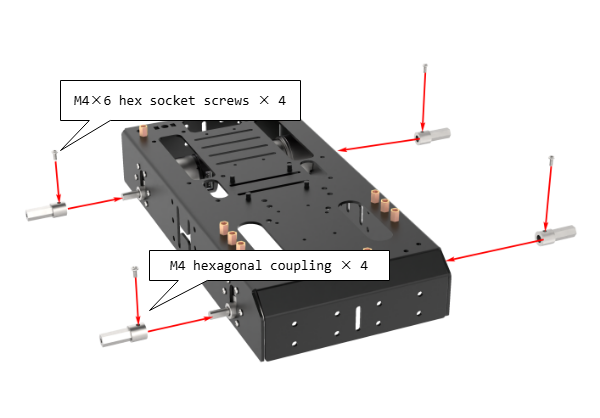

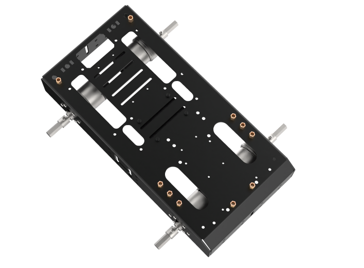

5)  Secure the four Mecanum wheels to the coupling with M3×8 round-head mechanical screws.

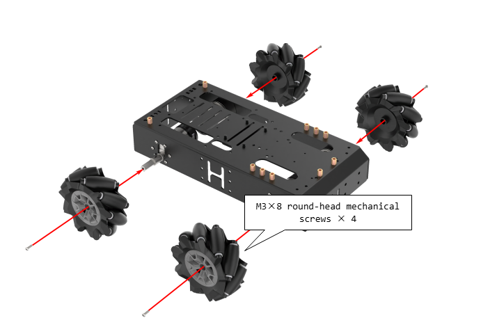

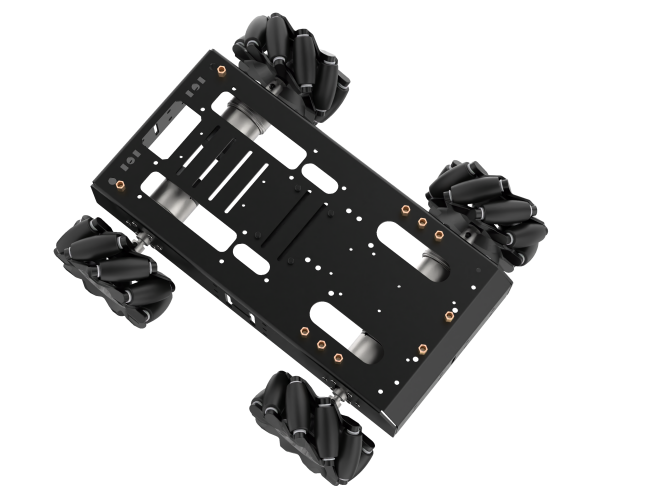

6)  Connect the motors to the 4-channel encoder motor driver module using the 6-pin module cable.

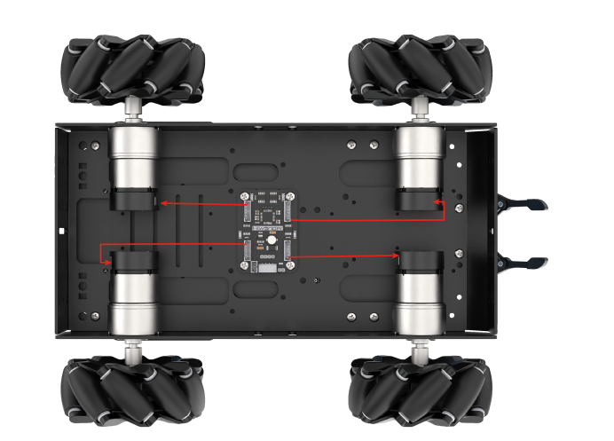

7)  Attach the robotic arm to the Mecanum chassis using 10 M4×6 round-head screws.

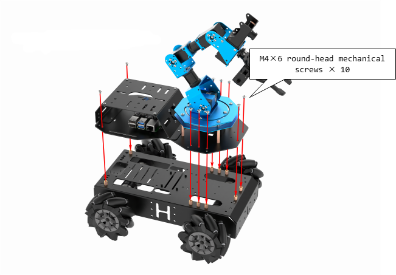

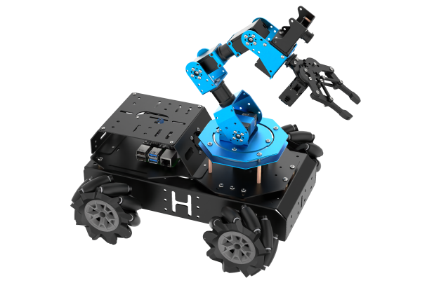

8)  Use Velcro to attach the battery to the battery mounting plate, and secure the battery plate to the chassis with 4 M4×6 round-head mechanical screws.

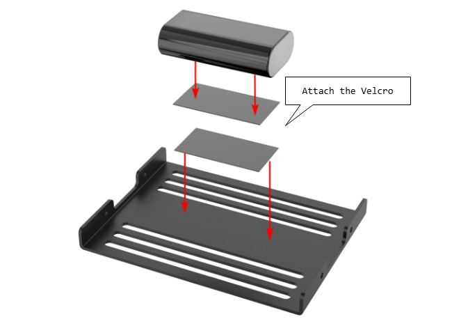

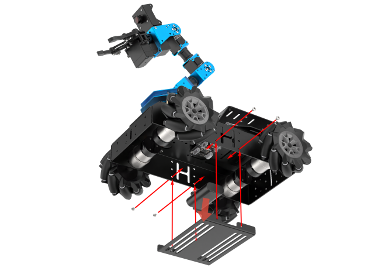

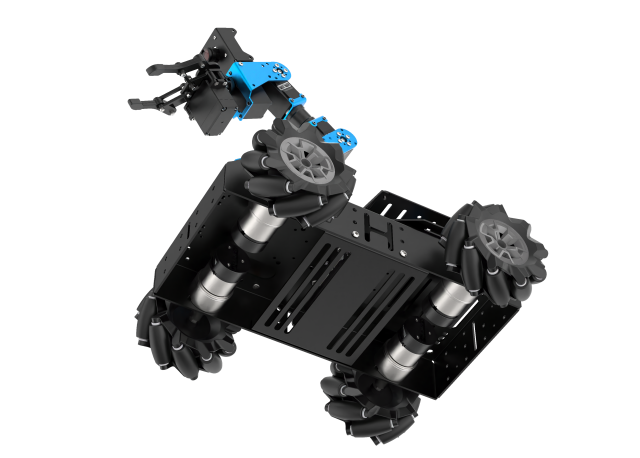

## 13.2 Selecting the Robot Type

ArmPi Ultra’s expansion accessories come in three types: Mecanum chassis, sliding rail, and conveyor belt. After installation, you must switch the device version according to the installed accessory for proper operation.

> [!NOTE]
>
> **Note:** If you don’t switch or select the wrong version, the motor may run unpredictably, causing malfunctions or even damaging the device.

Step-by-step instructions:

1)  Start the robotic arm, and access the robot system desktop using VNC. To get detailed instructions on remote control software connection, please refer to the tutorials saved in **[1.ArmPi Ultra User Manual-> 1.6 Development Environment Setup and Configuration]()** in the ArmPi Ultra User Manual.

2)  Double-click the model configuration tool on the desktop. 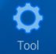

3)  Select the appropriate options based on the robotic arm version, camera version, and accessory type:


**Mecanum** refers to the Mecanum chassis. **Slide_Rails** refers to the sliding rail. **Conveyor_Belt** refers to the conveyor belt.

4.  After making your selection, click **Save** to save the configuration.


5.  Click **Apply** to reload the configuration.


Wait for the buzzer to beep once—this indicates the restart is complete and the new configuration is now active.

## 13.3 APP Control

### 13.3.1 APP Installation

> [!NOTE]
>
> * Please grant all permissions requested during installation to ensure the app functions properly.
>
> * Turn on your phone’s GPS and Wi-Fi before opening the app.

For Android devices: You can find the app installation file in the directory: **[Appendix]()** .Transfer the APK file to your phone and install it.

For iOS devices: Search for **WonderPi** and download it in the App Store.

### 13.3.2 Connection Modes

The robot supports two network modes:

AP Mode (Direct Connection): The controller creates a hotspot that your phone can connect to directly, but no Internet access in this mode.

STA Mode (LAN Connection): The controller connects to a specified Wi-Fi network, and Internet access is available in this mode.

By default, the robot starts in AP direct connection mode. Regardless of whether the user chooses AP direct connection or STA LAN mode, the robot’s features and functions remain the same.

> [!NOTE]
>
> **Tip:** We recommend starting with the AP direct connection mode to quickly explore and experience the robot’s functions. You can switch to LAN mode later based on your specific needs.

* **Connecting in AP Mode (Must Read)**

**To use this mode, iOS devices must be running iOS 11.0 or above, and Android devices must be running Android 5.0 or above.**

Important for Android users: Make sure to enable all required permissions for the app in your phone settings to ensure proper functionality.

This section takes connecting ArmPi Ultra to the Android device as an example. The same steps apply for iOS devices.

Open the **WonderPi** app and select "**Advanced**" \> "**ArmPi Ultra**".

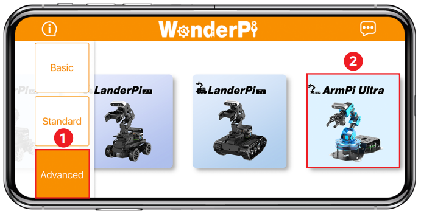

Tap the “**+**” button in the bottom-right corner and choose “**Direct Connection Mode**”.


Tap “**Go to connect device hotspots**”, which will take you to the Wi-Fi settings page to connect the hotspot generated by the robot.

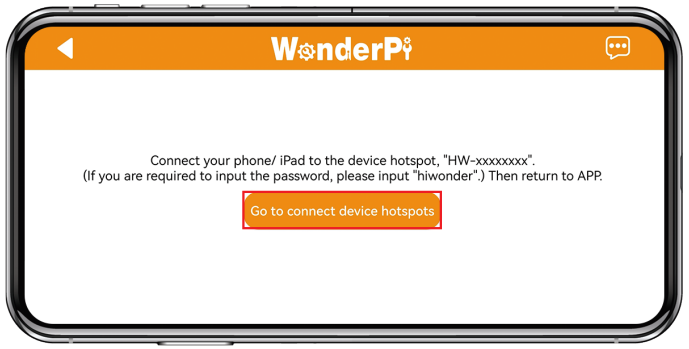

The hotspot starts with “HW” and connect to it by entering the password: **hiwonder**.


For iOS users: Make sure the Wi-Fi icon  appears in the status bar before switching back to the app, or the device might not be detected. If the app doesn’t detect the device right away, tap the refresh icon  in the upper-right corner.

Go back to the WonderPi app, tap the corresponding robot icon, and enter the mode selection screen.

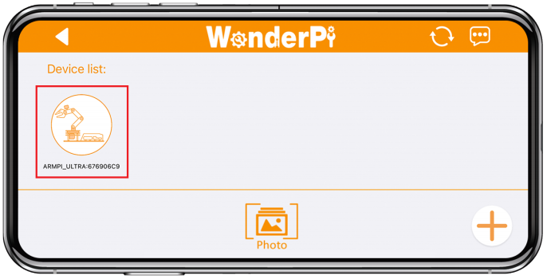

**If a message pops up saying “Network is unavailable, continue?”, tap “Keep Connection” to proceed.**

If a message appears saying **Whether to switch and enter the searched product interface?,** it means the wrong product was selected in Step 1. Tap “**Confirm**” to automatically switch to the correct version’s mode selection screen.

After tapping the robot icon, the mode selection screen will appear as shown below:


* **LAN Mode Connection (Optional)**

1.  First, connect your phone to a 5G Wi-Fi network. For example, connect to “**Hiwonder_5G**.” If you are using a dual-band router with separate SSIDs, the 2.4G and 5G networks will have different names, for example, “**Hiwonder**” for 2.4G and “**Hiwonder_5G**” for 5G.

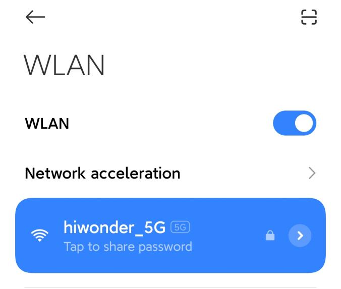

2.  Open the WonderPi app and select "**Advanced**" \> "**ArmPi Ultra**".


3.  Tap the “**+**” button in the bottom-right corner and choose “**LAN Mode**”.


4.  The app will prompt you to enter the Wi-Fi password for the network you're connected to. Make sure you enter the correct password, a wrong password will prevent the connection. After entering the password, tap **OK**.


5.  Tap “**Go to connect device hotspots**” to switch to the Wi-Fi settings.

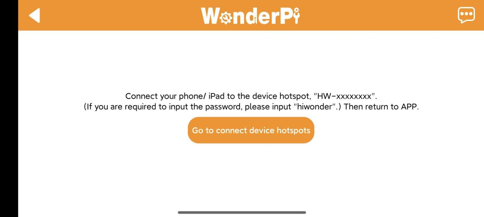

6.  In the Wi-Fi list, find the hotspot starting with “HW”, and connect to it using the password: hiwonder. After connecting, tap the “**Back**” button to return to the app.

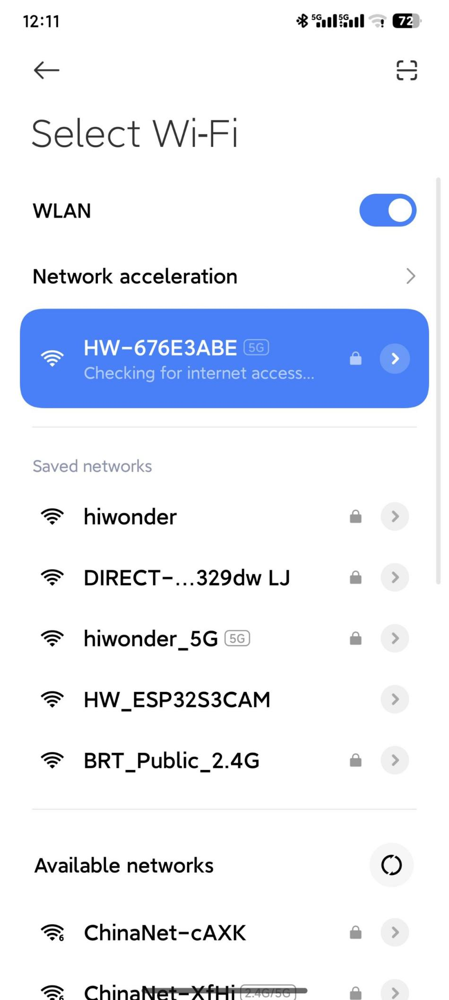

7.  You will see that the app has started connecting to the robot.

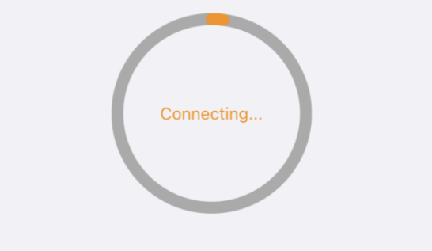

8.  After a few seconds, the robot's icon and name will appear on the main screen. The LED1 indicator on the expansion board will stay on.


9.  Long-press the corresponding icon of your robot in the app to view its assigned IP address and Device ID.

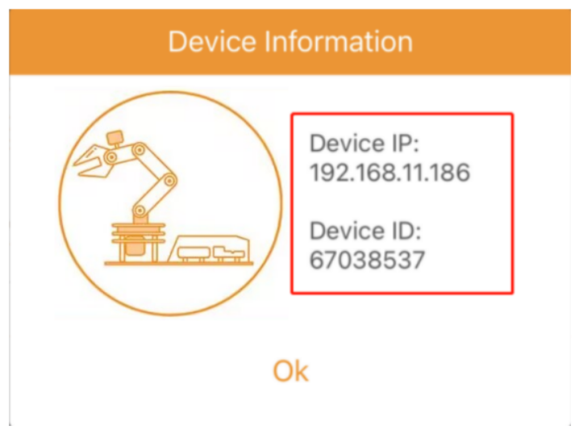

10. You can use this IP address in a remote desktop tool to establish a connection with the robot.

11. To switch from LAN mode back to direct connection mode, press and hold the KEY1 button on the expansion board until the blue indicator light starts blinking. This indicates the mode has been switched successfully.

### 13.3.3 APP Control

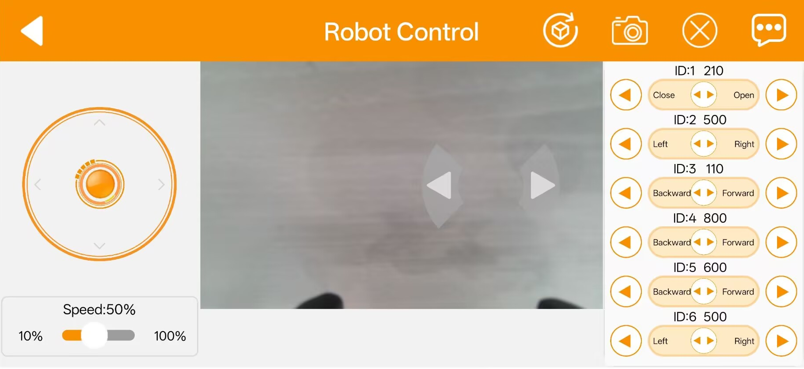

|  | **Icon** | **Function** |
|:--:|:--:|:--:|
| Live Video Feed | 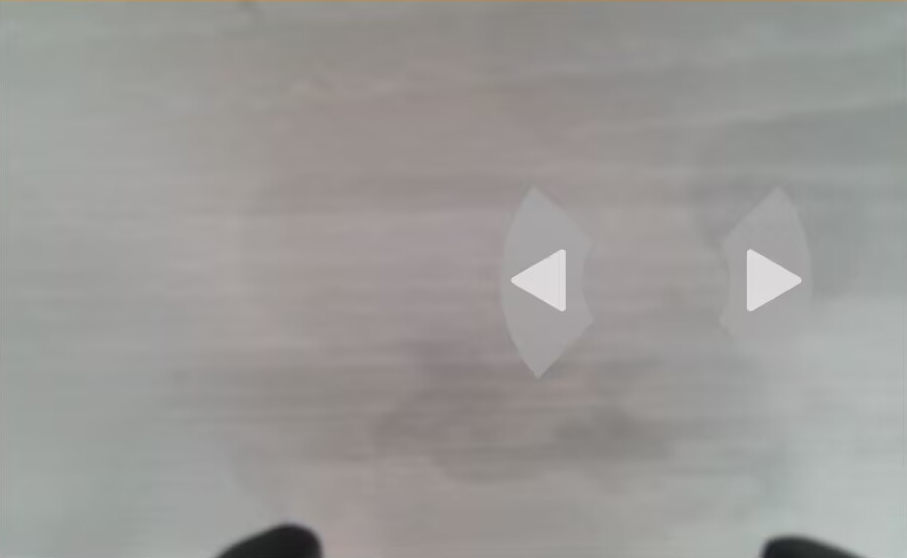 | The pan-tilt rotates left or right, and the gripper rotates clockwise or counterclockwise accordingly. |
| Chassis Control | 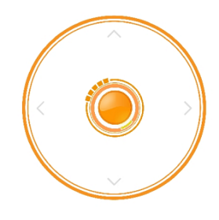 | Control the chassis to move forward, backward, and strafe left or right. |
| Speed Adjustment Slider |  | Adjust the movement speed of the robot chassis. |
| Steering Control | 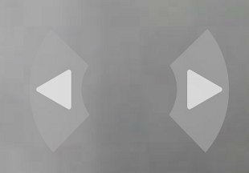 | Manually control the chassis turning direction (left/right). |
| Reset button |  | Return the robotic arm to its default position. |
| Arm Control | 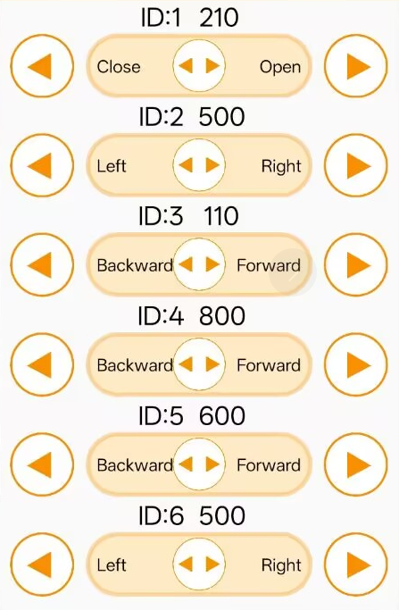 | Individually control each servo motor of the robotic arm. |

## 13.4 Wireless Controller

### 13.4.1 Preparation

1.  Before powering on the device, make sure the wireless controller receiver is properly inserted. This can be ignored if the receiver was pre-inserted at the factory.

2.  Pay attention to battery polarity when placing the batteries.


3.  Each time the robot is powered on, the APP auto-start service will launch which includes the wireless handle control service. If this service has not been closed, no additional actions are needed—simply connect and control.

4.  Since signals from wireless controller can interfere with each other, it is recommended not to use this function when multiple robots are in the same area, to avoid misconnection or unintended control.

5.  After turning on the wireless controller, if it does not connect to the robot within 30 seconds, or remains unused for 5 minutes after connection, it will enter sleep mode automatically. To wake up the wireless handle and exit sleep mode, press the “**START**” button.

### 13.4.2 Device Connection

1)  After the robot powers on, slide the wireless controller switch to the "**ON**" position. At this point, the red and green LED indicators on the wireless controller will start flashing simultaneously.

2)  Wait a few seconds for the robot and wireless controller to pair automatically. Once pairing is successful, the green LED will remain solid while the red LED turns off.


### 13.4.3 Control Modes

The wireless handle supports two control modes: Coordinate Mode and Single Servo Mode. After a successful connection, the default mode is Single Servo Mode.

- **Single Servo Mode:** In this mode, the wireless controller buttons can be used to control the forward and reverse rotation of individual servos on the robotic arm.


Button Functions in Single Servo Mode:

| **Button** | **Function (from the robotic arm’s first-person perspective)** |
|:--:|:--:|
| START | Reset the robotic arm |
| SELECT+START | Switch control mode (Single Servo / Coordinate) |
| UP / ↑ | Raise Servo 5 |
| DOWN / ↓ | Lower Servo 5 |
| LEFT / ← | Rotate Servo 6 to the left |
| RIGHT / → | Rotate Servo 6 to the right |
| Y | Lower Servo 4 |
| A | Raise Servo 4 |
| B | Rotate Servo 2 to the right (Gripper turns right) |
| X | Rotate Servo 2 to the left (Gripper turns left) |
| L1 | Open the gripper (Servo 1) |
| L2 | Close the gripper (Servo 1) |
| R1 | Raise Servo 3 |
| R2 | Lower Servo 3 |
| Left Joystick Forward | Move Chassis Forward |
| Left Joystick Backward | Move Chassis Backward |
| Left joystick left | Chassis strafes to the left. |
| Left joystick right | Chassis strafes to the right. |
| Right joystick left | Chassis Turn Left |
| Right Joystick right | Chassis Turn Right |

- **Coordinate Mode:** In Coordinate Mode, the robotic arm moves as a whole along the X, Y, and Z axes and can also adjust its tilt angle based on button inputs.


Button Functions in Coordinate Mode:

| **Button** | **Function (from the robotic arm’s first-person perspective)** |
|:--:|:--:|
| START | Reset the robotic arm |
| SELECT+START | Switch control mode (Single Servo / Coordinate) |
| UP / ↑ | Move arm in the positive X direction (forward) |
| DOWN / ↓ | Move arm in the negative X direction (backward) |
| LEFT / ← | Move arm in the positive Y direction (left) |
| RIGHT / → | Move arm in the negative Y direction (right) |
| Y | Close the gripper (Servo 10) |
| A | Open the gripper (Servo 10) |
| B | Rotate Servo 5 to the right (Gripper turns right) |
| X | Rotate Servo 5 to the left (Gripper turns left) |
| L1 | Move arm upward along Z axis |
| L2 | Move arm downward along Z axis |
| R1 | Increase gripper pitch angle |
| R2 | Decrease gripper pitch angle |
| Left Joystick Forward | Move Chassis Forward |
| Left Joystick Backward | Move Chassis Backward |
| Left joystick left | Chassis strafes to the left. |
| Left joystick right | Chassis strafes to the right. |
| Right joystick left | Chassis Turn Left |
| Right Joystick right | Chassis Turn Right |

Switching Between Modes: To switch between modes, press both **SELECT** and **START** buttons. A sound prompt indicates the switch was successful.

1.  Two beeps: Switched from Single Servo Mode to Coordinate Mode.

2.  One beep: Switched from Coordinate Mode to Single Servo Mode.

## 13.5 Object Tracking

When the camera detects a target color block, the robotic arm and chassis will follow the movement of that block.

### 13.5.1 Project Process

First, subscribe to the topic published by the color recognition node to obtain detected color information.

Then choose the target color. Once the target color is detected, obtain the center position of the target object in the image.

Finally, based on the target's relative position within the image frame, estimate the distance to the object. Then publish a motion control topic message to drive the chassis accordingly.

### 13.5.2 Enabling the Feature

1)  Start the robotic arm, and access the robot system desktop using VNC. To get detailed instructions on remote control software connection, please refer to the tutorials in the section **[1.ArmPi Ultra User Manual-> 1.6 Development Environment Setup and Configuration]()** of the ArmPi Ultra User Manual.

2)  Click the icon  to open the command-line terminal.

3)  Enter the following command and press **Enter** to stop the auto-start service:

    ```py
    ~/.stop_ros.sh
    ```

4)  Entering the following command to start the feature.

    ```py
    ros2 launch example object_tracking_node.launch.py
    ```

5)  Once the program is launched successfully, you will see the following log messages printed in the terminal. A camera feed window will pop up automatically.


6)  Click on the object you want to track in the camera feed window. The system will automatically detect the color threshold of the selected object and set it as the tracking target.

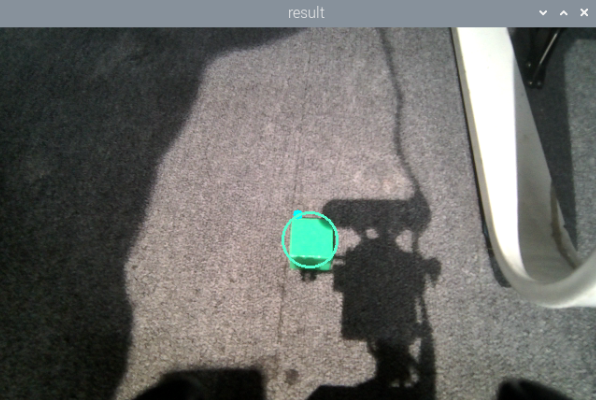

7. Open a new terminal window  and enter the following command to begin tracking:

   ```py
   ros2 service call /object_tracking/set_running std_srvs/srv/SetBool "{data: true}"
   ```

8. To stop tracking, enter the following command in the terminal:

   ```py
   ros2 service call /object_tracking/set_running std_srvs/srv/SetBool "{data: false}"
   ```

9. To exit the feature, press **Ctrl+C** in the terminal. If the program does not close successfully, try pressing **Ctrl + C** again.

10. If you want to experience the mobile app features again later, enter the command and press **Enter** to start the app service. Wait for the robotic arm to return to its initial position — a beep from the buzzer will indicate it's ready.

    ```py
    ros2 launch bringup bringup.launch.py
    ```

### 13.5.3 Project Outcome

After launching the feature, place a red block within the field of view of the robotic arm’s camera. The live video feed will highlight the detected target color, and the robotic arm with its chassis will continuously follow the movement of the red block.

### 13.5.4 Program Brief Analysis

* **launch File Analysis**

The launch file is located at:

**/home/ubuntu/ros2_ws/src/example/example/chassis/object_tracking_node.launch.py**

**1. launch_setup Function**

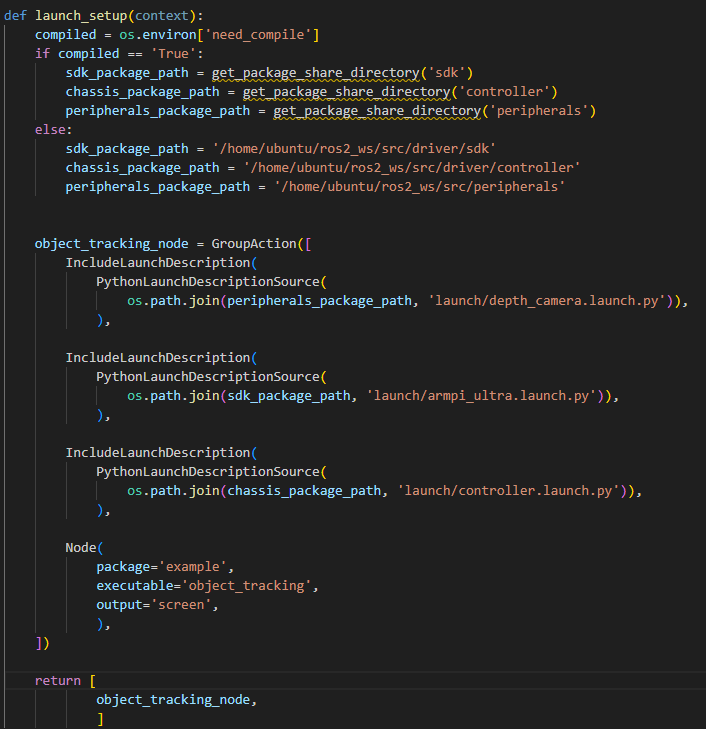

Loads the **launch/depth_camera.launch.py** from the **peripherals** package to start the depth camera node. This node provides RGB images and depth data as visual input for object tracking, used for target localization and distance calculation. Loads the **launch/armpi_ultra.launch.py** from the **sdk** package to start the low-level control services for the robotic arm, such as servo driving and kinematics calculations. These services provide hardware support for grasping or following actions during the tracking process. Loads the **launch/controller.launch.py** from the **controller** package to start the chassis control services, such as wheeled chassis motion control. This enables the system's mobility and supports dynamic tracking of moving targets. Starts the **object_tracking** executable from the **example** package as the core logic node. It combines visual data, robotic arm control, and chassis motion to achieve real-time tracking of the target object, including dynamic localization, path planning, and follow control, with logs output to the screen.

**2. generate_launch_description Function**

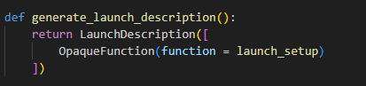

Creates and returns a `LaunchDescription` object, calling `launch_setup` via OpaqueFunction as the standard entry point for the ROS 2 launch file.

**3. Main Function**

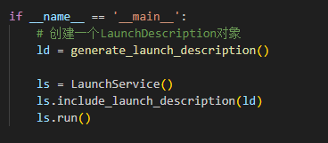

Creates a `LaunchDescription` object and a `LaunchService` service. The launch description is added to the service and executed, enabling the startup of the entire system manually.

* **Python File Analysis**

The Python file is located at:

**/home/ubuntu/ros2_ws/src/example/example/chassis/object_tracking.py**

**1. Import the Necessary Libraries**

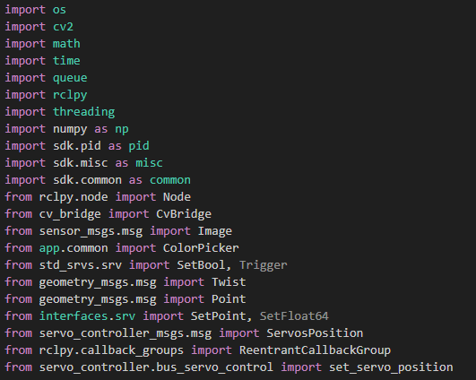

1.  **`sdk.pid`**: A custom PID controller module implementing the PID control algorithm.

2.  **`sdk.misc`**: A custom module containing miscellaneous helper functions.

3.  **`sdk.common`**: A custom module including common functions and constants.

4.  **`app.common.Heart`**: A custom heartbeat monitoring feature used to check the status of the system or nodes.

5.  **`app.common.ColorPicker`**: A custom module for color selection functionality.

6.  **`servo_controller_msgs.msg.ServosPosition`**: A custom message type for controlling the position of servo motors.

7.  **`servo_controller.bus_servo_control`**: A custom module used for controlling servo motors.

**2. ObjectTracker Class Initialization**

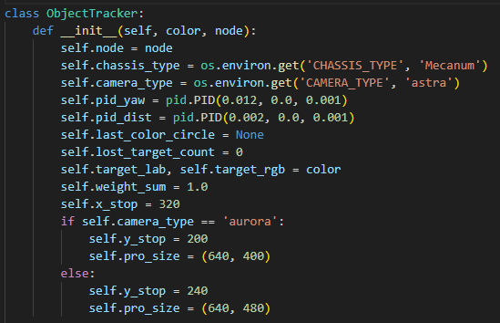

Configure the PID controllers, `pid_yaw` for rotation control and `pid_dist` for forward/backward motion control. The parameters are adjusted based on the actual scenario, for example, `kp=0.012` for rotation, `kp=0.002` for distance. Define the target stop point, with `x_stop=320` and `y_stop` adjusted based on the camera type. This represents the target's desired center position in the image. Store the target's LAB value (target_lab) and RGB value (target_rgb). The LAB color space is more suitable for color threshold detection.

**3. \_\_call\_\_ Function**


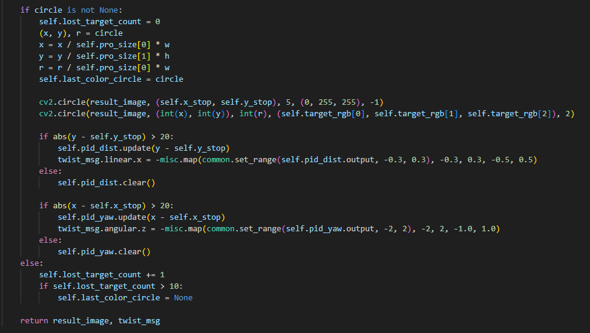

Scale the image to the preset size and convert it to the LAB color space, then apply Gaussian blur to reduce noise. Generate a threshold range based on the target color's LAB values, and create a mask using `cv2.inRange`. Then, apply erosion and dilation operations to remove interference. Target contour extraction: Extract contours from the mask, filter out small contours to exclude noise, and select the largest contour or the one closest to the previous frame as the target. Calculate the target's minimum enclosing circle, obtaining the center coordinates (x, y) and radius (r), and map them back to the original image size. If the x deviation from the target center exceeds 20 pixels, compute the rotation speed `twist_msg.angular.z` using `pid_yaw` to control the chassis rotation. If the y deviation exceeds 20 pixels, compute the forward/backward speed `twist_msg.linear.x` using pid_dist to control the chassis to move closer to or farther from the target. Target loss handling: If the target is not detected for 10 consecutive frames, reset the tracking state `last_color_circle=None`.

**4. ObjectTrackingNode Class Initialization**

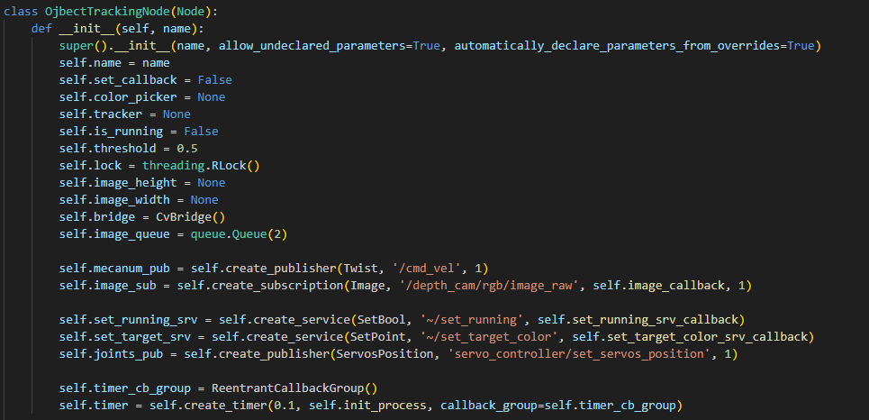

Subscribes to the camera image feed /depth_cam/rgb/image_raw, and publishes chassis speed commands /cmd_vel and servo positions servo_controller/set_servos_position. 

Provide service interfaces: `~/set_running` to start/stop tracking and `~/set_target_color` to set the target color via coordinates. Initialize state variables, such as `is_running (tracking switch)`, `color_picker (color selector)`, and `tracker (tracker instance)`.

**5. init_process**

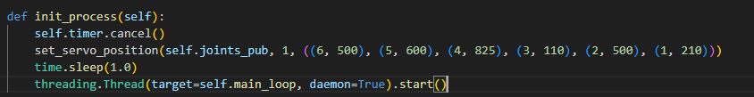

Cancels the initialization timer, sets the servo to its initial position, ensuring the camera angle is correct, and starts the main loop thread main_loop.

**6. main_loop**


Creates a display window "**result**" and continuously fetches and displays the processed image from the image queue. Sets a mouse callback `mouse_callback` to support selecting the color to track by clicking on the image. Listens for keyboard input, pressing **ESC** to exit, stopping the chassis movement and closing the window when exiting.

**7. mouse_callback**

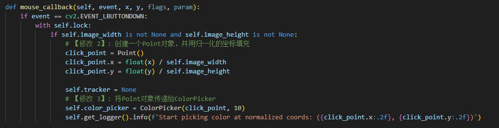

When the left mouse button is clicked on the image, normalize the click coordinates to a 0–1 range and create a `Color_Picker` instance to extract the color information at that location.

**8. set_target_color_srv_callback**

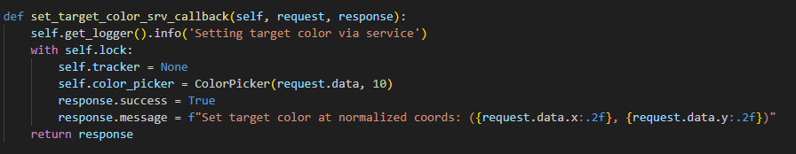

Receives the target coordinates through the SetPoint service, sets the tracking color, and returns a success status.

**9. set_running_srv_callback**

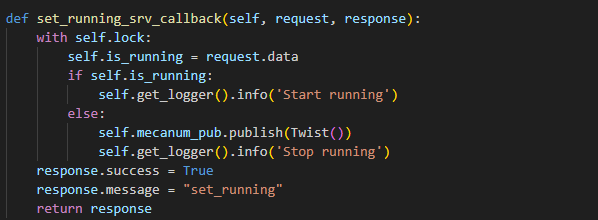

Receives the `is_running` flag through the SetBool service to start or stop tracking. When tracking is stopped, publish a zero-velocity command.

**10. image_callback**

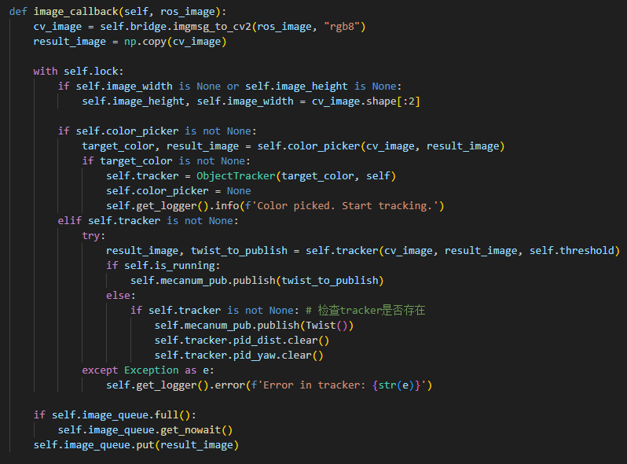

Converts the incoming ROS image message to an OpenCV RGB image and stores a copy for result display. If no color has been selected, use `ColorPicker` to extract the target color. If a color is already selected, run the `ObjectTracker` and publish the chassis velocity depending on the is_running state. If tracking is disabled, with `is_running` set to False, publish a zero-velocity command and reset the PID controllers.

**11. main Function**

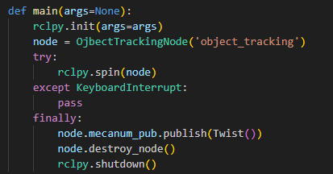

Initializes and runs the `ObjectTrackingNode`.

## 13.6 Line Following

When the camera detects a line of the target color, the robotic arm chassis will follow the line forward.

### 13.6.1 Project Process

First, subscribe to the topic published by the color recognition node to obtain detected color information.

Then choose the target color. Once the target color is matched, define three ROI areas to determine the direction of the line.

Based on the line direction, publish motion control messages to command the chassis movement.

### 13.6.2 Enabling the Feature

1)  Start the robotic arm, and access the robot system desktop using VNC. To get detailed instructions on remote control software connection, please refer to the tutorials saved in **[1.ArmPi Ultra User Manual-> 1.6 Development Environment Setup and Configuration]()** in the ArmPi Ultra User Manual.

2)  Click the icon  to open the command-line terminal.

3)  Enter the following command and press **Enter** to stop the auto-start service:

    ```py
    ~/.stop_ros.sh
    ```

4. Entering the following command to start the feature.

   ```py
   ros2 launch example line_tracking.launch.py
   ```

5)  Once the program is launched successfully, you will see the following log messages printed in the terminal. A camera feed window will pop up automatically.

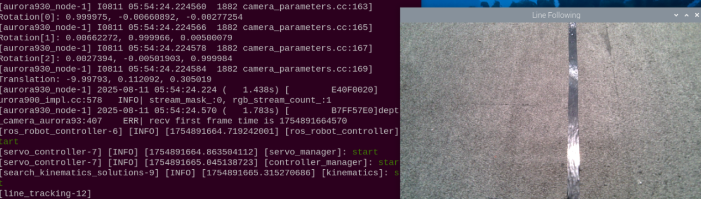

6)  Click on the line you want to track in the camera feed window. The system will automatically detect the color threshold of the selected line and set it as the tracking target.

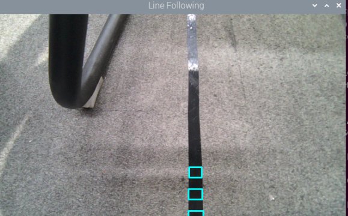

7. Open a new terminal window  and enter the following command to begin tracking:

   ```py
   ros2 service call /line_following/set_running std_srvs/srv/SetBool "{data: true}"
   ```

8. To stop tracking, enter the following command in the terminal:

   ```py
   ros2 service call /line_following/set_running std_srvs/srv/SetBool "{data: false}"
   ```

9. To exit the feature, press **Ctrl + C** in the terminal. If the program does not close successfully, try pressing **Ctrl + C** again.

10. If you want to experience the mobile app features again later, enter the command and press **Enter** to start the app service. Wait for the robotic arm to return to its initial position — a beep from the buzzer will indicate it's ready.

    ```py
    ros2 launch bringup bringup.launch.py
    ```

### 13.6.3 Project Outcome

After starting the feature, place the robotic arm behind the target line. Once the target line is selected and line following begins, the robotic arm chassis will move forward while maintaining alignment with the center of the line.

### 13.6.4 Program Brief Analysis

* **launch File Analysis**

The launch file is located at:

**/home/ubuntu/ros2_ws/src/example/example/chassis/line_tracking.launch.py**

**1. launch_setup Function**


Loads **launch/depth_camera.launch.py** from the **peripherals** package to start the depth camera node. It provides RGB images and depth data as visual input for line tracking, used to detect the position and shape of the track line. Loads **launch/armpi_ultra.launch.py** from the **sdk** package to start the low-level control services for the robotic arm and provide hardware support. Loads **launch/controller.launch.py** from the **controller** package to start the chassis control services, enabling mobility for autonomous movement along the track line. Starts the **`line_tracking`** executable from the **example** package as the core logic node. It detects the track line from visual input such as a black line or a colored tape, and sends motion commands through the chassis controller to follow the line with automatic path correction and speed control, with logs output to the screen.

**2. generate_launch_description Function**


Creates and returns a `LaunchDescription` object, calling `launch_setup` via OpaqueFunction as the standard entry point for the ROS 2 launch file.

**3. Main Function**


Creates a `LaunchDescription` object and a `LaunchService` service. The launch description is added to the service and executed, enabling the startup of the entire system manually.

* **Python File Analysis**

The Python file is located at:

**/home/ubuntu/ros2_ws/src/example/example/chassis/line_tracking.py**

**1. Import the Necessary Libraries**

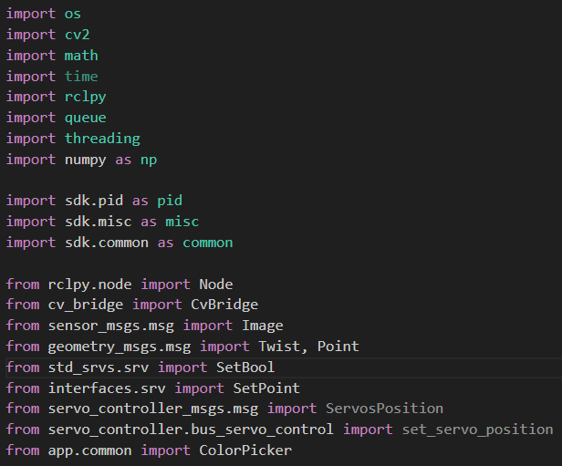

1.  **`sdk.pid`**: A custom module implementing the PID control algorithm, commonly used for feedback control systems.

2.  **`sdk.misc`**: A custom miscellaneous module containing various utility functions and tools that simplify the main program logic.

3.  **`sdk.common`**: A collection of general-purpose utility functions designed to support code reuse during development.

4.  **`app.common.ColorPicker`**: A custom module used for handling or selecting specific colors.

5.  **`servo_controller_msgs.msg.ServosPosition`**: A custom message type for controlling servo motor positions.

6.  **`servo_controller.bus_servo_control`**: A custom module for controlling servo motors.

**2. LineFollower Class Initialization**

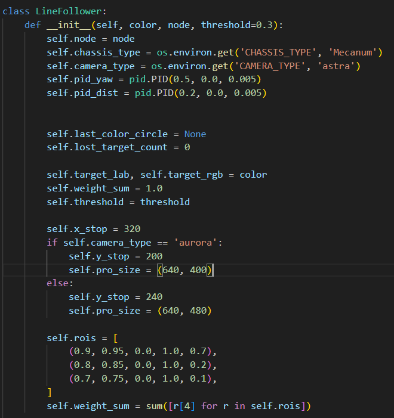

Configures the PID controller for steering with `pid_yaw using kp=0.5`, while the second PID controller, `pid_dist`, is reserved for distance control. Defines the target color using `target_lab` and `target_rgb`, because the LAB color space provides more stable thresholding for color detection. Sets the region of interest at the bottom of the image using three overlapping rois, with weights of 0.7, 0.2, and 0.1 in descending order. This focuses on the key areas where the track line is most likely to appear and reduces background interference. Adjusts the image size using pro_size and set the reference point using y_stop based on the camera type to match different hardware configurations.

**3. get_area_max_contour Function**

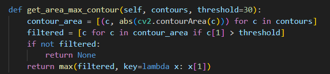

Selects the largest contour from the list of contours, filtering out those below the minimum area threshold.

**4. \_\_call\_\_ Function**

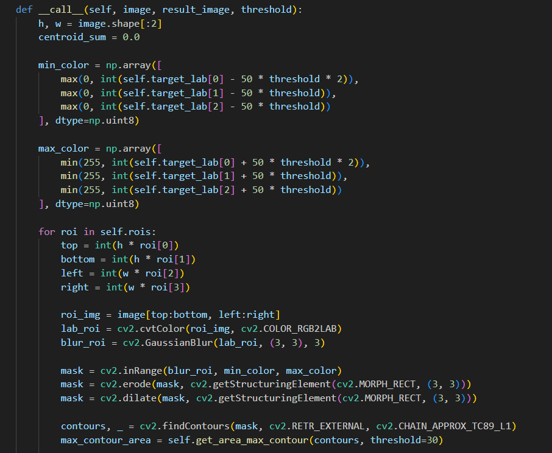

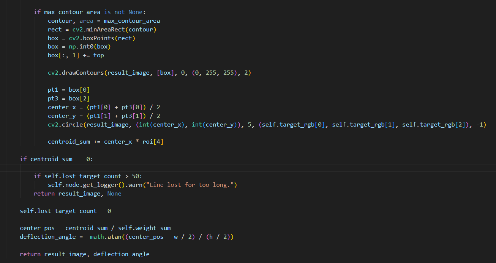

Generates the minimum and maximum color ranges, `min_color` and `max_color`, based on the target color `target_lab` and the detection threshold to ensure that only lines of the target color are detected. Processes each ROI separately by cropping the image, converting it to the LAB color space, applying Gaussian blur, creating a threshold mask, and using erosion and dilation to remove noise. Extracts contours from the mask and filter out those with insufficient area. For each valid contour, calculate the minimum bounding rectangle, obtain the center coordinates `center_x` and `center_y`, and map them back to the original image. Compute the weighted sum of the center coordinates from all three ROIs to get the overall center_pos. Calculate the deflection angle deflection_angle based on the deviation between this center and the image midline to determine the direction of the track line deviation. If no line is detected for 50 consecutive frames, issue a warning and stop the chassis.

**5. LineFollowingNode Class Initialization**

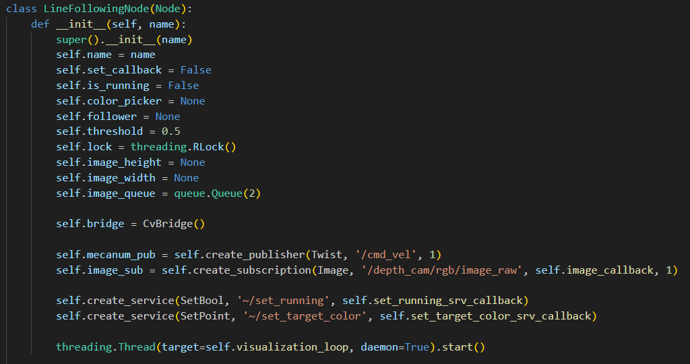

Subscribes to the camera image feed /depth_cam/rgb/image_raw and publishes chassis speed commands `/cmd_vel`. 

Provides service interfaces: `~/set_running` to start/stop tracking and `~/set_target_color` to set the tracking color via coordinates. Starts the visualization thread `visualization_loop` to display the processed image in real time.

**6. visualization_loop Function**

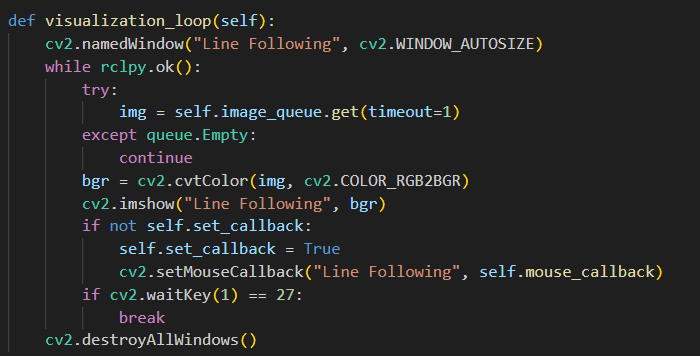

Creates a display window named "**Line Following**" and continuously shows the processed image.

**7. mouse_callback Function**

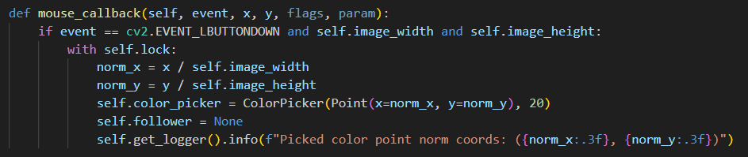

When the left mouse button is clicked on the image, normalize the click coordinates to a 0–1 range, create a ColorPicker instance, and extract the color at the clicked position as the tracking target.

**8. set_target_color_srv_callback and set_running_srv_callback Functions**

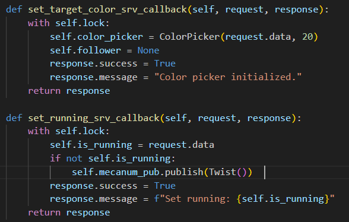

`set_target_color_srv_callback`: Receives normalized coordinates through the SetPoint service, initializes the ColorPicker, and sets the line color for tracking. 

`set_running_srv_callback`: Controls the tracking state is_running through the SetBool service. When tracking is stopped, it publishes a zero-velocity command to ensure the chassis remains stationary.

**9. image_callback Function**

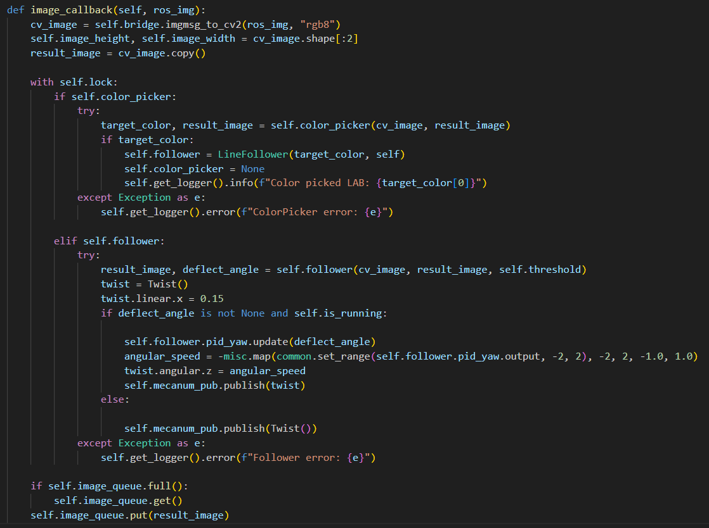

Converts the incoming ROS image message to an OpenCV RGB image and stores a copy for result display. If the tracking color is not set, use ColorPicker to extract the target color in LAB format and initialize the LineFollower instance.

If the tracking color is already set, call LineFollower to detect the line and obtain the deflection angle. If tracking is enabled with is_running set to true, calculate the steering speed using pid_yaw and set the forward speed using `twist.linear.x = 0.15` to drive the chassis along the track line. If no line is detected or tracking is stopped, publish a zero-velocity command and reset the PID controllers.

**10. main Function**

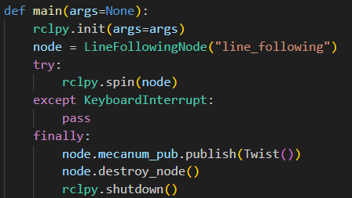

Serves as the program entry point, initializing the ROS2 environment, creating and running the node, and cleaning up resources upon exit.
