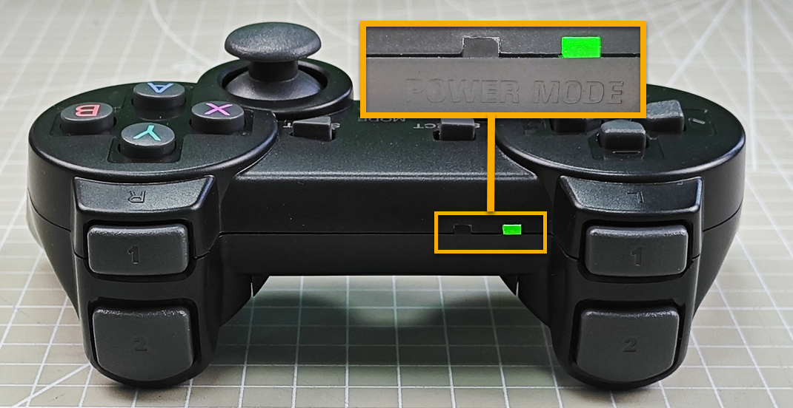

# 14. ArmPi Ultra with Sliding Rail

## 14.1 Sliding Rail Installation

Below is a schematic overview of the installation steps:

**Step 1: Install the Tank Track**
Secure the tank track onto the sliding rail using two M4×6 pan head machine screws.


**Step 2: Install the Motor Fixing Cover**

Attach the motor fixing cover to the sliding rail using two M3×6 pan head machine screws.


**Step 3: Install the Sliding Rail Base Plate**

Secure the base plate to the sliding rail using four M5×12 countersunk machine screws and four 5.2×7×4 standoffs.


**Step 4: Install Brass Standoff**

Fasten two M3×15 double-pass brass standoffs to the ArmPi Ultra base using two M3×6 pan head machine screws.


**Step 5: Install the Robotic Arm**

Fasten the robotic arm to the sliding rail base using two M3×12 pan head machine screws and secure them with the corresponding nuts.


**Step 6: Attach the Tank Track to the Robotic Arm**

Use two M3*6 pan head machine screws to secure the tank track assembly to the ArmPi Ultra robotic arm.


**Step 7: Final Assembly and Wiring Instructions**

Once fully assembled, the setup should appear as shown in the diagram below.


Connect the 3-pin cable from the sliding rail to the 3-pin terminal (port 1) on the STM32 expansion board for power supply. Connect the 4-pin cable from the sliding rail to the I2C port (port 2) on the expansion board. As shown in the figure below:


## 14.2 Selecting the Robot Type

ArmPi Ultra's expansion accessories come in three types: Mecanum chassis, sliding rail, and conveyor belt. After installation, you must switch the device version according to the installed accessory for proper operation.

> [!NOTE]
>
> **Note:** If you don't switch or select the wrong version, the motor may run unpredictably, causing malfunctions or even damaging the device.

Step-by-step instructions:

1)  Start the robotic arm, and access the robot system desktop using VNC. To get detailed instructions on remote control software connection, please refer to the tutorials saved in **[1.ArmPi Ultra User Manual-> 1.6 Development Environment Setup and Configuration](https://wiki.hiwonder.com/projects/ArmPi-Ultra/en/latest/docs/1.ArmPi_Ultra_User_Manual.html#development-environment-setup-and-configuration)** in the ArmPi Ultra User Manual.

2)  Double-click the model configuration tool on the desktop. 

3)  Select the appropriate options based on the robotic arm version, camera version, and accessory type:


**Mecanum** refers to the Mecanum chassis. **Slide_Rails** refers to the sliding rail. **Conveyor_Belt** refers to the conveyor belt.

4.  After making your selection, click **Save** to save the configuration.


5.  Click **Apply** to reload the configuration.


Wait for the buzzer to beep once—this indicates the restart is complete and the new configuration is now active.

## 14.3 Position Calibration

> [!NOTE]
>
> This section applies specifically to the sliding rail configuration. Please ensure the robotic arm is calibrated for mechanical deviations while placed on a flat table before mounting it on the sliding rail.

Position calibration is the process of converting coordinates from the camera's visual feedback to the real-world coordinates of the robotic arm. Through this calibration, the system can accurately determine the actual distance between the robotic arm and the wooden block, enabling precise operations like sorting and object placement.

Please first refer to section **[1.ArmPi Ultra User Manual -> 1.8 Position Adjustment for Object Gripping and Placing](https://wiki.hiwonder.com/projects/ArmPi-Ultra/en/latest/docs/1.ArmPi_Ultra_User_Manual.html#position-adjustment-for-object-gripping-and-placing)** and Placing in the ArmPi Ultra User Manual to perform position calibration.

## 14.4 Wireless Controller Control

### 14.4.1 Preparation

1.  Before powering on the device, make sure the wireless controller receiver is properly inserted. This can be ignored if the receiver was pre-inserted at the factory.

2.  Pay attention to battery polarity when placing the batteries.


3.  Each time the robot is powered on, the app auto-start service will launch which includes the wireless handle control service. If this service has not been closed, no additional actions are needed—simply connect and control.

4.  Since signals from wireless controller can interfere with each other, it is recommended not to use this function when multiple robots are in the same area, to avoid misconnection or unintended control.

5.  After turning on the wireless controller, if it does not connect to the robot within 30 seconds, or remains unused for 5 minutes after connection, it will enter sleep mode automatically. To wake up the wireless handle and exit sleep mode, press the **START** button.

### 14.4.2 Device Connection

1.  After the robot powers on, slide the wireless controller switch to the **ON** position. At this point, the red and green LED indicators on the wireless controller will start flashing simultaneously.

2.  Wait a few seconds for the robot and wireless controller to pair automatically. Once pairing is successful, the green LED will remain solid while the red LED turns off.



### 14.4.3 Control Modes

The wireless handle supports two control modes: Coordinate Mode and Single Servo Mode. After a successful connection, the default mode is Coordinate Mode.

- **Single Servo Mode:** In this mode, the wireless controller buttons can be used to control the forward and reverse rotation of individual servos on the robotic arm.


Button Functions in Single Servo Mode:

| **Button** | **Function (from the robotic arm's first-person perspective)** |
|:--:|:--:|
| START | Reset the robotic arm |
| SELECT+START | Switch control mode (Single Servo / Coordinate) |
| UP / ↑ | Raise Servo 5 |
| DOWN / ↓ | Lower Servo 5 |
| LEFT / ← | Rotate Servo 6 to the left |
| RIGHT / → | Rotate Servo 6 to the right |
| Y | Lower Servo 4 |
| A | Raise Servo 4 |
| B | Rotate Servo 2 to the right (Gripper turns right) |
| X | Rotate Servo 2 to the left (Gripper turns left) |
| L1 | Open the gripper (Servo 1) |
| L2 | Close the gripper (Servo 1) |
| R1 | Raise Servo 3 |
| R2 | Lower Servo 3 |
| Left Joystick LEFT | Move the sliding rail to the left |
| Left Joystick RIGHT | Move the sliding rail to the right |

- **Coordinate Mode:** In Coordinate Mode, the robotic arm moves as a whole along the X, Y, and Z axes and can also adjust its tilt angle based on button inputs.


Switching Between Modes: To switch between modes, press both **SELECT** and **START** buttons. A sound prompt indicates the switch was successful.

1.  Two beeps: Switched from Single Servo Mode to Coordinate Mode.

2.  One beep: Switched from Coordinate Mode to Single Servo Mode.

Button Functions in Coordinate Mode:

| **Button** | **Function (from the robotic arm's first-person perspective)** |
|:--:|:--:|
| START | Reset the robotic arm |
| SELECT+START | Switch control mode (Single Servo / Coordinate) |
| UP / ↑ | Move arm in the positive X direction (forward) |
| DOWN / ↓ | Move arm in the negative X direction (backward) |
| LEFT / ← | Move arm in the positive Y direction (left) |
| RIGHT / → | Move arm in the negative Y direction (right) |
| Y | Close the gripper (Servo 1) |
| A | Open the gripper (Servo 1) |
| B | Rotate Servo 2 to the right (Gripper turns right) |
| X | Rotate Servo 2 to the left (Gripper turns left) |
| L1 | Move arm upward along Z axis |
| L2 | Move arm downward along Z axis |
| R1 | Increase gripper pitch angle |
| R2 | Decrease gripper pitch angle |
| Left Joystick LEFT | Move the sliding rail to the left |
| Left Joystick RIGHT | Move the sliding rail to the right |

## 14.5 Color Sorting

### 14.5.1 Overview

In this experiment, the camera uses OpenCV algorithms to detect color blocks of a target color and calculates the center position of each block. Next, an inverse kinematics algorithm is applied to compute the pulse widths for the robotic arm's servos, enabling the arm to grasp the target color block. Finally, the sliding rail moves to the designated drop-off location based on the color of the block, and the arm performs a placing action to complete the sorting process.

### 14.5.2 Operations

> [!NOTE]
>
> **Note:** When entering commands, be sure to use correct case and spacing. You can use the Tab key to auto-complete keywords.

1. Refer to the tutorial in section **6. Development Environment Setup and Configuration** of the ArmPi Ultra User Manual to establish a connection between the robotic arm and the remote desktop tool.

2. Click on  to launch the command bar, enter the command, and press **Enter** to disable the auto-start service.

```bash
~/.stop_ros.sh
```

3. Enter the following command and press **Enter** to enable color sorting feature.

```bash
ros2 launch example color_sorting_stepper.launch.py
```

4. To stop the program, press **Ctrl + C** in the terminal window. If the program does not stop immediately, repeat this step until it terminates.

5. After completing the feature, you need to start the app service. **Otherwise, future app features may not function properly.** In the terminal, enter the command and press **Enter** to start the app service.

```bash
ros2 launch bringup bringup.launch.py
```

6)  Once the app service is successfully started, the robotic arm will return to its initial pose, and the buzzer will beep once.

### 14.5.3 Project Outcome

After starting the program, place the target color blocks within the robotic arm's visual recognition area. The robotic arm will detect and pick up each color block one by one, then place them in the corresponding locations.

### 14.5.4 Program Brief Analysis

* **launch File Analysis**

The launch files are located at: **~/ros2_ws/src/example/example/stepper/color_sorting_stepper.launch.py**

**1. launch_setup Function**

```py
def launch_setup(context):
    compiled = os.environ['need_compile']
    if compiled == 'True':
        sdk_package_path = get_package_share_directory('sdk')
        peripherals_package_path = get_package_share_directory('peripherals')
    else:
        sdk_package_path = '/home/ubuntu/ros2_ws/src/driver/sdk'
        peripherals_package_path = '/home/ubuntu/ros2_ws/src/peripherals'

    depth_camera_launch = IncludeLaunchDescription(
        PythonLaunchDescriptionSource(
            os.path.join(peripherals_package_path, 'launch/depth_camera.launch.py')),
    )

    sdk_launch = IncludeLaunchDescription(
        PythonLaunchDescriptionSource(
            os.path.join(sdk_package_path, 'launch/armpi_ultra.launch.py')),
    )
    
    color_sorting_stepper_node = Node(
        package='example',
        executable='color_sorting_stepper',
        output='screen',
    )

    return [
            sdk_launch,
            depth_camera_launch,
            color_sorting_stepper_node,
            ]
```

Loads the **launch/depth_camera.launch.py** file from the **peripherals** package to start the depth camera node, which provides RGB image and depth data, which is the visual input for color recognition. Loads the **launch/armpi_ultra.launch.py** file from the **sdk** package to start the low-level control services of the robotic arm, including servo driving and kinematics calculation, providing hardware control support for the sorting operation. Starts the **color_sorting_stepper** executable from the **example** package to control the sliding rail based on the visual recognition results and complete the automated color sorting process, with logs output to the screen.

**2. generate_launch_description Function**

```py
def generate_launch_description():
    return LaunchDescription([
        OpaqueFunction(function = launch_setup)
    ])
```

Creates and returns a LaunchDescription object, calling launch_setup via OpaqueFunction as the standard entry point for the ROS 2 launch file.

**3. Main Function**

```py
if __name__ == '__main__':
    ld = generate_launch_description()

    ls = LaunchService()
    ls.include_launch_description(ld)
    ls.run()
```

Creates a LaunchDescription object and a LaunchService service. The launch description is added to the service and executed, enabling the startup of the entire system manually.

* **Python File Analysis**

Python files locate at: **~/ros2_ws/src/example/example/stepper/include/color_sorting_stepper.py**

**1. Import the Necessary Libraries**

```py
import os
import cv2
import yaml
import time
import math
import queue
import rclpy
import threading
import numpy as np
from sdk import common
from rclpy.node import Node
from cv_bridge import CvBridge
from interfaces.srv import SetStringBool
from std_srvs.srv import Trigger, SetBool
from sensor_msgs.msg import Image, CameraInfo
from rclpy.executors import MultiThreadedExecutor
from servo_controller_msgs.msg import ServosPosition
from rclpy.callback_groups import ReentrantCallbackGroup
from kinematics.kinematics_control import set_pose_target
from kinematics_msgs.srv import GetRobotPose, SetRobotPose
from servo_controller.bus_servo_control import set_servo_position
from ros_robot_controller_msgs.srv import MoveStepper
from app.utils import calculate_grasp_yaw, position_change_detect, pick_and_place, image_process, distortion_inverse_map
```

1.  **`sdk.common`**: Modules from the robotic arm SDK (Software Development Kit).

2.  **`servo_controller_msgs.msg.ServosPosition`**: Message type used to control servo motor positions, typically for servo control.

3.  **`kinematics.kinematics_control.set_pose_target`**: Function to set the robot's target pose of position and orientation, based on kinematics calculations.

4.  **`kinematics_msgs.srv.GetRobotPose and SetRobotPose`**: Service interfaces used to get and set the robot's pose information.

5.  **`servo_controller.bus_servo_control.set_servo_position`**: Function to set servo motor positions, primarily used for controlling robotic grasping or movement.

**2. Target Position Specification**

```py
TARGET_POSITION = {
    'red': (2600),
    'green': (4000),
    'blue': (5200),
}
```

This is a dictionary used to store target positions for different colors, such as red, green, and blue. This structure simplifies quickly locating the corresponding position based on color during the robot's tasks. Sliding rail position range is from 0 (leftmost end) to 5200 (rightmost end).

**3. ColorSortingNode Class Initialization**

```py
    def __init__(self, name):
        rclpy.init()
        super().__init__(name, allow_undeclared_parameters=True, automatically_declare_parameters_from_overrides=True)

        self.K = None
        self.D = None
        self.lock = threading.RLock()
        self.image_queue = queue.Queue(maxsize=2)
        self.bridge = CvBridge()
        self.imgpts = None
        self.tag_size = 0.025
        self.center_imgpts = None
        self.roi = None
        self.count_move = 0
        self.count_still = 0
        self.target_miss_count = 0
        self.white_area_width = 0.167
        self.white_area_height = 0.108
        self.calibration_file = 'calibration.yaml'
        self.config_file = 'transform.yaml'
        self.config_path = "/home/ubuntu/ros2_ws/src/example/example/stepper/config/"
        self.data = common.get_yaml_data("/home/ubuntu/ros2_ws/src/app/config/lab_config.yaml")  
        self.lab_data = self.data['/**']['ros__parameters'] 
        self.camera_type = os.environ['CAMERA_TYPE']
        self.min_area = 500
        self.max_area = 7000 
        self.target = None
        self.last_position = None
        self.start_transport = False

        self.image_sub = None
        self.camera_info_sub = None
        self.joints_pub = self.create_publisher(ServosPosition, '/servo_controller', 1)
        self.image_sub = self.create_subscription(Image, '/depth_cam/rgb/image_raw', self.image_callback, 1)
        self.camera_info_sub = self.create_subscription(CameraInfo, '/depth_cam/rgb/camera_info', self.camera_info_callback, 1)

        self.timer_cb_group = ReentrantCallbackGroup()
        self.client = self.create_client(Trigger, '/controller_manager/init_finish', callback_group=self.timer_cb_group)
        self.client.wait_for_service()
        self.get_current_pose_client = self.create_client(GetRobotPose, '/kinematics/get_current_pose', callback_group=self.timer_cb_group)
        self.get_current_pose_client.wait_for_service()
        self.kinematics_client = self.create_client(SetRobotPose, '/kinematics/set_pose_target', callback_group=self.timer_cb_group)
        self.kinematics_client.wait_for_service()
        self.move_stepper_client = self.create_client(MoveStepper, '/ros_robot_controller/move_stepper', callback_group=self.timer_cb_group)
        self.move_stepper_client.wait_for_service()
        
        self.timer = self.create_timer(0.0, self.init_process, callback_group=self.timer_cb_group)
```

It initializes nodes, sets up image processing subscriptions and publications, configures stepper motor control, and prepares service clients for robot kinematics. It loads color range parameters from a LAB color space configuration file, creates an image queue for buffer management, and uses multithreading to allow the main logic to run in parallel, enabling coordinated image processing and motion control.

**4. send_request Function**

```py
    def send_request(self, client, msg):
        future = client.call_async(msg)
        while rclpy.ok():
            if future.done() and future.result():
                return future.result()
```

It encapsulates the service call logic, sends the request, and waits synchronously for the result to ensure reliable communication with services such as robotic arm kinematics and stepper motor control.

**5. camera_info_callback Function**

```py
    def camera_info_callback(self, msg):
        K = np.matrix(msg.k).reshape(1, -1, 3)
        D = np.array(msg.d)
        new_K, roi = cv2.getOptimalNewCameraMatrix(K, D, (640, 400), 0, (640, 400))
        self.K, self.D = np.matrix(new_K), np.zeros((5, 1))
```

It receives the camera intrinsic parameters, extract the camera matrix K and distortion coefficients D, and optimize the intrinsics using cv2.getOptimalNewCameraMatrix to prepare for coordinate conversion.

**6. adaptive_threshold Function**

```py
    def adaptive_threshold(self, gray_image):
        binary = cv2.adaptiveThreshold(gray_image, 255, cv2.ADAPTIVE_THRESH_GAUSSIAN_C, cv2.THRESH_BINARY, 41, 7)
        return binary
```

It applies adaptive Gaussian thresholding to the grayscale image to generate a binary image and enhance the edge features of the object.

**7. canny_proc Function**

```py
    def canny_proc(self, bgr_image):
        mask = cv2.Canny(bgr_image, 9, 41, 9, L2gradient=True)
        mask = 255 - cv2.dilate(mask, cv2.getStructuringElement(cv2.MORPH_RECT, (11, 11)))
        return mask
```

It uses Canny edge detection to extract image edges and applies dilation to refine the edges, producing an edge mask.

**8. get_top_surface Function**

```py
    def get_top_surface(self, rgb_image):
        image_scale = cv2.convertScaleAbs(rgb_image, alpha=2.5, beta=0)
        image_gray = cv2.cvtColor(image_scale, cv2.COLOR_RGB2GRAY)
        image_mb = cv2.medianBlur(image_gray, 3)
        image_gs = cv2.GaussianBlur(image_mb, (5, 5), 5)
        binary = self.adaptive_threshold(image_gs)
        mask = self.canny_proc(image_gs)
        mask1 = cv2.bitwise_and(binary, mask)
        roi_image_mask = cv2.bitwise_and(rgb_image, rgb_image, mask=mask1)
        return roi_image_mask
```

It combines image scaling, grayscale conversion, blurring, thresholding, and edge detection to extract the top surface of the object and reduce background interference.

**9. image_callback Function**

```py
    def image_callback(self, ros_image):
        cv_image = self.bridge.imgmsg_to_cv2(ros_image, "rgb8")
        rgb_image = np.array(cv_image, dtype=np.uint8)
        if self.image_queue.full():
            self.image_queue.get()
        self.image_queue.put(rgb_image)
```

It converts the incoming ROS image message of type sensor_msgs/Image to an OpenCV RGB image and stores it in the image queue, discarding the oldest frame when the queue is full for subsequent processing.

**10. init_process Function**

```py
    def init_process(self):
        self.timer.cancel()
        req = MoveStepper.Request()
        req.steps = 0
        self.send_request(self.move_stepper_client, req)
        set_servo_position(self.joints_pub, 1.5, ((1, 210), (2, 500), (3, 110), (4, 825), (5, 600), (6, 500)))
        time.sleep(1.5)
        threading.Thread(target=self.main, daemon=True).start()
        threading.Thread(target=self.transport_thread, daemon=True).start()
        with open(self.config_path + self.config_file, 'r') as f:
            config = yaml.safe_load(f)
            corners = np.array(config['corners']).reshape(-1, 3)
            extristric = np.array(config['extristric'])
            white_area_pose_world = np.array(config['white_area_pose_world'])

        self.white_area_center = white_area_pose_world.reshape(4, 4)
        tvec = extristric[:1]
        rmat = extristric[1:]
        while self.K is None or self.D is None:
            time.sleep(0.5)

        center_imgpts, jac = cv2.projectPoints(corners[-1:], np.array(rmat), np.array(tvec), self.K, self.D)
        self.center_imgpts = np.int32(center_imgpts).reshape(2)

        tvec, rmat = common.extristric_plane_shift(np.array(tvec).reshape((3, 1)), np.array(rmat), 0.03)
        self.extristric = tvec, rmat
        tvec, rmat = common.extristric_plane_shift(np.array(tvec).reshape((3, 1)), np.array(rmat), 0.0)
        imgpts, jac = cv2.projectPoints(corners[:-1], np.array(rmat), np.array(tvec), self.K, self.D)
        self.imgpts = np.int32(imgpts).reshape(-1, 2)
        x_min = min(self.imgpts, key=lambda p: p[0])[0]
        x_max = max(self.imgpts, key=lambda p: p[0])[0]
        y_min = min(self.imgpts, key=lambda p: p[1])[1]
        y_max = max(self.imgpts, key=lambda p: p[1])[1]
        roi = np.maximum(np.array([y_min, y_max, x_min, x_max]), 0)
        self.roi = roi
```

It cancels any existing timers, resets the stepper motor, and adjusts the robotic arm servos to the initial pose, waiting 1.5 seconds to ensure completion. It starts the main loop thread and the transport control thread transport_thread. It loads the configuration file **transform.yaml**, parses the calibration parameters including corner coordinates, extrinsics, and white area poses, and computes the image ROIs to limit the recognition range.

**11. image_processing Function**

```py
    def image_processing(self):
        rgb_image = self.image_queue.get()
        result_image = np.copy(rgb_image)
        if self.center_imgpts is not None:
            cv2.line(result_image, (self.center_imgpts[0]-10, self.center_imgpts[1]), (self.center_imgpts[0]+10, self.center_imgpts[1]), (255, 255, 0), 2)
            cv2.line(result_image, (self.center_imgpts[0], self.center_imgpts[1]-10), (self.center_imgpts[0], self.center_imgpts[1]+10), (255, 255, 0), 2)
        target_list = []
        index = 0
        if self.roi is not None  and self.imgpts is not None and not self.start_transport :
            roi_area_mask = np.zeros(shape=(rgb_image.shape[0], rgb_image.shape[1], 1), dtype=np.uint8)
            roi_area_mask = cv2.drawContours(roi_area_mask, [self.imgpts], -1, 255, cv2.FILLED)
            rgb_image = cv2.bitwise_and(rgb_image, rgb_image, mask=roi_area_mask)
            roi_img = rgb_image[self.roi[0]:self.roi[1], self.roi[2]:self.roi[3]]
            roi_img = self.get_top_surface(roi_img)
            image_lab = cv2.cvtColor(roi_img, cv2.COLOR_RGB2LAB)
            img_h, img_w = rgb_image.shape[:2]

            for i in ['red', 'green', 'blue']:
                mask = cv2.inRange(image_lab, tuple(self.lab_data['color_range_list'][i]['min']), tuple(self.lab_data['color_range_list'][i]['max']))
                eroded = cv2.erode(mask, cv2.getStructuringElement(cv2.MORPH_RECT, (3, 3)))
                dilated = cv2.dilate(eroded, cv2.getStructuringElement(cv2.MORPH_RECT, (3, 3)))
                contours = cv2.findContours(dilated, cv2.RETR_EXTERNAL, cv2.CHAIN_APPROX_NONE)[-2]
                contours_area = map(lambda c: (math.fabs(cv2.contourArea(c)), c), contours)
                contours = map(lambda a_c: a_c[1], filter(lambda a: self.min_area <= a[0] <= self.max_area, contours_area))
                for c in contours:
                    rect = cv2.minAreaRect(c)
                    (center_x, center_y), _ = cv2.minEnclosingCircle(c)
                    center_x, center_y = self.roi[2] + center_x, self.roi[0] + center_y
                    cv2.circle(result_image, (int(center_x), int(center_y)), 8, (0, 0, 0), -1)
                    corners = list(map(lambda p: (self.roi[2] + p[0], self.roi[0] + p[1]), cv2.boxPoints(rect)))
                    cv2.drawContours(result_image, [np.intp(corners)], -1, (0, 255, 255), 2, cv2.LINE_AA)
                    index += 1
                    angle = int(round(rect[2]))
                    target_list.append([i, index, (center_x, center_y), (int(rect[1][0]), int(rect[1][1])), angle])
                cv2.drawContours(result_image, [self.imgpts], -1, (255, 255, 0), 2, cv2.LINE_AA) 
                for p in self.imgpts:
                    cv2.circle(result_image, tuple(p), 8, (255, 0, 0), -1)
                pass

        return target_list, result_image
```

It retrieves images from the queue and processes them within the ROI regions using masks to limit the recognition range. It converts the images to the LAB color space and uses color thresholds loaded from **lab_config.yaml** to detect red, green, and blue objects. It extracts contours for each color object, calculates area, center coordinates, angles, and other features, and filters out targets that are too small or too large. It marks the detected objects on the image including center and contours, and returns a list of targets with color, coordinates, and angles, along with the annotated image.

**12. get_object_world_position Function**

```py
    def get_object_world_position(self, position, intrinsic, extristric, white_area_center, height=0.03):
        self.get_logger().info(f"原始位置: {position}")  # Print the initial position of the object(打印物体的初始位置)
        projection_matrix = np.row_stack((np.column_stack((extristric[1], extristric[0])), np.array([[0, 0, 0, 1]])))
        world_pose = common.pixels_to_world([position], intrinsic, projection_matrix)[0]
        self.get_logger().info(f"转换后的世界坐标: {world_pose}")  # Print the converted world coordinates(打印转换后的世界坐标)
        world_pose[0] = -world_pose[0]
        world_pose[1] = -world_pose[1]
        position = white_area_center[:3, 3] + world_pose
        position[2] = height
        
        config_data = common.get_yaml_data(os.path.join(self.config_path, self.calibration_file))
        offset = tuple(config_data['pixel']['offset'])
        scale = tuple(config_data['pixel']['scale'])
        for i in range(3):
            position[i] = position[i] * scale[i]
            position[i] = position[i] + offset[i]
        return position, projection_matrix
```

It calculates the world coordinates of the object using the camera intrinsics K and extrinsics extristric through a projection matrix. It applies scaling factors and offsets from the calibration file **calibration.yaml** to optimize coordinate accuracy and returns the object's position in the world coordinate system.

**13. calculate_pick_grasp_yaw Function**

```py
    def calculate_pick_grasp_yaw(self, position, target, target_info, intrinsic, projection_matrix):
        yaw = math.degrees(math.atan2(position[1], position[0]))
        self.get_logger().info(f"计算的角度 (yaw): {yaw}")  # Print the calculated angle(打印计算的角度)
        if position[0] < 0 and position[1] < 0:
            yaw = yaw + 180
            self.get_logger().info(f"调整后的角度 (yaw): {yaw}")  # Print the adjusted angle(打印调整后的角度)
        elif position[0] < 0 and position[1] > 0:
            yaw = yaw - 180
        gripper_size = [common.calculate_pixel_length(0.09, intrinsic, projection_matrix),
                        common.calculate_pixel_length(0.02, intrinsic, projection_matrix)]
        return calculate_grasp_yaw.calculate_gripper_yaw_angle(target, target_info, gripper_size, yaw)
```

It computes the grasping angle yaw based on the object's world coordinates and optimizes the grasping direction according to the gripper size and target pose.

**14. calculate_place_grasp_yaw Function**

```py
    def calculate_place_grasp_yaw(self, position, angle=0):
        yaw = math.degrees(math.atan2(position[1], position[0]))
        if position[0] < 0 and position[1] < 0:
            yaw = yaw + 180
        elif position[0] < 0 and position[1] > 0:
            yaw = yaw - 180
        yaw1 = yaw + angle
        if yaw < 0:
            yaw2 = yaw1 + 90
        else:
            yaw2 = yaw1 - 90
        yaw = yaw2
        if abs(yaw1) < abs(yaw2):
            yaw = yaw1
        yaw = 500 + int(yaw / 240 * 1000)
        return yaw
```

It calculates the placement angle to ensure the object is correctly placed at the target position.

**15. transport_thread Function**

```py
    def transport_thread(self):
        while True:
            if self.start_transport:
                position, yaw, target = self.transport_info
                if position[0] > 0.22:
                    position[2] += 0.01
                config_data = common.get_yaml_data(os.path.join(self.config_path, self.calibration_file))
                offset = tuple(config_data['kinematics']['offset'])
                scale = tuple(config_data['kinematics']['scale'])
                for i in range(3):
                    position[i] = position[i] * scale[i]
                    position[i] = position[i] + offset[i]
                finish = pick_and_place.pick(position, 80, yaw, 550, 0.02, self.joints_pub, self.kinematics_client)
                if finish:
                    stepper_position = TARGET_POSITION[self.target[0]]
                    req = MoveStepper.Request()  # Correctly create a MoveStepper request object
                    req.steps = stepper_position  # Set the number of steps for the stepper motor
                    
                    # Send the request to the MoveStepper service
                    self.send_request(self.move_stepper_client, req)
                    stepper_time = stepper_position / 1000  # Calculate the required time
                    time.sleep(stepper_time)
                    
                    # Proceed with subsequent operations
                    position = [0.25, 0, 0.015]
                    yaw = self.calculate_place_grasp_yaw(position, 0)
                    config_data = common.get_yaml_data(os.path.join(self.config_path, self.calibration_file))
                    offset = tuple(config_data['kinematics']['offset'])
                    scale = tuple(config_data['kinematics']['scale'])
                    angle = math.degrees(math.atan2(position[1], position[0]))
                    if angle > 45:
                        position = [position[0] * scale[1], position[1] * scale[0], position[2] * scale[2]]
                        position = [position[0] + offset[1], position[1] + offset[0], position[2] + offset[2]]
                    elif angle < -45:
                        position = [position[0] * scale[1], position[1] * scale[0], position[2] * scale[2]]
                        position = [position[0] + offset[1], position[1] - offset[0], position[2] + offset[2]]
                    else:
                        position = [position[0] * scale[0], position[1] * scale[1], position[2] * scale[2]]
                        position = [position[0] + offset[0], position[1] + offset[1], position[2] + offset[2]]
                    finish = pick_and_place.place(position, 80, 500, 200, self.joints_pub, self.kinematics_client)
                    if finish:
                        set_servo_position(self.joints_pub, 1.5, ((1, 210), (2, 500), (3, 110), (4, 825), (5, 600), (6, 500)))
                        time.sleep(1.5)
                        # Create a new request and send it
                        req = MoveStepper.Request()  # Correctly create a MoveStepper request object
                        req.steps = -stepper_position  # Return the stepper motor to its original position
                        self.send_request(self.move_stepper_client, req)
                        stepper_time = stepper_position / 1000  # Calculate the required time
                        time.sleep(stepper_time)
                        self.target = None
                        self.start_transport = False
            else:
                time.sleep(0.1)
```

When start_transport is True, it executes the pick-transport-place process, and calls pick_and_place.pick to control the robotic arm to grasp the object. It moves the object to the target position using the stepper motor service move_stepper according to the color from TARGET_POSITION. It calls pick_and_place.place to control the robotic arm to place the object. It resets the stepper motor, returns the robotic arm to the initial pose, and resets the state variables.

**16. main Method**

```py
    def main(self):
        while True:
            target_list, result_image = self.image_processing()
            if target_list:
                target_miss = True 
                for target in target_list:
                    if self.target is not None :
                        if self.target[0] != target[0] or self.target[1] != target[1]:
                            continue
                        else:
                            target_miss = False
                            self.target = target
                    position, projection_matrix = self.get_object_world_position(target[2], self.K, self.extristric, self.white_area_center, 0.03)
                    result = self.calculate_pick_grasp_yaw(position, target, target_list, self.K, projection_matrix)
                    if result is not None and self.target is None:
                            self.target = target
                            break
                    if self.last_position is not None and self.target is not None :
                        e_distance = round(math.sqrt(pow(self.last_position[0] - position[0], 2)) + math.sqrt(pow(self.last_position[1] - position[1], 2)), 5)
                        if e_distance <= 0.003:
                            cv2.line(result_image, result[1][0], result[1][1], (255, 255, 0), 2, cv2.LINE_AA)
                            self.count_move = 0
                            self.count_still += 1
                        else:
                            self.count_move += 1
                            self.count_still = 0
                        if self.count_move > 5:
                            self.target = None
                        if self.count_still > 15:
                            self.count_still = 0
                            self.count_move = 0
                            self.target = target
                            yaw = 500 + int(result[0] / 240 * 1000)
                            self.transport_info = [position, yaw, target]
                            self.start_transport = True
                    self.last_position = position
                if target_miss:
                    self.target_miss_count += 1
                if self.target_miss_count > 5:
                    self.target_miss_count = 0
                    self.target = None
            if result_image is not None :
                result_image = cv2.cvtColor(result_image, cv2.COLOR_BGR2RGB)
                cv2.imshow('result_image', result_image)
                key = cv2.waitKey(1)
```

It continuously calls image_processing to obtain the list of targets and monitor their status. It triggers the transport process by setting start_transport = True when the target position is stable for 15 consecutive frames with displacement less than 0.003 meters. It resets the target status if the target is lost for more than 5 consecutive frames. It displays the processed images in real time and supports keyboard interactions using cv2.waitKey.

**17. Main Function**

```py
def main():
    node = ColorSortingNode('color_sorting')
    executor = MultiThreadedExecutor()
    executor.add_node(node)
    executor.spin()
    node.destroy_node()
    rclpy.shutdown()
```

It serves as the entry point to start and run the ROS2 node. It creates an instance of ColorSortingNode, uses a MultiThreadedExecutor to support multithreaded processing, starts the node, and ensures proper resource cleanup upon termination.

## 14.6 Waste Classification

### 14.6.1 Overview

In this section, a trained YOLOv8 model is used to classify waste blocks through a camera. Then, inverse kinematics is applied to control the robotic arm to grasp the waste block and sort it into the corresponding trash bin.

**Step 1: Object Detection and Classification**

First, subscribe to the real-time image data published by the camera node and convert the received data into NumPy format. After conversion, the image is processed by the YOLOv8 network through resizing, transposing, and array expansion to obtain detection results.

The detected image coordinates of the waste cards are then transformed back to the original image coordinates. Based on the detected object name, the waste is categorized according to predefined rules, and the corresponding waste category name is retrieved. Finally, a bounding box is drawn around each piece of waste, and its name and detection confidence are displayed on the screen.

**Step 2: Grasping and Sorting**

To ensure the reliability of the results, multiple detections are performed to confirm the target object. The waste card with the highest confidence in the image is selected as the primary sorting target. Repeated detections are carried out to verify the object's consistency. Once the target is confirmed, the robotic arm begins the sorting process by converting the target card's pixel coordinates into world coordinates.

The robotic arm is then controlled to move to the location of the waste block and perform the grasping operation. Based on the identified waste category, the sliding rail moves the arm to the designated drop-off position. Finally, the robotic arm places the waste card into the corresponding bin, completing the waste classification task.

### 14.6.2 Operations

> [!NOTE]
>
> **Note:** When entering commands, be sure to use correct case and spacing. You can use the Tab key to auto-complete keywords.

1. Refer to the tutorial in section **[1.ArmPi Ultra User Manual-> 1.6 Development Environment Setup and Configuration](https://wiki.hiwonder.com/projects/ArmPi-Ultra/en/latest/docs/1.ArmPi_Ultra_User_Manual.html#development-environment-setup-and-configuration)** of the ArmPi Ultra User Manual to establish a connection between the robotic arm and the remote desktop tool.

2. Click the icon  to launch the command bar, enter the command, and press **Enter** to disable the auto-start service.

```bash
~/.stop_ros.sh
```

3. Enter the following command and press **Enter** to enable waste classification feature.

```bash
ros2 launch example waste_classification_stepper.launch.py
```

4. To stop the program, press **Ctrl + C** in the terminal window. If the program does not stop immediately, repeat this step until it terminates.

5. After completing the feature, you need to start the app service . **Otherwise, future app features may not function properly.** In the terminal, enter the command and press **Enter** to start the app service.

```bash
ros2 launch bringup bringup.launch.py
```

6)  Once the app service is successfully started, the robotic arm will return to its initial pose, and the buzzer will beep once.

### 14.6.3 Project Outcome

After the program starts, once the camera detects a waste card, the corresponding category name will be displayed on the screen. Each category is highlighted with a rectangle of a specific color. Hazardous waste is marked in red, Recyclables in blue, Kitchen waste in green, Other waste in gray.

| **Waste Category** | **Card** |
|:--:|----|
| Hazardous Waste (hazardous_waste) | Storage Battery, Marker, Oral Liquid Bottle |
| Recyclable Waste (recyclable_waste) | Plastic Bottle, Umbrella, Toothbrush |
| Food Waste (food_waste) | Banana Peel, Ketchup, Broken Bones |
| Residual Waste (residual_waste) | Cigarette End, Plate, Disposable Chopsticks |

### 14.6.4 Program Brief Analysis

* **launch File Analysis**

The launch files are located at: **~/ros2_ws/src/example/example/stepper/waste_classification_stepper.launch.py**

**1. launch_setup Function**

```py
def launch_setup(context):
    compiled = os.environ['need_compile']
    if compiled == 'True':
        sdk_package_path = get_package_share_directory('sdk')
        peripherals_package_path = get_package_share_directory('peripherals')
    else:
        sdk_package_path = '/home/ubuntu/ros2_ws/src/driver/sdk'
        peripherals_package_path = '/home/ubuntu/ros2_ws/src/peripherals'

    depth_camera_launch = IncludeLaunchDescription(
        PythonLaunchDescriptionSource(
            os.path.join(peripherals_package_path, 'launch/depth_camera.launch.py')),
    )

    sdk_launch = IncludeLaunchDescription(
        PythonLaunchDescriptionSource(
            os.path.join(sdk_package_path, 'launch/armpi_ultra.launch.py')),
    )
    
    yolov8_node = Node(
        package='example',
        executable='yolov8_node',
        output='screen',
        parameters=[{'classes': ['BananaPeel','BrokenBones','CigaretteEnd','DisposableChopsticks','Ketchup','Marker','OralLiquidBottle','PlasticBottle','Plate','StorageBattery','Toothbrush', 'Umbrella']},
                    { "device": "cpu", "model": "best_garbage", 'conf': 0.8},]
    )

    waste_classification_stepper_node = Node(
        package='example',
        executable='waste_classification_stepper',
        output='screen',
    )

    return [
            sdk_launch,
            depth_camera_launch,
            yolov8_node,
            waste_classification_stepper_node,
            ]
```

Loads the **launch/depth_camera.launch.py** file from the **peripherals** package to start the depth camera node, which provides RGB image and depth data, which is the visual input for target detection. Loads the **launch/armpi_ultra.launch.py** file from the **sdk** package to start the low-level control services of the robotic arm, including servo driving and kinematics calculation, providing hardware support for the waste classification. It launches the executable **yolov8_node** from the **example** package, which uses the pre-trained model **best_garbage** to detect 12 types of waste, such as banana peels, plastic bottles, and batteries. The parameters include detection classes, device set to CPU, and a confidence threshold of 0.8, with logs output to the screen. It launches the executable **waste_classification_stepper** from the **example** package. It uses the detection results from YOLOv8 to control the stepper motor, driving the mechanical structure to transport different types of waste to their corresponding sorting areas and complete the automated sorting process.

**2. generate_launch_description Function**

```py
def generate_launch_description():
    return LaunchDescription([
        OpaqueFunction(function = launch_setup)
    ])
```

Creates and returns a LaunchDescription object, calling launch_setup via OpaqueFunction as the standard entry point for the ROS 2 launch file.

**3. Main Function**

```py
if __name__ == '__main__':
    ld = generate_launch_description()

    ls = LaunchService()
    ls.include_launch_description(ld)
    ls.run()
```

Creates a LaunchDescription object and a LaunchService service. The launch description is added to the service and executed, enabling the startup of the entire system manually.

* **Python File Analysis**

Python files locate at: **~/ros2_ws/src/example/example/stepper/include/waste_classification_stepper.py**

**1. Import the Necessary Libraries**

```py
import os
import cv2
import yaml
import time
import copy
import math
import queue
import rclpy
import signal
import threading
import numpy as np
from sdk import common
from rclpy.node import Node
from cv_bridge import CvBridge
from interfaces.msg import ObjectsInfo
from interfaces.srv import SetStringList
from std_srvs.srv import Trigger, SetBool
from sensor_msgs.msg import Image, CameraInfo
from rclpy.executors import MultiThreadedExecutor
from servo_controller_msgs.msg import ServosPosition
from ros_robot_controller_msgs.srv import MoveStepper
from rclpy.callback_groups import ReentrantCallbackGroup
from kinematics.kinematics_control import set_pose_target
from kinematics_msgs.srv import GetRobotPose, SetRobotPose
from servo_controller.bus_servo_control import set_servo_position
from app.utils import calculate_grasp_yaw, position_change_detect, pick_and_place, image_process, distortion_inverse_map
```

1.  **from sdk import common**: Imports the **common** module from the **SDK**, which usually contains general-purpose functions and utility tools.

2.  **from servo_controller_msgs.msg import ServosPosition**: Imports the **ServosPosition** message type from the **servo_controller_msgs** message package, used for transmitting servo motor position data.

3.  **from kinematics.kinematics_control import set_pose_target**: Imports the set_pose_target function from the kinematics control module, used to set the target pose of the robot's end effector.

4.  **from kinematics_msgs.srv import GetRobotPose, SetRobotPose**: Imports the **GetRobotPose** and **SetRobotPose** service types from the kinematics message service package, used for getting and setting the robot's pose.

5.  **from servo_controller.bus_servo_control import set_servo_position**: Imports the set_servo_position function from the servo control bus module, used to set the position of servo motors.

**2. Target Position Specification**

```py
TARGET_POSITION = {
    'recyclable_waste': (5200),
    'hazardous_waste': (4250),
    'food_waste': (3300),
    'residual_waste': (2300)
}
```

This is a dictionary used to store target positions for different wastes. This structure simplifies quickly locating the corresponding position based on color during the robot's tasks. Sliding rail position range is from 0 (leftmost end) to 5200 (rightmost end).

**3. Specified Waste Types:**

```py
WASTE_CLASSES = {
    'food_waste': ('BananaPeel', 'BrokenBones', 'Ketchup'),
    'hazardous_waste': ('Marker', 'OralLiquidBottle', 'StorageBattery'),
    'recyclable_waste': ('PlasticBottle', 'Toothbrush', 'Umbrella'),
    'residual_waste': ('Plate', 'CigaretteEnd', 'DisposableChopsticks'),
}
```

This is a dictionary used to store different types of waste. These types are used later in the program to determine the placement location.

**4. WasteClassificationNode Class Initialization Function**

```py
    def __init__(self, name):
        rclpy.init()
        super().__init__(name, allow_undeclared_parameters=True, automatically_declare_parameters_from_overrides=True)
        self.running = True
        self.start_get_roi = True
        self.last_position = None
        self.roi = None
        self.imgpts = None
        self.count_move = 0
        self.count_still = 0
        self.last_position = None
        self.extristric = None
        self.intrinsic = None
        self.distortion = None
        self.target = None
        self.start_transport = False
        self.target_object_info = None
        self.camera_type = os.environ['CAMERA_TYPE']
        self.calibration_file = 'calibration.yaml'
        self.config_file = 'transform.yaml'
        self.config_path = "/home/ubuntu/ros2_ws/src/example/example/stepper/config/"
        self.target_list =['BananaPeel', 'BrokenBones', 'Ketchup', 'Marker', 'OralLiquidBottle', 'StorageBattery', 'PlasticBottle', 'Toothbrush', 'Umbrella', 'Plate', 'CigaretteEnd', 'DisposableChopsticks']

        self.bridge = CvBridge()
        self.joints_pub = self.create_publisher(ServosPosition, '/servo_controller', 1)
        self.camera_info_sub = self.create_subscription(CameraInfo, '/depth_cam/rgb/camera_info', self.camera_info_callback, 1)
        self.image_sub = self.create_subscription(Image, '/yolov8/object_image', self.image_callback, 1)
        self.object_sub = self.create_subscription(ObjectsInfo, '/yolov8/object_detect', self.get_object_callback, 1)

        # Wait for the service to start. 等待服务启动
        self.timer_cb_group = ReentrantCallbackGroup()
        self.client = self.create_client(Trigger, '/controller_manager/init_finish', callback_group=self.timer_cb_group)
        self.client.wait_for_service()
        self.get_current_pose_client = self.create_client(GetRobotPose, '/kinematics/get_current_pose', callback_group=self.timer_cb_group)
        self.get_current_pose_client.wait_for_service()
        self.kinematics_client = self.create_client(SetRobotPose, '/kinematics/set_pose_target', callback_group=self.timer_cb_group)
        self.kinematics_client.wait_for_service()
        self.start_yolov8_client = self.create_client(Trigger, '/yolov8/start', callback_group=self.timer_cb_group)
        self.start_yolov8_client.wait_for_service()
        self.stop_yolov8_client = self.create_client(Trigger, '/yolov8/stop', callback_group=self.timer_cb_group)
        self.stop_yolov8_client.wait_for_service()
        self.move_stepper_client = self.create_client(MoveStepper, '/ros_robot_controller/move_stepper', callback_group=self.timer_cb_group)
        self.move_stepper_client.wait_for_service()
        
        self.timer = self.create_timer(0.0, self.init_process, callback_group=self.timer_cb_group)

```

It initializes the node parameters, including running status, ROI regions, and coordinate transformation parameters. It defines the waste class mapping WASTE_CLASSES, which maps 12 specific types of waste into 4 major categories, and sets the target placement positions TARGET_POSITION, specifying the stepper motor steps for each type of waste.

**5. init_process Function**

```py
    def init_process(self):
        self.timer.cancel()
        req = MoveStepper.Request()
        req.steps = 0
        self.send_request(self.move_stepper_client, req)
        set_servo_position(self.joints_pub, 1.5, ((1, 210), (2, 500), (3, 110), (4, 825), (5, 600), (6, 500)))
        time.sleep(1.5)
        self.send_request(self.start_yolov8_client, Trigger.Request())
        threading.Thread(target=self.main, daemon=True).start()
        threading.Thread(target=self.transport_thread, daemon=True).start()
```

It cancels any existing timers, resets the stepper motor, and adjusts the robotic arm servos to the initial pose, waiting 1.5 seconds to ensure completion. It starts the YOLOv8 object detection service and launches the main loop thread main as well as the transport control thread transport_thread.

**6. camera_info_callback Function**

```py
    def camera_info_callback(self, msg):
        self.intrinsic = np.matrix(msg.k).reshape(1, -1, 3)
        self.distortion = np.array(msg.d)
```

It receives the camera intrinsic message, extracts the camera matrix intrinsic and distortion coefficients distortion, and provides the basic parameters for converting pixel coordinates to world coordinates.

**7. send_request Function**

```py
    def send_request(self, client, msg):
        future = client.call_async(msg)
        while rclpy.ok():
            if future.done() and future.result():
                return future.result()
```

It encapsulates the service call logic, sends the request, and waits synchronously for the result to ensure reliable communication with services such as robotic arm kinematics and stepper motor control.

**8. image_callback Function**

```py
    def image_callback(self, ros_image):
        cv_image = self.bridge.imgmsg_to_cv2(ros_image, "bgr8")
        bgr_image = np.array(cv_image, dtype=np.uint8)
        cv2.drawContours(bgr_image, [self.imgpts], -1, (0, 255, 255), 2, cv2.LINE_AA) # Draw rectangle. 绘制矩形
        cv2.imshow('image', bgr_image)
        cv2.waitKey(1)
```

It receives the annotated images output by YOLOv8, draws the ROI regions on the images, and displays the detection results in real time for debugging.

**9. get_roi Function**

```py
    def get_roi(self):
        with open(self.config_path + self.config_file, 'r') as f:
            config = yaml.safe_load(f)

            # Convert to numpy array. 转换为 numpy 数组
            extristric = np.array(config['extristric'])
            corners = np.array(config['corners']).reshape(-1, 3)
            self.white_area_center = np.array(config['white_area_pose_world'])
        while True:
            intrinsic = self.intrinsic
            distortion = self.distortion
            if intrinsic is not None and distortion is not None:
                break
            time.sleep(0.1)

        tvec = extristric[:1]  # Take the first row. 取第一行
        rmat = extristric[1:]  # Take the last three rows. 取后面三行

        tvec, rmat = common.extristric_plane_shift(np.array(tvec).reshape((3, 1)), np.array(rmat), 0.04)
        self.extristric = tvec, rmat
        tvec, rmat = common.extristric_plane_shift(np.array(tvec).reshape((3, 1)), np.array(rmat), 0.0)
        imgpts, jac = cv2.projectPoints(corners[:-1], np.array(rmat), np.array(tvec), intrinsic, distortion)
        imgpts = np.int32(imgpts).reshape(-1, 2)
        self.imgpts = imgpts

        # 裁切出ROI区域(crop RIO region)
        x_min = min(imgpts, key=lambda p: p[0])[0] # x轴最小值(the minimum value of X-axis)
        x_max = max(imgpts, key=lambda p: p[0])[0] # x轴最大值(the maximum value of X-axis)
        y_min = min(imgpts, key=lambda p: p[1])[1] # y轴最小值(the minimum value of Y-axis)
        y_max = max(imgpts, key=lambda p: p[1])[1] # y轴最大值(the maximum value of Y-axis)
        roi = np.maximum(np.array([y_min, y_max, x_min, x_max]), 0)
            
        self.roi = roi
```

It loads the configuration file **transform.yaml** and parses the calibration parameters, including corner coordinates, extrinsics, and the poses of the white area. It calculates the ROI regions in the image by projecting world coordinates to the image plane using the camera intrinsic and extrinsic parameters. This limits the detection range, reduces background interference, and improves recognition efficiency.

**10. get_object_world_position Function**

```py
    def get_object_world_position(self, position, intrinsic, extristric, white_area_center, height=0.03):
        projection_matrix = np.row_stack((np.column_stack((extristric[1], extristric[0])), np.array([[0, 0, 0, 1]])))
        world_pose = common.pixels_to_world([position], intrinsic, projection_matrix)[0]
        world_pose[0] = -world_pose[0]
        world_pose[1] = -world_pose[1]
        position = white_area_center[:3, 3] + world_pose
        position[2] = height
        
        config_data = common.get_yaml_data(os.path.join(self.config_path, self.calibration_file))
        offset = tuple(config_data['pixel']['offset'])
        scale = tuple(config_data['pixel']['scale'])
        for i in range(3):
            position[i] = position[i] * scale[i]
            position[i] = position[i] + offset[i]
        return position, projection_matrix
```

It calculates the world coordinates of the waste using the camera intrinsics intrinsic and extrinsics extristric through a projection matrix. It applies scaling factors and offsets from the calibration file **calibration.yaml** to optimize coordinate accuracy and returns the position of the waste in the world coordinate system.

**11. calculate_pick_grasp_yaw Function**

```py
    def calculate_pick_grasp_yaw(self, position, target, target_info, intrinsic, projection_matrix):
        yaw = math.degrees(math.atan2(position[1], position[0]))
        if position[0] < 0 and position[1] < 0:
            yaw = yaw + 180
        elif position[0] < 0 and position[1] > 0:
            yaw = yaw - 180
        # 0.09x0.02
        gripper_size = [common.calculate_pixel_length(0.09, intrinsic, projection_matrix),
                        common.calculate_pixel_length(0.02, intrinsic, projection_matrix)]

        return calculate_grasp_yaw.calculate_gripper_yaw_angle(target, target_info, gripper_size, yaw)
```

It computes the grasping angle yaw based on the object's world coordinates and optimizes the grasping direction according to the gripper size and target pose.

**12. calculate_place_grasp_yaw Function**

```py
    def calculate_place_grasp_yaw(self, position, angle=0):
        yaw = math.degrees(math.atan2(position[1], position[0]))
        if position[0] < 0 and position[1] < 0:
            yaw = yaw + 180
        elif position[0] < 0 and position[1] > 0:
            yaw = yaw - 180
        yaw1 = yaw + angle
        if yaw < 0:
            yaw2 = yaw1 + 90
        else:
            yaw2 = yaw1 - 90

        yaw = yaw2
        if abs(yaw1) < abs(yaw2):
            yaw = yaw1
        yaw = 500 + int(yaw / 240 * 1000)

        return yaw
```

It calculates the placement angle to ensure the waste is correctly placed at the target sorting position.

**13. transport_thread Function**

```py
    def transport_thread(self):
        while True:
            if self.start_transport:
                self.send_request(self.stop_yolov8_client, Trigger.Request())
                position, yaw, target = self.transport_info
                if position[0] > 0.22:
                    position[2] += 0.01
                config_data = common.get_yaml_data(os.path.join(self.config_path, self.calibration_file))
                offset = tuple(config_data['kinematics']['offset'])
                scale = tuple(config_data['kinematics']['scale'])
                for i in range(3):
                    position[i] = position[i] * scale[i]
                    position[i] = position[i] + offset[i]

                finish = pick_and_place.pick(position, 80, yaw, 500, 0.02, self.joints_pub, self.kinematics_client)
                if finish:
                    set_servo_position(self.joints_pub, 1.0, ( (6, 500),))  
                    time.sleep(1.0)
                    
                    # Create a MoveStepper request object and set the number of steps(创建 MoveStepper 请求对象并设置步数)
                    stepper_position = TARGET_POSITION[target]
                    req = MoveStepper.Request()  # Correctly create a MoveStepper request object(正确创建 MoveStepper 请求对象)
                    req.steps = stepper_position  # Set the number of steps for the stepper motor(设置步进电机的步数)
                    
                    # Send the request to the MoveStepper service(发送请求给 MoveStepper 服务)
                    self.send_request(self.move_stepper_client, req)
                    stepper_time = stepper_position / 1000  # Calculate the required time(计算所需时间)
                    time.sleep(stepper_time)

                    # Set the placement position(设置放置位置)
                    position = [0.25, 0, 0.02]
                    yaw = self.calculate_place_grasp_yaw(position, 0)

                    # Handle position and angle adjustment(处理位置和角度调整)
                    config_data = common.get_yaml_data(os.path.join(self.config_path, self.calibration_file))
                    offset = tuple(config_data['kinematics']['offset'])
                    scale = tuple(config_data['kinematics']['scale'])
                    angle = math.degrees(math.atan2(position[1], position[0]))
                    
                    if angle > 45:
                        position = [position[0] * scale[1], position[1] * scale[0], position[2] * scale[2]]
                        position = [position[0] - offset[1], position[1] + offset[0], position[2] + offset[2]]
                    elif angle < -45:
                        position = [position[0] * scale[1], position[1] * scale[0], position[2] * scale[2]]
                        position = [position[0] + offset[1], position[1] - offset[0], position[2] + offset[2]]
                    else:
                        position = [position[0] * scale[0], position[1] * scale[1], position[2] * scale[2]]
                        position = [position[0] + offset[0], position[1] + offset[1], position[2] + offset[2]]

                    # Perform the placement operation(执行放置操作)
                    finish = pick_and_place.place(position, 80, yaw, 200, self.joints_pub, self.kinematics_client)
                    if finish:
                        set_servo_position(self.joints_pub, 1.5, ((1, 210), (2, 500), (3, 110), (4, 825), (5, 600), (6, 500)))
                        time.sleep(1.5)

                        # Send the request again to return the stepper motor to its original position(再次发送请求，步进电机返回原位)
                        stepper_position = TARGET_POSITION[target]
                        req = MoveStepper.Request()  # Correctly create a MoveStepper request object(正确创建 MoveStepper 请求对象)
                        req.steps = -stepper_position  # Return the stepper motor to its original position(让步进电机回到原位置)
                        self.send_request(self.move_stepper_client, req)
                        stepper_time = stepper_position / 1000  # Calculate the required time(计算所需时间)
                        time.sleep(stepper_time)

                        # Restart yolov8(重新启动 yolov8)
                        self.send_request(self.start_yolov8_client, Trigger.Request())
                        self.target = None
                        self.start_transport = False
            else:
                time.sleep(0.1)
```

When start_transport is True, it executes the full pick-transport-place process. It stops the YOLOv8 detection to avoid interference during grasping. It calls pick_and_place.pick to control the robotic arm to grasp the waste. It moves the waste to the corresponding sorting area using the stepper motor service move_stepper, retrieving the steps from TARGET_POSITION based on the waste category. It calls pick_and_place.place to control the robotic arm to place the waste. It resets the stepper motor, returns the robotic arm to the initial pose, restarts YOLOv8 detection, and resets the state variables.

**14. main Method**

```py
    def main(self):
        while self.running:
            if self.start_get_roi:
                self.get_roi()
                self.start_get_roi = False
            roi = self.roi
            if self.target_object_info is not None:
                target_object_info = copy.deepcopy(self.target_object_info)
                center = target_object_info[0][2]
                if self.camera_type == 'USB_CAM':
                    x, y = distortion_inverse_map.undistorted_to_distorted_pixel(center[0], center[1], self.intrinsic, self.distortion)
                    center = (x, y)
                intrinsic = self.intrinsic
                self.target_object_info = None

                if roi[2] < center[0] < roi[3] and roi[0] < center[1] < roi[1]:
                    position, projection_matrix = self.get_object_world_position(target_object_info[0][2], intrinsic, self.extristric, self.white_area_center, 0.04)

                    result = self.calculate_pick_grasp_yaw(position, target_object_info[0], target_object_info[1], intrinsic, projection_matrix)
                    if result is not None:
                        if self.last_position is not None:
                            e_distance = round(math.sqrt(pow(self.last_position[0] - position[0], 2)) + math.sqrt(pow(self.last_position[1] - position[1], 2)), 5)
                            # self.get_logger().info(f'{e_distance}')
                            if e_distance <= 0.002:  # Euclidean distance less than 2mm to prevent grasping while the object is still moving. 欧式距离小于2mm, 防止物体还在移动时就去夹取了
                                self.count_move = 0
                                self.count_still += 1
                            else:
                                self.count_move += 1
                                self.count_still = 0
                            if self.count_move > 10:
                                if target_object_info[0][0] in self.target_list:
                                    self.target_list.remove(target_object_info[0][0])

                            if self.count_still > 4:
                                self.count_still = 0
                                self.count_move = 0
                                for k, v in WASTE_CLASSES.items():
                                    if target_object_info[0][0] in v:
                                        waste_category = k
                                        break
                                yaw = 500 + int(result[0] / 240 * 1000)
                                self.transport_info = [position, yaw, waste_category]
                                # self.get_logger().info(f'{self.transport_info}')
                                self.start_transport = True
                        self.last_position = position
```

It calls get_roi to initialize the ROI regions and continuously monitors the object detection results. It triggers the transport process by setting start_transport = True when waste is detected and its position is stable for 4 consecutive frames with displacement less than 0.002 meters. The waste category is mapped using WASTE_CLASSES, and the grasping position and angle are calculated. It removes the target if the waste position continues to move for more than 10 frames to avoid invalid grasping.

**15. get_object_callback Function**

```py
    def get_object_callback(self, msg):
        objects = msg.objects
        local_target_object_info = None
        local_objects_list = []
        local_object_info = None
        class_name = None

        target_object_info = self.target_object_info
        if not self.start_transport and objects and target_object_info is None:
            for i in objects:
                # Calculate the Angle of the object. 计算对象的角度
                if i.angle < 0:
                    i.angle = 90 - abs(i.angle)

                target = [i.class_name, 0, (int(i.box[0]), int(i.box[1])), (int(i.box[2]), int(i.box[3])), i.angle]

                # If the target object is found. 如果找到目标对象
                if i.class_name in self.target_list:
                    if local_object_info is None:
                        local_object_info = target

                    if local_object_info[0] == i.class_name:
                        class_name = i.class_name
                        local_object_info = target

                local_objects_list.append(target)

            if class_name is not None:
                local_target_object_info = [local_object_info, local_objects_list]
        if not self.start_transport and target_object_info is None:
            self.target_object_info = copy.deepcopy(local_target_object_info)
```

It subscribes to the YOLOv8 object detection messages ObjectsInfo, extracts the category, coordinates, and angle of the waste, and filters valid targets in target_list to provide data for the main thread.

**16. Main Function**

```py
def main():
    node = WasteClassificationNode('waste_classification')
    executor = MultiThreadedExecutor()
    executor.add_node(node)
    executor.spin()
    node.destroy_node()
    rclpy.shutdown()
```

It serves as the entry point to start and run the waste classification ROS2 node. It creates an instance of the WasteClassificationNode, uses a MultiThreadedExecutor to support multithreaded processing, starts the node, and properly cleans up resources upon termination.

## 14.7 Tag Sorting

### 14.7.1 Overview

In this lesson, the system uses a camera to recognize tags and then uses the tag information and its position to control a robotic arm. Based on inverse kinematics calculations, the robotic arm picks up the tagged wooden block and moves it to a designated location via a sliding rail system.

AprilTag is a type of visual localization marker, similar to QR codes or barcodes.

The process begins by subscribing to the camera node to obtain real-time image data. The image is converted from the RGB color space to grayscale, and the camera's intrinsic parameters are retrieved.

Next, the AprilTag detection function from the corresponding library is called to process the image. This detects AprilTags and retrieves their IDs, the coordinates of the four corner points of each tag, and the coordinates of their center points.

Using the coordinate information from detection, the system calculates the position of each wooden block. Then, inverse kinematics is applied to compute the necessary joint angles for the robotic arm to reach the target position. Finally, the robotic arm performs the pick-up action and the sliding rail transports the wooden block to the position corresponding to the tag ID, where it is placed.

### 14.7.2 Operations

> [!NOTE]
>
> **Note:** When entering commands, be sure to use correct case and spacing. You can use the Tab key to auto-complete keywords.

1. Refer to the tutorial in section **[1.ArmPi Ultra User Manual-> 1.6 Development Environment Setup and Configuration](https://wiki.hiwonder.com/projects/ArmPi-Ultra/en/latest/docs/1.ArmPi_Ultra_User_Manual.html#development-environment-setup-and-configuration)** of the ArmPi Ultra User Manual to establish a connection between the robotic arm and the remote desktop tool.

2. Click the icon  to launch the command bar, enter the command, and press **Enter** to disable the auto-start service.

```bash
~/.stop_ros.sh
```

3. Open a new terminal window, enter the following command, and press **Enter** to launch the tag sorting feature.

```bash
ros2 launch example tag_sorting_stepper.launch.py
```

4. To stop the program, press **Ctrl + C** in the terminal window. If the program does not stop immediately, repeat this step until it terminates.

5. After completing the feature, you need to start the app service . **Otherwise, future app features may not function properly.** In the terminal, enter the command and press Enter to start the app service.

```bash
ros2 launch bringup bringup.launch.py
```

6)  Once the app service is successfully started, the robotic arm will return to its initial pose, and the buzzer will beep once.

### 14.7.3 Project Outcome

After the feature is started, place the tagged wooden blocks within the robotic arm's visual recognition area. The robotic arm will automatically pick up the blocks in the order of tag IDs 1, 2, and 3, and place them at their corresponding target locations.

### 14.7.4 Program Brief Analysis

* **launch File Analysis**

The launch files are located at: **~/ros2_ws/src/example/example/stepper/tag_sorting_stepper.launch.py**

**1. launch_setup Function**

```py
def launch_setup(context):
    compiled = os.environ['need_compile']
    if compiled == 'True':
        sdk_package_path = get_package_share_directory('sdk')
        peripherals_package_path = get_package_share_directory('peripherals')
    else:
        sdk_package_path = '/home/ubuntu/ros2_ws/src/driver/sdk'
        peripherals_package_path = '/home/ubuntu/ros2_ws/src/peripherals'

    depth_camera_launch = IncludeLaunchDescription(
        PythonLaunchDescriptionSource(
            os.path.join(peripherals_package_path, 'launch/depth_camera.launch.py')),
    )

    sdk_launch = IncludeLaunchDescription(
        PythonLaunchDescriptionSource(
            os.path.join(sdk_package_path, 'launch/armpi_ultra.launch.py')),
    )
    
    tag_sorting_stepper_node = Node(
        package='example',
        executable='tag_sorting_stepper',
        output='screen',
    )

    return [
            sdk_launch,
            depth_camera_launch,
            tag_sorting_stepper_node,
            ]
```

It loads the file **launch/depth_camera.launch.py** from the **peripherals** package and starts the depth camera node, providing RGB images and depth data as visual input for tag recognition, such as QR codes, barcodes, or specific markers. It loads the file **launch/armpi_ultra.launch.py** from the **sdk** package and starts the robotic arm's low-level control services, including servo driving and kinematics computation, providing hardware support for grasping objects with tags. It launches the executable **tag_sorting_stepper** from the **example** package. It uses the tag information recognized by the camera, such as tag type and ID, to control the stepper motor and drive the mechanical structure, transporting objects with different tags to the corresponding sorting areas and completing automated sorting, with logs output to the screen.

**2. generate_launch_description Function**

```py
def generate_launch_description():
    return LaunchDescription([
        OpaqueFunction(function = launch_setup)
    ])
```

Creates and returns a `LaunchDescription` object, calling `launch_setup` via OpaqueFunction as the standard entry point for the ROS 2 launch file.

**3. Main Function**

```py
if __name__ == '__main__':
    ld = generate_launch_description()

    ls = LaunchService()
    ls.include_launch_description(ld)
    ls.run()
```

Creates a LaunchDescription object and a LaunchService service. The launch description is added to the service and executed, enabling the startup of the entire system manually.

* **Python File Analysis**

Python files locate at: **~/ros2_ws/src/example/example/stepper/include/tag_sorting_stepper.py**

**1. Import the Necessary Libraries**

```py
import os
import cv2
import yaml
import time
import math
import queue
import rclpy
import threading
import numpy as np
from sdk import common
from rclpy.node import Node
from app.common import Heart
from cv_bridge import CvBridge
from dt_apriltags import Detector
from std_srvs.srv import Trigger, SetBool
from sensor_msgs.msg import Image, CameraInfo
from rclpy.executors import MultiThreadedExecutor
from interfaces.srv import SetStringBool
from ros_robot_controller_msgs.srv import MoveStepper
from servo_controller_msgs.msg import ServosPosition
from rclpy.callback_groups import ReentrantCallbackGroup
from kinematics.kinematics_control import set_pose_target
from kinematics_msgs.srv import GetRobotPose, SetRobotPose
from kinematics.kinematics_control import set_joint_value_target
from servo_controller.bus_servo_control import set_servo_position
from app.utils import calculate_grasp_yaw, position_change_detect, pick_and_place, image_process, distortion_inverse_map
```

1.  **`sdk.common`**: Custom SDK modules for common utilities.

2.  **`app.common.Heart`**: A heartbeat module in the application used to monitor system status.

3.  **`dt_apriltags.Detector`**: AprilTag detector used for recognizing and tracking AprilTags.

4.  **`servo_controller_msgs.msg.ServosPosition`**: A custom ROS message type representing servo positions.

5.  **`kinematics.kinematics_control.set_pose_target`**: A function from the kinematics control module used to set pose targets.

6.  **`servo_controller.bus_servo_control.set_servo_position`**: Function for setting servo positions in the servo control module.

**2. Target Position Specification**

```py
TARGET_POSITION = {
    'tag1': (2600),
    'tag2': (4000),
    'tag3': (5200),
}
```

This is a dictionary used to store target positions for different tags. This structure simplifies quickly locating the corresponding position based on tag during the robot's tasks. Sliding rail position range is from 0 (leftmost end) to 5200 (rightmost end).

**3. TagSorting Class**

```py
class TagSorting(Node):

    def __init__(self, name):
        rclpy.init()
        super().__init__(name, allow_undeclared_parameters=True, automatically_declare_parameters_from_overrides=True)
        self.tag_size = 0.025
        self.start_get_roi = True
        self.last_position = None
        self.imgpts = None
        self.roi = None
        self.count_move = 0
        self.count_still = 0
        self.last_position = None
        self.start_transport = False
        self.extristric = None
        self.intrinsic = None
        self.distortion = None
        self.target = None
        self.target_miss_count = 0
        self.camera_type = os.environ['CAMERA_TYPE']
        self.calibration_file = 'calibration.yaml'
        self.config_file = 'transform.yaml'
        self.config_path = "/home/ubuntu/ros2_ws/src/example/example/stepper/config/"

        self.image_queue = queue.Queue(maxsize=2)
        self.lock = threading.RLock()
        self.bridge = CvBridge()  # Used for the conversion between ROS Image messages and OpenCV images. 用于ROS Image消息与OpenCV图像之间的转换
        self.at_detector = Detector(searchpath=['apriltags'], 
                                    families='tag36h11',
                                    nthreads=4,
                                    quad_decimate=1.0,
                                    quad_sigma=0.0,
                                    refine_edges=1,
                                    decode_sharpening=0.25,
                                    debug=0)


        self.joints_pub = self.create_publisher(ServosPosition, '/servo_controller', 1)
        self.image_sub = self.create_subscription(Image, '/depth_cam/rgb/image_raw', self.image_callback, 1)
        self.camera_info_sub = self.create_subscription(CameraInfo, '/depth_cam/rgb/camera_info', self.camera_info_callback, 1)

        self.timer_cb_group = ReentrantCallbackGroup()
        self.client = self.create_client(Trigger, '/controller_manager/init_finish', callback_group=self.timer_cb_group)
        self.client.wait_for_service()
        self.get_current_pose_client = self.create_client(GetRobotPose, '/kinematics/get_current_pose', callback_group=self.timer_cb_group)
        self.get_current_pose_client.wait_for_service()
        self.kinematics_client = self.create_client(SetRobotPose, '/kinematics/set_pose_target', callback_group=self.timer_cb_group)
        self.kinematics_client.wait_for_service()
        self.move_stepper_client = self.create_client(MoveStepper, '/ros_robot_controller/move_stepper', callback_group=self.timer_cb_group)
        self.move_stepper_client.wait_for_service()
        self.timer = self.create_timer(0.0, self.init_process, callback_group=self.timer_cb_group)
```

It initializes the tag sorting node. It sets AprilTag-related parameters, such as tag size and detector configuration, initializes state variables and counters, configures the stepper motor controller, and creates the image queue and thread lock. It also sets up ROS2 publishers, subscribers, and service clients, and starts the initialization process via a timer. The AprilTag detector is configured with parameters such as the tag36h11 family to improve detection accuracy.

**4. init_process Function**

```py
    def init_process(self):
        self.timer.cancel()
        req = MoveStepper.Request()
        req.steps = 0
        self.send_request(self.move_stepper_client, req)
        set_servo_position(self.joints_pub, 1.5, ((1, 210), (2, 500), (3, 110), (4, 825), (5, 600), (6, 500)))
        time.sleep(1.5)
        threading.Thread(target=self.main, daemon=True).start()
        threading.Thread(target=self.transport_thread, daemon=True).start()
```

It cancels the initialization timer, resets the stepper motor to zero steps, and adjusts the robotic arm servos to the initial pose, waiting 1.5 seconds to ensure they reach the position. It launches the main loop thread main and the transport control thread transport_thread, preparing to start tag detection and sorting.

**5. send_request Function**

```py
    def send_request(self, client, msg):
        future = client.call_async(msg)
        while rclpy.ok():
            if future.done() and future.result():
                return future.result()
```

It encapsulates the service call logic, sends the request, and waits synchronously for the result to ensure reliable communication with services such as robotic arm kinematics and stepper motor control.

**6. camera_info_callback Function**

```py
    def camera_info_callback(self, msg):
        self.intrinsic = np.matrix(msg.k).reshape(1, -1, 3)
        self.distortion = np.array(msg.d)
```

It receives the camera intrinsic message, extracts the camera matrix intrinsic and distortion coefficients distortion, and provides the basic parameters for converting pixel coordinates to world coordinates.

**7. image_callback Function**

```py
    def image_callback(self, ros_image):
        # Convert ros format images to opencv format. 将ros格式图像转换为opencv格式
        cv_image = self.bridge.imgmsg_to_cv2(ros_image, "bgr8")
        bgr_image = np.array(cv_image, dtype=np.uint8)

        if self.image_queue.full():
            # If the queue is full, discard the oldest image. 如果队列已满，丢弃最旧的图像
            self.image_queue.get()
        # Put the image into the queue. 将图像放入队列
        self.image_queue.put(bgr_image)

```

It converts ROS image messages sensor_msgs/Image to OpenCV format (BGR) and stores them in the image queue, discarding old images if the queue is full, for the main loop to process tag detection.

**8. get_roi Function**

```py
	def get_roi(self):
        with open(self.config_path + self.config_file, 'r') as f:
            config = yaml.safe_load(f)

            # Convert to numpy array.
            extristric = np.array(config['extristric'])
            corners = np.array(config['corners']).reshape(-1, 3)
            self.white_area_center = np.array(config['white_area_pose_world'])
        while True:
            intrinsic = self.intrinsic
            distortion = self.distortion
            if intrinsic is not None and distortion is not None:
                break
            time.sleep(0.1)

        tvec = extristric[:1]  # Take the first row.
        rmat = extristric[1:]  # Take the last three rows.

        tvec, rmat = common.extristric_plane_shift(np.array(tvec).reshape((3, 1)), np.array(rmat), 0.03)
        self.extristric = tvec, rmat
        tvec, rmat = common.extristric_plane_shift(np.array(tvec).reshape((3, 1)), np.array(rmat), 0.00)
        imgpts, jac = cv2.projectPoints(corners[:-1], np.array(rmat), np.array(tvec), intrinsic, distortion)
        imgpts = np.int32(imgpts).reshape(-1, 2)
        self.imgpts = imgpts
        # Crop the ROI region
        x_min = min(imgpts, key=lambda p: p[0])[0]  # The minimum value of the X-axis
        x_max = max(imgpts, key=lambda p: p[0])[0]  # The maximum value of the X-axis
        y_min = min(imgpts, key=lambda p: p[1])[1]  # The minimum value of the Y-axis
        y_max = max(imgpts, key=lambda p: p[1])[1]  # The maximum value of the Y-axis
        roi = np.maximum(np.array([y_min, y_max, x_min, x_max]), 0)
            
        self.roi = roi
```

It loads the configuration file **transform.yaml** and parses the calibration parameters, including corner coordinates, extrinsics, and the poses of the white area. It projects the reference points in the world coordinate system onto the image plane using the camera intrinsics and extrinsics, calculates the ROI regions to limit the detection range, reduce background interference, and improve tag recognition efficiency.

**9. get_object_world_position Function**

```py
    def get_object_world_position(self, position, intrinsic, extristric, white_area_center, height=0.03):
        projection_matrix = np.row_stack((np.column_stack((extristric[1], extristric[0])), np.array([[0, 0, 0, 1]])))
        world_pose = common.pixels_to_world([position], intrinsic, projection_matrix)[0]
        world_pose[0] = -world_pose[0]
        world_pose[1] = -world_pose[1]
        position = white_area_center[:3, 3] + world_pose
        position[2] = height
        config_data = common.get_yaml_data(os.path.join(self.config_path, self.calibration_file))
        offset = tuple(config_data['pixel']['offset'])
        scale = tuple(config_data['pixel']['scale'])
        for i in range(3):
            position[i] = position[i] * scale[i]
            position[i] = position[i] + offset[i]
        return position, projection_matrix
```

It calculates the world coordinates of the tag using the camera intrinsics intrinsic and extrinsics extristric through a projection matrix. It applies the scaling factors and offsets from the calibration file **calibration.yaml** to optimize coordinate accuracy and returns the three-dimensional position of the tag in the world coordinate system, providing precise coordinates for the robotic arm to grasp.

**10. calculate_pick_grasp_yaw Function**

```py
    def calculate_pick_grasp_yaw(self, position, target, target_info, intrinsic, projection_matrix):
        yaw = math.degrees(math.atan2(position[1], position[0]))
        if position[0] < 0 and position[1] < 0:
            yaw = yaw + 180
        elif position[0] < 0 and position[1] > 0:
            yaw = yaw - 180
        # 0.09x0.02
        gripper_size = [common.calculate_pixel_length(0.09, intrinsic, projection_matrix),
                        common.calculate_pixel_length(0.02, intrinsic, projection_matrix)]

        return calculate_grasp_yaw.calculate_gripper_yaw_angle(target, target_info, gripper_size, yaw)
```

It calculates the grasp angle yaw based on the object's world coordinates, considering the gripper size and target pose, and optimizes the grasp direction to ensure stable tag grasping.

**11. calculate_place_grasp_yaw Function**

```py
    def calculate_place_grasp_yaw(self, position, angle=0):
        yaw = math.degrees(math.atan2(position[1], position[0]))
        if position[0] < 0 and position[1] < 0:
            yaw = yaw + 180
        elif position[0] < 0 and position[1] > 0:
            yaw = yaw - 180
        yaw1 = yaw + angle
        if yaw < 0:
            yaw2 = yaw1 + 90
        else:
            yaw2 = yaw1 - 90

        yaw = yaw2
        if abs(yaw1) < abs(yaw2):
            yaw = yaw1
        yaw = 500 + int(yaw / 240 * 1000)

        return yaw
```

It calculates the placement angle to ensure the tag is accurately placed in the target sorting area.

**12. transport_thread Function**

```py
    def transport_thread(self):
        while True:
            if self.start_transport:
                position, yaw, target = self.transport_info
                if position[0] > 0.22:
                    position[2] += 0.01
                config_data = common.get_yaml_data(os.path.join(self.config_path, self.calibration_file))
                offset = tuple(config_data['kinematics']['offset'])
                scale = tuple(config_data['kinematics']['scale'])
                for i in range(3):
                    position[i] = position[i] * scale[i]
                    position[i] = position[i] + offset[i]

                finish = pick_and_place.pick(position, 80, yaw, 540, 0.02, self.joints_pub, self.kinematics_client)
                if finish:
                    set_servo_position(self.joints_pub, 1.5, ((1, 210), (2, 500), (3, 110), (4, 825), (5, 600), (6, 500)))
                    time.sleep(1.5)
                    stepper_position = TARGET_POSITION[str(self.target[0])]     
                    req = MoveStepper.Request()
                    req.steps = stepper_position
                    self.send_request(self.move_stepper_client, req)
                    stepper_time = stepper_position/1000 # Calculate the required time. 计算需要的时间
                    time.sleep(stepper_time)

                    position =  [0.25, 0, 0.015] # Set the placement position. 设置放置位置

                    yaw = self.calculate_place_grasp_yaw(position, 0)
                    config_data = common.get_yaml_data(os.path.join(self.config_path, self.calibration_file))
                    offset = tuple(config_data['kinematics']['offset'])
                    scale = tuple(config_data['kinematics']['scale'])
                    angle = math.degrees(math.atan2(position[1], position[0]))
                    if angle > 45:
                        # self.get_logger().info(f'1:{position}')
                        position = [position[0] * scale[1], position[1] * scale[0], position[2] * scale[2]]
                        position = [position[0] - offset[1], position[1] + offset[0], position[2] + offset[2]]
                    elif angle < -45:
                        # self.get_logger().info(f'2:{position}')
                        position = [position[0] * scale[1], position[1] * scale[0], position[2] * scale[2]]
                        position = [position[0] + offset[1], position[1] - offset[0], position[2] + offset[2]]
                    else:
                        # self.get_logger().info(f'3:{position}')
                        position = [position[0] * scale[0], position[1] * scale[1], position[2] * scale[2]]
                        position = [position[0] + offset[0], position[1] + offset[1], position[2] + offset[2]]

                    # self.get_logger().info(f'{position}')
                    finish = pick_and_place.place(position, 80, yaw, 200, self.joints_pub, self.kinematics_client)
                    if finish:
                        set_servo_position(self.joints_pub, 1.5, ((1, 210), (2, 500), (3, 110), (4, 825), (5, 600), (6, 500)))
                        time.sleep(1.5)
                        req = MoveStepper.Request()
                        req.steps = -stepper_position
                        self.send_request(self.move_stepper_client, req)
                        stepper_time = stepper_position/1000 # 计算需要的时间
                        time.sleep(stepper_time)
                        self.target = None
                        self.start_transport = False
            else:
                time.sleep(0.1)
```

When start_transport is True, it executes the full pick-transport-place process, and calls pick_and_place.pick to control the robotic arm to grasp the tag based on the calculated world coordinates and angle. It moves the tag to the corresponding position using the stepper motor service move_stepper, retrieving the steps from TARGET_POSITION according to the tag ID. It calls pick_and_place.place to control the robotic arm to place the tag. It resets the stepper motor, returns the robotic arm to the initial pose, and resets the state variables, setting start_transport to False.

**13. main Function**

```py
    def main(self):
        while True:
            try:
                bgr_image = self.image_queue.get(block=True, timeout=1)
            except queue.Empty:
                continue
            if self.start_get_roi:
                self.get_roi()
                self.start_get_roi = False
            roi = self.roi.copy()
            intrinsic = self.intrinsic
            target_info = []
            if not self.start_transport:
                tags = self.at_detector.detect(cv2.cvtColor(bgr_image, cv2.COLOR_RGB2GRAY), True, (intrinsic[0,0], intrinsic[1,1], intrinsic[0,2], intrinsic[1,2]), self.tag_size)
                if len(tags) > 0 and roi[0] < tags[0].center[1] < roi[1] and roi[2] < tags[0].center[0] < roi[3]:
                    common.draw_tags(bgr_image, tags, corners_color=(0, 0, 255), center_color=(0, 255, 0))
                    index = 0
                    for tag in tags:
                        corners = tag.corners.astype(int)
                        rect = cv2.minAreaRect(np.array(tag.corners).astype(np.float32))
                        # rect includes center point, (width, height), rotation Angle. rect 包含 (中心点, (宽度, 高度), 旋转角度)
                        (center, (width, height), angle) = rect
                        index += 1
                        target_info.append(['tag%d'%tag.tag_id, index, (int(center[0]), int(center[1])), (int(width), int(height)), angle])
                        cv2.putText(bgr_image, "%d"%tag.tag_id, (int(tag.center[0] - (7 * len("%d"%tag.tag_id))), int(tag.center[1]-10)), cv2.FONT_HERSHEY_SIMPLEX, 0.7, (255, 255, 0), 2)
                    target_miss = True 
                    for target in target_info: 
                        if self.target is not None :  # If there is already a target, skip the other objects directly. 如果已经有了目标，其他物体就直接跳过
                            if self.target[0] != target[0] or self.target[1] != target[1]:
                                continue
                            else:
                                target_miss = False
                                self.target = target
                        position, projection_matrix = self.get_object_world_position(target[2], intrinsic, self.extristric, self.white_area_center, 0.03)
                        result = self.calculate_pick_grasp_yaw(position, target, target_info, intrinsic, projection_matrix)
                        if result is not None and self.target is None:
                            self.target = target
                            break
                        if self.last_position is not None and self.target is not None :
                            e_distance = round(math.sqrt(pow(self.last_position[0] - position[0], 2)) + math.sqrt(pow(self.last_position[1] - position[1], 2)), 5)
                            # self.get_logger().info(f'e_distance: {e_distance}')
                            if e_distance <= 0.001:  # Euclidean distance less than 1mm to prevent grasping while the object is still moving. 欧式距离小于1mm, 防止物体还在移动时就去夹取了
                                cv2.line(bgr_image, result[1][0], result[1][1], (255, 255, 0), 2, cv2.LINE_AA)
                                self.count_move = 0
                                self.count_still += 1
                            else:
                                self.count_move += 1
                                self.count_still = 0

                            if self.count_move > 10:
                                self.target = None
                            if self.count_still > 20:
                                self.count_still = 0
                                self.count_move = 0
                                self.target = target
                                yaw = 500 + int(result[0] / 240 * 1000)
                                self.transport_info = [position, yaw, target]
                                self.start_transport = True
                        self.last_position = position
                    if target_miss:
                        self.target_miss_count += 1
                    if self.target_miss_count > 10:
                        self.target_miss_count = 0
                        self.target = None
                cv2.drawContours(bgr_image, [self.imgpts], -1, (0, 255, 255), 2, cv2.LINE_AA) # Draw rectangle 绘制矩形
            if bgr_image is not None:
                cv2.imshow('result', bgr_image)
                cv2.waitKey(1)
```

It retrieves images from the image queue and uses the dt_apriltags detector to recognize AprilTags, extracting the tag ID, center coordinates, angle, and other information. It triggers the transport process by setting start_transport to True when a tag remains stable for 20 consecutive frames with displacement less than 0.001 meters. It resets the target if the position continues to move for more than 10 frames. It displays the annotated images in real time, showing tag contours, centers, and ROI regions for debugging and monitoring.

**14. Main Function**

```py
def main():
    node = TagSorting('tag_sorting')
    executor = MultiThreadedExecutor()
    executor.add_node(node)
    executor.spin()
    node.destroy_node()
    rclpy.shutdown()
```

It serves as the entry point for starting and running the tag sorting ROS2 node. It creates an instance of TagSorting, uses a MultiThreadedExecutor to support multithreaded processing, starts the node, and ensures proper resource cleanup upon termination.