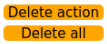

# 2. Robotic Arm Basic Control User Manual

## 2.1 Servo Control Node

The robotic arm is equipped with 6 servos, utilizes Raspberry Pi as the controller, employs an STM32 microcontroller for communication, and implements servo control through the serial port. To facilitate and standardize servo control, it is essential to establish a ROS node as the interface for each servo.


<p id="anchor_2_1_1"></p>

### 2.1.1 Introduction to Servo Control Node

* **Preparation**

(1) Assemble the robotic arm according to the tutorial stored in [1.ArmPi Ultra User Manual-> Accessories Installation and Notes](https://wiki.hiwonder.com/projects/ArmPi-Ultra/en/latest/docs/1.ArmPi_Ultra_User_Manual.html#accessories-installation-and-notes).

(2) Start the robotic arm according to the tutorial saved in [2.ArmPi Ultra User Manual/3. Power-On Description](https://wiki.hiwonder.com/projects/ArmPi-Ultra/en/latest/docs/1.ArmPi_Ultra_User_Manual.html#power-on-description).

(3) Access the robotic arm system desktop according to the tutorials locating in [ArmPi Ultra User Manual->1.6 Development Environment Setup and Configuration](https://wiki.hiwonder.com/projects/ArmPi-Ultra/en/latest/docs/1.ArmPi_Ultra_User_Manual.html#development-environment-setup-and-configuration).

* **Initiate Servo Control Node**

(1) Click on  to launch the command bar, enter the command, and press Enter to disable the auto-start service.

```
~/.stop_ros.sh
```

(2) Run the command to initiate the robotic arm SDK file.

```
ros2 launch sdk armpi_ultra.launch.py
```

(3) Open a new command terminal and enter the command to check the topics published after the robotic arm node has started. The bus_servo/set_position topic is used to control the servo movement.

```
ros2 topic list
```


### 2.1.2 Servo Control Through Topic

* **Terminal Control**

Open a new terminal and enter the following command:

```
ros2 topic pub /ros_robot_controller/bus_servo/set_position ros_robot_controller_msgs/msg/ServosPosition '{"position": \[{"id": 1, "position": 300}\]}'
```

This command allows you to configure three parameters: servo_id: the servo ID, ranging from 1 to 6

position: the servo angle, ranging from 0 to 1000

In this example, the servo with ID 1 is set to rotate to position 300.


### 2.1.3 Initiate App Auto-Start Service

(1) After completing the feature, you need to initiate the app service. **Otherwise, future APP features may not function properly.** In the terminal, enter the following command and press Enter to start the app service. Wait a few seconds for it to initialize.

```
ros2 launch bringup bringup.launch.py
```

(2) Once it is successfully started, the robotic arm will return to its initial pose, and the buzzer will beep once.

* **Control with Python File**

(1) In the terminal, enter the following command to launch the servo control node:

```
ros2 launch sdk armpi_ultra.launch.py
```

(2) Next, run the following command to start the feature. You will see the servo 4 of the robotic arm rotating back and forth between 200–500, while the terminal continuously prints out servo topic messages:

```
python3 ~/ros2_ws/src/example/example/simple/include/bus_servo_node.py
```


* **Control with launch File**

(1) In the terminal window where the SDK file is running, press **Ctrl+C** to stop it.

(2) Then enter the following command to start the servo control. The launch file will call **bus_servo_node.py**:

```
ros2 launch example bus_servo.launch.py
```

(3) After starting, you will see the servo 4 of the robotic arm rotating back and forth between 200–500, and the terminal will print out servo topic messages.


(4) To stop the program, press **Ctrl + C** in the terminal window. If the program does not stop immediately, repeat this step until it terminates.

### 2.1.4 Program Brief Analysis

* **launch File Analysis**

(1) Function generate_launch_description

{lineno-start=9}

```
def generate_launch_description():
    compiled = os.environ['need_compile']
    
    if compiled == 'True':
        robot_controller_package_path = get_package_share_directory('ros_robot_controller')
    else:
        robot_controller_package_path = '/home/ubuntu/ros2_ws/src/driver/ros_robot_controller'


    robot_controller_launch = IncludeLaunchDescription(
        PythonLaunchDescriptionSource([os.path.join(robot_controller_package_path, 'launch/ros_robot_controller.launch.py')
        ]),
    )

    
    bus_servo_node = Node(
        package='example',
        executable='bus_servo',
        output='screen',
            )

    return LaunchDescription([
        robot_controller_launch,
        bus_servo_node
    ])
```

Includes the **ros_robot_controller/launch/ros_robot_controller.launch.py** file to start the robot controller–related nodes. Defines the bus_servo_node node, which launches the bus_servo executable from the example package.

(2) Main Program

{lineno-start=35}

```
if __name__ == '__main__':
    # Create a LaunchDescription object（创建一个LaunchDescription对象）
    ld = generate_launch_description()

    ls = LaunchService()
    ls.include_launch_description(ld)
    ls.run()
```

Creates a LaunchDescription object and a LaunchService service. The launch description is added to the service and executed, enabling the startup of the entire system.

* **Python File Analysis**

(1) Import the Necessary Libraries

{lineno-start=4}

```
import time
import rclpy
from rclpy.node import Node
from std_srvs.srv import Trigger
from ros_robot_controller_msgs.msg import ServoPosition, ServosPosition
```

`ServoPosition`, `ServosPosition`: Custom ROS message types representing a single servo position and multiple servo positions. They are imported from the ros_robot_controller_msgs.msg package.

(2) ServoController Class

{lineno-start=10}

```
class ServoController(Node):
    def __init__(self):
        super().__init__('servo_control_demo')
        self.pub = self.create_publisher(ServosPosition, '/ros_robot_controller/bus_servo/set_position', 1)

        # Wait for the underlying robotic arm control service to start（等待机械臂底层控制服务启动）
        self.client = self.create_client(Trigger, '/ros_robot_controller/init_finish')
        self.client.wait_for_service()
```

Initialize the ROS node named servo_control_demo, create a servo position publisher with the topic /ros_robot_controller/bus_servo/set_position, and wait for the robot controller initialization service /ros_robot_controller/init_finish to become available to ensure that the underlying control is ready.

(3) set_servo_position Class

{lineno-start=19}

```
    def set_servo_position(self, duration, positions):
        msg = ServosPosition()
        msg.duration = float(duration)
        position_list = []
        for i in positions:
            position = ServoPosition()
            position.id = i[0]
            position.position = int(i[1])
            position_list.append(position)
        msg.position = position_list
        self.pub.publish(msg)
        for pos in position_list:
            self.get_logger().info(f'duration={msg.duration}, id={pos.id}, position={pos.position}')
```

Construct a servo position message of type ServosPosition, set the motion duration and the list of target positions. Iterate through the input position tuples, which contain the servo ID and the target position, and for each servo, create a ServoPosition message that includes the ID and position information. Publish the message to the servo control topic and log the duration, servo ID, and target position.

(4) main Function

{lineno-start=33}

```
def main(args=None):
    rclpy.init(args=args)
    controller = ServoController()

    try:
        while rclpy.ok():
            controller.set_servo_position(0.5, ((4, 200),))  # Set servo ID 4 to position 200（设置舵机 ID 4 到位置 200）
            time.sleep(0.5)  # 等待 0.5 秒
            controller.set_servo_position(0.5, ((4, 500),))  # Set servo ID 4 to position 500（设置舵机 ID 4 到位置 500）
            time.sleep(0.5)  # Wait for 0.5 seconds（等待 0.5 秒）
    except KeyboardInterrupt:
        pass
    finally:
        controller.destroy_node()  # Clean up the node（清理节点）
        rclpy.shutdown()  # Shut down ROS 2（关闭 ROS 2）
```

Main function initializes ROS 2 and creates an instance of the ServoController node. In a loop, it uses the set_servo_position method to alternate the movement of servo 4 between positions 200 and 500, pausing for 0.5 seconds each time. It handles keyboard interrupts (KeyboardInterrupt) by cleaning up the node and shutting down ROS 2.

## 2.2 LED Control Node

The STM32 controller has an onboard LED. The Raspberry Pi serves as the main controller and communicates with the STM32 via the serial port to control the LED. To make LED control more convenient and standardized, a ROS node is set up to serve as the interface for the LED.

### 2.2.1 Introduction to LED Control Node

* **Preparation**

(1) Assemble the robotic arm according to the tutorial stored in  [1. ArmPi Ultra User Manual/1.2 Accessories Installation and Notes](https://wiki.hiwonder.com/projects/ArmPi-Ultra/en/latest/docs/1.ArmPi_Ultra_User_Manual.html#accessories-installation-and-notes).

(2) Start the robotic arm according to the tutorial saved in [1. ArmPi Ultra User Manual->1.3 Power-On Description](https://wiki.hiwonder.com/projects/ArmPi-Ultra/en/latest/docs/1.ArmPi_Ultra_User_Manual.html#power-on-description).

(3) Access the robotic arm system desktop according to the tutorials locating in [1. ArmPi Ultra User Manual->1.6 Development Environment Setup and Configuration](https://wiki.hiwonder.com/projects/ArmPi-Ultra/en/latest/docs/1.ArmPi_Ultra_User_Manual.html#development-environment-setup-and-configuration)

* **Initiate LED Control Node**

(1) Click  to open the command terminal, enter the following command, and press Enter. Note that the password input will not be displayed, press Enter after typing it. This will stop the auto-start ROS service.

```
~/.stop_ros.sh
```

(2) Run the command to initiate the robotic arm SDK file.

```
ros2 launch sdk armpi_ultra.launch.py
```

(3) Open a new terminal and enter the following command to view the topics launched by the robotic arm nodes.

```
ros2 topic list
```


|           **Topic**           |         **Function**          |
|:-----------------------------:|:-----------------------------:|
| /ros_robot_controller/set_led | Control the on/off of the LED |

### 2.2.2 LED Control Through Topic

* **Terminal Control**

(1) Open a new terminal and enter the following command:

```
ros2 topic pub --once /ros_robot_controller/set_led ros_robot_controller_msgs/msg/LedState "{id: 2,on_time: 0.1,off_time: 0.2,repeat: 10}"
```

Four configurable parameters are available:

① id specifies the LED ID. The onboard LED on the STM32 controller has an ID of 2.

② on_time sets how long the LED stays on, in seconds.

③ off_time sets how long the LED stays off, in seconds.

④ repeat determines how many times the LED cycles on and off.

(2) After configuring the parameters, press Enter to run the program.


(3) To exit, press **Ctrl+C**. If it does not exit successfully, press Ctrl+C multiple times.

* **Control with Python File**

(1) Run the command to initiate the robotic arm SDK file.

```
ros2 launch sdk armpi_ultra.launch.py
```

(2) Enter the command to start the feature. You will see the onboard LED on the STM32 controller blink blue ten times and then stop, while the terminal displays the LED parameter information.

```
python3 ~/ros2_ws/src/example/example/simple/include/led_node.py
```


* **Control with a launch File**

(1) In the terminal window where the SDK file is running, press **Ctrl+C** to stop it.

(2) Then enter the following command to start the servo control. The launch file will call **led_node.py**:

```
ros2 launch example led.launch.py
```

(3) When starting the feature, you will see the onboard LED on the STM32 controller blink blue ten times and then stop, while the terminal displays the LED parameter information.


(4) To stop the program, press **Ctrl + C** in the terminal window. If the program does not stop immediately, repeat this step until it terminates.

### 2.2.3 Initiate App Auto-Start Service

(1) After completing the feature, you need to initiate the app service. **Otherwise, future APP features may not function properly.** In the terminal, enter the following command and press Enter to start the app service. Wait a few seconds for it to initialize.

```
ros2 launch bringup bringup.launch.py
```

(2) Once it is successfully started, the robotic arm will return to its initial pose, and the buzzer will beep once.

### 2.2.4 Program Brief Analysis

* **launch File Analysis**

(1) Function generate_launch_description

{lineno-start=9}

```
def generate_launch_description():
    compiled = os.environ['need_compile']

    if compiled == 'True':
        robot_controller_package_path = get_package_share_directory('ros_robot_controller')
    else:
        robot_controller_package_path = '/home/ubuntu/ros2_ws/src/driver/ros_robot_controller'


    robot_controller_launch = IncludeLaunchDescription(
        PythonLaunchDescriptionSource([os.path.join(robot_controller_package_path, 'launch/ros_robot_controller.launch.py')
        ]),
    )


    
    led_node = Node(
        package='example',
        executable='led',
        output='screen',
            )

    return LaunchDescription([
        robot_controller_launch,
        led_node
    ])
```

Includes the **ros_robot_controller/launch/ros_robot_controller.launch.py** file to start the robot controller–related nodes. Define the led_node node, launch the led executable in the example package, and output logs to the screen.

(2) Main Program

{lineno-start=36}

```
if __name__ == '__main__':
     # Create a LaunchDescription object（创建一个LaunchDescription对象）
    ld = generate_launch_description()

    ls = LaunchService()
    ls.include_launch_description(ld)
    ls.run()
```

Creates a LaunchDescription object and a LaunchService service. The launch description is added to the service and executed, enabling the startup of the entire system.

* **Python File Analysis**

(1) Import the Necessary Libraries

{lineno-start=4}

```
import rclpy
from rclpy.node import Node
from std_srvs.srv import Trigger
from ros_robot_controller_msgs.msg import LedState
```

LedState is a custom message type used to describe the state of an LED light.

(2) LedController Class

{lineno-start=9}

```
class LedController(Node):
    def __init__(self):
        super().__init__('led_controller')
        self.publisher = self.create_publisher(LedState, '/ros_robot_controller/set_led', 10)
        
        # Wait for the underlying robotic arm control service to start（等待机械臂底层控制服务启动）
        self.client = self.create_client(Trigger, '/ros_robot_controller/init_finish')
        self.client.wait_for_service()
        self.publish_led_state()
```

Initialize a ROS node named led_controller, create an LED state publisher on the topic /ros_robot_controller/set_led, wait for the robot controller initialization service /ros_robot_controller/init_finish to start to ensure the underlying control is ready, and then call the publish_led_state method to send LED control messages.

(3) Function publish_led_state

{lineno-start=21}

```
    def publish_led_state(self):
        msg = LedState()
        msg.id = 2
        msg.on_time = 0.1
        msg.off_time = 0.5
        msg.repeat = 10

        self.publisher.publish(msg)
        self.get_logger().info(f'Published LED State: id={msg.id}, on_time={msg.on_time}, off_time={msg.off_time}, repeat={msg.repeat}')
```

Construct an LED state message using LedState, set the target LED ID to 2 (id=2), the on time to 0.1 seconds(on_time=0.1), the off time to 0.5 seconds(off_time=0.5), and the repeat count to 10(repeat=10). Then, publish the message to the LED control topic and log the LED control parameters to the console.

(4) main Function

{lineno-start=31}

```
def main(args=None):
    rclpy.init(args=args)
    led_controller = LedController()

    rclpy.spin_once(led_controller)  # Publish once（发布一次）
    rclpy.shutdown()
```

Initialize ROS 2 and create an instance of the LedController node. Use rclpy.spin_once to execute the node callback once, completing the publication of the LED state message. Shut down ROS 2 and exit the program.

## 2.3 Buzzer Control Node

The STM32 controller comes with an onboard buzzer. The Raspberry Pi serves as the main controller and communicates with the STM32 via the serial port to control the buzzer. To make buzzer control more convenient and standardized, a ROS node is set up to serve as the interface for the buzzer.

### 2.3.1 Introduction to Buzzer Control Node

* **Preparation**

(1) Assemble the robotic arm according to the tutorial stored in [ArmPi Ultra User Manual->1.2 Accessories Installation and Notes](https://wiki.hiwonder.com/projects/ArmPi-Ultra/en/latest/docs/1.ArmPi_Ultra_User_Manual.html#accessories-installation-and-notes)

(2) Start the robotic arm according to the tutorial saved in [ArmPi Ultra User Manua->1.3 Power-On Description](https://wiki.hiwonder.com/projects/ArmPi-Ultra/en/latest/docs/1.ArmPi_Ultra_User_Manual.html#power-on-description).

(3) Access the robotic arm system desktop according to the tutorials locating in [1. ArmPi Ultra User Manual->1.6 Development Environment Setup and Configuration](https://wiki.hiwonder.com/projects/ArmPi-Ultra/en/latest/docs/1.ArmPi_Ultra_User_Manual.html#development-environment-setup-and-configuration).

* **Initiate Buzzer Control Node**

(1) Click  to open the command terminal, enter the following command, and press Enter. Note that the password input will not be displayed, press Enter after typing it. This will stop the auto-start ROS service.

```
~/.stop_ros.sh
```

(2) Run the command to initiate the robotic arm SDK file.

```
ros2 launch sdk armpi_ultra.launch.py
```

(3) Open a new terminal and enter the following command to view the topics launched by the robotic arm nodes.

```
ros2 topic list
```


|            **Topic**             |         **Function**          |
|:--------------------------------:|:-----------------------------:|
| /ros_robot_controller/set_buzzer | Enable and disable the buzzer |

### 2.3.2 Buzzer Control Through Topic

* **Terminal Control**

(1) Open a new terminal and enter the following command:

```
ros2 topic pub --once /ros_robot_controller/set_buzzer ros_robot_controller_msgs/msg/BuzzerState "{freq: 1900, on_time: 0.1,off_time: 0.2,repeat: 10}"
```

Four configurable parameters are available:

① freq: the buzzer frequency, ranging from 2 to 4 kHz. A higher frequency produces a higher pitch.

② on_time: the duration of the buzzer sound, in seconds.

③ off_time: the duration of silence between beeps, in seconds.

④ repeat: the number of on/off cycles the buzzer will perform.

(2) After configuring the parameters, press Enter to run the program.


(3) To exit, press **Ctrl+C**. If it does not exit successfully, press **Ctrl+C** multiple times.

* **Control with Python File**

Run the command to start the feature. The buzzer will beep ten times and then stop, while the terminal prints out the buzzer parameter information.

```
python3 ~/ros2_ws/src/example/example/simple/include/buzzer_node.py
```

(4) Control with launch File

① In the terminal window where the SDK file is running, press **Ctrl+C** to stop it.

② Then enter the following command to start the servo control. The launch file will call **buzzer.py**:

```
ros2 launch example buzzer.launch.py
```


After starting the feature, you will hear the onboard buzzer of the 32 driver board beep ten times and then stop, while the terminal displays the buzzer parameter information.

(5) To stop the program, press **Ctrl + C** in the terminal window. If the program does not stop immediately, repeat this step until it terminates.

### 2.3.3 Initiate App Auto-Start Service

(1) After completing the feature, you need to initiate the app service. **Otherwise, future APP features may not function properly.**

(2) In the terminal, enter the following command and press Enter to start the app service. Wait a few seconds for it to initialize.

```
ros2 launch bringup bringup.launch.py
```

(3) Once it is successfully started, the robotic arm will return to its initial pose, and the buzzer will beep once.

### 3.4 Program Brief Analysis

* **launch File Analysis**

① Function generate_launch_description

{lineno-start=9}

```
def generate_launch_description():
    compiled = os.environ['need_compile']

    if compiled == 'True':
        robot_controller_package_path = get_package_share_directory('ros_robot_controller')
    else:
        robot_controller_package_path = '/home/ubuntu/ros2_ws/src/driver/ros_robot_controller'


    robot_controller_launch = IncludeLaunchDescription(
        PythonLaunchDescriptionSource([os.path.join(robot_controller_package_path, 'launch/ros_robot_controller.launch.py')
        ]),
    )

    buzzer_node = Node(
        package='example',
        executable='buzzer',
        output='screen',
            )

    return LaunchDescription([
        robot_controller_launch,
        buzzer_node
    ])
```

Includes the `ros_robot_controller/launch/ros_robot_controller.launch.py` file to start the robot controller–related nodes, which provides underlying hardware control support. Define the buzzer_node node, launch the buzzer executable from the example package, and output logs to the screen to control the buzzer.

② Main Function

{lineno-start=34}

```
if __name__ == '__main__':
    # Create a LaunchDescription object（创建一个LaunchDescription对象）
    ld = generate_launch_description()

    ls = LaunchService()
    ls.include_launch_description(ld)
    ls.run()

```

Creates a LaunchDescription object and a LaunchService service. The launch description is added to the service and executed, enabling the startup of the entire system.

* **Python File Analysis**

(1) Import the Necessary Libraries

{lineno-start=5}

```
import time
import rclpy
from rclpy.node import Node
from std_srvs.srv import Trigger
from ros_robot_controller_msgs.msg import BuzzerState
```

BuzzerState: A custom message type used to set the buzzer state.

(2) BuzzerController Class

{lineno-start=11}

```
class BuzzerController(Node):
    def __init__(self):
        super().__init__('buzzer_controller')
        self.pub = self.create_publisher(BuzzerState, '/ros_robot_controller/set_buzzer', 1)

        # Wait for the underlying robotic arm control service to start（等待机械臂底层控制服务启动）
        self.client = self.create_client(Trigger, '/ros_robot_controller/init_finish')
        self.client.wait_for_service()

```

Initialize a ROS node named buzzer_controller and create a buzzer state publisher on the topic /ros_robot_controller/set_buzzer. Wait for the robot controller's initialization service /ros_robot_controller/init_finish to start to ensure that the underlying control is ready.

(3) Function set_buzzer

{lineno-start=20}

```
    def set_buzzer(self, freq, on_time, off_time, repeat):
        msg = BuzzerState()
        msg.freq = freq
        msg.on_time = on_time
        msg.off_time = off_time
        msg.repeat = repeat
        
        # Publish the message（发布消息）
        self.pub.publish(msg)
        self.get_logger().info(f'Published BuzzerState: freq={msg.freq}, on_time={msg.on_time}, off_time={msg.off_time}, repeat={msg.repeat}')
```

Construct a buzzer state message BuzzerState, set the buzzer parameters including frequency freq, sound duration on_time, silence duration off_time, and repetition count repeat. Publish the message to the buzzer control topic and print logs displaying the buzzer control parameters.

(4) main Function

{lineno-start=31}

```
def main(args=None):
    rclpy.init(args=args)
    controller = BuzzerController()

    # Send the buzzer state（发送蜂鸣器状态）
    controller.set_buzzer(freq=1500, on_time=0.1, off_time=0.5, repeat=10)
    time.sleep(5)
    controller.destroy_node()  # Clean up the node（清理节点）
    rclpy.shutdown()  # Shut down ROS 2（关闭 ROS 2）
```

Initialize ROS 2 and create an instance of the BuzzerController node. Call the set_buzzer method to control the buzzer to operate with a frequency of 1500 Hz, sounding for 0.1 seconds and stopping for 0.5 seconds in each cycle, repeated 10 times. Wait for 5 seconds to ensure the buzzer completes the specified action, then clean up the node and shut down ROS 2.

## 2.4 PC Software Control

### 2.4.1 Introduction to PC Software

The host computer communicates with the microcontroller, sending commands to it and receiving feedback data in return. Typically, the host computer is a PC, where dedicated software, the PC software, is used to control the microcontroller.

This section introduces the interface and functions of the ArmPi Ultra PC software.

* **Launch the PC Software via Desktop Icon**

Double-click the software icon  on the desktop to launch it.

* **Launch the PC Software via Command Line**

(1) Open a new terminal window and navigate to the source code directory:

```
cd software/armpi_ultra_control
```

(2) Then run the following command to start the PC software:

```
python3 main.py
```

* **PC Software Interface Overview**

The PC software interface is shown below. It is divided into five main areas: ① Servo Control Area ② Action Details List ③ Action Group Settings Area ④ Deviation Adjustment Area ⑤ Coordinate Settings Area.


The functions of each area are described as follows:

**①: Servo Control Area**

The servo control area displays the icons of the selected servos. By adjusting the corresponding slider values, you can directly control the position of each servo.

| **Icon** | **Function** |
|:--:|----|
|  | Indicates the servo ID number, for example, 1 is the servo's ID here. |
|  | Adjust the servo position, with a range from 0 to 1000. |
|  | Adjust the servo deviation, with a range from -125 to 125. For detailed information, please refer to section **[2.4.4 Deviation Adjustment](#anchor_2_4_4)** in this document. |

**②: Action Details List**

The Action Details List shows the current action number, execution time, and the position of each servo.


| **Icon** | **Function** |
|:--:|----|
|  | The ID number of the action. |
|  | The time required to execute the action, in milliseconds. |
|  | The values of the servos corresponding to this ID can be modified directly by double-clicking the numbers below. |

**③: Action Group Settings Area**

The action group settings area allows you to add, delete, update, insert, run, open, and integrate actions.

<table  class="docutils-nobg" style="margin:0 auto" border="1">
<colgroup>
<col style="width: 34%" />
<col style="width: 65%" />
</colgroup>
<thead>
<tr>
<th style="text-align: center;"><strong>Icon</strong></th>
<th style="text-align: center;"><strong>Function</strong></th>
</tr>
</thead>
<tbody>
<tr>
<td style="text-align: center;"></td>
<td>Displays the time required to run a single action, click  to modify.</td>
</tr>
<tr>
<td style="text-align: center;"></td>
<td>Shows the total duration required for the action group to run.</td>
</tr>
<tr>
<td style="text-align: center;"></td>
<td>Clicking this will power off the servos, making the joints loose. You can then manually move the robot to design actions. Do not force it if it cannot move, please click again to retry.</td>
</tr>
<tr>
<td style="text-align: center;"></td>
<td>Reads the servo positions when manually moved. This must be used together with the "Manual" button.</td>
</tr>
<tr>
<td style="text-align: center;"></td>
<td>Adds the current servo values from the servo control area as an action to the last row of the action details list.</td>
</tr>
<tr>
<td style="text-align: center;"></td>
<td><p>Delete Action: Deletes the selected action from the action details list.</p>
<p>Delete All: Deletes all actions in the action details list.</p></td>
</tr>
<tr>
<td style="text-align: center;"></td>
<td><p>Replace the selected values in the Action Details List.</p>
<p>The servo values will be replaced with those in the Servo Control Area, and the duration will be replaced by the value in "Duration(ms)".</p></td>
</tr>
<tr>
<td style="text-align: center;"></td>
<td><p>Insert a new action above the selected action.</p>
<p>The inserted action will use the servo values from the Servo Control Area and the duration set in "Duration(ms)".</p></td>
</tr>
<tr>
<td style="text-align: center;"></td>
<td>Moves the selected action up one row.</td>
</tr>
<tr>
<td style="text-align: center;"></td>
<td>Moves the selected action down one row.</td>
</tr>
<tr>
<td style="text-align: center;"></td>
<td><p>Clicks to run the actions in Action Details List once.</p>
<p>If "Loop" is checked, the robot will repeat the sequence.</p></td>
</tr>
<tr>
<td style="text-align: center;"></td>
<td><p>Clicks and selects an action group file to load its data into the Action Details List.</p>
<p>The action files are located at:</p>
<p>/home/ubuntu/software/armpi_ultra_control/ActionGrourps</p></td>
</tr>
<tr>
<td style="text-align: center;"></td>
<td><p>Save the actions currently in the Action Details List to a specified location.</p>
<p>The action files are located at:</p>
<p>/home/ubuntu/software/armpi_ultra_control/ActionGrourps</p></td>
</tr>
<tr>
<td style="text-align: center;"></td>
<td>After opening an action group, clicking the "Integrate file" button and then opening another action group file allows you to merge the two action groups into a new one.</td>
</tr>
<tr>
<td style="text-align: center;"></td>
<td>Displays the saved action groups in the computer.</td>
</tr>
<tr>
<td style="text-align: center;"></td>
<td>Executes the selected action group once.</td>
</tr>
<tr>
<td style="text-align: center;"></td>
<td>Stops the currently running action group.</td>
</tr>
<tr>
<td style="text-align: center;"></td>
<td>Exits the current PC software interface.</td>
</tr>
<tr>
<td style="text-align: center;"></td>
<td>Pressing this button refreshes the action group selection list.</td>
</tr>
</tbody>
</table>


④: Deviation Adjustment Area (For detailed information, please refer to section [2.4.4 Deviation Adjustment](#anchor_2_4_4) in this document.)

| **Icon** | **Function** |
|:--:|----|
|  | Click to automatically read the saved deviation values. |
|  | Click to upload the adjusted deviation values from the software to the robot. |
|  | Click to reset all servo in the Servo Control Area to position 500. |

**⑤ Coordinate Settings Area**

You can set the robotic arm's position by entering values, allowing it to move as a whole along the three-axis coordinates (X, Y, Z) and adjust its motion according to the pitch angle.

### 2.4.2 Action Group Editing and Execution

* **Action Group Editing**

Click the software icon  on the desktop to launch it.

**Step 1:** First, set the robotic arm to its initial posture by clicking "**Reset servo**" for the servos. Then, drag the servo sliders as shown in the figure. Click the "**Add action**" button on the right to add this action to the action details list.


**Step 2:** Set the action duration to 800 ms by moving the cursor to the duration box, entering 800, and clicking "**Update action**" to sync the duration.


**Step 3:** Next, move the robotic arm to the left. In the control area on the left, slide the ID 6 servo according to the values shown in the figure. Click "**Add action**" to add it to the action list on the right, with the action duration set to 800 ms.


**Step 4:** Add a transition action to make the motion smoother. Select action number 2, set its duration to 200 ms, and click "**Add action**."


**Step 5:** Move the robotic arm to the right. In the left control area, slide the ID 6 servo according to the specified values. Click "**Add action**" to add it to the action list, setting the action time to 800 ms.


**Step 6:** To ensure smooth motion, use the fifth action as a transition. Select the fourth action group, click "**Add action**," and set the action duration to 200 ms.


**Step 7:** Next, control the gripper to open and close by adjusting the ID 1 servo slider. Set the duration to 400 ms and add it as the sixth action.


**Step 8:** Use the seventh action as a transition for the sixth action, setting the duration to 200 ms.


**Step 9:** Finally, create the eighth action to further adjust the gripper.


* **Save Edited Action**

For facilitating the consequent debugging and management convenience, it is advisable to save this action. Click the "**Save action file**" button. In the dialog that opens, set the path to **/home/ubuntu/software/armpi_ultra_control/ActionGroups** and name the file, for example, "**spin**." Then click **Save**. Make sure to use English characters when naming the file, as using Chinese characters may cause the action to fail when called.


* **Action Group Execution**

(1) Open a new terminal window and navigate to the source code directory:

```
cd software/armpi_ultra_control
```

(2) Enter the command to open the source code files.

```
vim control_demo.py
```

(3) Enter the name of the action group in the place circled by red box. **The action group must be saved in the ActionGroups folder under the current path, and the name entered in the red box should not include the file extension but be provided as a string.**


(4) Enter the command **python3 control_demo.py** to run the program and execute the configured action group.


### 2.4.3 Integrate Action Files

**Step 1:** After connecting to the system remotely, launch the PC software.


**Step 2:** Click the "**Integrate file**" button in the Action Group Settings area, navigate to the directory **/home/ubuntu/software/armpi_ultra_control/ActionGroups**, and select **spin.d6a**, then double-click to open it.


**Step 3:** The Action Details List now displays the parameters for the "spin" action group.


**Step 4:** Click "**Integrate file**" again, select **OK.d6a**, and double-click to open it. The "OK" action group is now integrated into the list.


**Step 5:** Click on the action **1**, then click "**Run**" to execute the newly concatenated action group online.


**Step 6:** Click the "**Save action file**" button to save the new integrated action group for future testing and debugging. **Make sure to use English for the file name, as using Chinese may cause the action group to fail to execute.**


<p id="anchor_2_4_4"></p>

### 2.4.4 Deviation Adjustment

During the robot's operation, if the servo shafts become misaligned due to replacement or other adjustments, calibration is required. There are two types of deviations to consider: **minor deviation** and **major deviation**. The calibration method varies depending on the situation.

* **Preparation**

(1) Assemble the robotic arm according to the tutorial stored in [1. ArmPi Ultra User Manual-> Accessories Installation and Notes](https://wiki.hiwonder.com/projects/ArmPi-Ultra/en/latest/docs/1.ArmPi_Ultra_User_Manual.html#accessories-installation-and-notes).

(2) Start the robotic arm according to the tutorial saved in [1. ArmPi Ultra User Manual->1.3 Power-On Description](https://wiki.hiwonder.com/projects/ArmPi-Ultra/en/latest/docs/1.ArmPi_Ultra_User_Manual.html#power-on-description).

(3) Access the robotic arm system desktop according to the tutorials locating in [1. ArmPi Ultra User Manual/6. Development Environment Setup and Configuration](https://wiki.hiwonder.com/projects/ArmPi-Ultra/en/latest/docs/1.ArmPi_Ultra_User_Manual.html#development-environment-setup-and-configuration).

* **Determine Minor and Major Deviation**

(1) After remotely connecting to the robot, click the PC software icon  on the system desktop.

(2) Switch the language to English via the voice option in the top-left corner. Then click "**Reset servo**" in the software to let the robotic arm stand upright.


(3) If after the servo reset, the main screws of servos 3 to 5 form a straight line as shown in the figure below, hereafter referred to as the center line.


(4) Servo 6 is parallel to the metal casing as shown in the figure:


(5) The metal casing above servo 2 is parallel to the camera casing, and the gripper at servo 1 is slightly open, then the robotic arm does not require deviation adjustment and this section can be skipped.


(6) If the angle between a servo and the center line is less than 30° and it can be corrected through the PC software, it is considered a minor deviation. You can adjust it following the [2.4.4 Deviation Adjudtment -> Minor Deviation Adjustment](#anchor_2_4_4_3) section in this document. For example, the deviation of servo 3 is shown below.


> [!NOTE]
>
> The servo-to-center line angle is calculated as follows:
>
> The software slider range is 0–1000, while the servo's actual rotation range is 0–240 degrees. Therefore, each slider unit corresponds to 0.24 degrees (240 ÷ 1000).
>
> The adjustment range of the small slider is ±125, which corresponds to a minor deviation adjustment range of 125 × 0.24 = 30°.

(7) If the angle between a servo and the center line is greater than 30° and cannot be corrected even when the slider is set to its limit (±125), it is considered a major deviation, which should be corrected using the method in 4.4.4 Major Deviation Adjustment of this document. An example using servo 3 is shown below.


<p id="anchor_2_4_4_3"></p>

* **Minor Deviation Adjustment**

(1) Open the PC software and click **Reset servo**. After the robotic arm returns to its neutral pose, click **Read deviation** to load the deviation data from the arm into the PC software.


(2) Taking servo ID 4 as an example, after reading the deviation, you can drag the slider under ID 4 in the PC software to adjust the deviation.

**Note that minor deviation can be adjusted directly by dragging the small servo deviation slider in the PC software.**

(3) Drag the small slider for servo 4 until the robotic arm forms a straight line. The values shown in the figure are for reference only, you shall adjust it according to the target and actual situation.


(4) Once satisfied, click **Download deviation** to save the adjusted deviation data back to the robotic arm.


* **Major Deviation Adjustment**

For major deviations, the servo must be removed from the U-shaped bracket, reset to central position, and then reinstalled. After installation, repeat the steps for minor deviation adjustment.

(1) Click "**Reset servo**" in the software to let the robotic arm stand upright.


(2) At this point, servo 2 may show a significant deviation exceeding 30°.


(4) **Power off** the robotic arm before proceeding with disassembly.

(5) Remove all screws from the main horn of servo 2 and the main shaft screw on the assistant horn. First remove the four screws around the horn, then the main shaft screw.


(6) Next, remove the U-shaped bracket.


(7) After removal, power on the robot, open the PC software, and click Reset servo. The central position of servo 3 is calibrated now.

> [!NOTE]
>
>Keep the disassembled parts safely. When the robot powers on, it may move to its initial pose, which could cause injury.


(8) Once the servo is reset, power off the robotic arm again and reinstall the corresponding main horn and assistant horn in a cross ("**+**") configuration.


Do not forcefully turn the servo shaft, and ensure the horns are properly aligned. If not, repeat the steps in [2.4.4 Deviation Adjustment ->Major Deviation Adjustment](#anchor_2_4_4_3) of this document.

(9) After installing the horns, align the U-shaped bracket with the holes on both horns and fasten the screws.


(10) Then, power on the device and repeat the steps in [2.4.4 Deviation Adjustment -> Minor Deviation Adjustment](#anchor_2_4_4_3) of this document to fine-tune the deviation.

## 2.5 Using the Servo Debugging Tool

When replacing a new servo, use the servo debugging tool to set the servo ID, central position, and other parameters. The ID numbering of servos can be found in the previous section [2.1.1 Introduction to Servo Control Node](#anchor_2_1_1).

**Important:** Before debugging, ensure **only one servo** is connected to the interface at a time. Connecting multiple servos in series will cause all servos to have the same parameters and prevent independent movement.

### 2.5.1 Servo Debugging Interface Overview

(1) Refer to the tutorial [1. ArmPi Ultra User Manual->1.6 Development Environment Setup and Configuration](https://wiki.hiwonder.com/projects/ArmPi-Ultra/en/latest/docs/1.ArmPi_Ultra_User_Manual.html#development-environment-setup-and-configuration) to establish a connection between the robot and the remote desktop tool.

(2) Open the terminal and enter the following commands:

```
cd ~/software/servo_tool/servo_tool
```

(3) After clicking "**OK**", make sure that only one servo is connected to the bus servo interface.

```
python3 main.py
```


(4) The interface is divided into two sections: ① Servo parameter settings area ② Servo parameter confirmation buttons. The functions are explained as follows:


| **Icon** | **Function** |
|:--:|----|
|  | Read the current servo parameters. |
|  | Apply the current parameter settings to the servo. |
|  | Restore the servo to its default parameters. |
|  | Exit the servo debugging tool. |
|  | Set the servo ID, with range from -1 ~ 255. |
|  | Adjust the servo deviation. |
|  | Adjust the servo working temperature range (default: 85 °C). |
|  | You can adjust the servo's rotation range as needed. In the ArmPi Ultra robotic arm, the servo rotation range is 0–1000. |
|  | You can adjust the servo's operating voltage range. This allows you to limit the servo's voltage and provide voltage protection. |
|  | Displays the servo's current ID, position, voltage, and temperature. |
|  | Drag the slider to adjust the servo's rotation position. Press the reset button to return to position 500.2. |

### 2.5.2 Servo Debugging Steps

(1) Connect the servo individually to the servo interface.

(2) Open the terminal and enter the following command to start the servo debugging tool. After launching, make sure that **only one servo is connected to the bus servo interface**.

```
python3 ~/software/servo_tool/servo_tool/main.py
```


(3) Click the **Read** button.


(4) In this example, servo ID 3 is used. Set the servo ID. Other parameters can remain as default, or be configured as needed.


(5) Once finished, click **Setting** to apply the settings.


(6) After setting the servo ID, you can proceed to the section [2.4.4 Deviation Adjustment](#anchor_2_4_4) in this document for servo disassembly and assembly.