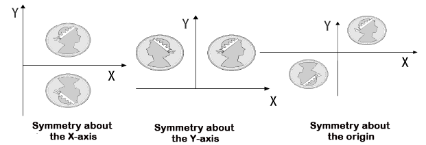
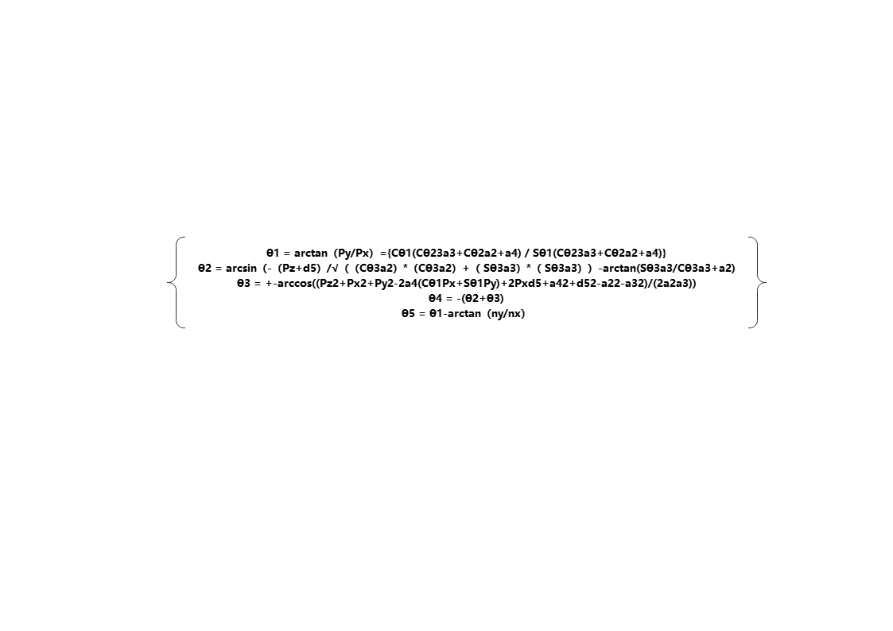

# 3. Robotic Arm Advanced Control User Manual

## 3.1 Homogeneous Coordinate Transformation

### 3.1.1 Introduction to Homogeneous Coordinates

Homogeneous coordinate transformation is a mathematical tool widely used in computer graphics, robotics, and computer vision to describe the transformation relationships between coordinate systems. Its primary purpose is to simplify complex geometric transformations—such as translation, rotation, scaling, and projection—by expressing and computing them in a more unified and concise form.

In a two-dimensional plane, a point's exact position is represented by a pair of coordinates (x,y). If the coordinates of a point before transformation is (x,y), and after transformation are (x\*,y \*), the transformation process can be written in the following matrix form:


This method of using a three-dimensional vector to represent a two-dimensional vector—or more generally, using an n+1-dimensional vector to represent an n-dimensional vector—is called homogeneous coordinate representation.

There is a 'one-to-many' relationship between ordinary coordinates and homogeneous coordinates:

Ordinary coordinates × h Homogeneous coordinates

Homogeneous coordinates ÷ h → Ordinary coordinates

When h = 1, the obtained homogeneous coordinates are called 'normalized coordinates' because the first n coordinates correspond to n-dimensional coordinates in the ordinary coordinate system.

### 3.1.2 Role of Homogeneous Coordinates

By adopting homogeneous coordinate representation, two-dimensional linear transformations can be uniformly expressed in the normalized form shown below.


For a geometric figure, the vertex table can be used to describe its geometric relationships, while the edge table describes its topological relationships. Therefore, transformations of the figure ultimately reduce to transformations of the vertex table.

### 3.1.3 Transformations

Translation Transformation

Translation refers to the relocation process in which point P is shifted along a straight path from one coordinate position to another.


The homogeneous coordinate calculation is expressed as follows:


Translation is a rigid-body transformation that moves an object without deformation, meaning that every point of the object is shifted by the same displacement.

* **Scaling Transformation**


The homogeneous coordinate calculation is expressed as follows:


The scaling factors Sx and Sy can be assigned any positive values. If the values are less than 1, the object is reduced in size. If the values are greater than 1, the object is enlarged. If both are set to 1, the object retains its original size.

\(1\) Sx = Sy Ratio


\(2\) Sx \<\> Sy Ratio


When Sx = Sy, the scaling transformation becomes a uniform scaling transformation, which is calculated using the following matrix:


* **Symmetry Transformation**

The symmetry transformation, also known as reflection or mirror transformation, produces a figure that is the mirror image of the original figure with respect to a specific axis or the origin.




Symmetry with respect to the x-axis:


Symmetry with respect to the y-axis:


* **Rotation Transformation**

Two-dimensional rotation refers to the process of repositioning point P by rotating it around the coordinate origin at a certain angle θ, with counterclockwise as positive and clockwise as negative, to obtain a new point P\*. The transformation equation for the rotation of point P is initially determined with the origin as the reference point.


## 3.2 DH Modeling

### 3.2.1 DH Modeling Overview

* **Introduction to DH Modeling**

The DH (Denavit-Hartenberg) modeling method is a joint modeling approach based on homogeneous transformation matrices. It is commonly used to describe the geometric relationships and kinematics between robotic arm joints. As one of the standard methods in mechanical engineering, DH modeling is widely applied to establish kinematic models of robotic arms. The core idea of DH modeling is to represent each joint of the robot arm as a rigid body link connected by either rotation or translation. A set of DH parameters defines the relative positions and motions of these joints, enabling both forward and inverse kinematics calculations.

The basic idea of DH modeling is to treat each joint of the robotic arm as a rigid link with either rotation or translation, and then simulate the overall motion of the arm through a sequence of rotations and translations.

* **Role of DH Modeling**

DH modeling is mainly applied in robot kinematics. The method assigns a coordinate frame to each link and uses homogeneous coordinate transformations to map between adjacent link frames. In multi-link serial mechanisms, repeated application of homogeneous transformations allows the relationship between the base frame and the end-effector frame to be established.

* **Steps for DH Modeling**

(1) List


(2) Modeling

① Define the initial position and assign labels to links and joints. In general, the initial position of a robotic arm is considered to be fully extended upwards, with the lateral joint pointing along the x-axis. The figure on the right shows the link structure diagram.


② Confirm each joint axis and the z-axis. The joint axis corresponds to the axis of rotation or translation. The z-axis is chosen as the current axis, with arbitrary direction. Here, the opposite direction of motor rotation is selected. Different methods may yield different results, so be mindful of the subscript notation. The subscript of the z-axis indicates the corresponding coordinate system number.


* **Establishment of Joint Coordinate Systems**

First, determine the origin of coordinate system {i}. Then, determine the x_i axis. In SDH (Standard Denavit-Hartenberg), if axis {i} and axis {i-1} intersect, the intersection point becomes the origin. The x_i axis lies on the perpendicular line in the plane defined by the two axes, direction arbitrary. If they do not intersect, the origin is defined as the intersection of the common perpendicular line and joint axis i. The x_i axis lies along the common perpendicular, with arbitrary direction. In MDH (Modified Denavit-Hartenberg), if axis {i} and axis {i+1} intersect, the intersection is the origin. The x_i axis is perpendicular to both axes, lying in their plane, direction arbitrary. If they do not intersect, the origin is defined as the intersection of the common perpendicular line and joint axis i. The x_i axis lies along the common perpendicular, with arbitrary direction. Since two axes may be parallel, multiple common perpendiculars may exist. Because the x-axis, z-axis, and origin are flexible, different parameter models can be constructed.

* **Addition of Base and End Coordinate Systems**

In SDH, {0} is already defined, so add {6} at the end. In MDH, {6} is already defined, so add {0} at the beginning. The choice of base and end coordinate systems depends on practical needs and your preference.

The process of establishing the coordinate system is as follows:


> [!NOTE]
>
>Because of the flexibility in choosing the z-axis, x-axis, and origin, the above is just one example of how to establish coordinate systems. The actual setup should be adjusted as needed.

* **D-H Parameter Determination**

Refer back to the table created in Step 1 and fill it row by row. Ignore subscripts initially to avoid confusion. Both SDH and MDH transformations are applied from {i-1} to {i}, so when filling row i, only the relationship between these two coordinate systems matters. The order of parameters differs between SDH and MDH.

Here we take the second row of the table as an example. When i = 2, transform coordinate frame {1} into {2}.

For the SDH convention, the order is θ → d → α → a:

① Rotate the x\_{i-1} axis of coordinate system {i-1} about the z\_{i} axis to align with the x\_{i} axis. The rotation angle is θ\_{i}, with the right-hand rule defining the positive direction as the z-axis.

② Translate the x\_{i-1} axis along the z\_{i-1} axis to the x\_{i} axis by a distance of d\_{i}.

③ Using the result of the previous transformation, rotate the z\_{i-1} axis of coordinate system {i-1} about the x\_{i-1} axis to align with the z\_{i} axis. The rotation angle is α\_{i}, with the right-hand rule defining the positive direction as the x-axis.

④ Translate the z\_{i-1} axis along the x\_{i-1} axis to the z\_{i} axis by a distance of a\_{i} until the two coordinate systems coincide.


Following the rules of SDH, the table below can be derived. In the diagram above, theta_2 is set to -90, but since it is a variable parameter, we designate it as q2.


The order for MDH is α → a → θ → d.

① Rotate the z\_{i-1} axis of coordinate system {i-1} about the x\_{i} axis to align with the z\_{i} axis. The rotation angle is α\_{i-1}, with the right-hand rule defining the positive direction as the z-axis.

② Translate the z\_{i-1} axis along the x\_{i-1} axis to the z\_{i} axis by a distance of a\_{i-1}.

③ Using the result of the previous transformation, rotate the x\_{i-1} axis of coordinate system {i-1} about the z\_{i-1} axis to align with the x\_{i} axis. The rotation angle is θ\_{i}, with the right-hand rule defining the positive direction as the x-axis.

④ Translate the x\_{i-1} axis along the z\_{i-1} axis to the x\_{i} axis by a distance of d\_{i}, until the two coordinate systems coincide.


Following the rules of MDH, the table below can be derived. In the diagram above, theta_2 is set to 90, but since it is a variable parameter, we designate it as q2.


* **Complete Table**

Fill in the table based on the DH method model and engineering drawings. The official two-dimensional drawings and three-dimensional model dimensions are inconsistent. Since the 3D model is mainly used, the 3D drawings were re-measured manually.


### 3.2.2 ArmPi Ultra DH Model

* **ArmPi Ultra DH coordinate system:**


* **DH Model List:**

|  i  | αi-1 |  ai-1   | di  | θi  |    θ Range    |
|:---:|:----:|:-------:|:---:|:---:|:-------------:|
|  1  |  0   |    0    |  0  | θ1  | θ1(-120, 120) |
|  2  | -90  |    0    |  0  | θ2  |  θ2(-180, 0)  |
|  3  |  0   | 0.10048 |  0  | θ3  | θ3(-120, 120) |
|  4  |  0   |  0.100  |  0  | θ4  | θ4(-200, 20)  |
|  5  | -90  |    0    |  0  | θ5  | θ5(-120, 120) |

## 3.3 Forward Kinematics Analysis

### 3.1.1 Introduction to Inverse Kinematics

* **Introduction**

Forward kinematics refers to the process of deriving the motion of the end effector from the joint movements of a robot. It involves calculating the position and orientation information of the end effector based on the joint coordinates of the robot.

Forward kinematics is easier to understand and implement because it directly calculates the position and orientation of the end effector from the robot's joint movements. In robot control, forward kinematics is widely used in trajectory planning, simulation, visualization, and other aspects.

* **Forward Kinematics Logic**

The forward kinematics of a robotic arm is typically expressed in the following functional form:


This equation indicates that the pose of the end effector is a function based on the joint coordinates. If expressed using homogeneous transformations, the expression is a simple product of individual link transformation matrices given by Equation (2). For N links in a robotic arm, the expression becomes:


For any robotic arm, regardless of the number and configuration of its joints, the forward kinematics solution can be calculated. The practical task space for most robotic arms is typically three-dimensional. Controlling the motion of a robotic arm involves providing specific voltage control signals to each joint, causing them to move to specific angles and achieve the desired pose. For a 6-axis robotic arm, the overall matrix transformation is often denoted as T6.

### 3.1.2 ArmPi Ultra Forward Kinematics Analysis

|  i  | αi-1 |  ai-1   | di  | θi  |    θ Range    |
|:---:|:----:|:-------:|:---:|:---:|:-------------:|
|  1  |  0   |    0    |  0  | θ1  | θ1(-120, 120) |
|  2  | -90  |    0    |  0  | θ2  |  θ2(-180, 0)  |
|  3  |  0   | 0.10048 |  0  | θ3  | θ3(-120, 120) |
|  4  |  0   |  0.100  |  0  | θ4  | θ4(-200, 20)  |
|  5  | -90  |    0    |  0  | θ5  | θ5(-120, 120) |

The homogeneous transformation matrix form of DH is as follows:


Obtain the homogeneous transformation matrix for a single joint of ArmPi Ultra:

T(0-1)=\[\[Cθ<sub>1</sub>，-Sθ<sub>1</sub>，0，0\],\[Sθ<sub>1</sub>，Cθ<sub>1</sub>，0，0\],\[0，0，1，0\],\[0，0，0，1\]\]

T(1-2)=\[\[Cθ<sub>2</sub>，0，Sθ<sub>2</sub>，0\],\[0，1，0，0\],\[-Sθ<sub>2</sub>，0，Cθ<sub>2</sub>，0\],\[0，0，0，1\]\]

T(2-3)=\[\[Cθ<sub>3</sub>，-Sθ<sub>3</sub>，0，0\],\[Sθ<sub>3</sub>，Cθ<sub>3</sub>，0，0\],\[0，0，1，0\],\[0，0，0，1\]\]

T(3-4)=\[\[Cθ<sub>4</sub>，-Sθ<sub>4</sub>，0，0\],\[Sθ<sub>4</sub>，Cθ<sub>4</sub>，0，0\],\[0，0，1，0\],\[0，0，0，1\]\]

T(4-5)=\[\[Cθ<sub>5</sub>，0，Sθ<sub>5</sub>，0\],\[0，1，0，0\],\[-Sθ<sub>5</sub>，0，Cθ<sub>5</sub>，0\],\[0，0，0，1\]\]

Multiply the homogeneous coordinates of individual joints to obtain the forward kinematics formula for ArmPi Ultra:

T(0-5)=T(0-1)\*T(1-2)\*T(2-3)\*T(3-4)\*T(4-5)

Due to the fact that the servos 5, 4, and 3 of the robotic arm are all horizontally rotating, T(1-2), T(2-3), and T(3-4) can be simplified using the sum and difference formulas:

T(1-4) = T(1-2)\*T(2-3)\*T(3-4)=\[\[Cθ<sub>234</sub>，-Sθ<sub>234</sub>，0，Cθ<sub>23</sub>a<sub>3</sub>+Cθ<sub>2</sub>a<sub>2</sub>\],

\[ 0， 0， 1，0\],

\[-Sθ<sub>234</sub>，-Cθ<sub>234</sub>，0，-Sθ<sub>23</sub>a<sub>3</sub>-Sθ<sub>2</sub>a<sub>2</sub>\],

\[ 0， 0， 0， 1\]\]

Cθ<sub>234</sub> =cos(θ<sub>2</sub>+θ<sub>3</sub>+θ<sub>4</sub>)

Sθ<sub>234</sub>=sin(θ<sub>2</sub>+θ<sub>3</sub>+θ<sub>4</sub>)

According to the geometric relationship between the robot arm and joint, the following can be obtained.

T(1-4) =\[\[1，0，0，Cθ<sub>23</sub>a<sub>3</sub>+Cθ<sub>2</sub>a<sub>2</sub>\],

\[ 0， 0， 1，0\],

\[0，-1，0，-Sθ<sub>23</sub>a<sub>3</sub>-Sθ<sub>2</sub>a<sub>2</sub>\],

\[ 0， 0， 0， 1\]\]

The robotic arm kinematic formula is obtained as follows:

T(0-5)=\[ \[Cθ<sub>1</sub>Cθ<sub>5</sub>+Sθ<sub>1</sub>Sθ<sub>5</sub>，-Cθ<sub>1</sub>Sθ<sub>5</sub>+Sθ<sub>1</sub>Cθ<sub>5</sub>，0，Cθ1(Cθ<sub>23</sub>a<sub>3</sub>+Cθ<sub>2</sub>a<sub>2</sub>+a<sub>4</sub>)\],

\[Sθ<sub>1</sub>Cθ<sub>5</sub>-Cθ<sub>1</sub>Sθ<sub>5</sub>，-Sθ<sub>1</sub>Sθ<sub>5</sub>-Cθ<sub>1</sub>Cθ<sub>5</sub>， 1，Sθ1(Cθ<sub>23</sub>a<sub>3</sub>+Cθ<sub>2</sub>a<sub>2</sub>+a<sub>4</sub>)\],

\[ 0， 0， -1，-d<sub>5</sub>-Sθ<sub>23</sub>a<sub>3</sub>-Sθ<sub>2</sub>a<sub>2</sub>\],

\[ 0， 0， 0， 1\]\]

### 3.1.3 Introduction to Forward Kinematics Service

* **Preparation**

(1) Assemble the robotic arm according to the tutorial stored in [1. ArmPi Ultra User Manual->1.2 Accessories Installation and Notes](https://wiki.hiwonder.com/projects/ArmPi-Ultra/en/latest/docs/1.ArmPi_Ultra_User_Manual.html#accessories-installation-and-notes).

(2) Start the robotic arm according to the tutorial saved in [1. ArmPi Ultra User Manual->1.3  Power-On Description](https://wiki.hiwonder.com/projects/ArmPi-Ultra/en/latest/docs/1.ArmPi_Ultra_User_Manual.html#power-on-description).

(3) Access the robotic arm system desktop according to the tutorials locating in [1. ArmPi Ultra User Manual->1.6 Development Environment Setup and Configuration](https://wiki.hiwonder.com/projects/ArmPi-Ultra/en/latest/docs/1.ArmPi_Ultra_User_Manual.html#development-environment-setup-and-configuration).

* **Check Kinematics Service**

(1) Click on  to launch the command bar, enter the command, and press Enter to disable the auto-start service.

```
~/.stop_ros.sh
```

(2) Run the command to initiate the robotic arm SDK file.

```
ros2 launch sdk armpi_ultra.launch.py
```

(3) Open a new terminal and enter the following command to access the robotic arm kinematics service.

```
ros2 service list
```


| **Service** | **Function** |
|:--:|:--:|
| /kinematics/describe_parameters | Describe parameters |
| /kinematics/get_current_pose | Get the current pose of the robot |
| /kinematics/get_joint_range | Get the motion range of each robot joint |
| /kinematics/get_link | Get the robot's joint link information |
| /kinematics/get_parameter_types | Get parameter types |
| /kinematics/get_parameters | Get parameters |
| /kinematics/init_finish | Initialization completed |
| /kinematics/list_parameters | List parameters |
| /kinematics/set_joint_range | Set the motion range of robot joints |
| /kinematics/set_joint_value_target | Set target joint angles to achieve pose control |
| /kinematics/set_link | Set the robot's joint link information |
| /kinematics/set_parameters | Set parameters |
| /kinematics/set_parameters_atomically | Set parameters atomically |
| /kinematics/set_pose_target | Set the target pose of the robot's end-effector |
| /kinematics/set_pose_target_smooth | Smoothly set the target pose of the robot's end-effector |

### 3.1.4 Servo Control Topic

* **Invoke Service**

(1) Click  to open a new terminal and enter the following command:

```
ros2 service call /kinematics/set_joint_value_target kinematics_msgs/srv/SetJointValue "{joint_value: \[500.0, 400.0, 300.0, 400.0, 500.0 \]}"
```

(2) By inputting the rotation angles of servos 1-5, you can obtain the pose information of the robotic arm after movement. The information includes coordinates along the XYZ axes and the orientation represented using quaternions. 

> [!NOTE]
>
> The service call here only displays the pose information, while the robotic arm does not physically move.


* **Control with launch File**

(1) Press "**Ctrl+C**" to close the launch file on the terminal where robotic arm SDK file and kinematics file are executed.

(2) Next, enter the command to start the forward kinematics service program. You will see the robotic arm calculate and move to the target position based on the set servo pulse widths, and the terminal will display the related information.

```
ros2 launch example fk.launch.py
```


(3) To stop the program, press **Ctrl + C** in the terminal window. If the program does not stop immediately, repeat this step until it terminates.

* **Initiate App Auto-Start Service**

(1) After completing the feature, you need to initiate the app service. **Otherwise, future APP features may not function properly.** In the terminal, enter the following command and press **Enter** to start the app service. Wait a few seconds for it to initialize.

```
ros2 launch bringup bringup.launch.py
```

(2) Once it is successfully started, the robotic arm will return to its initial pose, and the buzzer will beep once.

### 3.1.5 Program Brief Analysis

* **launch File Analysis**

(1) Function generate_launch_description

{lineno-start=9}

```
def generate_launch_description():
    compiled = os.environ['need_compile']
    
    if compiled == 'True':
        sdk_package_path = get_package_share_directory('sdk')
    else:
        sdk_package_path = '/home/ubuntu/ros2_ws/src/driver/sdk'


    sdk_launch = IncludeLaunchDescription(
        PythonLaunchDescriptionSource([os.path.join(sdk_package_path, 'launch/armpi_ultra.launch.py')
        ]),
    )
    
    fk_node = Node(
        package='example',
        executable='fk',
        output='screen',
            )

    return LaunchDescription([
        sdk_launch,
        fk_node
    ])
```

Includes the **launch/armpi_ultra.launch.py** startup file from the SDK package, used to launch SDK-related nodes, such as the robotic arm's low-level control services. Defines the fk_node node, launching the fk executable from the example package and outputting logs to the screen, used to demonstrate the robotic arm's forward kinematics functionality.

(2) Main Program 

{lineno-start=34}

```
if __name__ == '__main__':
    # 创建一个LaunchDescription对象
    ld = generate_launch_description()

    ls = LaunchService()
    ls.include_launch_description(ld)
    ls.run()

```

Creates a LaunchDescription object and a LaunchService service. The launch description is added to the service and executed, enabling the startup of the entire system.

* **Python File Analysis**

(1) Import the Necessary Libraries

{lineno-start=2}

```
import time
import rclpy
from rclpy.node import Node
from std_srvs.srv import Trigger
import kinematics.transform as transform
from kinematics.forward_kinematics import ForwardKinematics
from kinematics.inverse_kinematics import get_ik
from servo_controller_msgs.msg import ServoPosition, ServosPosition
```

`kinematics.transform`: A custom module, assumed to be defined within the kinematics package, containing several kinematics-related functions, such as conversions between pulse width and joint angles, or between quaternions and Euler angles.

`kinematics.forward_kinematics`: Another custom module defining the ForwardKinematics class, used to compute the forward kinematics of the robotic arm.

`servo_controller_msgs.msg`: Includes message types ServoPosition and ServosPosition for controlling servo positions.

(2) Node Initialization

{lineno-start=10}

```
class FkDemo(Node):
    def __init__(self):
        super().__init__('fk_demo')  # 初始化节点
        self.fk = ForwardKinematics(debug=True)

        # 创建总线舵机发布者
        self.servos_pub = self.create_publisher(ServosPosition, '/servo_controller', 1)

        #等待机械臂底层控制服务启动
        self.client = self.create_client(Trigger, '/controller_manager/init_finish')
        self.client.wait_for_service()
        self.client = self.create_client(Trigger, '/kinematics/init_finish')
        self.client.wait_for_service()

        # 输出舵机脉宽值和正运动学解
        
        self.servo_list = [500, 600, 825, 110, 500, 210]
        self.duration = 1.0
        self.get_logger().info("舵机脉宽值：{}".format(self.servo_list))

        pulse = transform.pulse2angle([i for i in self.servo_list])  # 舵机脉宽值转为弧度
        self.get_logger().info("舵机脉宽值转为弧度：{}".format(pulse)) 

        res = self.fk.get_fk(pulse)  # 获取运动学正解
        self.get_logger().info('正运动学解-坐标：{}'.format(res[0]))
        self.get_logger().info('正运动学解-四元数：{}'.format(res[1]))
        self.get_logger().info('转换四元数成rpy：{}'.format(transform.qua2rpy(res[1])))
```

Initialize the ROS node named fk_demo, create an instance of the forward kinematics solver ForwardKinematics, and create a servo control publisher topic /servo_controller. Wait for the robotic arm controller /controller_manager/init_finish and the kinematics service /kinematics/init_finish to start to ensure the underlying control is ready. Define the initial list of servo pulse-width values servo_list and the motion duration (duration), and log the servo pulse-width values. Convert the servo pulse-width values to radians using transform.pulse2angle and log the conversion results. Call the forward kinematics solver fk.get_fk to compute the end-effector pose, and output the position, quaternion, and the converted RPY angles (roll, pitch, yaw).

(3) Function set_servo_position

{lineno-start=40}

```
    def set_servo_position(self, pub, duration, positions):
        msg = ServosPosition()
        msg.duration = float(duration)
        position_list = []
        for i in range(1, 6):
            position = ServoPosition()
            position.id = i
            position.position = float(positions[i-1])
            position_list.append(position)
        msg.position = position_list
        msg.position_unit = "pulse"
        
        pub.publish(msg)
```

Construct a servo position message ServosPosition, set the motion duration (duration), and specify the target pulse-width values for servos 1–5. Set the position unit to "pulse" and publish the message to the servo control topic.

(4) Main Function

The main function starts the node.

{lineno-start=54}

```
def main(args=None):
    rclpy.init(args=args)  # 初始化 rclpy
    fk_demo_node = FkDemo()  # 创建节点
    rclpy.spin(fk_demo_node)  # 保持节点运行
    fk_demo_node.destroy_node()  # 销毁节点
    rclpy.shutdown()  # 关闭 rclpy
```

Initialize ROS 2 and create an instance of the FkDemo node. Use rclpy.spin to keep the node running. In practice, since there is no loop logic, the node will exit after initialization. At the end of the program, destroy the node and shut down ROS 2.

## 3.4 Inverse Kinematics Analysis

### 3.4.1 Introduction to Inverse Kinematics

* **Introduction**

Inverse kinematics is the process of determining the parameters of the joints that need to be set to achieve a desired pose.

The inverse kinematics problem of a robotic arm is a crucial foundation for trajectory planning and control. The speed and accuracy of inverse kinematics solutions directly impact the precision of robotic arm trajectory planning and control. Therefore, for a six-degree-of-freedom robotic arm, designing a fast and accurate inverse kinematics solution is of utmost importance.

* **Analysis**

For a robotic arm, inverse kinematics involves determining the rotation angles of each joint given the position and orientation of the gripper. The three-dimensional motion of a robotic arm can be quite complex. To simplify the model, we eliminate the rotation joint at the base, allowing us to perform kinematic analysis in a two-dimensional plane.

Inverse kinematic analysis typically involves extensive matrix computations, and the process is complex with significant computational requirements, making implementation challenging. To better suit our needs, we use a geometric approach to analyze the robotic arm.


We simplify the model of the robotic arm by removing the base pan-tilt and the end effector, focusing on the main body of the arm. From the diagram, we can see the coordinates (x, y) of the endpoint P of the robotic arm. Ultimately, it is composed of three parts (x1 + x2 + x3, y1 + y2 + y3).

In the diagram, θ1, θ2, and θ3 are the angles of the servos that we need to solve, and α is the angle between the gripper and the horizontal plane. From the diagram, it's evident that the top-down angle of the gripper α = θ1 + θ2 + θ3. Based on this observation, we can formulate the following equation:


The values of x and y are provided by the user, while l1, l2, and l3 represent the inherent mechanical properties of the robotic arm's structure.

For ease of calculation, we will preprocess the known components for a holistic consideration:


Substituting m and n into the existing equation and simplifying further, we can obtain:


Through calculation, we have:


We observe that the above expression is the quadratic formula for a single variable, where:


With this information, we can determine the angles θ1 and, similarly, calculate θ2. Consequently, we can determine the angles for all three servos. By controlling the servos based on these angles, we can achieve control over the coordinate position.

### 3.4.2 ArmPi Ultra Inverse Kinematics Analysis

Solving for θ1:

θ1 = arctan（P<sub>y</sub>/P<sub>x</sub>）={Cθ<sub>1</sub>(Cθ<sub>23</sub>a<sub>3</sub>+Cθ<sub>2</sub>a<sub>2</sub>+a<sub>4</sub>) / Sθ<sub>1</sub>(Cθ<sub>23</sub>a<sub>3</sub>+Cθ<sub>2</sub>a<sub>2</sub>+a<sub>4</sub>)}

Solving for θ2:

θ2 = arcsin（-（P<sub>z</sub>+d<sub>5</sub>）/√（（Cθ<sub>3</sub>a<sub>2</sub>）\*（Cθ<sub>3</sub>a<sub>2</sub>）+（ Sθ<sub>3</sub>a<sub>3</sub>）\*（ Sθ<sub>3</sub>a<sub>3</sub>））-arctan(Sθ<sub>3</sub>a<sub>3</sub>/Cθ<sub>3</sub>a<sub>3</sub>+a<sub>2</sub>)

Solving for θ3:

θ3 = +-arccos((P<sub>z</sub><sup>2</sup>+P<sub>x</sub><sup>2</sup>+P<sub>y</sub><sup>2</sup>-2a<sub>4</sub>(Cθ<sub>1</sub>P<sub>x</sub>+Sθ<sub>1</sub>P<sub>y</sub>)+2P<sub>x</sub>d<sub>5</sub>+a<sub>4</sub><sup>2</sup>+d<sub>5</sub><sup>2</sup>-a<sub>2</sub><sup>2</sup>-a<sub>3</sub><sup>2</sup>)/(2a<sub>2</sub>a<sub>3</sub>))

Solving for θ4:

θ4 = -(θ2+θ3)

Solving for θ5:

θ5 = θ1-arctan（n<sub>y</sub>/n<sub>x</sub>）

ArmPi Ultra inverse kinematics formula:



### 3.4.3 Introduction to Inverse Kinematics Service

* **Preparation**

(1) Assemble the robotic arm according to the tutorial stored in [1. ArmPi Ultra User Manual->1.2  Accessories Installation and Notes](https://wiki.hiwonder.com/projects/ArmPi-Ultra/en/latest/docs/1.ArmPi_Ultra_User_Manual.html#accessories-installation-and-notes) .

(2) Start the robotic arm according to the tutorial saved in [1. ArmPi Ultra User Manual->1.3 Power-On Description](https://wiki.hiwonder.com/projects/ArmPi-Ultra/en/latest/docs/1.ArmPi_Ultra_User_Manual.html#power-on-description).

(3) Access the robotic arm system desktop according to the tutorials locating in [1. ArmPi Ultra User Manual->1.6 Development Environment Setup and Configuration](https://wiki.hiwonder.com/projects/ArmPi-Ultra/en/latest/docs/1.ArmPi_Ultra_User_Manual.html#development-environment-setup-and-configuration).

* **Check Kinematics Service**

(1) Click on  to launch the command bar, enter the command, and press Enter to disable the auto-start service.

```
~/.stop_ros.sh
```

(2) Run the command to initiate the robotic arm SDK file.

```
ros2 launch sdk armpi_ultra.launch.py
```

(3) Open a new terminal and enter the following command to access the robotic arm kinematics service.

```
ros2 service list
```


| **Service** | **Function** |
|:--:|:--:|
| /kinematics/describe_parameters | Describe parameters |
| /kinematics/get_current_pose | Get the current pose of the robot |
| /kinematics/get_joint_range | Get the motion range of each robot joint |
| /kinematics/get_link | Get the robot's joint link information |
| /kinematics/get_parameter_types | Get parameter types |
| /kinematics/get_parameters | Get parameters |
| /kinematics/init_finish | Initialization completed |
| /kinematics/list_parameters | List parameters |
| /kinematics/set_joint_range | Set the motion range of robot joints |
| /kinematics/set_joint_value_target | Set target joint angles to achieve pose control |
| /kinematics/set_link | Set the robot's joint link information |
| /kinematics/set_parameters | Set parameters |
| /kinematics/set_parameters_atomically | Set parameters atomically |
| /kinematics/set_pose_target | Set the target pose of the robot's end-effector |
| /kinematics/set_pose_target_smooth | Smoothly set the target pose of the robot's end-effector |

### 3.4.4 Servo Control Topic

* **Invoke Service**

(1) Click  to open a new terminal and enter the following command. You can use the "**Tab**" key for auto-completion.

```
ros2 service call /kinematics/set_pose_target kinematics_msgs/srv/SetRobotPose "{position: [0.3, 0.0, 0.2], pitch_range: [-180,180], pitch: 10, resolution: 1 }"
```

(2) Enter the target XYZ coordinates, which must be floating-point values. The pitch is the servo's pitch angle, ranging from -180 to 180. pitch_range specifies the allowable angle range, also from -180 to 180. resolution sets the adjustment increment and can be fixed at 1.0.

> [!NOTE]
>
> If the target position or angles cannot be reached by the robotic arm, the terminal will not display corresponding servo information. The service call here only displays the pose information, while the robotic arm does not physically move.


* **Control with launch File**

(1) Press "**Ctrl+C**" to close the launch file on the terminal where robotic arm SDK file and kinematics file are executed.

(2) Next, enter the command to start the forward kinematics service program. You will see the robotic arm calculate and move to the target position based on the set servo pulse widths, and the terminal will display the related information.

```
ros2 launch example ik.launch.py
```


(3) To stop the program, press **Ctrl + C** in the terminal window. If the program does not stop immediately, repeat this step until it terminates.

* **Initiate App Auto-Start Service**

(1) After completing the feature, you need to initiate the app service. **Otherwise, future APP features may not function properly.** In the terminal, enter the following command and press **Enter** to start the app service. Wait a few seconds for it to initialize.

```
ros2 launch bringup bringup.launch.py
```

(2) Once it is successfully started, the robotic arm will return to its initial pose, and the buzzer will beep once.

### 3.4.5 Program Brief Analysis

* **launch File Analysis**

{lineno-start=9}

```
def generate_launch_description():
    
    compiled = os.environ['need_compile']

    if compiled == 'True':
        sdk_package_path = get_package_share_directory('sdk')
    else:
        sdk_package_path = '/home/ubuntu/ros2_ws/src/driver/sdk'


    sdk_launch = IncludeLaunchDescription(
        PythonLaunchDescriptionSource([os.path.join(sdk_package_path, 'launch/armpi_ultra.launch.py')
        ]),
    )


    ik_node = Node(
        package='example',
        executable='ik',
        output='screen',
            )

    return LaunchDescription([
        sdk_launch,
        ik_node
    ])

```

Includes the **launch/armpi_ultra.launch.py** startup file from the SDK package, used to launch SDK-related nodes, such as the robotic arm's low-level control services, kinematics computation services, etc. Defines the ik_node node, launching the ik executable from the example package and outputting logs to the screen, used to demonstrate the robotic arm's inverse kinematics functionality.

(1) Main Program

{lineno-start=36}

```
if __name__ == '__main__':
    # 创建一个LaunchDescription对象
    ld = generate_launch_description()

    ls = LaunchService()
    ls.include_launch_description(ld)
    ls.run()
```

Creates a LaunchDescription object and a LaunchService service. The launch description is added to the service and executed, enabling the startup of the entire system.

* **Python File Analysis**

(1) Import the Necessary Libraries

{lineno-start=4}

```
import time
import rclpy
from rclpy.node import Node
from std_srvs.srv import Trigger
import kinematics.transform as transform
from kinematics.forward_kinematics import ForwardKinematics
from kinematics.inverse_kinematics import get_ik
from servo_controller_msgs.msg import ServoPosition, ServosPosition
```

Message types: ServoPosition and ServosPosition are custom message types representing the position of a single servo and multiple servos, respectively.

Kinematics modules: kinematics.transform and kinematics.forward_kinematics are custom kinematics modules used for robotic arm computations, such as forward and inverse kinematics.

(2) Node Initialization

{lineno-start=14}

```
class IkDemo(Node):
    def __init__(self):
        super().__init__('ik_demo_node')

        #self.coordinate = [0.16996271619072376, 0.0, 0.2915247886198293]
        
        self.coordinate = [0.21033, 0.02384, 0.020202]
        self.servo_list = []
        self.duration = 1.0


        # 发布总线舵机话题
        self.servos_pub = self.create_publisher(ServosPosition, '/servo_controller', 1)

        #等待机械臂底层控制服务启动
        self.client = self.create_client(Trigger, '/controller_manager/init_finish')
        self.client.wait_for_service()
        self.client = self.create_client(Trigger, '/kinematics/init_finish')
        self.client.wait_for_service()
```

Initialize the ROS node named ik_demo_node, define the target coordinates for the end effector coordinate, the servo position list servo_list, and the motion duration (duration). Create a servo control publisher topic /servo_controller. Wait for the robotic arm controller /controller_manager/init_finish and the kinematics service /kinematics/init_finish to start, ensuring that the underlying control is ready.

{lineno-start=35}

```
        # 获取逆解
        self.get_logger().info(f"末端坐标：{self.coordinate}")
        res = get_ik(self.coordinate, 90, [-180, 180])
        if res != []:
            for i in range(len(res)):
                self.get_logger().info(f'rpy{i + 1}: {res[i][1]}')
                pulse = transform.angle2pulse(res[i][0])
                self.servo_list = pulse[0]
                for j in range(len(pulse)):
                    self.get_logger().info(f'舵机脉宽值{j + 1}: {pulse[j]}')
            pass

            # self.set_servo_position(self.servos_pub, self.duration, self.servo_list)#发布舵机信息，驱动机械臂
        else:
            self.get_logger().info("没有逆运动学解，请检查末端坐标")
```

Output the target coordinates of the end effector to the log, and call the inverse kinematics solver get_ik to calculate the joint angles. Input parameters: coordinates, 90° orientation, and joint limits. If a solution exists, output the RPY angles (orientation) of each joint, convert the joint angles to servo pulse widths using transform.angle2pulse, and log the pulse width for each servo. If no solution exists, output a warning log.

(3) Function set_servo_position

{lineno-start=51}

```
    def set_servo_position(self, pub, duration, positions):
        msg = ServosPosition()
        msg.duration = float(duration)
        position_list = []
        for i in range(1, 6):
            position = ServoPosition()
            position.id = i
            position.position = float(positions[i-1])
            position_list.append(position)
        msg.position = position_list
        msg.position_unit = "pulse"
        pub.publish(msg)
```

This function packages the servo positions (pulse widths) into a ServosPosition message and publishes it via self.servos_pub to the /servo_controller topic, thereby driving the robotic arm's servos. The position of each servo is specified by the id and position attributes in the ServoPosition message.

(4) main Function

The main function starts the node.

{lineno-start=66}

```
def main(args=None):
    rclpy.init(args=args)  # 初始化 rclpy
    ik_demo_node = IkDemo()  # 创建节点
    rclpy.spin(ik_demo_node)  # 保持节点运行
    ik_demo_node.destroy_node()  # 销毁节点
    rclpy.shutdown()  # 关闭 rclpy
```

Initialize ROS 2 and create an instance of the IkDemo node. Use rclpy.spin to keep the node running. In practice, since there is no loop logic, the node will exit after initialization. At the end of the program, destroy the node and shut down ROS2.