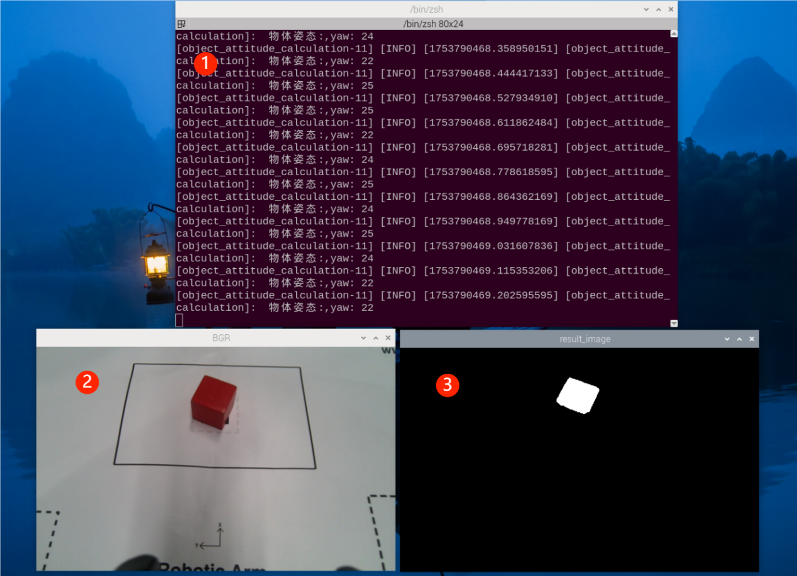
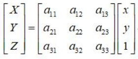
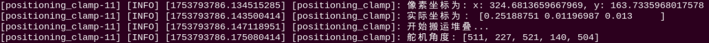
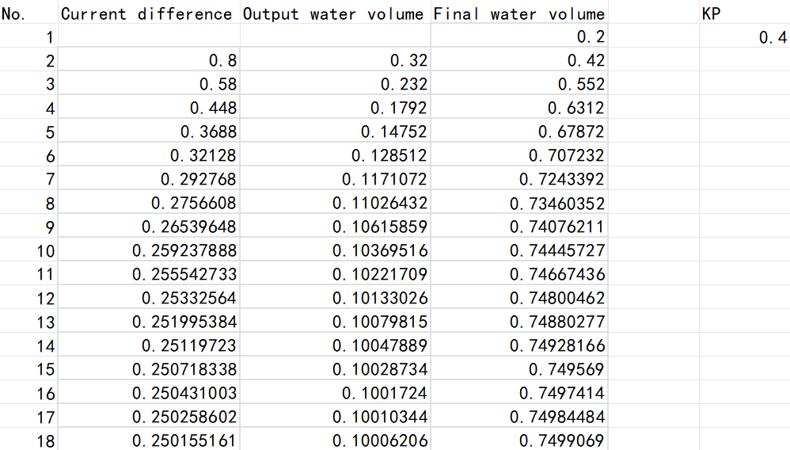
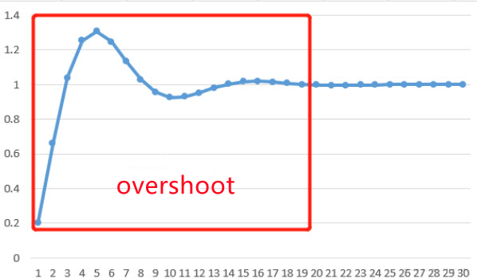

# 5. OpenCV Vision Course

## 5.1 Positioning & Gripping

### 5.1.1 Camera Calling

The camera functions as the eyes of the robotic arm. The first step in implementing the gripping function is to capture the object through the camera. Subsequently, it will calculate the object's location for gripping and proper placement.

* **Initiate Camera Control Node**

> [!NOTE]
>
>When entering commands, be sure to use correct case and spacing. You can use the Tab key to auto-complete keywords.

(1) Start the robotic arm, and access the robot system desktop using VNC. To get detailed instructions on remote control software connection, please refer to the tutorials saved in [1. ArmPi Ultra User Manual -> 1.6 Development Environment Setup and Configuration](https://wiki.hiwonder.com/projects/ArmPi-Ultra/en/latest/docs/1.ArmPi_Ultra_User_Manual.html#development-environment-setup-and-configuration).

(2) Click on  to launch the command bar, enter the command, and press Enter to disable the auto-start service.

```
~/.stop_ros.sh
```

(3) Run the command to initiate the camera file.

```
ros2 launch example camera_topic_invoke.launch.py
```

(4) To stop the program, press **Ctrl + C** in the terminal window. If the program does not stop immediately, repeat this step until it terminates.

(5) If you want to experience the mobile app features again later, enter the command  and press **Enter** to start the app service. Wait for the robotic arm to return to its initial position — a beep from the buzzer will indicate it's ready.

```
ros2 launch bringup bringup.launch.py
```

* **Project Outcome**

The live camera feed will pop up.


* **Program Brief Analysis**

(1) launch File Analysis

① launch_setup Function

{lineno-start=9}

```
def launch_setup(context):
    compiled = os.environ['need_compile']
    camera_type = os.environ['CAMERA_TYPE']
    if compiled == 'True':
        peripherals_package_path = get_package_share_directory('peripherals')
        example_package_path = get_package_share_directory('example')
    else:
        peripherals_package_path = '/home/ubuntu/ros2_ws/src/peripherals'
        example_package_path = '/home/ubuntu/ros2_ws/src/example'
    depth_camera_launch = IncludeLaunchDescription(
        PythonLaunchDescriptionSource(
            os.path.join(peripherals_package_path, 'launch/depth_camera.launch.py')),
    )        

    color_detect_node = Node(
        package='example',
        executable='camera_topic_invoke',
        output='screen',        
    )

    return [depth_camera_launch,
            color_detect_node,
            ]
```

Launches the camera launch file, which starts the depth camera–related nodes. Defines the color_detect_node node, which launches the camera_topic_invoke executable from the example package.

② generate_launch_description Function 

{lineno-start=33}

```
def generate_launch_description():
    return LaunchDescription([
        OpaqueFunction(function = launch_setup)
    ])
```

Creates and returns a LaunchDescription object, which specifies all nodes and configurations involved in the launch process.

③ Main Program 

{lineno-start=38}

```
if __name__ == '__main__':
    # 创建一个LaunchDescription对象
    ld = generate_launch_description()

    ls = LaunchService()
    ls.include_launch_description(ld)
    ls.run()
```

Creates a LaunchDescription object and a LaunchService service. The launch description is added to the service and executed, enabling the startup of the entire system.

(2) Python File Analysis

① Camera Class

Node Initialization

{lineno-start=14}

```
class Camera(Node):
    def __init__(self, name):
        rclpy.init()
        super().__init__(name)
        self.name = name
        self.image = None
        self.running = True
        self.image_sub = None

        self.image_queue = queue.Queue(maxsize=2)
        
        # 创建 CvBridge 对象，用于将 ROS Image 转为 OpenCV 格式
        self.bridge = CvBridge()

        # 注册 Ctrl+C 中断信号处理器
        signal.signal(signal.SIGINT, self.shutdown)

        # 图像订阅者
        self.image_sub = self.create_subscription(Image, '/depth_cam/rgb/image_raw', self.image_callback, 1)
        
        threading.Thread(target=self.image_processing, daemon=True).start()
```

Initializes the ROS node, creates an image queue and a CvBridge object for converting between ROS images and OpenCV images. Registers an interrupt signal handler. Subscribes to the /depth_cam/rgb/image_raw image topic. Starts the image processing thread.

② image_processing Function 

{lineno-start=35}

```
    def image_processing(self):
        while self.running:
            self.image = self.image_queue.get()
            if self.running and self.image is not None:
            #展示图像
                cv2.imshow('image', self.image)
                cv2.waitKey(1)
```

The function continuously fetches image data from the self.image_queue. The queue size is limited to 2, and the oldest image is discarded when full. Displays images using OpenCV’s cv2.imshow().

③ shutdown Function 

{lineno-start=43}

```
    def shutdown(self, signum, frame):
        self.get_logger().info("Shutting down...")
        self.running = False
        rclpy.shutdown()
```

Handles the **Ctrl+C** interrupt signal, sets the running flag to False and shuts down ROS.

④ image_callback Function 

{lineno-start=48}

```
    # 处理 ROS Image 消息并转化为 OpenCV 格式
    def image_callback(self, ros_image):
        try:
            # 将 ROS Image 消息转换为 OpenCV 图像
            self.image = self.bridge.imgmsg_to_cv2(ros_image, "bgr8")

            if self.image_queue.full():
            # 如果队列已满，丢弃最旧的图像
                self.image_queue.get()
        # 将图像放入队列
            self.image_queue.put(self.image)

            # if self.running and self.image is not None:
                # 展示图像
                # cv2.imshow('image', self.image)
                # cv2.waitKey(1)
        except Exception as e:
            self.get_logger().error(f"Error converting image: {e}")
```

This function converts the received ROS image message into an OpenCV format. The image is then stored in a queue, which discards the oldest image when full, ensuring that only the most recent frames are kept for subsequent processing and display.

⑤ main Function 

{lineno-start=69}

```
def main():
    camera_node = Camera('camera_topic_invoke')
    rclpy.spin(camera_node)
    camera_node.destroy_node()
    rclpy.shutdown()
```

An instance of the Camera node is created, and the ROS spin loop is started to handle callbacks. When the program exits, the node is destroyed and ROS is properly shut down.

* **Internal Parameter Calibration**

Since the camera lens is both concave and convex, the resulting image can be distorted. However, you can get internal, external and distortion parameters of camera through camera calibration, which can be used to calibrate distorted image and reconstruct 3D scenario.

The Aurora depth camera is factory-calibrated, so no manual calibration is required. For more information on image calibration, refer to [4. Camera Basic Course](https://wiki.hiwonder.com/projects/ArmPi-Ultra/en/latest/docs/4.camera_basic_lesson.html).

### 5.1.2 Color Space Conversion

The robotic arm uses the RGB color space, which is introduced in the following section.

* **Color Space Introduction** 

The image we perceive is actually composed of pixels arranged by three color components: B (blue), G (green), and R (red) in each frame.

A color model, also known as a color space, is a mathematical model that uses a set of values to describe colors.

RGB is a commonly used color space type, but there are several others, including the GRAY color space for grayscale images, Lab color space, XYZ color space, YCrCb color space, HSV color space, HLS color space, CIEL\*a\*b\* color space, CIEL\*u\*v\* color space, Bayer color space, among others.

Each color space excels in addressing specific problems, and to conveniently handle a particular issue, one may need to perform color space type conversion.

**Color space type conversion refers to transforming an image from one color space to another.** For example, when using OpenCV to process images, one might perform conversions between the RGB color space and the Lab color space. During tasks like feature extraction or distance calculation, it is common to convert the image from the RGB color space to the grayscale color space. In some applications, it may be necessary to convert color space images to binary images.

* **Common Color Space Type**

(1) RGB Color Space

RGB color space includes the following characteristics:

① It is a color space where colors are obtained through the linear combination of the Red (R), Green (G), and Blue (B) components.

② Object illumination affects the values of each channel in this color space, and the three color channels are correlated. Let's split the image into its R, G, and B components and observe them to gain a deeper understanding of the color space.

From the image below, if you look at the blue channel, you can see that the blue and white parts of the Rubik's Cube in the second image appear similar under indoor lighting conditions, but there is a noticeable difference in the first image. This non-uniformity makes color-based segmentation in this color space very challenging. Additionally, there is an overall difference in values between the two images. Therefore, the RGB color space exhibits issues with uneven color value distribution and the blending of chromaticity and brightness.


Lab Color Space

Similar to RGB space, Lab also has three channels.

L: Lightness channel.

a: color channel a, representing the colors ranging from green to magenta.

b: color channel b, representing the colors ranging from blue to yellow.


The Lab color space is entirely different from the RGB color space. In the RGB color space, color information is divided into three channels, but these same three channels also include brightness information. On the other hand, in the Lab color space, the L channel is independent and contains only brightness information, while the other two channels encode color.

L Component: Represents the brightness of pixels. A higher L value corresponds to higher brightness.

a Component: Represents the range from red to green.

b Component: Represents the range from yellow to blue.

In OpenCV, the numerical range of R, G, B values in the RGB color space is \[0-255\]. In the Lab color space, the L value range is \[0-100\], where 0 represents black, and 100 represents white. The a and b values range from \[-128, 127\], and both a and b values of 0 represent gray.

To further aid in understanding the comparison between RGB and Lab, here is an example using Photoshop software:

① Use the Eyedropper Tool to select a color.

② Click on the Color Picker in the lower left corner to view the corresponding Lab and RGB values, as shown below.


The Lab color space possesses the following characteristics:

① Perceptually uniform color space, closely approximating how we perceive colors.

② Device-independent, regardless of capture or display device.

③ Widely used in Adobe Photoshop.

④ Correlated with the RGB color space through complex transformation equations. When reading an image and converting it to the Lab color space in OpenCV, the resulting image is depicted in the figure below:


Ycrcb Color Space

The Human Visual System (HVS) is less sensitive to color than it is to brightness. In the traditional RGB color space, the three primary colors (R, G, B) are given equal importance, but brightness information is overlooked.

In the YCrCb color space, Y represents the brightness of the light source, while chrominance information is stored in Cr and Cb. Here, Cr represents the red component information, and Cb represents the blue component information. Luminance provides information about the degree of color brightness or darkness, and this information can be calculated through the weighted sum of intensity components in the illumination. In RGB light sources, the green component has the greatest impact, while the blue component has the smallest impact.


For changes in illumination, similar observations can be made for intensity and color components in LAB. In comparison to LAB, the perceptual difference between red and orange in outdoor images is relatively small, while white undergoes changes across all three components.

HSV Color Space

The HSV color space is a perceptually-based color model with three components:

H (Hue), S (Saturation), and V (Value).


Hue is associated with the dominant wavelengths in the blended spectrum, such as red, orange, yellow, green, cyan, blue, and violet, representing different hues. If considered from the perspective of wavelength, light of different wavelengths actually reflects differences in hue.

Saturation refers to the relative purity or the amount of white light mixed with a color. Pure spectral colors are fully saturated, while colors like deep red (red plus white) and light purple (purple plus white) are desaturated. Saturation is inversely proportional to the amount of white light added.

Value reflects the brightness of light perceived by the human eye, and this metric is related to the reflectivity of an object. Concerning color, the more white is added, the higher the brightness; the more black is added, the lower the brightness.

One notable feature of HSV is its use of only one channel to describe color (H), making it very intuitive for specifying colors. However, HSV color is device-dependent.

As shown in the figure below:


The H component is remarkably similar in both images, indicating that even with changes in lighting, color information remains consistent.

The S component in both images is also highly alike, while the V component represents brightness and thus varies with changes in illumination.

There is a significant disparity in the values of red between outdoor and indoor images. This is because the H value represents the starting angle of the color in degrees. Therefore, it may take values between \[300, 360\] and \[0, 60\].

Gray Color Space

The GRAY color space typically refers to grayscale images, where each pixel is a monochromatic image ranging from black to white, processed into a single-color image with 256 levels of grayscale.

These 256 levels of grayscale are represented by numerical values in the range of \[0, 255\], where '0' denotes pure black, '255' represents white, and values between 0 and 255 represent various shades of gray, which is the intensity or brightness levels of the color, ranging from dark gray to light gray.

### 5.1.3 Color Threshold Value

* **Program Introduction**

By subscribing to the camera image data, the program transfers the image’s color space into LAB color space, then recognize the color using the specific color threshold. After that, match the converted image with the color threshold value, and output the binary image. The object in the target color will represent white on the live camera feed, and other colors will represent black.

* **Operation Steps**

> [!NOTE]
>
> When entering commands, be sure to use correct case and spacing. You can use the Tab key to auto-complete keywords.

(1) Start the robotic arm, and access the robot system desktop using VNC. To get detailed instructions on remote control software connection, please refer to the tutorials saved in [1. ArmPi Ultra User Manual->1.6 Development Environment Setup and Configuration](https://wiki.hiwonder.com/projects/ArmPi-Ultra/en/latest/docs/1.ArmPi_Ultra_User_Manual.html#development-environment-setup-and-configuration).

(2) Click the terminal icon  in the system desktop to open a command-line window. Enter the following command and press **Enter** to stop the auto-start service:

```
~/.stop_ros.sh
```

(3) Enter the following command and press **Enter** to start the feature.

```
ros2 launch example color_threshold.launch.py
```

(4) To stop the program, press **Ctrl + C** in the terminal window. If the program does not stop immediately, repeat this step until it terminates.

(5) After completing the feature, you need to initiate the app service.  **Otherwise, future app features may not function properly.** In the terminal, enter the following command and press **Enter** to start the app service. Wait a few seconds for it to initialize.

```
ros2 launch bringup bringup.launch.py
```

* **Project Outcome**

In the display:

The window labeled ① is lab_image – the LAB image converted from RGB.

The window labeled ② is bgr_image – the image in the BGR color space.

The window labeled ③ is result_image – the binary image obtained after color threshold filtering.


* **Program Brief Analysis**

(1) launch File Analysis

① launch_setup Function

{lineno-start=9}

```
def launch_setup(context):
    compiled = os.environ['need_compile']
    if compiled == 'True':
        peripherals_package_path = get_package_share_directory('peripherals')
        example_package_path = get_package_share_directory('example')
    else:
        peripherals_package_path = '/home/ubuntu/ros2_ws/src/peripherals'
        example_package_path = '/home/ubuntu/ros2_ws/src/example'
    depth_camera_launch = IncludeLaunchDescription(
        PythonLaunchDescriptionSource(
            os.path.join(peripherals_package_path, 'launch/depth_camera.launch.py')),
    )

    color_threshold_node = Node(
        package='example',
        executable='color_threshold',
        output='screen',
    )

    return [depth_camera_launch,
            color_threshold_node,
            ]
```

Launches the camera launch file, which starts the depth camera–related nodes. Defines the color_threshold_node node, which launches the color_threshold executable from the example package.

② generate_launch_description Function 

{lineno-start=32}

```
def generate_launch_description():
    return LaunchDescription([
        OpaqueFunction(function = launch_setup)
    ])
```

Creates and returns a LaunchDescription object, which specifies all nodes and configurations involved in the launch process.

③ Main Program

{lineno-start=37}

```
if __name__ == '__main__':
    # 创建一个LaunchDescription对象
    ld = generate_launch_description()

    ls = LaunchService()
    ls.include_launch_description(ld)
    ls.run()
```

Creates a LaunchDescription object and a LaunchService service. The launch description is added to the service and executed, enabling the startup of the entire system.

(2) Python File Analysis

① Import the Necessary Libraries 

{lineno-start=4}

```
import cv2
import yaml
import rclpy
import queue
import threading
import numpy as np
from rclpy.node import Node
import sdk.common as common
from cv_bridge import CvBridge
from sensor_msgs.msg import Image
```

common: A custom module that provides commonly used functions such as plane transformations and coordinate system conversions imported from the **/sdk/common** path.

② Camera Class 

**\_\_init\_\_ Method**

{lineno-start=15}

```
class Camera(Node):
    def __init__(self, name):
        rclpy.init()
        super().__init__(name)
        self.name = name
        self.image = None
        self.running = True
        self.image_sub = None
        self.thread_started = False

        self.image_queue = queue.Queue(maxsize=2)
        self.data = common.get_yaml_data("/home/ubuntu/ros2_ws/src/app/config/lab_config.yaml")
        self.lab_data = self.data['/**']['ros__parameters']
        # 创建 CvBridge 对象，用于将 ROS Image 转为 OpenCV 格式
        self.bridge = CvBridge()
        self.target_color = "red"  # 设置目标颜色

        # 图像订阅者
        self.image_sub = self.create_subscription(Image, '/depth_cam/rgb/image_raw', self.image_callback, 1)

```

Initializes the ROS node, creates an image queue and a CvBridge object for converting between ROS images and OpenCV image formats, loads the LAB color space threshold configuration file, sets the target detection color to red, subscribes to the /depth_cam/rgb/image_raw image topic, and marks the image processing thread as not started.

③ image_callback Method

{lineno-start=35}

```
    # 处理 ROS Image 消息并转化为 OpenCV 格式
    def image_callback(self, ros_image):
        # 将 ROS Image 消息转换为 OpenCV 图像
        bgr_image = self.bridge.imgmsg_to_cv2(ros_image, "bgr8")
        if self.image_queue.full():
            # 如果队列已满，丢弃最旧的图像
            try:
                self.image_queue.get_nowait() # 使用 get_nowait 避免阻塞
            except queue.Empty:
                pass # 如果队列在检查时已经为空，则忽略异常
        # 将图像放入队列
        try:
            self.image_queue.put_nowait(bgr_image)  # 使用 put_nowait 避免阻塞
        except queue.Full:
            pass # 如果队列在检查时已经为满，则忽略异常
        if not self.thread_started:
            # 只在第一次调用时启动线程
            threading.Thread(target=self.image_process, daemon=True).start()
            self.thread_started = True
```

Image topic callback function that converts received ROS image messages into OpenCV BGR format, caches them in a queue and discards the oldest image non-blockingly when full, and starts the image processing thread upon the first callback.

④ image_process Method

{lineno-start=55}

```
    def image_process(self):
        while self.running:
            try:
                bgr_image = self.image_queue.get(block=True, timeout=1) # 使用 get 时添加 try-except
            except queue.Empty:
                #print(self.get_name(), "image queue is empty!")
                continue 

            # 将图像的颜色空间转换成LAB
            lab_image = cv2.cvtColor(bgr_image, cv2.COLOR_BGR2LAB)

            # 设置颜色阈值并进行二值化,默认为红色
            result_image = cv2.inRange(lab_image, np.array(self.lab_data['color_range_list'][self.target_color]['min']), np.array(self.lab_data['color_range_list'][self.target_color]['max']))

            # 发布处理后的图像
            try:
                cv2.imshow('bgr_image', bgr_image)
                cv2.imshow('lab_image', lab_image)
                cv2.imshow('result_image', result_image)
                cv2.waitKey(1)
            except Exception as e:
                self.get_logger().warn(f"图像显示发生错误: {e}")
                continue
        print("image_process thread end")
```

This is a thread function which continuously retrieves images from the queue, converts the BGR image to the LAB color space, applies thresholding based on the target color defined in the configuration file, and displays the original image, the LAB image, and the thresholded result using OpenCV.

⑤ main Function

{lineno-start=87}

```
def main():
    camera_node = Camera('color_threshold')
    rclpy.spin(camera_node)
    camera_node.destroy_node()
    rclpy.shutdown()
```

Creates a Camera node instance named color_threshold, starts the ROS node’s spin loop to process callbacks, and upon program termination, destroys the node and shut down ROS.

### 5.1.4 Color Space Conversion

* **Program Introduction**

By subscribing to the camera images, we convert the captured images to different color spaces and view them in the displayed output.

* **Operation Steps**

> [!NOTE]
>
> When entering commands, be sure to use correct case and spacing. You can use the Tab key to auto-complete keywords.

(1) Start the robotic arm, and access the robot system desktop using VNC. To get detailed instructions on remote control software connection, please refer to the tutorials saved in [1. ArmPi Ultra User Manual->1.6 Development Environment Setup and Configuration](https://wiki.hiwonder.com/projects/ArmPi-Ultra/en/latest/docs/1.ArmPi_Ultra_User_Manual.html#development-environment-setup-and-configuration).

(2) Click the terminal icon  in the system desktop to open a command-line window. Enter the following command and press Enter to stop the auto-start service:

```
~/.stop_ros.sh
```

(3) Enter the following command and press Enter to start the feature.

```
ros2 launch example color_space.launch.py
```

(4) To stop the program, press **Ctrl + C** in the terminal window. If the program does not stop immediately, repeat this step until it terminates.

(5) After completing the feature, you need to initiate the app service.  **Otherwise, future app features may not function properly.** In the terminal, enter the following command and press Enter to start the app service. Wait a few seconds for it to initialize.

```
ros2 launch bringup bringup.launch.py
```

* **Project Outcome**

In the display:

The window labeled ① is lab_image – the image converted from RGB to the LAB color space.

The window labeled ② is rgb_image – the original image from the camera.

The window labeled ③ is bgr_image – the image converted from RGB to BGR.

* **Program Brief Analysis**

(1) launch File Analysis

① launch_setup Function

{lineno-start=9}

```
def launch_setup(context):
    compiled = os.environ['need_compile']
    if compiled == 'True':
        peripherals_package_path = get_package_share_directory('peripherals')
        example_package_path = get_package_share_directory('example')
    else:
        peripherals_package_path = '/home/ubuntu/ros2_ws/src/peripherals'
        example_package_path = '/home/ubuntu/ros2_ws/src/example'
    depth_camera_launch = IncludeLaunchDescription(
        PythonLaunchDescriptionSource(
            os.path.join(peripherals_package_path, 'launch/depth_camera.launch.py')),
    )

    color_space_node = Node(
        package='example',
        executable='color_space',
        output='screen',
    )

    return [depth_camera_launch,
            color_space_node,
            ]
```

Includes the **depth_camera.launch.py** launch file from the peripherals package to start depth camera-related nodes, defines the color_space_node, which launches the color_space executable from the example package.

② generate_launch_description Function 

{lineno-start=32}

```
def generate_launch_description():
    return LaunchDescription([
        OpaqueFunction(function = launch_setup)
    ])
```

Creates and returns a LaunchDescription object, calling launch_setup via OpaqueFunction as the standard entry point for the ROS 2 launch file.

③ Main Program 

{lineno-start=37}

```
if __name__ == '__main__':
    # 创建一个LaunchDescription对象
    ld = generate_launch_description()

    ls = LaunchService()
    ls.include_launch_description(ld)
    ls.run()
```

Creates a LaunchDescription object and a LaunchService service. The launch description is added to the service and executed, enabling the startup of the entire system.

(2) Python File Analysis

① Camera Class

{lineno-start=12}

```
class Camera(Node):
    def __init__(self, name):
        rclpy.init()
        super().__init__(name)
        self.name = name
        self.image = None
        self.running = True
        self.image_sub = None

        
        # 创建 CvBridge 对象，用于将 ROS Image 转为 OpenCV 格式
        self.bridge = CvBridge()

    
        # 图像订阅者
        self.image_sub = self.create_subscription(Image, '/depth_cam/rgb/image_raw', self.image_callback, 1)
```

Initializes the ROS node, creates a CvBridge object for converting between ROS images and OpenCV image formats, and creates an image subscriber to receive messages from the /depth_cam/rgb/image_raw topic, with the callback function set to image_callback.

② shutdown Method 

{lineno-start=30}

```
    def shutdown(self, signum, frame):
        self.get_logger().info("Shutting down...")
        self.running = False
        rclpy.shutdown()
```

Handles interrupt signals by printing shutdown information, setting the running flag to False, and shutting down ROS.

③ image_callback Method

{lineno-start=35}

```
    # 处理 ROS Image 消息并转化为 OpenCV 格式
    def image_callback(self, ros_image):
        try:
            # 将 ROS Image 消息转换为 OpenCV 图像
            self.rgb_image = self.bridge.imgmsg_to_cv2(ros_image, "rgb8")

            self.bgr_image = cv2.cvtColor(self.rgb_image, cv2.COLOR_RGB2BGR)

            # 将图像的颜色空间转换成LAB
            self.lab_image = cv2.cvtColor(self.rgb_image, cv2.COLOR_RGB2LAB)
            
            if self.running  and self.bgr_image is not None and self.lab_image is not None:
                # 展示图像
                cv2.imshow('rgb_image', self.rgb_image)
                cv2.imshow('bgr_image', self.bgr_image)
                cv2.imshow('lab_image', self.lab_image)
                cv2.waitKey(1)
        except Exception as e:
            self.get_logger().error(f"Error converting image: {e}")
```

This is a image topic callback function, which converts the received ROS Image message into an OpenCV RGB image, then converts it to BGR and LAB color space formats. When the node is running and the image is valid, it displays the RGB, BGR, and LAB images using OpenCV.

③ Program Entry

{lineno-start=57}

```
def main():
    camera_node = Camera('color_space')
    rclpy.spin(camera_node)
    camera_node.destroy_node()
    rclpy.shutdown()
```

Creates a Camera node instance named color_space, starts the ROS node’s spin loop to process callbacks, and upon program termination, destroys the node and shut down ROS.

### 5.1.5 Color Recognition

* **Program Introduction**

By subscribing to camera image data, the captured images are converted to the LAB color space. Following this conversion, color recognition can be performed using specific color thresholds. After matching the transformed image with the color thresholds, the program identifies the desired colors and prints the recognized color in the terminal. Additionally, it outputs the BGR image and the binary image.

* **Operation Steps**

> [!NOTE]
>
> When entering commands, be sure to use correct case and spacing. You can use the Tab key to auto-complete keywords.

(1) Start the robotic arm, and access the robot system desktop using VNC. To get detailed instructions on remote control software connection, please refer to the tutorials saved in [1.ArmPi Ultra User Manual->1.6 Development Environment Setup and Configuration](https://wiki.hiwonder.com/projects/ArmPi-Ultra/en/latest/docs/1.ArmPi_Ultra_User_Manual.html#development-environment-setup-and-configuration).

(2) Click the terminal icon  in the system desktop to open a command-line window. Enter the following command and press **Enter** to stop the auto-start service:

```
~/.stop_ros.sh
```

(3) Enter the following command and press **Enter** to start the feature.

```
ros2 launch example color_recognition.launch.py
```

(4) To stop the program, press **Ctrl + C** in the terminal window. If the program does not stop immediately, repeat this step until it terminates.

(5) After completing the feature, you need to initiate the app service.  **Otherwise, future app features may not function properly.** In the terminal, enter the following command and press **Enter** to start the app service. Wait a few seconds for it to initialize.

```
ros2 launch bringup bringup.launch.py
```

* **Project Outcome**

In the display:

The window labeled is BGR – the image in BGR color space.

The window labeled is result_image – the binary image obtained from color detection results.


* **Program Brief Analysis**

(1) launch File Analysis

① launch_setup Function

{lineno-start=9}

```
def launch_setup(context):
    compiled = os.environ['need_compile']
    enable_display = LaunchConfiguration('enable_display', default='true')
    enable_display_arg = DeclareLaunchArgument('enable_display', default_value=enable_display)
    if compiled == 'True':
        peripherals_package_path = get_package_share_directory('peripherals')
        example_package_path = get_package_share_directory('example')
        sdk_package_path = get_package_share_directory('sdk')
    else:
        peripherals_package_path = '/home/ubuntu/ros2_ws/src/peripherals'
        example_package_path = '/home/ubuntu/ros2_ws/src/example'
        sdk_package_path = '/home/ubuntu/ros2_ws/src/driver/sdk'
    depth_camera_launch = IncludeLaunchDescription(
        PythonLaunchDescriptionSource(
            os.path.join(peripherals_package_path, 'launch/depth_camera.launch.py')),
    )
    sdk_launch = IncludeLaunchDescription(
        PythonLaunchDescriptionSource(
            os.path.join(sdk_package_path, 'launch/armpi_ultra.launch.py')),
    )
    color_detect_node = Node(
        package='example',
        executable='color_recognition',
        output='screen',
        parameters=[{'enable_display': enable_display}]
    )

    return [
            sdk_launch,
            depth_camera_launch,
            enable_display_arg,
            color_detect_node,
            ]
```

Includes the **depth_camera.launch.py** launch file from the peripherals package to start depth camera related nodes and the **armpi_ultra.launch.py** launch file from the sdk package to start SDK related nodes, defines the color_detect_node node, which runs the color_recognition executable from the example package.

② generate_launch_description Function 

{lineno-start=43}

```
def generate_launch_description():
    return LaunchDescription([
        OpaqueFunction(function = launch_setup)
    ])
```

Creates and returns a LaunchDescription object, calling launch_setup via OpaqueFunction as the standard entry point for the ROS 2 launch file.

③ Main Function

{lineno-start=48}

```
if __name__ == '__main__':
    # 创建一个LaunchDescription对象
    ld = generate_launch_description()

    ls = LaunchService()
    ls.include_launch_description(ld)
    ls.run()
```

Creates a LaunchDescription object and a LaunchService service. The launch description is added to the service and executed, enabling the startup of the entire system.

(2) Python File Analysis

① Import the Necessary Libraries

{lineno-start=4}

```
import cv2
import time
import math
import rclpy
import numpy as np
import sdk.common as common
from rclpy.node import Node
from cv_bridge import CvBridge
from std_srvs.srv import Trigger
from sensor_msgs.msg import Image
from servo_controller_msgs.msg import ServosPosition
from servo_controller.bus_servo_control import set_servo_position
```

`common`: A custom module that provides commonly used functions such as plane transformations and coordinate system conversions imported from the **/sdk/common** path.

`cv_bridge`: Used to convert between ROS image messages sensor_msgs/Image and OpenCV images.

`servo_controller_msgs.msg.ServosPosition`: Message type for controlling robotic arm servos. ServosPosition represents the positions of multiple servos.

`servo_controller.bus_servo_control`: Custom module for controlling robotic arm servos, providing functionality to set servo positions.

② ColorDetection Class 

Initialization Function of color_detection Class

{lineno-start=17}

```
class ColorDetection(Node):
    def __init__(self, name):
        super().__init__(name, allow_undeclared_parameters=True, automatically_declare_parameters_from_overrides=True)
        self.rgb_image = None
        self.bgr_image = None
        self.result_image = None
        self.bridge = CvBridge()  # 用于ROS Image消息与OpenCV图像之间的转换

        self.display = self.get_parameter('enable_display').value
        self.data = common.get_yaml_data("/home/ubuntu/ros2_ws/src/app/config/lab_config.yaml")  
        self.lab_data = self.data['/**']['ros__parameters'] 
        self.joints_pub = self.create_publisher(ServosPosition, 'servo_controller', 1)

        #等待服务启动
        self.client = self.create_client(Trigger, '/controller_manager/init_finish')
        self.client.wait_for_service()
        joint_angle = [500, 600, 825, 110, 500, 210]
        
        set_servo_position(self.joints_pub, 1, ((5, joint_angle[1]), (4, joint_angle[2]), (3, joint_angle[3]), (2, joint_angle[4]), (1, joint_angle[5])))

        time.sleep(1)

        set_servo_position(self.joints_pub, 1, ((6, joint_angle[0]), ))
        time.sleep(1)

        # 订阅图像话题
        self.image_sub = self.create_subscription(Image, '/depth_cam/rgb/image_raw', self.image_callback, 1)

        #发布颜色识别处理图像
        self.image_pub = self.create_publisher(Image, '/color_detection/result_image', 1)

```

Initializes the ROS node, allowing undeclared parameters and automatically declaring parameters from overrides, creates a CvBridge object for image format conversion, retrieves the enable_display parameter and loads the LAB color space configuration file, creates a publisher for servo position messages and a client to wait for the /controller_manager/init_finish service to start, sets initial joint angles and controls the servos via set_servo_position, subscribes to the /depth_cam/rgb/image_raw image topic with image_callback as the callback function, creates a publisher to output the color detection result images to the /color_detection/result_image topic.

③ Image Callback Processing Function

{lineno-start=48}

```
    # 处理ROS Image消息，将其转换为OpenCV图像
    def image_callback(self, ros_image):
        try:
            
            # 将 ROS Image 消息转换为 OpenCV 图像
            self.rgb_image = self.bridge.imgmsg_to_cv2(ros_image, "rgb8")
            # 将图像的颜色空间转换成LAB
            self.lab_image = cv2.cvtColor(self.rgb_image, cv2.COLOR_RGB2LAB)
            # RGB转BGR
            self.bgr_image = cv2.cvtColor(self.rgb_image, cv2.COLOR_RGB2BGR)


            # 开始颜色检测
            self.color_detection("red",self.bgr_image)

            # 展示原图和检测结果
            if  self.result_image is not None:
                cv2.imshow('BGR', self.bgr_image)
                cv2.imshow('result_image', self.result_image)
                cv2.waitKey(1)

        except Exception as e:
            self.get_logger().error('Failed to convert image: {}'.format(e))
```

The image topic callback function converts incoming ROS Image messages to OpenCV RGB format, then further converts them to LAB and BGR formats. It calls the color_detection method to detect red color. If display is enabled and the result image is valid, OpenCV shows both the BGR original image and the detection result.

④ Erosion and Dilation

{lineno-start=73}

```
    # 腐蚀与膨胀操作
    def erode_and_dilate(self, binary, kernel=3):
        element = cv2.getStructuringElement(cv2.MORPH_RECT, (kernel, kernel))
        eroded = cv2.erode(binary, element)  # 腐蚀
        dilated = cv2.dilate(eroded, element)  # 膨胀
        return dilated
```

Performs erosion and dilation on the binary image using a rectangular structuring element to reduce noise and enhance target contours.

⑤ Color Recognition

{lineno-start=80}

```
    # 颜色识别函数
    def color_detection(self, color, bgr_image):
        self.result_image = cv2.GaussianBlur(bgr_image, (3, 3), 3)
        self.result_image = cv2.cvtColor(self.result_image, cv2.COLOR_BGR2LAB)
        # 设置颜色阈值并生成二值化图像
        self.result_image = cv2.inRange(self.result_image,
                                      np.array(self.lab_data['color_range_list'][color]['min']),
                                      np.array(self.lab_data['color_range_list'][color]['max']))
        self.result_image = self.erode_and_dilate(self.result_image)

        # 找出所有轮廓
        contours = cv2.findContours(self.result_image, cv2.RETR_EXTERNAL, cv2.CHAIN_APPROX_NONE)[-2]
        if contours:
            c = max(contours, key=cv2.contourArea)
            area = math.fabs(cv2.contourArea(c))
            if area >= 2000:
                if self.display:
                    self.get_logger().info(f"Detected {color}")
        
        # 将二值化的图像转换为BGR格式，便于发布
        # result_image = cv2.cvtColor(self.result_image, cv2.COLOR_GRAY2BGR)

        # 发布彩色 BGR 图像
        self.image_pub.publish(self.bridge.cv2_to_imgmsg(self.result_image, "mono8"))
```

Applies Gaussian blur and converts the input image to LAB color space. Based on the target color (red) thresholds from the configuration file, a binary image is generated. After erosion and dilation, contours are found. The largest contour with an area ≥ 2000 is selected. If display is enabled, information about the detected target color is output. The processed binary image is converted to single-channel format and published.

⑥ Main Function

{lineno-start=106}

```
def main():
    rclpy.init()
    node = ColorDetection('color_detection')
    rclpy.spin(node)
    node.destroy_node()
    rclpy.shutdown()
```

Initializes ROS, creates a ColorDetection node instance named color_detection, starts the node’s spin loop, and upon termination, destroys the node and shuts down ROS.

### 5.1.6 Pixel Coordinate Calculation

* **Program Introduction**

When the robotic arm identifies a colored block on the live camera feed, it obtains the coordinates of the block's center point on the live camera feed. By using the coordinates of the center point, the corresponding pixel coordinates are calculated, facilitating subsequent object localization.

* **Operation Steps**

> [!NOTE]
>
> When entering commands, be sure to use correct case and spacing. You can use the Tab key to auto-complete keywords.

(1) Start the robotic arm, and access the robot system desktop using VNC. To get detailed instructions on remote control software connection, please refer to the tutorials saved in [1. ArmPi Ultra User Manual/6. Development Environment Setup and Configuration](https://wiki.hiwonder.com/projects/ArmPi-Ultra/en/latest/docs/1.ArmPi_Ultra_User_Manual.html#development-environment-setup-and-configuration)

(2) Click the terminal icon  in the system desktop to open a command-line window. Enter the following command and press Enter to stop the auto-start service:

```
~/.stop_ros.sh
```

(3) Enter the following command and press Enter to start the feature.

```
ros2 launch example pixel_coordinate_calculation.launch.py
```

To stop the program, press **Ctrl + C** in the terminal window. If the program does not stop immediately, repeat this step until it terminates.

If you want to experience the mobile app features again later, enter the command and press Enter to start the app service. Wait for the robotic arm to return to its initial position — a beep from the buzzer will indicate it's ready.

```
ros2 launch bringup bringup.launch.py
```

* **Project Outcome**

As shown in the figure below:

The terminal in area ① prints the pixel coordinates. x represents the horizontal coordinate, while y represents the vertical coordinate.

The window named “RGB” in area ② shows the depth camera’s feed, which is the BGR image converted from RGB.

The window named “result_image” in area ③ displays the binary black-and-white image generated by the color_detection function.


* **Program Brief Analysis**

launch File Analysis

① launch_setup Function

{lineno-start=9}

```
def launch_setup(context):
    compiled = os.environ['need_compile']
    enable_display = LaunchConfiguration('enable_display', default='false')
    enable_display_arg = DeclareLaunchArgument('enable_display', default_value=enable_display)

    if compiled == 'True':
        example_package_path = get_package_share_directory('example')
    else:
        example_package_path = '/home/ubuntu/ros2_ws/src/example'

    color_recognition_launch = IncludeLaunchDescription(
        PythonLaunchDescriptionSource(
            os.path.join(example_package_path, 'example/opencv/color_recognition.launch.py')),
        launch_arguments={
            'enable_display': enable_display
        }.items()
    )

    pixel_coordinate_calculation_node = Node(
        package='example',
        executable='pixel_coordinate_calculation',
        output='screen',
    )

    return [
            color_recognition_launch,
            pixel_coordinate_calculation_node,
            ]
```

Includes the **color_recognition.launch.py** launch file from the example package to start color recognition-related nodes, defines the pixel_coordinate_calculation_node, which launches the pixel_coordinate_calculation executable from the example package.

② generate_launch_description Function

{lineno-start=38}

```
def generate_launch_description():
    return LaunchDescription([
        OpaqueFunction(function = launch_setup)
    ])
```

Creates and returns a LaunchDescription object, calling launch_setup via OpaqueFunction as the standard entry point for the ROS 2 launch file.

③ Main Function

{lineno-start=43}

```
if __name__ == '__main__':
    # 创建一个LaunchDescription对象
    ld = generate_launch_description()

    ls = LaunchService()
    ls.include_launch_description(ld)
    ls.run()
```

Creates a LaunchDescription object and a LaunchService service. The launch description is added to the service and executed, enabling the startup of the entire system.

(2) Python File Analysis

① PixelCoordinateCalculation Class

**Initialization function:**

{lineno-start=12}

```
    def __init__(self, name):
        rclpy.init()
        super().__init__(name, allow_undeclared_parameters=True, automatically_declare_parameters_from_overrides=True)
        self.bridge = CvBridge()  # 用于ROS Image消息与OpenCV图像之间的转换
        # 订阅图像话题
        self.image_sub = self.create_subscription(Image, '/color_detection/result_image', self.image_callback, 1)
```

Initializes the ROS node, allowing undeclared parameters and automatically declaring them from overrides, creates a CvBridge object for format conversion, subscribes to the /color_detection/result_image topic, specifying image_callback as the callback function.

**image_callback Function**

{lineno-start=19}

```
    # 处理ROS节点数据
    def image_callback(self, result_image):
        try:
            
            # 将 ROS Image 消息转换为 OpenCV 图像
            result_image = self.bridge.imgmsg_to_cv2(result_image, "mono8")

            # 将灰度图像转换为 BGR 图像
            # result_image = cv2.cvtColor(bgr_image, cv2.COLOR_BGR2GRAY)

           
            if result_image is not None :
                # 计算识别到的轮廓
                contours = cv2.findContours(result_image, cv2.RETR_EXTERNAL,cv2.CHAIN_APPROX_NONE)[-2]  # 找出所有轮廓

                if contours :

                    # 找出最大轮廓
                    c = max(contours, key = cv2.contourArea)
                    # 根据轮廓大小判断是否进行下一步处理
                    rect = cv2.minAreaRect(c)  # 获取最小外接矩形
                    corners = np.intp(cv2.boxPoints(rect))  # 获取最小外接矩形的四个角点
                    x, y = rect[0][0],rect[0][1]
                    # 打印像素坐标
                    self.get_logger().info(f"像素坐标为:x: {x} y: {y}")
                    
                else:
                    self.get_logger().info("请将需要识别颜色的物体放入摄像头的识别范围")

        except Exception as e:
            print(e)
```

The image topic callback function converts incoming ROS Image messages to single-channel (mono8) OpenCV images, extracts contours from the image, and if contours exist, finds the largest contour and calculates its center point coordinates (pixel coordinates) using the minimum enclosing rectangle, then prints the coordinates. If no contour is detected, a message is printed. Any exceptions encountered during processing are also printed.

- **main Function**

  {lineno-start=51}
  
  ```
  def main():
      node = PixelCoordinateCalculation('pixel_coordinate_calculation')
      rclpy.spin(node)
      camera_node.destroy_node()
      
      rclpy.shutdown()
  ```
  

Creates an instance of the PixelCoordinateCalculation node named pixel_coordinate_calculation, starts the ROS node's spin loop to process callbacks, and destroys the node and shuts down ROS when the program ends.

### 5.1.7 Object Pose Calculation

* **Program Introduction**

When a color block is identified, the coordinates of the block's center point in the live camera feed can be obtained. The image's pose is then calculated and printed in the terminal. This information can be utilized for subsequent servo control on the robotic arm, adjusting the gripping angle of the gripper.

Pose represents both position and orientation. In a spatial coordinate system (OXYZ), any rigid body can be precisely and uniquely described by its positional and orientational attributes.

Position indicates the object's coordinates in three-dimensional space, typically represented by three coordinate values (x, y, z). These coordinates can be relative to a reference point or coordinate system, or they can be relative to the position of other objects.

Orientation represents the object's direction or orientation in three-dimensional space, typically described using rotation matrices, Euler angles, quaternions, or other representation methods. Orientation describes the rotational relationship of the object relative to a reference direction or coordinate system and can be used to represent the object's orientation, angles, or rotation.

* **Operation Steps**

> [!NOTE]
>
>When entering commands, be sure to use correct case and spacing. You can use the Tab key to auto-complete keywords.

① Start the robotic arm, and access the robot system desktop using VNC. To get detailed instructions on remote control software connection, please refer to the tutorials saved in [1. ArmPi Ultra User Manual->1.6 Development Environment Setup and Configuration](https://wiki.hiwonder.com/projects/ArmPi-Ultra/en/latest/docs/1.ArmPi_Ultra_User_Manual.html#development-environment-setup-and-configuration).

② Click the terminal icon  in the system desktop to open a command-line window. Enter the following command and press **Enter** to stop the auto-start service:

```
~/.stop_ros.sh
```

③ Enter the following command and press **Enter** to start the feature.

```
ros2 launch example object_attitude_calculation.launch.py
```

To stop the program, press **Ctrl + C** in the terminal window. If the program does not stop immediately, repeat this step until it terminates.

If you want to experience the mobile app features again later, enter the command and press **Enter** to start the app service. Wait for the robotic arm to return to its initial position — a beep from the buzzer will indicate it's ready.

```
ros2 launch bringup bringup.launch.py
```

* **Project Outcome**

As shown in the figure below:

The terminal output in area **①** shows the object’s yaw pose, which corresponds to the gripping angle of the robotic claw.

The window named “BGR” in area **②** displays the feedback image from the depth camera, converted from RGB to BGR format.

The window named “result_image” in area **③** displays the binary black-and-white image generated by the color_detection function.



* **Program Brief Analysis**

(1) launch File Analysis

① launch_setup Function

{lineno-start=9}

```
def launch_setup(context):
    compiled = os.environ['need_compile']
    enable_display = LaunchConfiguration('enable_display', default='false')
    enable_display_arg = DeclareLaunchArgument('enable_display', default_value=enable_display)
    if compiled == 'True':
        example_package_path = get_package_share_directory('example')
    else:
        example_package_path = '/home/ubuntu/ros2_ws/src/example'
    
    color_recognition_launch = IncludeLaunchDescription(
        PythonLaunchDescriptionSource(
            os.path.join(example_package_path, 'example/opencv/color_recognition.launch.py')),
        launch_arguments={
            'enable_display': enable_display
        }.items()
    )

    object_attitude_calculation_node = Node(
        package='example',
        executable='object_attitude_calculation',
        output='screen',
    )

    return [
            color_recognition_launch,
            object_attitude_calculation_node,
            ]
```

Includes the **color_recognition.launch.py** launch file from the example package to start color recognition-related nodes, defines the object_attitude_calculation_node, which launches the object_attitude_calculation executable from the example package.

② generate_launch_description Function 

{lineno-start=37}

```
def generate_launch_description():
    return LaunchDescription([
        OpaqueFunction(function = launch_setup)
    ])
```

Creates and returns a LaunchDescription object, calling launch_setup via OpaqueFunction as the standard entry point for the ROS 2 launch file.

③ Main Function

{lineno-start=42}

```
if __name__ == '__main__':
    # 创建一个LaunchDescription对象
    ld = generate_launch_description()

    ls = LaunchService()
    ls.include_launch_description(ld)
    ls.run()
```

Creates a LaunchDescription object and a LaunchService service. The launch description is added to the service and executed, enabling the startup of the entire system.

(2) Python File Analysis

During the object pose estimation process, it is necessary to extract the primary features of the target color. To achieve this, the pre-written color_detection_base library is called to obtain the binary image of the target-colored object, which is then used for subsequent color-based object localization.

① Constructor of the ObjectAttitudeCalculation Class

{lineno-start=11}

```
class ObjectAttitudeCalculation(Node):
    def __init__(self, name):
        rclpy.init()
        super().__init__(name, allow_undeclared_parameters=True, automatically_declare_parameters_from_overrides=True)
        self.bridge = CvBridge()  # 用于ROS Image消息与OpenCV图像之间的转换
        # 订阅图像话题
        self.image_sub = self.create_subscription(Image, '/color_detection/result_image', self.image_callback, 1)
```

Initializes the ROS node, allowing undeclared parameters and automatically declaring them from overrides, creates a CvBridge object for format conversion, subscribes to the /color_detection/result_image topic, specifying image_callback as the callback function.

② image_callback Callback Function 

{lineno-start=19}

```
    # 处理ROS节点数据
    def image_callback(self, result_image):
        try:
            
            # 将 ROS Image 消息转换为 OpenCV 图像
            result_image = self.bridge.imgmsg_to_cv2(result_image, "mono8")

            # 将灰度图像转换为 BGR 图像
            # result_image = cv2.cvtColor(bgr_image, cv2.COLOR_BGR2GRAY)

            
            if result_image is not None :
                # 计算识别到的轮廓
                contours = cv2.findContours(result_image, cv2.RETR_EXTERNAL,cv2.CHAIN_APPROX_NONE)[-2]  # 找出所有轮廓

                if contours :

                    # 找出最大轮廓
                    c = max(contours, key = cv2.contourArea)
                    # 根据轮廓大小判断是否进行下一步处理
                    rect = cv2.minAreaRect(c)  # 获取最小外接矩形
                    yaw = int(round(rect[2]))  # 矩形角度
                    # 打印物体姿态
                    self.get_logger().info(f" 物体姿态:,yaw: {yaw}")
                    
                else:
                    self.get_logger().info("请将需要识别颜色的物体放入摄像头的识别范围")

        except Exception as e:
            print(e)
```

This function converts the ROS Image message into an OpenCV single-channel (mono8) image and then extracts contours from it. If any contours are found, it identifies the largest one, calculates its rotation angle yaw, representing the object’s attitude using the minimum bounding rectangle, and prints the result. If no contour is detected, it outputs a prompt message. If an exception occurs during the process, it prints the exception details.

③ main Function 

{lineno-start=50}

```
def main():
    node = ObjectAttitudeCalculation('object_attitude_calculation')
    rclpy.spin(node)
    camera_node.destroy_node()
    
    rclpy.shutdown()
```

Creates an instance of the ObjectAttitudeCalculation node named object_attitude_calculation, starts the ROS node's spin loop to process callbacks, and destroys the node and shuts down ROS when the program ends.

### 5.1.8 Perspective Transformation

* **Perspective Transformation Description**

Perspective transformation refers to the process of projecting an image onto a new viewing plane using the conditions of collinearity among the perspective center, image points, and target points. The goal of perspective transformation is to convert objects that appear as lines in reality but may be skewed in an image into straight lines through the transformation process.


* **Perspective Transformation Function**

Perspective transformation is commonly employed in research areas such as vision navigation for mobile robots. In scenarios where the camera is inclined relative to the ground rather than directly facing downward, resulting in an oblique angle, there is a need to rectify the image into a form with a straight, orthogonal projection. This correction is achieved through the application of perspective transformation.

* **Perspective Transformation Principle**

The process of converting a three-dimensional object or entity from a spatial coordinate system into a two-dimensional image representation is known as projection transformation. Perspective transformation is an operation that modifies the size and shape of objects, resulting in a three-dimensional effect when applied to a planar figure. For instance, in the case of a rectangle, shear transformation only displaces two vertices on the same edge, both moving in the same direction, while keeping the other two vertices stationary. Conversely, perspective transformation may require moving all vertices of the rectangle, with the two vertices on the same edge moving in opposite directions. Simply put, perspective transformation involves transitioning from a two-dimensional image to a three-dimensional representation and then back to a two-dimensional image.


Based on the schematic principles of perspective transformation, we can formulate the following equations:



The coordinates (X, Y, Z) represent a point in the original image plane, and the corresponding transformed image plane coordinates are (x, y). Since we are dealing with a two-dimensional image, we can set Z=1. Dividing the transformed image coordinates by Z is a way to reduce the image from three dimensions to two dimensions. Thus, we can obtain the following equations:


Usually, we set a33=1 to simplify obtaining X', Y', ensuring that the denominator on the left side of equation 3 is 1. Expanding the above formula, we obtain the situation for a single point:


Equation 3 involves a total of 8 unknowns. To solve for these unknowns, it is necessary to formulate eight sets of equations. This entails manually selecting four points on both the source image and the target image. On the source image, four coordinates are selected: A (x0, y0), (x1, y1), (x2, y2), (x3, y3). Simultaneously, four coordinates are chosen on the target image: B (X’0, Y’0), (X’1, Y’1), (X’2, Y’2), (X’3, Y’3).

By substituting into Equation 3, we can obtain Equation 4 as follows:


### 5.1.9  Coordinate System Conversion

* **Program Introduction**

When we identify a color block from the live camera feed, we can obtain the pixel coordinates of the color block's center on the live camera feed. It is necessary to convert the obtained pixel coordinates into the actual coordinates of the color block.

* **Operation Steps**

> [!NOTE]
>
> When entering commands, be sure to use correct case and spacing. You can use the Tab key to auto-complete keywords.

(1) Start the robotic arm, and access the robot system desktop using VNC. To get detailed instructions on remote control software connection, please refer to the tutorials saved in [1. ArmPi Ultra User Manual/6. Development Environment Setup and Configuration](https://wiki.hiwonder.com/projects/ArmPi-Ultra/en/latest/docs/1.ArmPi_Ultra_User_Manual.html#development-environment-setup-and-configuration).

(2) Click the terminal icon  in the system desktop to open a command-line window. Enter the following command and press **Enter** to stop the auto-start service:

```
~/.stop_ros.sh
```

(3) Enter the following command and press **Enter** to start the feature.

```
ros2 launch example coordinate_system_transformation.launch.py
```

(4) To stop the program, press **Ctrl + C** in the terminal window. If the program does not stop immediately, repeat this step until it terminates.

(5) After completing the feature, you need to initiate the app service.  **Otherwise, future app features may not function properly.** In the terminal, enter the following command and press **Enter** to start the app service. Wait a few seconds for it to initialize.

```
ros2 launch bringup bringup.launch.py
```

* **Project Outcome**

In the display, the image on the left labeled ① is the BGR image converted from RGB, and the image on the right labeled ② is color_detection, which is the result after color recognition processing. The terminal prints the pixel coordinates of the color block’s center point as well as the actual coordinates after conversion.


* **Program Brief Analysis**

(1) launch File Analysis

① launch_setup Function 

{lineno-start=9}

```
def launch_setup(context):
    compiled = os.environ['need_compile']
    enable_display = LaunchConfiguration('enable_display', default='false')
    enable_display_arg = DeclareLaunchArgument('enable_display', default_value=enable_display)
    if compiled == 'True':
        example_package_path = get_package_share_directory('example')
    else:
        example_package_path = '/home/ubuntu/ros2_ws/src/example'
    
    color_recognition_launch = IncludeLaunchDescription(
        PythonLaunchDescriptionSource(
            os.path.join(example_package_path, 'example/opencv/color_recognition.launch.py')),
        launch_arguments={
            'enable_display': enable_display
        }.items()
    )
    coordinate_system_transformation_node = Node(
        package='example',
        executable='coordinate_system_transformation',
        output='screen',
    )

    return [color_recognition_launch,
            coordinate_system_transformation_node,
            ]
```

Includes the **color_recognition.launch.py** launch file from the example package to start color recognition-related nodes, defines the coordinate_system_transformation_node, which launches the coordinate_system_transformation executable from the example package.

② generate_launch_description Function 

{lineno-start=35}

```
def generate_launch_description():
    return LaunchDescription([
        OpaqueFunction(function = launch_setup)
    ])
```

Creates and returns a LaunchDescription object, calling launch_setup via OpaqueFunction as the standard entry point for the ROS 2 launch file.

③ Main Function 

{lineno-start=40}

```
if __name__ == '__main__':
    # 创建一个LaunchDescription对象
    ld = generate_launch_description()

    ls = LaunchService()
    ls.include_launch_description(ld)
    ls.run()
```

Creates a LaunchDescription object and a LaunchService service. The launch description is added to the service and executed, enabling the startup of the entire system.

(2) Python File Analysis

① Import the Necessary Libraries

Use the import statement to bring in the necessary modules:

{lineno-start=4}

```
import os
import cv2
import yaml
import time
import rclpy
import numpy as np
from sdk import common
from rclpy.node import Node
from cv_bridge import CvBridge
from sensor_msgs.msg import Image as RosImage, CameraInfo
```

common: A custom module that provides commonly used functions such as plane transformations and coordinate system conversions imported from the **/sdk/common** path.

② Initialization Function of CoordinateTransformation Class

{lineno-start=16}

```
    def __init__(self, name):
        rclpy.init()
        super().__init__(
            name,
            allow_undeclared_parameters=True,
            automatically_declare_parameters_from_overrides=True
        )
        self.bridge = CvBridge()  # ROS Image和OpenCV图像转换桥梁
        self.K = None  # 相机内参矩阵
        self.white_area_center = None  # 白色区域中心点（世界坐标系）
        self.camera_type = os.environ.get('CAMERA_TYPE', '')  # 读取CAMERA_TYPE环境变量，若无则空字符串
        self.config_file = 'transform.yaml'  # 位姿计算配置文件名
        self.calibration_file = 'calibration.yaml'  # 校准文件名
        self.config_path = "/home/ubuntu/ros2_ws/src/app/config/"  # 配置文件目录

        # 订阅图像结果话题和相机内参话题
        self.image_sub = self.create_subscription(RosImage, '/color_detection/result_image', self.image_callback, 1)
        self.camera_info_sub = self.create_subscription(CameraInfo, '/depth_cam/rgb/camera_info', self.camera_info_callback, 1)
```

Initializes the ROS node with undeclared parameters allowed and automatically declared from overrides. Creates a CvBridge object for format conversion. Initializes variables such as the camera intrinsic matrix and the center coordinates of the white region. Retrieves the camera type from environment variables, sets the configuration file path and name. Subscribes to the image topic "/color_detection/result_image" and the camera info topic "/depth_cam/rgb/camera_info", with image_callback and camera_info_callback assigned as their respective callbacks.

③ get_yaml Function

{lineno-start=35}

```
    def get_yaml(self):
        """读取配置文件，获取相机外参和白色区域世界坐标"""
        with open(os.path.join(self.config_path, self.config_file), 'r') as f:
            config = yaml.safe_load(f)
            extristric = np.array(config['extristric'])
            corners = np.array(config['corners']).reshape(-1, 3)  # 角点，目前没有用到
            self.white_area_center = np.array(config['white_area_pose_world'])

        tvec = extristric[:1]  # 第一行平移向量
        rmat = extristric[1:]  # 剩余三行旋转矩阵

        # 调用外参平移偏移计算函数，要求传入np.matrix类型
        tvec, rmat = common.extristric_plane_shift(
            np.matrix(tvec).reshape((3, 1)),
            np.matrix(rmat),
            0.03
        )

        self.extristric = tvec, rmat
```

Loads the transformation configuration file and parses the extrinsic parameters (translation vector and rotation matrix), corner coordinates, and world coordinates of the white region. Applies planar offset processing to the translation vector and rotation matrix, then stores the extrinsic parameters.

④ camera_info_callback Function 

{lineno-start=55}

```
    def camera_info_callback(self, msg):
        """收到相机内参消息时触发，转换成3x3矩阵"""
        # 这里用np.matrix，确保调用common时不会报.I错
        self.K = np.matrix(msg.k).reshape(3, 3)
```

The camera info callback function retrieves the camera intrinsic matrix from the message and converts it into a NumPy matrix format.

⑤ image_callback Function 

{lineno-start=60}

```
    def image_callback(self, result_image):
        """收到图像消息时触发，识别目标，计算实际位置"""
        try:
            cv_image = self.bridge.imgmsg_to_cv2(result_image, "mono8")  # 转为灰度图

            if cv_image is not None:
                contours = cv2.findContours(cv_image, cv2.RETR_EXTERNAL, cv2.CHAIN_APPROX_NONE)[-2]

                if contours:
                    # 找最大轮廓
                    c = max(contours, key=cv2.contourArea)
                    rect = cv2.minAreaRect(c)
                    corners = np.int0(cv2.boxPoints(rect))
                    x, y = rect[0][0], rect[0][1]

                    if self.camera_type == 'usb_cam':
                        # 这里可填usb_cam专用校正逻辑，先留空避免报错
                        pass

                    # 读取外参配置
                    self.get_yaml()

                    # 组装投影矩阵，记得转成np.matrix
                    projection_matrix = np.row_stack((
                        np.column_stack((self.extristric[1], self.extristric[0])),
                        np.array([[0, 0, 0, 1]])
                    ))
                    projection_matrix = np.matrix(projection_matrix)

                    # 将像素坐标转换到世界坐标系，传入np.matrix类型参数
                    world_pose = common.pixels_to_world([[x, y]], self.K, projection_matrix)[0]

                    # 做坐标系调整
                    world_pose[0] = -world_pose[0]
                    world_pose[1] = -world_pose[1]

                    # 加上白区中心坐标，计算真实坐标
                    position = self.white_area_center[:3, 3] + world_pose
                    position[2] = 0.03  # 固定高度

                    # 读取标定参数做缩放和位移
                    config_data = common.get_yaml_data(os.path.join(self.config_path, self.calibration_file))
                    offset = tuple(config_data['pixel']['offset'])
                    scale = tuple(config_data['pixel']['scale'])
                    for i in range(3):
                        position[i] = position[i] * scale[i] + offset[i]

                    # 打印像素及实际坐标
                    self.get_logger().info(f"像素坐标为: x: {x:.2f}, y: {y:.2f}")
                    self.get_logger().info(f"实际坐标为： x={position[0]:.4f}, y={position[1]:.4f}, z={position[2]:.4f}")
                    time.sleep(1)
                else:
                    self.get_logger().info("未检测到所需识别的颜色，请将色块放置到相机视野内。")
```

The image topic callback function converts the ROS Image message into a single-channel (mono8) OpenCV image. Extracts contours from the image. If contours are found, identifies the largest one and obtains the pixel coordinates of its center using the minimum bounding rectangle. For USB cameras, applies distortion correction to the pixel coordinates. Calls the get_yaml method to load configuration parameters, constructs the projection matrix, and transforms pixel coordinates into world coordinates with adjustments. Loads the calibration file and applies scaling and offset parameters to obtain the final real-world coordinates. Prints the pixel coordinates and the actual coordinates. If no contours are detected, outputs a prompt message. If an exception occurs, prints the error details.

⑥ main Function 

{lineno-start=117}

```
def main():
    node = CoordinateTransformation('coordinate_transformation')
    try:
        rclpy.spin(node)
    except KeyboardInterrupt:
        pass
    finally:
        node.destroy_node()
        rclpy.shutdown()
```

Creates an instance of the CoordinateTransformation node named coordinate_transformation, starts the ROS node's spin loop to process callbacks, and destroys the node and shuts down ROS when the program ends.

### 5.1.10 Trajectory Planning

* **Program Introduction**

When we want the robotic arm to grasp an object according to our requirements, we need to use the coordinates of the object. Based on these coordinates, the servos on the robotic arm rotate to specific angles to facilitate the grasping of the object.

(1) Rotate the robotic arm's pan-tilt to the target direction.

(2) Move the robotic arm to a position directly above the target.

(3) Control the end effector on the robotic arm to approach the target object.

* **Operation Steps**

> [!NOTE]
>
> When entering commands, be sure to use correct case and spacing. You can use the Tab key to auto-complete keywords.

(1) Start the robotic arm, and access the robot system desktop using VNC. To get detailed instructions on remote control software connection, please refer to the tutorials saved in [1. ArmPi Ultra User Manual/6. Development Environment Setup and Configuration](https://wiki.hiwonder.com/projects/ArmPi-Ultra/en/latest/docs/1.ArmPi_Ultra_User_Manual.html#development-environment-setup-and-configuration).

(2) Click the terminal icon  in the system desktop to open a command-line window. Enter the following command and press **Enter** to stop the auto-start service:

```
~/.stop_ros.sh
```

(3) Enter the command to start the Demo of trajectory planning.

```
ros2 launch example path_planning.launch.py
```

(4) To stop the program, press **Ctrl + C** in the terminal window. If the program does not stop immediately, repeat this step until it terminates. If you want to experience the mobile app features again later, enter the command  and press **Enter** to start the app service. Wait for the robotic arm to return to its initial position — a beep from the buzzer will indicate it's ready.

```
ros2 launch bringup bringup.launch.py
```

* **Project Outcome**

The pan-tilt at the base of the robotic arm first rotates to face the target position. Then, the arm moves above the target position, descends to the target, and finally returns to its initial pose.


* **Change Robot Arm’s Gripping Position**

To change the gripping position of the robotic arm, you can modify the parameters within self.movement_0 and self.movement_1 functions. The parameters in the parentheses, from left to right, represent the x, y, and z coordinates of the target position in meters, as well as the angle of the gripper when grasping the object, ranging from -90° to 90°.

Once the gripping position for the robotic arm set, it will calculate whether it can reach that position. If reachable, it will move to the target location, but otherwise the robotic arm will remain stationary.

\{lineno-start=86}

```
            # 运行路径规划程序
            self.get_logger().info("云台运动")
            self.move_0(0.2, -0.1, 0.05, 90)
            time.sleep(2)
            self.get_logger().info("动作1")
            self.move_1(0.2,  -0.05, 0.07, 90)
            time.sleep(2)
            self.get_logger().info("动作2")
            self.move_1(0.2,  -0.05, 0.005, 90)
            time.sleep(3)
            self.start = False  # 停止循环
            self.get_logger().info("停止运动")
```

* **Program Brief Analysis**

(1) launch File Analysis

① launch_setup Function

{lineno-start=9}

```
def launch_setup(context):
    compiled = os.environ['need_compile']
    enable_display = LaunchConfiguration('enable_display', default='false')
    enable_display_arg = DeclareLaunchArgument('enable_display', default_value=enable_display)
    if compiled == 'True':
        sdk_package_path = get_package_share_directory('sdk')
        example_package_path = get_package_share_directory('example')
    else:
        sdk_package_path = '/home/ubuntu/ros2_ws/src/driver/sdk'
        example_package_path = '/home/ubuntu/ros2_ws/src/example'
    
    sdk_launch = IncludeLaunchDescription(
        PythonLaunchDescriptionSource(
            os.path.join(sdk_package_path, 'launch/armpi_ultra.launch.py')),
    )

    path_planning_node = Node(
        package='example',
        executable='path_planning',
        output='screen',
    )

    return [
            sdk_launch,
            path_planning_node,
            ]
```

Includes the **armpi_ultra.launch.py** launch file from the sdk package to start sdk-related nodes, defines the path_planning_node, which launches the path_planning executable from the example package.

② generate_launch_description Function

{lineno-start=36}

```
def generate_launch_description():
    return LaunchDescription([
        OpaqueFunction(function = launch_setup)
    ])
```

Creates and returns a LaunchDescription object, calling launch_setup via OpaqueFunction as the standard entry point for the ROS 2 launch file.

③ Main Function 

{lineno-start=41}

```
if __name__ == '__main__':
    # 创建一个LaunchDescription对象
    ld = generate_launch_description()

    ls = LaunchService()
    ls.include_launch_description(ld)
    ls.run()
```

Creates a LaunchDescription object and a LaunchService service. The launch description is added to the service and executed, enabling the startup of the entire system.

(2) Python File Analysis

① Import the Necessary Libraries

{lineno-start=1}

```
import time
import os
import math
import rclpy
from rclpy.node import Node
from rclpy.executors import MultiThreadedExecutor
import numpy as np
from math import radians
from std_srvs.srv import Trigger
from ros_robot_controller_msgs.msg import BuzzerState
from servo_controller import bus_servo_control
from servo_controller_msgs.msg import ServosPosition, ServoPosition
from kinematics_msgs.srv import SetRobotPose, SetJointValue
from kinematics.kinematics_control import set_pose_target
```

`ros_robot_controller_msgs.msg.BuzzerState`: A custom message type used to control or monitor the buzzer state.

`servo_controller_msgs.msg.ServosPosition, ServoPosition`: Message type for controlling robotic arm servos. ServosPosition represents the positions of multiple servos, while ServoPosition represents the position of a single servo.

`kinematics_msgs.srv.SetRobotPose, SetJointValue`: Kinematics-related services for the robot.

`SetRobotPose`: Sets the overall position and orientation of the robot.

`SetJointValue`: Sets the position of individual joints, such as those of the robotic arm.

`servo_controller.bus_servo_control`: Custom module for controlling robotic arm servos, providing functionality to set servo positions.

`kinematics.kinematics_control`: A custom module responsible for computing the robot’s kinematics. The set_pose_target() function is used to define the robot’s target position.

② Initialization Function of PathPlanning Class 

{lineno-start=17}

```
class PathPlanning(Node):
    def __init__(self, name):
        rclpy.init()
        super().__init__(name)
        
        self.start = True
        self.servos_list = [500, 600, 825, 110, 500, 210]

        self.servos_pub = self.create_publisher(ServosPosition, 'servo_controller', 1)# 舵机控制

        #等待服务启动
        self.client = self.create_client(Trigger, '/controller_manager/init_finish')
        self.client.wait_for_service()
        self.client = self.create_client(Trigger, '/kinematics/init_finish')
        self.client.wait_for_service()
        self.kinematics_client = self.create_client(SetRobotPose, '/kinematics/set_pose_target')
        self.kinematics_client.wait_for_service()

        bus_servo_control.set_servo_position(self.servos_pub, 1.0, ((6, self.servos_list[0]), (5, self.servos_list[1]), (4, self.servos_list[2]), (3, self.servos_list[3]), (2, self.servos_list[4]), (1, self.servos_list[5])))  # 设置机械臂初始位置
        self.run()
```

Initializes the ROS node and sets the initial servo angle list for the robotic arm. Creates a publisher to publish servo position messages. Waits for the services /controller_manager/init_finish and /kinematics/init_finish to start, then acquires the kinematics service client. Sets the servos of the robotic arm to the initial position and calls the run method to start the path planning process.

③ send_request Method 

{lineno-start=38}

```
    def send_request(self, client, msg):
        future = client.call_async(msg)
        while rclpy.ok():
            if future.done():
                try:
                    response = future.result()
                    return response
                except Exception as e:
                    self.get_logger().error('Service call failed: {}'.format(e))
                    return None
            rclpy.spin_once(self)  # 允许节点处理回调函数
```

Sends a request to the service client and asynchronously waits for a response. Returns the result if the response is received successfully. Otherwise, outputs an error message. Allows the node to process callbacks during the request.

④ move_0 and move_1 Method 

{lineno-start=51}

```
    def move_0(self, x, y, z, pitch, t=1000):
        # 是否可以规划机械臂运动到设置的坐标
        msg = set_pose_target([x, y, z], pitch, [-90.0, 90.0], 1.0)
        res = self.send_request(self.kinematics_client, msg)

        if res.pulse:# 可以达到
            servo_data = res.pulse
            self.get_logger().info(f"舵机角度: {list(res.pulse)}")

            # 驱动舵机
            bus_servo_control.set_servo_position(self.servos_pub, 1.0, ((1, servo_data[0]),))
            time.sleep(1.2)

        else:
            self.start = False
            self.get_logger().info("无法运行到此位置")
```

move_0 method: Plans the robotic arm’s motion based on the given coordinates (x, y, z) and pitch angle using the kinematics service. If the target location is reachable, obtains the servo angles and drives the corresponding servos, then waits until the motion completes. If unreachable, sets the start flag to False and outputs a prompt message.

move_1 method: Similar to move_0, it plans the robotic arm’s motion based on the given coordinates and pitch angle. If the target is reachable, obtains multiple sets of servo angles and drives the corresponding servos. If unreachable, sets the start flag to False and outputs a prompt message.

⑤ run Method 

{lineno-start=83}

```
    def run(self):
        while self.start:
            # 运行路径规划程序
            self.get_logger().info("云台运动")
            self.move_0(0.2, -0.1, 0.05, 90)
            time.sleep(2)
            self.get_logger().info("动作1")
            self.move_1(0.2,  -0.05, 0.07, 90)
            time.sleep(2)
            self.get_logger().info("动作2")
            self.move_1(0.2,  -0.05, 0.005, 90)
            time.sleep(3)
            self.start = False  # 停止循环
            self.get_logger().info("停止运动")

        bus_servo_control.set_servo_position(self.servos_pub, 1.0, ((6, self.servos_list[0]), (5, self.servos_list[1]), (4, self.servos_list[2]), (3, self.servos_list[3]), (2, self.servos_list[4]), (1, self.servos_list[5])))  # 设置机械臂初始位置
        time.sleep(1)
```

While the start flag is True, repeatedly executes the path planning process in sequence: pan-tilt motion → action 1 → action 2. Waits for the specified time after each action. Once finished, sets the start flag to False and outputs a stop message. Finally, resets the robotic arm servos to their initial positions.

⑥ main Function 

{lineno-start=102}

```
def main():
    node = PathPlanning('path_planning')
    rclpy.spin(node)
    node.destroy_node()
    rclpy.shutdown()
```

Creates a PathPlanning node instance named path_planning, starts the node’s spin loop, and upon program termination, destroys the node and shut down ROS.

### 5.1.11 Positioning & Gripping

* **Program Introduction**

The robotic arm can calculate the center coordinates of a recognized object and use inverse kinematics to grasp the object. Here, let's take the example of a red block.

* **Operation Steps**

> [!NOTE]
>
> When entering commands, be sure to use correct case and spacing. You can use the Tab key to auto-complete keywords.

(1) Start the robotic arm, and access the robot system desktop using VNC. To get detailed instructions on remote control software connection, please refer to the tutorials saved in [1. ArmPi Ultra User Manual->1.6 Development Environment Setup and Configuration](https://wiki.hiwonder.com/projects/ArmPi-Ultra/en/latest/docs/1.ArmPi_Ultra_User_Manual.html#development-environment-setup-and-configuration).

(2) Click the terminal icon  in the system desktop to open a command-line window. Enter the following command and press **Enter** to stop the auto-start service:

```
~/.stop_ros.sh
```

(3) Enter the command to start the Demo of positioning and gripping.

```
ros2 launch example positioning_clamp.launch.py
```

(4) To stop the program, press **Ctrl + C** in the terminal window. If the program does not stop immediately, repeat this step until it terminates. If you want to experience the mobile app features again later, enter the command  and press **Enter** to start the app service. Wait for the robotic arm to return to its initial position — a beep from the buzzer will indicate it's ready.

```
ros2 launch bringup bringup.launch.py
```

* **Project Outcome**

The robotic arm will recognize and calculate the coordinates of the colored block, proceed to grasp the block, and the terminal will print both the pixel coordinates and the real-world coordinates of the block. By default, the system recognizes red color. If you wish to grasp other colors, refer to the following section [5.1.13 Modify Default Recognizable Color](#anchor_5_1_13) in this document. If color recognition is inaccurate, adjustments can be made by referring to [1. ArmPi Ultra User Manual->1.5 Color Threshold Setting](https://wiki.hiwonder.com/projects/ArmPi-Ultra/en/latest/docs/1.ArmPi_Ultra_User_Manual.html#color-threshold-setting).



* **Program Brief Analysis**

(1) launch File Analysis

① launch_setup Function 

{lineno-start=9}

```
def launch_setup(context):
    compiled = os.environ['need_compile']
    enable_display = LaunchConfiguration('enable_display', default='false')
    enable_display_arg = DeclareLaunchArgument('enable_display', default_value=enable_display)
    if compiled == 'True':
        example_package_path = get_package_share_directory('example')
    else:
        example_package_path = '/home/ubuntu/ros2_ws/src/example'
        
    
    color_recognition_launch = IncludeLaunchDescription(
        PythonLaunchDescriptionSource(
            os.path.join(example_package_path, 'example/opencv/color_recognition.launch.py')),
        launch_arguments={
            'enable_display': enable_display
        }.items()
    )

    positioning_clamp_node = Node(
        package='example',
        executable='positioning_clamp',
        output='screen',
    )

    return [
            color_recognition_launch,
            positioning_clamp_node,
            ]
```

Includes the **color_recognition.launch.py** launch file from the example package to start color recognition-related nodes, defines the positioning_clamp_node, which launches the positioning_clamp executable from the example package.

② generate_launch_description Function

{lineno-start=38}

```
def generate_launch_description():
    return LaunchDescription([
        OpaqueFunction(function = launch_setup)
    ])
```

Creates and returns a LaunchDescription object, calling launch_setup via OpaqueFunction as the standard entry point for the ROS 2 launch file.

③ main Function 

{lineno-start=43}

```
if __name__ == '__main__':
    # 创建一个LaunchDescription对象
    ld = generate_launch_description()

    ls = LaunchService()
    ls.include_launch_description(ld)
    ls.run()
```

Creates a LaunchDescription object and a LaunchService service. The launch description is added to the service and executed, enabling the startup of the entire system.

(2) Python File Analysis

① Import the Necessary Libraries 

Use the import statement to bring in the necessary modules:

{lineno-start=4}

```
import os
import cv2
import yaml
import time
import math
import rclpy
import threading
import numpy as np
from sdk import common
from math import radians
from rclpy.node import Node
from cv_bridge import CvBridge
from std_srvs.srv import Trigger
from servo_controller import bus_servo_control
from rclpy.executors import MultiThreadedExecutor
from ros_robot_controller_msgs.msg import BuzzerState
from sensor_msgs.msg import Image as RosImage, CameraInfo
from kinematics.kinematics_control import set_pose_target
from kinematics_msgs.srv import SetRobotPose, SetJointValue
from servo_controller_msgs.msg import ServosPosition, ServoPosition
```

`bus_servo_control`: A utility library for controlling servo motor movements.

`MultiThreadedExecutor`: A ROS 2 multi-threaded executor that enables concurrent task execution.

`BuzzerState`: A ROS message type representing the state of the buzzer.

`set_pose_target`: A control function used to set the target pose of the robotic arm.

`SetRobotPose` and `SetJointValue`: ROS service types for setting the pose and joint angles of the robotic arm, respectively.

`ServosPosition` and `ServoPosition`: ROS message types used to publish the target positions and states of servos.

② PositioningClamp Initialization

{lineno-start=26}

```
class PositioningClamp(Node):
    def __init__(self, name):
        rclpy.init()
        super().__init__(name, allow_undeclared_parameters=True, automatically_declare_parameters_from_overrides=True)
        self.bridge = CvBridge()  # Used for the conversion between ROS Image messages and OpenCV images. 用于ROS Image消息与OpenCV图像之间的转换
        self.K = None
        self.count = 0
        self.pick_pitch = 80
        self.result_image = None
        self.camera_type = os.environ['CAMERA_TYPE']
        self.config_file = 'transform.yaml'
        self.calibration_file = 'calibration.yaml'
        self.config_path = "/home/ubuntu/ros2_ws/src/app/config/"

        self.previous_pose = None  # Previous detected position. 上一次检测到的位置
        self.start = True

        self.servos_pub = self.create_publisher(ServosPosition, 'servo_controller', 1)# Servo control 舵机控制

        # Subscribe to image topic. 订阅图像话题
        self.image_sub = self.create_subscription(RosImage, '/color_detection/result_image', self.image_callback, 1)
        self.camera_info_sub = self.create_subscription(CameraInfo, '/depth_cam/rgb/camera_info', self.camera_info_callback, 1)


        # Wait for the service to start. 等待服务启动
        self.client = self.create_client(Trigger, '/controller_manager/init_finish')
        self.client.wait_for_service()
        self.client = self.create_client(Trigger, '/kinematics/init_finish')
        self.client.wait_for_service()
        self.kinematics_client = self.create_client(SetRobotPose, '/kinematics/set_pose_target')
        self.kinematics_client.wait_for_service()

        threading.Thread(target=self.run, daemon=True).start()
```

Initializes the ROS node with undeclared parameters allowed and automatically declared from overrides. Creates a CvBridge object for image format conversion, initializes the camera intrinsic matrix, counters, target pitch angle, and image storage variables. Retrieves the camera type from environment variables and sets the configuration file path and name. Creates publishers for servo position messages, subscribes to the "/color_detection/result_image" image topic and "/depth_cam/rgb/camera_info" camera info topic, with image_callback and camera_info_callback as their respective callbacks. Waits for the "/controller_manager/init_finish" and "/kinematics/init_finish" services to start, then obtains the kinematics service client. Finally, starts a thread to run the run method.

③ get_yaml Function

{lineno-start=60}

```
    def get_yaml(self):
        with open(self.config_path + self.config_file, 'r') as f:
            config = yaml.safe_load(f)

            # Convert to numpy array. 转换为 numpy 数组
            extristric = np.array(config['extristric'])
            corners = np.array(config['corners']).reshape(-1, 3)
            self.white_area_center = np.array(config['white_area_pose_world'])

        tvec = extristric[:1]  # Take the first row. 取第一行
        rmat = extristric[1:]  # Take the last three rows. 取后面三行

        tvec, rmat = common.extristric_plane_shift(np.array(tvec).reshape((3, 1)), np.array(rmat), 0.03)
        self.extristric = tvec, rmat
```

Loads the transformation configuration file and parses the extrinsic parameters (translation vector and rotation matrix), corner coordinates, and world coordinates of the white region. Applies planar offset processing to the translation vector and rotation matrix, then stores the extrinsic parameters.

④ camera_info_callback Function

{lineno-start=75}

```
    def camera_info_callback(self, msg):
        self.K = np.matrix(msg.k).reshape(1, -1, 3)
```

The camera info callback function retrieves the camera intrinsic matrix from the message and converts it into a NumPy matrix format.

⑤ image_callback Function

{lineno-start=80}

```
    def image_callback(self, result_image):
        # Convert ROS Image message to OpenCV image. 将 ROS Image 消息转换为 OpenCV 图像
        self.result_image = self.bridge.imgmsg_to_cv2(result_image, "mono8")
```

ROS image topic callback function to convert a ROS Image message into a single-channel (mono8) OpenCV image and store it.

⑥ send_request Function

{lineno-start=85}

```
    def send_request(self, client, msg):
        future = client.call_async(msg)
        while rclpy.ok():
            if future.done() and future.result():
                return future.result()
```

Sends an asynchronous request to the service client and waits in a loop until the response is complete. If successful, returns the result while ensuring the node can still process callbacks during the wait.

⑦ start_sortting Function

{lineno-start=91}

```
    def start_sorting(self, pose_t, pose_R):
        self.get_logger().info("开始搬运堆叠...")
        msg = set_pose_target(pose_t, self.pick_pitch,  [-90.0, 90.0], 1.0)
        res = self.send_request(self.kinematics_client, msg)
        if res.pulse:  # 可以达到
            servo_data = res.pulse
            self.get_logger().info(f"舵机角度: {list(res.pulse)}")

            # 驱动舵机
            bus_servo_control.set_servo_position(self.servos_pub, 1.0, ((6, servo_data[0]), (5, servo_data[1]), (4, servo_data[2]), (3, servo_data[3]), (2, servo_data[4])))
            time.sleep(2)

            bus_servo_control.set_servo_position(self.servos_pub, 1.0, ((1, 550),))
            time.sleep(2)

            bus_servo_control.set_servo_position(self.servos_pub, 1.0, ((6, 500), (5, 600), (4, 800), (3, 100), (2, 500), (1, 210)))  # 设置机械臂初始位置
            time.sleep(2)

        else:
            self.start = False
            self.get_logger().info("无法运行到此位置")
```

Receives the target position and pose, and uses the kinematics service to plan the robotic arm’s motion path. If the target is reachable, obtains the servo angles, drives the servos to move the arm to the target position, closes the gripper, and then resets the arm to its initial pose. If unreachable, sets the start flag to False and outputs a prompt message.

⑧ run Function

{lineno-start=114}

```
    def run(self):
        while True:
            try:
                if self.result_image is not None :
                    # Calculate the detected contours. 计算识别到的轮廓
                    contours = cv2.findContours(self.result_image, cv2.RETR_EXTERNAL,cv2.CHAIN_APPROX_NONE)[-2]  # Find all contours. 找出所有轮廓

                    if contours :
                        # Find the largest contour. 找出最大轮廓
                        c = max(contours, key = cv2.contourArea)
                        # Decide whether to proceed based on contour size. 根据轮廓大小判断是否进行下一步处理
                        rect = cv2.minAreaRect(c)  # Get the minimum bounding rectangle. 获取最小外接矩形
                        corners = np.intp(cv2.boxPoints(rect))  # Get the four corner points of the minimum bounding rectangle. 获取最小外接矩形的四个角点
                        x, y, yaw = rect[0][0],rect[0][1],rect[2]
                        if self.camera_type == 'USB_CAM':
                            x, y = distortion_inverse_map.undistorted_to_distorted_pixel(target[2][0], target[2][1], self.intrinsic, self.distortion)

                        self.get_yaml()
                        projection_matrix = np.row_stack((np.column_stack((self.extristric[1],self.extristric[0])), np.array([[0, 0, 0, 1]])))
                        world_pose = common.pixels_to_world([[x,y]], self.K, projection_matrix)[0]
                        world_pose[0] = -world_pose[0]
                        world_pose[1] = -world_pose[1]
                        position = self.white_area_center[:3, 3] + world_pose
                        world_pose[2] = 0.03
                        config_data = common.get_yaml_data(os.path.join(self.config_path, self.calibration_file))
                        offset = tuple(config_data['pixel']['offset'])
                        scale = tuple(config_data['pixel']['scale'])
                        for i in range(3):
                            position[i] = position[i] * scale[i]
                            position[i] = position[i] + offset[i]
                        position[2] = 0.015
```

{lineno-start=145}

```
                         # If previous_pose is None, it means this is the first calculation. 如果previous_pose为None，说明是第一次计算
                        if self.previous_pose is None:
                            self.previous_pose = position
                            continue

                        # Calculate the difference between the current position and the previous position. 计算当前位置与上次位置的差异
                        position_difference = np.linalg.norm(np.array(position) - np.array(self.previous_pose))

                        # Check whether the position change is small enough. 判断位置变化是否足够小
                        if position_difference < 0.01:  # The threshold can be adjusted as needed. 可以根据需要调整阈值
                            self.count += 1  # If the position change is small, increment the counter. 如果位置变化小，计数器+1

                        else:
                            self.count = 0  # If the position change is large, reset the counter. 如果位置变化较大，计数器重置
                            self.previous_pose = position
                        
                        if self.count >= 60:  # If the counter reaches the threshold, consider the position stable. 如果计数器达到阈值，则认为位置已稳定
                            config_data = common.get_yaml_data(os.path.join(self.config_path, self.calibration_file))
                            offset = tuple(config_data['kinematics']['offset'])
                            scale = tuple(config_data['kinematics']['scale'])
                            for i in range(3):
                                position[i] = position[i] * scale[i]
                                position[i] = position[i] + offset[i]
                            # Print pixel coordinates and real-world coordinates. 打印像素坐标和实际坐标
                            self.get_logger().info(f"像素坐标为: x: {x}, y: {y}")
                            self.get_logger().info(f"实际坐标为： {position}")
                            self.start_sorting(position,yaw)
                            self.count = 0
                            break
```

Thread function that continuously processes image data. If a valid image is detected, it extracts contours, finds the largest one, and determines the target center point (pixel coordinates) and rotation angle using the minimum bounding rectangle. It performs distortion correction for the USB camera, calls the get_yaml method to load configuration parameters, constructs the projection matrix to convert pixel coordinates into world coordinates, and applies scaling and offset adjustments to compute the actual coordinates. Then compares the current position with the previous one to evaluate stability. If the detected position change remains below a threshold for 60 consecutive frames, the position is considered stable. The function then calls start_sorting to execute the grasping action, resets the counter, and exits the loop. If no contour is detected, outputs a prompt message. In case of exceptions, logs an error message.

⑨ main Function

{lineno-start=180}

```
def main():
    node = PositioningClamp('positioning_clamp')
    executor = MultiThreadedExecutor()
    executor.add_node(node)
    executor.spin()
    node.destroy_node()
```

Creates an instance of the PositioningClamp node named positioning_clamp, add the node to a multi-threaded executor and start the executor’s spin loop, and destroy the node when the program exits.

### 5.1.12 Color Sorting

The robotic arm performs gripping based on the position of the color block, and situates the block in different locations according to its color.

* **Project Process**

First, subscribe to the topic published by the color recognition node to obtain detected color information.

Once the target color is detected, obtain the center position of the target object in the image.

Finally, inverse kinematics is employed to calculate the angles necessary to align the center of the screen with the center of the target image. Then publish the corresponding topic message, control servo rotation, and ensure the robotic arm follows the movement of the target.

* **Operation Steps**

> [!NOTE]
>
> When entering commands, be sure to use correct case and spacing. You can use the Tab key to auto-complete keywords.

(1) Please first refer to [1. ArmPi Ultra User Manua -\> 1.4.5 Position Calibration](https://wiki.hiwonder.com/projects/ArmPi-Ultra/en/latest/docs/1.ArmPi_Ultra_User_Manual.html#position-calibration) to correctly place the robotic arm, and then perform position calibration. If calibration is skipped, the robotic arm’s block-grabbing accuracy may be affected.

(2) Start the robotic arm, and access the robot system desktop using VNC. To get detailed instructions on remote control software connection, please refer to the tutorials saved in [1. ArmPi Ultra User Manual->1.6 Development Environment Setup and Configuration](https://wiki.hiwonder.com/projects/ArmPi-Ultra/en/latest/docs/1.ArmPi_Ultra_User_Manual.html#development-environment-setup-and-configuration).

(3) Click the terminal icon  in the system desktop to open a command-line window.

(4) Enter the following command and press Enter to stop the auto-start service:

```
~/.stop_ros.sh
```

(5) Enter the following command and press **Enter**.

```
ros2 launch example color_sorting_node.launch.py
```

(6) Once the program is launched successfully, you will see the following log messages printed in the terminal. A camera feed window will pop up automatically.


(7) To exit the feature, press **Ctrl+C** in the terminal. If the program does not close successfully, try pressing **Ctrl+C** again.

(8) If you want to experience the mobile app features again later, enter the command  and press **Enter** to start the app service. Wait for the robotic arm to return to its initial position — a beep from the buzzer will indicate it's ready.

```
ros2 launch bringup bringup.launch.py
```

* **Project Outcome**

After starting the feature, place the red, green, and blue blocks within the robotic arm’s recognizable area. When the arm detects a target-colored block, it will pick it up and place it in the corresponding sorting area. If color recognition is inaccurate, refer to [1. ArmPi Ultra User Manual -\> 1.5 Color Threshold Setting](https://wiki.hiwonder.com/projects/ArmPi-Ultra/en/latest/docs/1.ArmPi_Ultra_User_Manual.html#color-threshold-setting) for adjustment.

* **Program Brief Analysis**

(1) launch File Analysis

① launch_setup Function 

{lineno-start=9}

```
def launch_setup(context):
    compiled = os.environ['need_compile']
    start = LaunchConfiguration('start', default='true')
    start_arg = DeclareLaunchArgument('start', default_value=start)
    display = LaunchConfiguration('display', default='true')
    display_arg = DeclareLaunchArgument('display', default_value=display)
    broadcast = LaunchConfiguration('broadcast', default='false')
    broadcast_arg = DeclareLaunchArgument('broadcast', default_value=broadcast)

    if compiled == 'True':
        sdk_package_path = get_package_share_directory('sdk')
        peripherals_package_path = get_package_share_directory('peripherals')
    else:
        sdk_package_path = '/home/ubuntu/ros2_ws/src/driver/sdk'
        peripherals_package_path = '/home/ubuntu/ros2_ws/src/peripherals'

    depth_camera_launch = IncludeLaunchDescription(
        PythonLaunchDescriptionSource(
            os.path.join(peripherals_package_path, 'launch/depth_camera.launch.py')),
    )

    sdk_launch = IncludeLaunchDescription(
        PythonLaunchDescriptionSource(
            os.path.join(sdk_package_path, 'launch/armpi_ultra.launch.py')),
    )

    color_sorting_node = Node(
        package='app',
        executable='object_sorting',
        output='screen',
        parameters=[{ 'start': start, 'display': display, 'broadcast': broadcast}]
    )

    return [start_arg,
            display_arg,
            broadcast_arg,
            sdk_launch,
            depth_camera_launch,
            color_sorting_node,
            ]
```

Includes the **depth_camera.launch.py** launch file from the peripherals package to start depth camera related nodes and the **armpi_ultra.launch.py** launch file from the sdk package to start SDK related nodes, defines the color_sorting_node node, which runs the object_sorting executable from the app package, and passes the parameters including start, display, and broadcast.

(2) Python File Analysis

①  Import the Necessary Libraries

Use the import statement to bring in the necessary modules.

{lineno-start=4}

```
import os
import cv2
import yaml
import time
import math
import copy
import queue
import threading
import numpy as np

import rclpy
from rclpy.node import Node
from cv_bridge import CvBridge
from std_srvs.srv import Trigger, SetBool
from sensor_msgs.msg import Image, CameraInfo
from rclpy.executors import MultiThreadedExecutor
from rclpy.callback_groups import ReentrantCallbackGroup

from sdk import common, fps
from app.common import Heart
from dt_apriltags import Detector
from interfaces.srv import SetStringBool
from kinematics_msgs.srv import SetRobotPose, SetJointValue
from servo_controller_msgs.msg import ServosPosition
from servo_controller.bus_servo_control import set_servo_position
from kinematics.kinematics_control import set_pose_target, set_joint_value_target
from app.utils import calculate_grasp_yaw, position_change_detect, pick_and_place, image_process, distortion_inverse_map

```

`sdk.common`: Provides general utility functions related to coordinate transformation and configuration.

`kinematics_msgs.srv.SetRobotPose`: Service type for setting the robotic arm’s target pose.

`interfaces.msg.ColorsInfo`: Custom message type for receiving color information.

`interfaces.msg.ColorDetect`: Message type defining parameters for color detection.

`servo_controller_msgs.msg.ServosPosition`: custom message type for controlling servo motors.

`servo_controller.bus_servo_control.set_servo_position`: function used to set the servo angle.

`kinematics.kinematics_control.set_pose_target`: Utility function for setting the robotic arm’s target position.

`interfaces.srv.SetColorDetectParam`: Service type for setting color detection parameters.

`dt_apriltags.Detector`: AprilTag detector.

`servo_controller.bus_servo_control.set_servo_position`: Tool for directly controlling servo motor positions.

`app.utils`: Utility functions.

② ObjectSortingNode Class 

{lineno-start=40}

```
    def __init__(self, name):
        rclpy.init()
        super().__init__(name, allow_undeclared_parameters=True, automatically_declare_parameters_from_overrides=True)
        # proto_path = '/home/ubuntu/ros2_ws/src/app/app/hed_model/deploy.prototxt'
        # model_path = '/home/ubuntu/ros2_ws/src/app/app/hed_model/hed_pretrained_bsds.caffemodel'
        # self.image_process = image_process.GetObjectSurface(proto_path, model_path)
        self.image_process = image_process.GetObjectSurface()
        self.at_detector = Detector(searchpath=['apriltags'],
               families='tag36h11',
               nthreads=4,
               quad_decimate=1.0,
               quad_sigma=0.0,
               refine_edges=1,
               decode_sharpening=0.25,
               debug=0)
        self.lock = threading.RLock()
        self.fps = fps.FPS()    # 帧率统计器(frame rate counter)
        self.bridge = CvBridge()  # 用于ROS Image消息与OpenCV图像之间的转换
        self.image_queue = queue.Queue(maxsize=2)
        self.config_file = 'transform.yaml'
        self.calibration_file = 'calibration.yaml'
        self.config_path = "/home/ubuntu/ros2_ws/src/app/config/"
        self.data = common.get_yaml_data(os.path.join(self.config_path, "lab_config.yaml"))  
        self.lab_data = self.data['/**']['ros__parameters']
        self.camera_type = os.environ['CAMERA_TYPE']
        
        self.tag_size = 0.025
        self.min_area = 500
        self.max_area = 7000
        self.target_labels = {
            "red": False,
            "green": False,
            "blue": False,
            "tag1": False,
            "tag2": False,
            "tag3": False,
        }
        self.running = True
        # 初始化基本参数
        self._init_parameters()

```

{lineno-start=81}

```
        # sub
        self.joints_pub = self.create_publisher(ServosPosition, 'servo_controller', 1)
        self.result_publisher = self.create_publisher(Image, '~/image_result',  1)

        self.timer_cb_group = ReentrantCallbackGroup()
        # services and topics
        self.enter_srv = self.create_service(Trigger, '~/enter', self.enter_srv_callback)
        self.exit_srv = self.create_service(Trigger, '~/exit', self.exit_srv_callback)
        self.enable_sorting_srv = self.create_service(SetBool, '~/enable_sorting', self.enable_sorting_srv_callback)
        self.set_target_srv = self.create_service(SetStringBool, '~/set_target', self.set_target_srv_callback)
        self.kinematics_client = self.create_client(SetRobotPose, 'kinematics/set_pose_target')
        self.kinematics_client.wait_for_service()
        self.set_joint_value_target_client = self.create_client(SetJointValue, 'kinematics/set_joint_value_target', callback_group=self.timer_cb_group)
        self.set_joint_value_target_client.wait_for_service()
        self.timer = self.create_timer(0.0, self.init_process, callback_group=self.timer_cb_group)

```

Initializes the ROS node, allowing undeclared parameters and automatically declaring parameters from overrides. Creates an image processing object, AprilTag detector, thread lock, frame rate counter, and image queue. Sets the configuration file path and loads LAB color space configuration data. Retrieves the camera type from environment variables. Defines a dictionary for target placement positions and initializes target tag states, running flags, and other parameters. Creates publishers for servo positions and result images. Sets up a callback group, defines services including enter, exit, enable sorting, and set target, and defines clients of kinematics services, and subscribes to camera info and image topics. Starts an initialization timer to complete node setup.

③ get_node_state Method 

{lineno-start=97}

```
    def get_node_state(self, request, response):
        response.success = True
        return response
```

Sets the response’s success field to True to indicate service success. And returns the response object, completing the service request.

④ Parameter Initialization 

{lineno-start=101}

```
    def _init_parameters(self):
        self.heart = None
        self.endpoint = None
        self.target_miss_count = 0
        self.transport_info = None
        self.intrinsic = None
        self.distortion = None
        self.start_transport = False
        self.enable_sorting = False
        self.white_area_center = None
        self.enter = False
        self.roi = []
        self.count_move = 0
        self.count_still = 0
        self.target = None
        self.start_get_roi = False
        self.last_position = None
        self.last_object_info_list = None
        self.image_sub = None
        self.camera_info_sub = None
        self.data = common.get_yaml_data(os.path.join(self.config_path, "lab_config.yaml"))  
        self.lab_data = self.data['/**']['ros__parameters']
```

Initializes node state parameters, including heartbeat, endpoints, counters, camera intrinsics, and target states, and resets various variables.

⑤ init_process Method 

{lineno-start=124}

```
    def init_process(self):
        self.timer.cancel()
        
        threading.Thread(target=self.main, daemon=True).start()
        threading.Thread(target=self.transport_thread, daemon=True).start()
        if self.get_parameter('start').value:
            self.enter_srv_callback(Trigger.Request(), Trigger.Response())
            req = SetBool.Request()
            req.data = True 
            res = SetBool.Response()
            self.enable_sorting_srv_callback(req, res)

        if not self.get_parameter('broadcast').value:
            target_list = ["red", "green", "blue"]
            req = SetStringBool.Request()
            req.data_bool = True
            for i in target_list:
                req.data_str = i
                res = SetBool.Response()
                self.set_target_srv_callback(req, res)
        self.create_service(Trigger, '~/init_finish', self.get_node_state)
        self.get_logger().info('\033[1;32m%s\033[0m' % 'init finish')
```

Cancels the initialization timer, starts the main logic thread and transport thread. If the startup parameter is True, triggers the enter and enable sorting services. Sets default target label states, creates the initialization complete service, and outputs an initialization complete log.

⑥ go_home Method 

{lineno-start=147}

```
    def go_home(self, interrupt=True):
        if self.target is not None:
            if self.target[0] in ["bule", "tag1"]:
                t = 1.6
        elif self.target is not None:
            if self.target[0] in ["green", "tag2"]:
                t = 1.3
        elif self.target is not None:
            if self.target[0] in ["red", "tag3"]:
                t = 1.0
        else :
            t = 1.0
        if interrupt:
            set_servo_position(self.joints_pub, 0.5, ((1, 200), ))
            time.sleep(0.5)
        joint_angle = [500, 600, 825, 110, 500]

        set_servo_position(self.joints_pub, 1, ((5, joint_angle[1]), (4, joint_angle[2]), (3, joint_angle[3]), (2, 500)))
        time.sleep(1)

        set_servo_position(self.joints_pub, 1, ((6, joint_angle[0]), ))
        time.sleep(1)
```

Sets the robotic arm reset time based on the target type, drives the servos to the initial position, and returns the arm to its home position.

⑦ get_roi Method 

{lineno-start=170}

```
    def get_roi(self):
        with open(self.config_path + self.config_file, 'r') as f:
            config = yaml.safe_load(f)

            # 转换为 numpy 数组
            extristric = np.array(config['extristric'])
            corners = np.array(config['corners']).reshape(-1, 3)
            self.white_area_center = np.array(config['white_area_pose_world'])
        while True:
            intrinsic = self.intrinsic
            distortion = self.distortion
            if intrinsic is not None and distortion is not None:
                break
            time.sleep(0.1)

        tvec = extristric[:1]  # 取第一行
        rmat = extristric[1:]  # 取后面三行

        tvec, rmat = common.extristric_plane_shift(np.array(tvec).reshape((3, 1)), np.array(rmat), 0.03)
        self.extristric = tvec, rmat
        tvec, rmat = common.extristric_plane_shift(np.array(tvec).reshape((3, 1)), np.array(rmat), 0.04)
        imgpts, jac = cv2.projectPoints(corners[:-1], np.array(rmat), np.array(tvec), intrinsic, distortion)
        imgpts = np.int32(imgpts).reshape(-1, 2)

        # 裁切出ROI区域(crop RIO region)
        x_min = min(imgpts, key=lambda p: p[0])[0] # x轴最小值(the minimum value of X-axis)
        x_max = max(imgpts, key=lambda p: p[0])[0] # x轴最大值(the maximum value of X-axis)
        y_min = min(imgpts, key=lambda p: p[1])[1] # y轴最小值(the minimum value of Y-axis)
        y_max = max(imgpts, key=lambda p: p[1])[1] # y轴最大值(the maximum value of Y-axis)
        roi = np.maximum(np.array([y_min, y_max, x_min, x_max]), 0)
            
        self.roi = roi
```

Loads the transformation configuration file and parses external parameters and corner coordinates. Projects world coordinate corners to the image plane using camera intrinsics and distortion parameters to calculate and set the region of interest (ROI).

⑧ enter_srv_callback Method 

{lineno-start=203}

```
    def enter_srv_callback(self, request, response):
        self.get_logger().info('\033[1;32m%s\033[0m' % "enter object sorting")
        self._init_parameters()
        self.heart = Heart(self, '~/heartbeat', 5, lambda _: self.exit_srv_callback(request=Trigger.Request(), response=Trigger.Response()))  # 心跳包(heartbeat package)
        for k, v in self.target_labels.items():
            self.target_labels[k] = False
        self.image_sub = self.create_subscription(Image, '/depth_cam/rgb/image_raw', self.image_callback, 1)
        self.camera_info_sub = self.create_subscription(CameraInfo, '/depth_cam/rgb/camera_info', self.camera_info_callback, 1)
        self.start_get_roi = True
        joint_angle = [500, 600, 825, 110, 500]
        
        set_servo_position(self.joints_pub, 1, ((6, 500), (5, joint_angle[1]), (4, joint_angle[2]), (3, joint_angle[3]), (2, 500), (1, 200)))

        self.enter = True
        
        response.success = True
        response.message = "start"
        return response
```

Handles the enter sorting service. Initializes parameters, creates the heartbeat, subscribes to image and camera info topics, starts ROI acquisition, moves the robotic arm to the initial position, sets the enter flag, and returns a successful response.

⑨ exit_srv_callback Method 

{lineno-start=222}

```
    def exit_srv_callback(self, request, response):
        if self.enter:
            self.get_logger().info('\033[1;32m%s\033[0m' % "exit  object sorting")
            if self.image_sub is not None:
                self.destroy_subscription(self.image_sub)
                self.image_sub = None
            if self.camera_info_sub is not None:
                self.destroy_subscription(self.camera_info_sub)
                self.camera_info_sub = None
            self.heart.destroy()
            self.enter = False
            self.start_transport = False
            pick_and_place.interrupt(True)
        
        response.success = True
        response.message = "start"
        return response
```

Handles the exit sorting service. Destroys image and camera info subscriptions, stops the heartbeat, resets the enter and transport flags, interrupts any ongoing grasp actions, and returns a successful response.

⑩ enable_sorting_srv_callback Method 

{lineno-start=240}

```
    def enable_sorting_srv_callback(self, request, response):
        if request.data:
            self.get_logger().info('\033[1;32m%s\033[0m' % 'start  object sorting')
            pick_and_place.interrupt(False)
            self.enable_sorting = True
        else:
            self.get_logger().info('\033[1;32m%s\033[0m' % 'stop  object sorting')
            pick_and_place.interrupt(True)
            self.enable_sorting = False
        
        response.success = True
        response.message = "start"
        return response
```

Handles the enable/disable sorting service. Sets the enable sorting flag based on the request, interrupts or allows grasp actions, and returns a successful response.

⑪ set_target_srv_callback Method 

{lineno-start=254}

```
    def set_target_srv_callback(self, request, response):
        self.get_logger().info('\033[1;32mset target %s %s\033[0m' % (str(request.data_str), str(request.data_bool)))
        if request.data_str in self.target_labels:
            self.target_labels[request.data_str] = request.data_bool

        response.success = True
        response.message = "start"
        return response
```

Handles the set target service. Enables or disables the specified target label based on the request and returns a successful response.

⑫ get_object_pixel_position Method 

{lineno-start=263}

```
    def get_object_pixel_position(self, bgr_image, roi):
        target_info = []
        draw_image = bgr_image.copy()
        roi_img = bgr_image[roi[0]:roi[1], roi[2]:roi[3]]
        roi_img = self.image_process.get_top_surface(roi_img)
        # cv2.imshow('roi_img', roi_img)
        image_lab = cv2.cvtColor(roi_img, cv2.COLOR_BGR2LAB)  # 转换到 LAB 空间(convert to LAB space)

        for i in ['red', 'green', 'blue']:
            index = 0
            mask = cv2.inRange(image_lab, tuple(self.lab_data['color_range_list'][i]['min']), tuple(self.lab_data['color_range_list'][i]['max']))  # 二值化
            # 平滑边缘，去除小块，合并靠近的块(Smooth edges, remove small blocks, and merge adjacent blocks)
            eroded = cv2.erode(mask, cv2.getStructuringElement(cv2.MORPH_RECT, (3, 3)))
            dilated = cv2.dilate(eroded, cv2.getStructuringElement(cv2.MORPH_RECT, (3, 3)))
            contours = cv2.findContours(dilated, cv2.RETR_EXTERNAL, cv2.CHAIN_APPROX_NONE)[-2]  # 找出所有轮廓(find all contours)
            contours_area = map(lambda c: (math.fabs(cv2.contourArea(c)), c), contours)  # 计算轮廓面积(calculate contour area)
            contours = map(lambda a_c: a_c[1], filter(lambda a: self.min_area <= a[0] <= self.max_area, contours_area))
            for c in contours:
                rect = cv2.minAreaRect(c)  # 获取最小外接矩形(obtain the minimum bounding rectangle)
                (center_x, center_y), _ = cv2.minEnclosingCircle(c)
                center_x, center_y = roi[2] + center_x, roi[0] + center_y
                # cv2.circle(draw_image, (int(center_x), int(center_y)), 8, (0, 0, 0), -1)
                corners = list(map(lambda p: (roi[2] + p[0], roi[0] + p[1]), cv2.boxPoints(rect)))  # 获取最小外接矩形的四个角点, 转换回原始图的坐标(obtain the four corner points of the minimum rectangle and convert to the coordinates of the original image)
                cv2.drawContours(draw_image, [np.intp(corners)], -1, (0, 255, 255), 2, cv2.LINE_AA)  # 绘制矩形轮廓(draw rectangle contour)
                
                # cv2.line(draw_image, (int(center_x), 0), (int(center_x), 480), (255, 255, 0), 2, cv2.LINE_AA)
                index += 1  # 序号递增(incremental numbering)
                angle = int(round(rect[2]))  # 矩形角度(rectangle angle)
                target_info.append([i, index, (int(center_x), int(center_y)), (int(rect[1][0]), int(rect[1][1])), angle])
        return draw_image, target_info
```

Processes images within the ROI, converts to LAB color space, performs threshold segmentation and contour extraction for red, green, and blue colors. Filters contours by area, calculates the center point, bounding rectangle, and angle, and returns an image with drawn contours and a list of target information.

⑬ get_object_world_position Method 

{lineno-start=294}

```
    def get_object_world_position(self, position, intrinsic, extristric, white_area_center, height=0.03):
        projection_matrix = np.row_stack((np.column_stack((extristric[1], extristric[0])), np.array([[0, 0, 0, 1]])))
        world_pose = common.pixels_to_world([position], intrinsic, projection_matrix)[0]
        world_pose[0] = -world_pose[0]
        world_pose[1] = -world_pose[1]
        position = white_area_center[:3, 3] + world_pose
        position[2] = height
        
        config_data = common.get_yaml_data(os.path.join(self.config_path, self.calibration_file))
        offset = tuple(config_data['pixel']['offset'])
        scale = tuple(config_data['pixel']['scale'])
        for i in range(3):
            position[i] = position[i] * scale[i]
            position[i] = position[i] + offset[i]
        return position, projection_matrix
```

Converts pixel coordinates to world coordinates using camera intrinsics and external parameters. Applies scaling and deviation from the calibration file, adjusts world coordinates, and returns the result.

⑭ calculate_pick_grasp_yaw Method 

{lineno-start=310}

```
    def calculate_pick_grasp_yaw(self, position, target, target_info, intrinsic, projection_matrix):
        yaw = math.degrees(math.atan2(position[1], position[0]))
        if position[0] < 0 and position[1] < 0:
            yaw = yaw + 180
        elif position[0] < 0 and position[1] > 0:
            yaw = yaw - 180
        # 0.09x0.015
        gripper_size = [common.calculate_pixel_length(0.09, intrinsic, projection_matrix),
                        common.calculate_pixel_length(0.015, intrinsic, projection_matrix)]

        return calculate_grasp_yaw.calculate_gripper_yaw_angle(target, target_info, gripper_size, yaw)

```

Calculates the optimal grasp angle based on the target position, size, and gripper dimensions.

⑮ calculate_place_grasp_yaw Method 

{lineno-start=322}

```
    def calculate_place_grasp_yaw(self, position, angle=0):
        yaw = math.degrees(math.atan2(position[1], position[0]))
        if position[0] < 0 and position[1] < 0:
            yaw = yaw + 180
        elif position[0] < 0 and position[1] > 0:
            yaw = yaw - 180
        yaw1 = yaw + angle
        if yaw < 0:
            yaw2 = yaw1 + 90
        else:
            yaw2 = yaw1 - 90

        yaw = yaw2
        if abs(yaw1) < abs(yaw2):
            yaw = yaw1
        yaw = 500 + int(yaw / 240 * 1000)

        return yaw
```

Calculates the placement angle based on the target placement position, determining the arm’s pose during placement.

⑯ transport_thread Method 

{lineno-start=341}

```
    def transport_thread(self):
        while self.running:
            if self.start_transport:
                position, yaw, target = self.transport_info
                if position[0] > 0.22:
                    position[2] += 0.01
                config_data = common.get_yaml_data(os.path.join(self.config_path, self.calibration_file))
                offset = tuple(config_data['kinematics']['offset'])
                scale = tuple(config_data['kinematics']['scale'])
                for i in range(3):
                    position[i] = position[i] * scale[i]
                    position[i] = position[i] + offset[i]
                # self.get_logger().info(f'pick2:{position}')

                finish = pick_and_place.pick(position, 80, yaw, 540, 0.02, self.joints_pub, self.kinematics_client)
                if finish:
                    position = copy.deepcopy(self.place_position[target[0]])

                    yaw = self.calculate_place_grasp_yaw(position, 0)
                    config_data = common.get_yaml_data(os.path.join(self.config_path, self.calibration_file))
                    offset = tuple(config_data['kinematics']['offset'])
                    scale = tuple(config_data['kinematics']['scale'])
                    angle = math.degrees(math.atan2(position[1], position[0]))
```

{lineno-start=363}

```
                    angle = math.degrees(math.atan2(position[1], position[0]))
                    if angle > 45:
                        # self.get_logger().info(f'1:{position}')
                        position = [position[0] * scale[1], position[1] * scale[0], position[2] * scale[2]]
                        position = [position[0] + offset[1], position[1] + offset[0], position[2] + offset[2]]
                    elif angle < -45:
                        # self.get_logger().info(f'2:{position}')
                        position = [position[0] * scale[1], position[1] * scale[0], position[2] * scale[2]]
                        position = [position[0] + offset[1], position[1] - offset[0], position[2] + offset[2]]
                    else:
                        # self.get_logger().info(f'3:{position}')
                        position = [position[0] * scale[0], position[1] * scale[1], position[2] * scale[2]]
                        position = [position[0] + offset[0], position[1] + offset[1], position[2] + offset[2]]

                    # self.get_logger().info(f'{position}')
                    finish = pick_and_place.place(position, 80, yaw, 200, self.joints_pub, self.kinematics_client)
                    if finish:
                        self.go_home(False)
                    else:
                        self.go_home(True)
                else:
                    self.go_home(True)
                self.target = None
                self.start_transport = False
            else:
                time.sleep(0.1)
```

Transport thread function that loops while waiting for the transport start flag. If active, executes grasping actions based on target position and angle, places the object in the corresponding location based on target type, returns the arm to its home position, and resets target and start flags.

⑰ Class main Method 

{lineno-start=390}

```
    def main(self):
        while self.running:
            if self.enter:
                try:
                    bgr_image = self.image_queue.get(block=True, timeout=1)
                except queue.Empty:
                    continue
                
                if self.start_get_roi:
                    self.get_roi()
                    self.start_get_roi = False
                roi = self.roi.copy()
                intrinsic = self.intrinsic
                if len(roi) > 0 and self.enable_sorting and not self.start_transport:
                    display_image, target_info = self.get_object_pixel_position(bgr_image, roi)
                    
                    tags = self.at_detector.detect(cv2.cvtColor(bgr_image, cv2.COLOR_RGB2GRAY), True, (intrinsic[0,0], intrinsic[1,1], intrinsic[0,2], intrinsic[1,2]), self.tag_size)
                    if len(tags) > 0:
                        index = 0
                        for tag in tags:
                            if 'tag%d'%tag.tag_id in self.target_labels:
                                corners = tag.corners.astype(int)
                                cv2.drawContours(display_image, [corners], -1, (0, 255, 255), 2, cv2.LINE_AA)
                                rect = cv2.minAreaRect(np.array(tag.corners).astype(np.float32))
                                # rect 包含 (中心点, (宽度, 高度), 旋转角度)
                                (center, (width, height), angle) = rect
                                index += 1
                                target_info.append(['tag%d'%tag.tag_id, index, (int(center[0]), int(center[1])), (int(width), int(height)), angle])
                    if target_info:
                        if self.last_object_info_list:
                            # 对比上一次的物体的位置来重新排序
                            target_info = position_change_detect.position_reorder(target_info, self.last_object_info_list, 20)
                    self.last_object_info_list = copy.deepcopy(target_info)
                    for target in target_info:
                        cv2.putText(display_image, '{}'.format(target[0]),(target[2][0] - 4 * len(target[0] + str(target[1])), target[2][1] + 5),
                                    cv2.FONT_HERSHEY_SIMPLEX, 0.6, (0, 255, 0), 2)

```

This is the main logic thread function, which continuously processes image data. When the system is in sorting mode, it retrieves images from the image queue, detects color targets and AprilTag markers within the ROI, and extracts target information. It then calculates the target’s world coordinates and grasping angle, and determines whether the target is stable based on positional changes. Once the target is stable, it triggers the transport thread to perform the pick-and-place operation. The processed result images are displayed in real time and published.

⑱ camera_info_callback Method 

{lineno-start=489}

```
    def camera_info_callback(self, msg):
        self.intrinsic = np.matrix(msg.k).reshape(1, -1, 3)
        self.distortion = np.array(msg.d)
```

Camera information callback function that extracts and stores the camera intrinsic and distortion parameters from the received messages.

⑲ image_callback Method 

{lineno-start=}

```
    def image_callback(self, ros_rgb_image):
        # 将ros格式图像转换为opencv格式(convert the image from ros format to opencv format)
        cv_image = self.bridge.imgmsg_to_cv2(ros_rgb_image, "bgr8")
        bgr_image = np.array(cv_image, dtype=np.uint8)
        if self.image_queue.full():
            # 如果队列已满，丢弃最旧的图像
            self.image_queue.get()
        # 将图像放入队列
        self.image_queue.put((bgr_image))
```

Image callback function that converts ROS image messages to OpenCV BGR images and stores them in the image queue, discarding the oldest images if the queue is full.

⑳ Main Function 

{lineno-start=503}

```
def main():
    node = ObjectSortingNode('object_sorting')
    executor = MultiThreadedExecutor()
    executor.add_node(node)
    try:
        executor.spin()
    except KeyboardInterrupt:
        node.running = False  # 停止线程标志
        executor.shutdown()
```

Creates an object_sorting ObjectSortingNode instance, adds the node to a multi-threaded executor, and starts the spin loop. Keyboard interrupts are captured to set the running flag to false and shut down the executor.

<p id="anchor_5_1_13"></p>

### 5.1.13 Modify Default Recognizable Color

This section demonstrates changing the default color used for object detection and picking in the positioning clamp. The same method applies for other features.

To change the robotic arm’s recognition color, modify the parameters inside the red box to "blue" or "green".

{lineno-start=61}

```
            # 开始颜色检测
            self.color_detection("red",self.bgr_image)
```

5.2 Target Tracking
---

### 5.2.1 PID Principle

* **PID Algorithm Description**

The PID (Proportional–Integral–Derivative) algorithm is one of the most widely used automatic control methods. It operates by adjusting control inputs based on the proportional, integral, and derivative of the error. The PID controller is popular due to its simplicity, ease of implementation, broad applicability, and independently adjustable parameters.


Simplify:


And: u(t) —— The output of the PID controller.

Kp —— Proportional gain .

Ti — Integral time constant.

Td — Derivative time constant.

e(t) — The difference between the setpoint r(t) and the measured value (error).

* **PID Algorithm Working Logic**

In a closed-loop control system, the output result of the object controlled will be returned to affect the output of the controller so as to generate one or multiple loop. The closed-loop system has positive and negative feedback. If the feedback signal is opposite to the given signal, it is negative feedback. If they are the same, it is positive feedback. The control flow of the PID algorithm can be referred to in the following diagram:


(1) Proportional

Error is the difference between the given value, the set threshold r(t), and the measured output c(t). After the proportional is introduced, the output of the system is proportional to the error, which can reduce the error quickly and stabilize the system. When the system tends to stabilize, steady-state error will still exist and cannot be eliminated. The control effect of proportional depends on the value of Kp. The smaller the proportional coefficient Kp, the weaker the control and the slower the system response. On the contrary, the larger the proportional coefficient Kp, the stronger the control, and the faster the system response. However, too large Kp will cause the system to generate large overshoot and oscillation. The advantage of proportional control lies in its fast response, but the disadvantage is that there is a steady-state error.

Take a bucket for example. There is a hole at the bottom of the bucket, but you need to maintain the water in the bucket at 1m. And the current water level is 0.2m, and the water will leak 0.1m whenever you add the water. Here, proportional control can be adopted to control the water volume. The current water volume is 0.2m and the target is 1m. Set Kp = 0.4. Then u = 0.4 \* e, and e = last water volume - current water volume.

The first error: e(1) = 1 - 0.2 = 0.8m. Therefore, the volume of the added water is 0.32m (Kp \* 0.8 = 0.4 \* 0.8 = 0.32m), and the current water volume in the bucket is 0.42m (0.2 + 0.32 - 0.1 = 0.42m).

The second error: e(2) = 1 - (0.2 + 0.32) = 0.48m. Therefore, the volume of the added water is 0.192m (Kp \* 0.48 = 0.192m), and the current water volume in the bucket is 0.552m (0.52 + 0.192 = 0.552).



Lastly, the water level stabilizes at 0.75m, and the error is 0.25m. When you add 0.1m water, the volume of the water added is equivalent to the volume of the water leaking. And this kind of error is called steady-state error.

Steady-state error is defined as the difference between the output under the system tends to stabilize and the target output.

(2)  Integral

Integral aims at eliminating the steady-state error. The integral of the error over time is continuously accumulated to keep the output changing so as to reduce the error. If the integral time is sufficient, the steady-state error can be completely eliminated. The smaller Ti is, the stronger the function of integral is. But too strong integral function will make the system overshoot and even oscillate. The advantage of the integral is that the steady-state error can be completely eliminated, but the disadvantage is that the response speed is reduced and the overshoot will be too large.

In the example given above, the steady-state error still exists after proportional control is adopted. To eliminate it completely, you can add integral control. Set the integral constant Ki as 0.3 (Ki = 0.3).

The first error: e(1) = 1 - 0.2 = 0.8m. Therefore, the volume of the added water is: Kp \* 0.8 = 0.4 \* 0.8 = 0.32m, KI \* e(1) = 0.3 \* 0.8 = 0.24, and and the final added water is: 0.32 + 0.24 = 0.56. And the current water volume in the bucket is: 0.2 + 0.56 - 0.1 = 0.66m.

The second error: e(2) = 1 - 0.66 = 0.34m. Therefore, the volume of the added water is: Kp \* 0.34 = 0.4 \* 0.34 = 0.136m, KI \* (e(2) + e(1)) = 0.3 \* (0.8 + 0.34) = 0.342, and the final added water is: 0.136 + 0.342 = 0.478m. And the current water volume in the bucket is: 0.66 + 0.478 - 0.1 = 1.038m.




After the Integral control is adopted, the steady-state error is completely eliminated, but overshoot occurs.

(3) Derivative

The slope error can be obtained by differentiating the error, and the slope reflects the change (rate of change) of the error signal, so the error can be adjusted in advance in derivative part. And it takes effect at the moment when the error appears or changes, so as to avoid excessive overshoot and reduce the dynamic error and response time. The larger the derivative coefficient Td, the stronger the ability to suppress the error variation. The advantage of derivative is that it suppress overshoot and speed up the response. The disadvantage is that the anti-interference ability is poor. When the interference signal is strong, it is not recommended to add derivative.

In the above example, the integral effectively eliminates the steady-state error, but overshoot occurs. In order to reduce the overshoot, a derivative control is added. Set Kd as 0.3 (Kd = 0.3).

The first error: e(1) = 1 - 0.2 = 0.8m. Therefore, the volume of the added water is: Kp \* 0.8 = 0.4 \* 0.8 = 0.32m, KI \* e(1) = 0.3 \* 0.8 = 0.24. And KD = 0, because the current water difference is 0.8. The final added water is: 0.32 + 0.24 = 0.56m. And the current water volume in the bucket is: 0.2 + 0.56 - 0.1 = 0.66m.

The second error: e(2) = 1 - 0.66 = 0.34m. Therefore, the volume of the added water is: Kp \* 0.34 = 0.4 \* 0.34 = 0.136m, KI \* (e(2) + e(1)) = 0.3 \* (0.8 + 0.34) = 0.342. And KD \*(e(2) - e(1))= 0.3 \* (0.34 - 0.8) = -0.138. The final added water is: 0.136 + 0.342 - 0.138 = 0.34m. And the current water volume in the bucket is: 0.66 + 0.478 - 0.1 = 0.9m.


Compared with proportional control, the overshoot is weakened.

### 5.2.2 Color Tracking

When the camera identifies the target color block, red by default, the robotic arm moves in sync with the color block's movement.

* **Project Process**

First, subscribe to the topic published by the color recognition node to obtain detected color information.

Once the target color is detected, obtain the center position of the target object in the image.

Finally, inverse kinematics is employed to calculate the angles necessary to align the center of the screen with the center of the target image. Then publish the corresponding topic message, control servo rotation, and ensure the robotic arm follows the movement of the target.

* **Enabling the Feature**

(1) Start the robotic arm, and access the robot system desktop using VNC. To get detailed instructions on remote control software connection, please refer to the tutorials saved in [1.ArmPi Ultra User Manual ->1.6 Development Environment Setup and Configuration](https://wiki.hiwonder.com/projects/ArmPi-Ultra/en/latest/docs/1.ArmPi_Ultra_User_Manual.html#development-environment-setup-and-configuration).

(2) Click the terminal icon  in the system desktop to open a command-line window.

(3) Enter the following command and press **Enter** to stop the auto-start service:

```
~/.stop_ros.sh
```

(4) Entering the following command to start the feature.

```
ros2 launch example color_track_node.launch.py
```

(5) Once the program is launched successfully, you will see the following log messages printed in the terminal. A camera feed window will pop up automatically.


(6) To exit the feature, press **Ctrl+C** in the terminal. If the program does not close successfully, try pressing **Ctrl+C** again.

(7) If you want to experience the mobile app features again later, enter the command  and press **Enter** to start the app service. Wait for the robotic arm to return to its initial position — a beep from the buzzer will indicate it's ready.

```
ros2 launch bringup bringup.launch.py
```

* **Project Outcome**

After launching the feature, place a red block within the field of view of the robotic arm’s camera. The live video feed will highlight the detected target color, and the robotic arm will continuously follow the movement of the red block.


* **Program Brief Analysis**

(1) launch File Analysis

① launch_setup Function

{lineno-start=9}

```
def launch_setup(context):
    compiled = os.environ['need_compile']
    display = LaunchConfiguration('display', default='true')
    display_arg = DeclareLaunchArgument('display', default_value=display)
    start = LaunchConfiguration('start', default='true')
    start_arg = DeclareLaunchArgument('start', default_value=start)
    broadcast = LaunchConfiguration('broadcast', default='false')
    broadcast_arg = DeclareLaunchArgument('broadcast', default_value=broadcast)

    if compiled == 'True':
        sdk_package_path = get_package_share_directory('sdk')
        peripherals_package_path = get_package_share_directory('peripherals')
    else:
        sdk_package_path = '/home/ubuntu/ros2_ws/src/driver/sdk'
        peripherals_package_path = '/home/ubuntu/ros2_ws/src/peripherals'

    sdk_launch = IncludeLaunchDescription(
        PythonLaunchDescriptionSource(
            os.path.join(sdk_package_path, 'launch/armpi_ultra.launch.py')),
    )

    depth_camera_launch = IncludeLaunchDescription(
        PythonLaunchDescriptionSource(
            os.path.join(peripherals_package_path, 'launch/depth_camera.launch.py')),
    )

    color_track_node = Node(
        package='app',
        executable='object_tracking',
        output='screen',
        parameters=[{ 'start': start, 'display': display, 'broadcast': broadcast}]
    )

    return [start_arg,
            display_arg,
            broadcast_arg,
            sdk_launch,
            depth_camera_launch,
            color_track_node,
            ]
```

Includes the **launch/armpi_ultra.launch.py** launch file from the sdk package to start SDK-related nodes and the **launch/depth_camera.launch.py** launch file from the peripherals package to start depth camera-related nodes. Defines the color_track_node node, launches the object_tracking executable from the app package, and passes the parameters start, display, and broadcast.

② generate_launch_description Function 

{lineno-start=50}

```
def generate_launch_description():
    return LaunchDescription([
        OpaqueFunction(function = launch_setup)
    ])
```

Creates and returns a LaunchDescription object, calling launch_setup via OpaqueFunction as the standard entry point for the ROS 2 launch file.

③ Main Program 

{lineno-start=55}

```
if __name__ == '__main__':
    # 创建一个LaunchDescription对象
    ld = generate_launch_description()

    ls = LaunchService()
    ls.include_launch_description(ld)
    ls.run()
```

Creates a LaunchDescription object and a LaunchService service. The launch description is added to the service and executed, enabling the startup of the entire system.

(2) Python File Analysis

① Import the Necessary Libraries

{lineno-start=5}

```
import os
import cv2
import time
import queue
import rclpy
import threading
import numpy as np
import sdk.fps as fps
from math import radians
from rclpy.node import Node
import sdk.common as common
from app.common import Heart
from cv_bridge import CvBridge
import app.face_tracker as face_tracker
import app.color_tracker as color_tracker
from std_srvs.srv import Trigger, SetBool
from kinematics_msgs.srv import SetRobotPose
from sensor_msgs.msg import Image , CameraInfo
from interfaces.srv import SetPoint, SetFloat64
from rclpy.executors import MultiThreadedExecutor
from servo_controller_msgs.msg import ServosPosition
from rclpy.callback_groups import ReentrantCallbackGroup
from kinematics.kinematics_control import set_pose_target
from servo_controller.bus_servo_control import set_servo_position
```

from kinematics_msgs.srv import SetRobotPose: Imports the service type for setting the robot's pose.

from kinematics.kinematics_control import set_pose_target: Imports the function to set the target pose.

from interfaces.srv import SetPoint, SetFloat64: Custom service types used for setting point coordinates and float values, respectively.

from servo_controller.bus_servo_control import set_servo_position: Imports the function to set servo positions.

from servo_controller_msgs.msg import ServosPosition: Imports the message type for controlling servo positions.

from sensor_msgs.msg import Image, CameraInfo: Standard message types for transmitting image data and camera information.

import sdk.common as common: Provides some general utility functions or constants.

import app.common as app_common: Provides some general utility functions or constants.

import app.face_tracker as face_tracker: Used for implementing face tracking functionality.

import app.color_tracker as color_tracker: Used for implementing color tracking functionality.

② ObjectTrackingNode Class Initialization Function

{lineno-start=32}

```
    def __init__(self, name):
        rclpy.init()
        super().__init__(name, allow_undeclared_parameters=True, automatically_declare_parameters_from_overrides=True)
        self.last_time = 0
        self.current_time = 0
        self.name = name
        self.current_pose = None
        self.tracker = None
        self.enable_color_tracking = False
        self.enable_face_tracking = False
        self.fps = fps.FPS()
        self.bridge = CvBridge()
        self.lock = threading.RLock()
        self.image_queue = queue.Queue(maxsize=2)
        self.thread_started = True 
        self.thread = None
        self.image_sub = None
        self.x_init = 0.16
        self.joints_pub = self.create_publisher(ServosPosition, '/servo_controller', 1) # 舵机控制
        self.result_publisher = self.create_publisher(Image, '~/image_result',  1)
        self.enter_srv = self.create_service(Trigger, '~/enter', self.enter_srv_callback)
        self.exit_srv = self.create_service(Trigger, '~/exit', self.exit_srv_callback)
        self.client = self.create_client(Trigger, '/controller_manager/init_finish')
        self.client.wait_for_service()
        self.client = self.create_client(Trigger, '/kinematics/init_finish')
        self.client.wait_for_service()

        Heart(self, self.name + '/heartbeat', 5, lambda _: self.exit_srv_callback(request=Trigger.Request(), response=Trigger.Response()))  # 心跳包(heartbeat package)
        self.kinematics_client = self.create_client(SetRobotPose, '/kinematics/set_pose_target')
        self.kinematics_client.wait_for_service()
        self.enable_detect_srv = self.create_service(SetBool, '~/enable_color_tracking', self.enable_color_srv_callback)
        self.enable_transport_srv = self.create_service(SetBool, '~/enable_face_tracking', self.enable_face_srv_callback)
        self.set_target_color_srv = self.create_service(SetFloat64, '~/set_target_color', self.set_target_color_srv_callback)

        if self.get_parameter('start').value:
            threading.Thread(target=self.enter_srv_callback,args=(Trigger.Request(), Trigger.Response()), daemon=True).start()
            time.sleep(1.0)
            req = SetBool.Request()
            req.data = True 
            res = SetBool.Response()
            self.enable_color_srv_callback(req, res)

        if not self.get_parameter('broadcast').value: 
            req = SetFloat64.Request()
            req.data = 1.0 #追踪的颜色 0.0为不追踪， 1.0为红色， 2.0为绿色，3.0为蓝色
            res = SetFloat64.Response()
            self.set_target_color_srv_callback(req, res)
        self.create_service(Trigger, '~/init_finish', self.get_node_state)
        self.get_logger().info('\033[1;32m%s\033[0m' % 'init finish')
```

Initializes the ROS node, allowing undeclared parameters and automatically declaring parameters from overrides. Retrieves the speech recognition language from environment variables. Creates a callback group, a publisher for the buzzer state, and subscribes to the speech recognition result topic asr_node/voice_words. Waits for the initialization services of the speech recognition node and the object tracking node to start. Creates service clients for enabling tracking and setting the target color. Starts the initialization processing timer.

③ get_node_state Function 

{lineno-start=82}

```
    def get_node_state(self, request, response):
        response.success = True
        return response
```

Initializes the ROS node, allowing undeclared parameters and automatically declaring parameters from overrides. Initializes the frame rate counter fps, the ROS to OpenCV image conversion tool CvBridge, the image queue image_queue, and a thread lock lock. Creates a publisher for servo control at /servo_controller and a publisher for tracking result images at ~/image_result. Sets up service servers to handle requests for entering and exiting tracking, enabling color and face tracking, and setting the target color. Waits for the robotic arm controller and kinematics services to start, and creates a client for kinematics control. If the start parameter is true, it automatically enters tracking mode and enables color tracking, defaulting to red. Creates a service to indicate initialization completion and logs a successful initialization message.

④ goback Function 

{lineno-start=86}

```
    def goback(self):
        set_servo_position(self.joints_pub, 1.5, ((1, 200), (2, 500), (3,300), (4, 915), (5,730), (6, 500)))
        time.sleep(1.5)
```

Controls the robotic arm servos to reset to their initial positions by setting specific servo angles, then waits for the movement to complete.

⑤ send_request Function 

{lineno-start=90}

```
    def send_request(self, client, msg):
        future = client.call_async(msg)
        while rclpy.ok():
            if future.done() and future.result():
                return future.result()
```

Sends an asynchronous request to the service client and continuously waits for the response to ensure the request is processed.

⑥ to_face_tracking_base and to_color_tracking_base Functions 

{lineno-start=95}

```
    def to_face_tracking_base(self):
        with self.lock:
            thread = threading.Thread(target=self.goback).start()
            if self.enable_color_tracking:
                self.enable_color_tracking = False
                self.tracker = None
            self.tracker = face_tracker.FaceTracker()
            self.enable_face_tracking = True
            self.thread = None
            self.get_logger().info('\033[1;32m%s\033[0m' % "start face tracking")

    def to_color_tracking_base(self):
        with self.lock:
            if self.enable_face_tracking:
                self.enable_face_tracking = False
                self.tracker = None
            self.enable_color_tracking = True
            self.thread = None
        self.get_logger().info('\033[1;32m%s\033[0m' % "start color tracking")
```

to_face_tracking_base: switches to face tracking mode. to_color_tracking_base: switches to color tracking mode.

⑦ enable_color_srv_callback and enable_face_srv_callback Functions 

{lineno-start=115}

```
    def enable_color_srv_callback(self, request, response):
        
        with self.lock:
            if request.data:
                if self.thread is None:
                    self.get_logger().info('\033[1;32m%s\033[0m' % "start color tracking...")
                    self.thread = threading.Thread(target=self.to_color_tracking_base)
                    self.thread.start()
                    response.success = True
                    response.message = "enter"
                    return response
                else:
                    msg = "Enable Color Tracking, 有其他操作正在进行, 请稍后重试"
                    self.get_logger().info(msg)
                    response.success = True
                    response.message = "enter"
                    return response
            else:
                self.get_logger().info('\033[1;32m%s\033[0m' % "start color tracking...")
                if self.enable_color_tracking:
                    self.enable_color_tracking = False
                    self.tracker = None
                response.success = True
                response.message = "enter"
                return response

    def enable_face_srv_callback(self, request, response):
        with self.lock:
            if self.thread is None:
                if request.data:
                    self.get_logger().info('\033[1;32m%s\033[0m' % "start face tracking...")
                    self.thread = threading.Thread(target=self.to_face_tracking_base)
                    self.thread.start()
                else:
                    self.get_logger().info('\033[1;32m%s\033[0m' % "stop face tracking...")
                    if self.enable_face_tracking:
                        self.enable_face_tracking = False
                        self.tracker = None
                response.success = True
                response.message = "enter"
                return response
            else:
                msg = "Enable Face Tracking, 有其他操作正在进行, 请稍后重试"
                self.get_logger().info(msg)
                response.success = True
                response.message = "enter"
                return response
```

enable_face_srv_callback: enables or disables face tracking. enable_color_srv_callback: enables or disables color tracking.

⑧ set_target_color_srv_callback Function

{lineno-start=163}

```
    def set_target_color_srv_callback(self, request, response):
        with self.lock:
            if request.data != 0:
                colors = ["None","red", "green", "blue"]
                self.get_logger().info("\033[1;32mset target color: " + colors[int(request.data)] + "\033[0m")
                self.tracker = color_tracker.ColorTracker(colors[int(request.data)])
                if self.enable_face_tracking:
                    self.enable_face_tracking = False
                    self.tracker = None
            else:
                self.tracker = None
            response.success = True
            response.message = "enter"
            return response

```

Handles service requests for setting the target color. Based on the input value, 1.0 = red, 2.0 = green, 3.0 = blue, it initializes the corresponding ColorTracker. If the system is currently in face tracking mode, tracking is stopped, and returns a success response.

⑨ enter_srv_callback and exit_srv_callback Functions

{lineno-start=178}

```
    def enter_srv_callback(self, request, response):
        # 获取和发布图像的topic(get and publish the topic of image)
        self.get_logger().info('\033[1;32m%s\033[0m' % "loading object tracking")
        thread = threading.Thread(target=self.goback).start()
        self.image_sub = self.create_subscription(Image, '/depth_cam/rgb/image_raw', self.image_callback, 10)  # 摄像头订阅(subscribe to the camera)
        with self.lock:
            self.enable_face_tracking = False
            self.enable_color_tracking = False
        self.thread_started = False
        response.success = True
        response.message = "enter"
        return response

    def exit_srv_callback(self, request, response):
        self.get_logger().info('\033[1;32m%s\033[0m' % "exit object tracking")
        with self.lock:
            self.enable_face_tracking = False
            self.enable_color_tracking = False
            self.tracker = None
        try:
            if self.image_sub is not None:
                self.destroy_subscription(self.image_sub)
                self.image_sub = None
        except Exception as e:
            self.get_logger().error(str(e))

        response.success = True
        response.message = "exit"
        return response
```

enter_srv_callback: starts object tracking.

exit_srv_callback: stops object tracking.

⑩ image_callback Function

{lineno-start=216}

```
    def image_callback(self, ros_image):
        # 将ros格式图像转换为opencv格式(convert the ros format image to opencv format)
        cv_image = self.bridge.imgmsg_to_cv2(ros_image, "rgb8")
        rgb_image = np.array(cv_image, dtype=np.uint8)
        with self.lock:
            if not self.thread_started:
                # 只在第一次调用时启动线程
                threading.Thread(target=self.image_processing, args=(ros_image,), daemon=True).start()
                self.thread_started = True 

        if self.image_queue.full():
            # # 如果队列已满，丢弃最旧的图像
            self.image_queue.get()
        # # 将图像放入队列
        self.image_queue.put(rgb_image)
```

Image subscription callback function that converts ROS image messages into OpenCV RGB images and stores them in the image queue. If the queue is full, old images are discarded. On the first call, it starts the image processing thread.

⑪ image_processing Function

{lineno-start=233}

```
    def image_processing(self, ros_image):
        while True:
            rgb_image = self.image_queue.get()
            result_image = np.copy(rgb_image)
            if self.thread is None and self.tracker is not None:
                if self.tracker.tracker_type == 'color' and self.enable_color_tracking:
                    result_image, p_y = self.tracker.proc(rgb_image, result_image)
                    if p_y is not None:
                        msg = set_pose_target([0.16, 0, p_y[0]], 0.0, [-180.0, 180.0], 1.0)
                        res = self.send_request(self.kinematics_client, msg)
                        if res.pulse:
                            servo_data = res.pulse
                            set_servo_position(self.joints_pub, 0.02, ( (3, servo_data[3]), (4, servo_data[2]), (5, servo_data[1]), (6, int(p_y[1])) ))
                elif self.tracker.tracker_type == 'face' and self.enable_face_tracking:
                    result_image, p_y = self.tracker.proc(rgb_image, result_image)
                    if p_y is not None:
                        set_servo_position(self.joints_pub, 0.02, ((6, p_y[1]), (3, p_y[0])))

            self.result_publisher.publish(self.bridge.cv2_to_imgmsg(result_image, "rgb8"))
            if result_image is not None and self.get_parameter('display').value:
                result_image = cv2.cvtColor(result_image, cv2.COLOR_BGR2RGB)
                cv2.imshow('result_image', result_image)
                key = cv2.waitKey(1)
```

Image processing thread function that continuously retrieves and processes images from the queue. In color tracking mode, it calls the ColorTracker to process images, obtains the target position p_y, computes servo angles through the kinematics service, and controls the robotic arm to follow the target. In face tracking mode, it calls the FaceTracker to process images, obtains the face position p_y, and directly controls servo movement to follow the face. Publishes the tracking result image, and if display is enabled, shows the image using OpenCV.

⑫ main Function

{lineno-start=256}

```
def main():
    node = ObjectTrackingNode('object_tracking')
    executor = MultiThreadedExecutor()
    executor.add_node(node)
    executor.spin()
    node.destroy_node()
```

Creates an ObjectTrackingNode instance named object_tracking, adds it to a MultiThreadedExecutor, and starts spinning to handle callbacks concurrently. When the program ends, the node is destroyed.

### 5.2.3 Tag Tracking

When the camera detects the target tag, set to ID1 by default, the robotic arm will follow the movement of the tag.

* **Project Process**

Firstly, subscribe to the topic messages published by the tag tracking node to obtain information about the recognized tag.

Then, upon identifying the target tag, retrieve the central position of the tag image.

Finally, inverse kinematics is employed to calculate the angles necessary to align the center of the screen with the center of the target image. Then publish the corresponding topic message, control servo rotation, and ensure the robotic arm follows the movement of the target.

* **Enabling the Feature**

(1) Start the robotic arm, and access the robot system desktop using VNC. To get detailed instructions on remote control software connection, please refer to the tutorials saved in [1. ArmPi Ultra User Manual->1.6 Development Environment Setup and Configuration](https://wiki.hiwonder.com/projects/ArmPi-Ultra/en/latest/docs/1.ArmPi_Ultra_User_Manual.html#development-environment-setup-and-configuration).

(2) Click the terminal icon  in the system desktop to open a command-line window.

(3) Enter the following command and press **Enter** to stop the auto-start service:

```
~/.stop_ros.sh
```

(4) Entering the following command to start the feature.

```
ros2 launch example tag_track_node.launch.py
```

(5) Once the program is launched successfully, you will see the following log messages printed in the terminal. A camera feed window will pop up automatically.


(6) To exit the feature, press **Ctrl+C** in the terminal. If the program does not close successfully, try pressing **Ctrl+C** again.

(7) If you want to experience the mobile app features again later, enter the command  and press **Enter** to start the app service. Wait for the robotic arm to return to its initial position — a beep from the buzzer will indicate it's ready.

```
ros2 launch bringup bringup.launch.py
```

* **Project Outcome**

After starting the feature, place the tag with ID1 in front of the robotic arm's camera. The screen will display the recognized tag ID, and the robotic arm will continuously follow the movement of the tag with ID1.


* **Program Brief Analysis**

(1)  launch File Analysis

① launch_setup Function

{lineno-start=9}

```
def launch_setup(context):
    compiled = os.environ['need_compile']
    start = LaunchConfiguration('start', default='true')
    start_arg = DeclareLaunchArgument('start', default_value=start)
    if compiled == 'True':
        sdk_package_path = get_package_share_directory('sdk')
        peripherals_package_path = get_package_share_directory('peripherals')
        example_package_path = get_package_share_directory('example')
    else:
        sdk_package_path = '/home/ubuntu/ros2_ws/src/driver/sdk'
        peripherals_package_path = '/home/ubuntu/ros2_ws/src/peripherals'
        example_package_path = '/home/ubuntu/ros2_ws/src/example'

    sdk_launch = IncludeLaunchDescription(
        PythonLaunchDescriptionSource(
            os.path.join(sdk_package_path, 'launch/armpi_ultra.launch.py')),
    )

    
    depth_camera_launch = IncludeLaunchDescription(
        PythonLaunchDescriptionSource(
            os.path.join(peripherals_package_path, 'launch/depth_camera.launch.py')),
    )

    tag_track_node = Node(
        package='example',
        executable='tag_track',
        output='screen',
        parameters=[{'start': start}]
    )

    return [start_arg,
            sdk_launch,
            depth_camera_launch,
            tag_track_node,
            ]
```

Includes the **launch/armpi_ultra.launch.py** launch file from the sdk package to start SDK-related nodes, like robotic arm control, and the **launch/depth_camera.launch.py** launch file from the peripherals package to start depth camera-related nodes. Defines the tag_track_node node, launches the tag_track executable from the example package, and passes the parameter start.

② generate_launch_description Function

{lineno-start=46}

```
def generate_launch_description():
    return LaunchDescription([
        OpaqueFunction(function = launch_setup)
    ])
```

Creates and returns a LaunchDescription object, calling launch_setup via OpaqueFunction as the standard entry point for the ROS 2 launch file.

③ Main Function

{lineno-start=51}

```
if __name__ == '__main__':
    # 创建一个LaunchDescription对象
    ld = generate_launch_description()

    ls = LaunchService()
    ls.include_launch_description(ld)
    ls.run()
```

Creates a LaunchDescription object and a LaunchService service. The launch description is added to the service and executed, enabling the startup of the entire system.

(2) Python File Analysis

① Import the Necessary Libraries

Use the import statement to bring in the necessary modules.

{lineno-start=4}

```
import cv2
import time
import rclpy
import queue
import signal
import threading
import numpy as np
import sdk.pid as pid
import sdk.fps as fps
import sdk.common as common
from rclpy.node import Node
from cv_bridge import CvBridge
from kinematics import transform
from dt_apriltags import Detector
from std_srvs.srv import Trigger
from sensor_msgs.msg import Image 
from geometry_msgs.msg import Twist
from kinematics_msgs.srv import SetRobotPose
from rclpy.executors import MultiThreadedExecutor
from interfaces.msg import ColorsInfo, ColorDetect
from servo_controller_msgs.msg import ServosPosition
from rclpy.callback_groups import ReentrantCallbackGroup
from interfaces.srv import SetColorDetectParam, SetString
from kinematics.kinematics_control import set_pose_target
from servo_controller.bus_servo_control import set_servo_position
```

import sdk.pid as pid: Imports the pid module from the sdk package and renames it as pid. This module is used for the PID control algorithm, which controls the robot’s motion along the y and z axes.

import sdk.fps as fps: Imports the fps module from the sdk package and renames it as fps. This module is used for frame rate measurement and calculation, helping to monitor and optimize the performance of tag tracking.

import sdk.common as common: Imports the common module from the sdk package and renames it as common. This module contains general-purpose utility functions, such as label drawing and data processing.

from kinematics import transform: Imports the transform module from the kinematics package. This module is used for robotic kinematics transformations, such as coordinate conversion and rotation matrix calculation.

from dt_apriltags import Detector: Imports the Detector class from the dt_apriltags package to detect and decode AprilTag tag. Instances of this class are used to detect and decode AprilTag markers in images and extract their position information.

from kinematics_msgs.srv import SetRobotPose: Imports the SetRobotPose service type from the kinematics_msgs.srv package. This service is used to set the robot’s target pose.

from interfaces.msg import ColorsInfo, ColorDetect: Imports the ColorsInfo and ColorDetect message types from the interfaces.msg package.

from servo_controller_msgs.msg import ServosPosition: Imports the ServosPosition message type from the servo_controller_msgs.msg package, which is used to control the servo positions.

from interfaces.srv import SetColorDetectParam, SetString: Imports the SetColorDetectParam and SetString service types from the interfaces.srv package. SetColorDetectParam is used to configure color detection parameters, while SetString is used to send string-type requests.

from kinematics.kinematics_control import set_pose_target: Imports the set_pose_target function from the kinematics.kinematics_control package to set the robot’s target pose.

from servo_controller.bus_servo_control import set_servo_position: Imports the set_servo_position function from the servo_controller.bus_servo_control package to control servo positions.

② TagTrackNode Initialization Function

{lineno-start=30}

```
class TagTrackNode(Node):
    def __init__(self, name):
        rclpy.init()
        super().__init__(name, allow_undeclared_parameters=True, automatically_declare_parameters_from_overrides=True)
        self.z_dis = 0.23
        self.y_dis = 500
        self.x_init = 0.15
        self.bridge = CvBridge()  # 用于ROS Image消息与OpenCV图像之间的转换
        self.center = None
        self.running = True
        self.start = False
        self.name = name
        self.image_queue = queue.Queue(maxsize=2)
        self.pid_z = pid.PID(0.00008, 0.0, 0.0)
        self.pid_y = pid.PID(0.092, 0.00, 0.00000005)
        # self.pid_y = pid.PID(0.13, 0.0, 0.0001)
        self.tag_id = 1  # 设置追踪标签


        self.fps = fps.FPS() # 帧率统计器(frame rate counter)
        self.at_detector = Detector(searchpath=['apriltags'], 
                                    families='tag36h11',
                                    nthreads=8,
                                    quad_decimate=2.0,
                                    quad_sigma=0.0,
                                    refine_edges=1,
                                    decode_sharpening=0.25,
                                    debug=0)


        self.joints_pub = self.create_publisher(ServosPosition, '/servo_controller', 1) # 舵机控制

        self.image_sub = self.create_subscription(Image, '/depth_cam/rgb/image_raw', self.image_callback, 1)  # 摄像头订阅(subscribe to the camera)

        timer_cb_group = ReentrantCallbackGroup()
        self.create_service(Trigger, '~/start', self.start_srv_callback) # 进入玩法
        self.create_service(Trigger, '~/stop', self.stop_srv_callback, callback_group=timer_cb_group) # 退出玩法
        self.client = self.create_client(Trigger, '/controller_manager/init_finish')
        self.client.wait_for_service()
        self.client = self.create_client(Trigger, '/kinematics/init_finish')
        self.client.wait_for_service()

        self.kinematics_client = self.create_client(SetRobotPose, '/kinematics/set_pose_target')
        self.kinematics_client.wait_for_service()

        self.timer = self.create_timer(0.0, self.init_process, callback_group=timer_cb_group)

```

Initializes the ROS node with undeclared parameters allowed and automatically declared from overrides. Sets initial tracking distances (z_dis, y_dis, x_init), the image conversion tool (CvBridge), a thread-safe image queue (image_queue), and PID controllers (pid_z for Z-axis control, pid_y for Y-axis control). Initializes the AprilTag detector (at_detector) with the tag36h11 family. Creates a servo control publisher (/servo_controller) and subscribes to the camera image topic (/depth_cam/rgb/image_raw). Creates service servers to handle start and stop tracking requests. Waits for the arm controller and kinematics service to start, then creates a kinematics control client. Starts the initialization timer.

③ init_process Function

{lineno-start=77}

```
    def init_process(self):
        self.timer.cancel()

        self.init_action()
        if self.get_parameter('start').value:
            self.start_srv_callback(Trigger.Request(), Trigger.Response())

        threading.Thread(target=self.main, daemon=True).start()
        self.create_service(Trigger, '~/init_finish', self.get_node_state)
        self.get_logger().info('\033[1;32m%s\033[0m' % 'start')
```

Cancels the initialization timer and executes the initial action to reset the robotic arm. If the startup parameter is set to true, it automatically triggers the start tracking service. Starts the main logic thread, creates the initialization completion service, and outputs a startup log.

④ get_node_state Function

{lineno-start=88}

```
    def get_node_state(self, request, response):
        response.success = True
        return response
```

Responds to the node initialization completion service and returns a success status.

⑤ shutdown Function

{lineno-start=92}

```
    def shutdown(self, signum, frame):
        self.running = False
```

Handles program interrupt signals, sets the running flag to false, and stops tracking.

⑥ init_action Function

{lineno-start=95}

```
    def init_action(self):
        msg = set_pose_target([self.x_init, 0.0, self.z_dis], 0.0, [-90.0, 90.0], 1.0)
        res = self.send_request(self.kinematics_client, msg)
        if res.pulse:
            servo_data = res.pulse
            set_servo_position(self.joints_pub, 1.5, ((1, 200), (2, 500), (3, servo_data[3]), (4, servo_data[2]), (5, servo_data[1]), (6, servo_data[0])))
            time.sleep(1.8)
```

Moves the robotic arm to its initial position, uses the kinematics service to compute the target pose, drives the servos to the specified angles, and waits for completion.

⑦ send_request Function

{lineno-start=103}

```
    def send_request(self, client, msg):
        future = client.call_async(msg)
        while rclpy.ok():
            if future.done() and future.result():
                return future.result()
```

Sends an asynchronous request to the service client and continuously waits for the response to ensure the request is processed.

⑧ start_srv_callback and stop_srv_callback Functions

{lineno-start=110}

```
    def start_srv_callback(self, request, response):
        self.get_logger().info('\033[1;32m%s\033[0m' % "start tag track")
        self.start = True
        response.success = True
        response.message = "start"
        return response

    def stop_srv_callback(self, request, response):
        self.get_logger().info('\033[1;32m%s\033[0m' % "stop tag track")
        self.start = False
        res = self.send_request(ColorDetect.Request())
        if res.success:
            self.get_logger().info('\033[1;32m%s\033[0m' % 'set tag success')
        else:
            self.get_logger().info('\033[1;32m%s\033[0m' % 'set tag fail')
        response.success = True
        response.message = "stop"
        return response
```

start_srv_callback: Handles the start tracking service request, sets the start flag to true, outputs a startup log, and returns a success response.

stop_srv_callback: Handles the stop tracking service request, sets the start flag to false, attempts to reset the tag state, and returns a success response.

### 5.2.4 KCF Target Tracking

Utilizing the KCF algorithm, select the target object by drawing a bounding box with the mouse. When the camera detects the highlighted target object, the system will track its movement and follow it as it moves.

* **KCF Introduction**

KCF (Kernel Correlation Filter), also known as the Kernelized Correlation Filter algorithm, was proposed by Joao F. Henriques, Rui Caseiro, Pedro Martins, and Jorge Batista in 2014.

KCF is a discriminative tracking method that operates by collecting positive and negative samples using a circulant matrix around the target region. It trains a target detector, and subsequently uses this detector to check whether the predicted position in the next frame is the target. Based on the updated detection results, the training set is then updated, iteratively refining the target detector.

* **Project Process**

Firstly, subscribe to the topic messages published by the KCF tracking node to obtain information about the recognized KCF-tracked objects.

Next, check if the 'S' key on the keyboard is pressed.

When 'S' is pressed, use the mouse to draw a bounding box around the region of interest (ROI).

Obtain the ROI and calculate the coordinates of its center.

Finally, inverse kinematics is employed to calculate the angles necessary to align the center of the screen with the center of the target image. Then publish the corresponding topic message, control servo rotation, and ensure the robotic arm follows the movement of the target.

* **Enabling the Feature**

(1) Start the robotic arm, and access the robot system desktop using VNC. To get detailed instructions on remote control software connection, please refer to the tutorials saved in [1. ArmPi Ultra User Manual->1.6 Development Environment Setup and Configuration](https://wiki.hiwonder.com/projects/ArmPi-Ultra/en/latest/docs/1.ArmPi_Ultra_User_Manual.html#development-environment-setup-and-configuration).

(2) Click the terminal icon  in the system desktop to open a command-line window.

(3) Enter the following command and press **Enter** to stop the auto-start service:

```
~/.stop_ros.sh
```

(4) Entering the following command to start the feature.

```
ros2 launch example kcf_track_node.launch.py
```

(5) Once the program is launched successfully, you will see the following log messages printed in the terminal. A camera feed window will pop up automatically.


(6) To exit the feature, press **Ctrl+C** in the terminal. If the program does not close successfully, try pressing **Ctrl+C** again.

(7) If you want to experience the mobile app features again later, enter the command  and press **Enter** to start the app service. Wait for the robotic arm to return to its initial position — a beep from the buzzer will indicate it's ready.

```
ros2 launch bringup bringup.launch.py
```

* **Project Outcome**

After initiating the feature, place the object you want to track in front of the camera. In the live camera feed window, press the 'S' key on the keyboard, then use the left mouse button to draw a bounding box around the object. Finally, press Enter. At this point, the robotic arm will continuously follow the selected object's movement. 

> [!NOTE]
>
> It's advisable to keep the object's movement speed moderate. If the object is lost, press 'S' again to re-select and frame the object.


* **Program Brief Analysis**

(1) launch File Analysis

① launch_setup Function

{lineno-start=10}

```
def launch_setup(context):
    compiled = os.environ['need_compile']
    start = LaunchConfiguration('start', default='true')
    start_arg = DeclareLaunchArgument('start', default_value=start)
    if compiled == 'True':
        sdk_package_path = get_package_share_directory('sdk')
        peripherals_package_path = get_package_share_directory('peripherals')
        example_package_path = get_package_share_directory('example')
    else:
        sdk_package_path = '/home/ubuntu/ros2_ws/src/driver/sdk'
        peripherals_package_path = '/home/ubuntu/ros2_ws/src/peripherals'
        example_package_path = '/home/ubuntu/ros2_ws/src/example'

    sdk_launch = IncludeLaunchDescription(
        PythonLaunchDescriptionSource(
            os.path.join(sdk_package_path, 'launch/armpi_ultra.launch.py')),
    )

    depth_camera_launch = IncludeLaunchDescription(
        PythonLaunchDescriptionSource(
            os.path.join(peripherals_package_path, 'launch/depth_camera.launch.py')),
    )

    kcf_track_node = Node(
        package='example',
        executable='kcf_track',
        output='screen',
        parameters=[{'start': start}]
    )

    return [start_arg,
            sdk_launch,
            depth_camera_launch,
            kcf_track_node,
            ]
```


Includes the **launch/armpi_ultra.launch.py** launch file from the sdk package to start SDK-related nodes, like robotic arm control, and the **launch/depth_camera.launch.py** launch file from the peripherals package to start depth camera-related nodes. Defines the kcf_track_node node, launches the kcf_track executable from the example package, and passes the parameter start.

② generate_launch_description Function

{lineno-start=46}

```
def generate_launch_description():
    return LaunchDescription([
        OpaqueFunction(function = launch_setup)
    ])
```

Creates and returns a LaunchDescription object, calling launch_setup via OpaqueFunction as the standard entry point for the ROS 2 launch file.

③ Main Function 

{lineno-start=51}

```
if __name__ == '__main__':
    # 创建一个LaunchDescription对象
    ld = generate_launch_description()

    ls = LaunchService()
    ls.include_launch_description(ld)
    ls.run()
```

Creates a LaunchDescription object and a LaunchService service. The launch description is added to the service and executed, enabling the startup of the entire system.

(2) Python File Analysis

① Import the Necessary Libraries

{lineno-start=4}

```
import cv2
import time
import rclpy
import queue
import signal
import threading
import numpy as np
import sdk.pid as pid
import sdk.fps as fps
import sdk.common as common
from rclpy.node import Node
from cv_bridge import CvBridge
from kinematics import transform
from dt_apriltags import Detector
from std_srvs.srv import Trigger
from sensor_msgs.msg import Image 
from geometry_msgs.msg import Twist
from kinematics_msgs.srv import SetRobotPose
from rclpy.executors import MultiThreadedExecutor
from interfaces.msg import ColorsInfo, ColorDetect
from servo_controller_msgs.msg import ServosPosition
from rclpy.callback_groups import ReentrantCallbackGroup
from interfaces.srv import SetColorDetectParam, SetString
from kinematics.kinematics_control import set_pose_target
from servo_controller.bus_servo_control import set_servo_position
```

import sdk.pid as pid: Imports the custom pid module, which implements PID controllers.

import sdk.fps as fps: Imports the custom fps module, used for calculating and displaying frame rates.

import sdk.common as common: Imports the custom common module, which provides general-purpose utility functions.

from kinematics import transform: Imports the kinematics module for robotic kinematics transformations.

from dt_apriltags import Detector: Imports the dt_apriltags library to detect AprilTag.

from kinematics_msgs.srv import SetRobotPose: Imports the SetRobotPose service type, used to set the robot’s pose.

from interfaces.msg import ColorsInfo, ColorDetect: Imports the custom message types ColorsInfo and ColorDetect for color detection.

from servo_controller_msgs.msg import ServosPosition: Imports the custom ServosPosition message type, used for servo control.

from interfaces.srv import SetColorDetectParam, SetString: Imports the custom service types SetColorDetectParam and SetString.

from kinematics.kinematics_control import set_pose_target: Imports the set_pose_target function, used to set the robot’s target pose.

from servo_controller.bus_servo_control import set_servo_position: Imports the set_servo_position function, used to set the servo position.

② KCFTrackingNode Class Initialization Function 

{lineno-start=30}

```
class KcfTrackNode(Node):
    def __init__(self, name):
        rclpy.init()
        super().__init__(name, allow_undeclared_parameters=True, automatically_declare_parameters_from_overrides=True)
        self.z_dis = 0.15
        self.y_dis = 500
        self.x_init = 0.16
        self.bridge = CvBridge()  # 用于ROS Image消息与OpenCV图像之间的转换
        self.center = None
        self.tracker = None
        self.enable_select = False
        self.running = True
        self.start = False
        self.name = name
        self.image_queue = queue.Queue(maxsize=2)
        self.pid_z = pid.PID(0.0001, 0.0, 0.0)
        self.pid_y = pid.PID(0.09, 0.0, 0.0)
        self.fps = fps.FPS() #帧率统计器(frame rate counter)

        self.joints_pub = self.create_publisher(ServosPosition, '/servo_controller', 1) # 舵机控制

        self.image_sub = self.create_subscription(Image, '/depth_cam/rgb/image_raw', self.image_callback, 1)  # 摄像头订阅(subscribe to the camera)

        timer_cb_group = ReentrantCallbackGroup()
        self.create_service(Trigger, '~/start', self.start_srv_callback) # 进入玩法
        self.create_service(Trigger, '~/stop', self.stop_srv_callback, callback_group=timer_cb_group) # 退出玩法
        self.client = self.create_client(Trigger, '/controller_manager/init_finish')
        self.client.wait_for_service()
        self.client = self.create_client(Trigger, '/kinematics/init_finish')
        self.client.wait_for_service()

        self.kinematics_client = self.create_client(SetRobotPose, '/kinematics/set_pose_target')
        self.kinematics_client.wait_for_service()

        self.timer = self.create_timer(0.0, self.init_process, callback_group=timer_cb_group)

```

Initializes the ROS node, allowing undeclared parameters and automatically declaring them from overrides. Sets the initial tracking distances z_dis, y_dis, x_init, the image conversion tool CvBridge, the thread-safe queue image_queue, and the PID controllers pid_z for Z-axis control and pid_y for Y-axis control. Initializes the frame rate counter fps. Creates a servo control publisher /servo_controller and subscribes to the camera image topic /depth_cam/rgb/image_raw. Creates service servers to handle start and stop tracking requests. Waits for the robotic arm controller and the kinematics service to launch, then creates the kinematics control client. Starts the initialization processing timer.

③ init_process Function

{lineno-start=66}

```
    def init_process(self):
        self.timer.cancel()

        self.init_action()
        if self.get_parameter('start').value:
            self.start_srv_callback(Trigger.Request(), Trigger.Response())

        threading.Thread(target=self.main, daemon=True).start()
        self.create_service(Trigger, '~/init_finish', self.get_node_state)
        self.get_logger().info('\033[1;32m%s\033[0m' % 'start')
```

Cancels the initialization timer and executes the initial action to reset the robotic arm. If the startup parameter is set to true, it automatically triggers the start tracking service. Starts the main logic thread, creates the initialization completion service, and outputs a startup log.

④ get_node_state Service

{lineno-start=77}

```
    def get_node_state(self, request, response):
        response.success = True
        return response
```

Responds to the node initialization completion service and returns a success status.

⑤ shutdown Function

{lineno-start=81}

```
    def shutdown(self, signum, frame):
        self.running = False
```

Handles program interrupt signals, sets the running flag to false, and stops tracking.

⑥ send_request Function

Sends an asynchronous request to the service client and continuously waits for the response to ensure the request is processed.

{lineno-start=99}

```
    def start_srv_callback(self, request, response):
        self.get_logger().info('\033[1;32m%s\033[0m' % "start kcf track")
        self.start = True
        response.success = True
        response.message = "start"
        return response

    def stop_srv_callback(self, request, response):
        self.get_logger().info('\033[1;32m%s\033[0m' % "stop kcf track")
        self.start = False
        res = self.send_request(ColorDetect.Request())
        if res.success:
            self.get_logger().info('\033[1;32m%s\033[0m' % 'set kcf success')
        else:
            self.get_logger().info('\033[1;32m%s\033[0m' % 'set kcf fail')
        response.success = True
        response.message = "stop"
        return response
```

start_srv_callback: Handles the start tracking service request, sets the start flag to true, outputs a startup log, and returns a success response.  

stop_srv_callback: Handles the stop tracking service request, sets the start flag to false, attempts to reset the KCF tracking state, and returns a success response.

⑦ image_callback Method

{lineno-start=118}

```
    def image_callback(self, ros_image):
        # 将画面转为 opencv 格式(convert the screen to opencv format)
        cv_image = self.bridge.imgmsg_to_cv2(ros_image, "bgr8")
        bgr_image = np.array(cv_image, dtype=np.uint8)

        if self.image_queue.full():
            # 如果队列已满，丢弃最旧的图像
            self.image_queue.get()
        # 将图像放入队列
        self.image_queue.put(bgr_image)
```

Image subscription callback function that converts ROS image messages to OpenCV BGR images and stores them in the image queue, discarding the oldest images if the queue is full.

⑧ main Method

{lineno-start=130}

```
    def main(self):
        while self.running:
            rgb_image = self.image_queue.get()
            result_image = np.copy(rgb_image)
            factor = 4
            rgb_image = cv2.resize(rgb_image, (int(result_image.shape[1]/ factor), int(result_image.shape[0]/ factor)))

            if self.tracker is None:
                if self.enable_select:
                    roi = cv2.selectROI("result", result_image, False)
                    roi =  tuple(int(i / factor)for i in roi)
                    if roi:
                        param = cv2.TrackerKCF.Params()
                        param.detect_thresh = 0.2
                        self.tracker = cv2.TrackerKCF_create(param)
                        self.tracker.init(rgb_image, roi)
            else:
                status, box = self.tracker.update(rgb_image)
                if status:
                    p1 = int(box[0] * factor), int(box[1] * factor)
                    p2 = p1[0] + int(box[2] * factor), p1[1] + int(box[3] * factor)
                    cv2.rectangle(result_image, p1, p2, (255, 255, 0), 2)
                    center_x, center_y = (p1[0] + p2[0]) / 2, (p1[1] + p2[1]) / 2
           

                    t1 = time.time()
                    self.pid_y.SetPoint = result_image.shape[1]/2 
                    self.pid_y.update(center_x)
                    self.y_dis += self.pid_y.output
                    if self.y_dis < 200:
                        self.y_dis = 200
                    if self.y_dis > 800:
                        self.y_dis = 800
```

{lineno-start=164}

```
                    self.pid_z.SetPoint = result_image.shape[0]/2 
                    self.pid_z.update(center_y)
                    self.z_dis += self.pid_z.output
                    if self.z_dis > 0.25:
                        self.z_dis = 0.25
                    if self.z_dis < 0.16:
                        self.z_dis = 0.16
                    msg = set_pose_target([self.x_init, 0.0, self.z_dis], 0.0, [-180.0, 180.0], 1.0)
                    res = self.send_request(self.kinematics_client, msg)
                    t2 = time.time()
                    t = t2 - t1
                    if t < 0.02:
                        time.sleep(0.02 - t)
                    if res.pulse:
                        servo_data = res.pulse
                        set_servo_position(self.joints_pub, 0.02, ((1, 500), (2, 500), (3, servo_data[3]), (4, servo_data[2]), (5, servo_data[1]), (6, int(self.y_dis))))
                    else:
                        set_servo_position(self.joints_pub, 0.02, ((6, int(self.y_dis)), ))
                else:
                    time.sleep(0.01)
            
            self.fps.update()
            self.fps.show_fps(result_image)
            cv2.imshow("result", result_image)

            key = cv2.waitKey(1)
            if key == ord('s'): # 按下s开始选择追踪目标(press 's' to start selecting the tracking target)
                self.get_logger().info("在画面窗口按下s开始选择追踪目标,然后按下空格开始追踪")
                self.tracker = None
                self.enable_select = True

        self.init_action()
        rclpy.shutdown()
```

The main logic thread function loops through the images in the queue. Images are downsampled to improve processing efficiency. If the tracker has not been initialized and target selection is enabled (enable_select), the target region ROI can be manually selected through an OpenCV window to initialize the KCF tracker. If the tracker is already initialized, it updates the tracking state and obtains the target position, draws a bounding box to mark the target, and calculates the coordinates of the target center point. A PID controller calculates the adjustment values for the Z axis distance and the Y axis horizontal position, updates the robot arm’s target pose, and limits the adjustment range to prevent exceeding boundaries. The kinematics service is called to obtain servo angles and drive the robotic arm to track the target. Pressing the S key allows re-selection of the tracking target. The processed image is displayed in real time, with the frame rate calculated and shown. When the program stops, the robotic arm is reset and ROS is shut down.

⑨ main Function

{lineno-start=198}

```
def main():
    node = KcfTrackNode('kcf_track')
    executor = MultiThreadedExecutor()
    executor.add_node(node)
    executor.spin()
    node.destroy_node()
```

Creates an KcfTrackNode instance named kcf_track, adds it to a MultiThreadedExecutor, and starts spinning to handle callbacks concurrently. When the program ends, the node is destroyed.
