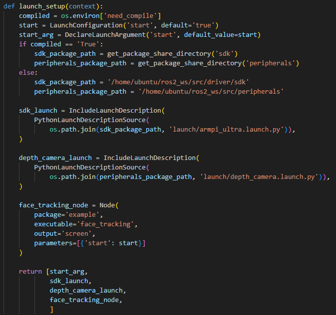
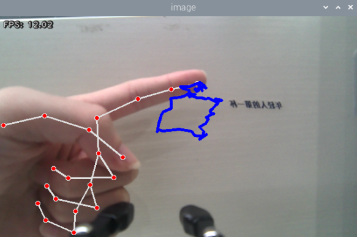

# 6. MediaPipe Human-Robot Interaction Course

## 6.1 MediaPipe Introduction and Getting Started

### 6.1.1 Overview of MediaPipe

MediaPipe is an open-source framework designed for building multimedia machine learning pipelines. It supports cross-platform deployment on mobile devices, desktops, and servers, and can leverage mobile GPU acceleration. MediaPipe is compatible with inference engines such as TensorFlow and TensorFlow Lite, allowing seamless integration with models from both platforms. Additionally, it offers GPU acceleration on mobile and embedded platforms.


### 6.1.2 Advantages and Disadvantages of MediaPipe

* **Advantages of MediaPipe**

1)  MediaPipe supports various platforms and languages, including iOS, Android, C++, Python, JAVAScript, Coral, etc.

2)  Swift running. Models can run in real-time.

3)  Models and codes are with high reuse rate.

* **Disadvantages of MediaPipe**

1)  For mobile devices, MediaPipe will occupy 10M or above.

2)  As it greatly depends on Tensorflow, you need to alter large amount of codes if you want to change it to other machine learning frameworks, which is not friendly to machine learning developer.

3)  It adopts static image which can improve efficiency, but make it difficult to find out the errors.

### 6.1.3 Workflow of Using MediaPipe

The figure below shows how to use MediaPipe. The solid line represents the part to coded, and the dotted line indicates the part not to coded. MediaPipe can offer the result and the function realization framework quickly.


* **Dependency**

MediaPipe utilizes OpenCV to process video, and uses FFMPEG to process audio data. Furthermore, it incorporates other essential dependencies, including OpenGL/Metal, Tensorflow, and Eigen.

MediaPipe leverages rendering engines such as OpenGL and Metal for real-time image rendering and display. This is essential for visualizing processing results on the screen.

TensorFlow is a deep learning framework used for training and deploying machine learning models. MediaPipe relies on TensorFlow to support real-time inference of deep learning models, such as object detection and face recognition.

Eigen is a C++ template library for linear algebra operations. MediaPipe uses Eigen for mathematical computations, especially in model inference and data processing.

Before starting with MediaPipe, it is recommended to have a basic understanding of OpenCV. Please refer to Section 4: OpenCV Basics to get familiar with fundamental OpenCV concepts.

* **MediaPipe Solutions**

Solutions is based on the open-source pre-constructed sample of TensorFlow or TFLite. MediaPipe Solutions is built upon a framework, which provides 16 Solutions, including face detection, Face Mesh, iris, hand, posture, human body and so on.

### 6.1.4 Websites for MediaPipe Learning

MediaPipe Official Website: [https://developers.google.com/mediapipe](https://developers.google.com/mediapipe)

MediaPipe Wiki: [http://i.bnu.edu.cn/wiki/index.php?title=Mediapipe](http://i.bnu.edu.cn/wiki/index.php?title=Mediapipe)

MediaPipe github: [https://github.com/google/mediapipe](quot;https://github.com/google/mediapipe&quot)

dlib Official Website: [http://dlib.net/](http://dlib.net/)

dlib github:[https://github.com/davisking/dlib](https://github.com/davisking/dlib)

## 6.2 Robotic Arm Waste Sorting

### 6.2.1 Project Process

To begin with, initialize the nodes and obtain the camera intrinsic parameters, the set up the object recognition model.

Next, perform image processing and model recognition to calculate the coordinates of the objects.

Finally, send the gripping commands to the robotic arm for picking up and placing the waste blocks.

### 6.2.2 Operations

> [!NOTE]
>
> When entering commands, be sure to use correct case and spacing. You can use the Tab key to auto-complete keywords.

1. Refer to the tutorial [1. ArmPi Ultra User Manual->1.6 Development Environment Setup and Configuration](https://wiki.hiwonder.com/projects/ArmPi-Ultra/en/latest/docs/1.ArmPi_Ultra_User_Manual.html#development-environment-setup-and-configuration) to establish a connection between the robotic arm and the remote desktop tool.

2. Click the terminal icon  in the system desktop to open a command-line window. Enter the following command and press **Enter** to stop the auto-start service.

```
~/.stop_ros.sh
```

3. Enter the following command and press **Enter** to enable waste classification feature.

```
ros2 launch example waste_classification.launch.py
```

4. To stop the program, press **Ctrl + C** in the terminal window. If the program does not stop immediately, repeat this step until it terminates.

5. After completing the feature, you need to initiate the app service.  **Otherwise, future APP features may not function properly.** In the terminal, enter the following command and press **Enter** to start the app service. Wait a few seconds for it to initialize.

```
ros2 launch bringup bringup.launch.py
```

6)  Once the APP service is successfully started, the robotic arm will return to its initial pose, and the buzzer will beep once.

### 6.2.3 Project Outcome

After the program starts, once the camera detects a waste card, the corresponding category name will be displayed on the screen. Each category is highlighted with a rectangle of a specific color. Then, it will proceed to sort and grip the waste blocks.

| **Waste Category** | **Card** |
|:--:|----|
| Hazardous Waste (hazardous_waste) | Storage Battery, Marker, Oral Liquid Bottle |
| Recyclable Waste (recyclable_waste) | Plastic Bottle, Umbrella, Toothbrush |
| Food Waste (food_waste) | Banana Peel, Ketchup, Broken Bones |
| Residual Waste (residual_waste) | Cigarette End, Plate, Disposable Chopsticks |

### 6.2.4 Program Brief Analysis

* **launch File Analysis**

(1) launch_setup Function

{lineno-start=9}

```
def launch_setup(context):
    compiled = os.environ['need_compile']
    start = LaunchConfiguration('start', default='true')
    start_arg = DeclareLaunchArgument('start', default_value=start)
    display = LaunchConfiguration('display', default='true')
    display_arg = DeclareLaunchArgument('display', default_value=display)
    if compiled == 'True':
        sdk_package_path = get_package_share_directory('sdk')
        peripherals_package_path = get_package_share_directory('peripherals')
        example_package_path = get_package_share_directory('example')
        app_package_path = get_package_share_directory('app')
    else:
        sdk_package_path = '/home/ubuntu/ros2_ws/src/driver/sdk'
        peripherals_package_path = '/home/ubuntu/ros2_ws/src/peripherals'
        example_package_path = '/home/ubuntu/ros2_ws/src/example'
        app_package_path = '/home/ubuntu/ros2_ws/src/app'

    depth_camera_launch = IncludeLaunchDescription(
        PythonLaunchDescriptionSource(
            os.path.join(peripherals_package_path, 'launch/depth_camera.launch.py')),
    )
    sdk_launch = IncludeLaunchDescription(
        PythonLaunchDescriptionSource(
            os.path.join(sdk_package_path, 'launch/armpi_ultra.launch.py')),
    )
    yolov8_node = Node(
        package='example',
        executable='yolov8_node',
        output='screen',
        parameters=[{'classes': ['BananaPeel','BrokenBones','CigaretteEnd','DisposableChopsticks','Ketchup','Marker','OralLiquidBottle','PlasticBottle','Plate','StorageBattery','Toothbrush', 'Umbrella']},
                    { "device": "cpu", "model": "garbage_classification_640s", 'conf': 0.6},]
    )

    waste_classification_node = Node(
        package='app',
        executable='waste_classification',
        output='screen',
        parameters=[ {'start': start, 'display': display, 'app': True}],
    )

    return [
            start_arg,
            display_arg,
            depth_camera_launch,
            sdk_launch,
            yolov8_node,
            waste_classification_node,
            ]
```

Starting the SDK files related to the depth camera and the robotic arm. Defines the yolov8_node node for object detection and waste_classification node for waste classification.

(2) generate_launch_description Function

{lineno-start=58}

```
def generate_launch_description():
    return LaunchDescription([
        OpaqueFunction(function = launch_setup)
    ])
```

Creates and returns a LaunchDescription object, calling launch_setup via OpaqueFunction as the standard entry point for the ROS 2 launch file.

(3) Main Function

{lineno-start=63}

```
if __name__ == '__main__':
    # 创建一个LaunchDescription对象
    ld = generate_launch_description()

    ls = LaunchService()
    ls.include_launch_description(ld)
    ls.run()
```

Creates a LaunchDescription object and a LaunchService service. The launch description is added to the service and executed, enabling the startup of the entire system manually.

* **Python File Analysis**

(1) Import the Necessary Libraries

{lineno-start=5}

```
import os
import cv2
import time
import math
import copy
import queue
import threading
import numpy as np

import rclpy
from rclpy.node import Node
from app.common import Heart
from cv_bridge import CvBridge
from std_srvs.srv import Trigger, SetBool
from sensor_msgs.msg import Image, CameraInfo
from rclpy.executors import MultiThreadedExecutor
from rclpy.callback_groups import ReentrantCallbackGroup

from sdk import common
from interfaces.msg import ObjectsInfo
from interfaces.srv import SetStringList
from kinematics_msgs.srv import SetRobotPose
from servo_controller_msgs.msg import ServosPosition
from servo_controller.bus_servo_control import set_servo_position
from app.utils import calculate_grasp_yaw, pick_and_place, distortion_inverse_map

from example.yolov8.yolov8_trt import plot_one_box
```

**interfaces.msg.ObjectsInfo**: A custom message type that contains information about the recognized objects.

**servo_controller_msgs.msg.ServosPosition**: A message type used to control servo positions.

**sdk.common**: A module containing general utility functions, such as coordinate transformation and data processing.

**servo_controller.bus_servo_control**: A module for controlling servo positions.

(2) Waste Model Setup

{lineno-start=33}

```
WASTE_CLASSES = {
    'food_waste': ('BananaPeel', 'BrokenBones', 'Ketchup'),
    'hazardous_waste': ('Marker', 'OralLiquidBottle', 'StorageBattery'),
    'recyclable_waste': ('PlasticBottle', 'Toothbrush', 'Umbrella'),
    'residual_waste': ('Plate', 'CigaretteEnd', 'DisposableChopsticks'),
}
```

WASTE_CLASSES associates the four waste classification types, including food_waste, hazardous_waste, recyclable_waste, residual_waste, with specific item names. Each category is defined as a tuple listing the item names that belong to that class.

(3) Node Initialization

{lineno-start=55}

```
class WasteClassificationNode(Node):
    place_position = {
        'residual_waste': [0.095, -0.214, 0.02],
        'food_waste': [0.040, -0.214, 0.02],
        'hazardous_waste': [-0.018, -0.214, 0.02],
        'recyclable_waste': [-0.07, -0.214, 0.02]
    }

    def __init__(self, name):
        rclpy.init()
        super().__init__(name, allow_undeclared_parameters=True, automatically_declare_parameters_from_overrides=True)
        self.running = True
        self.grasp_finish = True
        self._init_parameters()
        self.config_file = 'transform.yaml'
        self.calibration_file = 'calibration.yaml'
        self.config_path = "/home/ubuntu/ros2_ws/src/app/config/"
        self.camera_type = os.environ['CAMERA_TYPE']
        self.classes =  ['BananaPeel','BrokenBones','CigaretteEnd','DisposableChopsticks','Ketchup',
                         'Marker','OralLiquidBottle','PlasticBottle','Plate','StorageBattery','Toothbrush', 'Umbrella']
        self.target_1 = None
        self.bridge = CvBridge()
        self.image_queue = queue.Queue(maxsize=2)
        self.joints_pub = self.create_publisher(ServosPosition, 'servo_controller', 1)
        self.timer_cb_group = ReentrantCallbackGroup()
        self.enter_srv = self.create_service(Trigger, '~/enter', self.enter_srv_callback)
        self.exit_srv = self.create_service(Trigger, '~/exit', self.exit_srv_callback)
        self.enable_srv = self.create_service(SetBool, '~/enable_transport', self.start_srv_callback)
        self.create_service(SetStringList, '~/set_target', self.set_target_srv_callback)
        self.result_publisher = self.create_publisher(Image, '~/image_result',  1)
        self.start_yolov8_client = self.create_client(Trigger, 'yolov8/start', callback_group=self.timer_cb_group)
        self.start_yolov8_client.wait_for_service()
        self.stop_yolov8_client = self.create_client(Trigger, 'yolov8/stop', callback_group=self.timer_cb_group)
        self.stop_yolov8_client.wait_for_service()
        self.client = self.create_client(Trigger, 'controller_manager/init_finish')
        self.client.wait_for_service()
        self.client = self.create_client(Trigger, 'kinematics/init_finish')
        self.client.wait_for_service()
        self.kinematics_client = self.create_client(SetRobotPose, 'kinematics/set_pose_target', callback_group=self.timer_cb_group)
        self.kinematics_client.wait_for_service()
        self.timer = self.create_timer(0.0, self.init_process, callback_group=self.timer_cb_group)

```

Initializes the ROS node and sets parameters such as startup state and display options. Creates publishers for servo control and subscribers for image, object, and camera information. Sets up service clients for YOLOv8 and the robotic arm controller. Starts the initialization thread, the main logic thread, and the transportation control thread. Supports automatic service startup through parameters.

(4) \_init_paramters Method

{lineno-start=97}

```
    def _init_parameters(self):
        self.heart = None
        self.target_list_temp = []
        self.target_list = []
        self.start_transport = False
        self.enable_transport = False
        self.waste_category = None
        self.count_move = 0
        self.count_still = 0
        self.count_miss = 0
        self.last_position = None
        self.start_get_roi = False
        self.target_object_info = None
        self.intrinsic = None
        self.distortion = None
        self.extristric = None
        self.white_area_center = None
        self.roi = None
        self.enter = False
        self.image_sub = None
        self.object_sub = None
        self.camera_info_sub = None
        self.display = self.get_parameter('display').value
        self.app = self.get_parameter('app').value
        self.static_start_time = None
        self.grasping = False
        self.target_lost_time = None
```

Initializes node parameters including target list, status flags, and camera parameters.

(5) init_process Method

{lineno-start=125}

```
    def init_process(self):
        self.timer.cancel()
        threading.Thread(target=self.main, daemon=True).start()
        threading.Thread(target=self.transport_thread, daemon=True).start()
        if self.get_parameter('start').value:
            self.enter_srv_callback(Trigger.Request(), Trigger.Response())
            req = SetBool.Request()
            req.data = True 
            self.start_srv_callback(req, SetBool.Response())
        self.create_service(Trigger, '~/init_finish', self.get_node_state)
        self.get_logger().info('\033[1;32m%s\033[0m' % 'init finish')
```

Cancels the initialization timer, starts the main logic and transportation threads. If the startup parameter is set to true, the service is automatically entered and the transportation function is enabled. Creates a service to indicate initialization completion and outputs a success log.

(6) get_node_state Function

{lineno-start=137}

```
    def get_node_state(self, request, response):
        response.success = True
        return response
```

Responds to the node initialization completion service and returns a success status.

(7) go_home Function

{lineno-start=141}

```
    def go_home(self, interrupt=True):
        if self.waste_category == "recyclable_waste":
            t = 2.0
        elif self.waste_category == "hazardous_waste":
            t = 1.7
        elif self.waste_category == "food_waste":
            t = 1.4
        elif self.waste_category == "residual_waste":
            t = 1.0
        else:
            t = 1.0
        if interrupt:
            set_servo_position(self.joints_pub, 0.5, ((1, 210),))
            time.sleep(0.5)
        set_servo_position(self.joints_pub, 1.0, ((5, 600), (4, 820), (3, 110), (2, 500)))
        time.sleep(1.0)
        set_servo_position(self.joints_pub, t, ((6, 500),))
        time.sleep(t)
```

Controls the robotic arm to return to the home position, adjusting the reset time based on the waste category.

(8) send_request Function

{lineno-start=160}

```
    def send_request(self, client, msg):
        future = client.call_async(msg)
        while rclpy.ok():
            if future.done() and future.result():
                return future.result()
```

Performs asynchronous service calls and waits for the response.

(9) get_roi Function

{lineno-start=166}

```
    def get_roi(self):
        with open(os.path.join(self.config_path, self.config_file), 'r') as f:
            config = common.get_yaml_data(os.path.join(self.config_path, self.config_file))
            extristric = np.array(config['extristric'])
            self.white_area_center = np.array(config['white_area_pose_world'])
            corners = np.array(config['corners']).reshape(-1, 3)
        while True:
            intrinsic = self.intrinsic
            distortion = self.distortion
            if intrinsic is not None and distortion is not None:
                break
            time.sleep(0.1)
        tvec = extristric[:1]
        rmat = extristric[1:]
        tvec, rmat = common.extristric_plane_shift(np.array(tvec).reshape((3,1)), np.array(rmat), 0.04)
        extristric = tvec, rmat
        self.extristric = extristric
        tvec, rmat = common.extristric_plane_shift(np.array(tvec).reshape((3,1)), np.array(rmat), 0.05)
        imgpts, _ = cv2.projectPoints(corners[:-1], np.array(rmat), np.array(tvec), intrinsic, distortion)
        imgpts = np.int32(imgpts).reshape(-1, 2)
        x_min = min(imgpts, key=lambda p:p[0])[0]
        x_max = max(imgpts, key=lambda p:p[0])[0]
        y_min = min(imgpts, key=lambda p:p[1])[1]
        y_max = max(imgpts, key=lambda p:p[1])[1]
        roi = np.maximum(np.array([y_min, y_max, x_min, x_max]), 0)
        self.roi = roi
```

Calculates the Region of Interest (ROI) based on configuration files and camera parameters to restrict the detection area.

(10) enter_srv_callback Function

{lineno-start=193}

```
    def enter_srv_callback(self, request, response):
        set_servo_position(self.joints_pub, 1, ((6, 500), (5, 600), (4, 825), (3, 110), (2, 500), (1, 210)))
        self._init_parameters()
        self.heart = Heart(self, '~/heartbeat', 5, lambda _: self.exit_srv_callback(Trigger.Request(), Trigger.Response()))
        self.camera_info_sub = self.create_subscription(CameraInfo, 'depth_cam/rgb/camera_info', self.camera_info_callback, 1)
        self.image_sub = self.create_subscription(Image, '/depth_cam/rgb/image_raw', self.image_callback, 1)
        self.object_sub = self.create_subscription(ObjectsInfo, 'yolov8/object_detect', self.get_object_callback, 1)
        self.send_request(self.start_yolov8_client, Trigger.Request())   # 在enter时启动YOLOv8检测
        self.enter = True
        self.start_get_roi = True
        response.success = True
        response.message = "enter"
        return response
```

Enter service callback that resets the robotic arm, initializes heartbeat detection, subscribes to camera and object topics, and starts YOLOv8 detection.

(11) exit_srv_callback Function

{lineno-start=207}

```
    def exit_srv_callback(self, request, response):
        if self.enter:
            if self.image_sub is not None:
                self.destroy_subscription(self.image_sub)
                self.destroy_subscription(self.object_sub)
                self.destroy_subscription(self.camera_info_sub)
                self.image_sub = None
                self.object_sub = None
                self.camera_info_sub = None
            self.send_request(self.stop_yolov8_client, Trigger.Request())  # 退出时停止YOLOv8检测
            self.heart.destroy()
            self.heart = None
            pick_and_place.interrupt(True)
            self.enter = False
            self.start_transport = False
        response.success = True
        response.message = "exit"
        return response
```

Exit service callback that stops topic subscriptions, shuts down YOLOv8, interrupts grasping actions, and resets node state.

(12) start_srv_callback Function

{lineno-start=226}

```
    def start_srv_callback(self, request, response):
        if request.data:
            if self.app:
                target_list = []
                for category in WASTE_CLASSES.values():
                    target_list.extend(category)
                self.target_list = target_list
                self.target_list_temp = copy.deepcopy(self.target_list)
            pick_and_place.interrupt(False)
            self.enable_transport = True
            response.message = "start"
        else:
            pick_and_place.interrupt(True)
            self.enable_transport = False
            self.start_transport = False
            response.message = "stop"
        response.success = True
        return response
```

Handles requests to enable or disable the transportation service. When enabled, initializes the target list and allows grasping. When disabled, interrupts grasping and stops transportation.

(13) set_target_srv_callback Function

{lineno-start=246}

```
    def set_target_srv_callback(self, request, response):
        target_list = []
        for i in request.data:
            target_list.extend(list(WASTE_CLASSES.get(i, [])))
        self.target_list = target_list
        self.target_list_temp = copy.deepcopy(self.target_list)
        response.success = True
        response.message = "set target"
        return response
```

Set target waste type service callback that updates the target waste list based on the request.

(14) transport_thread Function

{lineno-start=256}

```
    def transport_thread(self):
        while self.running:
            if self.start_transport:
                position, yaw, target = self.transport_info
                config_data = common.get_yaml_data(os.path.join(self.config_path, self.calibration_file))
                offset = tuple(config_data['kinematics']['offset'])
                scale = tuple(config_data['kinematics']['scale'])
                for i in range(3):
                    position[i] = position[i] * scale[i] + offset[i]
                finish = pick_and_place.pick(position, 80, yaw, 470, 0.02, self.joints_pub, self.kinematics_client)
                if finish:
                    place_pos = copy.deepcopy(self.place_position[target])
                    yaw = self.calculate_place_grasp_yaw(place_pos, 0)
                    angle = math.degrees(math.atan2(place_pos[1], place_pos[0]))
                    if angle > 45:
                        place_pos = [place_pos[0]*scale[1] + offset[1], place_pos[1]*scale[0] + offset[0], place_pos[2]*scale[2] + offset[2]]
                    elif angle < -45:
                        place_pos = [place_pos[0]*scale[1] + offset[1], place_pos[1]*scale[0] - offset[0], place_pos[2]*scale[2] + offset[2]]
                    else:
                        place_pos = [place_pos[0]*scale[0] + offset[0], place_pos[1]*scale[1] + offset[1], place_pos[2]*scale[2] + offset[2]]
                    finish = pick_and_place.place(place_pos, 80, yaw, 200, self.joints_pub, self.kinematics_client)
                    if finish:
                        self.go_home(False)
                    else:
                        self.go_home(True)
                else:
                    self.go_home(True)
                if self.enter:
                    if self.app:
                        self.target_list = copy.deepcopy(self.target_list_temp)
                    self.waste_category = None
                    self.start_transport = False
                    self.static_start_time = None
                    self.grasping = False
                    self.target_object_info = None
            else:
                time.sleep(0.1)
```

Transportation control thread that controls the robotic arm to pick up waste and place it in the designated area according to its category, then returns to the home position.

(15) get_object_world_position Function

{lineno-start=294}

```
    def get_object_world_position(self, position, intrinsic, extristric, white_area_center, height=0.04):
        projection_matrix = np.row_stack(
            (np.column_stack((extristric[1], extristric[0])), np.array([[0, 0, 0, 1]])))
        world_pose = common.pixels_to_world([position], intrinsic, projection_matrix)[0]
        world_pose[0] = -world_pose[0]
        world_pose[1] = -world_pose[1]
        position = white_area_center[:3, 3] + world_pose
        position[2] = height
        config_data = common.get_yaml_data(os.path.join(self.config_path, self.calibration_file))
        offset = tuple(config_data['pixel']['offset'])
        scale = tuple(config_data['pixel']['scale'])
        for i in range(3):
            position[i] = position[i] * scale[i] + offset[i]
        return position, projection_matrix
```

Converts target pixel coordinates into world coordinates using calibration parameters.

(16) calculate_pick_grasp_yaw Function

{lineno-start=309}

```
    def calculate_pick_grasp_yaw(self, position, target, target_info, intrinsic, projection_matrix):
        yaw = math.degrees(math.atan2(position[1], position[0]))
        if position[0] < 0 and position[1] < 0:
            yaw += 180
        elif position[0] < 0 and position[1] > 0:
            yaw -= 180
        gripper_size = [common.calculate_pixel_length(0.09, intrinsic, projection_matrix),
                        common.calculate_pixel_length(0.02, intrinsic, projection_matrix)]
        return calculate_grasp_yaw.calculate_gripper_yaw_angle(target, target_info, gripper_size, yaw)

```

Computes the yaw angle for grasping, based on the target position and camera parameters.

(17) calculate_place_grasp_yaw Function

{lineno-start=319}

```
    def calculate_place_grasp_yaw(self, position, angle=0):
        yaw = math.degrees(math.atan2(position[1], position[0]))
        if position[0] < 0 and position[1] < 0:
            yaw += 180
        elif position[0] < 0 and position[1] > 0:
            yaw -= 180
        yaw1 = yaw + angle
        yaw2 = yaw1 + (90 if yaw < 0 else -90)
        yaw = yaw1 if abs(yaw1) < abs(yaw2) else yaw2
        yaw = 500 + int(yaw / 240 * 1000)
        return yaw
```

Computes the yaw angle for placing, based on the placement position.

(18) main Method

{lineno-start=331}

```
       def main(self):
        while self.running:
            if self.enter:
                if self.start_get_roi:
                    self.get_roi()
                    self.start_get_roi = False
                try:
                    bgr_image = self.image_queue.get(block=True, timeout=1)
                except queue.Empty:
                    continue
                roi = self.roi
                if self.grasping and self.start_transport:
                    if self.display:
                        cv2.imshow('image', bgr_image)
                        cv2.waitKey(1)
                    else:
                        self.result_publisher.publish(self.bridge.cv2_to_imgmsg(bgr_image, "bgr8"))
                    time.sleep(0.01)
                    continue
                if roi is not None:
                    if self.target_object_info is not None:
                        target_object_info = copy.deepcopy(self.target_object_info)
                        class_index = self.classes.index(target_object_info[0][0])
                        color = colors(class_index, True)
                        plot_one_box(np.array(self.target_1[1]), bgr_image,
                                     label=f"{target_object_info[0][0]}:{self.target_1[0]:.2f}",
                                     color=color, line_thickness=3, rotated=True)
                        center = target_object_info[0][2]
                        if self.camera_type == 'usb_cam':
                            x, y = distortion_inverse_map.undistorted_to_distorted_pixel(center[0], center[1], self.intrinsic, self.distortion)
                            center = (x, y)
                        intrinsic = self.intrinsic
                        if roi[2] < center[0] < roi[3] and roi[0] < center[1] < roi[1]:
                            position, projection_matrix = self.get_object_world_position(target_object_info[0][2], intrinsic, self.extristric, self.white_area_center, 0.04)
                            result = self.calculate_pick_grasp_yaw(position, target_object_info[0], target_object_info[1], intrinsic, projection_matrix)
                            if result is not None and not self.grasping:
                                if self.last_position is not None:
                                    e_distance = math.sqrt(pow(self.last_position[0] - position[0], 2) + pow(self.last_position[1] - position[1], 2))
                                    if e_distance <= 0.005:
                                        if self.static_start_time is None:
                                            self.static_start_time = time.time()
                                        elif time.time() - self.static_start_time >= 1.5:
                                            self.grasping = True
                                            for k, v in WASTE_CLASSES.items():
                                                if target_object_info[0][0] in v:
                                                    self.waste_category = k
                                                    break
                                            yaw = 500 + int(result[0] / 240 * 1000)
                                            self.transport_info = [position, yaw, self.waste_category]
                                            self.start_transport = True
                                    else:
                                        self.static_start_time = None
                                self.last_position = position
                        else:
                            self.static_start_time = None
                            self.last_position = None
                    else:
                        self.static_start_time = None
                        self.last_position = None
                        if self.enable_transport:
                            self.count_miss += 1
                            if self.count_miss > 2:
                                self.target_list = copy.deepcopy(self.target_list_temp)
                                self.count_miss = 0
                        time.sleep(0.02)
                    if self.display:
                        cv2.imshow('image', bgr_image)
                        cv2.waitKey(1)
                    else:
                        self.result_publisher.publish(self.bridge.cv2_to_imgmsg(bgr_image, "bgr8"))
                else:
                    time.sleep(0.02)
                if self.grasping and not self.start_transport:
                    self.grasping = False
                    self.target_lost_time = None
                    self.static_start_time = None
                    self.last_position = None
                    if self.app:
                        self.target_list = copy.deepcopy(self.target_list_temp)
                    self.waste_category = None
                    self.target_object_info = None
            else:
                time.sleep(0.1)                                      
```

Main logic thread that processes the image queue, checks if the target is inside the ROI, determines whether the target is stationary to trigger grasping, and displays or publishes the processing results.

(19) get_object_callback Function

{lineno-start=415}

```
    def get_object_callback(self, msg):
        objects = msg.objects
        if not self.enable_transport:
            return
        local_target_object_info = None
        local_objects_list = []
        local_object_info = None
        class_name = None
        for i in objects:
            if i.angle < 0:
                i.angle = 90 - abs(i.angle)
            target = [i.class_name, 0, (int(i.box[0]), int(i.box[1])), (int(i.box[2]), int(i.box[3])), i.angle]
            self.target_1 = [i.score, i.box]
            if i.class_name in self.target_list:
                if local_object_info is None:
                    local_object_info = target
                if local_object_info[0] == i.class_name:
                    class_name = i.class_name
                    local_object_info = target
            local_objects_list.append(target)
        if class_name is not None:
            local_target_object_info = [local_object_info, local_objects_list]
        if local_target_object_info is not None:
            self.target_object_info = copy.deepcopy(local_target_object_info)
            self.target_lost_time = None
        else:
            if self.target_lost_time is None:
                self.target_lost_time = time.time()
            elif time.time() - self.target_lost_time > 0.5:
                self.target_object_info = None
                self.target_lost_time = None
```

(20) camera_info_callback Function

{lineno-start=447}

```
    def camera_info_callback(self, msg):
        self.intrinsic = np.matrix(msg.k).reshape(1, -1, 3)
        self.distortion = np.array(msg.d)
```

Receives camera intrinsic parameters and stores intrinsics and distortion coefficients.

(21) image_callback Function

{lineno-start=451}

```
    def image_callback(self, ros_image):
        cv_image = self.bridge.imgmsg_to_cv2(ros_image, "bgr8")
        bgr_image = np.array(cv_image, dtype=np.uint8)
        if self.image_queue.full():
            self.image_queue.get()
        self.image_queue.put(bgr_image)
```

Receives camera image messages, converts them into OpenCV format, and stores them in the image queue. Oldest image is discarded if the queue is full.

(22) main Function

{lineno-start=458}

```
def main():
    node = WasteClassificationNode('waste_classification')
    executor = MultiThreadedExecutor()
    executor.add_node(node)
    try:
        executor.spin()
    except KeyboardInterrupt:
        node.running = False
        executor.shutdown()
```

Creates a WasteClassificationNode instance and runs it using a multi-threaded executor. On keyboard interrupt, stops the node and shuts down the executor.

## 6.3 3D Face Detection

### 6.3.1 Project Process

Firstly, initialize the node and robotic arm, subscribe to the camera image topic and create FeceMesh model instance for face detection.

Next, proceed to perform image processing to obtain the face key points information. Then connect all the key points of human face to form a contour of human face.

Lastly, combine the original RGB image with the black canvas that has facial contours drawn on it, forming a displayed result image.

### 6.3.2 Operations

> [!NOTE]
>
> When entering commands, be sure to use correct case and spacing. You can use the Tab key to auto-complete keywords.

1. Refer to the tutorial [1. ArmPi Ultra User Manual->1.6 Development Environment Setup and Configuration](https://wiki.hiwonder.com/projects/ArmPi-Ultra/en/latest/docs/1.ArmPi_Ultra_User_Manual.html#development-environment-setup-and-configuration) to establish a connection between the robotic arm and the remote desktop tool.

2. Click the terminal icon  in the system desktop to open a command-line window. Enter the following command and press **Enter** to stop the auto-start service:

```
~/.stop_ros.sh
```

3. Enter the following command and press **Enter** to start the feature.

```
ros2 launch example face_mesh.launch.py
```

4. To stop the program, press **Ctrl + C** in the terminal window. If the program does not stop immediately, repeat this step until it terminates.

5. After completing the feature, you need to initiate the app service.  **Otherwise, future APP features may not function properly.** In the terminal, enter the following command and press **Enter** to start the app service. Wait a few seconds for it to initialize.

```
ros2 launch bringup bringup.launch.py
```

6. Once the APP service is successfully started, the robotic arm will return to its initial pose, and the buzzer will beep once.

### 6.3.3 Project Outcome

The camera can obtain facial key point information, and connect all the detected key points to form the outline of the face displayed on a black canvas.

### 6.3.4 Program Brief Analysis

* **launch File Analysis**

(1) launch_setup Function

{lineno-start=9}

```
def launch_setup(context):
    compiled = os.environ['need_compile']

    if compiled == 'True':
        sdk_package_path = get_package_share_directory('sdk')
        peripherals_package_path = get_package_share_directory('peripherals')
    else:
        sdk_package_path = '/home/ubuntu/ros2_ws/src/driver/sdk'
        peripherals_package_path = '/home/ubuntu/ros2_ws/src/peripherals'
    
    sdk_launch = IncludeLaunchDescription(
        PythonLaunchDescriptionSource(
            os.path.join(sdk_package_path, 'launch/armpi_ultra.launch.py')),
    )

    depth_camera_launch = IncludeLaunchDescription(
        PythonLaunchDescriptionSource(
            os.path.join(peripherals_package_path, 'launch/depth_camera.launch.py')),
    )

    face_mesh_node = Node(
        package='example',
        executable='face_mesh',
        output='screen',
    )

    return [depth_camera_launch,
            sdk_launch,
            face_mesh_node,
            ]

```

Includes the **launch/armpi_ultra.launch.py** launch file from the sdk package to start SDK-related nodes, like underlying services for robotic arm control, and the **launch/depth_camera.launch.py** launch file from the peripherals package to start depth camera-related nodes offering image input. Defines the face_mesh_node node, launches the face_mesh executable from the example package, and outputs logs to the screen. This node is used to implement face mesh detection functionality.

(2) generate_launch_description Function

{lineno-start=40}

```
def generate_launch_description():
    return LaunchDescription([
        OpaqueFunction(function = launch_setup)
    ])
```

Creates and returns a LaunchDescription object, calling launch_setup via OpaqueFunction as the standard entry point for the ROS 2 launch file.

(3) Main Function

{lineno-start=45}

```
if __name__ == '__main__':
    # 创建一个LaunchDescription对象
    ld = generate_launch_description()

    ls = LaunchService()
    ls.include_launch_description(ld)
    ls.run()
```

Creates a LaunchDescription object and a LaunchService service. The launch description is added to the service and executed, enabling the startup of the entire system manually.

* **Python File Analysis**

(1) Import the Necessary Libraries

{lineno-start=4}

```
import os
import cv2
import rclpy
import queue
import threading
import numpy as np
import sdk.fps as fps
import mediapipe as mp
from rclpy.node import Node
from cv_bridge import CvBridge
from std_srvs.srv import Trigger
from sensor_msgs.msg import Image
from servo_controller_msgs.msg import ServosPosition
from servo_controller.bus_servo_control import set_servo_position
```

**import sdk.fps as fps**: Imports the custom fps module, used for calculating and displaying frame rates.

**import mediapipe as mp**: Imports the MediaPipe library, which provides computer vision functionalities such as face and hand detection.

**from servo_controller_msgs.msg import ServosPosition**: Imports the ServosPosition message type from the servo_controller_msgs.msg package, which is used to control the servo positions.

**from servo_controller.bus_servo_control import set_servo_position**: Imports the set_servo_position function from the custom bus_servo_control module, used to send control signals to servos.

(2) FaceMeshNode Class Initialization Function

{lineno-start=23}

```
class FaceMeshNode(Node):
    def __init__(self, name):
        rclpy.init()
        super().__init__(name)
        self.running = True
        self.bridge = CvBridge()
        self.face_mesh = mp.solutions.face_mesh.FaceMesh(
            static_image_mode=False,
            max_num_faces=1,
            min_detection_confidence=0.5,
        )
        self.drawing = mp.solutions.drawing_utils

        self.fps = fps.FPS()

        self.image_queue = queue.Queue(maxsize=2)
        self.image_sub = self.create_subscription(Image, 'depth_cam/rgb/image_raw', self.image_callback, 1)

        self.joints_pub = self.create_publisher(ServosPosition, 'servo_controller', 1) # 舵机控制
        #等待服务启动
        self.client = self.create_client(Trigger, 'controller_manager/init_finish')
        self.client.wait_for_service()
        set_servo_position(self.joints_pub, 1.5, ((1, 500), (2, 500), (3, 330), (4, 900), (5, 700), (6, 500)))


        self.get_logger().info('\033[1;32m%s\033[0m' % 'start')
        threading.Thread(target=self.main, daemon=True).start()
```

Initializes the ROS node and sets the running flag running and the image conversion tool CvBridge. Configures the MediaPipe Face Mesh detector face_mesh with parameters: non-static image mode, a maximum of one face, and a minimum detection confidence of 0.5. Initializes the FPS counter fps and a thread-safe image queue image_queue. Subscribes to the depth camera RGB image topic depth_cam/rgb/image_raw. Creates a servo control publisher servo_controller. Waits for the arm controller service to start, then moves servos to the initial position. Outputs startup logs and launches the main processing thread.

(3) image_callback Function

{lineno-start=51}

```
    def image_callback(self, ros_image):
        cv_image = self.bridge.imgmsg_to_cv2(ros_image, "rgb8")
        rgb_image = np.array(cv_image, dtype=np.uint8)
        if self.image_queue.full():
            # 如果队列已满，丢弃最旧的图像
            self.image_queue.get()
            # 将图像放入队列
        self.image_queue.put(rgb_image)
```

Image subscription callback function that converts ROS image messages to OpenCV RGB images and stores them in the image queue, discarding the oldest images if the queue is full.

(4) main Method

{lineno-start=60}

```
    def main(self):
        while self.running:
            try:
                image = self.image_queue.get(block=True, timeout=1)
            except queue.Empty:
                if not self.running:
                    break
                else:
                    continue
            black_image = np.zeros_like(image)

            resize_image = cv2.resize(image, (int(image.shape[1] / 2), int(image.shape[0] / 2)), cv2.INTER_NEAREST) # 缩放图片(resize the image)
            results = self.face_mesh.process(resize_image) # 调用人脸检测(call human face detection)
            if results.multi_face_landmarks is not None:
                for face_landmarks in results.multi_face_landmarks:
                    mp_drawing.draw_landmarks(
                            image=black_image,
                            landmark_list=face_landmarks,
                            connections = mp_face_mesh.FACEMESH_CONTOURS,
                            landmark_drawing_spec=drawing_spec,
                            connection_drawing_spec=drawing_spec)
            result_image = np.concatenate([image, black_image], axis=1)
            mp_image = mp.Image(image_format=mp.ImageFormat.SRGB, data=image)
            self.fps.update()
            result_image = self.fps.show_fps(result_image)
            result_image = cv2.cvtColor(result_image, cv2.COLOR_RGB2BGR)
            cv2.imshow('face_mech', result_image)
            key = cv2.waitKey(1)
            if key == ord('q') or key == 27:  # 按q或者esc退出
                break
        cv2.destroyAllWindows()
        rclpy.shutdown()
```

Continuously processes images from the queue.  

Reads each image and downsamples it to half the original size to improve efficiency. Passes the image to the MediaPipe Face Mesh detector for processing. If a face is detected, draws face mesh landmarks and connecting lines on a black canvas using mp_drawing.draw_landmarks. Concatenates the original image and the mesh rendering side by side, calculates and displays the FPS, and converts the result to BGR format for display in an OpenCV window. Listens for keyboard input. Pressing q or Esc exits the loop, closes the display window, and terminates ROS.

(5) main Function

{lineno-start=93}

```
def main():
    node = FaceMeshNode('face_landmarker')
    try:
        rclpy.spin(node)
    except KeyboardInterrupt:
        node.destroy_node()
        rclpy.shutdown()
        print('shutdown')
    finally:
        print('shutdown finish')
```

Creates a FaceMeshNode instance named face_landmarker. Keeps the node running with rclpy.spin. When a keyboard interrupt is detected, destroys the node, shuts down ROS, and outputs a shutdown log.

## 6.4 Mediapipe Face Tracking

### 6.4.1 Project Process

Firstly, initialize the node and servos, subscribe to the camera image topic, create the FaceTracker class. Initialize the face detector, PID controller, and related variables.

Next, perform image processing by using the face detector to obtain facial bounding boxes and keypoints.

Then, calculate the distance between the face and the center of the screen. Based on the PID controller's calculations, control the robotic arm to achieve face tracking.

### 6.4.2 Operations

> [!NOTE]
>
> When entering commands, be sure to use correct case and spacing. You can use the Tab key to auto-complete keywords.

1. Refer to the tutorial [1. ArmPi Ultra User Manual /6. Development Environment Setup and Configuration](https://wiki.hiwonder.com/projects/ArmPi-Ultra/en/latest/docs/1.ArmPi_Ultra_User_Manual.html#development-environment-setup-and-configuration) to establish a connection between the robotic arm and the remote desktop tool.

2. Click the terminal icon  in the system desktop to open a command-line window. Enter the following command and press **Enter** to stop the auto-start service:

```
~/.stop_ros.sh
```

3. Enter the following command and press **Enter** to start the feature.

```
ros2 launch example face_tracking.launch.py
```

4. To stop the program, press **Ctrl + C** in the terminal window. If the program does not stop immediately, repeat this step until it terminates.

5. After completing the feature, you need to initiate the app service.  **Otherwise, future APP features may not function properly.** In the terminal, enter the following command and press **Enter** to start the app service. Wait a few seconds for it to initialize.

```
ros2 launch bringup bringup.launch.py
```

### 6.4.3 Project Outcome

Robotic arm will detect face and enclose it on the returned image. It is capable of tracking the movement of the face, ensuring that the face is located in the center of the image.

### 6.4.4 Program Brief Analysis

* **launch File Analysis**

(1) launch_setup Function 

{lineno-start=9}

```
def launch_setup(context):
    compiled = os.environ['need_compile']
    start = LaunchConfiguration('start', default='true')
    start_arg = DeclareLaunchArgument('start', default_value=start)
    if compiled == 'True':
        sdk_package_path = get_package_share_directory('sdk')
        peripherals_package_path = get_package_share_directory('peripherals')
    else:
        sdk_package_path = '/home/ubuntu/ros2_ws/src/driver/sdk'
        peripherals_package_path = '/home/ubuntu/ros2_ws/src/peripherals'

    sdk_launch = IncludeLaunchDescription(
        PythonLaunchDescriptionSource(
            os.path.join(sdk_package_path, 'launch/armpi_ultra.launch.py')),
    )
    
    depth_camera_launch = IncludeLaunchDescription(
        PythonLaunchDescriptionSource(
            os.path.join(peripherals_package_path, 'launch/depth_camera.launch.py')),
    )

    face_tracking_node = Node(
        package='example',
        executable='face_tracking',
        output='screen',
        parameters=[{'start': start}]
    )

    return [start_arg,
            sdk_launch,
            depth_camera_launch,
            face_tracking_node,
            ]
```



Includes the **launch/armpi_ultra.launch.py** launch file from the sdk package to start underlying services for robotic arm control, and the **launch/depth_camera.launch.py** launch file from the peripherals package to start depth camera-related nodes offering image input. Defines the face_tracking_node node, launches the face_tracking executable from the example package, outputs logs to the screen, and passes the parameter start to control the startup state.

(2) generate_launch_description Function

{lineno-start=43}

```
def generate_launch_description():
    return LaunchDescription([
        OpaqueFunction(function = launch_setup)
    ])
```

Creates and returns a LaunchDescription object, calling launch_setup via OpaqueFunction as the standard entry point for the ROS 2 launch file.

(3) Main Function

{lineno-start=48}

```
if __name__ == '__main__':
    # 创建一个LaunchDescription对象
    ld = generate_launch_description()

    ls = LaunchService()
    ls.include_launch_description(ld)
    ls.run()
```

Creates a LaunchDescription object and a LaunchService service. The launch description is added to the service and executed, enabling the startup of the entire system manually.

* **Python File Analysis**

(1) Import the Necessary Libraries 

{lineno-start=4}

```
import os
import cv2
import time
import queue
import rclpy
import threading
import numpy as np
import sdk.pid as pid
import mediapipe as mp
from sdk import fps
from rclpy.node import Node
from cv_bridge import CvBridge
from std_srvs.srv import Trigger
from sensor_msgs.msg import Image
from kinematics_msgs.srv import SetRobotPose
from rclpy.executors import MultiThreadedExecutor
from servo_controller_msgs.msg import ServosPosition
from rclpy.callback_groups import ReentrantCallbackGroup
from kinematics.kinematics_control import set_pose_target
from servo_controller.bus_servo_control import set_servo_position
from sdk.common import show_faces, mp_face_location, box_center, distance
```

**import sdk.pid as pid**: Imports the PID control module.

**import mediapipe as mp**: Imports the MediaPipe library for face detection and tracking.

**from sdk import fps**: Imports the FPS monitoring module.

**from servo_controller_msgs.msg import ServosPosition**: Imports the ROS 2 message type for servo positions, used to control servos.

**from kinematics.kinematics_control import set_pose_target**: Imports the function for setting robot joint target positions.

**from servo_controller.bus_servo_control import set_servo_position**: Imports the function to set servo positions.

**from sdk.common import show_faces, mp_face_location, box_center, distance**: Imports utility functions from the SDK module for face detection and related operations.

(2) FaceTrackingNode Class Initialization Function

{lineno-start=26}

```
class FaceTrackingNode(Node):
    def __init__(self, name):
        rclpy.init()
        super().__init__(name, allow_undeclared_parameters=True, automatically_declare_parameters_from_overrides=True)
        self.face_detector = mp.solutions.face_detection.FaceDetection(
            min_detection_confidence=0.3,
        )
        self.running = True
        self.bridge = CvBridge()
        self.fps = fps.FPS()
        self.image_queue = queue.Queue(maxsize=2)
        
        self.z_dis = 0.22
        self.y_dis = 500
        self.x_init = 0.167
        self.pid_z = pid.PID(0.00006, 0.0, 0.0)
        self.pid_y = pid.PID(0.045, 0.0, 0.00015)
        self.detected_face = 0 
        self.joints_pub = self.create_publisher(ServosPosition, 'servo_controller', 1) # 舵机控制

        self.image_sub = self.create_subscription(Image, 'depth_cam/rgb/image_raw', self.image_callback, 1)  # 摄像头订阅(subscribe to the camera)

        self.result_publisher = self.create_publisher(Image, '~/image_result', 1)  # 图像处理结果发布(publish the image processing result)
        timer_cb_group = ReentrantCallbackGroup()
        self.create_service(Trigger, '~/start', self.start_srv_callback) # 进入玩法
        self.create_service(Trigger, '~/stop', self.stop_srv_callback, callback_group=timer_cb_group) # 退出玩法
        self.client = self.create_client(Trigger, 'controller_manager/init_finish')
        self.client.wait_for_service()
        self.client = self.create_client(Trigger, 'kinematics/init_finish')
        self.client.wait_for_service()

        self.kinematics_client = self.create_client(SetRobotPose, 'kinematics/set_pose_target')
        self.kinematics_client.wait_for_service()

        self.timer = self.create_timer(0.0, self.init_process, callback_group=timer_cb_group)

```

Configures all dependencies in a unified manner to ensure the node is ready immediately after startup, providing a stable runtime environment for face detection and tracking.

(3) init_process Function

{lineno-start=62}

```
    def init_process(self):
        self.timer.cancel()

        self.init_action()
        if self.get_parameter('start').value:
            self.start_srv_callback(Trigger.Request(), Trigger.Response())

        threading.Thread(target=self.main, daemon=True).start()
        self.create_service(Trigger, '~/init_finish', self.get_node_state)
        self.get_logger().info('\033[1;32m%s\033[0m' % 'start')
```

Cancels the initialization timer, executes the initial action by reset the robotic arm, and automatically triggers face tracking if the startup parameter is set to true. Starts the main logic thread, creates the initialization completion service, and logs the startup status.

(4) init_action Function

{lineno-start=80}

```
    def init_action(self):
        msg = set_pose_target([self.x_init, 0.0, self.z_dis], 0.0, [-90.0, 90.0], 1.0)        
        res = self.send_request(self.kinematics_client, msg)
        if res.pulse:
            servo_data = res.pulse
            set_servo_position(self.joints_pub, 1.5, ((1, 500), (2, 500), (3, servo_data[3]), (4, servo_data[2]), (5, servo_data[1]), (6, servo_data[0])))
            time.sleep(1.8)
```

Moves the robotic arm to its initial position, uses the kinematics service to compute the target pose, drives the servos to the specified angles, and waits for completion.

(5) start_srv_callback and stop_srv_callback Function

{lineno-start=95}

```
    def start_srv_callback(self, request, response):
        self.get_logger().info('\033[1;32m%s\033[0m' % "start face track")
        
        self.start = True
        response.success = True
        response.message = "start"
        return response

    def stop_srv_callback(self, request, response):
        self.get_logger().info('\033[1;32m%s\033[0m' % "stop face track")
        self.start = False
        res = self.send_request(ColorDetect.Request())
        if res.success:
            self.get_logger().info('\033[1;32m%s\033[0m' % 'set face success')
        else:
            self.get_logger().info('\033[1;32m%s\033[0m' % 'set face fail')
        response.success = True
        response.message = "stop"
        return response
```

start_srv_callback: Handles the request to start face tracking. Sets the start flag to true, logs the startup event, and returns a success response. stop_srv_callback: Handles the request to stop face tracking. Sets the start flag to false.

(6) image_callback Function

{lineno-start=115}

```
    def image_callback(self, ros_image):
        # 将画面转为 opencv 格式(convert the screen to opencv format)
        cv_image = self.bridge.imgmsg_to_cv2(ros_image, "bgr8")
        bgr_image = np.array(cv_image, dtype=np.uint8)

        if self.image_queue.full():
            # 如果队列已满，丢弃最旧的图像
            self.image_queue.get()
        # 将图像放入队列
        self.image_queue.put(bgr_image)
```

Subscribes to the camera image topic, converts the incoming ROS image message into OpenCV's BGR format, and stores it in the image queue. If the queue is full, the oldest images are discarded to prevent processing delays.

(7) main Method

{lineno-start=127}

```
    def main(self):

        while self.running:
            bgr_image = self.image_queue.get()

            result_image = np.copy(bgr_image)
            results = self.face_detector.process(bgr_image)
            boxes, keypoints = mp_face_location(results, bgr_image)
            o_h, o_w = bgr_image.shape[:2]
            if len(boxes) > 0:
                self.detected_face += 1 
                self.detected_face = min(self.detected_face, 20) # 让计数总是不大于20(ensure that the count is never greater than 20)

                # 连续 5 帧识别到了人脸就开始追踪, 避免误识别(start tracking if a face is detected in five consecutive frames to avoid false positives)
                if self.detected_face >= 5:
                    center = [box_center(box) for box in boxes] # 计算所有人脸的中心坐标(calculate the center coordinate of all human faces)
                    dist = [distance(c, (o_w / 2, o_h / 2)) for c in center] # 计算所有人脸中心坐标到画面中心的距离(calculate the distance from the center of each detected face to the center of the screen)
                    face = min(zip(boxes, center, dist), key=lambda k: k[2]) # 找出到画面中心距离最小的人脸(identify the face with the minimum distance to the center of the screen)

                    center_x, center_y = face[1]
                    t1 = time.time()
                    self.pid_y.SetPoint = result_image.shape[1]/2 
                    self.pid_y.update(center_x)
                    self.y_dis += self.pid_y.output
                    if self.y_dis < 200:
                        self.y_dis = 200
                    if self.y_dis > 800:
                        self.y_dis = 800

                    self.pid_z.SetPoint = result_image.shape[0]/2 
                    self.pid_z.update(center_y)
                    self.z_dis += self.pid_z.output                    
                    if self.z_dis > 0.28:
                        self.z_dis = 0.28
                    if self.z_dis < 0.20:
                        self.z_dis = 0.20
                    msg = set_pose_target([self.x_init, 0.0, f"{self.z_dis:.2f}"], 0.0, [-90.0, 90.0], 1.0)
                    res = self.send_request(self.kinematics_client, msg)
                    t2 = time.time()
                    t = t2 - t1
                    if t < 0.02:
                        time.sleep(0.02 - t)
                    if res.pulse:
                        servo_data = res.pulse                        
                        set_servo_position(self.joints_pub, 0.02, ((1, 500), (2, 500), (3, servo_data[3]), (4, servo_data[2]), (5, servo_data[1]), (6, int(self.y_dis))))
                    else:
                        set_servo_position(self.joints_pub, 0.02, ((6, int(self.y_dis)), ))

                result_image = show_faces( result_image, bgr_image, boxes, keypoints) # 在画面中显示识别到的人脸和脸部关键点(display the detected faces and facial key points on the screen)
            else: # 这里是没有识别到人脸的处理(here is the processing for when no face is detected)         
                if self.detected_face > 0:
                    self.detected_face -= 1
                else:
                    self.pid_z.clear()
                    self.pid_y.clear()


            self.result_publisher.publish(self.bridge.cv2_to_imgmsg(result_image, "bgr8"))
            self.fps.update()
            self.fps.show_fps(result_image)
            cv2.imshow("result", result_image)
            cv2.waitKey(1)

        self.init_action()
        rclpy.shutdown()

```

Face detection: Continuously retrieves images from the queue, applies MediaPipe to detect faces, extracts bounding boxes and keypoints, and processes the results with mp_face_location to obtain the coordinates of the face bounding box and keypoints.

Tracking trigger condition: Face tracking starts only after detecting a face for more than 5 consecutive frames to reduce false positives. The face closest to the image center is selected as the tracking target.

PID control: Computes the offset between the face center and the image center. Uses pid_y to adjust the Y-axis servo position y_dis, constrained within the range 200–800. Uses pid_z to adjust the Z-axis distance z_dis, constrained within 0.20–0.28 meters.

Robotic arm control: Calls the kinematics service to obtain the target servo angles and publishes servo control messages to move the robotic arm for face tracking. If the kinematics service does not respond, directly controls the Y-axis servo.

Result visualization: Draws the face bounding box and keypoints on the image, computes and displays FPS, publishes the processed image, and displays it in real time via an OpenCV window.

No-face handling: If no face is detected, the detection counter is gradually decreased. Once it reaches zero, the PID controllers are reset.

## 6.5 MediaPipe Gesture Interaction

### 6.5.1 Project Process

Firstly, initialize the nodes and the servos of robotic arm, subscribe to the camera image topic, and create HandGestureNode class.

Next, perform image processing to detect and recognize gestures.

Then invoke the corresponding action group to execute the interaction of robotic arm.

### 6.5.2 Operations

> [!NOTE]
>
> When entering commands, be sure to use correct case and spacing. You can use the Tab key to auto-complete keywords.

1. Refer to the tutorial [1. ArmPi Ultra User Manual ->1.6 Development Environment Setup and Configuration](https://wiki.hiwonder.com/projects/ArmPi-Ultra/en/latest/docs/1.ArmPi_Ultra_User_Manual.html#development-environment-setup-and-configuration) to establish a connection between the robotic arm and the remote desktop tool.

2. Click the terminal icon  in the system desktop to open a command-line window. Enter the following command and press **Enter** to stop the auto-start service:

```
~/.stop_ros.sh
```

3. Enter the following command and press **Enter** to start the feature.

```
ros2 launch example hand_gesture.launch.py
```

4. To stop the program, press **Ctrl + C** in the terminal window. If the program does not stop immediately, repeat this step until it terminates.

5. After completing the feature, you need to initiate the app service.  **Otherwise, future APP features may not function properly.** In the terminal, enter the following command and press **Enter** to start the app service. Wait a few seconds for it to initialize.

```
ros2 launch bringup bringup.launch.py
```

6. Once the APP service is successfully started, the robotic arm will return to its initial pose, and the buzzer will beep once.

### 6.5.3 Project Outcome

The robotic arm can detect key points on the hand and connect them to recognize gestures, and execute a corresponding action group for interactive movements. The gesture "**one**" triggers the action group "**one.d6a**", the gesture "**two**" triggers the action group "**two.d6a**", and so on. Regarding the edition and execution of action groups, please refer to "[2.4.2 Action Group Editing and Execution](https://wiki.hiwonder.com/projects/ArmPi-Ultra/en/latest/docs/2.Robotic_Arm_Basic_Control_User_Manual.html#action-group-editing-and-execution)".


### 6.5.4 Program Brief Analysis

* **launch File Analysis**

(1) launch_setup Function 

{lineno-start=9}

```
def launch_setup(context):
    compiled = os.environ['need_compile']
    start = LaunchConfiguration('start', default='true')
    start_arg = DeclareLaunchArgument('start', default_value=start)
    if compiled == 'True':
        sdk_package_path = get_package_share_directory('sdk')
        peripherals_package_path = get_package_share_directory('peripherals')
    else:
        sdk_package_path = '/home/ubuntu/ros2_ws/src/driver/sdk'
        peripherals_package_path = '/home/ubuntu/ros2_ws/src/peripherals'

    sdk_launch = IncludeLaunchDescription(
        PythonLaunchDescriptionSource(
            os.path.join(sdk_package_path, 'launch/armpi_ultra.launch.py')),
    )

    
    depth_camera_launch = IncludeLaunchDescription(
        PythonLaunchDescriptionSource(
            os.path.join(peripherals_package_path, 'launch/depth_camera.launch.py')),
    )

    hand_gesture_node = Node(
        package='example',
        executable='hand_gesture',
        output='screen',
    )

    return [start_arg,
            sdk_launch,
            depth_camera_launch,
            hand_gesture_node,
            ]
```

Includes **launch/armpi_ultra.launch.py** file from the sdk package to start the underlying services for robotic arm control, such as servo driver and kinematics computation. Includes **launch/depth_camera.launch.py** file from the peripherals package to start the depth camera node, providing the image input source.

(2) generate_launch_description Function

{lineno-start=43}

```
def generate_launch_description():
    return LaunchDescription([
        OpaqueFunction(function = launch_setup)
    ])
```

Creates and returns a LaunchDescription object, calling launch_setup via OpaqueFunction as the standard entry point for the ROS 2 launch file.

(3) Main Function

{lineno-start=48}

```
if __name__ == '__main__':
    # 创建一个LaunchDescription对象
    ld = generate_launch_description()

    ls = LaunchService()
    ls.include_launch_description(ld)
    ls.run()
```

Creates a LaunchDescription object and a LaunchService service. The launch description is added to the service and executed, enabling the startup of the entire system manually.

* **Python File Analysis**

(1) Import the Necessary Libraries

{lineno-start=4}

```
import cv2
import time
import enum
import rclpy
import queue
import threading
import numpy as np
import sdk.fps as fps
import mediapipe as mp
import sdk.buzzer as buzzer
from rclpy.node import Node
from cv_bridge import CvBridge
from std_srvs.srv import Trigger
from sensor_msgs.msg import Image
from rclpy.executors import MultiThreadedExecutor
from sdk.common import  distance, vector_2d_angle
from servo_controller_msgs.msg import ServosPosition
from rclpy.callback_groups import ReentrantCallbackGroup
from servo_controller.bus_servo_control import set_servo_position
from servo_controller.action_group_controller import ActionGroupController
```

**import sdk.fps as fps**: Imports the fps module, used for calculating and displaying frame rates.

**import mediapipe as mp**: Imports the mediapipe module, providing computer vision tools for hand detection and other features.

**import sdk.buzzer as buzzer**: Imports the buzzer module, used to control the buzzer.

**from sdk.common import distance, vector_2d_angle**: Imports the distance and vector_2d_angle methods from sdk.common, used to calculate the distance between two points and the 2D angle, respectively.

**from servo_controller_msgs.msg import ServosPosition**: Imports the ServosPosition message type from the servo_controller_msgs.msg package, which is used to control the servo positions.

**from servo_controller.bus_servo_control import set_servo_position**: Imports the set_servo_position method from the servo_controller.bus_servo_control package to configure servo positions.

**from servo_controller.action_group_controller import ActionGroupController**: Imports ActionGroupController from servo_controller.action_group_controller, which is used to manage servo action group control.

(2) get_hand_landmarks Function

{lineno-start=27}

```
def get_hand_landmarks(img_size, landmarks):
    """
    将landmarks从medipipe的归一化输出转为像素坐标(convert landmarks from the normalized output of mediapipe to pixel coordinates)
    :param img: 像素坐标对应的图片(pixel coordinates corresponding image)
    :param landmarks: 归一化的关键点(normalized key points)
    :return:
    """
    w, h = img_size
    landmarks = [(lm.x * w, lm.y * h) for lm in landmarks]
    return np.array(landmarks)
```

Converts the normalized hand keypoints output, values between 0 and 1, by MediaPipe into image pixel coordinates based on the image width and height, facilitating subsequent coordinate calculations.

(3) hand_angle Function

{lineno-start=39}

```
def hand_angle(landmarks):
    """
    计算各个手指的弯曲角度(calculate the blending angle of each finger)
    :param landmarks: 手部关键点(hand key point)
    :return: 各个手指的角度(the angle of each finger)
    """
    angle_list = []
    # thumb 大拇指
    angle_ = vector_2d_angle(landmarks[3] - landmarks[4], landmarks[0] - landmarks[2])
    angle_list.append(angle_)
    # index 食指
    angle_ = vector_2d_angle(landmarks[0] - landmarks[6], landmarks[7] - landmarks[8])
    angle_list.append(angle_)
    # middle 中指
    angle_ = vector_2d_angle(landmarks[0] - landmarks[10], landmarks[11] - landmarks[12])
    angle_list.append(angle_)
    # ring 无名指
    angle_ = vector_2d_angle(landmarks[0] - landmarks[14], landmarks[15] - landmarks[16])
    angle_list.append(angle_)
    # pink 小拇指
    angle_ = vector_2d_angle(landmarks[0] - landmarks[18], landmarks[19] - landmarks[20])
    angle_list.append(angle_)
    angle_list = [abs(a) for a in angle_list]
    return angle_list
```

To determine the type of finger, for example, thumb and index finger, the keypoints need to be processed logically by analyzing the angles between them. The hand_angle function takes a set of keypoints named landmarks(results) and calculates the angles between the relevant points using the vector_2d_angle function. The elements of the landmarks set correspond to specific keypoints as shown in the diagram.


Taking the thumb as an example, the vector_2d_angle function is used to calculate the angles between its joints. The keypoints landmarks\[3\], landmarks\[4\], landmarks\[0\], and landmarks\[2\] correspond to points 3, 4, 0, and 2 in the hand keypoint diagram. By calculating the angles formed by these joint points at the fingertip, the posture features of the thumb can be determined. The processing logic for the joints of the other fingers is similar.

To ensure accurate recognition, the parameters and basic logic of angle addition and subtraction in the hand_angle function can be kept at their default settings.

(4) h_gesture Function

{lineno-start=65}

```
def h_gesture(angle_list):
    """
    通过二维特征确定手指所摆出的手势(determine the gesture formed by the fingers through two-dimensional features)
    :param angle_list: 各个手指弯曲的角度(the blending angle of each finger)
    :return : 手势名称字符串(gesture name string)
    """
    thr_angle, thr_angle_thumb, thr_angle_s = 65.0, 53.0, 49.0
    if (angle_list[0] > thr_angle_thumb) and (angle_list[1] > thr_angle) and (angle_list[2] > thr_angle) and (
            angle_list[3] > thr_angle) and (angle_list[4] > thr_angle):
        gesture_str = "fist"
    elif (angle_list[0] < thr_angle_s) and (angle_list[1] < thr_angle_s) and (angle_list[2] > thr_angle) and (
            angle_list[3] > thr_angle) and (angle_list[4] > thr_angle):
        gesture_str = "gun"
    elif (angle_list[0] < thr_angle_s) and (angle_list[1] > thr_angle) and (angle_list[2] > thr_angle) and (
            angle_list[3] > thr_angle) and (angle_list[4] > thr_angle):
        gesture_str = "hand_heart"
    elif (angle_list[0] > 5) and (angle_list[1] < thr_angle_s) and (angle_list[2] > thr_angle) and (
            angle_list[3] > thr_angle) and (angle_list[4] > thr_angle):
        gesture_str = "one"
```

After identifying the types of fingers on the hand and determining their positions in the image, different gestures can be recognized by implementing the h_gesture function.

In the example h_gesture function shown above, the parameters thr_angle = 65, thr_angle_thenum = 53, and thr_angle_s = 49 are the angle thresholds used to determine the gesture logic points. These values were chosen based on testing, as recognition is most stable at these settings. It is not recommended to change them. If the recognition results are unsatisfactory, adjustments within ±5 degrees are acceptable. The angle_list\[0,1,2,3,4\] corresponds to the types of the five fingers of the hand.

Taking the "**one**" gesture as an example:

The code above shows the logic for recognizing the "one" gesture based on finger angles. angle_list\[0\] \> 5 checks whether the thumb's joint angle in the image is greater than 5. angle_list\[1\] \< thr_angle_s checks whether the index finger's joint angle is smaller than the preset threshold thr_angle_s. angle_list\[2\] \> thr_angle checks whether the middle finger's joint angle is greater than the preset threshold thr_angle. The remaining two fingers, angle_list\[3\] and angle_list\[4\], are processed using similar logic. When all these conditions are met, the current hand gesture is recognized as "one". The recognition of other gestures follows a similar approach.

Each gesture has its own logic, but the overall framework is largely the same, and other gestures can be referenced based on this method.

(5) State class

{lineno-start=108}

```
class State(enum.Enum):
    NULL = 0
    TRACKING = 1
    RUNNING = 2
```

Defines an enumeration named State with three members: NULL, TRACKING, and RUNNING. Each member corresponds to a specific state and is associated with a particular value: 0, 1, and 2, respectively.

(6) draw_points Function

{lineno-start=114}

```
def draw_points(img, points, tickness=4, color=(255, 0, 0)):
    points = np.array(points).astype(dtype=np.int64)
    if len(points) > 2:
        for i, p in enumerate(points):
            if i + 1 >= len(points):
                break
            cv2.line(img, p, points[i + 1], color, tickness)
```

Draws lines connecting consecutive points on an image, used to visualize hand gesture trajectories.

(7) HandGestureNode Class Initialization Function

{lineno-start=123}

```
class HandGestureNode(Node):
    def __init__(self, name):
        rclpy.init()
        super().__init__(name, allow_undeclared_parameters=True, automatically_declare_parameters_from_overrides=True)
        self.drawing = mp.solutions.drawing_utils
        self.hand_detector = mp.solutions.hands.Hands(
            static_image_mode=False,
            max_num_hands=1,
            min_tracking_confidence=0.4,
            min_detection_confidence=0.4
        )

        self.fps = fps.FPS()  # fps计算器(fps calculator)
        self.bridge = CvBridge()  # 用于ROS Image消息与OpenCV图像之间的转换
        self.buzzer = buzzer.BuzzerController()  # fps计算器(fps calculator)
        self.image_queue = queue.Queue(maxsize=2)
        self.running = True
        self.draw = True
        self.state = State.NULL
        self.points = [[0, 0], ]
        self.no_finger_timestamp = time.time()
        self.one_count = 0
        self.count = 0
        self.direction = ""
        self.last_gesture = "none"

        timer_cb_group = ReentrantCallbackGroup()
        self.image_sub = self.create_subscription(Image, 'depth_cam/rgb/image_raw', self.image_callback, 1)  # 摄像头订阅(subscribe to the camera)
        self.joints_pub = self.create_publisher(ServosPosition, 'servo_controller', 1) # 舵机控制
        self.create_service(Trigger, '~/start', self.start_srv_callback, callback_group=timer_cb_group) # 进入玩法
        self.create_service(Trigger, '~/stop', self.stop_srv_callback, callback_group=timer_cb_group) # 退出玩法

        self.controller = ActionGroupController(self.create_publisher(ServosPosition, 'servo_controller', 1), '/home/ubuntu/software/armpi_ultra_control/ActionGroups')
        self.client = self.create_client(Trigger, 'controller_manager/init_finish')
        self.client.wait_for_service()
        self.timer = self.create_timer(0.0, self.init_process, callback_group=timer_cb_group)
```

Configures all dependencies in a unified manner to ensure the node is ready immediately after startup, providing a stable environment for subsequent hand gesture recognition and robot arm interaction.

(8) init_process Function

{lineno-start=161}

```
    def init_process(self):
        self.timer.cancel()

        self.init_action()
        if self.get_parameter('start').value:
            self.start_srv_callback(Trigger.Request(), Trigger.Response())

        threading.Thread(target=self.main, daemon=True).start()
        self.create_service(Trigger, '~/init_finish', self.get_node_state)
        self.get_logger().info('\033[1;32m%s\033[0m' % 'start')
```

Cancels the initialization timer, executes the robotic arm reset using init_action, automatically triggers the service based on startup parameters, starts the main logic thread, and creates the initialization complete service ~/init_finish.

(9) get_node_state Function

{lineno-start=172}

```
    def get_node_state(self, request, response):
        response.success = True
        return response
```

Responds to the initialization completion service and returns a success status.

(10) init_action Function

{lineno-start=179}

```
    def init_action(self):
        set_servo_position(self.joints_pub, 1.5, ((1, 500), (2, 500), (3, 330), (4, 900), (5, 700), (6, 500)))
        time.sleep(1.8)
```

Moves the robotic arm servos to their initial positions, which are preset pulse values, and waits 1.8 seconds to ensure completion.

(11) start_srv_callback and stop_srv_callback Function

{lineno-start=190}

```
    def start_srv_callback(self, request, response):
        self.get_logger().info('\033[1;32m%s\033[0m' % "start hand gesture")
        
        self.start = True
        response.success = True
        response.message = "start"
        return response

    def stop_srv_callback(self, request, response):
        self.get_logger().info('\033[1;32m%s\033[0m' % "stop hand gesture")
        self.start = False
```

start_srv_callback: Handles the start request, sets the start flag to true, and outputs a start log.

stop_srv_callback: Handles the stop request, sets the start flag to false, and stops hand gesture interaction.

(12) do_act Function

{lineno-start=202}

```
    def do_act(self, gesture):
        self.controller.run_action(gesture)
        self.count = 0
        self.last_gesture = "none"
        self.state = State.NULL
        self.draw = True
```

Calls the action group controller to execute the robotic arm action corresponding to the recognized gesture. For example, "fist" corresponds to a preset action, and resets the state after execution.

(13) buzzer_task Function

{lineno-start=209}

```
    def buzzer_task(self):
        # 设置蜂鸣器
        self.buzzer.set_buzzer(500, 0.1, 0.5, 1)
        time.sleep(0.5)
```

Runs in a separate thread to control the buzzer to emit a notification sound. 500 Hz, on for 0.1 seconds, off for 0.5 seconds, repeated once.

(14) Image_callback Function

{lineno-start=214}

```
    def image_callback(self, ros_image):
        # 将画面转为 opencv 格式(convert the screen to opencv format)
        cv_image = self.bridge.imgmsg_to_cv2(ros_image, "bgr8")
        bgr_image = np.array(cv_image, dtype=np.uint8)

        if self.image_queue.full():
            # 如果队列已满，丢弃最旧的图像
            self.image_queue.get()
        # 将图像放入队列
        self.image_queue.put(bgr_image)
```

Converts ROS image messages to OpenCV BGR format and stores them in the image queue. Discarding the oldest images when the queue is full.

(15) main Method

{lineno-start=225}

```
    def main(self):
        while self.running:

            bgr_image = self.image_queue.get()
            bgr_image = cv2.flip(bgr_image, 1) # 镜像画面(mirrored image)
            result_image = np.copy(bgr_image) # 拷贝一份用作结果显示，以防处理过程中修改了图像(make a copy for result display to prevent modification of the image during processing)

            if time.time() - self.no_finger_timestamp > 2:
                self.direction = ""
            else:
                if self.direction != "":
                    cv2.putText(result_image, self.direction, (10, 100), cv2.FONT_HERSHEY_SIMPLEX, 1, (255, 0, 0), 2)

            try:
                results = self.hand_detector.process(bgr_image) # 手部、关键点识别(hand and key points recognition)
                if results.multi_hand_landmarks and self.draw :
                    gesture = "none"
                    index_finger_tip = [0, 0]
                    for hand_landmarks in results.multi_hand_landmarks: 
                        self.drawing.draw_landmarks(
                            result_image,
                            hand_landmarks,
                            mp.solutions.hands.HAND_CONNECTIONS)
                        h, w = bgr_image.shape[:2]
                        landmarks = get_hand_landmarks((w, h), hand_landmarks.landmark)
                        angle_list = hand_angle(landmarks)
                        gesture = h_gesture(angle_list) # 根据关键点位置判断手势(judge gesture based on key points position)
                        index_finger_tip = landmarks[8].tolist()

                    cv2.putText(result_image, gesture.upper(), (10, 100), cv2.FONT_HERSHEY_SIMPLEX, 1.2, (0, 0, 0), 5)
                    cv2.putText(result_image, gesture.upper(), (10, 100), cv2.FONT_HERSHEY_SIMPLEX, 1.2, (255, 255, 0), 2)
                    draw_points(result_image, self.points[1:])
                    if self.state != State.RUNNING :
                        if gesture == self.last_gesture and gesture != "none":
                            self.count += 1
                        else:
                            self.count = 0
                        if self.count > 20:
                            self.state = State.RUNNING
                            self.draw = False
                            threading.Thread(target=self.buzzer_task,).start()
                            threading.Thread(target=self.do_act, args=(gesture, )).start()
                    else:
                        self.count = 0
                    self.last_gesture = gesture

                else:
                    if self.state != State.NULL:
                        if time.time() - self.no_finger_timestamp > 2:
                            self.one_count = 0
                            self.points = [[0, 0],]
                            self.state = State.NULL
                self.fps.update()
                self.fps.show_fps(result_image)
                cv2.imshow("result", result_image)
                cv2.waitKey(1)


            except Exception as e:
                self.get_logger().error(str(e))

        self.init_action()
        rclpy.shutdown()
```

Reads images from the queue and mirrors them to match visual habits. Uses MediaPipe to detect hand keypoints. If a hand is detected, draws keypoints and their connections. Converts keypoints to coordinates with get_hand_landmarks, calculates finger angles with hand_angle, recognizes gestures with h_gesture, and displays them on the image. The state machine switches to RUNNING state after detecting the same gesture for 20 consecutive frames to filter false positives, triggers the buzzer notification, and calls do_act to execute the corresponding robotic arm action. Displays the processed images in real time, calculates and shows the frame rate. If no hand is detected for 2 seconds, the state is reset.

## 6.6 MediaPipe Fingertip Trajectory

### 6.6.1 Project Process

Firstly, initialize the nodes and the servos of robotic arm, subscribe to the camera image topic, and create FingerTrackNode class.

Next, perform image processing to recognize gestures, and detect the position of the index finger for trajectory drawing.

Then when the gesture of an open hand with five fingers is detected, generate a black-and-white trajectory image.

### 6.6.2 Operations

> [!NOTE]
>
> When entering commands, be sure to use correct case and spacing. You can use the Tab key to auto-complete keywords.

1. Refer to the tutorial [1. ArmPi Ultra User Manual->1.6 Development Environment Setup and Configuration](https://wiki.hiwonder.com/projects/ArmPi-Ultra/en/latest/docs/1.ArmPi_Ultra_User_Manual.html#development-environment-setup-and-configuration) to establish a connection between the robotic arm and the remote desktop tool.

2. Click the terminal icon  in the system desktop to open a command-line window. Enter the following command and press **Enter** to stop the auto-start service:

```
~/.stop_ros.sh
```

3. Enter the following command and press **Enter** to start the feature.

```
ros2 launch example finger_trajectory.launch.py
```

4. To stop the program, press **Ctrl + C** in the terminal window. If the program does not stop immediately, repeat this step until it terminates.

5. After completing the feature, you need to initiate the app service.  **Otherwise, future APP features may not function properly.** In the terminal, enter the following command and press **Enter** to start the app service. Wait a few seconds for it to initialize.

```
ros2 launch bringup bringup.launch.py
```

6. Once the APP service is successfully started, the robotic arm will return to its initial pose, and the buzzer will beep once.

### 6.6.3 Project Outcome

The robotic arm can detect hand keypoints and connect them with lines. When you extend your index finger and move it, the trajectory can be drawn in real time.



When you open all five fingers, the trajectory map will be recorded, and the detected shape will be displayed.


### 6.6.4 Program Brief Analysis

* **launch File Analysis**

(1) launch_setup Function

{lineno-start=9}

```
def launch_setup(context):
    compiled = os.environ['need_compile']

    if compiled == 'True':
        sdk_package_path = get_package_share_directory('sdk')
        peripherals_package_path = get_package_share_directory('peripherals')
    else:
        sdk_package_path = '/home/ubuntu/ros2_ws/src/driver/sdk'
        peripherals_package_path = '/home/ubuntu/ros2_ws/src/peripherals'

    sdk_launch = IncludeLaunchDescription(
        PythonLaunchDescriptionSource(
            os.path.join(sdk_package_path, 'launch/armpi_ultra.launch.py')),
    )

    depth_camera_launch = IncludeLaunchDescription(
        PythonLaunchDescriptionSource(
            os.path.join(peripherals_package_path, 'launch/depth_camera.launch.py')),
    )

    finger_trajectory_node = Node(
        package='example',
        executable='finger_trajectory',
        output='screen',
    )

    return [
            sdk_launch,
            depth_camera_launch,
            finger_trajectory_node,
            ]
```

Includes **launch/armpi_ultra.launch.py** from the sdk package to start the underlying services for robotic arm control, such as servo driver and kinematics computation. Includes **launch/depth_camera.launch.py** from the peripherals package to start the depth camera node, providing the image input source. Defines the target node by declaring finger_trajectory_node, which launches the finger_trajectory executable from the example package.  

The node outputs logs to the screen and is used to implement finger trajectory tracking functionality.

(2) generate_launch_description Function

{lineno-start=41}

```
def generate_launch_description():
    return LaunchDescription([
        OpaqueFunction(function = launch_setup)
    ])
```

Creates and returns a LaunchDescription object, calling launch_setup via OpaqueFunction as the standard entry point for the ROS 2 launch file.

(3) Main Function

{lineno-start=46}

```
if __name__ == '__main__':
    # 创建一个LaunchDescription对象
    ld = generate_launch_description()

    ls = LaunchService()
    ls.include_launch_description(ld)
    ls.run()
```

Creates a LaunchDescription object and a LaunchService service. The launch description is added to the service and executed, enabling the startup of the entire system manually.

* **Python File Analysis**

(1) Import the Necessary Libraries

{lineno-start=4}

```
import cv2
import time
import enum
import rclpy
import queue
import threading
import numpy as np
import sdk.fps as fps
import mediapipe as mp
from rclpy.node import Node
from cv_bridge import CvBridge
from std_srvs.srv import Trigger
from sensor_msgs.msg import Image
from rclpy.executors import MultiThreadedExecutor
from sdk.common import  distance, vector_2d_angle, get_area_max_contour
from servo_controller_msgs.msg import ServosPosition
from rclpy.callback_groups import ReentrantCallbackGroup
from servo_controller.bus_servo_control import set_servo_position
```

**import enum**：Imports the enum library, used to define and work with enumerated types.

**import sdk.fps as fps**: Imports the fps module from the sdk package, typically used for calculating frame rates.

**import mediapipe as mp**: Imports the MediaPipe library, which provides face detection and other computer vision tasks.

**from sdk.common import distance, vector_2d_angle, get_area_max_contour**: Imports common functions from sdk.common. distance is used to calculate the distance between two points. vector_2d_angle is used to calculate the angle of a 2D vector. get_area_max_contour is used to retrieve the contour with the maximum area.

**from servo_controller_msgs.msg import ServosPosition**: Imports the ServosPosition message type from the servo_controller_msgs.msg package, which is used to control the servo positions.

**from rclpy.callback_groups import ReentrantCallbackGroup**: Imports ReentrantCallbackGroup from rclpy.callback_groups, used to enable concurrent execution of callbacks.

(2) get_hand_landmarks Function

{lineno-start=24}

```
def get_hand_landmarks(img, landmarks):
    """
    将landmarks从medipipe的归一化输出转为像素坐标(convert landmarks from the normalized output of mediapipe to pixel coordinates)
    :param img: 像素坐标对应的图片(pixel coordinates corresponding image)
    :param landmarks: 归一化的关键点(normalized key points)
    :return:
    """
    h, w, _ = img.shape
    landmarks = [(lm.x * w, lm.y * h) for lm in landmarks]
    return np.array(landmarks)
```

Converts the normalized hand keypoints output, values between 0 and 1, by MediaPipe into image pixel coordinates based on the input image width and height, facilitating subsequent coordinate calculations and trajectory mapping.

(3) hand_angle Function

{lineno-start=36}

```
def hand_angle(landmarks):
    """
    计算各个手指的弯曲角度(calculate the blending angle of each finger)
    :param landmarks: 手部关键点(hand key point)
    :return: 各个手指的角度(the angle of each finger)
    """
    angle_list = []
    # thumb 大拇指
    angle_ = vector_2d_angle(landmarks[3] - landmarks[4], landmarks[0] - landmarks[2])
    angle_list.append(angle_)
    # index 食指
    angle_ = vector_2d_angle(landmarks[0] - landmarks[6], landmarks[7] - landmarks[8])
    angle_list.append(angle_)
    # middle 中指
    angle_ = vector_2d_angle(landmarks[0] - landmarks[10], landmarks[11] - landmarks[12])
    angle_list.append(angle_)
    # ring 无名指
    angle_ = vector_2d_angle(landmarks[0] - landmarks[14], landmarks[15] - landmarks[16])
    angle_list.append(angle_)
    # pink 小拇指
    angle_ = vector_2d_angle(landmarks[0] - landmarks[18], landmarks[19] - landmarks[20])
    angle_list.append(angle_)
    angle_list = [abs(a) for a in angle_list]
    return angle_list
```

To determine the type of finger, for example, thumb and index finger, the keypoints need to be processed logically by analyzing the angles between them. The hand_angle function takes a set of keypoints named landmarks(results) and calculates the angles between the relevant points using the vector_2d_angle function. The elements of the landmarks set correspond to specific keypoints as shown in the diagram.


Taking the thumb as an example, the vector_2d_angle function is used to calculate the angles between its joints. The keypoints landmarks\[3\], landmarks\[4\], landmarks\[0\], and landmarks\[2\] correspond to points 3, 4, 0, and 2 in the hand keypoint diagram. By calculating the angles formed by these joint points at the fingertip, the posture features of the thumb can be determined. The processing logic for the joints of the other fingers is similar.

To ensure accurate recognition, the parameters and basic logic of angle addition and subtraction in the hand_angle function can be kept at their default settings.

(4) h_gesture Function

{lineno-start=62}

```
def h_gesture(angle_list):
    """
    通过二维特征确定手指所摆出的手势(determine the gesture formed by the fingers through two-dimensional features)
    :param angle_list: 各个手指弯曲的角度(the blending angle of each finger)
    :return : 手势名称字符串(gesture name string)
    """
    thr_angle, thr_angle_thumb, thr_angle_s = 65.0, 53.0, 49.0
    if (angle_list[0] < thr_angle_s) and (angle_list[1] < thr_angle_s) and (angle_list[2] < thr_angle_s) and (
            angle_list[3] < thr_angle_s) and (angle_list[4] < thr_angle_s):
        gesture_str = "five"
    elif (angle_list[0] > 5) and (angle_list[1] < thr_angle_s) and (angle_list[2] > thr_angle) and (
            angle_list[3] > thr_angle) and (angle_list[4] > thr_angle):
        gesture_str = "one"
    else:
        gesture_str = "none"
    return gesture_str
```

① After identifying the types of fingers on the hand and determining their positions in the image, different gestures can be recognized by implementing the h_gesture function.

In the example h_gesture function shown above, the parameters thr_angle = 65, thr_angle_thenum = 53, and thr_angle_s = 49 are the angle thresholds used to determine the gesture logic points. These values were chosen based on testing, as recognition is most stable at these settings. It is not recommended to change them. If the recognition results are unsatisfactory, adjustments within ±5 degrees are acceptable. The angle_list\[0,1,2,3,4\] corresponds to the types of the five fingers of the hand.

② Taking the "one" gesture as an example:

{lineno-start=74}

```
        gesture_str = "one"
    else:
        gesture_str = "none"
    return gesture_str
```

The code above shows the logic for recognizing the "one" gesture based on finger angles. angle_list\[0\] \> 5 checks whether the thumb's joint angle in the image is greater than 5. angle_list\[1\] \< thr_angle_s checks whether the index finger's joint angle is smaller than the preset threshold thr_angle_s. angle_list\[2\] \< thr_angle checks whether the middle finger's joint angle is smaller than the preset threshold thr_angle. The remaining two fingers, angle_list\[3\] and angle_list\[4\], are processed using similar logic. When all these conditions are met, the current hand gesture is recognized as "one". The recognition of other gestures follows a similar approach.

Each gesture has its own logic, but the overall framework is largely the same, and other gestures can be referenced based on this method.

(5) State Class

{lineno-start=80}

```
class State(enum.Enum):
    NULL = 0
    TRACKING = 1
    RUNNING = 2
```

Defines an enumeration named State with three members: NULL, TRACKING, and RUNNING. Each member corresponds to a specific state and is associated with a particular value: 0, 1, and 2, respectively.

(6) draw_points Function

{lineno-start=86}

```
def draw_points(img, points, tickness=4, color=(255, 0, 0)):
    """
    将记录的点连线画在画面上(draw lines connecting the recorded points on the screen)
    """
    points = np.array(points).astype(dtype=np.int32)
    if len(points) > 2:
        for i, p in enumerate(points):
            if i + 1 >= len(points):
                break
            cv2.line(img, p, points[i + 1], color, tickness)
```

Connects the recorded trajectory points in sequence and draws them on the image to form a continuous trajectory with line width of 4 and blue color.

(7) get_track_img Function

{lineno-start=98}

```
def get_track_img(points):
    """
    用记录的点生成一张黑底白线的轨迹图(generate a trajectory image with a black background and white lines using the recorded points)
    """
    points = np.array(points).astype(dtype=np.int32)
    x_min, y_min = np.min(points, axis=0).tolist()
    x_max, y_max = np.max(points, axis=0).tolist()
    track_img = np.full([y_max - y_min + 100, x_max - x_min + 100, 1], 0, dtype=np.uint8)
    points = points - [x_min, y_min]
    points = points + [50, 50]
    draw_points(track_img, points, 1, (255, 255, 255))
    return track_img
```

Generates a black background image with white lines based on the recorded trajectory points. The image size is automatically adjusted to include all trajectory points, and it is used for subsequent shape recognition.

(8) FingerTrajectorykNode Class Initialization Function

{lineno-start=112}

```
class FingerTrajectorykNode(Node):
    def __init__(self, name):
        rclpy.init()
        super().__init__(name, allow_undeclared_parameters=True, automatically_declare_parameters_from_overrides=True)
        self.drawing = mp.solutions.drawing_utils
        self.timer = time.time()

        self.hand_detector = mp.solutions.hands.Hands(
            static_image_mode=False,
            max_num_hands=1,
            min_tracking_confidence=0.05,
            min_detection_confidence=0.6
        )


        self.fps = fps.FPS()  # fps计算器(fps calculator)
        self.bridge = CvBridge()  # 用于ROS Image消息与OpenCV图像之间的转换
        self.image_queue = queue.Queue(maxsize=2)
        self.state = State.NULL
        self.running = True
        self.points = []
        self.start_count = 0
        self.no_finger_timestamp = time.time()

        timer_cb_group = ReentrantCallbackGroup()
        self.image_sub = self.create_subscription(Image, 'depth_cam/rgb/image_raw', self.image_callback, 1)  # 摄像头订阅(subscribe to the camera)
        self.joints_pub = self.create_publisher(ServosPosition, 'servo_controller', 1) # 舵机控制

        #等待服务启动
        self.client = self.create_client(Trigger, 'controller_manager/init_finish')
        self.client.wait_for_service()
        set_servo_position(self.joints_pub, 1.5, ((1, 500), (2, 500), (3, 330), (4, 900), (5, 700), (6, 500)))
        threading.Thread(target=self.main, daemon=True).start()
        self.get_logger().info('\033[1;32m%s\033[0m' % '按空格清空已经记录的轨迹')  
```

Initializes the node and configures the MediaPipe hand detector, detecting at most one hand, with adjustable tracking and detection confidence. Creates an image queue and ROS communication components, subscribes to the camera image, publishes servo control messages. Waits for the robotic arm service to start before resetting the servos. Starts the main logic thread and outputs operation tips that press the spacebar to clear the trajectory.

(9) Image_callback Function

{lineno-start=146}

```
    def image_callback(self, ros_image):
        # 将画面转为 opencv 格式(convert the screen to opencv format)
        cv_image = self.bridge.imgmsg_to_cv2(ros_image, "bgr8")
        bgr_image = np.array(cv_image, dtype=np.uint8)

        if self.image_queue.full():
            # 如果队列已满，丢弃最旧的图像
            self.image_queue.get()
        # 将图像放入队列
        self.image_queue.put(bgr_image)
```

Converts ROS image messages into OpenCV format and stores them in the image queue. If the queue is full, the oldest image is discarded to ensure real-time processing.

(10) main Method

{lineno-start=157}

```
    def main(self):
        while self.running:

            bgr_image = self.image_queue.get()
            bgr_image = cv2.flip(bgr_image, 1) # 镜像画面(mirrored image)
            result_image = np.copy(bgr_image) # 拷贝一份用作结果显示，以防处理过程中修改了图像(make a copy for result display to prevent modification of the image during processing)
            if self.timer <= time.time() and self.state == State.RUNNING:
                self.state = State.NULL
            try:
                results = self.hand_detector.process(bgr_image) if self.state != State.RUNNING else None
                if results is not None and results.multi_hand_landmarks:
                    gesture = "none"
                    index_finger_tip = [0, 0]
                    self.no_finger_timestamp = time.time()  # 记下当期时间，以便超时处理(note the current time for timeout handling)
                    for hand_landmarks in results.multi_hand_landmarks:
                        self.drawing.draw_landmarks(
                            result_image,
                            hand_landmarks,
                            mp.solutions.hands.HAND_CONNECTIONS)
                        landmarks = get_hand_landmarks(bgr_image, hand_landmarks.landmark)
                        angle_list = (hand_angle(landmarks))
                        gesture = (h_gesture(angle_list))
                        index_finger_tip = landmarks[8].tolist()

                    if self.state == State.NULL:
                        if gesture == "one":  # 检测到单独伸出食指，其他手指握拳(detect the index finger extended while the other fingers are clenched into a fist)
                            self.start_count += 1
                            if self.start_count > 20:
                                self.state = State.TRACKING
                                self.points = []
                        else:
                            self.start_count = 0

                    elif self.state == State.TRACKING:
                        if gesture == "five": # 伸开五指结束画图(finish drawing when all five fingers are spread out)
                            self.state = State.NULL

                            # 生成黑白轨迹图(generate a black and white trajectory image)
                            track_img = get_track_img(self.points)
                            contours = cv2.findContours(track_img, cv2.RETR_EXTERNAL, cv2.CHAIN_APPROX_NONE)[-2]
                            contour, area = get_area_max_contour(contours, 300)

                            # 按轨迹图识别所画图形(identify the drawn shape based on the trajectory image)
                            track_img = cv2.fillPoly(track_img, [contour, ], (255, 255, 255))
                            for _ in range(3):
                                track_img = cv2.erode(track_img, cv2.getStructuringElement(cv2.MORPH_RECT, (5, 5)))
                                track_img = cv2.dilate(track_img, cv2.getStructuringElement(cv2.MORPH_RECT, (5, 5)))
                            contours = cv2.findContours(track_img, cv2.RETR_EXTERNAL, cv2.CHAIN_APPROX_NONE)[-2]
                            contour, area = get_area_max_contour(contours, 300)
                            h, w = track_img.shape[:2]

                            track_img = np.full([h, w, 3], 0, dtype=np.uint8)
                            track_img = cv2.drawContours(track_img, [contour, ], -1, (0, 255, 0), 2)
                            approx = cv2.approxPolyDP(contour, 0.026 * cv2.arcLength(contour, True), True)
                            track_img = cv2.drawContours(track_img, [approx, ], -1, (0, 0, 255), 2)

                            print(len(approx))
                            # 根据轮廓包络的顶点数确定图形(determine the shape based on the number of vertices in the contour envelope)
                            if len(approx) == 3:
                                cv2.putText(track_img, 'Triangle', (10, 40),cv2.FONT_HERSHEY_SIMPLEX, 1.2, (255, 255, 0), 2)
                            if len(approx) == 4 or len(approx) == 5:
                                cv2.putText(track_img, 'Square', (10, 40),cv2.FONT_HERSHEY_SIMPLEX, 1.2, (255, 255, 0), 2)
                            if 5 < len(approx) < 10:
                                cv2.putText(track_img, 'Circle', (10, 40),cv2.FONT_HERSHEY_SIMPLEX, 1.2, (255, 255, 0), 2)
                            if len(approx) == 10:
                                cv2.putText(track_img, 'Star', (10, 40),cv2.FONT_HERSHEY_SIMPLEX, 1.2, (255, 255, 0), 2)

                            cv2.imshow('track', track_img)

                        else:
                            if len(self.points) > 0:
                                if distance(self.points[-1], index_finger_tip) > 5:
                                    self.points.append(index_finger_tip)
                            else:
                                self.points.append(index_finger_tip)

                        draw_points(result_image, self.points)
                    else:
                        pass
                else:
                    if self.state == State.TRACKING:
                        if time.time() - self.no_finger_timestamp > 2:
                            self.state = State.NULL
                            self.points = []

            except Exception as e:
                self.get_logger().error(str(e))

            self.fps.update()
            self.fps.show_fps(result_image)
            cv2.imshow('image', result_image)
            key = cv2.waitKey(1) 

            if key == ord(' '): # Press the space key to clear the recorded trajectory. 按空格清空已经记录的轨迹
                self.points = []
```

Reads the image and mirrors it horizontally for intuitive user interaction. Uses MediaPipe to detect hand landmarks and switches states based on hand gestures: NULL → TRACKING → NULL. NULL state: If the "one" gesture is detected for 20 consecutive frames, the system enters the TRACKING state and begins recording the index fingertip trajectory. TRACKING state: Continuously records index fingertip coordinates. A new point is added only if the distance exceeds 5 pixels. When the "five" gesture is detected, tracking stops, a trajectory image is generated, and the shape is recognized, such as triangle, square, circle, etc. The system draws the trajectory in real time, displays the frame rate, and supports clearing the trajectory with the spacebar.

(11) main Function

{lineno-start=254}

```
def main():
    node = FingerTrajectorykNode('finger_trajectory')
    executor = MultiThreadedExecutor()
    executor.add_node(node)
    executor.spin()
    node.destroy_node()
```

Creates an instance of the FingerTrajectoryNode class, initializing the core components for fingertip trajectory tracking, including gesture detector, image queue, ROS communication interfaces, etc.

## 6.7 MediaPipe Human Pose Detection

### 6.7.1 Project Process

Firstly, initialize the nodes and the servos of the robotic arm, subscribe to the camera image topic, and instantiate a body recognizer.

Next, perform image processing using MediaPipe's human pose estimation model to detect key points of the human torso in the frame.

Finally, use a drawing utility class to draw the key points and connecting lines of the human body on the resulting image.

### 6.7.2 Operations

> [!NOTE]
>
> When entering commands, be sure to use correct case and spacing. You can use the Tab key to auto-complete keywords.

1. Refer to the tutorial [1. ArmPi Ultra User Manual->1.6  Development Environment Setup and Configuration](https://wiki.hiwonder.com/projects/ArmPi-Ultra/en/latest/docs/1.ArmPi_Ultra_User_Manual.html#development-environment-setup-and-configuration) to establish a connection between the robotic arm and the remote desktop tool.

2. Click the terminal icon  in the system desktop to open a command-line window. Enter the following command and press **Enter** to stop the auto-start service:

```
~/.stop_ros.sh
```

3. Enter the following command and press **Enter** to start the feature.

```
ros2 launch example mankind_pose.launch.py
```

4. To stop the program, press **Ctrl + C** in the terminal window. If the program does not stop immediately, repeat this step until it terminates.

5. After completing the feature, you need to initiate the app service.  **Otherwise, future APP features may not function properly.** In the terminal, enter the following command and press **Enter** to start the app service. Wait a few seconds for it to initialize.

```
ros2 launch bringup bringup.launch.py
```

6. Once the APP service is successfully started, the robotic arm will return to its initial pose, and the buzzer will beep once.

### 6.7.3 Project Outcome

It can accomplish human pose recognition and execute program to display the recognition result, showing the lines connecting the human skeleton.


### 6.7.4 Program Brief Analysis

* **launch File Analysis**

(1) launch_setup Function

{lineno-start=9}

```
def launch_setup(context):
    compiled = os.environ['need_compile']

    if compiled == 'True':
        sdk_package_path = get_package_share_directory('sdk')
        peripherals_package_path = get_package_share_directory('peripherals')
    else:
        sdk_package_path = '/home/ubuntu/ros2_ws/src/driver/sdk'
        peripherals_package_path = '/home/ubuntu/ros2_ws/src/peripherals'

    sdk_launch = IncludeLaunchDescription(
        PythonLaunchDescriptionSource(
            os.path.join(sdk_package_path, 'launch/armpi_ultra.launch.py')),
    )

    depth_camera_launch = IncludeLaunchDescription(
        PythonLaunchDescriptionSource(
            os.path.join(peripherals_package_path, 'launch/depth_camera.launch.py')),
    )

    mankind_pose_node = Node(
        package='example',
        executable='mankind_pose',
        output='screen',
    )

    return [depth_camera_launch,
            sdk_launch,
            mankind_pose_node,
            ]
```

Includes **launch/armpi_ultra.launch.py** from the sdk package to start the underlying services for robotic arm control, such as servo driver and kinematics computation. Includes **launch/depth_camera.launch.py** from the peripherals package to start the depth camera node, providing the image input source. Defines the target node: declares mankind_pose_node, launches the mankind_pose executable from the example package, and outputs logs to the screen. This node implements human pose detection functionality, enabling visual-based human keypoint recognition and tracking.

(2) generate_launch_description Function

{lineno-start=40}

```
def generate_launch_description():
    return LaunchDescription([
        OpaqueFunction(function = launch_setup)
    ])
```

Creates and returns a LaunchDescription object, calling launch_setup via OpaqueFunction as the standard entry point for the ROS 2 launch file.

(3) Main Function

{lineno-start=45}

```
if __name__ == '__main__':
    # 创建一个LaunchDescription对象
    ld = generate_launch_description()

    ls = LaunchService()
    ls.include_launch_description(ld)
    ls.run()
```

Creates a LaunchDescription object and a LaunchService service. The launch description is added to the service and executed, enabling the startup of the entire system manually.

* **Python File Analysis**

(1) Import the Necessary Libraries

{lineno-start=8}

```
import cv2
import rclpy
import queue
import threading
import numpy as np
import sdk.fps as fps
import mediapipe as mp
from rclpy.node import Node
from cv_bridge import CvBridge
from std_srvs.srv import Trigger
from sensor_msgs.msg import Image
from rclpy.executors import MultiThreadedExecutor
from servo_controller_msgs.msg import ServosPosition
from servo_controller.bus_servo_control import set_servo_position
```

**import sdk.fps as fps**: Imports the fps module for calculating frames per second.

**import mediapipe as mp**: Imports the MediaPipe library for real-time computer vision tasks, such as hand keypoint detection.

**from servo_controller_msgs.msg import ServosPosition**: Imports the ServosPosition message type used to control servo actions.

**from servo_controller.bus_servo_control import set_servo_position**: Imports the set_servo_position function from servo_controller.bus_servo_control module to set servo positions.

(2) MankindPoseNode Class Initialization Function

{lineno-start=24}

```
class MankindPoseNode(Node):
    def __init__(self, name):
        rclpy.init()
        super().__init__(name)

        # 实例化一个肢体识别器(instantiate a limb recognizer)
        self.pose = mp.solutions.pose.Pose(
            static_image_mode=False,
            model_complexity=0,
            min_detection_confidence=0.6,
            min_tracking_confidence=0.2
        )
        self.drawing = mp.solutions.drawing_utils # 结果绘制工具(result drawing tool)
        self.fps = fps.FPS() # 帧率计数器(frame rate calculator)
        self.bridge = CvBridge()  # 用于ROS Image消息与OpenCV图像之间的转换

        self.image_queue = queue.Queue(maxsize=2)
        self.image_sub = self.create_subscription(Image, 'depth_cam/rgb/image_raw', self.image_callback, 1)
        self.joints_pub = self.create_publisher(ServosPosition, 'servo_controller', 1) # 舵机控制
        #等待服务启动
        self.client = self.create_client(Trigger, 'controller_manager/init_finish')
        self.client.wait_for_service()
        set_servo_position(self.joints_pub, 1.5, ((1, 500), (2, 500), (3, 330), (4, 900), (5, 700), (6, 500)))

        threading.Thread(target=self.main, daemon=True).start()
```

Initialize the ROS node and configure the MediaPipe pose detector mp.solutions.pose.Pose, sets dynamic detection mode static_image_mode=False, lightweight model complexity model_complexity=0, and confidence thresholds for detection (0.6) and tracking (0.2). Initializes auxiliary tools, including a frame rate counter fps, a ROS-to-OpenCV image converter CvBridge, and a thread-safe image queue image_queue with a buffer size of 2 frames. Creates ROS components, including a subscriber for the depth camera RGB image depth_cam/rgb/image_raw and a publisher for servo control messages servo_controller. After confirming that the robotic arm controller service has started, reset the servos to their initial positions. Start the main logic thread main method.

(3) image_callback Function

{lineno-start=59}

```
    def image_callback(self, ros_image):
        cv_image = self.bridge.imgmsg_to_cv2(ros_image, "bgr8")
        bgr_image = np.array(cv_image, dtype=np.uint8)
        if self.image_queue.full():
            # 如果队列已满，丢弃最旧的图像
            self.image_queue.get()
            # 将图像放入队列
        self.image_queue.put(bgr_image)
```

Image subscription callback function that converts ROS image messages into OpenCV's BGR format and stores them in the image queue. If the queue is full, older images are discarded to ensure real-time processing.

(4) main Method

{lineno-start=59}

```
    def main(self):
        while True:
            bgr_image = self.image_queue.get()
            bgr_image = cv2.flip(bgr_image, 1)  # 镜像画面, 这样可以正对屏幕和相机看效果(mirror image, aligned with the screen and camera for better visualization)
            result_image = np.copy(bgr_image) # 将画面复制一份作为结果，结果绘制在这上面(duplicate the image as the result canvas, and draw the results on it)
            # bgr_image = cv2.resize(bgr_image, (int(ros_image.width / 2), int(ros_image.height / 2))) 
            results = self.pose.process(bgr_image)  # 进行识别(perform recognition)
            self.drawing.draw_landmarks(result_image, results.pose_landmarks, mp.solutions.pose.POSE_CONNECTIONS) # 画出各关节及连线(draw the joints and lines connecting them)
            self.fps.update() # 计算帧率(calculate frame rate)
            self.fps.show_fps(result_image)
            cv2.imshow("result", result_image)
            cv2.waitKey(1)
```

The main logic thread continuously processes images from the queue: it reads each frame, applies a mirror flip for a natural visual experience, and creates a copy of the frame as the output canvas. The MediaPipe pose detector is then applied to extract human body keypoints. The skeletal structure, keypoints and their connections, is drawn on the output image, and the frame rate is calculated and displayed. The processed results are displayed in real time using an OpenCV window, refreshing upon any key press.

(5) main Function

\{lineno-start=76}

```
def main():
    node = MankindPoseNode('mankind_pose')
    executor = MultiThreadedExecutor()
    executor.add_node(node)
    executor.spin()
    node.destroy_node()
```

As the program entry point, it initializes the node and manages its lifecycle using a multi-threaded executor, ensuring that human pose detection continues running within the ROS 2 environment.
