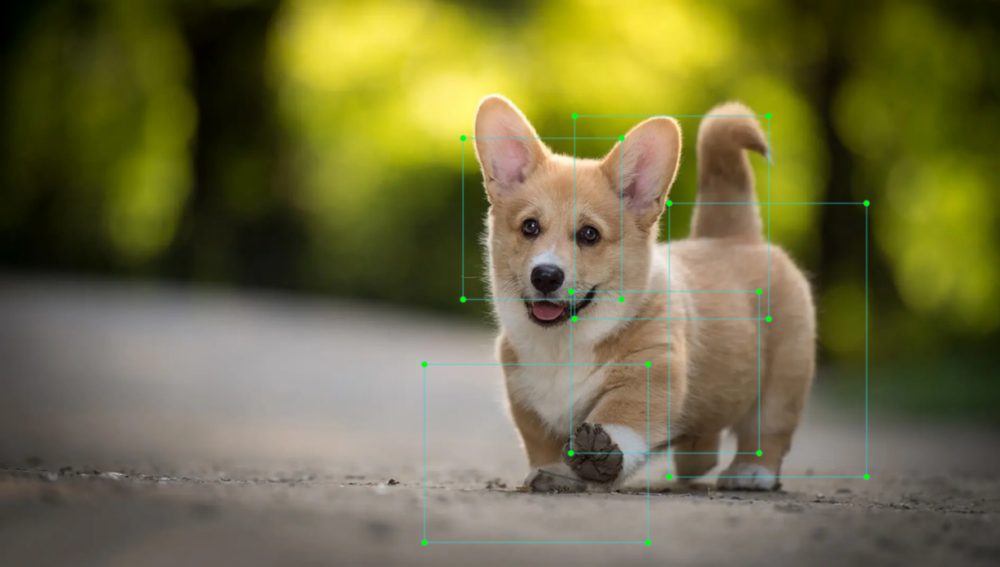
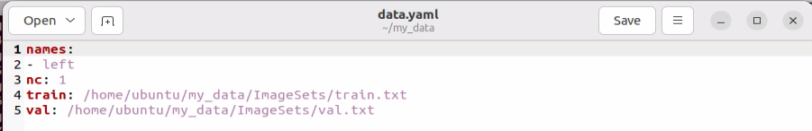
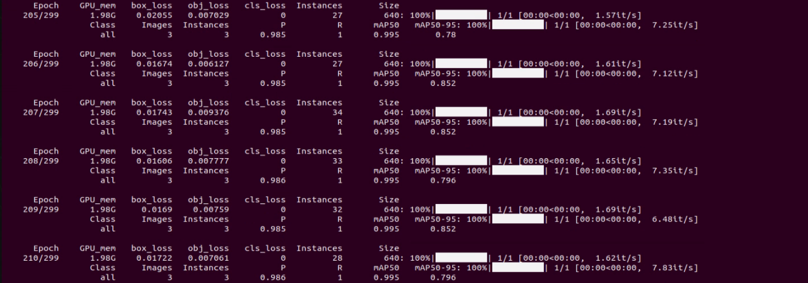
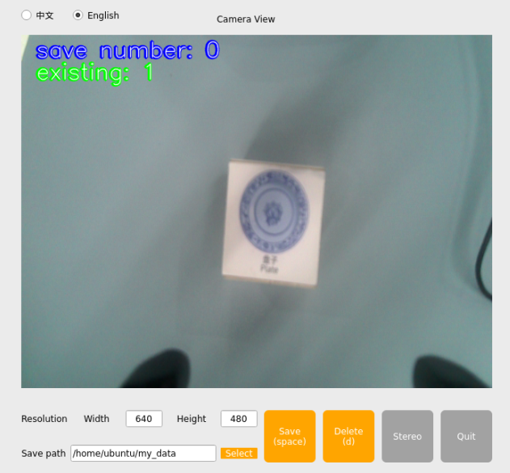

# 7. Deep Learning Basic Course

## 7.1 Machine Learning Introduction

### 7.1.1 Overview

Artificial Intelligence (AI) is a new technological science focused on the theories, methods, technologies, and applications used to simulate, extend, and augment human intelligence.

AI encompasses various fields such as machine learning, computer vision, natural language processing, and deep learning. Among them, machine learning is a subfield of AI, and deep learning is a specific type of machine learning.

Since its inception, AI has seen rapid development in both theory and technology, with expanding application areas, gradually evolving into an independent discipline.

### 7.1.2 What Machine Learning is

Machine Learning is the core of AI and the fundamental approach to enabling machine intelligence. It is an interdisciplinary field involving probability theory, statistics, approximation theory, convex analysis, algorithmic complexity, and more.

Deep learning is a subfield of machine learning that focuses on how computers can acquire new knowledge or skills by simulating or replicating human learning behaviors. It also involves reorganizing existing knowledge structures to continuously improve their own performance. From a practical perspective, machine learning involves training models using data and making predictions with those models.

Take AlphaGo as an example—it was the first AI program to defeat a professional human Go player and later a world champion. AlphaGo operates based on deep learning, which involves learning the underlying patterns and hierarchical representations from sample data to gain insights.

### 7.1.3 Types of Machine Learning

Machine learning is generally classified into supervised learning and unsupervised learning, with the key distinction being whether the dataset's categories or patterns are known.

* **Supervised Learning**

Supervised learning provides a dataset along with correct labels or answers. The algorithm learns to map inputs to outputs based on this labeled data. This is the most common type of machine learning.

For instance, in image recognition, a large number of images of dogs can be labeled as "**dog**." The machine learns to recognize dogs in new images through this data.

* **Unsupervised Learning**

Unsupervised learning involves providing the algorithm with data without labels or known answers. All data is treated equally, and the machine is expected to uncover hidden structures or patterns.

For example, in image classification, if you provide a set of images containing cats and dogs without any labels. The algorithm will analyze the data and automatically group the images into two categories—cat images and dog images—based on similarities.

## 7.2 Machine Learning Library Introduction

There are many machine learning frameworks available. The most commonly used include PyTorch, TensorFlow, MXNet, and PaddlePaddle.

### 7.2.1 Pytorch

Torch is an open-source machine learning framework under the BSD License, widely used for its powerful multi-dimensional array operations. PyTorch is a machine learning library based on Torch but offers greater flexibility, supports dynamic computation graphs, and provides a Python interface.

Unlike TensorFlow's static computation graphs, PyTorch uses dynamic computation graphs, which can be modified in real-time according to the needs of the computation. PyTorch allows developers to accelerate tensor operations using GPUs, build dynamic graphs, and perform automatic differentiation.

### 7.2.2 TensorFlow

TensorFlow is an open-source machine learning framework designed to simplify the process of building, training, evaluating, and saving neural networks. It enables the implementation of machine learning and deep learning concepts in the simplest way. With its foundation in computational algebra and optimization techniques,

TensorFlow allows for efficient mathematical computations. It can run on a wide range of hardware—from supercomputers to embedded systems—making it highly versatile. TensorFlow supports CPU, GPU, or both simultaneously. Compared to other frameworks, TensorFlow is best suited for industrial deployment, making it highly appropriate for use in production environments.

### 7.2.3 PaddlePaddle

PaddlePaddle, developed by Baidu, is China's first open-source, industrial-grade deep learning platform. It integrates a deep learning training and inference framework, a library of foundational models, end-to-end development tools, and a rich suite of supporting components. Built on years of Baidu's R&D and real-world applications in deep learning, PaddlePaddle is powerful and versatile.

In recent years, deep learning has achieved outstanding performance across many fields such as image recognition, speech recognition, natural language processing, robotics, online advertising, medical diagnostics, and finance.

### 7.2.4 MXNet

MXNet is another high-performance deep learning framework that supports multiple programming languages, including Python, C++, Scala, and R. It offers data flow graphs similar to those in Theano and TensorFlow and supports multi-GPU configuration. It also includes high-level components for model building, comparable to those in Lasagne and Blocks, and can run on nearly any hardware platform—including mobile devices.

MXNet is designed to maximize efficiency and flexibility. As an accelerated library, it provides powerful tools for developers to take full advantage of GPUs and cloud computing. MXNet supports distributed deployment via a parameter server and can scale almost linearly across multiple CPUs and GPUs.

## 7.3 Yolov8 Model

### 7.3.1 Yolo Model Series Introduction and Comparison

* **YOLO Series**

YOLO (You Only Look Once) is a One-stage, deep learning-based regression approach to object detection.

Before the advent of YOLOv1, the R-CNN family of algorithms dominated the object detection field. Although the R-CNN series achieved high detection accuracy, its Two-stage architecture limited its speed, making it unsuitable for real-time applications.

To address this issue, the YOLO series was developed. The core idea behind YOLO is to redefine object detection as a regression problem. It processes the entire image as input to the network and directly outputs Bounding Box coordinates along with their corresponding class labels. Compared to traditional object detection methods, YOLO offers faster detection speed and higher average precision.

* **YOLOv8**

As the latest version in the YOLO series, YOLOv8 introduces significant improvements over its predecessors, further enhancing both detection accuracy and processing speed. These advancements are not only reflected in the model architecture but also extend to data processing and training strategies. While maintaining the overall framework of the YOLO series, YOLOv8 incorporates several new optimization techniques, summarized as follows:

1.  Input stage: YOLOv8 improves data augmentation by introducing smarter automated augmentation and object detection–specific preprocessing methods to enhance training effectiveness.

2.  Backbone network: It enhances feature extraction by adopting a more efficient CSPDarknet as the backbone, enabling more refined representation of features.

3.  Neck network: YOLOv8 utilizes a more efficient FPN (Feature Pyramid Network) and PAN (Path Aggregation Network) structure to strengthen multi-scale object detection capabilities.

4.  Head output layer: The output layer is optimized with advanced loss functions, such as GIoU-Loss and CIoU-Loss, improving the localization accuracy of predicted bounding boxes. Additionally, YOLOv8 refines the NMS (Non-Maximum Suppression) algorithm, further boosting detection precision.

* **YOLOv8 vs. YOLOv5**

YOLOv8 is a comprehensive upgrade to YOLOv5. While maintaining its speed advantage, YOLOv8 significantly improves accuracy and task flexibility, making it better suited for industrial-grade computer vision applications.

<table class="docutils-nobg" border="1">
<colgroup>
<col style="width: 23%" />
<col style="width: 38%" />
<col style="width: 38%" />
</colgroup>
<thead>
<tr>
<th style="text-align: center;"><strong>Item</strong></th>
<th style="text-align: center;"><strong>YOLOv5</strong></th>
<th style="text-align: center;"><strong>YOLOv8</strong></th>
</tr>
</thead>
<tbody>
<tr>
<td style="text-align: center;">Backbone Network</td>
<td style="text-align: center;">CSPDarknet53</td>
<td style="text-align: center;"><p>Stem convolution (3×3)</p>
<p>expanded bottleneck layers</p></td>
</tr>
<tr>
<td style="text-align: center;">Accuracy (full series)</td>
<td style="text-align: center;">28.4-50.7%</td>
<td style="text-align: center;">37.3-53.9%</td>
</tr>
<tr>
<td style="text-align: center;">Supported Tasks</td>
<td style="text-align: center;">Primarily object detection</td>
<td style="text-align: center;">Object detection, pose estimation</td>
</tr>
<tr>
<td style="text-align: center;">Application Scenarios</td>
<td style="text-align: center;">Edge computing, low-resource environments</td>
<td style="text-align: center;">Multi-task integration, robotic vision</td>
</tr>
</tbody>
</table>

### 7.3.2 YOLOv8 Model Structure

* **Components**

1.  Convolutional Layer: Feature Extraction

Convolution is the process where an entity at multiple past time points does or is subjected to the same action, influencing its current state. Convolution can be divided into convolution and multiplication.

Convolution can be understood as flipping the data, and multiplication as the accumulation of the influence that past data has on the current data. The data flipping is done to establish relationships between data points, facilitating the calculation of accumulated influence with a proper reference.


In YOLOv8, the data to be processed is images, which are two-dimensional in computer vision. Accordingly, the convolution is two-dimensional convolution. The purpose of 2D convolution is to extract features from images. To perform 2D convolution, it is necessary to understand the convolution kernel.

The convolution kernel is the unit region over which convolution calculation is performed each time. The unit is pixels, and the convolution sums the pixel values within the region. Typically, convolution is done by sliding the kernel across the image, and the kernel size is manually set.

When performing convolution, depending on the desired effect, the image borders may be padded with zeros or extended by a certain number of pixels, then the convolution results are placed back into the corresponding positions in the image.

For example, a 6×6 image is first expanded to 7×7, then convolved with the kernel, and finally the results are filled back into a blank 6×6 image.


2.  Pooling Layer: Feature Amplification

The pooling layer, also called downsampling layer, is usually used together with convolution layers. After convolution, pooling performs further sampling on the extracted features. Pooling includes various types such as global pooling, average pooling, max pooling, etc., each producing different effects.

To make it easier to understand, max pooling is used here as an example. Before understanding max pooling, it is important to know about the filter, which is like the convolution kernel—a manually set region that slides over the image and selects pixels within the area.


Max pooling keeps the most prominent features and discards others. For example, starting with a 6×6 image, applying a 2×2 filter for max pooling produces a new image with reduced size.


3.  Upsampling Layer: Restoring Image Size

Upsampling can be understood as "**reverse pooling**." After pooling, the image size shrinks, and upsampling restores the image back to its original size. However, only the size is restored, the pooled features are also modified accordingly.

For example, starting with a 6×6 image, applying a 3×3 filter for upsampling produces a new image.


4.  Batch Normalization Layer: Data Regularization

Batch normalization means rearranging the data neatly, which reduces the computational difficulty of the model and helps map data better into the activation functions.

Batch normalization reduces the loss rate of features during each calculation, retaining more features for the next computation. After multiple computations, the model's sensitivity to the data increases.


5.  ReLU Layer: Activation Function

Activation functions are added during model construction to introduce non-linearity. Without activation functions, each layer is essentially a matrix multiplication. Every layer's output is a linear function of the previous layer's input, so no matter how many layers the neural network has, the output is just a linear combination of the input. This prevents the model from adapting to actual situations.

There are many activation functions, commonly ReLU, Tanh, Sigmoid, etc. Here, ReLU is used as an example. ReLU is a piecewise function that replaces all values less than 0 with 0 and keeps positive values unchanged.


6.  ADD Layer: Tensor Addition

Features can be significant or insignificant. The ADD layer adds feature tensors together to enhance the significant features.


7.  Concat Layer: Tensor Concatenation

The Concat layer concatenates feature tensors to combine features extracted by different methods, thereby preserving more features.


* **Composite Elements**

When building a model, using only the basic layers mentioned earlier can lead to overly lengthy, disorganized code with unclear hierarchy. To improve modeling efficiency, these basic elements are often grouped into modular units for reuse.

1)  Convolutional Block

A convolutional block consists of a convolutional layer, a batch normalization layer, and an activation function. The process follows this order: convolution → batch normalization → activation.


2)  Strided Sampling and Concatenation Unit（Focus）

The input image is first divided into multiple large regions. Then, small image patches located at the same relative position within each large region are concatenated together to form a new image. This effectively splits the input image into several smaller images. Finally, an initial sampling is performed on the images using a convolutional block.

As shown in the figure below, for a 6×6 image, if each large region is defined as 2×2, the image can be divided into 9 large regions, and each contains 4 small patches.

By taking the small patches at position 1 from each large region and concatenating them, a 3×3 image can be formed. The patches at other positions are concatenated in the same way.  
Ultimately, the original 6×6 image is decomposed into four 3×3 images.


3)  Residual Block

The residual block enables the model to learn subtle variations in the image. Its structure is relatively simple and involves merging data from two paths.

In the first path, two convolutional blocks are used to extract features from the image. In the second path, the original image is passed through directly without convolution. Finally, the outputs from both paths are added together to enhance learning.


4)  Composite Convolutional Block

In YOLOv8, a key feature of the composite convolutional block is its customizable design, allowing convolutional blocks to be configured as needed. This structure also uses two paths whose outputs are merged.

The first path contains a single convolutional layer for feature extraction, while the second path includes 2𝑥+1 convolutional blocks followed by an additional convolutional layer. After sampling and concatenation, batch normalization is applied to standardize the data, followed by an activation function. Finally, a convolutional block is used to process the combined features.


5)  Composite Residual Convolutional Block

The composite residual convolutional block modifies the composite convolutional block by replacing the 2𝑥 convolutional blocks with  
𝑥 residual blocks. In YOLOv8, this block is also customizable, allowing residual blocks to be tailored according to specific requirements.


6)  Composite Pooling Block

The output from a convolutional block is simultaneously passed through three separate max pooling layers, while an additional unprocessed copy is preserved. The resulting four feature maps are then concatenated and passed through a convolutional block. By processing data with the composite pooling block, the original features can be significantly enhanced and emphasized.


* **Structure**

YOLOv8 is composed of three main parts, each responsible for producing output at different spatial resolutions. These outputs are processed differently according to their respective sizes. The structure of YOLOv8's output is shown as the diagram below.


### 7.3.3 YOLOv8 Workflow

This section explains the model's processing flow using the concepts of prior boxes, predicted boxes, and anchor boxes.

* **Prior Box**

When an image is fed into the model, predefined regions of interest must be specified. These regions are marked using prior boxes, which serve as initial bounding box templates indicating potential object locations in the image.


* **Predicted Box**

Predicted boxes are generated by the model as output and do not require manual input. When the first batch of training data is fed into the model, the predicted boxes are automatically created. The center points of predicted boxes tend to be located in areas where similar objects frequently appear.



* **Anchor Box**

Since predicted boxes may have deviations in size and location, anchor boxes are introduced to correct these predictions.

Anchor boxes are positioned based on the predicted boxes. By influencing the generation of subsequent predicted boxes, anchor boxes are placed around their relative centers to guide future predictions.


* **Project Process**

Once the bounding box annotations are complete, prior boxes appear on the image. When the image data is input into the model, predicted boxes are generated based on the locations of the prior boxes. Subsequently, anchor boxes are generated to adjust the predicted results. The weights from this round of training are then updated in the model.

With each new training iteration, the predicted boxes are influenced by the anchor boxes from the previous round. This process is repeated until the predicted boxes gradually align with the prior boxes in both size and location.


## 7.4 Yolov8 Training Model

<p id="anchor_7_4_1"></p>

### 7.4.1 Image Collection and Annotation

Training a YOLOv8 model requires a large dataset, so you must first collect and annotate images to prepare for model training.

* **Image Collection**

1. Power on the robot and connect it to a remote control tool like VNC.

2. Click the terminal icon  in the system desktop to open a command-line window.

```
~/.stop_ros.sh
```

3. Start the depth camera service with command.

```
ros2 launch peripherals depth_camera.launch.py
```

4. Open a new command-line terminal and enter the command to create a directory for storing your dataset.

```\
mkdir -p ~/my_data
```

5. Then, launch the tool by entering the following command.

```
cd ~/software/collect_picture && python3 main.py
```


The "**save number**" in the top-left corner of the tool interface shows the ID of the saved image. The "**existing**" shows how many images have already been saved.

6)  Click Choose to change the save path to the directory created before.


7)  After selecting the correct directory, click **Choose**.


8)  Place the target object within the camera view and click the **Save (space)** button or press the spacebar to save the current camera frame.


After pressing **Save (space)** or the spacebar, a folder named JPEGImages will be automatically created under the path **/home/ubuntu/my_data** to store the images.


> [!NOTE]
>
> To improve model reliability, capture the target object from various distances, angles, and tilts.

9)  After collecting images, click the **Quit** button to close the tool.


10. Open the terminal and enter the following commands, you will see the saved image.

 ```
 cd ~/my_data/JPEGImages && ls
 ```

11) Then press **Ctrl + C** in all opened terminal windows to exit—this completes the image collection process.

* **Image Annotation**

Once the images are collected, they need to be annotated. Annotation is essential for creating a functional dataset, as it tells the training model which parts of the image correspond to which categories. This allows the model to later identify those categories in new, unseen images.

> [!NOTE]
>
> When entering commands, be sure to use correct case and spacing. You can use the Tab key to auto-complete keywords.

1. Open a terminal and enter the command to start the image annotation tool:

```
python3 ~/software/roLabelImg/roLabelImg.py
```

2)  After opening the software, click **File** in the top-left corner, then select **Open Dir**. Choose the directory where your collected images are stored, and click **Choose**.


3)  Again, click File in the top-left corner and select Change default saved Annotation dir. Change the save path to the Annotations folder under my_data.


4)  Click **View** in the top-left corner and select **Advanced Mode** to enable the rotation annotation feature.


5)  Shortcut keys: **e**: annotate a rotated object. **w**: annotate a normal object. **d**: next image. **a**: previous image. **c**: small clockwise rotation. **x**: small counterclockwise rotation. **v**: large clockwise rotation. **z**: large counterclockwise rotation. After annotating each image, click the Save icon on the left to save your work.

> [!NOTE]
>
>Always use the C and X keys to rotate, ensuring the bounding box is aligned with the object edges. Otherwise, it will affect recognition accuracy in later stages.


6)  In the popup window, enter the class name for the object being annotated. For example, type the object's name. After naming, click **OK** to save the class.


7)  Press the key D to move to the next image. When all annotations are completed, click the close button at the top-right corner of the tool to exit .

<p id="anchor_7_4_2"></p>

### 7.4.2 Data Format Conversion

* **Preparation**

Before starting this section, make sure you have completed image collection and annotation. For detailed steps, refer to section [7.4.1 Image Collection and Annotation](#anchor_7_4_1) in this document.

Before training images using the YOLOv8 model, you need to define class labels and convert the annotation data into the appropriate format.

* **Data Format Conversion**

Before starting this section, make sure you have completed image collection and annotation.

> [!NOTE]
>
> When entering commands, be sure to use correct case and spacing. You can use the Tab key to auto-complete keywords.

1. Open a new terminal and enter the following command to open the file: **Note: You can create a file if the file cannot be found.**

```
gedit ~/my_data/classes.names
```

2)  Enter the annotated class name **left** in the text file. If you have multiple class names, list each one on a new line.

> [!NOTE]
>
> The class names here must match the labels used in the roLabelImg annotation tool exactly.

3. After editing, press **Ctrl + S** to save and exit.

4. Next, return to the terminal and run the following command to convert the annotation format:

```
python3 ~/software/yolov8/xml2yolo.py --data ~/my_data --yaml ~/my_data/data.yaml
```

This command uses three main parameters:

(1)  xml2yolo.py: A script that converts annotations from XML format to the YOLOv8 format. Make sure the path is correct.

(2) my_data: The directory containing your annotated dataset. Make sure the path is correct.

(3) data.yaml: A YAML file that specifies how the dataset is split and configured for training. It will be saved inside the **my_data** folder.

The following image shows a generated example of **data.yaml**:



The items listed after names represent the types of labels. The nc field specifies the total number of label categories. train refers to the training set—a commonly used term in deep learning that indicates the data used for model training. The parameter following it is the path to the training images. Similarly, val refers to the validation set, which is used to verify the model's performance during the training process, and the path that follows indicates where the validation data is located. These file paths need to be set based on the actual location of your data. For example, if you plan to speed up the training process later by moving the dataset from the robot to a local PC or a cloud server, you'll need to update the train and val paths accordingly to reflect their new locations.

Finally, an XML file will be generated under the **~/my_data** folder to record the path location of the currently split dataset. Similarly, you can change the save path by modifying the last parameter in step 4 to ~/my_data/data.yaml. Please remember the path of this file, as it will be used later for model training.

### 7.4.3 Model Training

> [!NOTE]
>
> When entering commands, be sure to use correct case and spacing. You can use the Tab key to auto-complete keywords.

* **Preparation**

After converting the dataset format, you can proceed to the model training phase. Before starting, make sure the dataset with the correct format is ready. For details, refer to section [7.4.2 Data Format Conversion](#anchor_7_4_2) in this document.

* **Model Training**

1. Power on the robot and connect it to a remote control tool like VNC.

2. Click the terminal icon  in the system desktop to open a command-line window.

3. Enter the following command and press Enter to go to the specific directory.

```
cd ~/software/yolov8
```

4. Enter the command to start training the model.

```
python3 train.py --img 640 --batch 64 --epochs 300 --data ~/my_data/data.yaml --weights yolov8n.pt
```

In the command, the parameters stands for:  

--img: image size  

--batch: number of images per batch  

--epochs: number of training iterations  

--data: path to the dataset  

--weights: path to the pre-trained model

You can modify the parameters above based on your specific needs. To improve model accuracy, consider increasing the number of training epochs. Note that this will also increase training time.

If you see the following output, it means the training process is running successfully.



After training is complete, the terminal will display the path where the trained model files are saved. The training results are stored in the directory of **yolo8/runs/detect**.


> [!NOTE]
>
> The generated folder name under runs/detect may vary. Please locate it accordingly.

## 7.5 Model Training for Waste Card

The product names and reference paths mentioned in this document may vary. Please refer to the actual setup for accurate information.

When dealing with large datasets, it is not recommended to train models directly on the robot's onboard motherboard due to I/O speed and memory limitations. Instead, it is advised to use a PC with a dedicated GPU, which follows the same training steps, only requiring proper environment configuration.

If you want to train a custom model, please follow the instructions in this section.

### 7.5.1 Preparation 

(1) Prepare a laptop for training. If you're using a desktop PC, make sure you have a Wi-Fi adapter, mouse, and other necessary peripherals.

(2) Use the previously learned method to install and open the remote control tool VNC.

### 7.5.2 Operation Steps

* **Image Collection**

1)  Power on the robot and connect it to a remote control tool like VNC.

2)  Click the terminal icon  in the system desktop to open a command-line window.

```
~/.stop_ros.sh
```

3. Start the depth camera service with command.

```
ros2 launch peripherals depth_camera.launch.py
```

4)  Open a new command-line terminal and enter the command to create a directory for storing your dataset.

```
mkdir -p ~/my_data
```

5)  Then, launch the tool by entering the following command.

```
cd ~/software/collect_picture && python3 main.py
```



The "**save number**" in the top-left corner of the tool interface shows the ID of the saved image. The "**existing**" shows how many images have already been saved.

6)  Click **Select** to change the save path to the directory created before.


7)  After selecting the correct directory, click **Choose**.


8)  Place the target object within the camera view and click the **Save (space)** button or press the spacebar to save the current camera frame.


After pressing **Save (space)** or the spacebar, a folder named JPEGImages will be automatically created under the path **/home/ubuntu/my_data** to store the images.

> [!NOTE]
>
> To improve model reliability, capture the target object from various distances, angles, and tilts.

9)  After collecting images, click the **Quit** button to close the tool.


10) Open the terminal and enter the following commands, you will see the saved image.

```
cd ~/my_data/JPEGImages && ls
```

11) Then press **Ctrl + C** in all opened terminal windows to exit—this completes the image collection process.

* **Image Annotation**

Once the images are collected, they need to be annotated. Annotation is essential for creating a functional dataset, as it tells the training model which parts of the image correspond to which categories. This allows the model to later identify those categories in new, unseen images.

> [!NOTE]
>
> When entering commands, be sure to use correct case and spacing. You can use the Tab key to auto-complete keywords.

1)  Open a terminal and enter the command to start the image annotation tool:

```
python3 ~/software/roLabelImg/roLabelImg.py
```

2)  After opening the software, click **File** in the top-left corner, then select **Open Dir**. Choose the directory where your collected images are stored, and click **Choose**.


3)  Again, click **File** in the top-left corner and select **Change default saved Annotation dir**. Change the save path to the **Annotations** folder under **my_data**.


4)  Click **View** in the top-left corner and select **Advanced Mode** to enable the rotation annotation feature.


5)  Shortcut keys: **e**: annotate a rotated object. **w**: annotate a normal object. **d**: next image. **a**: previous image. **c**: small clockwise rotation. **x**: small counterclockwise rotation. **v**: large clockwise rotation. **z**: large counterclockwise rotation. After annotating each image, click the Save icon on the left to save your work.

> [!NOTE]
>
> Always use the C and X keys to rotate, ensuring the bounding box is aligned with the object edges. Otherwise, it will affect recognition accuracy in later stages.


6)  In the popup window, enter the class name for the object being annotated. For example, type the object's name. After naming, click **OK** to save the class.


7)  Press the key D to move to the next image. When all annotations are completed, click the close button at the top-right corner of the tool to exit.

* **Data Format Conversion**

Before starting this section, make sure you have completed image collection and annotation.

> [!NOTE]
>
> When entering commands, be sure to use correct case and spacing. You can use the Tab key to auto-complete keywords.

1. Open a new terminal and enter the following command to open the file. 

> [!NOTE]
>
> You can create a file if the file cannot be found.

```
gedit ~/my_data/classes.names
```

2)  Write the categories annotated into a text file.


> [!NOTE]
>
>The class names here must match the labels used in the roLabelImg annotation tool exactly.

3)  After editing, press **Ctrl + S** to save and exit.

4)  Next, return to the terminal and run the following command to convert the annotation format:

```
python3 ~/software/yolov8/xml2yolo.py --data ~/my_data --yaml ~/my_data/data.yaml
```

This command uses three main parameters:

(1) xml2yolo.py: A script that converts annotations from XML format to the YOLOv8 format. Make sure the path is correct.

(2) my_data: The directory containing your annotated dataset. Make sure the path is correct.

(3) data.yaml: A YAML file that specifies how the dataset is split and configured for training. It will be saved inside the **my_data** folder.

* **Model Training**

1)  Power on the robot and connect it to a remote control tool like VNC.

2)  Click the terminal icon  in the system desktop to open a command-line window.

3)  Enter the following command and press **Enter** to go to the specific directory.

```
cd ~/software/yolov8
```

4)  Enter the command to start training the model.

```
python3 train.py --img 640 --batch 64 --epochs 300 --data ~/my_data/data.yaml --weights yolov8n.pt
```

In the command, --img specifies the image size, --batch indicates the number of images input per batch, --epochs refers to the number of training iterations. --data is the path to the dataset. --weights indicates the path to the pre-trained model weights. This specifies which .pt weight file the training process is based on. It's important to note whether you are using **yolov8n.pt**, **yolov8s.pt**, or another version.

You can modify the parameters above based on your specific needs. To improve model accuracy, consider increasing the number of training epochs. Note that this will also increase training time.

If you see the following output, it means the training process is running successfully.


After training is complete, the terminal will display the path where the trained model files are saved. The training results are stored in the directory of **yolo8/runs/detect**.


* **Using the Model**

1)  Enter the following command and press **Enter** to stop the APP service:

```
~/.stop_ros.sh
```

2)  Enter the following command to navigate to the directory where the corresponding feature's program is located:

```
cd /home/ubuntu/software/yolov8
```

3)  Enter the command to view the models in the current directory. Pretrained models are already provided, as shown below.

If you have your own trained models, you can also import them into this directory.

```
ls
```


4)  Next, enter the command to check the program that calls the model, and manually modify the model name.

```
vim ~/ros2_ws/src/yolov8_detect/yolov8_detect/yolov8_detect_demo.py
```

5)  You can change MODEL_DEFAULT_NAME to the provided pre-trained model or your own trained model, then save and exit using the key combination :wq.


6)  After that, enter the command to run the model-calling program. A depth camera needs to be connected.

```
ros2 launch yolov8_detect yolov8_detect_demo.launch.py
```

## 7.6 Physical Model Training

The product names and reference paths mentioned in this document may vary. Please refer to the actual setup for accurate information.

When dealing with large datasets, it is not recommended to train models directly on the robot's onboard motherboard due to I/O speed and memory limitations. Instead, it is advised to use a PC with a dedicated GPU, which follows the same training steps, only requiring proper environment configuration.

If you want to train a custom model, please follow the instructions in this section.

### 7.6.1 Preparation

1)  Prepare a laptop for training. If you're using a desktop PC, make sure you have a Wi-Fi adapter, mouse, and other necessary peripherals.

2)  Use the previously learned method to install and open the remote control tool VNC.

### 7.6.2 Operation Steps

* **Image Collection**

1)  Power on the robot and connect it to a remote control tool like VNC.

2)  Click the terminal icon  in the system desktop to open a command-line window.

```
~/.stop_ros.sh
```

3)  Start the depth camera service with command.

```
ros2 launch peripherals depth_camera.launch.py
```

4)  Open a new command-line terminal and enter the command to create a directory for storing your dataset.

```
mkdir -p ~/my_data
```

5)  Then, launch the tool by entering the following command.

```
cd ~/software/collect_picture && python3 main.py
```


The "**save number**" in the top-left corner of the tool interface shows the ID of the saved image. The "**existing**" shows how many images have already been saved.

6)  Click Choose to change the save path to the directory created before.


7)  After selecting the correct directory, click **Choose**.


8)  Place the target object within the camera view and click the **Save (space)** button or press the spacebar to save the current camera frame.


After pressing **Save (space)** or the spacebar, a folder named JPEGImages will be automatically created under the path **/home/ubuntu/my_data** to store the images.

> [!NOTE]
>
> To improve model reliability, capture the target object from various distances, angles, and tilts.

9)  After collecting images, click the **Quit** button to close the tool.


10) Open the terminal and enter the following commands, you will see the saved image.

```
cd ~/my_data/JPEGImages && ls
```

11) Then press **Ctrl + C** in all opened terminal windows to exit—this completes the image collection process.

* **Image Annotation**

Once the images are collected, they need to be annotated. Annotation is essential for creating a functional dataset, as it tells the training model which parts of the image correspond to which categories. This allows the model to later identify those categories in new, unseen images.

> [!NOTE]
>
> When entering commands, be sure to use correct case and spacing. You can use the Tab key to auto-complete keywords.

1)  Open a terminal and enter the command to start the image annotation tool:

```
python3 ~/software/roLabelImg/roLabelImg.py
```

2)  After opening the software, click **File** in the top-left corner, then select **Open Dir**. Choose the directory where your collected images are stored, and click **Choose**.


3)  Again, click **File** in the top-left corner and select **Change default saved Annotation dir**. Change the save path to the **Annotations** folder under **my_data**.


4)  Click **View** in the top-left corner and select **Advanced Mode** to enable the rotation annotation feature.


5)  Shortcut keys: **e**: annotate a rotated object. **w**: annotate a normal object. **d**: next image. **a**: previous image. **c**: small clockwise rotation. **x**: small counterclockwise rotation. **v**: large clockwise rotation. **z**: large counterclockwise rotation. After annotating each image, click the Save icon on the left to save your work.

> [!NOTE]
>
> Always use the C and X keys to rotate, ensuring the bounding box is aligned with the object edges. Otherwise, it will affect recognition accuracy in later stages.


6)  In the popup window, enter the class name for the object being annotated. For example, type the object's name. After naming, click **OK** to save the class.


7)  Press the key D to move to the next image. When all annotations are completed, click the close button at the top-right corner of the tool to exit.

* **Data Format Conversion**

Before starting this section, make sure you have completed image collection and annotation.

> [!NOTE]
>
>When entering commands, be sure to use correct case and spacing. You can use the Tab key to auto-complete keywords.

1. Open a new terminal and enter the following command to open the file:

> [!NOTE]
>
> You can create a file if the file cannot be found.

```
gedit ~/my_data/classes.names
```

2)  Write the categories annotated into a text file.


> [!NOTE]
>
> The class names here must match the labels used in the roLabelImg annotation tool exactly.

3)  After editing, press **Ctrl + S** to save and exit.

4)  Next, return to the terminal and run the following command to convert the annotation format:

```
python3 ~/software/yolov8/xml2yolo.py --data ~/my_data --yaml ~/my_data/data.yaml
```

This command uses three main parameters:

(1) xml2yolo.py: A script that converts annotations from XML format to the YOLOv8 format. Make sure the path is correct.

(2) my_data: The directory containing your annotated dataset. Make sure the path is correct.

(3) data.yaml: A YAML file that specifies how the dataset is split and configured for training. It will be saved inside the **my_data** folder.

* **Model Training**

1)  Power on the robot and connect it to a remote control tool like VNC.

2)  Click the terminal icon  in the system desktop to open a command-line window.

3)  Enter the following command and press **Enter** to go to the specific directory.

```
cd ~/software/yolov8
```

4)  Enter the command to start training the model.

```
python3 train.py --img 640 --batch 64 --epochs 300 --data ~/my_data/data.yaml --weights yolov8n.pt
```

In the command, --img specifies the image size, --batch indicates the number of images input per batch, --epochs refers to the number of training iterations. --data is the path to the dataset. --weights indicates the path to the pre-trained model weights. This specifies which .pt weight file the training process is based on. It's important to note whether you are using **yolov8n.pt**, **yolov8s.pt**, or another version.

You can modify the parameters above based on your specific needs. To improve model accuracy, consider increasing the number of training epochs. Note that this will also increase training time.

If you see the following output, it means the training process is running successfully.


After training is complete, the terminal will display the path where the trained model files are saved. The training results are stored in the directory of **yolo8/runs/detect**.


### 7.6.3 Using the Model

1)  Enter the following command and press **Enter** to stop the APP service:

```
~/.stop_ros.sh
```

2)  Enter the following command to navigate to the directory where the corresponding feature's program is located:

```
cd /home/ubuntu/software/yolov8
```

3)  Enter the command to view the models in the current directory. Pretrained models are already provided, as shown below.

If you have your own trained models, you can also import them into this directory.

```
ls
```


4)  Next, enter the command to check the program that calls the model, and manually modify the model name.

```
vim ~/ros2_ws/src/yolov8_detect/yolov8_detect/yolov8_detect_demo.py
```

5)  You can change MODEL_DEFAULT_NAME to the provided pre-trained model or your own trained model, then save and exit using the key combination :wq.


6)  After that, enter the command to run the model-calling program. A depth camera needs to be connected.

```
ros2 launch yolov8_detect yolov8_detect_demo.launch.py
```