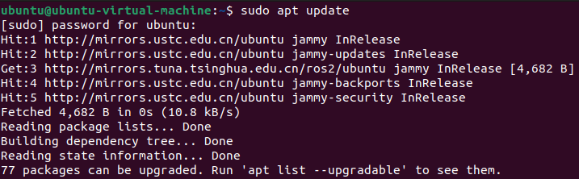
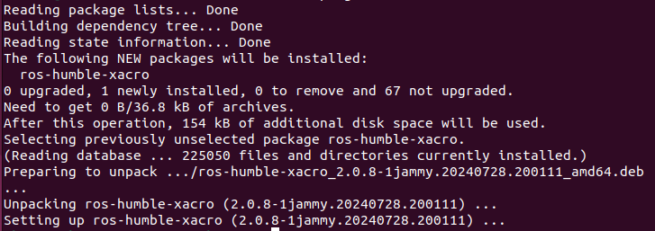
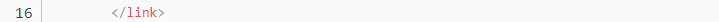
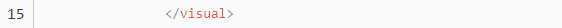
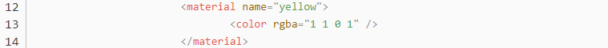
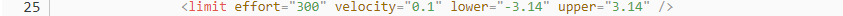
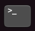
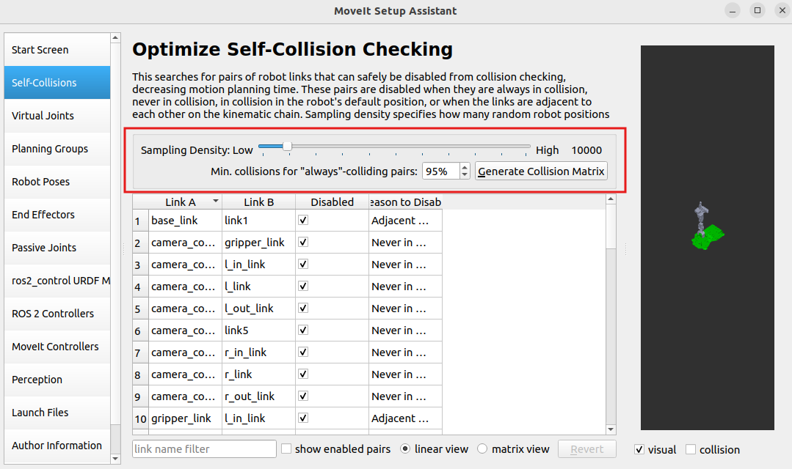

# 8. URDF Modeling & Simulation

## 8.1 Virtual Machine Installation and Import

### 8.1.1 Virtual Machine Software Installation

* **VMware Installation**

A virtual machine is software that allows us to run other operating systems within our own operating system. Here we take VMware Workstation as an example. The installation steps are as follows:

1. Unzip the virtual machine software package located under the "**Configuration File -\> VMware**" path.

2. Locate the extracted folder and double-click the virtual machine executable file with the .exe extension.


3. Follow the on-screen instructions to complete the installation.


4. When starting the virtual machine for the first time, you need to enter the product key. At this step, select any key from the “**VMware17 Activation Key**” file in the virtual machine folder, enter it, and click **Continue**.

- **Starting VMware Services on Your Local Computer**

1.  On your local computer, press **WIN + R** to open the Run dialog. Type **control** and press **Enter** to open the Control Panel.


2.  Click **Administrative Tools**, then double-click **Services**.


3.  Find the VMware-related services as shown below.


4.  Right-click and select **Start** to enable all VMware-related services.


* **VirtualBox Installation**

1)  Open the software installation package in the same directory and click "**Next**".


2)  Modify the installation path if needed, then click "**Next**".


3)  No changes needed, click "**Next**” to the next step.


4)  Confirm the installation and click "**Install**".


5)  Once the installation is complete, click "**Finish**".


### 8.1.2 Virtual System Image Import

Taking Vmware as the example.

1)  In the software interface, click on "**Open a Virtual Machine**."


2)  Navigate to the required virtual machine file in the directory [8.1 Virtual Machine Installation and Import->Configuration File-> Vritual Machine Image](), and open it.


3)  Select a storage path and click "**Import**." Wait for the import to complete.


4)  Once the import is finished, you can start using the virtual machine.

### 8.1.3 Virtual Machine Settings

1. Locate the virtual machine you just imported and click "**Edit Virtual Machine Settings**."


2)  Click on "**Network Adapter**" and select "**Bridged Mode**."


3.  Click on "**Display**" and uncheck the "**Accelerate 3D Graphics**" option.

> [!NOTE]
>
> Enabling the "**Accelerate 3D Graphics**" option can negatively affect virtual machine performance and may cause lag during simulation.


## 8.2 Configuration

It is normal for the virtual machine to take a longer time to start for the first time.

The virtual machine interface is as below:


### 8.2.1 Package Import (Performed on Virtual Machine)

1)  Launch the virtual machine. Click the terminal icon  in the system desktop to open a command-line window.

2)  Click the “Home” icon  on the desktop to enter the directory.

3)  Locate the "Simulations" compressed file in the directory [1 Virtual Machine Installation and Import ->Configuration File ->Package File](). Drag the compressed file into the Home directory of the virtual machine.

4)  Right-click in the Home directory and select “**Open in terminal**” to open the terminal.


5)  Enter the following command to create a directory.

```
mkdir -p ~/ros2_ws/src
```

6)  Execute the following commands to extract the source files and enter the source directory.

```
unzip ~/simulations.zip
```

```
mv ~/simulations ~/ros2_ws/src/simulations
```

If prompted to replace files, type A and press **Enter**.


7)  Run the following command to compile the packages and wait for the process to finish.

```
cd ~/ros2_ws && colcon build --symlink-install
```

8)  Run the following command to replace the .typerc file.

```
mv /home/ubuntu/.typerc ~/ros2_ws/.typerc
```

9)  Check if the file move was successful by running the following command.

```
cd ~/ros2_ws/ && ls -a
```


10) Enter the command to set up automatic loading of the configuration file.

```
echo "source ~/ros2_ws/install/setup.bash"\>\>~/.bashrc
```

```
echo "source ~/ros2_ws/.typerc"\>\>~/.bashrc
```

11) To update the settings, reload the configuration file using the command.

```
source ~/.bashrc
```

### 8.2.2 Network Configuration (Performed in Robot System Desktop)

To ensure proper communication between the virtual machine and the robot during future operations, we need to configure the device's network settings.

1.  Start the robot and open a terminal  on the desktop.

2.  Enter the following command to configure the WiFi file.

```
cd ~/hiwonder-toolbox && gedit wifi_conf.py
```

3)  Modify the configuration to LAN mode and enter the WiFi name and password. A Wi-Fi router or mobile hotspot will be required for subsequent connections.


4)  Press **Ctrl + S** to save and close the file.

5)  For subsequent connections, ensure that the device and virtual machine are on the same network segment. You can check this by running the following command in the terminal:

```
ifconfig
```


**In this example, both the virtual machine and the robot are on the 192.168.11 network segment, allowing for normal communication.**

**Common connection methods:**

1.  **Via Router (Recommended)**: Connect the computer and Raspberry Pi controller to the same router using an Ethernet cable.

2.  **Via Local Area Network (LAN) (Recommended)**: Configure the STA (station) 

3.  mode on the WiFi, then connect both the robot and computer to the same WiFi network or mobile hotspot.

4.  **Direct Connection (Not Recommended)**: Set the robot to Access Point (AP) mode, then connect the computer directly to the robot's WiFi.

### 8.2.3 Device Configuration (Performed on Virtual Machine)

In the previous section, we configured the network environment. However, within the same network, the virtual machine and the robot must have matching ID numbers in order to communicate with each other. In addition, the robot’s camera version must be configured for proper access. The configuration steps are as follows.

1.  Start the robot and open a terminal  from the desktop.

2.  The terminal will display the device's DOMAIN_ID, as shown below:


For example, if the DOMAIN_ID is 100, we will configure the virtual machine accordingly.

3.  Launch the virtual machine. Click the terminal icon  in the system desktop to open a command-line window.

4.  Enter the following command to open the configuration file:

```
gedit ~/ros2_ws/.typerc
```

5.  Change the ID to 100 as shown in the image below. Then, select the appropriate configuration based on your camera version.

**aurora: Depth Camera. USB_CAM: Monocular Camera.**


6.  Press **Ctrl + S** to save and close the file.

7.  Close the current terminal, then open a new terminal. You will observe that the ID has been successfully updated to 100.


## 8.3 Getting Started with URDF Model 

### 8.3.1 Introduction and Getting Started with URDF Model

> [!NOTE]
>
> This tutorial is based on configuration and simulation within a virtual machine. If the virtual machine is not yet installed, please first refer to the folder named 1 Virtual Machine Installation and Import to complete the installation.

* **URDF Model Introduction**

URDF is a format based on the XML specification, designed for describing the structure of robots. Its purpose is to provide a robot description standard that is as general and widely applicable as possible.

Robots are typically composed of multiple links and joints. A link is defined as a rigid object with certain physical properties, while a joint connects two links and constrains their relative motion.

By connecting links with joints and imposing motion restrictions, a kinematic model is formed. The URDF file specifies the relationships between joints and links, their inertial properties, geometric characteristics, and collision models.

* **Comparison between Xacro and URDF Model**

The URDF model serves as a description file for simple robot models, offering a clear and easily understandable structure. However, when it comes to describing complex robot structures, using URDF alone can result in lengthy and unclear descriptions.

To address this limitation, the xacro model extends the capabilities of URDF while maintaining its core features. The Xacro format provides a more advanced approach to describe robot structures. It greatly improves code reusability and helps avoid excessive description length.

For instance, when describing the two legs of a humanoid robot, the URDF model would require separate descriptions for each leg. On the other hand, the Xacro model allows for describing a single leg and reusing that description for the other leg, resulting in a more concise and efficient representation.

* **Install URDF Dependency**

> [!NOTE]
>
> The URDF and Xacro models are already pre-installed in the virtual machine, so there is no need for you to reinstall them. This section is for informational purposes only.

1.  Run the following command and press **Enter** to update the package information:

    ```\
    sudo apt update
    ```



2.  Run the following command and press **Enter** to install the URDF dependencies:

    ```
    sudo apt-get install ros-humble-urdf
    ```

When the output matches the image below, the installation is successful:


3.  Run the following command and press Enter to install the Xacro model extension for URDF:

    ```
    sudo apt-get install ros-humble-xacro
    ```

When the output matches the image below, the installation is successful:



* **URDF Model Basic Syntax**

(1) XML Basic Syntax

Since URDF models are written based on the XML specification, it is necessary to understand the basic structure of the XML format.

**Elements:**

An element can be defined as desired using the following formula:

**\<element\>**

**\</element\>**

**Properties:**

Properties are included within elements to define characteristics and parameters. Please refer to the following formula to define an element with properties:

**\<element property_1="property value1" property_2="property value2"\>**

**\</element\>**

**Comments:**

Comments have no impact on the definition of other properties and elements. Please use the following formula to define a comment:

**\<! -- comment content\>**

(2) Link

The link element describes the visual and physical properties of the robot's rigid component. The following tags are commonly used to define the motion of a link:


\<visual\>: Describe the appearance of the link, such as size, color and shape.

\<inertial\>: Describe the inertia parameters of the link, which will used in dynamics calculation.

\<collision\>: Describe the collision inertia property of the link.

Each tag contains the corresponding child tag. The functions of the tags are listed below.

| **Tag**  | **Description**                                              |
| :------: | :----------------------------------------------------------- |
|  origin  | Describe the pose of the link. It contains two parameters, including xyz and rpy. xyz describes the pose of the link in the simulated map. rpy describes the pose of the link in the simulated map. |
|   mess   | Describe the mass of the link.                               |
| inertia  | Describe the inertia of the link. As the inertia matrix is symmetrical, these six parameters need to be input, ixx, ixy, ixz, iyy, iyz and izz, as properties. These parameters can be calculated. |
| geometry | Describe the shape of the link. It uses mesh parameter to load texture file, and employs filename parameters to load the path for texture file. It has three child tags, namely box, cylinder and sphere, representing rectangles, cylinders and spheres. |
| material | Describe the material of the link. The parameter name is the required filed. The tag color can be used to change the color and transparency of the link. |

(3) Joint

In a URDF model, joints are defined using the \<joint\> tag. They describe the kinematic and dynamic properties of the robot’s joints, as well as constraints on motion such as position and velocity limits. According to the type of motion, joints in a URDF model can be categorized into six types:

| **Type and Explanation**                                     |  **Tag**   |
| :----------------------------------------------------------- | :--------: |
| Rotational joint: can rotate infinitely around a single axis | continuous |
| Rotational joint: similar to continuous, but with rotation angle limits |  revolute  |
| Prismatic joint: allows translation along an axis, with position limits | prismatic  |
| Planar joint: allows translation or rotation in orthogonal directions within a plane |   planar   |
| Floating joint: allows both translation and rotation         |  floating  |
| Fixed joint: a special joint that does not allow any motion  |   fixed    |

When defining joint behavior, the following tags are commonly used:


\<parent_link\>: Specifies the parent link.

\<child_link\>: Specifies the child link.

\<calibration\>: Used to calibrate the joint angle.

\<dynamics\>: Describes certain physical properties of the motion.

\<limit\>: Defines motion constraints.

Each tag contains the corresponding child tag. The functions of the tags are listed below.

|      **Tag**      | **Description**                                              |
| :---------------: | :----------------------------------------------------------- |
|      origin       | Describes the pose of the parent link. It contains two parameters, including xyz and rpy. xyz describes the pose of the link in the simulated map. rpy describes the pose of the link in the simulated map. |
|       axis        | Specifies the axis of rotation or translation along the parent link’s X, Y, or Z axis. |
|       limit       | Defines motion constraints for the child link. lower and upper attributes specify the range of motion in radians for revolute joints, while the effort attribute specifies the force/torque limit during motion, with both positive and negative values measured in newtons (N). The velocity attribute limits the rotational speed, measured in meters per second (m/s). |
|       mimic       | Indicates that this joint’s motion is dependent on another joint. |
| safety_controller | Defines safety parameters that protect the joint from exceeding safe motion limits. |

(4) robot Tag

The complete top tags of a robot, including the \<link\> and \<joint\> tags, must be enclosed within the \<robot\> tag. The format is as follows:


(5) gazebo Tag

This tag is used in conjunction with the Gazebo simulator. Within this tag, you can define simulation parameters and import Gazebo plugins, as well as specify Gazebo's physical properties, and more.


(6) Write Simple URDF Model

**Name the model of the robot**

To start writing the URDF model, we need to set the name of the robot following this format: “\<robot name=“robot model name”\>”. Lastly, input “\</robot\>” at the end to represent that the model is written successfully.


**Set links**

1.  To write the first link and use indentation to indicate that it is part of the currently set model. Set the name of the link using the following format: \<link name="link name"\>. Finally, conclude with "\</link\>" to indicate the successful completion of the link definition.




2.  When writing the link description, use indentation to indicate that the description belongs to the current link. Start the description with \<visual\> and end it with \</visual\>.




3.  The "\<geometry\>" tag is employed to define the shape of a link. Once the description is complete, include "\</geometry\>". Within the "\<geometry\>" tag, indentation is used to specify the detailed description of the link's shape. The following example demonstrates a link with a cylindrical shape: "\<cylinder length="0.01" radius="0.2"/\>". In this instance, "length="0.01" signifies a length of 0.01 meters for the link, while "radius="0.2" denotes a radius of 0.2 meters, resulting in a cylindrical shape.


4.  The "\<origin\>" tag is utilized to specify the position of a link, with indentation used to indicate the detailed description of the link's position. The following example demonstrates the position of a link: "\<origin rpy="0 0 0" xyz="0 0 0" /\>". In this example, "rpy" represents the angles of the link, while "xyz" represents the coordinates of the link's position. This particular example indicates that the link is positioned at the origin of the coordinate system.


5.  The "\<material\>" tag is used to define the visual appearance of a link, with indentation used to specify the detailed description of the link's color. To start describing the color, include "\<material\>", and end with "\</material\>" when the description is complete. The following example demonstrates setting a link color to yellow: "\<color rgba="1 1 0 1" /\>". In this example, "rgba="1 1 0 1"" represents the color threshold for achieving a yellow color.



**Set Joint**

1.  To write the first joint, use indentation to indicate that the joint belongs to the current model being set. Then, specify the name and type of the joint as follows: "\<joint name="joint name" type="joint type"\>". Finally, include "\</joint\>" to indicate the completion of the joint definition.

> [!NOTE]
>
> To learn about the type of the joint, please refer to the section “[Joint]()” in this document.


2.  Write the description section for the connection between the link and the joint. Use indentation to indicate that it is part of the currently defined joint. The parent parameter and child parameter should be set using the following format: "\<parent link="parent link"/\>", and "\<child link="child link" /\>". With the parent link serving as the pivot, the joint rotates the child link.


3.  “\<origin\>” describes the position of the joint, with indentation used to specify the detailed coordinates of the joint. The image below describes the position of the joint: “\<origin xyz=“0 0 0.1” /\>”. xyz is the coordinate of the joint, indicating that the joint is located at x=0, y=0, z=0.1 in the coordinate system.


4.  “\<axis\>” describes the orientation of the joint, with indentation used to specify its precise posture. The figure below shows the posture of a joint \<axis xyz="0 0 1" /\>, where xyz defines the orientation of the joint.


5.  \<limit\> is used to restrict joint motion, with indentation applied to specify detailed angle constraints. The figure below shows a joint whose maximum torque does not exceed 300 N, with an upper rotation limit of 3.14 radians and a lower limit of -3.14 radians. These limits are defined according to the following formula: effort = joint torque (N), velocity = joint speed, lower = lower bound of the rotation angle (radians), upper = upper bound of the rotation angle (radians).



6.  \<dynamics\> describes the dynamic properties of the joint, with indentation used to specify detailed motion parameters. The figure below shows an example of a joint’s dynamics parameters: \<dynamics damping="50" friction="1" /\> where damping specifies the damping value, and friction specifies the friction coefficient.


The **complete code** is shown as follows:


### 8.3.2 ROS Robot URDF Model Instructions

* **Getting Started**

To understand the URDF model, you can refer to the “**1.4 URDF Model Basic Syntax**”. This section provides a brief analysis of the robot model code and component models.

* **Viewing the Robot Model Code**

1)  Launch the virtual machine. Click the terminal icon  in the left of system desktop to open a command-line window.

2. Enter the following command and press **Enter** to go to the startup program directory.

   ```
   cd ros2_ws/src/simulations/armpi_ultra_description/urdf/
   ```

3)  Enter the following command to open the robot simulation model file.

    ```
    vim armpi_ultra.xacro
    ```

4)  Find the code section shown in the image below:


Multiple URDF models are called to form the complete robot.

|   **File Name**    | **Device**  |
| :----------------: | :---------: |
|     materials      |    Color    |
|        link        | Robotic arm |
|    gripper_link    |   Gripper   |
|     base_link      |    Base     |
| camera_connet_link |   Camera    |

* **Brief Analysis of the Robot's Main Model**

Open a new command line, and enter the command to load the robot model file, which contains descriptions of the various components of the robot model.

```
vim arm.urdf.xacro
```

```
<?xml version="1.0" ?>

<robot name="armpi_ultra" xmlns:xacro="<http://ros.org/wiki/xacro>">
```

This is the beginning of the URDF file. It specifies the XML version and encoding, and defines a robot model named "armpi_ultra." The xmlns:xacro namespace is used here to enable the use of Xacro macros for generating the URDF.

The link named link1 is defined.

```
<link name="link1"/>
```

This section describes some features of the robot, such as its mass, inertia matrix, appearance, and shape.

```
<link name="link1">

  <inertial>
 
  <origin xyz="..." rpy="..." />

  <mass value="..." />

  <inertia ixx="..." iyy="..." izz="..." ... />
  
 </inertial>

 <visual>
 
 <geometry>

  <mesh filename="..." />

</geometry>

<material name="">

  <color rgba="..." />

</material>
  
  </visual>

  <collision>
  
  <geometry>

    <mesh filename="..." />

	</geometry>

  </collision>

</link>
```

First, the following code defines a joint named "joint2" with the type "revolute," indicating that this is a rotational joint. This joint connects a parent link named "link1" and a child link named "link2."

```
<joint name="joint2" type="revolute">

  <origin xyz="..." rpy="..." />

  <parent link="link1" />

  <child link="link2" />

  <axis xyz="..." />

  <limit lower="..." upper="..." effort="..." velocity="..." />

</joint>
```

The joint's position (origin) is specified using the xyz attribute.

Next, the code continues to define multiple links and joints in the same manner:


## 8.4 MoveIt2 Simulation

### 8.4.1 MoveIt2 Kinematics Design

* **Kinematics Introduction**

Kinematics is a branch of mechanics that describes and studies the changes in the position of an object over time from a geometric perspective, without involving the physical properties of the object or the forces applied to it. In robotics, forward kinematics and inverse kinematics are two methods used to solve the motion of robots.

Forward Kinematics involves determining the position and orientation of the end effector by knowing the values of the joint variables. In other words, it calculates the final position and orientation of the robot based on the angles of the servos.

Inverse Kinematics involves determining the required joint variables to achieve a desired position and orientation of the end effector. In this case, it calculates the angles that the servos need to rotate to achieve the final position and orientation of the robot.

* **Inverse Kinematics Analysis**

(1) Geometric Method

For a robotic arm, inverse kinematics involves determining the rotation angles of each joint given the position and orientation of the gripper. The three-dimensional motion of a robotic arm can be quite complex. To simplify the model, we eliminate the rotation joint at the base, allowing us to perform kinematic analysis in a two-dimensional plane.

Inverse kinematic analysis typically involves extensive matrix computations, and the process is complex with significant computational requirements, making implementation challenging. To better suit our needs, we use a geometric approach to analyze the robotic arm.


We simplify the model of the robotic arm by removing the base pan-tilt and the end effector, focusing on the main body of the arm. From the diagram, we can see the coordinates (x, y) of the endpoint P of the robotic arm. Ultimately, it is composed of three parts (x1 + x2 + x3, y1 + y2 + y3).

In the diagram, θ1, θ2, and θ3 are the angles of the servos that we need to solve, and α is the angle between the gripper and the horizontal plane. From the diagram, it's evident that the top-down angle of the gripper α = θ1 + θ2 + θ3. Based on this observation, we can formulate the following equation:


The values of x and y are provided by the user, while l1, l2, and l3 represent the inherent mechanical properties of the robotic arm's structure.

For ease of calculation, we will preprocess the known components for a holistic consideration:


Substituting m and n into the existing equation and simplifying further, we can obtain:


Through calculation, we have:


We observe that the above expression is the quadratic formula for a single variable, where:


With this information, we can determine the angles θ1 and, similarly, calculate θ2. Consequently, we can determine the angles for all three servos. By controlling the servos based on these angles, we can achieve control over the coordinate position.

* **DH Modeling**

(1) Introduction

The DH Parameter Table (Denavit-Hartenberg Parameter Table) is a standardized method used to describe the relative position and orientation of robotic arm joints and links. It uses four parameters to represent the relationship between each pair of adjacent joints. These four DH parameters have very clear physical meanings, as described below:

1)  Link Length: The length of the common normal between the axes of two adjacent joints, the rotation axis for rotational joints, and the translation axis for prismatic joints.

2)  Link Twist: The angle by which the axis of one joint is rotated around the common normal relative to the axis of the adjacent joint.

3)  Link Offset: The distance along the axis of a joint between the common normal of the current joint and the common normal of the next joint.

4)  Joint Angle: The angle of rotation around the joint axis between the common normal of the current joint and the common normal of the next joint.

While these definitions might seem complex, they become much clearer when viewed in the context of coordinate systems.

First, you should focus on the two most important “lines”: - The axis of a joint (axis). - The common normal between the axis of one joint and the axis of the adjacent joint.

In the DH parameter system, we define the axis as the z-axis, and the common normal as the x-axis, where the direction of the x-axis is from the current joint to the next joint.

However, these two rules alone are not enough to fully determine the coordinate system of each joint. Let's now go over the detailed steps for determining the coordinate system.

In applications such as robotic arm simulations, we may use other methods to establish coordinate systems. However, understanding the method described here is crucial for grasping the mathematical expressions of robotic arms and for understanding the subsequent analyses.

The diagram below shows two typical robot joints. Although these joints and links may not resemble any specific joints or links from real robots, they are quite common and can easily represent any joint in a real robot.


(2) Determine Coordinate System

There are generally several steps involved in determining the coordinate system:

To model a robot using the DH notation, the first step is to assign a reference coordinate system to each joint. For each joint, both the Z-axis and the X-axis must be specified.

Defining the Z-axis: For a rotational joint, the Z-axis is aligned with the direction of rotation according to the right-hand rule. The joint variable is the rotation angle around the Z-axis. For a prismatic joint (sliding joint), the Z-axis aligns with the direction of linear motion. The link length d along the Z-axis is the joint variable.

Defining the X-axis: When two joints are neither parallel nor intersecting, the Z-axes are usually skew lines, but there always exists a common perpendicular that is the shortest distance between them. This perpendicular is orthogonal to both skew lines. Define the local reference frame’s X-axis along the direction of the common perpendicular. If \\ a_n \\ represents the common normal between the Z-axes of joint \\ n \\ and joint \\ n+1 \\, then the direction of the X-axis, \\ X_n \\, will be along \\ a_n \\.

Special Cases: When the Z-axes of two joints are parallel, there are infinitely many common normal lines. In this case, one can choose the common normal that is collinear with the common normal of the previous joint, simplifying the model. When the Z-axis of two joints intersect, there is no common normal. In this case, the X-axis can be defined along the line perpendicular to the plane formed by the two axes, simplifying the model.

Once the coordinate system is assigned to each joint, the model can be represented as shown in the diagram below:


After determining the coordinate system, we can represent the four parameters more simply:

Link Length $l_{i}$: Defined as the distance along the positive $X_{i - 1}$ axis from $Z_{i - 1}$ axis to $Z_{i}$ axis.

Link Twist $\alpha_{i}$: Defined as the angle of rotation along the positive direction $X_{i - 1}$ using the left-hand or right-hand rule between $Z_{i - 1}$ axis and $Z_{i}$ axis.

Joint distance $d_{i}$: Defined as the distance measured along the positive direction of $Z_{i - 1}$, from the $X_{i - 1}$ axis to the $X_{i}$ axis.

Joint angle $\theta_{i}$: Defined as the rotation angle measured around the positive direction of $Z_{i - 1}$, from the $X_{i - 1}$ axis to the $X_{i}$ axis.

> [!NOTE]
>
> This tutorial uses a virtual machine as an example for configuration and learning. If the virtual machine is not yet installed, please follow the instructions in the folder 1 Virtual Machine Installation and Import to install it before proceeding with the tutorial.

### 8.4.2 MoveIt2 Configuration

* **MoveIt2 Introduction**

MoveIt2 is an open-source robotic motion planning framework specifically designed for ROS 2. It enables complex motion control and path planning for robots and serves as the ROS 2 version of MoveIt, a highly popular motion planning framework in ROS.

Compared to MoveIt1, MoveIt2 offers enhanced support for real-time control, thanks to improvements in ROS 2. These advancements allow for more precise and reliable robot motion control. By adopting DDS (Data Distribution Service) as its communication middleware, ROS 2 enables MoveIt2 to achieve more flexible and efficient data transmission.

MoveIt2 provides a user-friendly platform for developing advanced robotic applications, evaluating new robot designs, and integrating robotic solutions into various architectures. It is widely applied across industries, commercial ventures, research, and other fields, making it one of the most popular open-source robotic software solutions available today.

Additionally, MoveIt2 offers a suite of robust plugins and tools for the quick configuration of robotic arm control. It also provides a wealth of APIs, enabling users to easily perform secondary development on MoveIt2 modules and create innovative applications.

* **Configuration Program**

> [!NOTE]
>
>When entering commands, be sure to use correct case and spacing. You can use the Tab key to auto-complete keywords.

1)  Launch the virtual machine. Click the terminal icon  in the system desktop to open a command-line window.

2)  Entering the following command to launch the MoveIt2 configuration tool.

    ```
    ros2 launch moveit_setup_assistant setup_assistant.launch.py
    ```

3)  Click **Edit Existing MoveIt2 Configuration Package** to begin editing an existing configuration package.

    

4)  Click "**Browse**" and navigate to the following directory: **home/ubuntu/ros2_ws/src/simulations**/**armpi_ultra_moveit_config**. Select the folder and click **Open**.


5)  Click "**Load Files**" and wait for the files to load.


Once the progress reaches 100%, the robot model will appear on the right side, indicating a successful load.


6)  Adjust settings for options such as "**Virtual Joints**" and "**Robot Pose**" in the left-hand menu.

> [!NOTE]
>
> Reconfiguring will overwrite previous settings. Errors during this process may result in functionality issues.

* **Configuration Introduction**

> [!NOTE]
> 
>The factory settings are already configured, so no reconfiguration is required. If reconfiguration is needed, be sure to save a copy of the original program and compare it before making any modifications.

(1) Self-Collisions

Generate a custom collision matrix. The default collision matrix generator scans all joints of the robot. This custom collision matrix can safely disable specific collision checks, thereby reducing the processing time for motion planning.

Sampling density refers to the number of random joint configurations sampled to check for collisions. Higher density increases computation time. The default value is 10,000 collision checks.



(2) Virtual joints

Add virtual joints. Virtual joints are primarily used to connect the robot to a simulation environment. In this step, a virtual joint is defined to link the base_link frame to the world frame.


(3) Planning Groups

Add joint groups. Joint groups are used to define the various joint components required to assemble the robot.


(4) Robot Poses

Define robot pose and custom pose names for the robot and specify the joint groups involved in achieving each pose.


(5) End Effectors

End effector, robot arm’s gripper.


(5) Passive Joints

Define unused joints, specify which joints are available and which are disabled.


(6) ros2_control URDF Modifications

Configure the URDF file required for the simulation.


(7) ROS2 Controllers

Using the ROS2 Controllers panel, you can add simulated controllers for the joints. This enables MoveIt2 to simulate the motion of the robotic arm.


(8) Author Information

Provide the author's details.


(9) Movelt controllers

Configure the controller for executing trajectories in Movelt.


(10) Configuration Files

Generate configuration files, after confirming the file path, click "**Generate Package**" to generate the configuration package.


### 8.4.3 MoveIt2 Control

In this section, MoveIt2 will be used to plan the path and control the simulation model and robotic arm to move along the path to the specified position.

* **Start MoveIt2 Tool**

1)  Start a new command-line terminal, and run the following command to launch the MoveIt2 tool.

```
ros2 launch armpi_ultra_moveit_config demo.launch.py
```

2)  The program interface is shown in the image below:

Position 1: RViz Toolbar.

Position 2: MoveIt Debugging Area.

Position 3: Simulation Model Adjustment Area.


* **Control Instructions**

1)  In the MoveIt2 Debugging Area, find and click the **Planning** section.


2)  In the Simulation Model Adjustment Area, you will see arrows in red, green, and blue colors. Click and drag the arrows to adjust the robotic arm's pose. In the robot's first-person view: Green represents the X-axis, with the positive direction pointing to the robot's left. Red represents the Y-axis, with the positive direction pointing to the robot's front. Blue represents the Z-axis, with the positive direction pointing upwards from the robot.


3)  Besides adjusting the pose using the arrows, you can also adjust individual joints directly. Find and click the **Joints** panel.


4)  Drag the sliders for the corresponding joints to adjust their angles individually.


5)  After successfully planning the robotic arm's motion path, the new position will be highlighted in orange. If the new position causes a collision with other parts of the robot, it will be marked in red. You must adjust the configuration to avoid collisions. Otherwise, the motion cannot be executed.

Orange Executable State is shown in the following image.


For example, if the robotic arm is planned to be in the position shown in the image, it will collide with the base. Turn the state red to non-executable, as shown in the figure below:


6)  After planning the path, return to the "**Planning**" section and click the "**Plan**" option. The simulation model will display the motion path from the original position to the newly planned position.


7)  Then, click the "**Execute**" option to make both the simulation model and robotic arm follow the planned motion path.


8)  Alternatively, you can click "**Plan & Execute**", where the robotic arm will first display the new planned motion path and then execute the movement.


9)  To exit the feature, press **Ctrl + C** in the terminal. If the program does not close successfully, try pressing **Ctrl + C** again.

### 8.4.4 MoveIt2 Random Movement

In this section, MoveIt2 will be used to plan a path and control the simulation model and the real robotic arm to move to random positions.

* **Start MoveIt2 Tool**

1)  Start a new command-line terminal, and run the following command to launch the MoveIt2 tool.

```
ros2 launch armpi_ultra_moveit_config demo.launch.py
```

2)  The program interface is shown in the image below:

Position 1: RViz Toolbar.

Position 2: MoveIt Debugging Area.

Position 3: Simulation Model Adjustment Area.


* **Control Instructions**

1)  In the MoveIt2 Debugging Area, find and click the **Planning** section.


2)  In the simulation model adjustment area, there are arrows in red, green, and blue colors. In the robot's first-person view: Green represents the X-axis, with the positive direction pointing to the robot's left. Red represents the Y-axis, with the positive direction pointing to the robot's front. Blue represents the Z-axis, with the positive direction pointing upwards from the robot.


3)  In the "**Query**" category, click the dropdown menu under "**Planning Group**" and select the joint group, which is also servo group, you wish to control. For example, the default selection is the "**arm**" group.


4)  Click the dropdown menu under "**Goal State**" and choose the desired target position.


5)  The parameter list in the dropdown menu is as follows:


The description of the parameters are as follows:

"**random valid**": A valid random position where no collisions will occur.

"**random**": A random position that may potentially result in a collision.

"**current**": The current position.

"**same as start**": The same as the starting position.

"**previous**": The previous target position.

"**init_pose**" and "**reset_servo**" are the default positions set by the program.

6)  To avoid the possibility of collisions, select "**random valid**" to randomly generate a valid target position. Each time you click this option, a new target position will be randomly generated and displayed in the simulation model.


7)  Click "**Plan & Execute**", and both the simulation model and robotic arm will perform the motion simultaneously. The simulation model will show the newly planned movement path, and the robotic arm will execute the motion.


8)  To exit the feature, press **Ctrl + C** in the terminal. If the program does not close successfully, try pressing **Ctrl + C** again.

### 8.4.5 MoveIt2 Cartesian Path

* **Overview of MoveIt2 Cartesian Path**

Cartesian path planning is a method of trajectory planning where the robot's end effector moves within Cartesian space.

In MoveIt2, Cartesian path planning allows you to specify the starting and target positions of the robot's end effector, and generates a smooth path for the end effector to move from the starting position to the target position.

* **Cartesian Coordinate System**

The Cartesian coordinate system is a general term for both orthogonal and skewed coordinate systems. It consists of two axes intersecting at the origin, forming a planar affine coordinate system. If the measurement units along both axes are equal, it is called a Cartesian coordinate system. If the two axes are perpendicular to each other, it is known as a Cartesian orthogonal coordinate system. Otherwise, it is called a Cartesian skew coordinate system.

In most cases when describing spatial position, velocity, and acceleration, we use the Cartesian coordinate system. When referring to rotations around an axis, the positive direction is determined by the right-hand rule, as shown in the diagram below:


* **Cartesian Path Analysis**

Cartesian path planning can be divided into point-to-point Cartesian path planning and continuous Cartesian path planning based on the nature of the path. This involves predefining the robot's target points or target paths and using kinematic calculations to determine the joint-level trajectory, allowing the robot to follow the desired path.

In joint space, the space composed of all joint vectors, the movement of the robot's axes is controlled individually. Each axis moves independently through interpolation, without affecting the other axes. The trajectory between two points taken by the robot's end effector is an arbitrary curve.

However, in some cases, the shape of the end effector's trajectory needs to be a straight line or arc, for example. In these cases, Cartesian path planning is used to add constraints on the shape of the trajectory.

**This section will add Cartesian path constraints to the path planning, restricting both the simulation model and the real robotic arm to perform linear motion.**

* **Cartesian Path Planning Steps**

1)  Set Up the Motion Group: First, specify the motion group in MoveIt2. A motion group is a set of robot joints used to define the robot's degrees of freedom and controllable parts. By defining the motion group, you can limit the degrees of freedom in the planning process, allowing for better control over the robot's movement.

2)  Set Path Constraints (Optional): If you need to constrain the robot's motion path, such as keeping a specific joint's orientation fixed, you can set path constraints. These constraints ensure that certain conditions are met during the planning process.

3)  Specify the Start and Target Poses: Define the robot's motion target by specifying the start and target poses of the robot's end effector. These poses can be described using the robot's coordinate system.

4)  Perform Path Planning: By calling MoveIt2's path planning interface, the robot's Cartesian path can be generated. MoveIt2 will plan the path based on the robot model, constraints, and target poses, resulting in a smooth trajectory.

5)  Execute the Path: Finally, the generated path can be sent to the robot controller to execute the motion. The robot will move step-by-step along the planned path to reach the target pose.

* **Start MoveIt2 Tool**

1)  Start a new command-line terminal, and run the following command to launch the MoveIt2 tool.

```
ros2 launch armpi_ultra_moveit_config demo.launch.py
```

2)  The program interface is shown in the image below:

Position 1: RViz Toolbar.

Position 2: MoveIt Debugging Area.

Position 3: Simulation Model Adjustment Area.


3)  Locate the ‘**Planning**’ section, and tick ‘**Use Cartesian Path**’ to enable Cartesian path planning.


4)  Next, use the mouse to drag the arrows in the "Simulation Model Adjustment Area" to plan the robotic arm's path. In the robot's first-person view: Green represents the X-axis, with the positive direction pointing to the robot's left. Red represents the Y-axis, with the positive direction pointing to the robot's front. Blue represents the Z-axis, with the positive direction pointing upwards from the robot.


5)  Once the planning is complete, click "**Plan & Execute**." The simulation model will execute the action and attempt to linearly move the end effector in Cartesian space. If the action cannot be performed within the Cartesian path constraints, it will display a failure message.

6)  To exit the feature, press **Ctrl + C** in the terminal. If the program does not close successfully, try pressing **Ctrl + C** again.

### 8.4.6 MoveIt2 Collision Detection

* **MoveIt2 Collision Detection Explanation**

MoveIt2's collision detection is a critical feature that uses the robot's motion planning path and information about surrounding objects to detect potential collisions. This ensures that the robot does not collide with any objects in its environment while performing its movements.

* **Collision Detection Configuration Overview**

In MoveIt2, collision detection is configured using the CollisionWorld object in the planning scene. The collision detection in this configuration primarily uses the FCL (Flexible Collision Library) package, which is a key CC library in MoveIt2.

(1) Collision Object Introduction

MoveIt2 supports collision detection for various types of objects, including:

1)  Meshes.

2)  Basic Shapes – such as cuboids, cylinders, cones, spheres, and planes.

3)  Octomap – Octomap objects can be directly used for collision detection.

(2) Allowed Collision Matrix (ACM)

The Allowed Collision Matrix (ACM) encodes a binary value indicating whether collision detection is required between objects, which may be on the robot or in the robot’s environment.

If the value corresponding to two objects in the ACM is set to 1, it means collision detection between these objects is not required. Otherwise, collision detection will be performed.

(3) Collision Detection Steps

1)  Robot Description: First, provide a geometric and kinematic description of the robot, typically using a URDF (Unified Robot Description Format) file to describe the robot's structure and connectivity. This description includes information about the robot's joints, links, collision bodies, and sensors.

2)  Environment Modeling: Model the environment surrounding the robot, including the geometric shape and location of obstacles. These obstacles can be either static or dynamic.

3)  Motion Planning: Using MoveIt2's motion planner, specify the robot's starting and target poses, and generate the robot's motion trajectory.

4)  Collision Detection: MoveIt2 will perform collision detection for each pose along the generated trajectory. It uses both the robot model and the environment model to check for potential collisions between the robot and obstacles.

5)  Collision Avoidance: If collisions are detected, MoveIt2 will adjust the robot's pose or path to avoid them. The system will re-plan the robot's motion trajectory until it finds a collision-free path.

* **Start MoveIt2 Tool**

1)  Start a new command-line terminal, and run the following command to launch the MoveIt2 tool.

```
ros2 launch armpi_ultra_moveit_config demo.launch.py
```

2)  The program interface is shown in the image below:

Position 1: RViz Toolbar.

Position 2: MoveIt Debugging Area.

Position 3: Simulation Model Adjustment Area.


3)  In the Simulation Model Adjustment Area, you will see arrows in red, green, and blue colors. Click and drag the arrows to adjust the robotic arm's pose. In the robot's first-person view: Green represents the X-axis, with the positive direction pointing to the robot's left. Red represents the Y-axis, with the positive direction pointing to the robot's front. Blue represents the Z-axis, with the positive direction pointing upwards from the robot.

After planning the path, the new position will be highlighted in orange, as shown in the image below:


4)  Once the robotic arm's path is planned, click the "**Scene Objects**" section to add a collision model.


5)  The section is divided into 4 areas, as described below:

    

6)  Click the "**Box**" dropdown menu and select a collision model. Here, we will use the "**Sphere**" model as an example.


7)  Click the plus icon to add the currently selected collision model.


The model will be placed at the robot's base by default, as shown in the image below:


8)  Use the slider to adjust the size of the collision model. It is recommended to shrink it to about 50% of the original size.


9)  Drag the 3D arrows on the sphere to move the collision model between the start and target positions to test the collision detection effect.


10) Click the "**Planning**" section and check the "**Collision-aware IK**" option to enable the collision detection for the model.


11) Next, click "**Plan & Execute**" to begin moving along the planned path. When the following prompt appears, select "**Yes**."


12) After confirming, the robot arm will plan the movement path, avoiding any obstacles along the way to prevent collisions.

13) To exit the feature, press **Ctrl + C** in the terminal. If the program does not close successfully, try pressing **Ctrl + C** again.

### 8.4.7 MoveIt2 Scene Design

When using MoveIt2 for scene design, you can create a virtual environment that includes the robot, obstacles, and target positions. This scene can be used for tasks such as motion planning, collision detection, and path optimization.

* **Scene Design Steps**

1)  Robot Description: The robot’s structure, connections, and joint limits are typically defined using a URDF (Unified Robot Description Format) file. This description includes the robot’s geometry, kinematic parameters, and sensor information.

2)  Obstacle Modeling: During scene design, obstacles can be added to simulate the robot's environment. These obstacles can be static, such as walls, tables, or boxes, or dynamic, such as moving objects or other robots.

3)  Target Position Setup: You can specify the robot's target position or desired pose within the scene. These target positions could be specific locations the robot needs to reach or tasks to perform, such as grasping an object or completing a specific action.

4)  Motion Planning: Using MoveIt2’s motion planner, you can plan the robot's path. By defining the robot's starting and target positions, MoveIt2 calculates a smooth trajectory to move the robot from the start to the target.

5)  Collision Detection: During motion planning, MoveIt2 performs collision detection to ensure the robot does not collide with obstacles during movement. If a collision is detected, MoveIt2 will replan the path to avoid the obstacle and find a viable route.

* **Introduction to the Rviz Plugin**

Rviz is a 3D visualization platform in the ROS system and one of the key plugins for MoveIt2. It enables the graphical display of external information and allows the publishing of control messages to the monitored objects.

Using the MoveIt2 Rviz plugin, users can set up a virtual environment (scene), interactively configure the robot's starting and target states, test various motion planning algorithms, and visualize the results.

> [!NOTE]
>
> Before starting, make sure there is enough space around the robot. Keep a safe distance during operation to prevent the robotic arm from colliding with your body and causing injury.

In this section, we will explain how to add object models to the scene.

* **Start MoveIt2 Tool**

1)  Start a new command-line terminal, and run the following command to launch the MoveIt2 tool.

```
ros2 launch armpi_ultra_moveit_config demo.launch.py
```

2)  The program interface is shown in the image below:

Position 1: RViz Toolbar.

Position 2: MoveIt Debugging Area.

Position 3: Simulation Model Adjustment Area.


After planning the path, the new position will be highlighted in orange, as shown in the image below:


3)  In the debugging area, locate the "**Scene Objects**" section to add scene object models.


4)  The section is divided into 4 areas, as described below:

v

5)  In the "**Custom Models**" section, select the required basic model. Here, we use the cube model as an example.


6)  Above the model selection, adjust the initial size of the object model in meters. As shown below:


7)  After adjusting, click the "**+**" button to add the currently configured object model to the scene.


8)  Once added, the model list will be updated with the newly added model, which will appear at the center of the scene, which is the robot's center.


9)  In the Simulation Model Adjustment Area, you will see arrows in red, green, and blue colors. Click and drag the arrows to adjust the object's pose. In the robot's first-person view: Green represents the X-axis, with the positive direction pointing to the robot's left. Red represents the Y-axis, with the positive direction pointing to the robot's front. Blue represents the Z-axis, with the positive direction pointing upwards from the robot.


10) In addition to using arrow dragging, you can also make adjustments in the "Position and Size" adjustment area.


**Position**: Adjust the object's position on the X, Y, and Z axes.

**Rotation**: Adjust the object's angle along the X, Y, and Z axes.

**Scale**: Adjust the object's size by dragging the slider.

11) After making adjustments, click "**Publish**" to send the model's topic message. MoveIt2 will automatically subscribe to this message.


12) To prevent object models from colliding, go to the "**Planning**" section and check the "**Collision-aware IK**" box to enable collision detection for the model.


13) To exit the feature, press **Ctrl + C** in the terminal. If the program does not close successfully, try pressing **Ctrl + C** again.

### 8.4.8 MoveIt2 Trajectory Planning

* **Introduction to the Trajectory Planner**

(1) Open-Source Motion Planning Library (OMPL)

OMPL is an open-source motion planning library based on sampling methods and written in C++. Most of the algorithms in OMPL are derived from RRT and RPM, such as RRTStar and RRT-Connect.

Due to its modular design, support for front-end GUIs, and stable updates, OMPL has become the most widely used motion planning software. OMPL is the default for ROS.

The sampling-based planning method does not consider the dimensionality of the planning target, avoiding the dimensional explosion. This makes it highly effective for path planning in high-dimensional spaces and complex constraint environments, which is a key reason OMPL is applicable to MoveIt2 robotic arm control.

For an N-degree-of-freedom robotic arm motion planning problem, OMPL can plan a trajectory for the end effector within the robot's joint space. This trajectory consists of M arrays, with M control points. Each with N dimensions represents the joint sequence for each control point. The robotic arm will follow this trajectory without colliding with obstacles in the environment.

(2) Industrial Motion Planner (Pilz)

The Pilz industrial motion planner is a deterministic generator designed for circular and linear motion. It also supports combining multiple motion segments using MoveIt2 functionality.

(3) Stochastic Trajectory Optimization for Motion Planning (STOMP)

STOMP is an optimization-based motion planner built upon the PI^2 algorithm. It is capable of planning smooth trajectories for robotic arms, avoiding obstacles, and optimizing constraints. This algorithm does not require gradients, allowing it to optimize any terms in the cost function.

(4) Search-Based Planning Library (SBPL)

The SBPL is a collection of general-purpose motion planners that use search-based methods to discretize space.

(5) Covariant Hamiltonian Optimization for Motion Planning (CHOMP)

CHOMP is an innovative gradient-based trajectory optimization program that simplifies many common motion planning problems and makes them trainable.

Most high-dimensional motion planners divide the trajectory generation process into two distinct stages: planning and optimization. In contrast, CHOMP uses covariant gradients and function gradients during the optimization stage to design a motion planning algorithm entirely based on trajectory optimization.

Given an infeasible initial trajectory, CHOMP quickly responds to the surrounding environment to avoid collisions while optimizing dynamic parameters like joint velocity and acceleration. This algorithm can rapidly converge to a smooth, collision-free trajectory, allowing the robot to efficiently execute the path.

This section integrates the OMPL and CHOMP planners. By default, the OMPL planner is used. Below, we will demonstrate how to switch to and use the CHOMP planner.

* **Start MoveIt2 Tool**

1. Start a new command-line terminal, and run the following command to launch the MoveIt2 tool.

   ```
   ros2 launch armpi_ultra_moveit_config demo.launch.py
   ```

2)  The program interface is shown in the image below:

Position 1: RViz Toolbar.

Position 2: MoveIt Debugging Area.

Position 3: Simulation Model Adjustment Area.


3)  In the Simulation Model Adjustment Area, you will see arrows in red, green, and blue colors. Click and drag the arrows to adjust the robotic arm's pose. In the robot's first-person view: Green represents the X-axis, with the positive direction pointing to the robot's left. Red represents the Y-axis, with the positive direction pointing to the robot's front. Blue represents the Z-axis, with the positive direction pointing upwards from the robot.

After planning the path, the new position will be highlighted in orange, as shown in the image below:


4)  Besides adjusting the pose using the arrows, you can also adjust individual joints directly. Find and click the **Joints** panel.


5)  Drag the sliders for the corresponding joints to adjust their angles individually.


6)  After successfully planning the robotic arm's motion path, the new position will be highlighted in orange. If the new position causes a collision with other parts of the robot, it will be marked in red. You must adjust the configuration to avoid collisions. Otherwise, the motion cannot be executed.

Orange Executable State is shown in the following image.


7)  In the RVIZ toolbar, click “**Motion Planning**” and “**Planned Path**,” then check the “**Show Trail**” option. This will display the visual trail of each frame of the robotic arm's movement.


8)  Return to the "**Planning**" section and click the "**Plan**" option. The simulation model will display the motion path from the original position to the newly planned position.


9)  After observing the demonstration, uncheck the “**Show Trail**” option. Then, click the “**Execute**” button. The simulation model and the robot will simultaneously execute the planned motion.


10) To exit the feature, press **Ctrl + C** in the terminal. If the program does not close successfully, try pressing **Ctrl + C** again.

### 8.4.9 Simulation and Robotic Arm Synchronization

In this section, we will plan a motion trajectory in the simulation and execute it to synchronize the real robotic arm's movements.

* **Note**

1)  The virtual machine and the robot must be on the same network segment and able to communicate with each other in order to control the robot. Otherwise, only simulation is possible, and the robot will not execute the planned movements.

2)  Before starting, make sure there is enough space around the robot. Keep a safe distance during operation to prevent the robotic arm from colliding with your body and causing injury.

* **Starting Robot Services**

1)  First to power on the robot. Click the terminal icon  in the system desktop to open a command-line window, then enter the command to disable the auto-start service.

```
~/.stop_ros.sh
```

2)  Start the robot chassis control node, which is used for linkage between simulation and the real robotic arm.

```
ros2 launch sdk armpi_ultra.launch.py
    
```

* **Starting Services on Virtual Machine**

1)  Launch the virtual machine. Click the terminal icon  in the system desktop to open a command-line window.

2)  Enter the command to launch MoveIt2 tool.

```
ros2 launch armpi_ultra_moveit_config demo.launch.py
```

3)  Use the slider to adjust the motion planning for the robotic arm, then click “**Plan & Execute**.” The simulated robotic arm and the real robotic arm will execute the action synchronously.


## 8.5 Gazebo Simulation

> [!NOTE]
>
> This tutorial uses a virtual machine as an example for configuration and learning. If the virtual machine is not yet installed, please follow the instructions in the folder 1 Virtual Machine Installation and Import to install it before proceeding with the tutorial.

### 8.5.1 Introduction to Gazebo

To simulate a realistic virtual physical environment where robots can perform tasks more effectively, a simulation software named Gazebo can be used.

Gazebo is standalone software and is the most commonly used simulation tool in the ROS ecosystem. It provides high-fidelity physical simulation conditions, a comprehensive set of sensor models, a user-friendly interactive interface, enabling robots to function effectively even in complex environments.

Gazebo supports URDF and SDF file formats for describing simulation environments. The robot models use the URDF format. Additionally, Gazebo provides many pre-built model modules that can be used directly.

### 8.5.2 Gazebo GUI Introduction

The simulation software interface is as below:


The specific functions of each position are detailed in the table below:

|    **Name**    | **Function**                                                 |
| :------------: | :----------------------------------------------------------- |
|  Tool bar (1)  | Provides commonly used options for interacting with the simulator. |
|  Menu bar (2)  | Configures or modifies simulation parameters and offers interaction features. |
| Timestamp (3)  | Controls the time in the virtual environment.                |
| Action Bar (4) | Allows manipulation of models and adjustment of parameters.  |
|   Scene (5)    | The main part of the simulator where the simulation models are displayed. |

For more information about Gazebo, please visit the official website: <http://gazebosim.org/>

### 8.5.3 Gazebo Learning Resources

Gazebo Official Website: https://gazebosim.org/

Gazebo Tutorials: https://gazebosim.org/tutorials

Gazebo GitHub Repository: https://github.com/osrf/gazebo

Gazebo Answers Forum: http://answers.gazebosim.org/

### 8.5.4 Gazebo xacro Model Visualization

To better understand the robot's model and structure, you can use Gazebo for visualization. Follow these steps:

* **Start the Simulation**

> [!NOTE]
>
> When entering commands, be sure to use correct case and spacing. You can use the Tab key to auto-complete keywords.

1)  Launch the virtual machine. Click the terminal icon  in the system desktop to open a command-line window.

2)  Enter the following command to open the configuration file:

```
gedit ros2_ws/.typerc
```

3)  Fill in the corresponding parameters based on your machine type. After completing the entry, press **Ctrl + S** to save and close the file.

> [!NOTE]
>
> Different machine types correspond to different simulation models!


4)  Return to the terminal and enter the following command to update the environment configuration:

```
source ~/.bashrc
```

5)  Enter the following command to open the Gazebo simulation model:

```
ros2 launch robot_gazebo worlds.launch.py
```


To close the currently running program in the terminal window, press the shortcut **Ctrl + C**.

* **Introduction to Shortcuts and Tools**

This section introduces some commonly used shortcuts and tools in Gazebo, using mouse controls as examples:

1. Left Mouse Button: In Gazebo simulation, the left mouse button is used for dragging the map and selecting objects. Long-pressing the left mouse button on the map allows you to drag it, while a single click on a model selects it accordingly.

2. Middle Mouse Button or Shift + Left Mouse Button: Press and hold while moving the mouse to rotate the view around the current target position.

3. Right Mouse Button or Mouse Wheel: Hold the right mouse button or scroll the wheel to zoom in and out, focusing on the point under the cursor.Next to explain a few tools from the toolbar using the following example:

4. Selection tool : It is Gazebo's default tool, used to select models.


5. Move Tool : Use this tool to select a model and drag the three axes to control its movement.


6. Rotate Tool : Use this tool to select a model and drag the three axes to control its rotation.


For more information about Gazebo, please visit the official website: http://gazebosim.org/

### 8.5.5 Gazebo and MoveIt2 Simulation Integration

* **Enable Simulation Service**

1)  Launch the virtual machine. Click the terminal icon  in the system desktop to open a command-line window.

2)  Execute the following command to initiate the integration of the Gazebo and MoveIt2.

```
ros2 launch robot_gazebo worlds.launch.py moveit_unite:=true
```

3)  Enter the following command to start the MoveIt2.

```
ros2 launch armpi_ultra_moveit_config demo.launch.py use_sim_time:=true use_gazebo:=true
```

* **Operating Instructions**

(1) Arm Control

The MoveIt2 interface is shown below:

Position 1: RViz Toolbar.

Position 2: MoveIt Debugging Area.

Position 3: Simulation Model Adjustment Area.


In the MoveIt2 Debugging Area, find and click the **Planning** section.


1. In the Simulation Model Adjustment Area, you will see arrows in red, green, and blue colors. Click and drag the arrows to adjust the robotic arm's pose. In the robot's first-person view: Green represents the X-axis, with the positive direction pointing to the robot's left. Red represents the Y-axis, with the positive direction pointing to the robot's front. Blue represents the Z-axis, with the positive direction pointing upwards from the robot.


2. After successfully planning the robotic arm's motion path, the new position will be highlighted in orange. If the new position causes a collision with other parts of the robot, it will be marked in red. You must adjust the configuration to avoid collisions. Otherwise, the motion cannot be executed.

Orange Executable State is shown in the following image.


3. For example, if the robotic arm is planned to be in the position shown in the image, it will collide with the base. Turn the state red to non-executable, as shown in the figure below:


4)  After planning the path, return to the "**Planning**" section and click the "**Plan**" option. The simulation model will display the motion path from the original position to the newly planned position.


5)  Then, click the "**Execute**" option to make both the simulation model and robotic arm follow the planned motion path.


6)  Alternatively, you can click "**Plan & Execute**", where the robotic arm will first display the new planned motion path and then execute the movement.


7)  You can also observe that the path planned in MoveIt2 is synchronized with the Gazebo interface.


(2) Gripper Control

1)  To control the gripper movement, select "**gripper**" in the "**Planning Group**".


2)  Drag the **r joint** to control the gripper's rotation.


3)  Once the motion trajectory is planned, return to "**Planning**" and click "**Plan & Execute**" to execute the movement.

