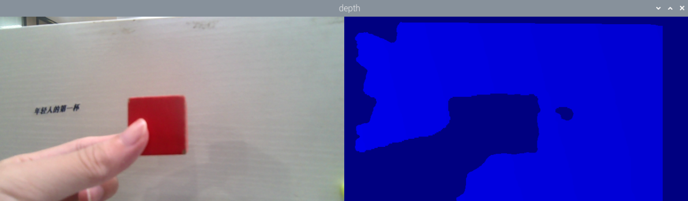
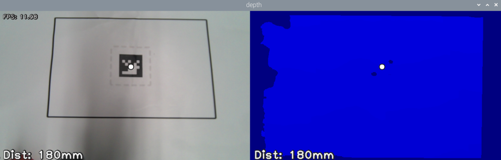
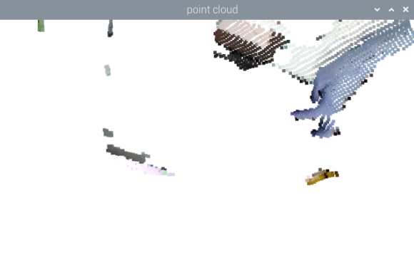
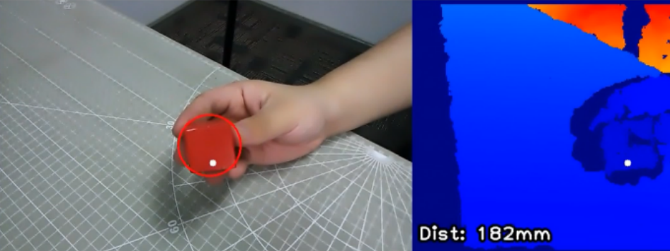
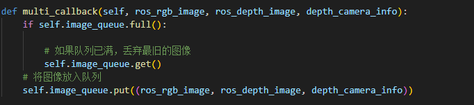

# 9. Robotic Arm Depth Camera Application

## 9.1 Depth Map Pseudo-Color Processing

### 9.1.1 Program Flow

First, initialize the node and obtain the RGB image and depth map topic messages.

Next, process the image to generate the pseudo-color image.

Finally, transmit both the color image and pseudo-color image.

### 9.1.2 Operation Steps

> [!NOTE]
>
> When entering commands, be sure to use correct case and spacing. You can use the Tab key to auto-complete keywords.

1)  Click the terminal icon  in the system desktop to open a command-line window. Enter the following command and press **Enter** to stop the auto-start service:

```
~/.stop_ros.sh
```

2)  Enter the following command and press **Enter** to start the feature.

```
ros2 launch example get_depth_rgb_img.launch.py
```

3)  To stop the program, press **Ctrl + C** in the terminal window. If the program does not stop immediately, repeat this step until it terminates.

4)  After completing the feature, you need to start the APP service. **Otherwise, future APP features may not function properly.** In the terminal, enter the following command and press **Enter** to start the app service. Wait a few seconds for it to initialize.

```
ros2 launch bringup bringup.launch.py
```

5)  Once it is successfully started, the robotic arm will return to its initial pose, and the buzzer will beep once.

### 9.1.3 Project Outcome

Once the feature starts, the robotic arm will send the RGB color image and depth image to the terminal. The color will change corresponding to the distance indicated in the depth map.



### 9.1.4 Program Brief Analysis

* **Launch File Analysis**

The launch file is located at:[/home/ubuntu/ros2_ws/src/example/example/rgbd_function/get_depth_rgb_img.launch.py]()

(1) launch_setup Function

{lineno-start=9}

```
def launch_setup(context):
    compiled = os.environ['need_compile']

    if compiled == 'True':
        sdk_package_path = get_package_share_directory('sdk')
        peripherals_package_path = get_package_share_directory('peripherals')
    else:
        sdk_package_path = '/home/ubuntu/ros2_ws/src/driver/sdk'
        peripherals_package_path = '/home/ubuntu/ros2_ws/src/peripherals'

    sdk_launch = IncludeLaunchDescription(
        PythonLaunchDescriptionSource(
            os.path.join(sdk_package_path, 'launch/armpi_ultra.launch.py')),
    )

    depth_camera_launch = IncludeLaunchDescription(
        PythonLaunchDescriptionSource(
            os.path.join(peripherals_package_path, 'launch/depth_camera.launch.py')),
    )

    get_depth_rgb_img_node = Node(
        package='example',
        executable='get_depth_rgb_img',
        output='screen',
    )

    return [depth_camera_launch,
            sdk_launch,
            get_depth_rgb_img_node,
            ]
```

Loads the **launch/armpi_ultra.launch.py** file from the SDK package to start the underlying control services of the robotic arm, such as servo drivers and kinematics computation. Loads the **launch/depth_camera.launch.py** file from the peripherals package to start the depth camera node, which provides RGB and depth image data. Defining the target node, it declares get_depth_rgb_img_node, and launches the get_depth_rgb_img executable from the example package. This node is used to acquire and process RGB and depth images from the depth camera, with logs output to the screen.

(2) generate_launch_description Function

{lineno-start=40}

```
def generate_launch_description():
    return LaunchDescription([
        OpaqueFunction(function = launch_setup)
    ])
```

Creates and returns a LaunchDescription object, calling launch_setup via OpaqueFunction as the standard entry point for the ROS 2 launch file.

(3) Main Function

{lineno-start=45}

```
if __name__ == '__main__':
    # 创建一个LaunchDescription对象
    ld = generate_launch_description()

    ls = LaunchService()
    ls.include_launch_description(ld)
    ls.run()
```

Creates a LaunchDescription object and a LaunchService service. The launch description is added to the service and executed, enabling the startup of the entire system manually.

* **Python File Analysis**

The Python file is located at:[/home/ubuntu/ros2_ws/src/example/example/rgbd_function/include/get_depth_rgb_img.py]()

(1) Import the Necessary Libraries

{lineno-start=5}

```
import os
import cv2
import time
import rclpy
import queue
import threading
import numpy as np
import sdk.fps as fps
import mediapipe as mp
import message_filters
from rclpy.node import Node
from cv_bridge import CvBridge
from std_srvs.srv import SetBool
from std_srvs.srv import Trigger
from sensor_msgs.msg import Image, CameraInfo
from rclpy.executors import MultiThreadedExecutor
from servo_controller_msgs.msg import ServosPosition
from rclpy.callback_groups import ReentrantCallbackGroup
from servo_controller.bus_servo_control import set_servo_position
```

**import sdk.fps as fps**: Imports the custom fps module, used for frame rate calculation.

**import mediapipe as mp**: Imports the mediapipe library for image processing and human pose estimation.

**import message_filters**: Imports the message_filters module for synchronized message subscriptions.

**from servo_controller_msgs.msg import ServosPosition**: Imports the ServosPosition message type from the servo_controller_msgs.msg package, which is used to control the servo positions.

**from rclpy.callback_groups import ReentrantCallbackGroup**: Imports ReentrantCallbackGroup from rclpy.callback_groups for handling reentrant callbacks in multithreaded environments.

**from servo_controller.bus_servo_control import set_servo_position**: Imports the set_servo_position function from servo_controller.bus_servo_control module to set servo positions.

(2) GetRgbAndDepthNode Class Initialization Function 

{lineno-start=26}

```
    def __init__(self, name):
        rclpy.init()
        super().__init__(name)
        self.running = True
        self.fps = fps.FPS()

        self.image_queue = queue.Queue(maxsize=2)
        self.joints_pub = self.create_publisher(ServosPosition, '/servo_controller', 1) 
        self.client = self.create_client(Trigger, '/controller_manager/init_finish')
        self.client.wait_for_service()
        # self.client = self.create_client(SetBool, '/depth_cam/set_ldp_enable')
        # self.client.wait_for_service()

        rgb_sub = message_filters.Subscriber(self, Image, '/depth_cam/rgb/image_raw')
        depth_sub = message_filters.Subscriber(self, Image, '/depth_cam/depth/image_raw')
        self.get_logger().info(f"1")
        info_sub = message_filters.Subscriber(self, CameraInfo, '/depth_cam/depth/camera_info')
        self.get_logger().info(f"2")
        # 同步时间戳, 时间允许有误差在0.02s
        sync = message_filters.ApproximateTimeSynchronizer([rgb_sub, depth_sub, info_sub], 3, 2)
        sync.registerCallback(self.multi_callback) #执行反馈函数
        
        timer_cb_group = ReentrantCallbackGroup()
        self.timer = self.create_timer(0.0, self.init_process, callback_group=timer_cb_group)
```

Initializes the ROS node, sets the running state flag running, and create a frame rate counter fps. Creates a thread-safe image queue image_queue to buffer synchronized image data. Creates a servo control publisher joints_pub and wait for the robotic arm controller service to start. Uses message_filters to create subscribers for RGB images, depth images, and camera intrinsic parameters. Synchronizes their timestamps with ApproximateTimeSynchronizer, allowing 0.02s tolerance, and registers the multi_callback function to process synchronized data. Starts an initialization timer named timer for subsequent setup operations.

(3) init_process Method

{lineno-start=51}

```
    def init_process(self):
        self.timer.cancel()

        msg = SetBool.Request()
        msg.data = False
        # self.send_request(self.client, msg)

        set_servo_position(self.joints_pub, 1.5, ((1, 500), (2, 500), (3, 330), (4, 900), (5, 700), (6, 500)))
        time.sleep(1.5)
        
        threading.Thread(target=self.main, daemon=True).start()
        self.create_service(Trigger, '~/init_finish', self.get_node_state)
        self.get_logger().info('\033[1;32m%s\033[0m' % 'start')
```

Cancels the initialization timer and resets the robotic arm servos to their initial positions, completed within 1.5 seconds. Starts the main logic thread via the main method, creates the ~/init_finish service to return the node readiness status, and outputs a startup success log.

(4) get_node_state Function

{lineno-start=65}

```
    def get_node_state(self, request, response):
        response.success = True
        return response
```

Service callback function that returns the successful node initialization status response.success = True.

(5) multi_callback Function

{lineno-start=75}

```
    def multi_callback(self, ros_rgb_image, ros_depth_image, depth_camera_info):
        if self.image_queue.full():

            # 如果队列已满，丢弃最旧的图像
            self.image_queue.get()
        # 将图像放入队列
        self.image_queue.put((ros_rgb_image, ros_depth_image, depth_camera_info))
```

Synchronized data callback function that stores the synchronized RGB image, depth image, and camera intrinsics into the image queue, discarding the oldest data if the queue is full, to ensure the main logic thread receives time-aligned multi-source data.

(6) main Method

{lineno-start=83}

```
    def main(self):
        while self.running:
            try:
                ros_rgb_image, ros_depth_image, depth_camera_info = self.image_queue.get(block=True, timeout=1)
            except queue.Empty:
                if not self.running:
                    break
                else:
                    continue
            try:
                rgb_image = np.ndarray(shape=(ros_rgb_image.height, ros_rgb_image.width, 3), dtype=np.uint8, buffer=ros_rgb_image.data)
                #self.get_logger().info(f"rgb_image shape before crop: {rgb_image.shape}") 
                #rgb_image = rgb_image[0:440,]
                #self.get_logger().info(f"rgb_image shape after crop: {rgb_image.shape}")  

                depth_image = np.ndarray(shape=(ros_depth_image.height, ros_depth_image.width), dtype=np.uint16, buffer=ros_depth_image.data)
                #self.get_logger().info(f"depth_image shape: {depth_image.shape}")        
                h, w = depth_image.shape[:2]

                depth = np.copy(depth_image).reshape((-1, ))
                depth[depth<=0] = 0
                sim_depth_image = np.clip(depth_image, 0, 4000).astype(np.float64)
                sim_depth_image = sim_depth_image / 2000.0 * 255.0
                #bgr_image = cv2.cvtColor(rgb_image, cv2.COLOR_RGB2BGR)  # 移除这行代码
                depth_color_map = cv2.applyColorMap(sim_depth_image.astype(np.uint8), cv2.COLORMAP_JET)

                if len(depth_color_map.shape) == 2:
                    depth_color_map = cv2.cvtColor(depth_color_map, cv2.COLOR_GRAY2BGR)
                
                result_image = np.concatenate([rgb_image, depth_color_map], axis=1) 
                cv2.imshow("depth", result_image)
                key = cv2.waitKey(1)
                if key != -1:
                    self.running = False


            except Exception as e:
                self.get_logger().info('error: ' + str(e))
```

Main logic thread that continuously processes image queue data, reads synchronized RGB and depth images, converting them into NumPy arrays. Processes the depth image, removes invalid values (≤ 0), maps the depth range of 0–4000 to 0–255, and applies the JET colormap to generate a pseudo-colored depth image. Concatenates the RGB image with the pseudo-colored depth image and displays them in an OpenCV depth window. Listens for keyboard input, terminating the program upon any key press.

## 9.2 Distance Ranging

### 9.2.1 Program Flow

First, initialize the node and obtain the RGB image and depth map topic messages.

Next, process the image to obtain the pixel distance.

Publish the processed color image and the pseudo-color image, and allow mouse clicks to read or clear the distance at the clicked point.

### 9.2.2 Operation Steps

> [!NOTE]
>
> When entering commands, be sure to use correct case and spacing. You can use the Tab key to auto-complete keywords.

1)  Click the terminal icon  in the system desktop to open a command-line window. Enter the following command and press **Enter** to stop the auto-start service:

```
~/.stop_ros.sh
```

2)  Enter the following command and press **Enter** to start the feature.

```
ros2 launch example distance_measure.launch.py
```

3)  To stop the program, press **Ctrl + C** in the terminal window. If the program does not stop immediately, repeat this step until it terminates.

4)  After completing the feature, you need to start the APP service. **Otherwise, future APP features may not function properly.** In the terminal, enter the following command and press **Enter** to start the app service. Wait a few seconds for it to initialize.

```
ros2 launch bringup bringup.launch.py
```

5)  Once it is successfully started, the robotic arm will return to its initial pose, and the buzzer will beep once.

### 9.2.3 Project Outcome

Once the feature is activated, the robotic arm streams both the RGB image and the depth image to the screen. On the depth image, the nearest point and its distance are highlighted. By left-clicking with the mouse, you can mark a point and obtain its distance. A double left-click or a middle-click cancels the mark and restores the minimum-distance measurement.



### 9.2.4 Program Brief Analysis

* **launch File Analysis**

The launch file is located at:[/home/ubuntu/ros2_ws/src/example/example/rgbd_function/distance_measure.launch.py]()

(1) launch_setup Function

{lineno-start=9}

```
def launch_setup(context):
    compiled = os.environ['need_compile']

    if compiled == 'True':
        sdk_package_path = get_package_share_directory('sdk')
        peripherals_package_path = get_package_share_directory('peripherals')
    else:
        sdk_package_path = '/home/ubuntu/ros2_ws/src/driver/sdk'
        peripherals_package_path = '/home/ubuntu/ros2_ws/src/peripherals'

    sdk_launch = IncludeLaunchDescription(
        PythonLaunchDescriptionSource(
            os.path.join(sdk_package_path, 'launch/armpi_ultra.launch.py')),
    )

    depth_camera_launch = IncludeLaunchDescription(
        PythonLaunchDescriptionSource(
            os.path.join(peripherals_package_path, 'launch/depth_camera.launch.py')),
    )

    distance_measure_node = Node(
        package='example',
        executable='distance_measure',
        output='screen',
    )

    return [depth_camera_launch,
            sdk_launch,
            distance_measure_node,
            ]
```

Including external launch file: Loads the launch/armpi_ultra.launch.py file from the SDK package to start the underlying control services of the robotic arm, such as servo drivers and kinematics computation. Loads the launch/depth_camera.launch.py file from the peripherals package to start the depth camera node, which provides RGB image and depth data.

Defining the target node: Declares distance_measure_node to launch the distance_measure executable from the example package. This node implements the distance measurement function such as calculating the distance between the target and the camera, with log output directed to the screen.

(2) generate_launch_description Function 

{lineno-start=40}

```
def generate_launch_description():
    return LaunchDescription([
        OpaqueFunction(function = launch_setup)
    ])
```

Creates and returns a LaunchDescription object, calling launch_setup via OpaqueFunction as the standard entry point for the ROS 2 launch file.

(3) Main Function

{lineno-start=45}

```
if __name__ == '__main__':
    # 创建一个LaunchDescription对象
    ld = generate_launch_description()

    ls = LaunchService()
    ls.include_launch_description(ld)
    ls.run()
```

Creates a LaunchDescription object and a LaunchService service. The launch description is added to the service and executed, enabling the startup of the entire system manually.

* **Python File Analysis**

The Python file is located at:[/home/ubuntu/ros2_ws/src/example/example/rgbd_function/include/distance_measure.py]()

(1) Import the Necessary Libraries

{lineno-start=5}

```
import os
import cv2
import time
import rclpy
import queue
import threading
import numpy as np
import sdk.fps as fps
import mediapipe as mp
import message_filters
from rclpy.node import Node
from cv_bridge import CvBridge
from std_srvs.srv import SetBool
from std_srvs.srv import Trigger
from sensor_msgs.msg import Image, CameraInfo
from rclpy.executors import MultiThreadedExecutor
from servo_controller_msgs.msg import ServosPosition
from rclpy.callback_groups import ReentrantCallbackGroup
from servo_controller.bus_servo_control import set_servo_position
```

**import sdk.fps as fps**: Imports the custom fps module, used for calculating and tracking frame rates.

**import mediapipe as mp**: Imports the MediaPipe library for processing computer vision tasks, such as pose estimation.

**import message_filters**: Imports the message_filters, which is used to synchronize multiple sensor messages, such as depth images and RGB images.

**from servo_controller_msgs.msg import ServosPosition**: Imports the ServosPosition message type from the servo_controller_msgs.msg package, which is used to control the servo positions.

**from rclpy.callback_groups import ReentrantCallbackGroup**: Imports ReentrantCallbackGroup from rclpy.callback_groups, which enables reentrant callback groups, allowing multiple threads to execute callbacks concurrently.

**from servo_controller.bus_servo_control import set_servo_position**: Imports the set_servo_position function from servo_controller.bus_servo_control module to set servo target positions.

(2) DistanceMeasureNode Class Initialization Function

{lineno-start=25}

```
class DistanceMeasureNode(Node):

    def __init__(self, name):
        rclpy.init()
        super().__init__(name)
        self.running = True
        self.fps = fps.FPS()

        self.image_queue = queue.Queue(maxsize=2)
        self.joints_pub = self.create_publisher(ServosPosition, '/servo_controller', 1) # 舵机控制
        
        self.client = self.create_client(Trigger, '/controller_manager/init_finish')
        self.client.wait_for_service()
        # self.client = self.create_client(SetBool, '/depth_cam/set_ldp_enable')
        # self.client.wait_for_service()

        rgb_sub = message_filters.Subscriber(self, Image, '/depth_cam/rgb/image_raw')
        depth_sub = message_filters.Subscriber(self, Image, '/depth_cam/depth/image_raw')

        # 同步时间戳, 时间允许有误差在0.02s
        sync = message_filters.ApproximateTimeSynchronizer([rgb_sub, depth_sub], 4, 0.5)
        sync.registerCallback(self.multi_callback) #执行反馈函数
        
        timer_cb_group = ReentrantCallbackGroup()
        self.timer = self.create_timer(0.0, self.init_process, callback_group=timer_cb_group)
        self.target_point = None
        self.last_event = 0
        cv2.namedWindow("depth")
        cv2.setMouseCallback('depth', self.click_callback)
        threading.Thread(target=self.main, daemon=True).start()
```

Initializes the ROS node, sets the running state flag running, and create a frame rate counter fps. Creates a thread-safe image queue image_queue and a servo control publisher joints_pub, and waits for the robotic arm controller service to start. Uses message_filters to create subscribers for RGB images and depth images. Synchronizes their timestamps with ApproximateTimeSynchronizer, allowing 0.5s tolerance, and registers the multi_callback function to process synchronized data. Starts the initialization timer timer, sets up the mouse callback function for interactively selecting measurement points, and launches the main logic thread via main method.

(3) init_process Function

{lineno-start=55}

```
    def init_process(self):
        self.timer.cancel()

        msg = SetBool.Request()
        msg.data = False
        #self.send_request(self.client, msg)

        #set_servo_position(self.joints_pub, 1.5, ((1, 500), (2, 500), (3, 330), (4, 900), (5, 700), (6, 500)))
        set_servo_position(self.joints_pub, 1.5, ((6, 500), (5, 600), (4, 785), (3, 110), (2, 500), (1, 210)))
        time.sleep(1)

        # threading.Thread(target=self.main, daemon=True).start()
        self.get_logger().info('\033[1;32m%s\033[0m' % 'start')
```

Cancels the initialization timer and resets the robotic arm servos to their initial positions, completed within 1.5 seconds, with log output directed to the screen.

(4) multi_callback Function 

{lineno-start=69}

```
    def multi_callback(self, ros_rgb_image, ros_depth_image):
        if self.image_queue.full():

            # 如果队列已满，丢弃最旧的图像
            self.image_queue.get()
        # 将图像放入队列
        self.image_queue.put((ros_rgb_image, ros_depth_image))
```

Synchronized data callback function that stores the synchronized RGB image and depth image into the image queue, discarding the oldest data if the queue is full, to ensure the main logic thread receives time-aligned image pairs.

(5) click_callback Function

{lineno-start=77}

```
    def click_callback(self, event, x, y, flags, params):
        if event == cv2.EVENT_RBUTTONDOWN or event == cv2.EVENT_MBUTTONDOWN or event == cv2.EVENT_LBUTTONDBLCLK:
            self.target_point = None
        if event == cv2.EVENT_LBUTTONDOWN and self.last_event != cv2.EVENT_LBUTTONDBLCLK:
            if x >= 640:
                self.target_point = (x - 640, y)
            else:
                self.target_point = (x, y)
        self.last_event = event
```

Mouse interaction callback:

Left-click: Sets the target point for measurement. Clicking on either the RGB image or depth map is supported, with coordinates automatically mapped. Right-click / middle-click or double left-click: Clears the target point and reverts to automatic nearest-point measurement.

Calls the client’s asynchronous request method call_async, sends a message, and returns a future object representing the result.

(6) main Method

{lineno-start=93}

```
    def main(self):
        while self.running:
            try:
                ros_rgb_image, ros_depth_image = self.image_queue.get(block=True, timeout=1)
            except queue.Empty:
                if not self.running:
                    break
                else:
                    self.get_logger().info('\033[1;31m%s\033[0m' % 'sdsdfsd')
                    continue
            try:
                rgb_image = np.ndarray(shape=(ros_rgb_image.height, ros_rgb_image.width, 3), dtype=np.uint8, buffer=ros_rgb_image.data)
                depth_image = np.ndarray(shape=(ros_depth_image.height, ros_depth_image.width), dtype=np.uint16, buffer=ros_depth_image.data)

                h, w = depth_image.shape[:2]

                depth = np.copy(depth_image).reshape((-1, ))
                depth[depth<=0] = 55555
                min_index = np.argmin(depth)
                min_y = min_index // w
                min_x = min_index - min_y * w
                if self.target_point is not None:
                    min_x, min_y = self.target_point

                sim_depth_image = np.clip(depth_image, 0, 2000).astype(np.float64) / 2000 * 255
                depth_color_map = cv2.applyColorMap(sim_depth_image.astype(np.uint8), cv2.COLORMAP_JET)

                txt = 'Dist: {}mm'.format(depth_image[min_y, min_x])
                cv2.circle(depth_color_map, (int(min_x), int(min_y)), 8, (32, 32, 32), -1)
                cv2.circle(depth_color_map, (int(min_x), int(min_y)), 6, (255, 255, 255), -1)
                cv2.putText(depth_color_map, txt, (11, 380), cv2.FONT_HERSHEY_PLAIN, 2.0, (32, 32, 32), 6, cv2.LINE_AA)
                cv2.putText(depth_color_map, txt, (10, 380), cv2.FONT_HERSHEY_PLAIN, 2.0, (240, 240, 240), 2, cv2.LINE_AA)
                
                # 颜色空间转换
                bgr_image = rgb_image  #  再进行转换
                # bgr_image = cv2.cvtColor(rgb_image, cv2.COLOR_RGB2BGR)  

                # 确保尺寸一致
                depth_color_map = cv2.resize(depth_color_map, (rgb_image.shape[1], rgb_image.shape[0]))

                # 确保 depth_color_map 是 BGR 格式
                if len(depth_color_map.shape) == 2:
                    depth_color_map = cv2.cvtColor(depth_color_map, cv2.COLOR_GRAY2BGR)

                cv2.circle(bgr_image, (int(min_x), int(min_y)), 8, (32, 32, 32), -1)
                cv2.circle(bgr_image, (int(min_x), int(min_y)), 6, (255, 255, 255), -1)
                cv2.putText(bgr_image, txt, (11, h - 20), cv2.FONT_HERSHEY_PLAIN, 2.0, (32, 32, 32), 6, cv2.LINE_AA)
                cv2.putText(bgr_image, txt, (10, h - 20), cv2.FONT_HERSHEY_PLAIN, 2.0, (240, 240, 240), 2, cv2.LINE_AA)

                self.fps.update()
                # bgr_image = self.fps.show_fps(bgr_image)
                result_image = np.concatenate([bgr_image, depth_color_map], axis=1)
                result_image = self.fps.show_fps(result_image)
                cv2.imshow("depth", result_image)
                key = cv2.waitKey(1)

            except Exception as e:
                self.get_logger().info('error: ' + str(e))
        rclpy.shutdown()
```

Main logic thread that continuously processes image queue data, reads synchronized RGB and depth images, converting them into NumPy arrays. Measurement logic: If no target point is manually selected, automatically detects the nearest point in the depth image with the minimum depth value. If a target is selected, uses the depth value of that point. Depth visualization: Maps the depth range of 0–2000 mm to a pseudocolor image JET colormap, draws a marker at the measurement point, and displays the distance text in mm. Image stitching: Horizontally concatenates the RGB image and the pseudocolor depth image, overlays FPS, and displays them in an OpenCV window named depth, with real-time interaction support.

## 9.3 Depth Map Conversion

### 9.3.1 Program Flow

First, initialize the node and obtain the RGB image and depth map topic messages.

Next, process the image to integrate the RGB image and depth map into RGBD image. Then convert the RGBD image into point cloud data.

Lastly, crop and transmit the point cloud data.

### 9.3.2 Operation Steps

> [!NOTE]
>
> When entering commands, be sure to use correct case and spacing. You can use the Tab key to auto-complete keywords.

1)  Click the terminal icon  in the system desktop to open a command-line window. Enter the following command and press **Enter** to stop the auto-start service:

```
~/.stop_ros.sh
```

2)  Enter the following command and press **Enter** to start the feature.

 ```
ros2 launch example rgb_depth_to_pointcloud.launch.py
 ```

3)  To stop the program, press **Ctrl + C** in the terminal window. If the program does not stop immediately, repeat this step until it terminates.

4)  After completing the feature, you need to start the APP service. **Otherwise, future APP features may not function properly.** In the terminal, enter the following command and press **Enter** to start the app service. Wait a few seconds for it to initialize.

```
ros2 launch bringup bringup.launch.py
```

5)  Once it is successfully started, the robotic arm will return to its initial pose, and the buzzer will beep once.

### 9.3.3 Project Outcome

Once the feature is enabled, the robotic arm converts the cropped point cloud data into a depth image and feeds it into the visualization window. In the returned display, the depth image is shown. You can press and hold the left mouse button or use the scroll wheel to rotate and view the point cloud from different angles, and use the scroll wheel to zoom in for a closer look.



### 9.3.4 Program Brief Analysis

* **launch File Analysis**

The launch file is located at:[/home/ubuntu/ros2_ws/src/example/example/rgbd_function/rgb_depth_to_pointcloud.launch.py]()

(1) launch_setup Function 

{lineno-start=9}

```
def launch_setup(context):
    compiled = os.environ['need_compile']

    if compiled == 'True':
        sdk_package_path = get_package_share_directory('sdk')
        peripherals_package_path = get_package_share_directory('peripherals')
    else:
        sdk_package_path = '/home/ubuntu/ros2_ws/src/driver/sdk'
        peripherals_package_path = '/home/ubuntu/ros2_ws/src/peripherals'

    sdk_launch = IncludeLaunchDescription(
        PythonLaunchDescriptionSource(
            os.path.join(sdk_package_path, 'launch/armpi_ultra.launch.py')),
    )

    depth_camera_launch = IncludeLaunchDescription(
        PythonLaunchDescriptionSource(
            os.path.join(peripherals_package_path, 'launch/depth_camera.launch.py')),
    )

    rgb_depth_to_pointcloud_node = Node(
        package='example',
        executable='rgb_depth_to_pointcloud',
        output='screen',
    )

    return [depth_camera_launch,
            sdk_launch,
            rgb_depth_to_pointcloud_node,
            ]
```

Including external launch file: Loads the **launch/armpi_ultra.launch.py** file from the SDK package to start the underlying control services of the robotic arm, such as servo drivers and kinematics computation, providing hardware support for potential point cloud applications, robotic arm grasping for instance. Loads the **launch/depth_camera.launch.py** file from the peripherals package to start the depth camera node, which provides RGB image and depth data, which is the raw input for point cloud generation. Defining the target node, it declares rgb_depth_to_pointcloud_node and launches the rgb_depth_to_pointcloud executable from the example package, which converts synchronized RGB and depth data into 3D point clouds, with logs output to the screen.

(2) generate_launch_description Function 

{lineno-start=40}

```
def generate_launch_description():
    return LaunchDescription([
        OpaqueFunction(function = launch_setup)
    ])
```

Creates and returns a LaunchDescription object, calling launch_setup via OpaqueFunction as the standard entry point for the ROS 2 launch file.

(3) Main Function 

{lineno-start=45}

```
if __name__ == '__main__':
    # 创建一个LaunchDescription对象
    ld = generate_launch_description()

    ls = LaunchService()
    ls.include_launch_description(ld)
    ls.run()
```

Creates a LaunchDescription object and a LaunchService service. The launch description is added to the service and executed, enabling the startup of the entire system manually.

* **Python File Analysis**

The Python file is located at:[/home/ubuntu/ros2_ws/src/example/example/rgbd_function/include/rgb_depth_to_pointcloud.py]()

(1) Import the Necessary Libraries

{lineno-start=}

```
import os
import cv2
import time
import rclpy
import queue
import signal
import threading
import numpy as np
from sdk import pid
import open3d as o3d
import message_filters
from rclpy.node import Node
from std_srvs.srv import Trigger
from std_srvs.srv import SetBool
from geometry_msgs.msg import Twist
from sensor_msgs.msg import Image, CameraInfo
from rclpy.executors import MultiThreadedExecutor
from servo_controller_msgs.msg import ServosPosition
from rclpy.callback_groups import ReentrantCallbackGroup
from servo_controller.bus_servo_control import set_servo_position
```

**from sdk import pid**: Imports pid from the sdk module, used for PID controllers in control algorithms involving proportional, integral, and derivative components.

**from rclpy.executors import MultiThreadedExecutor**: Imports MultiThreadedExecutor from rclpy.executors, which allows ROS 2 nodes and callbacks to run concurrently across multiple threads.

**from servo_controller_msgs.msg import ServosPosition**: Imports the ServosPosition message type from the servo_controller_msgs.msg package, which is used to control the servo motor positions.

**from servo_controller.bus_servo_control import set_servo_position**: Imports the set_servo_position function from servo_controller.bus_servo_control module to set servo motor positions.

(2) TrackObjectNode Class Initialization Function

{lineno-start=25}

```
class TrackObjectNode(Node):
    def __init__(self, name):
        rclpy.init()
        super().__init__(name, allow_undeclared_parameters=True, automatically_declare_parameters_from_overrides=True)
        signal.signal(signal.SIGINT, self.shutdown)
        self.scale = 4
        self.proc_size = [int(640/self.scale), int(480/self.scale)]
        self.haved_add = False
        self.get_point = False
        self.display = True
        self.running = True
        self.pc_queue = queue.Queue(maxsize=1)
        self.target_cloud = o3d.geometry.PointCloud() # 要显示的点云

        self.t0 = time.time()
        self.joints_pub = self.create_publisher(ServosPosition, '/servo_controller', 0) # 舵机控制

        timer_cb_group = ReentrantCallbackGroup()

        self.client = self.create_client(Trigger, '/controller_manager/init_finish')
        self.client.wait_for_service()

        # self.client = self.create_client(SetBool, '/depth_cam/set_ldp_enable')
        # self.client.wait_for_service()

        camera_name = 'depth_cam'
        rgb_sub = message_filters.Subscriber(self, Image, '/%s/rgb/image_raw' % camera_name)
        depth_sub = message_filters.Subscriber(self, Image, '/%s/depth/image_raw' % camera_name)
        info_sub = message_filters.Subscriber(self, CameraInfo, '/%s/depth/camera_info' % camera_name)

        # 同步时间戳, 时间允许有误差在0.02s
        sync = message_filters.ApproximateTimeSynchronizer([rgb_sub, depth_sub, info_sub], 3, 2)
        sync.registerCallback(self.multi_callback) #执行反馈函数

        self.timer = self.create_timer(0.0, self.init_process, callback_group=timer_cb_group)

```

Initializes the ROS node and configures core parameters and components, sets the scale factor scale=4 and processing size proc_size, used to reduce computation, defines a point cloud queue pc_queue and target point cloud object target_cloud. Creates a servo control publisher joints_pub and waits for the robotic arm controller service to start. Subscribes to RGB images, depth images, and camera intrinsic data using message_filters, and synchronizes their timestamps with ApproximateTimeSynchronizer, allowing a 2-second tolerance, registering multi_callback to process the synchronized data. Starts the initialization timer timer for subsequent setup operations and registers an interrupt signal handler via shutdown method to ensure program exit.

(3) init_process Method

{lineno-start=61}

```
    def init_process(self):
        self.timer.cancel()

        set_servo_position(self.joints_pub, 1, ((6, 500), (5, 765), (4, 915), (3, 150), (2, 500), (1, 200)))

        msg = SetBool.Request()
        msg.data = False
        #self.send_request(self.client, msg)

        threading.Thread(target=self.main, daemon=True).start()
        self.create_service(Trigger, '~/init_finish', self.get_node_state)
        self.get_logger().info('\033[1;32m%s\033[0m' % 'start')
```

Cancels the initialization timer and resets the robotic arm servos to the specified positions, completed within 1.5 seconds. Starts the main logic thread via the main method, creates the ~/init_finish service to return the node readiness status, and outputs a startup success log.

(4) get_node_state Function

{lineno-start=74}

```
    def get_node_state(self, request, response):
        response.success = True
        return response
```

Service callback function that returns the node's initialization success status response.success = True, used to notify other nodes that this node is ready.

(5) multi_callback Function

{lineno-start=84}

```
    def multi_callback(self, ros_rgb_image, ros_depth_image, depth_camera_info):
        print("multi_callback called") # 确认回调函数被调用
        try:
            # ros格式转为numpy
            rgb_image = np.ndarray(shape=(ros_rgb_image.height, ros_rgb_image.width, 3), dtype=np.uint8, buffer=ros_rgb_image.data)
            depth_image = np.ndarray(shape=(ros_depth_image.height, ros_depth_image.width), dtype=np.uint16, buffer=ros_depth_image.data)

            print(f"RGB Image Shape: {rgb_image.shape}, Depth Image Shape: {depth_image.shape}") # 打印图像尺寸
            print(f"RGB Image dtype: {rgb_image.dtype}, Depth Image dtype: {depth_image.dtype}") # 打印图像数据类型

            rgb_image = cv2.resize(rgb_image, tuple(self.proc_size), interpolation=cv2.INTER_NEAREST)
            depth_image = cv2.resize(depth_image, tuple(self.proc_size), interpolation=cv2.INTER_NEAREST)
            intrinsic = o3d.camera.PinholeCameraIntrinsic(int(depth_camera_info.width / self.scale),
                                                               int(depth_camera_info.height / self.scale),
                                                               float(depth_camera_info.k[0] / self.scale), float(depth_camera_info.k[4] / self.scale),
                                                               float(depth_camera_info.k[2] / self.scale), float(depth_camera_info.k[5] / self.scale))

            print(f"Intrinsic Matrix: {intrinsic.intrinsic_matrix}")  # 打印相机内参

            o3d_image_rgb = o3d.geometry.Image(rgb_image)
            o3d_image_depth = o3d.geometry.Image(np.ascontiguousarray(depth_image))

            # rgbd_function --> point_cloud
            rgbd_image = o3d.geometry.RGBDImage.create_from_color_and_depth(o3d_image_rgb, o3d_image_depth, convert_rgb_to_intensity=False)
            # cpu占用大
            pc = o3d.geometry.PointCloud.create_from_rgbd_image(rgbd_image, intrinsic)#, extrinsic=extrinsic)ic)

            print(f"Point Cloud Size: {len(pc.points)}") # 添加打印语句

            # 去除最大平面，即地面, 距离阈4mm，邻点数，迭代次数
            plane_model, inliers = pc.segment_plane(distance_threshold=0.05,
                     ransac_n=10,
                     num_iterations=50)

            # 保留内点
            inlier_cloud = pc.select_by_index(inliers, invert=True)
            self.target_cloud.points = inlier_cloud.points
            self.target_cloud.colors = inlier_cloud.colors

            # 转180度方便查看
            self.target_cloud.transform(np.asarray([[1, 0, 0, 0], [0, -1, 0, 0], [0, 0, -1, 0], [0, 0, 0, 1]]))
            try:
                self.pc_queue.put_nowait(self.target_cloud)
                print("Point cloud enqueued")  # 确认点云已入队
            except queue.Full:
                pass

        except BaseException as e:
            print('callback error:', e)
        self.t0 = time.time()
```

Core logic for processing synchronized data and converting images to point clouds. Receives synchronized RGB images, depth images, and camera intrinsics, converts them to NumPy arrays, and resizes them according to the scale factor to reduce computation. Creates an Open3D camera intrinsic object PinholeCameraIntrinsic using the camera intrinsics, and converts the RGB and depth images into an Open3D RGBD image. Generates the point cloud create_from_rgbd_image, segments planes using RANSAC, mainly to remove the floor, and retains non-plane points as the target point cloud target_cloud. Transforms the point cloud coordinates by rotating 180 degrees around the X-axis for visualization, and stores the processed point cloud in the queue pc_queue for visualization by the main thread.

(6) main Method

{lineno-start=138}

```
    def main(self):
        if self.display:
            # 创建可视化窗口
            vis = o3d.visualization.Visualizer()
            vis.create_window(window_name='point cloud', width=640, height=400, visible=1)
        while self.running:
            if not self.haved_add:
                if self.display:
                    try:
                        point_cloud = self.pc_queue.get(block=True, timeout=2)
                        print("Point cloud dequeued") # 确认点云已出队
                    except queue.Empty:
                        continue
                    vis.add_geometry(point_cloud)
                self.haved_add = True
            if self.haved_add:
                try:
                    point_cloud = self.pc_queue.get(block=True, timeout=2)
                    print("Point cloud dequeued") # 确认点云已出队
                except queue.Empty:
                    continue
                # 刷新
                points = np.asarray(point_cloud.points)
                print(f"Points array shape: {points.shape}")  # 确认 points 数组的形状

                if len(points) > 0:
                    twist = Twist()
                    min_index = np.argmax(points[:, 2])
                    min_point = points[min_index]
                    if len(point_cloud.colors) < min_index:
                        continue
                    point_cloud.colors[min_index] = [255, 255, 0]

                    if self.display:
                        vis.update_geometry(point_cloud)
                        #o3d.io.write_point_cloud("output.ply", point_cloud)

                        vis.poll_events()
                        vis.update_renderer()

            else:
                time.sleep(0.01)
        # 销毁所有显示的几何图形
        vis.destroy_window()
        self.get_logger().info('\033[1;32m%s\033[0m' % 'shutdown')
        rclpy.shutdown()
```

Main logic thread responsible for point cloud visualization and target tracking: if display is enabled display=True, create an Open3D visualization window vis. Continuously fetch point clouds from the queue. For the first fetch, add the point cloud to the visualization window. For subsequent updates, find the point with the largest Z-axis value, usually the closest point, and mark it in yellow (\[255, 255, 0\]). Refreshes the visualization window in real time until running is False, then destroys the window and shut down ROS.

## 9.4 Height Detection and Gripping

### 9.4.1 Program Flow

First, initialize the node and obtain the RGB image and depth map topic messages.

Then, perform image processing to determine the pixel coordinates of the tallest object within the field of view.

Afterward, convert these pixel coordinates into the world coordinates of the robotic arm through a coordinate system transformation.

Finally, conclude the process by planning the trajectory of the robotic arm for grasping and placing the large wooden block.

### 9.4.2 Operation Steps

> [!NOTE]
>
> When entering commands, be sure to use correct case and spacing. You can use the Tab key to auto-complete keywords.

1)  Click the terminal icon  in the system desktop to open a command-line window. Enter the following command and press **Enter** to stop the auto-start service:

```
~/.stop_ros.sh
```

2)  Enter the following command and press **Enter** to start the feature.

```\
ros2 launch example remove_too_high.launch.py
```

3)  After starting the feature, press **S** in the image display window to start the robotic arm's grasping action. Press **A** to stop the robotic arm from grasping.

    

4)  To stop the program, press **Ctrl + C** in the terminal window. If the program does not stop immediately, repeat this step until it terminates.

5)  After completing the feature, you need to start the APP service. **Otherwise, future APP features may not function properly.** In the terminal, enter the following command and press **Enter** to start the app service. Wait a few seconds for it to initialize.

```
ros2 launch bringup bringup.launch.py
```

6)  Once it is successfully started, the robotic arm will return to its initial pose, and the buzzer will beep once.

### 9.4.3 Project Outcome

Once the feature begins, place a 30x30mm block and a 40x40mm block within the recognition area on the map. Subsequently, the robotic arm will assess their heights and pick up the larger of the two.

### 9.4.4 Program Brief Analysis

* **launch File Analysis**

The launch file is located at:[/home/ubuntu/ros2_ws/src/example/example/rgbd_function/remove_too_high.launch.py]()

(1) launch_setup Function 

{lineno-start=9}

```
def launch_setup(context):
    compiled = os.environ['need_compile']

    if compiled == 'True':
        sdk_package_path = get_package_share_directory('sdk')
        peripherals_package_path = get_package_share_directory('peripherals')
    else:
        sdk_package_path = '/home/ubuntu/ros2_ws/src/driver/sdk'
        peripherals_package_path = '/home/ubuntu/ros2_ws/src/peripherals'

    sdk_launch = IncludeLaunchDescription(
        PythonLaunchDescriptionSource(
            os.path.join(sdk_package_path, 'launch/armpi_ultra.launch.py')),
    )

    depth_camera_launch = IncludeLaunchDescription(
        PythonLaunchDescriptionSource(
            os.path.join(peripherals_package_path, 'launch/depth_camera.launch.py')),
    )

    remove_too_high_node = Node(
        package='example',
        executable='remove_too_high',
        output='screen',
    )

    return [depth_camera_launch,
            sdk_launch,
            remove_too_high_node,
            ]
```

Loads the launch/armpi_ultra.launch.py file from the SDK package to start the underlying control services of the robotic arm, such as servo drivers and kinematics computation. Loads the launch/depth_camera.launch.py file from the peripherals package to start the depth camera node, which provides RGB image and depth data. Declares remove_too_high_node and launches the remove_too_high executable from the example package, used to process point cloud data, likely filtering out overly high points to retain the valid region, with logs output to the screen.

(2) generate_launch_description Function

{lineno-start=40}

```
def generate_launch_description():
    return LaunchDescription([
        OpaqueFunction(function = launch_setup)
    ])
```

Creates and returns a LaunchDescription object, calling launch_setup via OpaqueFunction as the standard entry point for the ROS 2 launch file.

(3) Main Function

{lineno-start=45}

```
if __name__ == '__main__':
    # 创建一个LaunchDescription对象
    ld = generate_launch_description()

    ls = LaunchService()
    ls.include_launch_description(ld)
    ls.run()
```

Creates a LaunchDescription object and a LaunchService service. The launch description is added to the service and executed, enabling the startup of the entire system manually.

### 4.4.2 Python File Analysis

The Python file is located at:[/home/ubuntu/ros2_ws/src/example/example/rgbd_function/include/remove_too_high.py]()

(1) Import the Necessary Libraries

{lineno-start=4}

```
import cv2
import time
import rclpy
import queue
import threading
import numpy as np
import message_filters
from rclpy.node import Node
from std_srvs.srv import Trigger
from sensor_msgs.msg import Image, CameraInfo
from rclpy.executors import MultiThreadedExecutor
from servo_controller_msgs.msg import ServosPosition
from ros_robot_controller_msgs.msg import BuzzerState
from rclpy.callback_groups import ReentrantCallbackGroup
from kinematics.kinematics_control import set_pose_target
from kinematics_msgs.srv import GetRobotPose, SetRobotPose
from servo_controller.bus_servo_control import set_servo_position
from typing import Tuple, List
from cv_bridge import CvBridge  
from sdk import common  
```

**from sdk import common, fps**: Imports the common and fps modules from the sdk package, which provide utility functions and frame rate handling tools.

**from sensor_msgs.msg import Image, CameraInfo**: Imports the Image and CameraInfo message types from the ROS2 sensor_msgs package, used for processing image data and camera information.

**from servo_controller_msgs.msg import ServosPosition**: Imports the ServosPosition message type from servo_controller_msgs, used to send commands to the servos.

**from ros_robot_controller_msgs.msg import BuzzerState**: Imports the BuzzerState message type from ros_robot_controller_msgs, used to control the robot buzzer state.

**from kinematics.kinematics_control import set_pose_target**: Imports the set_pose_target function from the kinematics_control module in the kinematics package, used to set the robot’s target pose.

**from kinematics_msgs.srv import GetRobotPose, SetRobotPose**: Imports the GetRobotPose and SetRobotPose service types from kinematics_msgs, used to retrieve and set the robot’s pose.

**from servo_controller.bus_servo_control import set_servo_position**: Imports the set_servo_position function from servo_controller.bus_servo_control, used to set the servo positions.

(2) depth_pixel_to_camera Function

{lineno-start=25}

```
def depth_pixel_to_camera(pixel_coords, depth, intrinsics):
    fx, fy, cx, cy = intrinsics
    px, py = pixel_coords
    x = (px - cx) * depth / fx
    y = (py - cy) * depth / fy
    z = depth
    return np.array([x, y, z])
```

Calculates the (x, y, z) coordinates in the camera frame using the camera intrinsics (fx, fy, cx, cy) and pixel depth values depth based on the perspective projection formula.

(3) RemoveTooHighObjectNode Class Initialization Function 

{lineno-start=35}

```
    def __init__(self, name):
        super().__init__(name, allow_undeclared_parameters=True, automatically_declare_parameters_from_overrides=True)
        self.bridge = CvBridge()  # CvBridge 实例
        self.endpoint = None
        self.moving = False
        self.running = True
        self.stamp = time.time()
        self.start_process = False
        self.image_queue = queue.Queue(maxsize=2)

        # 加载手眼标定矩阵
        try:
            camera_info_data = common.get_yaml_data("/home/ubuntu/ros2_ws/src/peripherals/config/camera_info.yaml")
            self.hand2cam_tf_matrix = np.array(camera_info_data['hand2cam_tf_matrix'])
            self.get_logger().info('手眼变换矩阵加载成功.')
        except Exception as e:
            self.get_logger().warn(f'加载手眼变换矩阵失败，使用默认值: {e}')
            self.hand2cam_tf_matrix = np.array([
                [0.0, 0.0, 1.0, -0.101],
                [-1.0, 0.0, 0.0, 0.01],
                [0.0, -1.0, 0.0, 0.05],
                [0.0, 0.0, 0.0, 1.0]
            ])

        self.joints_pub = self.create_publisher(ServosPosition, '/servo_controller', 1)
        self.buzzer_pub = self.create_publisher(BuzzerState, '/ros_robot_controller/set_buzzer', 1)

        cb_group = ReentrantCallbackGroup()
        self.create_service(Trigger, f'~/{self.get_name()}/start', self.start_srv_callback, callback_group=cb_group)
        self.create_service(Trigger, f'~/{self.get_name()}/stop', self.stop_srv_callback, callback_group=cb_group)

        self.get_current_pose_client = self.create_client(GetRobotPose, '/kinematics/get_current_pose')
        self.set_pose_target_client = self.create_client(SetRobotPose, '/kinematics/set_pose_target')
        self.get_logger().info('Waiting for services...')
        self.get_current_pose_client.wait_for_service()
        self.set_pose_target_client.wait_for_service()
        self.get_logger().info('Services are ready.')

        rgb_sub = message_filters.Subscriber(self, Image, '/depth_cam/rgb/image_raw')
        depth_sub = message_filters.Subscriber(self, Image, '/depth_cam/depth/image_raw')
        info_sub = message_filters.Subscriber(self, CameraInfo, '/depth_cam/depth/camera_info')
        sync = message_filters.ApproximateTimeSynchronizer([rgb_sub, depth_sub, info_sub], 5, 0.1)
        sync.registerCallback(self.multi_callback)

        self.timer = self.create_timer(0.1, self.init_process, callback_group=cb_group)
```

Sets runtime parameters, creates servo and buzzer publishers, starts/stops service servers, and initializes a robotic arm pose service client. Uses message_filters to synchronize subscriptions to RGB images, depth images, and camera intrinsics. Starts an initialization timer.

(4) init_process Function

{lineno-start=83}

```
    def init_process(self):
        self.timer.cancel()
        set_servo_position(self.joints_pub, 1, ((6, 500), (5, 600), (4, 825), (3, 110), (2, 500), (1, 210)))
        time.sleep(2)
        threading.Thread(target=self.main_loop, daemon=True).start()
        self.get_logger().info(f'\033[1;32mNode {self.get_name()} is ready.\033[0m')
        self.get_logger().info(f"\033[1;33mPress 's' or call 'start' service to begin processing.\033[0m")

```

Cancels the initialization timer and moves the robotic arm back to its home position. Starts the main loop thread and outputs a ready log and instructions, pressing **S** to start/stop processing.

(5) start_srv_callback and stop_srv_callback Function

{lineno-start=91}

```
    def start_srv_callback(self, request, response):
        self.get_logger().info('\033[1;32mStart service called. Starting processing.\033[0m')
        self.start_process = True
        response.success = True
        return response

    def stop_srv_callback(self, request, response):
        self.get_logger().info('\033[1;31mStop service called. Stopping processing.\033[0m')
        self.start_process = False
        self.moving = False
        set_servo_position(self.joints_pub, 1, ((6, 500), (5, 600), (4, 815), (3, 110), (2, 500), (1, 210)))
        response.success = True
        return response
```

RemoveTooHighObjectNode.init_process(self) cancels the initialization timer, resets the robotic arm to its home position, starts the main loop thread, and outputs a node-ready log along with operation instructions, pressing **S** to start or stop processing. RemoveTooHighObjectNode.start_srv_callback(self, request, response) sets start_process = True to start the object detection and robotic arm picking logic, and returns a success response.

(6) send_request Function 

{lineno-start=105}

```
    def send_request(self, client, msg):
        future = client.call_async(msg)
        rclpy.spin_until_future_complete(self, future)
        return future.result()
```

Asynchronously calls services like robot pose services and waits for the result using rclpy.spin_until_future_complete to ensure reliable service communication.

(7) multi_callback Function

{lineno-start=110}

```
    def multi_callback(self, ros_rgb_image, ros_depth_image, depth_camera_info):
        if not self.image_queue.full():
            self.image_queue.put((ros_rgb_image, ros_depth_image, depth_camera_info))
```

Stores synchronized RGB images, depth images, and camera intrinsics into a thread-safe queue image_queue for the main loop to process.

(8) get_endpoint Function

{lineno-start=114}

```
    def get_endpoint(self):
        req = GetRobotPose.Request()
        res = self.send_request(self.get_current_pose_client, req)
        if res is not None:
            endpoint = res.pose
            self.endpoint = common.xyz_quat_to_mat([endpoint.position.x, endpoint.position.y, endpoint.position.z],
                                                   [endpoint.orientation.w, endpoint.orientation.x, endpoint.orientation.y, endpoint.orientation.z])
            return self.endpoint
        return None
```

Calls the get_current_pose service to obtain the end effector’s position and orientation, converting it into a 4×4 transformation matrix endpoint for subsequent coordinate transformations from camera frame to robotic arm frame.

(9) get_plane_valuest Function

{lineno-start=124}

```
    def get_plane_values(self, depth_image: np.ndarray, plane: Tuple[float, float, float, float], intrinsic_matrix: List[float]) -> np.ndarray:
        a, b, c, d = plane
        fx, fy, cx, cy = intrinsic_matrix[0], intrinsic_matrix[4], intrinsic_matrix[2], intrinsic_matrix[5]

        H, W = depth_image.shape
        u, v = np.meshgrid(np.arange(W), np.arange(H))

        z = depth_image.astype(np.float32) / 1000.0

        valid_mask = (z > 0.1) & (z < 2.0)
        x = np.zeros_like(z)
        y = np.zeros_like(z)
        x[valid_mask] = (u[valid_mask] - cx) * z[valid_mask] / fx
        y[valid_mask] = (v[valid_mask] - cy) * z[valid_mask] / fy

        plane_distances = np.full_like(z, np.inf)
        normal_magnitude = np.sqrt(a**2 + b**2 + c**2)
        if normal_magnitude > 1e-6:
            numerator = a * x + b * y + c * z + d
            plane_distances[valid_mask] = numerator[valid_mask] / normal_magnitude
        return plane_distances
```

Calculates the vertical distance from each valid pixel in the depth image to a reference plane using the plane equation plane and camera intrinsics intrinsic_matrix. Generates a height map where positive values indicate points above the plane and negative values indicate points below the plane.

(10) robust_plane_valuest Function

{lineno-start=146}

```
    def robust_plane_detection(self, depth_image: np.ndarray, intrinsic_matrix: List[float], sample_ratio: float = 0.2) -> Tuple[float, float, float, float]:
        fx, fy, cx, cy = intrinsic_matrix[0], intrinsic_matrix[4], intrinsic_matrix[2], intrinsic_matrix[5]

        H, W = depth_image.shape
        z = depth_image.astype(np.float32) / 1000.0

        valid_mask = (z > 0.2) & (z < 2.0)
        valid_indices = np.where(valid_mask)
        if len(valid_indices[0]) < 1000:
            return (0, 0, 1, 0)

        num_points = len(valid_indices[0])
        num_samples = min(num_points, max(int(num_points * sample_ratio), 1000))
        sample_indices = np.random.choice(num_points, num_samples, replace=False)

        v_s, u_s = valid_indices[0][sample_indices], valid_indices[1][sample_indices]
        z_s = z[v_s, u_s]
        x_s = (u_s - cx) * z_s / fx
        y_s = (v_s - cy) * z_s / fy
        points = np.column_stack([x_s, y_s, z_s])

        try:
            A_matrix = np.c_[points[:, :2], np.ones(len(points))]
            C, _, _, _ = np.linalg.lstsq(A_matrix, points[:, 2], rcond=None)
            a, b, c, d = C[0], C[1], -1.0, C[2]
            norm = np.sqrt(a**2 + b**2 + c**2)
            if norm == 0:
                return (0, 0, 1, 0)
            return (a / norm, b / norm, c / norm, d / norm)
        except np.linalg.LinAlgError:
            return (0, 0, 1, 0)
```

Samples valid points from the depth image, filtering out invalid depths, and fits a plane equation Ax + By + Cz + D = 0 using least squares, returning the normalized plane coefficients.

(11) pick Function

{lineno-start=178}

```
    def pick(self, position, angle):
        self.moving = True
        angle = angle % 90
        angle = angle - 90 if angle > 45 else (angle + 90 if angle < -45 else angle)

        set_servo_position(self.joints_pub, 0.5, ((1, 210),))
        time.sleep(0.5)

        if position[0] > 0.21:
            offset_x = self.pick_offset[0]
        else:
            offset_x = self.pick_offset[1]

        if position[1] > 0:
            offset_y = self.pick_offset[2]
        else:
            offset_y = self.pick_offset[3]

        offset_z = self.pick_offset[-1]

        target_pos = [position[0] + offset_x, position[1] + offset_y, position[2] + offset_z + 0.05]
        res = self.send_request(self.set_pose_target_client, set_pose_target(target_pos, 80, [-180.0, 180.0], 1.5))
        if res and res.pulse:
            set_servo_position(self.joints_pub, 1.5, ((6, res.pulse[0]), (5, res.pulse[1]), (4, res.pulse[2]), (3, res.pulse[3])))
        else:
            self.get_logger().warn('Pick: Failed to get pose for approach')
            self.moving = False
            return
        time.sleep(1.5)

        final_angle = 500 + int(1000 * (angle + res.rpy[-1]) / 240)
        set_servo_position(self.joints_pub, 0.5, ((2, final_angle),))
        time.sleep(0.5)

        target_pos[2] -= 0.065
        res = self.send_request(self.set_pose_target_client, set_pose_target(target_pos, 80, [-180.0, 180.0], 1.5))
        if res and res.pulse:
            set_servo_position(self.joints_pub, 1.5, ((6, res.pulse[0]), (5, res.pulse[1]), (4, res.pulse[2]), (3, res.pulse[3])))
        time.sleep(1.5)

        set_servo_position(self.joints_pub, 1.0, ((1, 600),))
        time.sleep(1.0)

        target_pos[2] += 0.08
        res = self.send_request(self.set_pose_target_client, set_pose_target(target_pos, 80, [-180.0, 180.0], 1.0))
        if res and res.pulse:
            set_servo_position(self.joints_pub, 1.0, ((6, res.pulse[0]), (5, res.pulse[1]), (4, res.pulse[2]), (3, res.pulse[3])))
        time.sleep(1.0)

        set_servo_position(self.joints_pub, 1.0, ((6, 150), (5, 635), (4, 900), (3, 260), (2, 500)))
        time.sleep(1.5)

        set_servo_position(self.joints_pub, 1.0, ((1, 200),))
        time.sleep(1.0)

        set_servo_position(self.joints_pub, 1.0, ((6, 500), (5, 600), (4, 825), (3, 110), (2, 500), (1, 210)))
        time.sleep(1.5)
        self.moving = False
```

Controls the robotic arm to complete the full pick-and-place workflow: open gripper → move above target → adjust orientation → descend to pick → lift → move to placement point → release → return to home, ensuring over-height objects are successfully removed.

(12) main_loop Function

{lineno-start=237}

```
    def main_loop(self):
        while self.running:
            try:
                ros_rgb, ros_depth, cam_info = self.image_queue.get(block=True, timeout=1)
            except queue.Empty:
                continue

            try:
                # 使用 CvBridge 安全转换
                rgb_image = self.bridge.imgmsg_to_cv2(ros_rgb, desired_encoding='rgb8')
                depth_image = self.bridge.imgmsg_to_cv2(ros_depth, desired_encoding='passthrough')

                bgr_image = cv2.cvtColor(rgb_image, cv2.COLOR_RGB2BGR)

                K = cam_info.k

                plane_coeffs = self.robust_plane_detection(depth_image, K)
                height_map = self.get_plane_values(depth_image, plane_coeffs, K)

                # 方向修正（保证高度为正）
                MIN_OBJECT_HEIGHT_FOR_CHECK = 0.01
                potential_object_heights = height_map[np.abs(height_map) > MIN_OBJECT_HEIGHT_FOR_CHECK]
                potential_object_heights = potential_object_heights[np.isfinite(potential_object_heights)]
                if potential_object_heights.size > 20 and np.median(potential_object_heights) < 0:
                    height_map *= -1.0

                MIN_OBJECT_HEIGHT = 0.015
                object_mask = np.where((height_map > MIN_OBJECT_HEIGHT) & np.isfinite(height_map), 255, 0).astype(np.uint8)
                object_mask = cv2.erode(object_mask, np.ones((3, 3), np.uint8), iterations=1)
                object_mask = cv2.dilate(object_mask, np.ones((5, 5), np.uint8), iterations=1)

                contours, _ = cv2.findContours(object_mask, cv2.RETR_EXTERNAL, cv2.CHAIN_APPROX_NONE)

                display_height_map = height_map.copy()
                display_height_map[~np.isfinite(display_height_map)] = 0
                display_height_map = np.clip(display_height_map, 0, 0.1)
                display_height_map = (display_height_map * 2550).astype(np.uint8)
                height_color_map = cv2.applyColorMap(display_height_map, cv2.COLORMAP_JET)

                tallest_object = None
                max_height = 0.0

                if len(contours) > 0:
                    for contour in contours:
                        if cv2.contourArea(contour) < 400 or self.moving:
                            continue

                        mask = np.zeros(height_map.shape, dtype=np.uint8)
                        cv2.drawContours(mask, [contour], -1, 255, -1)

                        heights_in_contour = height_map[mask == 255]
                        heights_in_contour = heights_in_contour[np.isfinite(heights_in_contour)]

                        if heights_in_contour.size > 0:
                            current_max_height = np.max(heights_in_contour)
                            if current_max_height > max_height:
                                max_height = current_max_height
                                peak_coords = np.where((height_map == current_max_height) & (mask == 255))
                                peak_y, peak_x = peak_coords[0][0], peak_coords[1][0]
                                tallest_object = {"height": current_max_height, "contour": contour, "peak_xy": (peak_x, peak_y)}

                if tallest_object and not self.moving:
                    contour = tallest_object["contour"]
                    cx, cy = tallest_object["peak_xy"]

                    # 只绘制轮廓和小圆点，不显示高度文本
                    cv2.drawContours(bgr_image, [contour], -1, (0, 255, 0), 2)
                    cv2.circle(bgr_image, (cx, cy), 5, (0, 0, 255), -1)

                    PICK_HEIGHT_THRESHOLD = 0.0015
                    if tallest_object["height"] > PICK_HEIGHT_THRESHOLD and self.start_process:
                        if time.time() - self.stamp > 1.0:
                            self.stamp = time.time()
                            depth_mm = depth_image[cy, cx]
                            if depth_mm > 0:
                                self.get_endpoint()
                                if self.endpoint is not None:
                                    cam_coords = depth_pixel_to_camera((cx, cy), depth_mm / 1000.0, (K[0], K[4], K[2], K[5]))
                                    pose_end = np.matmul(self.hand2cam_tf_matrix, common.xyz_euler_to_mat(cam_coords, (0, 0, 0)))
                                    world_pose = np.matmul(self.endpoint, pose_end)
                                    pose_t, _ = common.mat_to_xyz_euler(world_pose)
                                    rect = cv2.minAreaRect(contour)
                                    threading.Thread(target=self.pick, args=(list(pose_t), rect[2]), daemon=True).start()
                    else:
                        self.stamp = time.time()

                result_image = np.concatenate([bgr_image, height_color_map], axis=1)
                cv2.imshow("Remove Too High Object", result_image)
                key = cv2.waitKey(1) & 0xFF
                if key == ord('s'):
                    self.start_process = not self.start_process
                    if self.start_process:
                        self.get_logger().info("\033[1;32mProcessing started by keyboard.\033[0m")
                    else:
                        self.get_logger().info("\033[1;31mProcessing stopped by keyboard.\033[0m")
                elif key == ord('q'):
                    self.running = False
                    break

            except Exception as e:
                self.get_logger().error(f'Main loop error: {e}', throttle_duration_sec=1.0)

        cv2.destroyAllWindows()
        self.get_logger().info("Shutting down...")
```

Reads image data from the queue, computes the height map, detects over-height objects (height \> threshold), and triggers the pick thread to remove them. Visualizes results by combining RGB images with the pseudo-colored height map. Supports keyboard interaction, pressing **S** to toggle processing, press **Q** to quit.

(13) main Method 

{lineno-start=342}

```
def main(args=None):
    rclpy.init(args=args)
    try:
        node = RemoveTooHighObjectNode('remove_too_high_object')
        executor = MultiThreadedExecutor()
        executor.add_node(node)
        executor.spin()
    except KeyboardInterrupt:
        pass
    finally:
        if 'node' in locals() and rclpy.ok():
            node.destroy_node()
            rclpy.shutdown()

```

Initializes ROS2, creates an instance of RemoveTooHighObjectNode, and starts a multi-threaded executor for callback handling. Captures keyboard interrupts to clean up node resources and shut down ROS properly.

## 9.5 3D Space Gripping

### 9.5.1 Program Flow

First, initialize the node and obtain the RGB image and depth map topic messages.

Next, process the image to obtain the coordinate of the target pixel so as to track the target.

Afterward, convert these pixel coordinates into the world coordinates of the robotic arm through a coordinate system transformation.

Lastly, plan the trajectory for the robotic arm enabling it to place the item to corresponding position.

### 9.5.2 Operation Steps

> [!NOTE]
>
> When entering commands, be sure to use correct case and spacing. You can use the Tab key to auto-complete keywords.

1)  Click the terminal icon  in the system desktop to open a command-line window. Enter the following command and press **Enter** to stop the auto-start service:

``` 
~/.stop_ros.sh
```

2)  Enter the following command and press **Enter** to start the feature.

```
ros2 launch example track_and_grab.launch.py
```

3)  To stop the program, press **Ctrl + C** in the terminal window. If the program does not stop immediately, repeat this step until it terminates.

4)  After completing the feature, you need to start the APP service. **Otherwise, future APP features may not function properly.** In the terminal, enter the following command and press **Enter** to start the app service. Wait a few seconds for it to initialize.

```
ros2 launch bringup bringup.launch.py
```

5)  Once it is successfully started, the robotic arm will return to its initial pose, and the buzzer will beep once.

### 5.3 Project Outcome

Once the operation is started, the robotic arm raises the depth camera to face forward, detects colored blocks in the air, which is set to red by default, tracks the blocks, obtains their poses, picks them up, and places them at designated locations.

> [!NOTE]
>
> If the item is placed within the minimal detection range, the camera cannot measure the item's distance. In this scenario, the measurement result will be set to 0, and the terminal will display 'TOO CLOSE !!!'. To resolve this issue, ensure the target block is positioned away from the camera for proper gripping.



### 5.4 Program Brief Analysis

* **launch File Analysis**

The launch file is located at:[/home/ubuntu/ros2_ws/src/example/example/rgbd_function/track_and_grab.launch.py]()

(1) launch_setup Function

{lineno-start=9}

```
def launch_setup(context):
    compiled = os.environ['need_compile']

    start = LaunchConfiguration('start', default='true')
    start_arg = DeclareLaunchArgument('start', default_value=start)
    color = LaunchConfiguration('color', default='red')
    color_arg = DeclareLaunchArgument('color', default_value=color)
    if compiled == 'True':
        sdk_package_path = get_package_share_directory('sdk')
        peripherals_package_path = get_package_share_directory('peripherals')
    else:
        sdk_package_path = '/home/ubuntu/ros2_ws/src/driver/sdk'
        peripherals_package_path = '/home/ubuntu/ros2_ws/src/peripherals'

    sdk_launch = IncludeLaunchDescription(
        PythonLaunchDescriptionSource(
            os.path.join(sdk_package_path, 'launch/armpi_ultra.launch.py')),
    )
    depth_camera_launch = IncludeLaunchDescription(
        PythonLaunchDescriptionSource(
            os.path.join(peripherals_package_path, 'launch/depth_camera.launch.py')),
    )

    track_and_grab_node = Node(
        package='example',
        executable='track_and_grab',
        output='screen',
        parameters=[{'color': color}, {'start': start}]
    )

    return [depth_camera_launch,
            sdk_launch,
            track_and_grab_node,
            ]
```

Loads the **launch/armpi_ultra.launch.py** file from the SDK package to start the underlying control services of the robotic arm, such as servo drivers and kinematics computation. Loads the **launch/depth_camera.launch.py** file from the peripherals package to start the depth camera node, which provides RGB image and depth data, which is the basic input for tracking and grasping. Declares track_and_grab_node and launches the track_and_grab executable from the example package to implement the color target tracking + robotic arm picking functionality. The color and start parameters are passed to the node via parameters, allowing dynamic configuration of the tracking color and start state. Logs are output to the screen.

(2) generate_launch_description Function 

{lineno-start=44}

```
def generate_launch_description():
    return LaunchDescription([
        OpaqueFunction(function = launch_setup)
    ])
```

Creates and returns a LaunchDescription object, calling launch_setup via OpaqueFunction as the standard entry point for the ROS 2 launch file.

(3) Main Function

{lineno-start=49}

```
if __name__ == '__main__':
    # 创建一个LaunchDescription对象
    ld = generate_launch_description()

    ls = LaunchService()
    ls.include_launch_description(ld)
    ls.run()
```

Creates a LaunchDescription object and a LaunchService service. The launch description is added to the service and executed, enabling the startup of the entire system manually.

* **Python File Analysis**

The Python file is located at:[/home/ubuntu/ros2_ws/src/example/example/rgbd_function/include/track_and_grab.py]()

(1)  Import the Necessary Libraries 

{lineno-start=6}

```
import cv2
import math
import time
import rclpy
import queue
import signal
import threading
import numpy as np
import message_filters
from rclpy.node import Node
from std_srvs.srv import SetBool
from sdk import pid, common, fps
from std_srvs.srv import Trigger
from interfaces.srv import SetString
from sensor_msgs.msg import Image, CameraInfo
from rclpy.executors import MultiThreadedExecutor
from servo_controller_msgs.msg import ServosPosition
from rclpy.callback_groups import ReentrantCallbackGroup
from kinematics.kinematics_control import set_pose_target
from kinematics_msgs.srv import GetRobotPose, SetRobotPose
from servo_controller.bus_servo_control import set_servo_position
```

**from kinematics_msgs.srv import SetRobotPose**: Imports the SetBool service type for boolean-type service requests.

**from sdk import pid, common, fps**: Imports PID control, common utilities, and frame rate calculation functions from the sdk module.

**from servo_controller_msgs.msg import ServosPosition**: Imports the ServosPosition message type from the servo_controller_msgs package, which is used to control the servo positions.

**from kinematics.kinematics_control import set_pose_target**: Imports the set_pose_target function from the kinematics module, used to set the robot’s target pose.

**from kinematics_msgs.srv import GetRobotPose, SetRobotPose**: Imports the GetRobotPose and SetRobotPose service types from kinematics_msgs module, used to retrieve and set the robot’s pose.

**from servo_controller.bus_servo_control import set_servo_position**: Imports the set_servo_position function from the servo_controller.bus_servo_control module to configure servo positions.

(2) depth_pixel_to_camera Function

{lineno-start=29}

```
def depth_pixel_to_camera(pixel_coords, depth, intrinsics):
    fx, fy, cx, cy = intrinsics
    px, py = pixel_coords
    x = (px - cx) * depth / fx
    y = (py - cy) * depth / fy
    z = depth
    return np.array([x, y, z])
```

Converts pixel coordinates from a depth image into 3D points in the camera coordinate frame.

(3) ColorTracker Class Initialization Function

{lineno-start=38}

```
    def __init__(self, target_color):
        self.target_color = target_color
        self.pid_yaw = pid.PID(20.5, 1.0, 1.2)
        self.pid_pitch = pid.PID(20.5, 1.0, 1.2)
        self.yaw = 500
        self.pitch = 150
```

Initializes the color tracker, sets the target color, initializes PID controllers for pitch and yaw adjustments, and sets the initial angles.

(4) proc Function

{lineno-start=45}

```
    def proc(self, source_image, result_image, color_ranges):
        h, w = source_image.shape[:2]
        color = color_ranges['color_range_list'][self.target_color]

        img = cv2.resize(source_image, (int(w/2), int(h/2)))
        img_blur = cv2.GaussianBlur(img, (3, 3), 3) # 高斯模糊
        img_lab = cv2.cvtColor(img_blur, cv2.COLOR_BGR2LAB) # 转换到 LAB 空间源COLOR_BGR2LAB
        mask = cv2.inRange(img_lab, tuple(color['min']), tuple(color['max'])) # 二值化

        # 平滑边缘，去除小块，合并靠近的块
        eroded = cv2.erode(mask, cv2.getStructuringElement(cv2.MORPH_RECT, (3, 3)))
        dilated = cv2.dilate(eroded, cv2.getStructuringElement(cv2.MORPH_RECT, (3, 3)))
        # 找出最大轮廓
        contours = cv2.findContours(dilated, cv2.RETR_EXTERNAL, cv2.CHAIN_APPROX_NONE)[-2]
        min_c = None
        for c in contours:
            if math.fabs(cv2.contourArea(c)) < 50:
                continue
            (center_x, center_y), radius = cv2.minEnclosingCircle(c) # 最小外接圆
            if min_c is None:
                min_c = (c, center_x)
            elif center_x < min_c[1]:
                if center_x < min_c[1]:
                    min_c = (c, center_x)

        # 如果有符合要求的轮廓
        if min_c is not None:
            (center_x, center_y), radius = cv2.minEnclosingCircle(min_c[0]) # 最小外接圆

            # 圈出识别的的要追踪的色块
            circle_color = common.range_rgb[self.target_color] if self.target_color in common.range_rgb else (0x55, 0x55, 0x55)
            cv2.circle(result_image, (int(center_x * 2), int(center_y * 2)), int(radius * 2), circle_color, 2)

            center_x = center_x * 2
            center_x_1 = center_x / w
            if abs(center_x_1 - 0.5) > 0.02: # 相差范围小于一定值就不用再动了
                self.pid_yaw.SetPoint = 0.5 # 我们的目标是要让色块在画面的中心, 就是整个画面的像素宽度的 1/2 位置
                self.pid_yaw.update(center_x_1)
                self.yaw = min(max(self.yaw + self.pid_yaw.output, 0), 1000)
            else:
                self.pid_yaw.clear() # 如果已经到达中心了就复位一下 pid 控制器

            center_y = center_y * 2
            center_y_1 = center_y / h
            if abs(center_y_1 - 0.5) > 0.02:
                self.pid_pitch.SetPoint = 0.5
                self.pid_pitch.update(center_y_1)
                self.pitch = min(max(self.pitch + self.pid_pitch.output, 100), 720)
            else:
                self.pid_pitch.clear()
            return (result_image, (self.pitch, self.yaw), (center_x, center_y), radius * 2)
        else:
            return (result_image, None, None, 0)
```


Processes input images, detects target color blocks in the LAB color space, calculates block center positions, adjusts pitch and yaw using PID control, and returns the processed image, angles, block center coordinates, and radius.

(5) TrackAndGrabNode Class Initialization Function

{lineno-start=100}

```
class TrackAndGrabNode(Node):
    def __init__(self, name):
        rclpy.init()
        super().__init__(name, allow_undeclared_parameters=True, automatically_declare_parameters_from_overrides=True)
        self.fps = fps.FPS()
        self.moving = False
        self.count = 0
        self.start = False
        self.running = True
        self.last_pitch_yaw = (0, 0)

        self.enable_disp = 1
        signal.signal(signal.SIGINT, self.shutdown)

        # 加载LAB颜色范围配置文件
        self.data = common.get_yaml_data("/home/ubuntu/ros2_ws/src/app/config/lab_config.yaml")  
        self.lab_data = self.data['/**']['ros__parameters']
        
        try:
            camera_info_data = common.get_yaml_data("/home/ubuntu/ros2_ws/src/peripherals/config/camera_info.yaml")
            self.hand2cam_tf_matrix = camera_info_data['hand2cam_tf_matrix']
            self.get_logger().info('手眼变换矩阵加载成功.')
        except Exception as e:
            self.get_logger().error(f'加载手眼变换矩阵失败: {e}')
            # 如果加载失败，可以设置一个默认值或直接关闭节点
            self.hand2cam_tf_matrix = np.identity(4).tolist() # 设置为单位矩阵作为备用
            self.running = False


        self.last_position = (0, 0, 0)
        self.stamp = time.time()

        self.joints_pub = self.create_publisher(ServosPosition, '/servo_controller', 1)

        self.target_color = None
     
        self.get_current_pose_client = self.create_client(GetRobotPose, '/kinematics/get_current_pose')
        self.get_current_pose_client.wait_for_service()
        self.set_pose_target_client = self.create_client(SetRobotPose, '/kinematics/set_pose_target')
        self.set_pose_target_client.wait_for_service()

        self.create_service(Trigger, '~/start', self.start_srv_callback)
        self.create_service(Trigger, '~/stop', self.stop_srv_callback)
        self.create_service(SetString, '~/set_color', self.set_color_srv_callback)
        self.tracker = None

        self.image_queue = queue.Queue(maxsize=2)
        self.endpoint = None

        self.start_stamp = time.time() + 3

        self.client = self.create_client(Trigger, '/controller_manager/init_finish')
        self.client.wait_for_service()

        rgb_sub = message_filters.Subscriber(self, Image, '/depth_cam/rgb/image_raw')
        depth_sub = message_filters.Subscriber(self, Image, '/depth_cam/depth/image_raw')
        info_sub = message_filters.Subscriber(self, CameraInfo, '/depth_cam/depth/camera_info')

        # 同步时间戳, 时间允许有误差在0.02s
        sync = message_filters.ApproximateTimeSynchronizer([rgb_sub, depth_sub, info_sub], 3, 0.2)
        sync.registerCallback(self.multi_callback) #执行反馈函数
        
        timer_cb_group = ReentrantCallbackGroup()
        self.timer = self.create_timer(0.0, self.init_process, callback_group=timer_cb_group)

```

Initializes the node, sets runtime parameters and ROS communication components, including publishers, subscribers, services, loads color configuration and hand-eye transformation matrix, synchronizes subscriptions to RGB images, depth images, and camera intrinsics, and starts the initialization timer.

(6) init_process Function

{lineno-start=165}

```
    def init_process(self):
        self.timer.cancel()
        servo_positions = ((6, 500), (5, 600), (4, 825), (3, 110), (2, 500), (1, 300))
        self.get_logger().info('\033[1;36mInit Servo Positions: %s\033[0m' % str(servo_positions))
        set_servo_position(self.joints_pub, 1, servo_positions)
        time.sleep(1)
        if self.get_parameter('start').value:
            self.target_color = self.get_parameter('color').value
            self.get_logger().info('\033[1;35mget_parameter color: %s\033[0m' % self.target_color)  # 打印获取的颜色
 
            msg = SetString.Request()
            msg.data = self.target_color
            self.set_color_srv_callback(msg, SetString.Response())

        threading.Thread(target=self.main, daemon=True).start()
        self.create_service(Trigger, '~/init_finish', self.get_node_state)
        self.get_logger().info('\033[1;32m%s\033[0m' % 'start')
```

Completes node initialization, sets the initial servo positions, starts the main loop thread, creates a service to indicate initialization completion, and outputs startup logs.

(7) get_node_state Function

{lineno-start=183}

```
    def get_node_state(self, request, response):
        response.success = True
        return response
```

Service callback that returns the node’s initialization status.

(8) shutdown Function

{lineno-start=187}

```
    def shutdown(self, signum, frame):
        self.running = False
```

Handles interrupt signals, for example, **Ctrl + C**, sets the running flag to False, and stops the node.

(9) set_color_srv_callback Function

{lineno-start=190}

```
    def set_color_srv_callback(self, request, response):
        self.get_logger().info('\033[1;32m%s\033[0m' % "set_color")
        self.target_color = request.data
        self.get_logger().info('\033[1;35mset_color_srv_callback color: %s\033[0m' % self.target_color)  # 打印设置的颜色
        self.tracker = ColorTracker(self.target_color)
        self.get_logger().info('\033[1;32mset color: %s\033[0m' % self.target_color)
        self.start = True
        response.success = True
        response.message = "set_color"
        return response
```

Service callback that sets the target tracking color, initializes the color tracker, and returns a success response.

(10) start_srv_callback and stop_srv_callback Function

{lineno-start=201}

```
    def start_srv_callback(self, request, response):
        self.get_logger().info('\033[1;32m%s\033[0m' % "start")
        self.start = True
        response.success = True
        response.message = "start"
        return response

    def stop_srv_callback(self, request, response):
        self.get_logger().info('\033[1;32m%s\033[0m' % "stop")
        self.start = False
        self.moving = False
        self.count = 0
        self.last_pitch_yaw = (0, 0)
        self.last_position = (0, 0, 0)
        servo_positions = ((6, 500), (5, 600), (4, 825), (3, 110), (2, 500), (1, 210))
        self.get_logger().info('\033[1;36mStop Servo Positions: %s\033[0m' % str(servo_positions))
        set_servo_position(self.joints_pub, 1, servo_positions)
        response.success = True
        response.message = "stop"
        return response
```

start_srv_callback: Service callback that starts the tracking and gripping functionality, returning a success response.

stop_srv_callback: Service callback that stops the functionality, resets the servos to their initial positions, and returns a success response.

(11) send_request Function

{lineno-start=222}

```
    def send_request(self, client, msg):
        future = client.call_async(msg)
        while rclpy.ok():
            if future.done() and future.result():
                return future.result()
```

Sends a service request and blocks until a response is received, ensuring reliable service communication.

(12) multi_callback Function

{lineno-start=228}

```
    def multi_callback(self, ros_rgb_image, ros_depth_image, depth_camera_info):
        if self.image_queue.full():
            # 如果队列已满，丢弃最旧的图像
            self.image_queue.get()
        # 将图像放入队列
        self.image_queue.put((ros_rgb_image, ros_depth_image, depth_camera_info))
```

Synchronizes and receives RGB images, depth images, and camera intrinsics, storing them in a thread-safe queue for main loop processing.

(13) get_endpoint Function

{lineno-start=235}

```
    def get_endpoint(self):
        endpoint = self.send_request(self.get_current_pose_client, GetRobotPose.Request()).pose
        self.endpoint = common.xyz_quat_to_mat([endpoint.position.x, endpoint.position.y, endpoint.position.z],
                                        [endpoint.orientation.w, endpoint.orientation.x, endpoint.orientation.y, endpoint.orientation.z])
        return self.endpoint
```

Retrieves the current pose of the robotic arm’s end effector, converts it into a 4×4 transformation matrix, and facilitates coordinate transformations.

(14) pick Function

{lineno-start=241}

```
    def pick(self, position):
        if position[2] < 0.2:
            yaw = 80
        else:
            yaw = 30
        msg = set_pose_target(position, yaw, [-180.0, 180.0], 1.0)
        res = self.send_request(self.set_pose_target_client, msg)
        if res.pulse:
            servo_data = res.pulse
            servo_positions = ((6, servo_data[0]),)
            self.get_logger().info('\033[1;36mPick Servo Positions 1: %s\033[0m' % str(servo_positions))
            set_servo_position(self.joints_pub, 1, servo_positions)
            time.sleep(1)
            servo_positions = ((6, servo_data[0]),(5, servo_data[1]), (4, servo_data[2]),(3, servo_data[3]), (2, servo_data[4]))
            self.get_logger().info('\033[1;36mPick Servo Positions 2: %s\033[0m' % str(servo_positions))
            set_servo_position(self.joints_pub, 1.5, servo_positions)
            time.sleep(1.5)

            servo_positions = ((1, 600),)
            self.get_logger().info('\033[1;36mPick Servo Positions 3: %s\033[0m' % str(servo_positions))
            set_servo_position(self.joints_pub, 0.5, servo_positions)
            time.sleep(1)

            position[2] += 0.06
            msg = set_pose_target(position, yaw, [-180.0, 180.0], 1.0)
            res = self.send_request(self.set_pose_target_client, msg)
            if res.pulse:
                servo_data = res.pulse
                servo_positions = ((6, servo_data[0]),(5, servo_data[1]), (4, servo_data[2]),(3, servo_data[3]), (2, servo_data[4]))
                self.get_logger().info('\033[1;36mPick Servo Positions 4: %s\033[0m' % str(servo_positions))
                set_servo_position(self.joints_pub, 1, servo_positions)
                time.sleep(1)


            servo_positions = ((6, 500), (5, 720), (4, 900), (3, 120), (2, 500), (1, 500))
            self.get_logger().info('\033[1;36mPick Servo Positions 5: %s\033[0m' % str(servo_positions))
            set_servo_position(self.joints_pub, 1, servo_positions)
            time.sleep(1)
            servo_positions = ((6, 125), (5, 635), (4, 780), (3, 200), (2, 500))
            self.get_logger().info('\033[1;36mPick Servo Positions 6: %s\033[0m' % str(servo_positions))
            set_servo_position(self.joints_pub, 1, servo_positions)
            time.sleep(1)
            servo_positions = ((6, 125), (5,550), (4, 780), (3, 150), (2, 500))
            self.get_logger().info('\033[1;36mPick Servo Positions 7: %s\033[0m' % str(servo_positions))
            set_servo_position(self.joints_pub, 1.5, servo_positions)
            time.sleep(1.5)
            servo_positions = ((6, 125), (5, 550), (4, 780), (3, 170), (2, 500), (1, 200))
            self.get_logger().info('\033[1;36mPick Servo Positions 8: %s\033[0m' % str(servo_positions))
            set_servo_position(self.joints_pub, 1, servo_positions)
            time.sleep(1.5)
            servo_positions = ((6, 500), (5, 720), (4, 900), (3, 250), (2, 500), (1, 200))
            self.get_logger().info('\033[1;36mPick Servo Positions 9: %s\033[0m' % str(servo_positions))
            set_servo_position(self.joints_pub, 1, servo_positions)
            time.sleep(2)
            self.tracker.yaw = 500
            self.tracker.pitch = 150
            self.tracker.pid_yaw.clear()
            self.tracker.pid_pitch.clear()
            self.stamp = time.time()
        else:
            self.tracker.yaw = 500
            self.tracker.pitch = 150
            self.tracker.pid_yaw.clear()
            self.tracker.pid_pitch.clear()
            self.stamp = time.time()
            self.get_logger().info('\033[1;31m%s\033[0m' % "Out of gripping range")
        self.moving = False

```

Implements the robotic arm picking logic that moves servos to the target position, picks up the object, lifts it, places it at the desired location, and finally resets the arm.

(15) main Method

{lineno-start=309}

```
    def main(self):
        while self.running:
            try:
                ros_rgb_image, ros_depth_image, depth_camera_info = self.image_queue.get(block=True, timeout=1)
            except queue.Empty:
                if not self.running:
                    break
                else:
                    continue
            try:
                rgb_image = np.ndarray(shape=(ros_rgb_image.height, ros_rgb_image.width, 3), dtype=np.uint8, buffer=ros_rgb_image.data)
                depth_image = np.ndarray(shape=(ros_depth_image.height, ros_depth_image.width), dtype=np.uint16, buffer=ros_depth_image.data)
                result_image = np.copy(rgb_image)

                h, w = depth_image.shape[:2]
                depth = np.copy(depth_image).reshape((-1, ))
                depth[depth<=0] = 55555

                sim_depth_image = np.clip(depth_image, 0, 2000).astype(np.float64)

                sim_depth_image = sim_depth_image / 2000.0 * 255.0
                bgr_image = cv2.cvtColor(rgb_image, cv2.COLOR_RGB2BGR)

                depth_color_map = cv2.applyColorMap(sim_depth_image.astype(np.uint8), cv2.COLORMAP_JET)

                if self.tracker is not None and self.moving == False and time.time() > self.start_stamp and self.start:
                    result_image, p_y, center, r = self.tracker.proc(rgb_image, result_image, self.lab_data)
                    if p_y is not None:
                        servo_positions = ((6, int(p_y[1])), (4, (1000-int(p_y[0]))))
                        self.get_logger().info('\033[1;36mTracker Servo Positions: %s\033[0m' % str(servo_positions))
                        set_servo_position(self.joints_pub, 0.02, servo_positions)
                        center_x, center_y = center
                        if center_x > w:
                            center_x = w
                        if center_y > h:
                            center_y = h
                        if abs(self.last_pitch_yaw[0] - p_y[0]) < 3 and abs(self.last_pitch_yaw[1] - p_y[1]) < 3:
                            if time.time() - self.stamp > 2:
                                self.stamp = time.time()
                                roi = [int(center_y) - 5, int(center_y) + 5, int(center_x) - 5, int(center_x) + 5]
                                roi[0] = max(0, roi[0])
                                roi[1] = min(h, roi[1])
                                roi[2] = max(0, roi[2])
                                roi[3] = min(w, roi[3])

                                roi_distance = depth_image[roi[0]:roi[1], roi[2]:roi[3]]
                                valid_depths = roi_distance[np.logical_and(roi_distance > 0, roi_distance < 10000)]

                                if valid_depths.size == 0:
                                    self.get_logger().warn("No valid depth data in ROI. Skipping calculation.")
                                    dist = 0.20  # 或设置一个默认值，如 dist = 0.15
                                else:
                                    dist = round(float(np.mean(valid_depths) / 1000.0), 3)

                                self.get_logger().info("DISTANCE: " + str(dist))
                                # dist += 0.015 # 物体半径补偿
                                # dist += 0.015 # 误差补偿
                                K = depth_camera_info.k
                                self.get_endpoint()
                                position = depth_pixel_to_camera((center_x, center_y), dist, (K[0], K[4], K[2], K[5]))
                                
                                position[0] -= 0.01  # rgb相机和深度相机tf有1cm偏移
                                pose_end = np.matmul(self.hand2cam_tf_matrix, common.xyz_euler_to_mat(position, (0, 0, 0)))  # 转换的末端相对坐标
                                world_pose = np.matmul(self.endpoint, pose_end)  # 转换到机械臂世界坐标
                                pose_t, pose_R = common.mat_to_xyz_euler(world_pose)
                                self.stamp = time.time()
                                self.moving = True
                                threading.Thread(target=self.pick, args=(pose_t,)).start()
                        else:
                            self.stamp = time.time()
                        dist = depth_image[int(center_y),int(center_x)]
                        if dist < 200:
                            txt = "TOO CLOSE !!!"
                        else:
                            txt = "Dist: {}mm".format(dist)
                        cv2.circle(result_image, (int(center_x), int(center_y)), 5, (255, 255, 255), -1)
                        cv2.circle(depth_color_map, (int(center_x), int(center_y)), 5, (255, 255, 255), -1)
                        cv2.putText(depth_color_map, txt, (10, 400 - 20), cv2.FONT_HERSHEY_PLAIN, 2.0, (0, 0, 0), 10, cv2.LINE_AA)
                        cv2.putText(depth_color_map, txt, (10, 400 - 20), cv2.FONT_HERSHEY_PLAIN, 2.0, (255, 255, 255), 2, cv2.LINE_AA)
                        self.last_pitch_yaw = p_y
                    else:
                        self.stamp = time.time()
                if self.enable_disp:
                    #result_image = cv2.cvtColor(result_image[40:440, ], cv2.COLOR_RGB2BGR)
                    result_image = result_image
                    result_image = np.concatenate([result_image, depth_color_map], axis=1)
                    cv2.imshow("depth", result_image)
                    key = cv2.waitKey(1)
                    if key == ord('q') or key == 27:  # 按q或者esc退出
                        self.running = False

            except Exception as e:
                self.get_logger().info('error1: ' + str(e))
        rclpy.shutdown()
```

Node entry point that initializes ROS, creates a node instance, starts a multi-threaded executor to handle callbacks, captures interrupts, and cleans up resources.

## 9.6 3D Shape Sorting

### 9.6.1 Program Flow

First, initialize the node and obtain the RGB image and depth map topic messages.

Next, perform image processing by analyzing the number of corner points in the detected object contours to determine the shape of objects within the field of view.

Subsequently, acquire the pixel coordinates of the highest object within the field of view, perform coordinate system transformation on the obtained coordinates, converting them into the world coordinates of the robotic arm.

Lastly, plan the trajectory for the robotic arm enabling it to place the item to corresponding position.

### 9.6.2 Operation Steps

> [!NOTE]
>
> When entering commands, be sure to use correct case and spacing. You can use the Tab key to auto-complete keywords.

1)  Click the terminal icon  in the system desktop to open a command-line window. Enter the following command and press **Enter** to stop the auto-start service:

```
~/.stop_ros.sh
```

2)  Enter the following command and press **Enter** to start the feature.

```
ros2 launch example shape_recognition.launch.py
```

3)  To stop the program, press **Ctrl + C** in the terminal window. If the program does not stop immediately, repeat this step until it terminates.

4)  After completing the feature, you need to start the APP service. **Otherwise, future APP features may not function properly.** In the terminal, enter the following command and press **Enter** to start the app service. Wait a few seconds for it to initialize.

```
ros2 launch bringup bringup.launch.py
```

5)  Once it is successfully started, the robotic arm will return to its initial pose, and the buzzer will beep once.

### 9.6.3 Project Outcome

Upon initiating the feature, the robotic arm will identify cuboids, cylinders, and spheres within the field of view. It will then proceed to grasp and categorize these objects, placing them in their respective positions.

### 9.6.4 Program Brief Analysis

* **launch File Analysis**

The launch file is located at:[/home/ubuntu/ros2_ws/src/example/example/rgbd_function/shape_recognition.launch.py]()

(1) launch_setup Function

{lineno-start=9}

```
def launch_setup(context):
    compiled = os.environ['need_compile']
    
    start = LaunchConfiguration('start', default='true')
    start_arg = DeclareLaunchArgument('start', default_value=start)
    display = LaunchConfiguration('display', default='true')
    display_arg = DeclareLaunchArgument('display', default_value=display)


    if compiled == 'True':
        sdk_package_path = get_package_share_directory('sdk')
        peripherals_package_path = get_package_share_directory('peripherals')
    else:
        sdk_package_path = '/home/ubuntu/ros2_ws/src/driver/sdk'
        peripherals_package_path = '/home/ubuntu/ros2_ws/src/peripherals'

    sdk_launch = IncludeLaunchDescription(
        PythonLaunchDescriptionSource(
            os.path.join(sdk_package_path, 'launch/armpi_ultra.launch.py')),
    )
    depth_camera_launch = IncludeLaunchDescription(
        PythonLaunchDescriptionSource(
            os.path.join(peripherals_package_path, 'launch/depth_camera.launch.py')),
    )

    shape_recognition_node = Node(
        package='app',
        executable='shape_recognition',
        output='screen',
        parameters=[{ 'start': start, 'display': display}]
    )

    return [start_arg,
            display_arg,
            depth_camera_launch,
            sdk_launch,
            shape_recognition_node,
            ]
```

Loads the **launch/armpi_ultra.launch.py** file from the SDK package to start the underlying control services of the robotic arm, such as servo drivers and kinematics computation. Loads the **launch/depth_camera.launch.py** file from the peripherals package to start the depth camera node, which provides RGB image and depth data, which is the basic input for shape recognition. Declares shape_recognition_node and launches the shape_recognition executable from the app package to implement the shape recognition functionality. The start and display parameters are passed to the node via parameters, allowing dynamic control of the start state and visualization toggle. Logs are output to the screen.

(2) generate_launch_description Function

{lineno-start=48}

```
def generate_launch_description():
    return LaunchDescription([
        OpaqueFunction(function = launch_setup)
    ])
```

Creates and returns a LaunchDescription object, calling launch_setup via OpaqueFunction as the standard entry point for the ROS 2 launch file.

(3) Main Function

{lineno-start=53}

```
if __name__ == '__main__':
    # 创建一个LaunchDescription对象
    ld = generate_launch_description()

    ls = LaunchService()
    ls.include_launch_description(ld)
    ls.run()
```

Creates a LaunchDescription object and a LaunchService service. The launch description is added to the service and executed, enabling the startup of the entire system manually.

* **Python File Analysis**

The Python file is located at:[/home/ubuntu/ros2_ws/src/example/example/rgbd_function/include/shape_recognition.py]()

(1) Import the Necessary Libraries

{lineno-start=6}

```
import os
import cv2
import time
import math
import rclpy
import queue
import signal
import threading
import numpy as np
import message_filters
from rclpy.node import Node
from sdk import common, fps
from interfaces.srv import SetStringList
from kinematics import kinematics_control
from std_srvs.srv import Trigger, SetBool

from sensor_msgs.msg import Image, CameraInfo
from rclpy.executors import MultiThreadedExecutor
from servo_controller_msgs.msg import ServosPosition
from ros_robot_controller_msgs.msg import BuzzerState
from rclpy.callback_groups import ReentrantCallbackGroup
from kinematics_msgs.srv import SetJointValue, SetRobotPose
from kinematics.kinematics_control import set_joint_value_target
from servo_controller.bus_servo_control import set_servo_position
from servo_controller.action_group_controller import ActionGroupController
from example.rgbd_function.include.position_change_detect import position_reorder
```

**from sdk import common, fps**: Imports the common module and frame rate fps module from the SDK, used for general utilities and performance analysis.

**from kinematics import kinematics_control**: Imports the kinematics control module, used to control the robotic arm’s movements.

**from servo_controller_msgs.msg import ServosPosition**: Imports the ServosPosition message type from the servo controller, used to send servo position commands.

**from ros_robot_controller_msgs.msg import BuzzerState**: Imports the BuzzerState message type from the robot controller, used to control the buzzer state.

**from kinematics_msgs.srv import SetJointValue, SetRobotPose**: Imports the kinematics service interfaces, used to set joint values and the robot’s pose.

**from servo_controller.bus_servo_control import set_servo_position**: Imports the set_servo_position function from the servo controller module, used to directly set servo positions.

**from servo_controller.action_group_controller import ActionGroupController**: Imports the action group controller, used for batch control of servo action groups.

**from example.rgbd_function.include.position_change_detect import position_reorder**: Imports the position_reorder function, used to reorder detected positions.

(2) depth_pixel_to_camera Function

{lineno-start=33}

```
def depth_pixel_to_camera(pixel_coords, intrinsic_matrix):
    fx, fy, cx, cy = intrinsic_matrix[0], intrinsic_matrix[4], intrinsic_matrix[2], intrinsic_matrix[5]
    px, py, pz = pixel_coords
    x = (px - cx) * pz / fx
    y = (py - cy) * pz / fy
    z = pz
    return np.array([x, y, z])
```

Converts pixel coordinates with depth values from a depth image into 3D coordinates in the camera frame. Requires pixel coordinates and the camera intrinsic matrix as inputs.

(3) ObjectClassificationNode Class Initialization Function

{lineno-start=60}

```
    def __init__(self, name):
        rclpy.init()
        super().__init__(name, allow_undeclared_parameters=True, automatically_declare_parameters_from_overrides=True)
        self.fps = fps.FPS()
        self.moving = False
        self.count = 0
        self.running = True
        self.start = False
        self.shapes = None
        # self.colors = None
        self.target_shapes = ''
        self.roi = [60, 380, 160, 560]
        self.endpoint = None
        self.last_position = 0, 0
        self.last_object_info_list = []
        signal.signal(signal.SIGINT, self.shutdown)
        self.language = os.environ['ASR_LANGUAGE']
        self.image_queue = queue.Queue(maxsize=2)
        self.debug = self.get_parameter('debug').value
        self.joints_pub = self.create_publisher(ServosPosition, '/servo_controller', 1)
        self.buzzer_pub = self.create_publisher(BuzzerState, '/ros_robot_controller/set_buzzer', 1)

        self.create_service(Trigger, '~/start', self.start_srv_callback)
        self.create_service(Trigger, '~/stop', self.stop_srv_callback)
        self.create_service(SetStringList, '~/set_shape', self.set_shape_srv_callback)
        
        rgb_sub = message_filters.Subscriber(self, Image, '/depth_cam/rgb/image_raw')
        depth_sub = message_filters.Subscriber(self, Image, '/depth_cam/depth/image_raw')
        info_sub = message_filters.Subscriber(self, CameraInfo, '/depth_cam/depth/camera_info')

        # 同步时间戳, 时间允许有误差在0.03s
        sync = message_filters.ApproximateTimeSynchronizer([rgb_sub, depth_sub, info_sub], 3, 0.2)
        sync.registerCallback(self.multi_callback)
        self.client = self.create_client(Trigger, '/controller_manager/init_finish')
        self.client.wait_for_service()
        # self.client = self.create_client(SetBool, '/depth_cam/set_ldp_enable')
        # self.client.wait_for_service()
       
        timer_cb_group = ReentrantCallbackGroup()
        self.set_joint_value_target_client = self.create_client(SetJointValue, '/kinematics/set_joint_value_target', callback_group=timer_cb_group)
        self.set_joint_value_target_client.wait_for_service()
        self.kinematics_client = self.create_client(SetRobotPose, '/kinematics/set_pose_target')
        self.kinematics_client.wait_for_service()

        self.controller = ActionGroupController(self.create_publisher(ServosPosition, 'servo_controller', 1), '/home/ubuntu/arm_pc/ActionGroups')
```

Initializes the node, sets runtime parameters and ROS communication components, including publishers, subscribers, and services, synchronizes subscriptions to RGB images, depth images, and camera intrinsics, starts the initialization timer, and loads the robotic arm controller.

(4) init_process Function

{lineno-start=108}

```
    def init_process(self):
        self.timer.cancel()

        msg = SetBool.Request()
        msg.data = False
        #self.send_request(self.client, msg)

        self.goto_default()

        msg = SetStringList.Request()
        msg.data = ['sphere', 'cuboid', 'cylinder']
        self.set_shape_srv_callback(msg, SetStringList.Response())


        threading.Thread(target=self.main, daemon=True).start()
        self.create_service(Trigger, '~/init_finish', self.get_node_state)
        self.get_logger().info('\033[1;32m%s\033[0m' % 'start')
```

Completes node initialization, moves the robotic arm to its default position, starts the main loop thread, creates a service indicating initialization completion, and outputs startup logs.

(5) get_node_state Function

{lineno-start=126}

```
    def get_node_state(self, request, response):
        response.success = True
        return response
```

Service callback that returns the node’s initialization status.

(6) shutdown Function

{lineno-start=130}

```
    def shutdown(self, signum, frame):
        self.running = False
```

Handles interrupt signals, for example, **Ctrl + C**, sets the running flag to False, and stops the node.

(7) send_request Function

{lineno-start=133}

```
    def send_request(self, client, msg):
        future = client.call_async(msg)
        while rclpy.ok():
            if future.done() and future.result():
                return future.result()
```

Sends a service request and blocks until a response is received, ensuring reliable service communication.

(8) set_shape_srv_callback Function

{lineno-start=139}

```
    def set_shape_srv_callback(self, request, response):
        self.get_logger().info('\033[1;32m%s\033[0m' % "set_shape")
        # self.colors = None
        self.shapes = request.data
        self.start = True
        response.success = True
        response.message = "set_shape"
        return response
```

Service callback that sets the target shape for recognition, such as sphere and cuboid, starts the recognition process, and returns a success response.

(9) start_srv_callback and stop_srv_callback Function

{lineno-start=149}

```
    def start_srv_callback(self, request, response):
        self.get_logger().info('\033[1;32m%s\033[0m' % "start")
        self.start = True
        response.success = True
        response.message = "start"
        return response

    def stop_srv_callback(self, request, response):
        self.get_logger().info('\033[1;32m%s\033[0m' % "stop")
        self.start = False
        # self.colors = None
        
        self.shapes = None
        self.moving = False
        self.count = 0
        self.target_shapes = ''
        self.last_position = 0, 0
        self.last_object_info_list = []
        response.success = True
        response.message = "stop"
        return response

```

start_srv_callback: Service callback that starts shape recognition and robotic arm grasping, returning a success response. stop_srv_callback: Service callback that stops the functionality, resets the robotic arm state and recognition parameters, and returns a success response.

(10) goto_default Function

{lineno-start=171}

```
    def goto_default(self):
        msg = set_joint_value_target([500, 600, 825, 110, 500])

        endpoint = self.send_request(self.set_joint_value_target_client, msg)
        pose_t = endpoint.pose.position
        pose_r = endpoint.pose.orientation
        set_servo_position(self.joints_pub, 1, ((5, 600), (4, 780), (3, 110), (2, 500)))
        time.sleep(1)

        set_servo_position(self.joints_pub, 1, ((6, 500),))
        time.sleep(1)

        set_servo_position(self.joints_pub, 0.5, ((1, 210),))
        time.sleep(0.5)

        self.endpoint = common.xyz_quat_to_mat([pose_t.x, pose_t.y, pose_t.z], [pose_r.w, pose_r.x, pose_r.y, pose_r.z])

```

Moves the robotic arm to its default home position and adjusts all servo angles.

(11) move Function

{lineno-start=188}

```
    def move(self, obejct_info):
        shape, pose_t = obejct_info[:2]
        self.get_logger().info('\033[1;32m%s\033[0m' % pose_t)
        angle = obejct_info[-1]
        msg = BuzzerState()
        msg.freq = 1900
        msg.on_time = 0.2
        msg.off_time = 0.01
        msg.repeat = 1
        self.buzzer_pub.publish(msg)
        time.sleep(1)
        if 'sphere' in shape:
            offset_z =  self.pick_offset[-1]
        elif 'cylinder' in shape:
            offset_z = 0.03 + self.pick_offset[-1]
        else:
            offset_z = 0.02 + self.pick_offset[-1]
        if pose_t[0] > 0.21:
            offset_x = self.pick_offset[0]
        else:
            offset_x = self.pick_offset[1]
        if pose_t[1] > 0:
            offset_y = self.pick_offset[2]
        else:
            offset_y = self.pick_offset[3]
        pose_t[0] += offset_x
        pose_t[1] += offset_y
        pose_t[2] += offset_z
        msg = kinematics_control.set_pose_target(pose_t, 85)
        res1 = self.send_request(self.kinematics_client, msg)
        if res1.pulse:
            servo_data = res1.pulse
            set_servo_position(self.joints_pub, 1.5, ((6, servo_data[0]), (5, servo_data[1]), (4, servo_data[2]), (3, servo_data[3]), (2, servo_data[4])))
            time.sleep(1.5)
        pose_t[2] -= 0.05
        msg = kinematics_control.set_pose_target(pose_t, 85)
        res2 = self.send_request(self.kinematics_client, msg)
        if angle != 0:
            if 'sphere' in shape or ('cylinder' in shape and 'cylinder_horizontal_' not in shape):
                angle = 500
            else:
                angle = angle % 180
                angle = angle - 180 if angle > 90 else (angle + 180 if angle < -90 else angle)
                
                angle = 500 + int(1000 * (angle + res2.rpy[-1]) / 240)
        else:
            angle = 500
        if res2.pulse:
            servo_data = res2.pulse
            set_servo_position(self.joints_pub, 0.5, ((2, angle),))
            time.sleep(0.5)
            set_servo_position(self.joints_pub, 1, ((6, servo_data[0]), (5, servo_data[1]), (4, servo_data[2]), (3, servo_data[3]), (2, angle)))
            time.sleep(1)
            set_servo_position(self.joints_pub, 0.6, ((1, 600),))
            time.sleep(0.6)
        if res1.pulse:
            servo_data = res1.pulse
            set_servo_position(self.joints_pub, 1, ((6, servo_data[0]), (5, servo_data[1]), (4, servo_data[2]), (3, servo_data[3]), (2, angle)))
            time.sleep(1)
        set_servo_position(self.joints_pub, 1, ((6, 500), (5, 600), (4, 780), (3, 110), (2, 500), (1, 210)))
        time.sleep(1)
        # if self.colors is None:
        self.get_logger().info('shape: %s' % shape.split("_")[0])
        if "sphere" in shape:
            self.controller.run_action("target_1")
        if "cylinder" in shape:
            self.controller.run_action("target_2")
        if "cuboid" in shape:
            self.controller.run_action("target_3")
        set_servo_position(self.joints_pub, 1, ((6, 500), (5, 600), (4, 780), (3, 110), (2, 500), (1, 210)))
        time.sleep(1)
        self.moving = False
```

Implements the robotic arm picking logic: adjusts picking offsets based on object information, including shape, position, orientation, moves the servos to the target position to pick up the object, places it in the designated area, and finally resets the arm.

(11) multi_callback Function

{lineno-start=}

```
```



Synchronizes and receives RGB images, depth images, and camera intrinsics, storing them in a thread-safe queue for main loop processing.

(12) cal_position Function

{lineno-start=268}

```
    def cal_position(self, x, y, depth, intrinsic_matrix):
        position = depth_pixel_to_camera([x, y, depth / 1000], intrinsic_matrix)

        pose_end = np.matmul(self.hand2cam_tf_matrix, common.xyz_euler_to_mat(position, (0, 0, 0)))
        world_pose = np.matmul(self.endpoint, pose_end)
        pose_t, pose_r = common.mat_to_xyz_euler(world_pose)
        return pose_t
```

Converts object coordinates from the camera coordinate system to the robotic arm’s world coordinate system, using the hand–eye transformation matrix together with the arm’s end-effector pose.

(13) get_min_distance Function

{lineno-start=276}

```
    def get_min_distance(self, depth_image):
        ih, iw = depth_image.shape[:2]
        # 屏蔽掉一些区域，降低识别条件，使识别跟可靠
        depth_image[:, :self.roi[2]] = np.array([[1000, ] * self.roi[2]] * ih)
        depth_image[:, self.roi[3]:] = np.array([[1000, ] * (iw - self.roi[3])] * ih)
        depth_image[self.roi[1]:, :] = np.array([[1000, ] * iw] * (ih - self.roi[1]))
        depth_image[:self.roi[0], :] = np.array([[1000, ] * iw] * self.roi[0])
        depth = np.copy(depth_image).reshape((-1,))
        depth[depth <= 0] = 55555  # 距离为0可能是进入死区，将距离赋一个大值

        min_index = np.argmin(depth)  # 距离最小的像素
        min_y = min_index // iw
        min_x = min_index - min_y * iw

        min_dist = depth_image[min_y, min_x]  # 获取距离摄像头最近的物体的距离
        return min_dist
```

Extracts the nearest object distance from the ROI region of the depth image while filtering out invalid depth values.

(14) get_contours Function

{lineno-start=293}

```
    def get_contours(self, depth_image, min_dist):
        depth_image = np.where(depth_image > 210, 0, depth_image)  
        depth_image = np.where(depth_image > min_dist + 20, 0, depth_image)  # 将深度值大于最小距离15mm的像素置0
        sim_depth_image_sort = np.clip(depth_image, 0, min_dist - 10).astype(np.float64) / (min_dist - 10) * 255
        depth_gray = sim_depth_image_sort.astype(np.uint8)
        _, depth_bit = cv2.threshold(depth_gray, 1, 255, cv2.THRESH_BINARY)
        contours, hierarchy = cv2.findContours(depth_bit, cv2.RETR_EXTERNAL, cv2.CHAIN_APPROX_NONE)
        return contours
```

Generates object contours based on the depth image and the nearest distance by applying thresholding and binarization.

(15) shape_recognition Function

{lineno-start=302}

```
    def shape_recognition(self, rgb_image, depth_image, depth_color_map, intrinsic_matrix, min_dist):
        object_info_list = []
        image_height, image_width = depth_image.shape[:2]
        self.get_logger().info('\033[1;32m%s\033[0m' % str(min_dist))
        if min_dist <= 270:  # 机械臂初始位置并不是与桌面水平，大于这个值说明已经低于桌面了，可能检测有误，不进行识别
            sphere_index = 0
            cuboid_index = 0
            cylinder_index = 0
            cylinder_horizontal_index = 0
            contours = self.get_contours(depth_image, min_dist)
            
            for obj in contours:
                area = cv2.contourArea(obj)
                if area < 300:
                    continue
                perimeter = cv2.arcLength(obj, True)  # 计算轮廓周长
                approx = cv2.approxPolyDP(obj, 0.035 * perimeter, True)  # 获取轮廓角点坐标

                CornerNum = len(approx)
                (cx, cy), r = cv2.minEnclosingCircle(obj)
                center, (width, height), angle = cv2.minAreaRect(obj)
                if angle < -45:
                    angle += 89
                if width > height and width / height > 1.5:
                    angle = angle + 90
                depth = depth_image[int(cy), int(cx)]
                position = self.cal_position(cx, cy, depth, intrinsic_matrix)
                x, y, w, h = cv2.boundingRect(approx)
                mask = np.full((image_height, image_width), 0, dtype=np.uint8)
                
                cv2.drawContours(mask, [obj], -1, (255), cv2.FILLED)
                
                # 计算轮廓区域内像素值的标准差
                depth_image_mask = np.where(depth_image == 0, np.nan, depth_image)
                depth_std = np.nanstd(mask)
                self.get_logger().info('\033[1;32m%s\033[0m' % 'depth_std: ' + str(depth_std))
                self.get_logger().info('\033[1;32m%s\033[0m' % 'CornerNum ' + str(CornerNum))
                objType = None
                if depth_std > 50.0 and CornerNum > 4:
                    sphere_index += 1
                    angle = 0
                    objType = 'sphere_' + str(sphere_index)
                elif depth_std > 35.0:
                    cuboid_index += 1
                    objType = "cuboid_" + str(cuboid_index)

                elif depth_std > 40.0:
                    if abs(width/height - 1) < 0.2:
                        cuboid_index += 1
                        objType = "cuboid_" + str(cuboid_index)
                    else:
                        cylinder_horizontal_index += 1
                        objType = "cylinder_horizontal_" + str(cylinder_horizontal_index)

 
                if depth_std < 35.0 and CornerNum > 4:
                    cylinder_index += 1
                    angle = 0
                    objType = "cylinder_" + str(cylinder_index)
                if objType is not None:
                    object_info_list.append([objType, position, depth, [x, y, w, h, center, width, height], rgb_image[int(center[1]), int(center[0])], angle])
                    cv2.rectangle(depth_color_map, (x, y), (x + w, y + h), (255, 255, 255), 2)
        return object_info_list
```

Recognizes object shapes, such as sphere, cuboid, and cylinder, calculates object position and orientation, and returns a list containing detailed object information. Also marks the contours on the image.

(16) main Function

{lineno-start=366}

```
    def main(self):
        count = 0
        while self.running:
            try:
                ros_rgb_image, ros_depth_image, depth_camera_info = self.image_queue.get(block=True, timeout=1)
            except queue.Empty:
                if not self.running:
                    break
                else:
                    continue
            try:
                rgb_image = np.ndarray(shape=(ros_rgb_image.height, ros_rgb_image.width, 3), dtype=np.uint8, buffer=ros_rgb_image.data)
                depth_image = np.ndarray(shape=(ros_depth_image.height, ros_depth_image.width), dtype=np.uint16, buffer=ros_depth_image.data)
                depth_image = depth_image.copy()
                min_dist = self.get_min_distance(depth_image)
                if self.debug:
                    count += 1
                    # self.get_logger().info(str(min_dist))
                    if count > 30:
                        count = 0

                        msg = BuzzerState()
                        msg.freq = 1900
                        msg.on_time = 0.2
                        msg.off_time = 0.01
                        msg.repeat = 1
                        self.buzzer_pub.publish(msg)
                        self.debug = False
                else:
                    #像素值限制在0到350的范围内, 将深度图像的像素值限制和归一化到0到255的范围内
                    sim_depth_image = np.clip(depth_image, 0, 350).astype(np.float64) / 350 * 255
                    
                    depth_color_map = cv2.applyColorMap(sim_depth_image.astype(np.uint8), cv2.COLORMAP_JET)
                    if not self.moving:
                        object_info_list = self.shape_recognition(rgb_image, depth_image, depth_color_map, depth_camera_info.k, min_dist)
                        if self.start:
                            reorder_object_info_list = object_info_list
                            if object_info_list:
                                if self.last_object_info_list:
                                    # 对比上一次的物体的位置来重新排序
                                    reorder_object_info_list = position_reorder(object_info_list, self.last_object_info_list, 20)
                            if reorder_object_info_list:
                                if not self.target_shapes:
                                    if self.shapes is not None:
                                        indices = [i for i, info in enumerate(reorder_object_info_list) if info[0].split('_')[0] in self.shapes]
                                    if indices:
                                        min_depth_index = min(indices, key=lambda i: reorder_object_info_list[i][2])
                                        self.target_shapes = reorder_object_info_list[min_depth_index][0].split('_')[0]
                                else:

                                    target_index = [i for i, info in enumerate(reorder_object_info_list) if info[0].split('_')[0] == self.target_shapes]
                                    if target_index:
                                        target_index = target_index[0]
                                        obejct_info = reorder_object_info_list[target_index]
                                        x, y, w, h, center, width, height = obejct_info[3]
                                        angle = obejct_info[-1]
                                        cv2.putText(depth_color_map, self.target_shapes, (x + w // 2, y + (h // 2) - 10), cv2.FONT_HERSHEY_COMPLEX, 1.0,
                                                    (0, 0, 0), 2, cv2.LINE_AA)
                                        cv2.putText(depth_color_map, self.target_shapes, (x + w // 2, y + (h // 2) - 10), cv2.FONT_HERSHEY_COMPLEX, 1.0,
                                                    (255, 255, 255), 1)
                                        cv2.drawContours(depth_color_map, [np.int0(cv2.boxPoints((center, (width, height), angle)))], -1,
                                                         (0, 0, 255), 2, cv2.LINE_AA)
                                        position = obejct_info[1]
                                        e_distance = round(math.sqrt(pow(self.last_position[0] - position[0], 2)) + math.sqrt(
                                            pow(self.last_position[1] - position[1], 2)), 5)
                                        if e_distance <= 0.005:
                                            self.count += 1
                                        else:
                                            self.count = 0
                                        if self.count > 15:
                                            self.count = 0
                                            self.target_shapes = None
                                            self.moving = True
                                            threading.Thread(target=self.move, args=(obejct_info,)).start()
                                        self.last_position = position
                                    else:
                                        self.target_shapes = None

                            self.last_object_info_list = reorder_object_info_list

                    self.fps.update()
                    #bgr_image = cv2.cvtColor(rgb_image[40:440, ], cv2.COLOR_RGB2BGR)
                    bgr_image = rgb_image
                    cv2.rectangle(bgr_image, (self.roi[2], self.roi[0]), (self.roi[3], self.roi[1]), (0, 255, 255), 1)
                    bgr_image = self.fps.show_fps(bgr_image)
                    result_image = np.concatenate([bgr_image, depth_color_map], axis=1)
                    cv2.imshow("depth", result_image)
                    key = cv2.waitKey(1)
                    if key == ord('q') or key == 27:  # 按q或者esc退出
                        self.running = False
            except Exception as e:
                self.get_logger().info(str(e))
        rclpy.shutdown()
```

Implements the main loop that retrieves image data from the queue, calls the shape recognition function, and triggers the grasping thread once the target object is deemed stable based on whether the position variation below the threshold. It also handles visualization to merge RGB with depth pseudo-color images, and supports keyboard exit.
